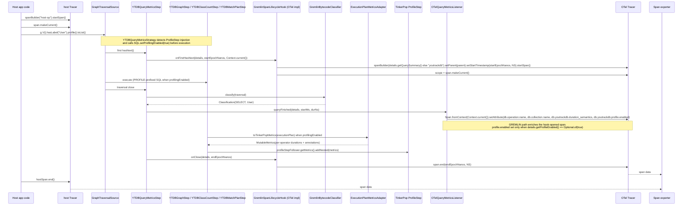
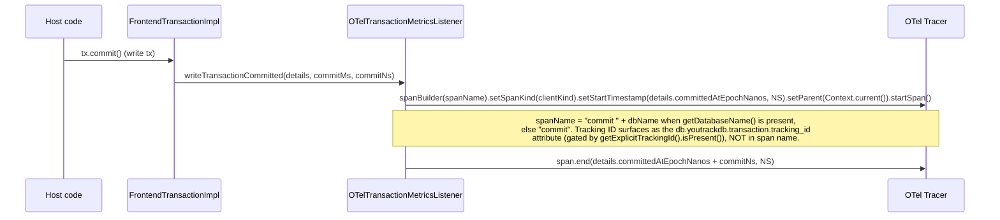
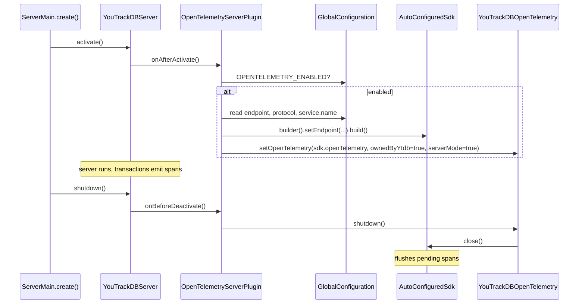

<!-- workflow-sha: 5db61a37462f0b28965113f39a81b6fcb1ed1340 -->
# YTDB-496 OpenTelemetry support — Design

## Overview

This design adds a new optional Maven module `youtrackdb-opentelemetry` that wires YTDB into `OpenTelemetry` across all three signal types: distributed tracing (spans from query and transaction listener callbacks), logs (every record emitted through YTDB's `LogManager` chokepoint, hard-context-correlated with the active span at emission time), and metrics (the existing `Profiler.getMetricsRegistry()` counter set surfaced through `OTel` async instruments at a configurable period). The result is that a host running embedded YTDB and an operator running a standalone server both get database telemetry — spans, correlated logs, and counter samples — visible in any `OTel`-compatible viewer. This design assumes familiarity with the existing `QueryMetricsListener` and `TransactionMetricsListener` firing sites in `YTDBQueryMetricsStep` and `FrontendTransactionImpl`, and with the `YTDBTransaction` open / commit / rollback lifecycle. The audience is contributors maintaining the metrics and transaction subsystems in `core`.

Today YTDB has an internal `QueryMetricsListener` SPI that fires only on Gremlin traversal close, plus a `TransactionMetricsListener` that fires on write-transaction commit, but the listeners are per-transaction and the project ships no OTel binding. Native SQL queries (the path used for `db.command(...)`, MATCH, and DDL) currently fire neither listener. The design closes that gap with two load-bearing additions: a global listener registry in `core` so an OTel listener registered once at startup auto-applies to every subsequent transaction; and a new listener fire site at the SQL session-boundary, applied as a thin wrapper on whatever `ResultSet` each `db.query()` / `db.command()` / `db.execute()` call returns. The wrapper class `InstrumentedSqlResultSet` (new, in `internal.core.db`) is installed inside the private `queryStartedLifecycle(...)` chokepoint that the idempotent SQL entry points on `DatabaseSessionEmbedded` funnel through: both `query(...)` overloads (which route cache hits, cacheable misses, and bypasses through it alike via `return queryStartedLifecycle(serveThroughCache(...))`), the idempotent branch of `executeInternal(...)`, and both `computeScript(...)` overloads; plus one inline wrap at the non-idempotent prefetch branch of `executeInternal(...)`, the sole entry-point return that does not pass through the chokepoint. The wrapper is the outermost layer above any [PR #1077](https://github.com/JetBrains/youtrackdb/pull/1077) cache-view construction. This relies on the verified-current YTDB-820 wiring (the cache result flows through `queryStartedLifecycle(...)`, not around it); §"SQL execution layer hook" carries the per-site detail, the standing assumption, and the re-verify-at-820-merge gate. The constructor captures a wall-clock start; what `executionTimeNanos` measures depends on the resolved `QueryMonitoringMode` (per the original observability design). `LIGHTWEIGHT` reports wall-clock from fire-site start to close via `GranularTicker` at ~10 ms granularity, with consumer idle time between `hasNext()` / `next()` calls included in the duration. `EXACT` instruments each delegated `hasNext()` and `next()` invocation with `System.nanoTime()` and reports the sum of per-call execution times (DB-side active time only, consumer idle gaps excluded), paying two syscalls per delegated call for sub-ms precision. SQL has no tag source, so the mode resolves to the per-TX default. Iteration delegates to the inner result-set with row counting, error capture, and (under `EXACT`) per-call timing accumulation; `close()` fires the listener with the mode-appropriate elapsed value. Every SQL statement type (SELECT, INSERT, UPDATE, DELETE, MATCH, DDL) and multi-statement scripts flow through this single outer-boundary fire site. Sub-plans called from MATCH steps, sub-query steps, and IF / WHILE control flow construct their own un-instrumented inner `LocalResultSet` instances via the existing 2-arg constructor and never reach the entry-point wrapper, so they do not double-fire. The exact return-sites, layer ordering, and constructor steps live in §"SQL execution layer hook"; the clock-source rules live in §"Span timing capture".

**Coordination with YTDB-820.** The forthcoming transaction-scoped query result cache ([PR #1077 design, YTDB-820 implementation](https://github.com/JetBrains/youtrackdb/pull/1077)) lands first and changes what these entry points return: on cache hit, and on cache miss for cacheable RECORD / MATCH / AGGREGATE shapes, the caller receives a `CachedResultSetView` rather than a `LocalResultSet`. The wrapper sits one layer above both, so a single fire site covers every inner-type the cache can produce: hits, misses for the cacheable shapes (including the aggregate path), the fallback when planner splicing fails, bypasses for non-deterministic queries, the per-query `NOCACHE` hint, nested calls under WHERE evaluation, and the disabled-cache default in v1. The wrapper has zero changes to `LocalResultSet.java`, which keeps YTDB-820's stream-slot substitution machinery untouched. The full matrix and its consequences live in §"SQL execution layer hook → Coordination with YTDB-820 cache contract".

A pair of static-utility classifiers in `core` (`GremlinBytecodeClassifier`, `SqlSyntaxClassifier`), called directly from their respective fire sites, extracts `db.operation.name` and `db.collection.name` so spans carry sem-conv v1.33.0 attributes. A Gremlin traversal whose execution falls back to per-step SQL (Path B in the [Gremlin-to-MATCH translator](https://github.com/JetBrains/youtrackdb/pull/1038) nomenclature) emits a parent-child hierarchy: one Gremlin span at `YTDBQueryMetricsStep.close()` plus one child SQL span at `InstrumentedSqlResultSet.close()`, related via OTel `Context.current()` propagation. Path A (translated Gremlin, post-PR-1038) emits one Gremlin span only because `YTDBMatchPlanStep` opens the underlying `SelectExecutionPlan` directly without going through the SQL entry points.

The TX listener side stays narrow on purpose: only `writeTransactionCommitted` and `writeTransactionFailed` fire, both for write transactions only, and the OTel implementation emits a standalone commit span with no YTDB-side TX-lifetime wrapper. Read-only transactions emit nothing on the TX listener and therefore no commit-side span. This matches the existing YTDB read-only-TX semantics (the TX listener never fires on a read-only close) and keeps mostly-read workloads from paying alloc-and-emit cost per query for an empty container span.

On the query side, a configurable slow-query threshold gates span emission inside `OTelQueryMetricsListener.queryFinished` so a host running heavy read traffic can drop fast successful queries before any tracer allocation. The global default is `OPENTELEMETRY_QUERY_SLOW_THRESHOLD_MILLIS=0` (emit-all) so spans surface immediately after `OPENTELEMETRY_ENABLED=true`; operators on read-heavy workloads opt into a positive value (e.g., `100`) to drop fast successful queries. Per-tag overrides go through `OPENTELEMETRY_QUERY_SLOW_THRESHOLD_TAG_RULES` (same format as the per-tag mode rules), resolved through a parallel `SlowQueryThresholdResolver` consuming `TagRule<Long>` on the same sealed interface. Errors bypass the gate because trace viewers are the primary investigation surface for failures; a 1 ms failing query still emits a span carrying `error.type` and the sanitized query text.

A second optional gate emits a wall-clock heartbeat sample: `OPENTELEMETRY_QUERY_HEARTBEAT_SAMPLE_MILLIS` (default `0` = disabled) sets a process-wide interval, and `OTelQueryMetricsListener.queryFinished` emits one span per interval regardless of query duration. The two gates compose disjunctively (heartbeat picks fast queries for visibility, slow-query catches latency outliers, errors always emit). The heartbeat carries no per-tag override; it samples the workload as a whole. Operators who need per-tag sampling streams configure downstream filtering on the OTel pipeline against `db.query.summary`. The mechanism counters the structural bias of random sampling (1% of queries skews toward fast queries because fast queries are simply more numerous); a wall-clock heartbeat is unbiased over time.

`YTDBTransaction` exposes a builder-style API for listener wiring: `withQueryMonitoringMode(mode)`, `withSlowQueryThresholdMillis(millis)`, `withTrackingId(id)`, `withQueryListener(listener)`, and `withTransactionListener(listener)` are separate fluent methods. `withTrackingId(String)` and `getTrackingId()` already exist on `YTDBTransaction` today (with explicit-when-set / `String.valueOf(getId())`-fallback semantics); what YTDB-496 adds is lifting `getTrackingId(): String` from `YTDBTransaction` only onto the `FrontendTransaction` interface so the SQL fire site and the commit fire site read the same accessor through the interface without downcasting to `YTDBTransaction`. The setter and the storage stay where they are.

Other subsystems restructured to fit.

**`QueryDetails` accessors.** Five new accessors on the nested `QueryMetricsListener.QueryDetails` SPI, each mapped one-to-one to a sem-conv v1.33.0 span attribute the OTel listener emits:

| Accessor | Type | Source at fire-site | Sem-conv mapping | Empty when |
|---|---|---|---|---|
| `getOperationName()` | `Optional<String>` | `GremlinBytecodeClassifier` (Gremlin) / `SqlSyntaxClassifier` (SQL) | `db.operation.name` | classifier returns empty for the shape |
| `getCollectionName()` | `Optional<String>` | same classifier; first FROM / INTO / UPDATE target or MATCH pattern node | `db.collection.name` | multi-target FROM, anonymous subquery, control-flow statement |
| `getDatabaseName()` | `Optional<String>` | `session.getDatabaseName()` at wrapper construction (SQL) / step fire (Gremlin) | `db.namespace` | session has no database name |
| `getErrorType()` | `Optional<String>` | exception class FQN from the try/catch around `statement.execute(...)` and the iteration loop | `error.type` plus span status `ERROR` plus slow-query gate bypass | query succeeded |
| `getResultCount()` | `OptionalLong` | row counter on `InstrumentedSqlResultSet` (SQL); row counter on `YTDBQueryMetricsStep` (Gremlin, increments after a successful `super.next()` on the terminal step) | `db.client.response.returned_rows` histogram input | consumer abandoned the result-set without `close()` |

**`getResultCount()` shape.** `OptionalLong.empty()` is distinct from `OptionalLong.of(0L)`: empty means "no signal" and the histogram skips the sample, `of(0L)` means "the query returned no rows" and produces a `0`-bucket sample. Both fire sites populate the counter. On the SQL side it lives on `InstrumentedSqlResultSet` and is correct for every inner result-set type (`LocalResultSet`, `CachedResultSetView`, `LocalResultSetLifecycleDecorator(prefetched)`); cache hits produce the same value as cache misses for the same query. On the Gremlin side it lives on `YTDBQueryMetricsStep` and covers both Path A (translated MATCH) and Path B (fallback bytecode) because `YTDBQueryMetricsStrategy.apply` appends the step at the tail of the pipeline (`traversal.addStep(metricsStep)` at `YTDBQueryMetricsStrategy.java:44`), so every traverser the consumer pulls flows through `super.next()` on this step; the counter increments only on a successful return, which preserves lazy iteration. Bulk-aware OLAP semantics are out of scope (YTDB is OLTP, traverser bulk is always 1), so `+= 1` per `next()` mirrors what `toList()` returns. See § "Sem-conv attribute mapping" for the full sem-conv table.

**`TransactionDetails` accessor.** The nested `TransactionMetricsListener.TransactionDetails` gains one accessor, `getDatabaseName()`. It maps to `db.namespace` on the commit span and to the bounded-cardinality span name `"commit " + dbName` (see § "Commit span emission"). Operation, collection, errorType, and resultCount are not needed at the TX level: commit is a single operation, write-failure has its own `writeTransactionFailed` callback, and TX-level row counts are not a sem-conv concept.

**Exception isolation widens.** The existing exception-isolation try/catch in `FrontendTransactionImpl` and `YTDBQueryMetricsStep` widens from `Exception` to the narrower-than-`Throwable` union `Exception | LinkageError | AssertionError`. The wider catch covers OTel-specific failure modes (a misconfigured SDK, missing exporter classes on the classpath, assertions firing inside OTel internals) without masking the two failure modes the JVM never recovers from cleanly: `VirtualMachineError` and `ThreadDeath`.

**`FrontendTransaction` accessors.** Four new methods on the `FrontendTransaction` interface so the SQL fire site and the commit fire site read consistent state without downcasting to `YTDBTransaction`:

- `getDefaultQueryMonitoringMode(): QueryMonitoringMode` exposes the per-TX fallback used by commit and by queries whose tag does not match any rule.
- `resolveQueryMonitoringMode(Optional<String> tag): QueryMonitoringMode` delegates to the process-global `QueryMonitoringModeResolver` for per-query mode selection from the query tag.
- `getSlowQueryThresholdOverrideNanos(): OptionalLong` exposes the per-TX slow-query threshold override set via `YTDBTransaction.withSlowQueryThresholdMillis(...)`, empty when unset. The fire site reads it once and carries it on `QueryDetails` so the gate in `OTelQueryMetricsListener` can apply it as the per-TX tier between the query-tag rule and the global default.
- `iterateAllQueryListeners(): Iterable<QueryMetricsListener>` exposes the merged global-snapshot + per-TX-list view the wrapper snapshots at construction.

The SQL hook also reuses the existing `FrontendTransaction.getId(): long`; no new tracking-id method is needed.

**`GlobalConfiguration` entries.** A family of `OPENTELEMETRY_*` entries drives server-mode SDK init plus the tag-rule table: master switch (`OPENTELEMETRY_ENABLED`), query-tag rule sets for mode / slow-query / heartbeat (`OPENTELEMETRY_QUERY_MODE_TAG_RULES`, `OPENTELEMETRY_QUERY_SLOW_THRESHOLD_*`, `OPENTELEMETRY_QUERY_HEARTBEAT_SAMPLE_MILLIS`), exporter wiring (OTLP endpoint, protocol, headers), two log-side entries `OPENTELEMETRY_LOGS_ENABLED` and `OPENTELEMETRY_LOGS_MIN_SEVERITY`, and three metric-side entries `OPENTELEMETRY_METRICS_ENABLED`, `OPENTELEMETRY_METRICS_PERIOD_MILLIS`, and `OPENTELEMETRY_METRICS_INCLUDED_GROUPS`.

In embedded mode the SDK resolution chain has three steps in priority order: host-provided via `YouTrackDBOpenTelemetry.setOpenTelemetry(otel)`, then `GlobalOpenTelemetry.get()` if the host configured the global, then a YTDB-built SDK auto-configured from `OPENTELEMETRY_*` config when neither of the first two yielded a real instance. The flag is never inert; ownership is tracked so `shutdown()` closes only the SDK YTDB created. In server mode YTDB always owns the SDK because the server is a standalone process; an `OpenTelemetrySdk` built from the same config entries wires through a `ServerLifecycleListener`-based plugin.

Alongside the three pillars the PR also ships a quick-start observability stack under `youtrackdb-opentelemetry/examples/docker-compose/` so a first-time operator goes from clone to first span in under five minutes without assembling the Collector / Jaeger / Loki / Prometheus / Grafana wiring from upstream docs. The stack is example-files-only (zero source-code edits in `core`, `server`, or the OTel module), uses pinned image versions, ships three pre-provisioned Grafana dashboards (overview, queries, storage), and wires Jaeger → Loki and Jaeger → Prometheus correlators so clicking a span navigates to the matching logs and metrics filtered by `trace_id` and `service.name`. A smoke script (`scripts/smoke.sh`) runs a minimal embedded query and exits non-zero when any pillar fails to land within 30 seconds, giving the optional CI job a deterministic signal that the example stack and the YTDB-side wiring agree. § "Quick-start observability stack" below covers the full deliverable list and the production-vs-local-dev trade-offs the example deliberately makes.

The rest of this document covers: Core Concepts (vocabulary primer), Class Design, Workflow, sem-conv attribute mapping, context propagation in embedded, Gremlin bytecode classification, SQL execution layer hook, OpenTelemetry logs integration, metrics integration, quick-start observability stack, SDK lifecycle for embedded vs server, listener registration and ordering, and the exception-isolation contract. The deep-mechanism content for the slow-query gate, the heartbeat sampler, the logs appender, the metrics bridge, and the Collector pipeline shape of the quick-start stack lives in the [`design-mechanics.md`](design-mechanics.md) companion file; the five corresponding sections here keep the TL;DR, the configuration entries operators read at configure time, and a Mechanism overview paragraph pointing into the companion.

## Core Concepts

This design introduces eleven load-bearing ideas. Each is named and used without re-definition later; if a downstream section references one, the relevant definition is here. Each entry pairs the new term with what it replaces, so the delta from the baseline is visible at a glance.

**Span.** An OpenTelemetry record covering one unit of work with a start timestamp, an end timestamp, a name, a kind (CLIENT / SERVER / INTERNAL / PRODUCER / CONSUMER), a status (OK / ERROR), and arbitrary key/value attributes. Replaces "nothing in YTDB" (no prior telemetry primitive). → §"Sem-conv attribute mapping" and §"Class Design".

**Trace and Context.** A trace is a tree of spans bound by a shared `traceId`; each child span carries a `parentSpanId`. `Context` is the OTel mechanism for propagating the current span through the call stack so that a span created inside a method automatically attaches as a child of the surrounding span. Replaces "no parent/child relationship between operations". → §"Context propagation in embedded".

**Listener registry (global).** A pair of `CopyOnWriteArrayList`s of `QueryMetricsListener` and `TransactionMetricsListener` instances held in a process-global `GlobalListenerRegistry` in `core` and exposed via static methods on `YourTracks` (the existing `final` utility class). Snapshotted by `FrontendTransactionImpl.beginInternal()` into per-TX fields before `txStartCounter` increments, so both Gremlin and native-SQL transactions share one fire path. Replaces "per-TX `withQueryListener` only", which made the config flag inert. → §"Listener registration and ordering".

**Sem-conv v1.33.0.** OpenTelemetry's stable semantic conventions for database client spans, dictating attribute names (`db.system.name`, `db.query.text`, etc.), their requirement levels (Required / Conditionally Required / Recommended / Opt-In), and the span-name fallback chain. Replaces "no vendor-neutral attribute schema". → §"Sem-conv attribute mapping".

**Query tagging and per-tag mode resolution.** An enum `QueryMonitoringMode` (co-located with `QueryMetricsListener` / `TransactionMetricsListener` in `internal/common/profiler/monitoring/`) selects what `executionTimeNanos` measures per query, matching the original observability design. `LIGHTWEIGHT` reports wall-clock duration from fire-site start to close via `GranularTicker` at ~10 ms granularity, with no syscall on the hot path and consumer idle time between `hasNext()` / `next()` calls included in the duration. `EXACT` instruments each delegated `hasNext()` and `next()` invocation with `System.nanoTime()` and reports the sum of per-call execution times (DB-side active time only, consumer idle gaps excluded), paying two syscalls per delegated call for sub-ms precision. The wall-clock start used for `startedAtMillis` and `getStartedAtEpochNanos()` is captured once at fire-site construction in both modes (via `Instant.now()` under `EXACT`, via the ticker under `LIGHTWEIGHT`); the two modes therefore differ in what duration they report, not just in clock resolution. **Each query resolves its mode independently from its tag** through a process-global `QueryMonitoringModeResolver`: rules configured at startup via `OPENTELEMETRY_QUERY_MODE_TAG_RULES` map tag matchers (exact / prefix / regex) to modes, first-wins; when no rule matches, the resolver falls back to the per-TX default set via `YTDBTransaction.withQueryMonitoringMode(...)`; when no per-TX default is set, the fallback is `LIGHTWEIGHT`. Tag source: Gremlin only, via `g.with(YTDBQueryConfigParam.querySummary, "X")`. SQL statements pass `Optional.empty()` for tag and resolve via the per-TX default — the resolver short-circuits on empty tag without walking the rule list. Two Gremlin traversals in the same transaction with different tags can use different modes; the commit fire site has no query tag and therefore uses the TX default. Replaces "always-EXACT timing" implied by the original design and the per-TX-snapshot scheme from earlier iterations of this design. → §"Query tagging and per-tag rule resolution", §"SQL execution layer hook", and §"Gremlin bytecode classification".

**Query source classification.** Two static-helper classifiers in `core` extract `db.operation.name` and `db.collection.name` for the two query sources YTDB supports. The Gremlin classifier dispatches by traversal shape: for translated traversals (Path A, post-[PR #1038](https://github.com/JetBrains/youtrackdb/pull/1038)) it reads the boundary step's precomputed pattern classification (`YTDBMatchPlanStep.getClassification()` — `collection` from the first alias class in the pattern at translation time, populated by `GremlinToMatchStrategy`; the operation slot stays unset in Phase 1) and derives the operation from the traversal's native suffix verbs; this design owns the boundary-step extension (see §"YTDBMatchPlanStep classification field"); for fallback traversals (Path B, the native TinkerPop pipeline when the translator declined) it walks the TinkerPop `Bytecode` instruction list to resolve the first source step (`V`/`E`/`addV`/`addE`/`drop`) and the first `hasLabel(X)` argument. The SQL classifier reads the parsed `SQLStatement` subclass (SELECT / INSERT / UPDATE / DELETE / MATCH / DDL) and the target class from the FROM / INTO / UPDATE clause. Both return `Optional.empty()` when the query shape doesn't yield clean values. Called directly from the existing fire sites: `YTDBQueryMetricsStep` for Gremlin, and `InstrumentedSqlResultSet` for SQL (a session-boundary wrapper installed at the three `DatabaseSessionEmbedded` SQL entry points as the outermost wrapper of whatever the entry point would otherwise return; the wrapper's constructor captures the start clock and `close()` fires the listener; per §"Coordination with YTDB-820 cache contract" the wrapper covers `LocalResultSet` and `CachedResultSetView` inner types uniformly). No SPI or ServiceLoader; the call sites parse before invoking, so the classifiers piggyback on parsing that runs anyway. Replaces "raw sanitized query string only". → §"Gremlin bytecode classification" (Gremlin rules table) and §"SQL execution layer hook" (SQL rules table and statement-subclass dispatch).

**Slow-query threshold (per-tag).** A wall-clock duration in milliseconds resolved per-query from the same query tag that drives mode selection. Global default `OPENTELEMETRY_QUERY_SLOW_THRESHOLD_MILLIS=0` (emit-all out of the box; operators opt into a positive threshold to drop fast successful queries); per-tag overrides via `OPENTELEMETRY_QUERY_SLOW_THRESHOLD_TAG_RULES` go through a process-global `SlowQueryThresholdResolver` consuming `TagRule<Long>` on the same sealed interface that powers mode resolution. Between the per-tag rule and the global default sits a per-TX override set via `YTDBTransaction.withSlowQueryThresholdMillis(...)`, mirroring the per-TX mode default; the resolution precedence is query-tag rule → per-TX override → global default. SQL statements (no tag source) resolve to the per-TX override when set, else the global default. When the resolved threshold is greater than zero, `OTelQueryMetricsListener.queryFinished` returns early before any span allocation if `executionTimeNanos < thresholdNanos` and the query did not throw. Errors always emit regardless. The global default is read at OTel listener construction time; the per-TX override and tag-rule resolution are per-query, so a long-running session can hit different thresholds for different tags and for transactions that set their own override. Replaces "all-or-nothing emission gated only on listener presence", which over-emitted on mostly-read workloads. → §"Slow-query threshold gating".

**Time-based query sampling (heartbeat).** A single global wall-clock interval in milliseconds. `OPENTELEMETRY_QUERY_HEARTBEAT_SAMPLE_MILLIS=0` (default, disabled); positive values emit one span per `N` ms regardless of duration, picked from whichever successful query finishes first after the interval elapses. The race for the "first query after the interval" slot is resolved by `AtomicLong.compareAndSet` on a per-listener `lastHeartbeatNanos` field, so under load exactly one query per window claims the heartbeat slot. No per-tag override: heartbeat samples the workload as a whole, and per-tag streams belong to downstream OTel pipeline filtering on `db.query.summary` if operators need them. Composes disjunctively with the slow-query gate (a query emits if either gate passes). Replaces "no sampling beyond the slow-query gate", which biased visibility toward latency outliers and left the fast-query workload invisible. → §"Time-based sampling".

**Explicit transaction tracking ID.** A host-provided string identifier passed to a transaction via `YTDBTransaction.withTrackingId(String)` (pre-existing on `YTDBTransaction` today). YTDB-496 lifts `getTrackingId()` from `YTDBTransaction` onto the `FrontendTransaction` interface so both fire sites read the same value through the interface without downcasting; the same work also moves the storage from `YTDBTransaction.trackingId` to `FrontendTransactionImpl` (one atomic commit) and rewires `withTrackingId(...)` to call the new package-private setter. Two accessors surface the value:

- `FrontendTransaction.getTrackingId(): String` — returns the explicit value when host set one, else falls back to `String.valueOf(getId())`. Used by non-OTel listeners and YTDB-internal logging that always want a stable string.
- `FrontendTransaction.getExplicitTrackingId(): Optional<String>` — returns `Optional.of(explicit)` when host set one via `withTrackingId(...)`, else `Optional.empty()`. The OTel listener uses this accessor to gate the `db.youtrackdb.transaction.tracking_id` span attribute: `details.getExplicitTrackingId().ifPresent(id -> span.setAttribute(...))`. Hosts that did NOT call the setter pay zero cardinality cost (attribute omitted). Hosts that DID call the setter get cross-system correlation; cardinality is the host's responsibility (a host templating a UUID per request blows cardinality consciously). No separate config flag — the explicit setter call IS the opt-in, by construction.

Both `QueryDetails.getTransactionTrackingId(): String` and `TransactionDetails.getTransactionTrackingId(): String` read through `getTrackingId()` for the always-stable fallback; `QueryDetails.getExplicitTrackingId(): Optional<String>` (new accessor) routes through `getExplicitTrackingId()` for OTel-side gating. → §"Class Design" and §"Listener registration and ordering".

**Log appender chokepoint.** YTDB's process-global `com.jetbrains.youtrackdb.internal.common.log.LogManager` extends `SLF4JLogManager`, whose single `log(...)` method funnels every log call from `core`, `embedded`, `server`, and the new `youtrackdb-opentelemetry` module into one SLF4J emit site at `SLF4JLogManager.log:98` (immediately before `logEventBuilder.log()`). The OTel module installs a `LogAppenderHook` (a new package-private interface in `core/.../common/log/`) on that emit site at SDK init via `SLF4JLogManager.installAppenderHook(LogAppenderHook)`, so every existing YTDB log call also feeds the OTel `LogRecordBuilder` pipeline without source-side changes and independent of which SLF4J binding is on the classpath (server mode runs on `slf4j-jdk14`; embedded hosts may bind Logback, `log4j-slf4j-impl`, or `slf4j-simple` — the hook fires for all of them because it sits below the facade, on the SLF4J side of every binding). The hook reads `Context.current()` at invocation time, so any log emitted inside a query- or transaction-listener span scope carries the active `traceId`/`spanId` automatically (hard-context correlation). Earlier iterations of this design attempted a JUL `Handler` on the root JUL logger, which catches records only when the SLF4J binding routes through JUL. The hook avoids that coupling. **Scope caveat**: the hook captures YTDB's own log calls only (every emit through `LogManager.instance()`). Third-party libraries that call SLF4J directly — Jackson, Netty, Guice, Lucene, the OTel exporter itself — are NOT captured. Operators wanting full coverage of host-process logs install the OTel ecosystem path (`opentelemetry-instrumentation-logback-appender` or its log4j equivalent) on their SLF4J binding alongside YTDB's hook; the recursive-cycle guards (per-thread re-entrance + `OPENTELEMETRY_LOGS_LOGGER_EXCLUSIONS` prefix filter) keep the OTel SDK's own logs from feeding back into YTDB's hook. Replaces "logs not integrated" (prior design scope). → §"OpenTelemetry logs integration".

**Profiler counter bridge.** YTDB's internal `Profiler.getMetricsRegistry()` is a process-global registry of `Metric<T>` instances (concrete shapes: `Gauge<T>`, `Stopwatch`, `TimeRate`, `Ratio`) updated by storage, cache, WAL, and transaction subsystems on their own threads, independent of OTel state. A new `OTelMetricsBridge` reads that registry through OTel async instruments (`ObservableLongCounter`, `ObservableLongGauge`, `ObservableDoubleHistogram`) at a `OPENTELEMETRY_METRICS_PERIOD_MILLIS`-driven cadence, surfacing a curated subset under sem-conv v1.33.0 DB metric names where the spec defines them as stable, plus the `youtrackdb.*` namespace for vendor-specific gauges. The bridge subscribes; it does not duplicate the underlying writer state. Subscribing is not a zero-core-change read: it requires two new public methods on `MetricsRegistry` (`forEachMetric(MetricVisitor)` for enumeration at `start()` and `addRegistrationListener(...)` for per-database metrics created after `start()`), plus a new `MetricGroup` enum on `MetricDefinition` to drive the `OPENTELEMETRY_METRICS_INCLUDED_GROUPS` filter; none of the three exist today, and §"Metrics integration" carries their shapes. Replaces "metrics not integrated" (prior design scope after M34's logs addition). → §"Metrics integration".

## Class Design

```mermaid
classDiagram
    class QueryMetricsListener {
        <<interface>>
        +queryFinished(QueryDetails, long, long) void
    }
    class TransactionMetricsListener {
        <<interface>>
        +writeTransactionCommitted(TransactionDetails, long, long) void
        +writeTransactionFailed(TransactionDetails, long, long, Exception) void
    }
    class QueryDetails["QueryMetricsListener.QueryDetails"] {
        <<interface>>
        +getQuery() String
        +getQuerySummary() String
        +getTransactionTrackingId() String
        +getExplicitTrackingId() Optional~String~
        +getOperationName() Optional~String~
        +getCollectionName() Optional~String~
        +getDatabaseName() Optional~String~
        +getErrorType() Optional~String~
        +getQuerySource() Optional~QuerySource~
        +getParentContext() Optional~Context~
        +getStartedAtEpochNanos() long
        +getResultCount() OptionalLong
        +getWherePresent() Optional~Boolean~
        +getOrderPresent() Optional~Boolean~
        +getLimitPresent() Optional~Boolean~
        +getFromClassCount() Optional~Integer~
        +getStepCount() Optional~Integer~
        +getHasSubtraversal() Optional~Boolean~
        +getInvokedVia() Optional~String~
        +getProfileEnabled() Optional~Boolean~
        +getFullScan() Optional~Boolean~
        +getCustomAttrs() Map~String,Object~
    }
    class QuerySource {
        <<enumeration>>
        GREMLIN
        SQL
    }
    class GremlinSpanLifecycleHook {
        <<interface>>
        +onFirstHasNext(QueryDetails, long startEpochNanos, Context parent) void
        +onClose(QueryDetails, long endEpochNanos) void
    }
    class YTDBQueryMetricsStep {
        -long rowCount
        +setLifecycleHook(GremlinSpanLifecycleHook) void
    }
    class TransactionDetails["TransactionMetricsListener.TransactionDetails"] {
        <<interface>>
        +getTransactionTrackingId() String
        +getDatabaseName() Optional~String~
        +getCommittedAtEpochNanos() long
    }
    class OTelQueryMetricsListener {
        -Tracer tracer
        -SpanKind clientKind
        -long defaultThresholdNanos
        -long defaultHeartbeatNanos
        -AtomicLong lastHeartbeatNanos
        +queryFinished(QueryDetails, long, long) void
    }
    class OTelTransactionMetricsListener {
        -Tracer tracer
        -SpanKind clientKind
        -long defaultCommitThresholdNanos
        +writeTransactionCommitted(TransactionDetails, long, long) void
        +writeTransactionFailed(TransactionDetails, long, long, Exception) void
    }
    class LogAppenderHook {
        <<interface>>
        +onLog(String requesterName, String dbName, org.slf4j.event.Level level, String formatString, String formattedMessage, Throwable thrown, long eventEpochNanos) void
    }
    class OTelLogAppender {
        -Logger otelLogger
        -int minSeverityNumber
        -boolean includeMessageBody
        -ThreadLocal~Boolean~ reentrant
        +onLog(String requesterName, String dbName, org.slf4j.event.Level level, String formatString, String formattedMessage, Throwable thrown, long eventEpochNanos) void
    }
    class OTelMetricsBridge {
        -Meter meter
        -ScheduledExecutorService scheduler
        -Set~MetricGroup~ includedGroups
        -Map~String,ObservableInstrument~ registered
        +start() void
        +stop() void
        +refresh() void
    }
    class YouTrackDBOpenTelemetry {
        -OpenTelemetry openTelemetry
        -boolean ownedByYtdb
        -boolean serverMode
        -Tracer tracer
        +setOpenTelemetry(OpenTelemetry) void
        ~setOpenTelemetry(OpenTelemetry, boolean ownedByYtdb, boolean serverMode) void
        +shutdown() void
        ~tracer() Tracer
        ~clientKind() SpanKind
        +skinnySpanFilter(SpanProcessor delegate) SpanProcessor$
    }
    class GremlinBytecodeClassifier {
        <<utility>>
        +classify(Traversal) Classification$
    }
    class YTDBMatchPlanStep["YTDBMatchPlanStep (PR #1038, extended with the classification field and the profile/explain surface)"] {
        +getClassification() Classification
        +getWasFullScan() Optional~Boolean~
        +setProfilingEnabled(boolean) void
        +isProfilingEnabled() boolean
        +toString() String
    }
    class YTDBGraphStep["YTDBGraphStep (Path B fallback; extended by the profile/explain surface)"] {
        +getWasFullScan() Optional~Boolean~
        +setProfilingEnabled(boolean) void
        +isProfilingEnabled() boolean
        +toString() String
    }
    class YTDBClassCountStep["YTDBClassCountStep (Path B fallback; extended by the profile/explain surface)"] {
        +getWasFullScan() Optional~Boolean~
        +setProfilingEnabled(boolean) void
        +isProfilingEnabled() boolean
        +toString() String
    }
    class ExecutionPlanMetricsAdapter {
        <<utility>>
        +toTinkerPopMetrics(ExecutionPlan) MutableMetrics$
    }
    class YTDBQueryMetricsStrategy["YTDBQueryMetricsStrategy (extended by the profile/explain surface for ProfileStep detection)"] {
        +apply(Traversal) void
    }
    class SqlSyntaxClassifier {
        <<utility>>
        +classify(SQLStatement) Classification$
    }
    class SqlSanitizer {
        +sanitize(String rawSql) String
    }
    class Classification {
        +operationName Optional~String~
        +collectionName Optional~String~
        +wherePresent Optional~Boolean~
        +orderPresent Optional~Boolean~
        +limitPresent Optional~Boolean~
        +fromClassCount Optional~Integer~
        +stepCount Optional~Integer~
        +hasSubtraversal Optional~Boolean~
        +customAttrs Map~String,Object~
    }
    class QueryMonitoringModeResolver {
        -List~TagRule~ rules
        -Map~String,Optional~ ruleOutcomeCache
        +resolve(Optional~String~ tag, QueryMonitoringMode txDefault) QueryMonitoringMode
        +global() QueryMonitoringModeResolver$
    }
    class SlowQueryThresholdResolver {
        -List~TagRule~ rules
        -Map~String,OptionalLong~ ruleOutcomeCache
        +resolve(Optional~String~ tag, long defaultNanos) long
        +global() SlowQueryThresholdResolver$
    }
    class TagRule {
        <<sealed interface>>
        +matches(String tag) boolean
        +value() T
    }
    class TagRuleExact["TagRule.Exact"] {
        -String tag
        -T value
    }
    class TagRulePrefix["TagRule.Prefix"] {
        -String prefix
        -T value
    }
    class TagRuleRegex["TagRule.Regex"] {
        -Pattern pattern
        -T value
    }
    class FrontendTransaction {
        <<interface>>
        +getDefaultQueryMonitoringMode() QueryMonitoringMode
        +resolveQueryMonitoringMode(Optional~String~ tag) QueryMonitoringMode
        +getSlowQueryThresholdOverrideNanos() OptionalLong
        +getTrackingId() String
        +getExplicitTrackingId() Optional~String~
        +iterateAllQueryListeners() Iterable~QueryMetricsListener~
    }
    class YTDBTransaction {
        +withQueryMonitoringMode(QueryMonitoringMode mode) YTDBTransaction
        +withSlowQueryThresholdMillis(long millis) YTDBTransaction
        +withTrackingId(String trackingId) YTDBTransaction
        +withQueryListener(QueryMetricsListener listener) YTDBTransaction
        +withTransactionListener(TransactionMetricsListener listener) YTDBTransaction
    }
    class InstrumentedSqlResultSet {
        -ResultSet inner
        -SQLStatement statement
        -String rawSql
        -Object args
        -FrontendTransaction currentTx
        -Iterable~QueryMetricsListener~ listeners
        -QueryMonitoringMode mode
        -io.opentelemetry.context.Context capturedContext
        -long startMillis
        -long startEpochNanos
        -long startNanoTime
        -long rowCount
        -Throwable caughtError
        +wrapIfListening(ResultSet, SQLStatement, String, Object, FrontendTransaction) ResultSet$
        +hasNext() boolean
        +next() Result
        +close() void
    }
    class OpenTelemetryServerPlugin {
        +onAfterActivate() void
        +onBeforeDeactivate() void
    }
    class SkinnySpanFilterProcessor {
        <<SpanProcessor>>
        -SpanProcessor delegate
        +wrap(SpanProcessor delegate) SpanProcessor$
        +onEnd(ReadableSpan span) void
    }
    QueryMetricsListener ..> QueryDetails : nests
    TransactionMetricsListener ..> TransactionDetails : nests
    QueryMetricsListener <|.. OTelQueryMetricsListener
    TransactionMetricsListener <|.. OTelTransactionMetricsListener
    OTelQueryMetricsListener --> YouTrackDBOpenTelemetry : tracer()
    OTelTransactionMetricsListener --> YouTrackDBOpenTelemetry : tracer()
    OTelQueryMetricsListener --> QueryDetails : reads operation / collection / namespace
    GremlinBytecodeClassifier --> Classification : returns
    GremlinBytecodeClassifier ..> YTDBMatchPlanStep : reads precomputed Classification for Path A
    SqlSyntaxClassifier --> Classification : returns
    TagRule <|.. TagRuleExact
    TagRule <|.. TagRulePrefix
    TagRule <|.. TagRuleRegex
    QueryMonitoringModeResolver --> TagRule : holds list of
    SlowQueryThresholdResolver --> TagRule : holds list of
    FrontendTransaction --> QueryMonitoringModeResolver : resolveQueryMonitoringMode delegates to global()
    OTelQueryMetricsListener --> SlowQueryThresholdResolver : gate resolves tag rule then per-TX override then global default
    YTDBTransaction --> FrontendTransaction : fluent builder stores tracking-id, mode, and slow-query threshold on
    YouTrackDBOpenTelemetry --> OTelQueryMetricsListener : populates defaultThresholdNanos and defaultHeartbeatNanos from config
    OpenTelemetryServerPlugin --> YouTrackDBOpenTelemetry : setOpenTelemetry(.., ownedByYtdb=true) / shutdown
    YouTrackDBOpenTelemetry ..> SkinnySpanFilterProcessor : wraps BatchSpanProcessor in YTDB-owned SDKs (D46)
    LogAppenderHook <|.. OTelLogAppender
    OTelLogAppender --> YouTrackDBOpenTelemetry : loggerProvider()
    OTelMetricsBridge --> YouTrackDBOpenTelemetry : meter()
    InstrumentedSqlResultSet ..> QueryDetails : builds at close()
    InstrumentedSqlResultSet ..> SqlSyntaxClassifier : lazy classify
    InstrumentedSqlResultSet ..> SqlSanitizer : lazy sanitize
    InstrumentedSqlResultSet ..> FrontendTransaction : iterateAllQueryListeners + resolveQueryMonitoringMode
    QueryDetails --> QuerySource : optional source
    YTDBQueryMetricsStep ..> GremlinSpanLifecycleHook : invokes onFirstHasNext / onClose
    YouTrackDBOpenTelemetry --> GremlinSpanLifecycleHook : installs OTel impl on each YTDBQueryMetricsStep
    YTDBQueryMetricsStrategy ..> YTDBMatchPlanStep : setProfilingEnabled(true) on ProfileStep injection
    YTDBQueryMetricsStrategy ..> YTDBGraphStep : setProfilingEnabled(true) on ProfileStep injection
    YTDBQueryMetricsStrategy ..> YTDBClassCountStep : setProfilingEnabled(true) on ProfileStep injection
    YTDBMatchPlanStep ..> ExecutionPlanMetricsAdapter : toTinkerPopMetrics at close
    YTDBGraphStep ..> ExecutionPlanMetricsAdapter : toTinkerPopMetrics at close
    YTDBClassCountStep ..> ExecutionPlanMetricsAdapter : toTinkerPopMetrics at close
```



The diagram covers the production classes the design introduces. Three interfaces in `core` are extended: `TransactionMetricsListener` and `QueryDetails` gain default methods (among them `QueryDetails.getParentContext(): Optional<Context>`, carrying the `io.opentelemetry.context.Context` the SQL fire site captured at wrapper construction so the listener parents the SQL span explicitly; the accessor is the only OTel type on the `QueryDetails` SPI, and `core` already compiles against `opentelemetry-context` for the wrapper's `capturedContext` field, so it adds no module dependency; and `QueryDetails.getSlowQueryThresholdOverrideNanos(): OptionalLong`, default `OptionalLong.empty()`, populated by the fire site from `FrontendTransaction.getSlowQueryThresholdOverrideNanos()` so the gate can apply the per-TX threshold tier); `QueryMetricsListener` itself stays unchanged but is consumed by a new impl; `FrontendTransaction` gains `getDefaultQueryMonitoringMode()` (renamed from the earlier `getQueryMonitoringMode()`), `resolveQueryMonitoringMode(Optional<String> tag)`, `getSlowQueryThresholdOverrideNanos(): OptionalLong` (the per-TX slow-query threshold override the fire site carries onto `QueryDetails`), `getTrackingId(): String` (lifted from `YTDBTransaction`; returns the explicit ID set via `YTDBTransaction.withTrackingId(...)` when present, else `String.valueOf(getId())`), and `iterateAllQueryListeners()`. `YTDBTransaction` already exposes four builder-style methods this design relies on (`withQueryMonitoringMode(mode)`, `withTrackingId(id)`, `withQueryListener(listener)`, `withTransactionListener(listener)`); YTDB-496 adds a fifth, `withSlowQueryThresholdMillis(long millis)`, the per-TX slow-query threshold override (parsed to nanos, stored on the transaction, read back through `FrontendTransaction.getSlowQueryThresholdOverrideNanos()`), and changes the `withQueryListener` / `withTransactionListener` storage from single-slot to additive (see §"Listener registration and ordering") but leaves the existing method signatures unchanged. Each method returns `this` so they chain.

Two new static-utility classes (`GremlinBytecodeClassifier`, `SqlSyntaxClassifier`) and one value record (`Classification`) land in `core` next to the existing parsing infrastructure. Gremlin's classifier dispatches by traversal shape: for translated traversals (Path A, when the step list contains a `YTDBMatchPlanStep` per [PR #1038](https://github.com/JetBrains/youtrackdb/pull/1038)) it reads `YTDBMatchPlanStep.getClassification()` (a lightweight value record carrying the matched pattern's collection that `GremlinToMatchStrategy` populated at translation time, with operation derived from the traversal verbs — see §"YTDBMatchPlanStep classification field"); for fallback traversals (Path B, when the translator declined) it walks the bytecode the same way `YTDBQueryMetricsStep.produceScript()` already does. The SQL classifier dispatches on the `SQLStatement` AST that the SQL execution entry points (`db.query()` / `db.command()` / `db.execute()`) already produce via `SQLEngine.parse(...)` before the entry point returns. The classifiers are pure functions, called directly from the existing fire sites; no SPI, no ServiceLoader.

`InstrumentedSqlResultSet` lands in `internal.core.db` next to `DatabaseSessionEmbedded` (`LocalResultSetLifecycleDecorator` and `LocalResultSet` sit in the sibling `internal.core.sql.parser` package). It implements `ResultSet`, holds a single `inner: ResultSet` reference plus snapshot state (start clock, listener iterable, classifier inputs), and delegates `hasNext()` / `next()` to `inner` while incrementing a row counter and capturing any thrown exception. `wrapIfListening(...)` is the static factory the three entry points call: when `currentTx.iterateAllQueryListeners()` is empty it returns `inner` directly (zero-overhead fast path); otherwise it allocates the wrapper, captures `Context.current()`, and stores the snapshot. `LocalResultSet.java` itself stays unchanged — the wrapper is the only new file the SQL execution layer hook ships on the result-set side.

Two process-global resolvers (both in `core/.../profiler/monitoring/`) reuse the same sealed `TagRule<T>` interface: `QueryMonitoringModeResolver` walks a `List<TagRule<QueryMonitoringMode>>` parsed once at startup from `OPENTELEMETRY_QUERY_MODE_TAG_RULES`; `SlowQueryThresholdResolver` walks a `List<TagRule<Long>>` parsed from `OPENTELEMETRY_QUERY_SLOW_THRESHOLD_TAG_RULES`. Both cache the rule-walk *outcome* per tag (an `Optional` whose emptiness means "no rule matched"), not the resolved value, in a bounded LRU. The caller-supplied fallback — the per-TX override, else the global default — is applied outside the cache, so a fallback that varies by transaction never leaks across transactions through the shared cache. The sealed `TagRule<T>` interface has three concrete shapes (`Exact`, `Prefix`, `Regex`) and is generic so the resolvers share the matcher hierarchy. The heartbeat gate has no resolver because it carries no per-tag override (see §"Time-based sampling"). Six classes in the new OTel module implement the integration (`OTelQueryMetricsListener`, `OTelTransactionMetricsListener`, `OTelLogAppender`, `OTelMetricsBridge`, `YouTrackDBOpenTelemetry`, `OpenTelemetryServerPlugin`), keeping the static dependency arrow one-way (`youtrackdb-opentelemetry` → `core`). `SqlSanitizer` is new in `core` alongside `SqlSyntaxClassifier` (no SQL sanitizer exists in the codebase today; only the Gremlin-side `ValueAnonymizingTypeTranslator` does) because both walk the parser-output AST that lives in `core`.

Both OTel listeners take a `SpanKind clientKind` constructor argument that selects between CLIENT and INTERNAL for the query span and the standalone commit span. INTERNAL is used when YTDB runs in-process with the host (embedded), CLIENT when YTDB runs as a standalone server process and the host is a network client. `YouTrackDBOpenTelemetry` resolves `clientKind` from how the SDK was wired: the `OpenTelemetryServerPlugin` invokes the package-private 3-arg variant `setOpenTelemetry(otel, ownedByYtdb=true, serverMode=true)` so CLIENT propagates to both listeners; every embedded entry point (host setter, `GlobalOpenTelemetry.get()` fallback, YTDB auto-configure) defaults `serverMode=false` so INTERNAL applies. The two flags carry separate concerns: `ownedByYtdb` controls whether `shutdown()` closes the SDK; `serverMode` controls the CLIENT/INTERNAL split on emitted spans. See §"Sem-conv attribute mapping" for the sem-conv rule that drives this choice.

The producer copies each `Classification(operationName, collectionName)` value into the `QueryDetails` accessors before the listener fires, plus `QuerySource.GREMLIN` for the Gremlin fire site and `QuerySource.SQL` for the SQL fire site so `queryFinished` reads `details.getQuerySource()` to route between enrich-existing-span and create-new-span paths. No thread-local suppression mechanism is needed for nested SQL spans inside Gremlin traversals: a `GremlinSpanLifecycleHook` installed on each `YTDBQueryMetricsStep` opens the Gremlin span at first `hasNext()` and ends it at `close()` after `queryFinished` returns; inner SQL spans emitted by `InstrumentedSqlResultSet.close()` read `Context.current()` at construction so they become children of the active Gremlin span automatically. The hook interface lives in `core` next to `YTDBQueryMetricsStep`; the OTel-module impl installs itself via a `FinalizationStrategy` that runs after `YTDBQueryMetricsStrategy` and calls `step.setLifecycleHook(...)` on each injected step. See §"Context propagation in embedded" for the four-step lifecycle and parent-child relationship.

`OTelQueryMetricsListener` and `OTelTransactionMetricsListener` are independent — the query listener takes its parent context from `Context.current()` at fire time (the host's active span, when wrapped), not from any TX-side state. The two listeners are wired alongside each other by `YouTrackDBOpenTelemetry` but share no fields or callbacks. Multiple OTel facades coexisting in the same JVM (test fixtures spinning up a fresh SDK per test method) are independent for the same reason.

`OTelQueryMetricsListener` takes two additional constructor arguments alongside the existing `Tracer` and `SpanKind` pair: `long defaultThresholdNanos` populated by `YouTrackDBOpenTelemetry` from `OPENTELEMETRY_QUERY_SLOW_THRESHOLD_MILLIS` (default `0` = emit-all, multiplied to nanoseconds) and `long defaultHeartbeatNanos` populated from `OPENTELEMETRY_QUERY_HEARTBEAT_SAMPLE_MILLIS` (default `0`, disabled). Both are read once at SDK init. The listener also owns an `AtomicLong lastHeartbeatNanos` field initialized to `0` and updated by `compareAndSet` when a query claims the heartbeat slot.

At each fire the listener evaluates two gates. First the heartbeat gate: if `defaultHeartbeatNanos > 0` and `now - lastHeartbeatNanos >= defaultHeartbeatNanos`, the listener CAS-claims the slot and emits. Otherwise the slow-query gate runs: `SlowQueryThresholdResolver.global().resolve(querySummary, details.getSlowQueryThresholdOverrideNanos().orElse(defaultThresholdNanos))` — the per-TX override carried on `QueryDetails` takes the fallback slot between the query-tag rule and the cached global default; if the resolved threshold is positive and `executionTimeNanos < thresholdNanos`, the listener returns early. On the SQL path the early return skips all span allocation; on the Gremlin path the span is already allocated by the lifecycle hook at first `hasNext()` (parent-child propagation requires it during iteration), so an early return leaves a "skinny" Gremlin span without sem-conv attributes. A bundled `SkinnySpanFilterProcessor` (default ON via `OPENTELEMETRY_GREMLIN_DROP_SKINNY_SPANS=true`) wraps the export pipeline in YTDB-owned SDKs so skinny Gremlin spans never reach the exporter; operators debugging gate configuration set the flag to `false` to surface them in the trace viewer (D46). Operators who own the SDK (host-provided `OpenTelemetry` via `setOpenTelemetry(..., ownedByYtdb=false)` or via `GlobalOpenTelemetry.set(...)` before YTDB resolves) opt in by wrapping their span processor with `YouTrackDBOpenTelemetry.skinnySpanFilter(...)`. Errors bypass both gates through `QueryDetails.getErrorType()`, populated by both fire sites from the caught exception's class FQN (see §"Slow-query threshold gating" and §"Time-based sampling" for the gate pseudocode and the error-bypass contract).

Class Design is a structural reference section; edge cases for each component live in the mechanism sections this section points to.

### References
- D-records: D1, D2, D5, D8, D9, D46 (bundled `SkinnySpanFilterProcessor` referenced in the gate-overview paragraph above; full mechanism in `design-mechanics.md §"Slow-query threshold gating"` → bundled skinny-span filter)
- Invariants: Span kind by role
- Mechanics: none (single-file design)

## Workflow

The three diagrams below show, in order, a query span attaching to the host's active span, a standalone commit span emitted for a write transaction, and the server-mode SDK boot/shutdown sequence driven by `ServerLifecycleListener` callbacks. The first two capture the synchronous-on-calling-thread property the design relies on for `Context.current()` to resolve to the host's span; the cross-section §"Context propagation in embedded" carries the prose argument.

### Query span lifecycle in embedded



The flow shows that the host code's active span becomes the parent of the YTDB query span automatically, because `Context.current()` resolves on the same thread the host called `makeCurrent()` on. The `GremlinSpanLifecycleHook` (the OTel impl installed on each `YTDBQueryMetricsStep`) opens the Gremlin span at the step's first `hasNext()` and ends it at `close()`. The classifier runs in `YTDBQueryMetricsStep` before the listener fires, populating `QueryDetails.getOperationName()` and `getCollectionName()`; `OTelQueryMetricsListener.queryFinished` reads them and sets the `db.operation.name` / `db.collection.name` attributes on that hook-opened span rather than creating a span of its own (see §"Context propagation in embedded").

The diagram also shows the Profile branch (participants `SQL`, `EPMA`, `PS`): when `.profile()` is present in the traversal, `YTDBQueryMetricsStrategy` flips `setProfilingEnabled(true)` on each YTDB-side SQL step before execution, the step prepends `PROFILE ` to its SELECT or MATCH SQL, the OTel listener sets the low-cardinality `db.youtrackdb.profile.enabled = true` attribute when `details.getProfileEnabled()` returns `Optional.of(true)`, and the step pushes a `MutableMetrics` instance to the following `ProfileStep.getMetrics()` via `ExecutionPlanMetricsAdapter`. Unprofiled traversals skip every arrow involving `SQL` / `EPMA` / `PS`. See §"Explain and Profile integration" for the full mechanism.

The SQL path is symmetric. `InstrumentedSqlResultSet`, the session-boundary wrapper installed inside the `queryStartedLifecycle(...)` chokepoint the idempotent SQL entry points share (plus the inline wrap at the non-idempotent `executeInternal(...)` branch), so it wraps cache hits, cacheable misses, and bypasses uniformly, plays the role of `YTDBQueryMetricsStep` as the listener fire site: the constructor captures the start clock right after the entry point's `statement.execute(...)` call returns, and `close()` fires the listener. `SqlSyntaxClassifier` replaces `GremlinBytecodeClassifier` for the accessor population. Span name construction, attribute mapping, and parent-context resolution are identical from the listener's point of view, because the listener reads `QueryDetails` accessors that have already been populated by whichever classifier ran. The wrapper holds the inner `ResultSet` reference (`LocalResultSet` today; `LocalResultSet` or `CachedResultSetView` once YTDB-820 lands) without inspecting its concrete type for fire-site purposes. See §"SQL execution layer hook" for the SQL-side anatomy.

### Commit span emission for write transactions



`writeTransactionCommitted` fires only for write transactions per existing YTDB semantics. A read-only transaction's implicit close path emits nothing on the TX listener and therefore no commit span. The participant box represents `FrontendTransactionImpl` because the listener fire happens inside `notifyMetricsListener()` on the committing thread, and `YTDBTransaction.commit()` delegates to it through the Gremlin and native-SQL paths alike. The commit span takes its parent from `Context.current()` (host span if the host wrapped the commit, root otherwise); no YTDB-internal TX wrapper span is created. **Span name is bounded-cardinality** per sem-conv §"Span name SHOULD be of low cardinality": `"commit"` when no database name is available, `"commit " + dbName` when `TransactionDetails.getDatabaseName()` returns a value and `OPENTELEMETRY_COMMIT_SPAN_NAME_INCLUDES_DBNAME` is `true` (the default). Tracking ID is NEVER included in the span name — a monotonic-counter fallback or per-request UUID would blow span-name cardinality the same way it would blow attribute-value cardinality. The tracking ID surfaces only as the `db.youtrackdb.transaction.tracking_id` attribute, and only when the host explicitly called `withTrackingId(...)` (gated by `getExplicitTrackingId().isPresent()` per D17). `writeTransactionFailed` follows the same shape with `error.type` populated and span status set to ERROR.

**Edge case: multi-tenant hosts with thousands of databases.** Default `"commit " + dbName` keeps span-name cardinality bounded for typical deployments (tens to hundreds of databases). Self-hosted multi-tenant SaaS where every tenant owns a separate YouTrackDB database can grow span-name cardinality into the thousands, which strains some trace backends (Tempo, Jaeger) whose default span-name aggregation paths assume low cardinality. Operators in that situation set `OPENTELEMETRY_COMMIT_SPAN_NAME_INCLUDES_DBNAME=false` to drop dbName from the span name; the database identity stays available as the `db.namespace` attribute, where trace backends index it cheaply and filter on it on demand. Default remains `true` because most deployments benefit from per-database span names in the viewer.

### Server-mode SDK lifecycle



The plugin is ServiceLoader-discovered: YTDB-496's server-mode SDK wiring adds a `ServiceLoader.load(ServerLifecycleListener.class)` pass to `YouTrackDBServer.activate()` (today the server honors only explicit `registerLifecycleListener(...)` calls; see §"SDK lifecycle: embedded vs server" server path). When the new module is not on the classpath, the plugin doesn't load and the server runs with no OTel cost.

Workflow is a sequence-diagram reference section; per-mechanism edge cases live in the sections each diagram points to.

### References
- D-records: D1, D2, D4
- Mechanics: none

## Sem-conv attribute mapping

**TL;DR.** Every emitted query span carries `db.system.name="youtrackdb"` plus a fallback chain of sem-conv attributes filled in to the extent the source allows. Span name follows the v1.33.0 chain: `db.query.summary` → `db.operation.name db.collection.name` → `db.collection.name` → `db.system.name`. Query text comes from the source-appropriate sanitizer: `ValueAnonymizingTypeTranslator` for Gremlin (existing), `SqlSanitizer` for SQL (new in `core`).

The full mapping per attribute:

| Attribute | Requirement | Source | Notes |
|---|---|---|---|
| `db.system.name` | Required | constant `"youtrackdb"` | sem-conv §"Notes" allows custom value when not on well-known list |
| `db.namespace` | Conditionally Required | `QueryDetails.getDatabaseName()` (Gremlin: `session.getDatabaseName()` at the `YTDBQueryMetricsStep` fire site; SQL: same at the `InstrumentedSqlResultSet` fire site, populated when the wrapper is constructed) | this design adds the default accessor on both `QueryDetails` and `TransactionDetails`; omitted when the session has no name |
| `db.collection.name` | Conditionally Required | classifier result `.collectionName` | absent for multi-class traversals / anonymous SQL FROM subqueries |
| `db.operation.name` | Conditionally Required | classifier result `.operationName` | one of `SELECT` / `INSERT` / `UPDATE` / `DELETE` / `MATCH` / `CREATE` / `ALTER` / `DROP` |
| `db.query.text` | Recommended | `QueryDetails.getQuery()` | already sanitized: Gremlin via `ValueAnonymizingTypeTranslator`, SQL via `SqlSanitizer` |
| `db.query.summary` | Recommended | `QueryDetails.getQuerySummary()` if set, else `"{operation} {collection}"` if both present | client-provided summary wins |
| `db.response.status_code` | Conditionally Required | YTDB error code if available | currently no canonical YTDB error-code field; omitted in YTDB-496 |
| `error.type` | Conditionally Required (on failure) | exception class FQN | set on the standalone commit span at `writeTransactionFailed`, on the query span when `statement.execute(...)` throws; also exposed via `QueryDetails.getErrorType()` so the slow-query threshold gate (§"Slow-query threshold gating") can bypass on error |
| `server.address` / `server.port` | Recommended | from server config in server mode | embedded mode omits |
| `db.response.returned_rows` | Opt-In | `QueryDetails.getResultCount()`, populated by both fire sites: `InstrumentedSqlResultSet` on each successful `next()` (SQL), `YTDBQueryMetricsStep` on each successful `super.next()` on the terminal step (Gremlin) | the SQL counter lives on the wrapper and is correct for both `LocalResultSet` and `CachedResultSetView` inner result-sets (§"Coordination with YTDB-820 cache contract"); the Gremlin counter covers both Path A and Path B because the metrics step is appended at the tail of the pipeline |

Span name fallback examples. Gremlin: a query labeled with `g.with(YTDBQueryConfigParam.querySummary, "findActiveUsers")...` produces `findActiveUsers`. An unlabeled `g.V().hasLabel("User").has("active", true).toList()` produces `SELECT User`. SQL: `db.command("SELECT FROM User WHERE active = true")` produces `SELECT User`. `db.command("MATCH {class:User, as:u}-knows->{class:User, as:f} RETURN u, f")` produces `MATCH User`. A shape that defies classification (Gremlin `g.V().union(...).path()` or SQL `SELECT FROM (SELECT FROM ...)`) produces `youtrackdb`.

Gremlin DSL passthrough (`g.yql(...)` / `g.command(...)`) examples per D40:

- `g.yql("SELECT FROM User WHERE name = ?", "Alice")`: outer Gremlin span produces `SELECT User` (extracted from `CallStep.parameters["command"]` via `SqlSyntaxClassifier`), `db.query.text = "SELECT FROM User WHERE name = ?"` (sanitized), `db.youtrackdb.gremlin.dsl_method = "yql"`, `db.youtrackdb.gremlin.statement_count = 1`. Inner SQL span carries identical `db.*` attributes plus `db.youtrackdb.sql.invoked_via = "gremlin_dsl"`. Both attach to `Context.current()` parent-child via D20.
- `g.command("CREATE INDEX User.email UNIQUE")` (DDL): outer Gremlin span produces `CREATE User` (DDL routes through `acquireSession()` + `schemaSession.command(SQLStatement, Map)` → `executeInternal()` per D39). `db.youtrackdb.gremlin.dsl_method = "command"`. Inner SQL span emits with `db.operation.name = "CREATE"`, `db.collection.name = "User"`, sanitized DDL unchanged.
- `g.yql("BEGIN").yql("INSERT INTO Order SET amount = ?", 100).yql("COMMIT")` (chain): outer Gremlin span produces `INSERT Order` (first non-administrative statement), `db.youtrackdb.gremlin.statement_count = 3`, `db.youtrackdb.gremlin.has_transaction_control = true`, `db.youtrackdb.gremlin.statements_summary = "BEGIN; INSERT Order; COMMIT"`. One inner SQL span for INSERT (BEGIN and COMMIT short-circuit in `executeCommand` before reaching `session.execute(SQLStatement, Map)`), plus a standalone commit span via the existing `TransactionMetricsListener` (D3).
- `g.V().has("name", "Alice").yql("UPDATE Order SET status = ?", "shipped")` (mixed shape): outer Gremlin span classified by normal Path B graph-step walk (e.g., `SELECT V`), `db.youtrackdb.gremlin.has_graph_steps = true`, `db.youtrackdb.gremlin.statement_count = 1`, `db.youtrackdb.gremlin.embedded_sql.0 = "UPDATE Order SET status = ?"`. One inner SQL span per traverser invocation of the yql step.
- `g.yql("BEGIN")` standalone: outer Gremlin span produces `BEGIN`, `db.youtrackdb.gremlin.has_transaction_control = true`, no inner SQL span (administrative short-circuit).
- `g.yql("")` empty command: outer Gremlin span produces `youtrackdb` (catch-all), `db.youtrackdb.gremlin.statement_count = 0`, `db.youtrackdb.gremlin.no_op = true`; no inner SQL span (YTDBCommandService short-circuits at `command.isEmpty()`).

Span kinds per role follow sem-conv v1.33.0 §"Span kind", which mandates CLIENT for over-network DB calls and INTERNAL for in-process and in-memory database libraries. YTDB satisfies both definitions in different deployments, so the kind is mode-aware: in embedded mode the query span and the standalone commit span are INTERNAL (YTDB runs in-process with the host); in server mode they are CLIENT (YTDB runs as a separate process the host reaches over the network). No SERVER / PRODUCER / CONSUMER spans are emitted by YTDB, and no YTDB-side INTERNAL wrapper span parents the query or commit spans — both attach directly to `Context.current()`. The listener tests (`OTelGremlinQueryTest`, `OTelSqlQueryTest`, `OTelTransactionMetricsListenerTest`) parametrize over `clientKind` so each test exercises both INTERNAL (embedded default) and CLIENT (server-plugin path), asserting the positive cases on `SpanData.getKind()` and the negative case (no SERVER / PRODUCER / CONSUMER spans) against the in-memory exporter.

### YouTrackDB vendor attributes (intro)

**TL;DR.** OpenTelemetry's `db.<system>.*` prefix carries DB-implementation-specific structural fields beyond the standard `db.*` set; YTDB-496 reserves the `db.youtrackdb.*` namespace and ships an initial set of seven classifier-derived structural attributes (populated by `GremlinBytecodeClassifier` / `SqlSyntaxClassifier` during the parser-output walk that already extracts operation and collection), one fire-site mode-derived attribute (`db.youtrackdb.duration_semantics`) populated from the resolved `QueryMonitoringMode` at emission time, plus one host-set attribute (`db.youtrackdb.transaction.tracking_id`) for cross-system correlation. Values are constrained to four bounded shapes (`boolean`, `small int`, `enum`, `host-discipline`) so trace consumers can group and filter queries by structural shape without paying for high-cardinality storage. Higher-resolution fields (predicate values, sort columns, property keys, per-operator timing) stay out of MVP and ship in a follow-up ticket once production demand surfaces.

Initial attribute set (MVP):

Every `Cardinality` cell across the four tables in this section uses one of four bounded shapes: `boolean`, `small int (range)`, `enum (N values)`, or `host-discipline (cap)`. The "Cardinality policy" paragraph later in this section covers the closure rule and rationale.

| Attribute | Source | Cardinality | Notes |
|---|---|---|---|
| `db.youtrackdb.where_present` | SQL: presence of WHERE / Gremlin: presence of `has(...)` / `where(...)` step | `boolean` | filter trace by "queries with predicates" vs unconditional scans |
| `db.youtrackdb.order_present` | SQL: presence of ORDER BY / Gremlin: presence of `order()` step | `boolean` | filter by "sorted queries" |
| `db.youtrackdb.limit_present` | SQL: presence of LIMIT / Gremlin: presence of `limit(...)` / `range(...)` / `tail(...)` step | `boolean` | filter by "bounded queries" |
| `db.youtrackdb.from_class_count` | SQL: count of FROM targets / Gremlin: count of top-level `V(...)` / `E(...)` start steps | `small int (1–3 typical)` | flag multi-target queries |
| `db.youtrackdb.step_count` | Gremlin only: count of top-level bytecode instructions | `small int (1–20 typical)` | rough complexity proxy; SQL omits |
| `db.youtrackdb.has_subtraversal` | Gremlin only: presence of any `__.*` sub-traversal or `match(...)` pattern | `boolean` | flag composite Gremlin shapes; SQL omits |
| `db.youtrackdb.gremlin.path` | Gremlin only: `"A"` when the classifier dispatched to the translated boundary step (`YTDBMatchPlanStep` present), `"B"` when the bytecode walk fired (translator declined) | `enum (2 values: "A", "B")` | distinguishes translated vs fallback traversals; lets dashboards filter Path B parent-plus-child duration double-counts without resorting to `parent_span_id IS NULL` heuristics |
| `db.youtrackdb.duration_semantics` | resolved `QueryMonitoringMode` at the fire-site: `"active_time"` under `EXACT` (span `executionTimeNanos` is the sum of per-call `hasNext()` / `next()` deltas, consumer idle excluded); `"wall_clock"` under `LIGHTWEIGHT` (span `executionTimeNanos` is the ticker delta from fire-site start to close, consumer idle included). Commit spans always emit `"wall_clock"` because commit has no streaming consumer loop, so active-time and wall-clock collapse to the same value. | `enum (2 values: "wall_clock", "active_time")` | required slice dimension for any histogram aggregating `db.client.response.duration` across queries with potentially differing modes (per-tag mode rules can produce mixed-mode spans inside one TX); dashboards aggregating cross-tag without slicing on this attribute mix two duration semantics in the same bucket |
| `db.youtrackdb.transaction.tracking_id` | `FrontendTransaction.getExplicitTrackingId(): Optional<String>` — emits attribute iff `Optional.isPresent()`, i.e. iff the host called `withTrackingId(...)` | `host-discipline (host's chosen ID string; UUID-per-request blows cardinality)` | the default fallback `String.valueOf(getId())` is NEVER emitted as an attribute — the OTel listener reads `getExplicitTrackingId()` and skips the attribute when `Optional.empty()`. No config flag: the explicit setter call IS the opt-in, by construction. |

Advisor-foundation namespace (`db.youtrackdb.advisor.*`). A reserved sub-namespace carrying low-cardinality boolean / small-int flags that an advisory dashboard (Phase 2 follow-up per D42) consumes to recommend operator-tunable settings. `cross_class_count` rides the same classifier walk as the structural attributes above. `full_scan` is sourced separately at the fire-site by walking the built execution plan, because index-vs-class-scan is a planner decision not derivable from parser output. Both follow the same bounded-cardinality policy and are plain span attributes, so operators with custom dashboards can already filter on them to flag problematic queries ahead of the Phase 2 dashboard. Initial set:

| Attribute | Source | Cardinality | Recommendation downstream |
|---|---|---|---|
| `db.youtrackdb.advisor.full_scan` | leaf source step in the built execution plan (collected by walking `ResultSet.getExecutionPlan().getSteps()` at fire-site close): `FetchFromClassExecutionStep` or `FetchFromCollectionExecutionStep` ⇒ `true`; `FetchFromIndexStep` / `FetchFromIndexedFunctionStep` / `FetchFromIndexValuesStep` / `FetchFromRidsStep` ⇒ `false`; metadata virtual tables (`FetchFromIndexManagerStep` / `FetchFromDatabaseMetadataStep` / `FetchFromStorageMetadataStep`) and `FetchFromVariableStep` ⇒ attribute omitted. Path B Gremlin: OR-reduce of per-step `wasFullScan` across `YTDBGraphStep` / `YTDBClassCountStep`. Path A Gremlin: `YTDBMatchPlanStep.getWasFullScan()` walks the MATCH plan's per-alias leaves (same `FetchFrom*` family) with identical precedence. | `boolean` | "Consider adding an index on `<class>.<property>`" |
| `db.youtrackdb.advisor.cross_class_count` | SQL: multi-target FROM without join hints / Gremlin: multiple `V(...)` start steps | `small int (0 = single-class baseline, ≥2 = multi-class candidate)` | "Cross-class query may benefit from splitting into two indexed queries" |

`cross_class_count` rides the existing classifier walk and lands as one additional optional field on the `Classification` record per D19's future-extension policy (multi-target FROM and `V(...)` start-step counts are parser-output shape, no schema lookup). `full_scan` does NOT live on `Classification`. The signal is not derivable from parser output: index-vs-class-scan is a planner decision available only after `SelectExecutionPlan.start()` runs. The fire-site walks `ResultSet.getExecutionPlan().getSteps()` once at close (cost: O(plan depth), one `instanceof` per leaf, dominated by the listener call itself) and populates a new lazy `QueryDetails.getFullScan(): Optional<Boolean>` accessor. Per-leaf taxonomy:

- `FetchFromClassExecutionStep`, `FetchFromCollectionExecutionStep` ⇒ `Optional.of(true)`: full class or full collection scan; recommendation "add an index" applies.
- `FetchFromIndexStep`, `FetchFromIndexedFunctionStep`, `FetchFromIndexValuesStep`, `FetchFromRidsStep` ⇒ `Optional.of(false)`: indexed fetch (`FetchFromIndexValuesStep` is an index-only sort scan; the recommendation does not apply because an index is in use even when used for ORDER BY only) or explicit-RID lookup.
- `FetchFromIndexManagerStep`, `FetchFromDatabaseMetadataStep`, `FetchFromStorageMetadataStep`, `FetchFromVariableStep` ⇒ `Optional.empty()`: system-metadata virtual tables and context-variable iteration; the advisor's recommendation does not apply, attribute omitted.

When a query reads from a single source the plan has one leaf and `full_scan` is that leaf's verdict from the taxonomy above. Several shapes read from more than one source, so the plan carries several leaves: `UNION`, multi-target `FROM` (`SELECT FROM A, B`), and sub-plans nested inside `ParallelExecStep` / `LetExpressionStep` / `LetQueryStep`. For those, the fire-site descends recursively through the wrapping steps, collects every leaf source-step, and collapses their verdicts into one with the precedence `true` beats `false` beats `empty`: if any leaf is a full scan the query reports `true`; otherwise if any leaf is indexed it reports `false`; only when every leaf is `empty` (metadata virtuals, variable iteration) is the attribute omitted. `true` dominates because a single full-scanning leaf is the actionable signal regardless of what the other leaves did. Example: `SELECT FROM Person WHERE id = ? UNION SELECT FROM Company` reports `true` (Person hits an index, Company scans).

The attribute is omitted entirely when there is no plan to walk: multi-statement scripts (`computeScript` returns no single plan), a query that is itself an `EXPLAIN` / `PROFILE` (the plan comes back as result rows rather than executing), and a result-set the consumer abandoned before iterating (`getExecutionPlan()` is still null).

Gremlin follows the same rule. Path B (per-step fallback) produces one `wasFullScan` per `YTDBGraphStep` / `YTDBClassCountStep` and OR-reduces them; Path A (translated MATCH) walks `YTDBMatchPlanStep.getWasFullScan()` over the MATCH plan's per-alias leaves, same `FetchFrom*` family, same precedence.

Out of MVP (high-cardinality, deferred to follow-up):

- specific predicate values (`age > 30`, `name = "Alice"`) — every distinct literal blows up cardinality
- specific ORDER BY columns or `by(...)` keys — user-controlled, schema-dependent
- specific property keys read via `values(...)` or projection — same cardinality concern as ORDER BY keys
- full execution-plan structure (per-operator timing, per-step row counts) — already covered by the § Non-Goals bullet on per-operator timing; the follow-up ticket sources data from `SQLProfiler` and emits span events rather than span attributes to avoid polluting the per-span attribute set

Cardinality policy. Two axes have to stay bounded for these attributes to cost a trace backend little: how many distinct keys exist, and how many distinct values each key takes. The key set is closed, meaning the four tables above are the complete list of `db.youtrackdb.*` keys; the only key that multiplies is `db.youtrackdb.gremlin.embedded_sql.N`, capped at N = 0..2 (at most 3 per outer span). Each value is held to one of the four bounded shapes (`boolean`, `small int`, `enum`, `host-discipline`). Both axes matter because backends index per key per distinct value, so total cost tracks the product of the two; bounding one alone still blows up. The `host-discipline` shape is the deliberate exception: YTDB caps the structural side, and the host's query content or explicit choice carries any residual cardinality risk consciously (a host templating a UUID per request into `db.youtrackdb.transaction.tracking_id` blows value-cardinality and owns that). The four-shape constraint is enforced for every new attribute under `db.youtrackdb.*`; see § Future-extension policy.

Future-extension policy. New attributes land under `db.youtrackdb.*` if they pass two tests: (a) bounded cardinality per the policy above, and (b) extractable from existing parser output without re-walking the query. Attributes failing either test go into the per-operator span-events follow-up, which can carry higher-cardinality fields without cost-amplifying the per-span attribute set.

Extraction site. The shared `Classification` value record gains additional optional fields for the structural-attribute table and for `advisor.cross_class_count`, with defaults representing "not present". `advisor.full_scan` does NOT live on `Classification`; its source is the execution-plan-leaf walk described in the paragraph immediately above. `GremlinBytecodeClassifier.classify(Traversal)` (dispatching to Path A via the boundary step's precomputed `Classification` or Path B via bytecode walk per §"Gremlin bytecode classification") and `SqlSyntaxClassifier.classify(SQLStatement)` populate the classifier-derived fields during the same walk that already extracts operation and collection. The OTel listener reads the fields from `QueryDetails` accessors (extended by this design alongside the existing operation / collection / namespace / errorType accessors) and sets them on the emitted span; custom (non-OTel) listeners that ignore the new accessors are unaffected.

### YouTrackDB Gremlin DSL passthrough attributes

When a Gremlin traversal embeds SQL via `g.yql(...)` or `g.command(...)`, the outer Gremlin span carries the SQL classification (operation name, collection name, sanitized text) extracted from `CallStep.parameters["command"]` via `SqlSyntaxClassifier`, in addition to the following YTDB-specific custom attributes (D40). Inner SQL spans emitted by the `InstrumentedSqlResultSet` wrap-site carry one additional disambiguation attribute (`db.youtrackdb.sql.invoked_via`) so operators can distinguish wrapper calls from direct SQL.

**Outer Gremlin span custom attributes (set by `GremlinBytecodeClassifier` extension):**

| Attribute | Type | Description | Cardinality |
|---|---|---|---|
| `db.youtrackdb.gremlin.dsl_method` | string | which DSL alias the caller used (from `CallStep.serviceName`) | `enum (2 values: "yql", "command")` |
| `db.youtrackdb.gremlin.statement_count` | int | Number of `CallStep[YTDBCommandService]` in the traversal bytecode | `small int (1–5 typical)` |
| `db.youtrackdb.gremlin.has_graph_steps` | bool | True if the traversal contains non-`CallStep` graph steps (mixed shape) | `boolean` |
| `db.youtrackdb.gremlin.has_transaction_control` | bool | True if any embedded SQL is BEGIN / COMMIT / ROLLBACK | `boolean` |
| `db.youtrackdb.gremlin.statements_summary` | string | Semicolon-joined per-statement summary, set only when `statement_count > 1` (e.g., `"BEGIN; INSERT Order; COMMIT"`). **Note**: `statement_count` is the `CallStep[YTDBCommandService]` count in the traversal bytecode, NOT the emitted inner-span count: BEGIN / COMMIT / ROLLBACK short-circuit in `executeCommand` before reaching the SQL execution layer and emit no inner SQL span, so operators correlating span counts to `statement_count` subtract administrative statements (or filter on `db.youtrackdb.gremlin.has_transaction_control = true` and account for the gap directly) | `host-discipline (YTDB caps at 5 statements then "; +N more"; per-host query shape determines content)` |
| `db.youtrackdb.gremlin.embedded_sql.N` | string | For mixed shapes, sanitized SQL of the Nth embedded `CallStep`; set when `has_graph_steps = true` | `host-discipline (YTDB caps at N = 0..2, max 3 entries per outer span; per-host SQL structure determines content)` |
| `db.youtrackdb.gremlin.no_op` | bool | True when `command.isEmpty()` (YTDBCommandService short-circuit case); outer span uses `youtrackdb` catch-all classification | `boolean` |

**Inner SQL span custom attribute (set by `InstrumentedSqlResultSet.close()`):**

| Attribute | Type | Description | Cardinality |
|---|---|---|---|
| `db.youtrackdb.sql.invoked_via` | string | `"gremlin_dsl"` when `Context.current()` includes an outer Gremlin span (detected by `Span.fromContext(...).getAttribute("db.youtrackdb.gremlin.dsl_method") != null` at fire time); `"native"` for direct `db.query(...)` / `db.command(...)` / `db.execute(...)` calls without a Gremlin parent | `enum (2 values: "gremlin_dsl", "native"; "server" reserved for future binary-protocol path)` |

**Classifier algorithm for outer Gremlin span (Path B branch — Path A keeps reading `YTDBMatchPlanStep.getClassification()` per D9 / D20):**

1. Walk bytecode, collect `callSteps: List<CallStep[YTDBCommandService]>` and `graphSteps: List<other Step kinds>`.
2. **Pure passthrough** (`callSteps.size() >= 1 AND graphSteps.isEmpty()` or only terminal aggregates like `toList` / `count`):
   - Parse each `CallStep.parameters["command"]` via `SQLEngine.parse(...)` (cached via `YqlStatementCache`).
   - Pick the first non-administrative statement (skip BEGIN / COMMIT / ROLLBACK); if all are administrative, use the first.
   - Run `SqlSyntaxClassifier.classify(...)` to derive `db.operation.name` and `db.collection.name`.
   - Set `db.query.text` to `SqlSanitizer.sanitize(...)` output of the dominant statement.
   - Populate `db.youtrackdb.gremlin.dsl_method` from `callSteps.first().serviceName`; `statement_count` from `callSteps.size()`; `has_transaction_control` from any administrative statement presence; `statements_summary` when `statement_count > 1`.
3. **Mixed shape** (`callSteps.size() >= 1 AND graphSteps.size() > 0`):
   - Run normal Path B classification on the graph steps (unchanged from D9).
   - Add `db.youtrackdb.gremlin.has_graph_steps = true`, `db.youtrackdb.gremlin.statement_count`, and `db.youtrackdb.gremlin.embedded_sql.N` (N = 0..2, sanitized SQL from the first three `CallStep` entries; further entries dropped to bound cardinality).
4. **Empty command** (`callSteps.first().parameters["command"]` is null or empty string): outer span classified as `youtrackdb` catch-all; `db.youtrackdb.gremlin.no_op = true`; `statement_count = 0`. No inner SQL span (YTDBCommandService short-circuits before `session.execute(...)`).
5. **Pure graph-step traversal** (`callSteps.isEmpty()`): normal Path B classification, no `db.youtrackdb.gremlin.*` attributes set.

**Args handling for parameterized queries (`g.yql("SELECT FROM User WHERE id = ?", 42)`):** the sanitized `db.query.text` reflects the already-parameterized string. Argument values from `CallStep.parameters["args"]` are NOT emitted by default — cardinality and PII risk. Opt-in via global config `OPENTELEMETRY_QUERY_INCLUDE_PARAMETERS=false` (default `false`). When `true`, args attach as `db.operation.parameter.<index>` per sem-conv §"Recommended" namespace. Per-tag-rule control is deferred to follow-up ticket **YTDB-708** (would extend the `TagRule` sealed interface to carry a Boolean payload alongside the existing Long / Mode payloads, so hosts can flip parameter emission per query class — sem-conv §"Recommended" treats `db.operation.parameter.*` as a per-query decision, and the global boolean here is the YTDB-496 MVP, not a contract claim that all queries should be treated alike). Until YTDB-708 lands, hosts that need per-class parameter emission filter on `db.query.summary` in their OTel pipeline downstream.

### Edge cases / Gotchas

- An empty `db.query.text` (e.g., the rare case where `stringStatement` is null on the SQL path and `statement.getOriginalStatement()` also returns null) is acceptable; the attribute is Recommended, not Required.
- Classifiers MUST NOT throw. Any unexpected bytecode or `SQLStatement` subclass returns `Classification(Optional.empty(), Optional.empty())`. Gremlin tests cover at least: `V`-only, `addV`, `addE`, `drop()`, chained `hasLabel("A").hasLabel("B")` (first label wins), and `V().union(...)` (no clean classification). SQL tests cover each statement type plus FROM-with-subquery and multi-target FROM.
- `db.query.summary` cardinality stays low because the classifier output is low-cardinality. A host that sets `querySummary` to a per-request string defeats this; documented as a host responsibility.
- `db.namespace` resolution depends on the database name being readily available from the transaction context. If unavailable, the attribute is omitted, which is allowed by sem-conv ("if available").

### References
- D-records: D5, D6, D8, D9, D16, D19, D40 (GremlinBytecodeClassifier extension for `CallStep[YTDBCommandService]` populates outer Gremlin span with SQL-derived classification + `db.youtrackdb.gremlin.*` custom attributes; inner SQL span carries `db.youtrackdb.sql.invoked_via` via `Context.current()` detection), D43 (Gremlin `db.query.text` sanitizer choice: existing `ValueAnonymizingTypeTranslator` instead of stock `GroovyTranslator` for PII safety by construction)
- Mechanics: none

## Span timing capture

**TL;DR.** Span emission goes through `TimeUnit.NANOSECONDS` end-to-end so duration carries every nanosecond the fire site measured. The pattern is `setStartTimestamp(startNanos, NANOSECONDS).startSpan()` then `span.end(startNanos + executionTimeNanos, NANOSECONDS)` — zero integer division on the emission path. What `executionTimeNanos` carries depends on the resolved `QueryMonitoringMode`: under `LIGHTWEIGHT` it is wall-clock from fire-site start to close (consumer idle time included), so the span endTime matches the operator's intuition of "when the query ended". Under `EXACT` it is the sum of per-call execution times (consumer idle gaps excluded), so the span endTime equals `startNanos + activeTimeNanos` and ends "early" on the wall-clock timeline when iteration included idle gaps. The listener API exposes the wall-clock start two ways: the legacy `startedAtMillis` parameter for back-compat, plus a new default-method accessor `QueryDetails.getStartedAtEpochNanos(): long` returning epoch-nanoseconds. Under `EXACT` the fire site populates the accessor at full nanosecond precision via `Instant.now()`; the default implementation derives from `startedAtMillis` so listeners that ignore the new accessor still get a sensible value.

The mapping inside `OTelQueryMetricsListener.queryFinished(...)`:

```java
long startNanos = details.getStartedAtEpochNanos();
// SQL fire site populates getParentContext() with the context captured at wrapper
// construction; passing it explicitly makes parent linkage independent of the thread
// close() runs on. The orElse is a defensive fallback for any fire path that omits it.
Context parentContext = details.getParentContext().orElse(Context.current());
Span span = tracer.spanBuilder(name)
    .setSpanKind(clientKind)
    .setStartTimestamp(startNanos, TimeUnit.NANOSECONDS)
    .setParent(parentContext)
    .startSpan();
// set sem-conv attributes (db.system.name, db.query.text, ...)
span.end(startNanos + executionTimeNanos, TimeUnit.NANOSECONDS);
```

Start value semantics are uniform across modes: a wall-clock timestamp captured once at fire-site construction. Duration semantics differ by mode. Under `EXACT` the fire site reads `Instant.now()` for the start (full nanosecond field on JDK 21; OS-dependent actual resolution lands at ns / μs on Linux, ~ms on older Windows) and brackets each delegated `hasNext()` / `next()` call with paired `System.nanoTime()` reads, accumulating the deltas into a per-result-set running total; `executionTimeNanos` at close is that total, not a single `nanoTime()` end-minus-start delta. Under `LIGHTWEIGHT` the fire site reads `ticker.approximateCurrentTimeMillis() * 1_000_000L` for the start nanos and `ticker.approximateNanoTime()` twice (once at start, once at close), with `executionTimeNanos = endTick - startTick` and consumer idle time included in the delta; both reads at ~10 ms ticker granularity. The listener sees a consistent (start, duration) ns pair regardless of mode, so the OTel-recorded duration never drifts from the listener-measured duration; what differs across modes is what the duration represents.

Implicit `now()` would be wrong here. The listener callback fires *after* the operation completes, so `tracer.spanBuilder(...).startSpan()` without an explicit timestamp would record callback-entry time as the span start — losing the relationship between the span and the actual query timing. Passing `setStartTimestamp(...)` and `span.end(endTs)` makes the span match the measured operation.

The standalone commit span for write transactions is built the same way as a query span, with the commit start nanos read from a new `TransactionDetails.getCommittedAtEpochNanos(): long` default-method accessor (back-compat default derives from `commitAtMillis`) and the duration read from `commitTimeNanos`. Read-only transactions do not invoke this listener (existing YTDB semantics, preserved), so no commit span is emitted for them.

### Edge cases / Gotchas

- Span timestamps emit in `TimeUnit.NANOSECONDS` regardless of timing mode; source-clock resolution decides the actual precision a trace viewer renders. Concretely:

  | Mode | Start precision | Duration semantics | Start source | Duration source |
  |---|---|---|---|---|
  | `EXACT` | ns / μs (OS-dependent, `Instant.now()`) | sum of per-call `System.nanoTime()` deltas across every `hasNext()` / `next()` (active time, ns precision, consumer idle excluded) | `Instant.now()` epoch-nanos | per-call `System.nanoTime()` accumulator on the wrapper / step |
  | `LIGHTWEIGHT` | ~10 ms (ticker) | `ticker.approximateNanoTime()` end-minus-start (wall-clock, ~10 ms granularity, consumer idle included) | `ticker.approximateCurrentTimeMillis * 1_000_000L` | `ticker.approximateNanoTime` |

  A 1.234567 ms query that the consumer drains tightly (no idle gaps between `next()` calls) records ~1234567 ns under both modes — the active time matches wall-clock when iteration is back-to-back. The same query under a consumer that sleeps 50 ms between two `next()` calls records ~1234567 ns active time under `EXACT` (the sleep is excluded) and ~51234567 ns wall-clock under `LIGHTWEIGHT` (the sleep is included). Hosts that want sub-ms precision AND active-time-only semantics pick `EXACT`; hosts that want cheap, ticker-based wall-clock pick `LIGHTWEIGHT`. Selection is per-TX via `withQueryMonitoringMode(EXACT)` (SQL inherits the per-TX default) or per-tag via `OPENTELEMETRY_QUERY_MODE_TAG_RULES` (Gremlin only, since SQL has no tag source).
- A clock skew between the fire site and the OTel SDK's exporter does not affect span duration, only the absolute placement on a wall-clock timeline. The exporter normalizes timestamps per the backend protocol.
- An OTel-compatible backend that requires strictly-monotonic timestamps within a single trace sees no violation: every YTDB span is built with `(start, end)` from one fire-site clock read, and `end > start` always holds because `executionTimeNanos > 0` for any completed operation.

### References
- D-records: D8, D14, D15
- Invariants: Timing-mode uniformity (per-query)
- Mechanics: none

## Context propagation in embedded

**TL;DR.** The host application's active span automatically becomes the parent of every YTDB query span. `Context.current()` resolves to the host's span because the listener fires synchronously on the caller's thread per existing YTDB semantics, and transaction operations are pinned to the owner thread via `assertOnOwningThread`. For Gremlin traversals, the OTel module installs a `GremlinSpanLifecycleHook` on `YTDBQueryMetricsStep` (the core-side work ships the interface + setter; the OTel module installs the impl via a finalization-strategy that runs after `YTDBQueryMetricsStrategy`). The hook opens the Gremlin span at first `hasNext()` and ends it at `close()` after `queryFinished` returns. The Gremlin span is therefore `Context.current()` during inner SQL execution; SQL spans emitted by `InstrumentedSqlResultSet.close()` then attach as children of the Gremlin span automatically. `OTelQueryMetricsListener.queryFinished` distinguishes the Gremlin and SQL paths via the new `QueryDetails.getQuerySource(): Optional<QuerySource>` accessor: on `GREMLIN`, it enriches the hook-managed span with sem-conv attributes; on `SQL`, it creates a new span as before. A regression test guards against future threading changes.

The verification:
- `YTDBQueryMetricsStep.close()` calls `listener.queryFinished(...)` directly (no executor wrapping).
- `FrontendTransactionImpl.notifyMetricsListener()` (commit success and failure paths) runs on the committing thread.
- `FrontendTransactionImpl.assertOnOwningThread()` is a `private` method called by `beginInternal`, the commit path (`commitInternalImpl`, reached from `commitInternal` after this design removes the `monitoredCommitInternal` variant per §"Listener registration and ordering"), and every record-CRUD entry point (`getRecord`, `exists`, `loadRecord`, `deleteRecord`, `addRecordOperation`). The `query` / `command` / `execute` / `rollback` dispatch methods on `FrontendTransactionImpl` delegate to `DatabaseSessionEmbedded` and call only `checkIfActive`, but the listener fire paths above run synchronously on the calling thread because no executor or worker pool intervenes between the dispatch call and the listener fire.
- Result: when a host wraps a YTDB transaction inside `tracer.spanBuilder("host-op").startSpan().makeCurrent()`, `Context.current()` inside the YTDB listener returns the host's context with the host span as the active span.

Gremlin span lifecycle, step by step:

1. **First `hasNext()` of `YTDBQueryMetricsStep`** — the step invokes the installed `GremlinSpanLifecycleHook.onFirstHasNext(details, startEpochNanos, parentContext)`. The OTel hook impl derives the span name from `details.getQuerySummary()` (the host's `querySummary` tag, originally `traversal.getConfig(YTDBQueryConfigParam.querySummary)`) when present, else the literal `"youtrackdb"` (the sem-conv span-name fallback chain's catch-all); it then calls `tracer.spanBuilder(spanName).setParent(parentContext).setStartTimestamp(startEpochNanos, NS).startSpan()`. The hook then derives a new `Context` from `parentContext.with(span)` and additionally stamps the resolved query tag under `YTDBContextKeys.QUERY_TAG` (`ContextKey<String>` defined in `core/.../profiler/monitoring/YTDBContextKeys.java`) when `details.getQuerySummary()` is non-empty, before calling `scope = derivedCtx.makeCurrent()`. The Context-stamped tag is what inner SQL wrappers read at construction to inherit mode/threshold resolution from the outer traversal (see §"Query tagging and per-tag rule resolution" → tag inheritance). The span carries no sem-conv attributes yet; only the name is pinned. `updateName(...)` is **NOT** called at `close()`: pinning the name at first-`hasNext()` time means the gate-drop case (the "skinny" span) and the emit case carry comparable names, so a dashboard filter on `name = "youtrackdb"` (catch-all) versus `name = "findActiveUsers"` (tagged) stays deterministic regardless of whether the slow-query or heartbeat gate kept the span around. `Span.fromContext(Context.current())` now resolves to this Gremlin span; the step stores the `(span, scope)` pair internally.
2. **During iteration** — any inner `InstrumentedSqlResultSet` constructor reads `Context.current()` into its `capturedContext` field, binding the Gremlin span as the parent for the SQL span the wrapper will emit at `close()`. The wrapper hands that captured context to the listener explicitly through `QueryDetails.getParentContext()`, not through a thread-local `makeCurrent()`, so the linkage does not depend on which thread `close()` later runs on.
3. **`YTDBQueryMetricsStep.close()`** — the step iterates the listener snapshot and calls `queryFinished(details, startedAtMillis, executionTimeNanos)` on each. `OTelQueryMetricsListener.queryFinished` reads `details.getQuerySource()`: on `GREMLIN`, it reads `Span.fromContext(Context.current())`, sets the sem-conv attributes (`db.system.name`, `db.query.text`, `db.operation.name`, `db.collection.name`, `db.youtrackdb.*`), and sets `error.type` + status `ERROR` when `details.getErrorType().isPresent()`. It does NOT call `spanBuilder()` or `span.end()`. On `SQL`, it creates a new span with `setParent(details.getParentContext())` (the construction-time context the wrapper captured, passed explicitly), as in the workflow diagram.
4. **After listener iteration** — the step invokes `hook.onClose(details, endEpochNanos)`. The OTel hook impl calls `scope.close()` then `span.end(endEpochNanos, NS)`.

End result: Path B fallback shows one Gremlin span with one child SQL span; Path A (translated) shows one Gremlin span with no children; direct SQL shows one SQL span parented to whatever `Context.current()` resolved to at wrapper construction (host span if any, else trace root).

Slow-query and heartbeat gates apply to both paths but with different cost shapes. For SQL the gate runs at the top of `queryFinished` before any `spanBuilder()` call, so dropped queries pay no allocation. For Gremlin the span is already allocated by the hook at first `hasNext()` (parent-child propagation requires it during iteration); a dropped query becomes a "skinny" span that lacks the sem-conv attributes `queryFinished` would have set. The YTDB-owned SDK wires a bundled `SkinnySpanFilterProcessor` (D46) ahead of `BatchSpanProcessor`, so skinny Gremlin spans never reach the exporter even though the hook still allocates and ends them. The filter predicate is `instrumentationScopeName == "io.youtrackdb"` AND `attributes.get(DB_SYSTEM_NAME) == null`; the scope check prevents collateral damage on host spans wired to the same SDK. Operators debugging gate configuration disable the filter via `OPENTELEMETRY_GREMLIN_DROP_SKINNY_SPANS=false` to surface skinny spans in the trace viewer. Operators on host-owned SDKs (`setOpenTelemetry(..., ownedByYtdb=false)` or `GlobalOpenTelemetry.set(...)` before YTDB resolves) opt in by wrapping their span processor with the public `YouTrackDBOpenTelemetry.skinnySpanFilter(SpanProcessor)` factory. With the filter on, the on-the-wire span count for Gremlin matches what the gate intended: SQL is alloc-free for dropped queries, Gremlin pays per-traversal alloc but exports zero bytes for filtered skinny spans. Per-traversal alloc remains a cost-vs-volume choice (the volume differential keeps it acceptable), and the filter closes the network gap that prompted operators to pre-install their own `SpanProcessor` in the previous design. The eager allocation is structural: Path B inner SQL captures the parent `Context` (hence the parent `span_id`) at construction, mid-iteration, so the outer span must exist by first `hasNext()`; and because the gate is a tail (duration) decision while OTel's consistent-drop mechanisms (`Sampler`, `ParentBased`, `RECORD_ONLY`) are head decisions taken at span start, sampling cannot drop a span whose slowness is known only at `close()`. The filter at `onEnd` is the in-process way to suppress the export without shipping every span to the Collector for tail sampling; `design-mechanics.md §"Bundled skinny-span filter"` carries the alternatives-rejected analysis and bounds the broken-parent radius.

The async caveat: if a future refactor moves traversal close (or commit) to a worker pool, `Context.current()` on that worker would not see the host span, and the YTDB span would attach to the root of a new trace. The test suite includes a propagation test that fails loudly if this happens; the failure mode (orphan YTDB spans) is also operator-visible in the trace viewer.

Explicit propagation is not exposed in this design. A host that needs to fan out a YTDB query to a custom executor must propagate the OTel `Context` itself per OTel's standard pattern (`Context.taskWrapping(executor)` or `Context.wrap(runnable)`). YTDB does not bridge that case.

### Edge cases / Gotchas

- A host that never opens an outer span sees the YTDB span as the trace root, with a synthetic `traceId`. This is correct OTel behavior.
- Mid-transaction context changes (host pushes a span between two queries) are observed: subsequent queries attach to the newer span. This is OTel's contract.
- The standalone commit span for write transactions attaches to whatever `Context.current()` resolves to at the moment `writeTransactionCommitted` fires — typically the host's TX-wrapping span, otherwise the trace root. There is no YTDB-side wrapper span to bind queries and the commit together; that grouping is a host responsibility through an outer span if needed.
- **Path B duration overlap for dashboard authors.** Under Gremlin Path B (translator declined, fallback runs per-step SQL), the outer Gremlin span and its child SQL span carry overlapping durations: the parent's duration contains the child's by parent-child semantics. A dashboard summing "total query time" via `sum(span.duration WHERE db.system.name = 'youtrackdb')` double-counts every Path B query (once via the Gremlin parent, once via the SQL child). To make filtering explicit instead of structural, the outer Gremlin span carries `db.youtrackdb.gremlin.path = "A"` or `"B"` (set by `YTDBQueryMetricsStep` from the classifier's Path-A-vs-Path-B dispatch — Path A means a `YTDBMatchPlanStep` was present, Path B means the bytecode walk ran). Dashboards aggregating a unique sum filter `WHERE db.youtrackdb.gremlin.path != "B" OR parent_span_id IS NOT NULL` (count Path A Gremlin spans + every SQL child) instead of relying on `parent_span_id IS NULL` alone. Path A (translated) does not exhibit the overlap because the boundary step emits a single Gremlin span with no SQL children. Direct SQL also emits a single span (no `gremlin.path` attribute). The redundancy on Path B is intentional diagnostic information (signals "this traversal fell back to per-step SQL"); the `gremlin.path` attribute makes the diagnostic directly filterable.

### References
- D-records: D4, D46 (skinny Gremlin spans the gate leaves behind never reach the exporter when `OPENTELEMETRY_GREMLIN_DROP_SKINNY_SPANS=true`; the lifecycle-hook contract is intact because the filter operates post-`end()` between `SpanProcessor` and exporter)
- Mechanics: [`design-mechanics.md §"Slow-query threshold gating"`](design-mechanics.md) → bundled skinny-span filter

## Gremlin bytecode classification

**TL;DR.** Two extraction paths feed one `Classification(operationName, collectionName)` value record. **Path A (translated):** when the step list contains a `YTDBMatchPlanStep` (which the [Gremlin-to-MATCH translator from PR #1038](https://github.com/JetBrains/youtrackdb/pull/1038) injects in place of the recognized read prefix, leaving any unrecognized suffix as native steps), the boundary step carries a precomputed *pattern* classification (`YTDBMatchPlanStep.getClassification()` — the matched collection, populated by `GremlinToMatchStrategy` before it discards the `MatchPlanInputs` IR; the operation slot stays unset, because operation is a property of the traversal's verbs, not of the matched pattern). The dispatcher derives the operation from the native suffix steps that follow the boundary step (`drop`⇒`DELETE`, `addE`/`addV`⇒`INSERT`, otherwise `SELECT`) and pairs it with the pattern collection. The boundary-step extension is owned by this design (see §"YTDBMatchPlanStep classification field"). **Path B (fallback):** when the translator declined and the original step chain survives, the dispatcher walks the TinkerPop `Bytecode` instruction list to identify the start step (`V`/`E`/`addV`/`addE`/`drop`) and the first label-bearing operator (`hasLabel`, `addV(X)` argument, `addE(X)` argument). The dispatcher returns `Optional.empty()` for both fields when the shape doesn't yield clean values; never throws.

**Path A classification rules** — the boundary step carries only the *pattern* facts (the collection); operation is not a pattern property, so the classifier derives it from the traversal's verbs. PR #1038 translates only the recognized read prefix and leaves any step it does not fold into the plan as a native suffix over the boundary step's emitted traversers, so a translated traversal can be `[YTDBMatchPlanStep, …native suffix…]`. The classifier reads the operation from that suffix and pairs it with the pattern collection — one rule, sharing its shape with Path B's bytecode walk:

| Native suffix shape | Operation | Collection name source |
|---|---|---|
| `addV(X)` in the suffix | `INSERT` | `X` (label argument of addV) |
| `addE(X)` in the suffix | `INSERT` | `X` (label argument of addE) |
| suffix ending with `drop()` | `DELETE` | the pattern collection |
| no mutating suffix step | `SELECT` | the pattern collection |

The pattern collection is the first node's class for a single-plan boundary (RETURN / aggregation / group shapes), or the first child plan's first-node class for a union boundary (`MultiPlanMatchStep`); `GremlinToMatchStrategy` precomputes it at translation time, else `Optional.empty()`. Because operation comes from the verbs on both paths, the same traversal classifies identically whether or not the translator fired: a `…drop()` traversal is `DELETE` on Path A and Path B alike, never `SELECT`.

**Path B (bytecode walk) classification rules** — applied when the translator declined and the original step chain is intact:

| First source step | Operation name | Collection name source |
|---|---|---|
| `V()` | `SELECT` | first `hasLabel(X)` argument, else `Optional.empty()` |
| `E()` | `SELECT` | first `hasLabel(X)` argument, else `Optional.empty()` |
| `addV(X)` | `INSERT` | `X` (label argument of addV) |
| `addV()` (no label) | `INSERT` | `Optional.empty()` |
| `addE(X)` | `INSERT` | `X` (label argument of addE) |
| step chain ending with `drop()` | `DELETE` | first `hasLabel(X)` argument before the drop, else `Optional.empty()` |
| anything else | `Optional.empty()` | `Optional.empty()` |

Implementation lives in `core/.../profiler/monitoring/GremlinBytecodeClassifier.java` as a static utility with one public entry point (`Classification classify(Traversal)`) and two private dispatch targets (`classifyFromBoundaryStep(YTDBMatchPlanStep, List<Step> suffix)` for Path A, which derives the operation from the suffix verbs and pairs it with the boundary step's precomputed pattern collection; `classifyFromBytecode(Bytecode)` for Path B). The dispatcher locates the `YTDBMatchPlanStep` in `traversal.getSteps()`; `MultiPlanMatchStep` (the union variant) is a subclass, so this one `instanceof` test catches both single-plan and union boundaries. When one is present it takes Path A, passing the steps after the boundary step as the suffix, otherwise Path B. `YTDBQueryMetricsStep.close()` calls `classify(traversal)` directly when building the inline `QueryDetails` and stashes the returned `Classification` in two `Optional<String>` fields read back by `QueryDetails.getOperationName()` / `getCollectionName()`. The same `QueryDetails` instance also carries the `errorType` slot populated from any exception caught around the traversal-close path (the `step.next()` / `step.hasNext()` flow), so the slow-query threshold gate in `OTelQueryMetricsListener` can bypass on error. When no listener consults those accessors the work is paid (the call is unconditional inside the fire site), but the cost is one Path-A field read (translated) or one bytecode walk (fallback) reusing the same instruction-list traversal pattern as the existing `produceScript()` sanitization, measured in microseconds and dominated by the listener call itself.

### Strategy ordering: metrics step after translator

TinkerPop runs strategies in fixed category order (`DecorationStrategy → OptimizationStrategy → ProviderOptimizationStrategy → FinalizationStrategy → VerificationStrategy`), then sorts within each category via `applyPrior()` / `applyPost()` declarations. `YTDBQueryMetricsStrategy` is declared as a `FinalizationStrategy`; PR #1038's `GremlinToMatchStrategy` is declared as a `ProviderOptimizationStrategy`. The category boundary alone guarantees the metrics-step injection runs after the translator on every traversal, without any cross-strategy `applyPost` reference: every `ProviderOptimizationStrategy` completes before any `FinalizationStrategy` starts. The injected step lands as the terminal element of whichever step list the traversal ends up with: a single `YTDBMatchPlanStep` (Path A) or the original step chain (Path B, when the translator declined).

Symmetric under both landing orders. PR #1038 first: no coordination is required on its side; the `FinalizationStrategy` category placement carries the guarantee. YTDB-496 first: same; the metrics strategy runs after every present `ProviderOptimizationStrategy` whether or not the translator is among them. The reversed-order scenario where the translator wipes the injected metrics step is structurally impossible — the metrics strategy cannot run before any `ProviderOptimizationStrategy` on the traversal because TinkerPop's pipeline schedules them in disjoint passes.

### `YTDBMatchPlanStep` classification field

Path A reads a precomputed pattern classification stored on each `YTDBMatchPlanStep` instance at boundary-step construction. PR #1038's boundary step does NOT retain the full `MatchPlanInputs` IR — the strategy discards it after `MatchExecutionPlanner` consumes it. This design owns the boundary-step extension: a `private final Classification classification` field carrying the matched pattern's facts (the collection from `pattern.firstNode().aliasClasses`, plus the structural attributes of §"Sem-conv attribute mapping"), a constructor parameter, and a public `getClassification(): Classification` accessor. `GremlinToMatchStrategy` (PR #1038's translator strategy) populates those pattern facts at translation time and leaves the `operation` slot unset, because operation is a property of the traversal's verbs, not of the matched pattern: in PR #1038 Phase 1 the translator folds only read patterns into the plan, so any write is a native suffix the classifier reads. The slot is kept on the record for the forward case — if a future phase folds a write into the plan itself, `GremlinToMatchStrategy` sets it and the classifier prefers a present operation over the suffix derivation. The accessor lives in YTDB-496's commit history because (a) it exists exclusively for OTel telemetry classification, and (b) the few-String memory cost per boundary-step instance is cheap enough to pay on every translated traversal regardless of whether OTel is enabled, vs. retaining the full ~19-field `MatchPlanInputs` record. PR #1038 is merged on `develop` per the YTDB-496 baseline assumption before this design modifies the boundary step.

`MultiPlanMatchStep` (PR #1038 Track 10's union variant) is a subclass of `YTDBMatchPlanStep`, so it inherits the field and accessor; `GremlinToMatchStrategy` populates its pattern collection from the first child plan's first-node class, mirroring the single-plan rule. The classifier's `instanceof YTDBMatchPlanStep` dispatch therefore covers both single-plan and union boundaries with no union-specific branch, and the Path A union classification tests compile against the inherited accessor.

Timing capture in `YTDBQueryMetricsStep.close()` follows the per-query mode resolution mechanism described in §"Query tagging and per-tag rule resolution": the step reads the query tag from `traversal.getConfig(YTDBQueryConfigParam.querySummary)` and calls `currentTx.resolveQueryMonitoringMode(tag)` to pick the clock source for this traversal. Two Gremlin traversals in the same transaction with different tags can therefore record at different precisions. Under Path B fallback the inner SQL queries spawned by the traversal each emit their own span via `InstrumentedSqlResultSet.close()`; these spans become children of the outer Gremlin span via OTel `Context.current()` propagation (see §"Context propagation in embedded"). Each level resolves its mode independently: the outer Gremlin step reads its mode from the traversal's tag; inner SQL spans read theirs from `Optional.empty()` and resolve to the per-TX default. The two modes may differ, which is acceptable because they measure different things (outer Gremlin step duration vs. inner SQL execution time).

### Edge cases / Gotchas

- `g.V().hasLabel("A").hasLabel("B")`: returns `collectionName = "A"` (first wins). This matches sem-conv guidance to capture a single low-cardinality value rather than concatenating.
- `g.V().union(__.hasLabel("A"), __.hasLabel("B"))`: returns `collectionName = Optional.empty()` because the label is inside a sub-traversal, not a top-level instruction. The classifier does not descend into sub-traversals.
- `g.addV().property("label", "X")`: returns `collectionName = Optional.empty()` because the label is not a positional argument of `addV()`. Properties are not inspected.
- Numeric or non-string `hasLabel` argument (TinkerPop allows it via mutation in untyped code): the classifier checks `instanceof String` and returns `Optional.empty()` for non-String arguments.
- Path B inner SQL inherits outer Gremlin tag via OTel `Context`. `GremlinSpanLifecycleHook` stamps the resolved query tag under `YTDBContextKeys.QUERY_TAG` at outer-span open (see §"Context propagation in embedded" step 1); `InstrumentedSqlResultSet.wrapIfListening(...)` reads it at construction and resolves mode/threshold against the same rule the outer Gremlin step resolved against. Result: Path B traversals with a tagged outer produce homogeneous parent-child spans (both at the rule's mode, both gated by the rule's threshold). Path B with an untagged outer stamps nothing, so inner SQL inherits `Optional.empty()` and falls back to per-TX default; outer's per-TX-default resolution matches, so the parent-child stays homogeneous. The only case where outer and inner can differ is a non-OTel custom listener that does not install a `GremlinSpanLifecycleHook` equivalent (so no `QUERY_TAG` is stamped, inner falls back to per-TX default while outer's `YTDBQueryMetricsStep.close()` reads `traversal.getConfig(querySummary)` directly for mode resolution); operators using the standard OTel module never hit this. The `db.youtrackdb.duration_semantics` attribute still appears on both spans for downstream dashboard slicing (cross-traversal aggregation may still mix modes across different tagged traversals).

### References
- D-records: D9
- Invariants: none specific (the classifier is fail-safe by contract)
- Mechanics: none
- External: [PR #1038 — Gremlin-to-MATCH translator design](https://github.com/JetBrains/youtrackdb/pull/1038) (Path A source; provides `YTDBMatchPlanStep` and `GremlinToMatchStrategy`; this design extends the boundary step with the lightweight `Classification` field and `getClassification()` accessor)

## Query tagging and per-tag rule resolution

**TL;DR.** Different Gremlin traversals in one transaction can claim different timing modes when the host attaches identifying strings like `"findActiveUsers"` or `"monthly-scan"` to them. Tag source is Gremlin-only at the host-API level: `g.with(YTDBQueryConfigParam.querySummary, "X")`. Direct SQL statements (`db.query`, `db.command`, `db.execute` invoked outside any Gremlin context) have no tag source and resolve via the per-TX default. Embedded SQL spawned by a Gremlin DSL passthrough (`g.yql(...)`, `g.command(...)` as `CallStep[YTDBCommandService]`) inherits the outer Gremlin traversal's tag via OTel `Context` (stamped by `GremlinSpanLifecycleHook` under `YTDBContextKeys.QUERY_TAG`), so the same tag rule applies to both the outer Gremlin span and the inner SQL span(s). A process-global lookup walks ordered first-wins matchers (exact, prefix, regex) configured at startup via `OPENTELEMETRY_QUERY_MODE_TAG_RULES`, mapping each identifier to a `QueryMonitoringMode` value. Fallback chain: matcher hit → per-TX default (`YTDBTransaction.withQueryMonitoringMode(...)`) → `LIGHTWEIGHT`. The identifier also surfaces as `db.query.summary` for dashboard breakdowns and sampler decisions. Replaces the earlier per-transaction-snapshot timing-mode scheme so one transaction can mix ticker-based wall-clock timing for ordinary queries with per-call active-time timing for hot paths the operator flagged.

The resolver and its rule types live next to the existing listener SPI in `core/.../profiler/monitoring/`:

```java
public final class QueryMonitoringModeResolver {
    private final List<TagRule<QueryMonitoringMode>> rules;          // immutable, compiled once at startup
    private final Map<String, Optional<QueryMonitoringMode>> cache;  // rule-walk outcome (empty = no match),
                                                                     // never txDefault; bounded LRU: Collections.synchronizedMap
                                                                     // over LinkedHashMap(1024, 0.75f, true) with
                                                                     // access-order eviction; INFO-rate-limited
                                                                     // (once per 60 s window) on eviction so
                                                                     // unique-tag-per-request misuse cannot
                                                                     // exhaust the heap

    public QueryMonitoringMode resolve(Optional<String> tag, QueryMonitoringMode txDefault) {
        if (tag.isEmpty()) return txDefault;
        // Cache only the rule-walk outcome; txDefault (per-TX, varies per call) is applied outside the cache.
        // synchronized(cache) handles concurrent get-and-put atomically on the access-order LinkedHashMap.
        synchronized (cache) {
            Optional<QueryMonitoringMode> cached = cache.get(tag.get());
            if (cached != null) return cached.orElse(txDefault);
            Optional<QueryMonitoringMode> outcome = walkRules(tag.get());   // empty = no rule matched
            cache.put(tag.get(), outcome);
            return outcome.orElse(txDefault);
        }
    }
    // walkRules walks rules in order, first-wins; returns Optional.empty() when no rule matches.
}

public sealed interface TagRule<T> {
    boolean matches(String tag);
    T value();

    record Exact<T>(String tag, T value)       implements TagRule<T> { ... }
    record Prefix<T>(String prefix, T value)   implements TagRule<T> { ... }
    record Regex<T>(Pattern pattern, T value)  implements TagRule<T> { ... }
}
```

The sealed `TagRule<T>` is generic so the per-tag slow-query threshold resolver (`SlowQueryThresholdResolver` consuming `TagRule<Long>`) reuses the same matcher hierarchy without duplicating the rule-parsing code.

Configuration format for `OPENTELEMETRY_QUERY_MODE_TAG_RULES`:

```
OPENTELEMETRY_QUERY_MODE_TAG_RULES=findActiveUsers=EXACT,prefix:expensive-=EXACT,regex:^batch-.*$=EXACT
```

- No prefix → `Exact` match.
- `prefix:X` → `Prefix` match against `tag.startsWith("X")`.
- `regex:X` → `Regex` match against `Pattern.compile("X")`.
- Comma-separated, first match wins (insertion order).
- Whitespace around `=` and `,` trimmed.
- Invalid rule (bad regex, unknown mode, malformed entry) logs WARN at startup and is dropped from the list; the resolver continues with the remaining valid rules.

The cache holds resolved `(tag → mode)` mappings so a long-running workload pays the rule walk once per distinct tag. Tags are documented as **low-cardinality identifiers**: a host that emits a unique tag per request (e.g., a UUID) defeats the cache and would otherwise blow process heap. The cache is therefore a bounded LRU (capacity 1024, `Collections.synchronizedMap` over a `LinkedHashMap(1024, 0.75f, true)` with access-order eviction) so unique-tag-per-request misuse cannot exhaust the heap. Eviction logs INFO once per 60 s window with the count of evictions in that window so operators see the misuse without log flooding; a tag whose resolved mode was previously cached then evicted simply pays the rule walk again on the next access (rule walks are deterministic, so the resolved value stays stable across miss / re-resolve / re-cache).

Resolution call site on `FrontendTransaction`:

```java
default QueryMonitoringMode resolveQueryMonitoringMode(Optional<String> tag) {
    return QueryMonitoringModeResolver.global().resolve(tag, getDefaultQueryMonitoringMode());
}
```

The fire sites call this once per query before reading the clock:

```text
Gremlin path (YTDBQueryMetricsStep, first hasNext + per-call timing + close):
    tag  = traversal.getConfig(YTDBQueryConfigParam.querySummary)
    mode = currentTx.resolveQueryMonitoringMode(tag)
    if LIGHTWEIGHT: ticker reads at first hasNext() and at close() → wall-clock delta
    else (EXACT):   Instant.now() at first hasNext(); per-call System.nanoTime() brackets every
                    hasNext()/next() and feeds an accumulator → active-time total at close()

SQL path (InstrumentedSqlResultSet, constructor + iteration + close):
    tag  = Optional.ofNullable(Context.current().get(YTDBContextKeys.QUERY_TAG))
           // inherits outer Gremlin tag stamped by GremlinSpanLifecycleHook when this SQL fires
           // inside a tagged traversal (Path B passthrough via g.yql/g.command);
           // empty when invoked from direct db.query/db.command/db.execute outside any tagged Gremlin context
    mode = currentTx.resolveQueryMonitoringMode(tag)
           // resolver short-circuits on Optional.empty() to per-TX default;
           // otherwise walks the rule list using the inherited tag
    if LIGHTWEIGHT: ticker reads at constructor and at close() → wall-clock delta
    else (EXACT):   Instant.now() at constructor; per-call System.nanoTime() brackets every
                    hasNext()/next() and feeds an accumulator → active-time total at close()
```

The commit fire site has no query in flight; it uses `currentTx.getDefaultQueryMonitoringMode()` directly.

**Resolution tiers (mode and threshold).** Mode and the slow-query threshold each resolve per query through an independent first-wins tier chain. The query-tag tier is reachable only for Gremlin traversals carrying a tag (`g.with(querySummary, ...)`); SQL and commit have no tag and start at the per-TX tier. The global tier is always present, so neither dimension ever resolves to nothing. The two chains are independent: a query takes its mode from Table A and its threshold from Table B separately, and only the resolved pair meets at gate time (Table C below).

Table A — mode resolution (`resolveQueryMonitoringMode`):

| Query-tag rule | Per-TX default (`withQueryMonitoringMode`) | Tiers available | Resolved mode | Tier used |
|---|---|---|---|---|
| hit → `EXACT` / `LIGHTWEIGHT` | set or unset | 2–3 | the rule's mode | query-tag |
| no hit / no tag | `EXACT` | 2 (per-TX + global) | `EXACT` | per-TX |
| no hit / no tag | `LIGHTWEIGHT` | 2 (per-TX + global) | `LIGHTWEIGHT` | per-TX |
| no hit / no tag | unset | 1 (global) | `LIGHTWEIGHT` | global fallback |

Table B — slow-query threshold resolution (`withSlowQueryThresholdMillis` adds the per-TX tier this design introduces):

| Query-tag rule | Per-TX override (`withSlowQueryThresholdMillis`) | Global default (`…SLOW_THRESHOLD_MILLIS`) | Tiers available | Resolved threshold | Tier used |
|---|---|---|---|---|---|
| hit → `N` ms | set or unset | `0` shipped / `M` operator-set | 2–3 | `N` | query-tag |
| no hit / no tag | `P` ms | `0` / `M` | 2 (per-TX + global) | `P` | per-TX |
| no hit / no tag | unset | `0` (shipped, emit-all) | 1 (global) | `0` → gate off | global |
| no hit / no tag | unset | `M` > 0 (operator-set) | 1 (global) | `M` | global |

Before this design, threshold had only the query-tag and global tiers; the per-TX override makes it match mode's three tiers. The resolved mode and resolved threshold then combine at gate time, where the threshold's millisecond value is interpreted under whichever mode the query resolved to:

**Mode × threshold combined semantic (Table C).** Per-tag mode rules and per-tag threshold rules (the latter parsed from `OPENTELEMETRY_QUERY_SLOW_THRESHOLD_TAG_RULES` per §"Slow-query threshold gating") share the same `TagRule<T>` matcher infrastructure but resolve independently (Tables A and B above). When operators configure rules for the same tag in both tables, the combined intent is explicit. The threshold value compares against `executionTimeNanos` whose semantic is determined by the resolved mode for the same tag, so the operator-facing interpretation of "threshold in ms" depends on which mode the same tag resolves to:

| Mode rule for tag | Threshold rule for tag | `executionTimeNanos` represents | Threshold compares against | Operator-facing intent |
|---|---|---|---|---|
| `findHotpath=EXACT` | `findHotpath=100` | active-time (consumer idle excluded) | active-time in ns | "emit hot-path span when DB-side active work exceeded 100 ms" |
| `bulk=LIGHTWEIGHT` | `bulk=5000` | wall-clock (ticker delta, idle included) | wall-clock in ns | "emit bulk-import span when real-time exceeded 5 s" |
| (no mode rule) → per-TX `EXACT` | global default set to `100` (no per-tag rule) | active-time (per-TX mode applies) | active-time in ns | "emit any query whose DB-side active work exceeded 100 ms" |
| (no mode rule) → per-TX `LIGHTWEIGHT` (default) | global default set to `100` (no per-tag rule) | wall-clock (per-TX mode applies) | wall-clock in ns | "emit any query whose real-time exceeded 100 ms" |
| `hot=EXACT` | (no threshold rule) → global default `0` | active-time | gate disabled (`< 0` always false) | "always emit hot-path spans, no threshold filtering" |
| `bulk=LIGHTWEIGHT` | `bulk=0` | wall-clock | gate disabled | "always emit bulk spans, no threshold filtering" |

Two consequences operators should be aware of:

- A single threshold value cannot be reused across mode tiers as if the semantic were uniform. A threshold of `100ms` paired with `EXACT` filters on active-time; the same value paired with `LIGHTWEIGHT` filters on wall-clock. For a query with substantial consumer idle these two filters yield different gate decisions. Operators tuning thresholds for one tag's mode then copy-pasting to another tag's different mode get unexpected emission rates.
- Cross-tag dashboard aggregation mixes active-time samples and wall-clock samples in the same series when per-tag mode rules differ. The `db.youtrackdb.duration_semantics` attribute (see §"Sem-conv attribute mapping" MVP table) discriminates per-span. Histograms that aggregate `db.client.response.duration` across queries with differing tags MUST slice on `db.youtrackdb.duration_semantics` to stay semantically coherent.

**Tag inheritance via OTel Context.** Inner SQL spans emitted from a Gremlin DSL passthrough (`g.yql(...)` or `g.command(...)` as `CallStep[YTDBCommandService]` inside a traversal) inherit the outer Gremlin traversal's tag through OTel `Context`. The mechanism: `GremlinSpanLifecycleHook` at outer-span open (see §"Context propagation in embedded" step 1) derives `parentContext.with(outerSpan)` and additionally stamps the resolved tag under `YTDBContextKeys.QUERY_TAG` (a `ContextKey<String>` defined in `core/.../profiler/monitoring/`); the resulting `Context` is `makeCurrent()` for the duration of outer-span lifetime. When inner SQL fires through `InstrumentedSqlResultSet.wrapIfListening(...)`, the wrapper reads `Context.current().get(YTDBContextKeys.QUERY_TAG)` at construction; non-null value becomes `Optional.of(tag)`, null becomes `Optional.empty()`. The resolver then walks `OPENTELEMETRY_QUERY_MODE_TAG_RULES` and `OPENTELEMETRY_QUERY_SLOW_THRESHOLD_TAG_RULES` against the inherited tag, so outer Gremlin and inner SQL spans get the same mode and threshold treatment. Result: Path B traversals with a tagged outer (`g.with(querySummary, "X").yql(...)`) produce homogeneous parent-child spans (both spans at the rule's mode, both gated by the rule's threshold). Path B traversals where outer is untagged stamp nothing into `QUERY_TAG`, so inner SQL sees `Optional.empty()` and falls back to per-TX default — also homogeneous with the outer's per-TX-default resolution. Direct SQL (`db.query(...)` outside any tagged Gremlin context) gets `Optional.empty()` because no `QUERY_TAG` was stamped in the current Context; behavior unchanged from pre-inheritance design. The inheritance mechanism is OTel-Context-coupled; non-OTel custom `QueryMetricsListener` implementations that do not install a `GremlinSpanLifecycleHook` equivalent will not stamp `QUERY_TAG`, and their inner SQL will continue to fall back to per-TX default (acceptable: custom listeners author their own tag-inheritance if they need it).

### Edge cases / Gotchas

- **No tag, no per-TX default** → `LIGHTWEIGHT`. This is the most common path and preserves the existing zero-syscall hot path for hosts that don't engage with monitoring config at all.
- **No tag, per-TX default set** → per-TX default applies. Backwards-compatible with hosts that already call `withQueryMonitoringMode(EXACT)` on every TX they care about.
- **Tag present, no rule matches** → falls back to per-TX default (then to `LIGHTWEIGHT`). A tag that the operator hasn't configured a rule for behaves identically to an untagged query; tagging never raises precision on its own.
- **Rule matches but specifies the same mode as TX default** → idempotent; the cache still records the resolution so future identical tags skip the walk.
- **Mid-TX rule change** → not supported. Rules are compiled once at startup from `OPENTELEMETRY_QUERY_MODE_TAG_RULES`; live reconfiguration is out of scope for YTDB-496. If runtime mutation becomes a requirement later, a snapshot-per-TX (analogous to the listener-registry snapshot) is the cleanest extension point.
- **Conflicting rules (two rules match the same tag)** → first-wins per insertion order. Operators ordering rules from most-specific to most-general is the documented pattern. Two `Exact` rules for the same tag is parsed as the first one only; the second logs WARN and is dropped at startup.
- **Cache cardinality blow-up** → an attacker or buggy host that emits unique tags per request would otherwise grow each cache without bound. The two per-tag resolvers (`QueryMonitoringModeResolver` for mode, `SlowQueryThresholdResolver` for slow-query thresholds) each maintain their own bounded LRU (`Collections.synchronizedMap` over `LinkedHashMap(1024, 0.75f, true)` with access-order eviction, capacity 1024), so the heap footprint is capped at 2 × 1024 entries × ~200 bytes-per-entry ≈ 400 KB even under sustained unique-tag-per-request abuse. The heartbeat gate has no resolver and contributes no cache. Eviction emits one INFO line per 60 s window with the eviction count so operators see the misuse without log flooding; an evicted entry simply pays the rule walk again on its next access (rule walks are deterministic, so the resolved value stays stable across miss / re-resolve / re-cache). The listener layer keeps emitting spans either way; the failure mode the LRU prevents is OOM, not dropped telemetry. Future hardening could consolidate the two caches into one `Map<String, ResolvedRules>` carrying both values per tag — not in YTDB-496.
- **Mode resolution determinism** → identical `(tag, txDefault)` always resolves to the same mode (the resolver is a pure function of immutable state). Both fire sites in one query read the same mode value because they both call `currentTx.resolveQueryMonitoringMode(tag)` with the same tag and the same TX default; the resolver returns a value, not a fresh decision.

### References
- D-records: D8, D14, D15
- Invariants: Timing-mode uniformity (per-query)
- Mechanics: none

## SQL execution layer hook

**TL;DR.** `InstrumentedSqlResultSet` (new, `internal.core.db`) is the SQL fire site for `QueryMetricsListener`. The wrapper is installed inside the private `queryStartedLifecycle(...)` chokepoint that the idempotent SQL entry points funnel through (covering cache hit, cacheable miss, and bypass uniformly, since `query()` returns `queryStartedLifecycle(serveThroughCache(...))`), plus one inline wrap at the non-idempotent prefetch branch of `executeInternal(...)`. It is the outermost layer above any [PR #1077](https://github.com/JetBrains/youtrackdb/pull/1077) cache-view construction.

**Wrap sites on `DatabaseSessionEmbedded`.** Method signatures are the stable anchors; every line number in this section (this table and the prose that follows) is illustrative against the design's code snapshot and is re-resolved against the merge base (`develop` + PR #1038 + PR #1077) in the implementation plan, since `DatabaseSessionEmbedded` offsets drift.

| # | Method (signature anchor) | `inner` at this site |
|---|---|---|
| 1 | `query(String, Object...)` | `queryStartedLifecycle(original)` → `LocalResultSet` or `LocalResultSetLifecycleDecorator` |
| 2 | `query(String, boolean, Map)` | same as #1 |
| 3 | `executeInternal(...)` (idempotent branch) | same as #1 |
| 4 | `executeInternal(...)` (non-idempotent prefetched branch) | `original` (lazy `LocalResultSet`, wrapped BEFORE the eager `forEachRemaining(...)` drain so `executionTimeNanos` covers the executor's drain work; caller still receives a wrapper-free `LocalResultSetLifecycleDecorator(prefetched)` after the wrapper's `close()` fires) |
| 5 | `computeScript(String, String, Object...)` | same as #1 |
| 6 | `computeScript(String, String, Map<String,?>)` | same as #1 |

Five idempotent return-sites (#1, #2, #3, #5, #6) end with `return InstrumentedSqlResultSet.wrapIfListening(lifecycled, statement, rawSql, args, currentTx)` where `lifecycled` is whatever `queryStartedLifecycle(original)` produced. The caller receives the wrapper; consumer `close()` fires the listener. The PR #1077 cache hooks into these same entry points and can substitute `CachedResultSetView` for the inner type on hit and cacheable-miss paths; the wrapper composes against the public `ResultSet` interface and does not inspect the concrete type.

The sixth return-site (#4, `executeInternal()` non-idempotent prefetched branch) has a different shape because the existing executor logic eagerly drains the lazy result-set inside `executeInternal()` before returning. The wrapper sits BEFORE that drain so `executionTimeNanos` covers the executor's work:

```java
var instrumented = InstrumentedSqlResultSet.wrapIfListening(original, statement, rawSql, args, currentTx);
var prefetched = new InternalResultSet(this);
instrumented.forEachRemaining(prefetched::add);   // drains the lazy plan through the wrapper; timing covers executor work
instrumented.close();                              // fires queryFinished with the real elapsed time, then closes original
return new LocalResultSetLifecycleDecorator(prefetched);  // caller receives a wrapper-free decorator
```

The listener fires from within `executeInternal()` (before the return), with `executionTimeNanos` reflecting the drain duration. Caller-side iteration over the pre-fetched in-memory `InternalResultSet` does not refire the listener (the wrapper already closed). Without this restructure every INSERT / UPDATE / DELETE / DDL would emit a span with near-zero duration because timing would only cover the consumer's no-op iteration over the already-drained buffer.

**Layering, from engine output outward.**

For the five idempotent sites the wrapper sits at the public API boundary:

```text
LocalResultSet                                          // engine output
  └─ LocalResultSetLifecycleDecorator?                  // queryStartedLifecycle (sites #1-3, #5-6)
       └─ CachedResultSetView?                          // PR #1077 cache (hit / cacheable miss)
            └─ InstrumentedSqlResultSet                 // outermost; returned to the caller; fires on consumer close
```

For site #4 (non-idempotent prefetched) the wrapper lives only inside `executeInternal()`:

```text
LocalResultSet (lazy `original`)                        // engine output, drained inside executeInternal
  └─ InstrumentedSqlResultSet                           // wraps `original`, fires queryFinished after drain
                                                        // not visible to caller

// caller receives:
InternalResultSet (drained in-memory buffer)
  └─ LocalResultSetLifecycleDecorator                   // returned to the caller; no listener fires on its close
```

**Behavior.** Fast path: `wrapIfListening(...)` snapshots `currentTx.iterateAllQueryListeners()`; when empty (default in production without OTel), it returns `inner` unchanged with zero allocation. Construction: the wrapper reads `currentTx.resolveQueryMonitoringMode(Optional.empty())`. SQL has no tag source, so the resolver short-circuits to the per-TX default (`LIGHTWEIGHT` unless the host called `YTDBTransaction.withQueryMonitoringMode(EXACT)`). Under `LIGHTWEIGHT` the constructor captures a wall-clock start from `GranularTicker` (no syscall on the hot path) and reads the ticker again at `close()`; the duration is the tick difference. Under `EXACT` the constructor captures the wall-clock start from `Instant.now()` (one syscall, sub-ms precision); during iteration each delegated `hasNext()` / `next()` call is bracketed by paired `System.nanoTime()` reads that accumulate into a per-result-set active-time total, and `close()` reports that total as `executionTimeNanos`. The constructor also stores `Context.current()` for the listener's `setParent(...)` call at `close()`. See §"Span timing capture" for the full clock-source rules. Iteration: `hasNext()` / `next()` delegate to `inner`, increment a row counter, capture any thrown exception, and (under `EXACT`) feed the timing accumulator. `tryAdvance` / `forEachRemaining` route through these so `.stream()`, `.toList()`, and the other consumer patterns all see the counter and (when relevant) the accumulator. `close()` computes elapsed time per the resolved mode (`endTick - startTick` under `LIGHTWEIGHT`, accumulated active-time total under `EXACT`), builds `QueryDetails` (lazy classification + sanitization, `errorType`, `resultCount`, `parentContext`), and calls `queryFinished` on every listener in the construction-time snapshot. Listener exceptions are isolated per the existing `Exception | LinkageError | AssertionError` contract.

Two mechanisms keep the listener firing once per outer query. Sub-plans: MATCH steps, sub-query steps, `IF` / `WHILE` flow control, and script-line steps build their own un-instrumented inner `LocalResultSet` via the existing 2-arg constructor; they never traverse the six entry points, so `wrapIfListening` does not see them. Public re-entry: a UDF, sub-query expression, or context-variable resolution that calls `db.query(...)` from inside an outer plan is suppressed by a `ThreadLocal<int[]> sqlEntryDepth` counter on `DatabaseSessionEmbedded`. Each public entry increments the slot on entry and decrements it in `finally`; `wrapIfListening(...)` returns `inner` unchanged when the slot value is `> 1`. Inner execution time accrues to the outer span. Multi-statement scripts emit one span per script call; inner statements are not separately instrumented at this layer.

SQL spans emitted by `InstrumentedSqlResultSet.close()` use the construction-time `Context.current()` snapshot. Under Gremlin Path B fallback (`YTDBGraphQuery.execute(...)` → `transaction.query(...)` → entry-point wrapper) the inner SQL span attaches as a child of the active Gremlin span without any `makeCurrent()` on the wrapper. `LocalResultSet.java` stays unchanged in the SQL execution layer hook's scope, keeping YTDB-820's stream-slot substitution untouched.

The SQL execution layer hook commits to the chokepoint form per D44: the wrap goes inside `queryStartedLifecycle(...)` plus one inline wrap-before-drain at the non-idempotent prefetch branch. That is correct because `queryStartedLifecycle(...)` is a genuine chokepoint on the verified-current YTDB-820 code: `query()` returns `queryStartedLifecycle(serveThroughCache(...))`, so cache hits, cacheable misses, and bypasses all flow through it (the cache result does not bypass `queryStartedLifecycle`); the idempotent branch of `executeInternal()` and both `computeScript()` overloads return through it too. `executeInternal()` itself never consults the cache, so no `CachedResultSetView` reaches it. The only entry-point return that skips the chokepoint is the non-idempotent prefetch branch of `executeInternal()` (INSERT / UPDATE / DELETE / DDL), which the inline wrap-before-drain covers. Collapsing the five idempotent return-sites into one wrap inside `queryStartedLifecycle(...)` (threading `statement` / `rawSql` / `args` through it; PSI find-usages lists only those five SQL entry-point sites today) reduces five edited return-sites to one method-body change with identical fire semantics. The explicit six-site enumeration in the wrap-sites table above is the verbatim mechanical fallback.

**Standing assumption (re-verify at YTDB-820 merge).** The chokepoint routing is a verified fact of YTDB-820 Track 1 HEAD (the shipped, tested `RECORD` / `K0_NONE` path), not a contract of the YTDB-820 design, which guarantees only that `query()` returns a `CachedResultSetView`. Tracks 2 (aggregate shapes) and 3 (MATCH shapes) are not yet built; their plans wire delta/replay internals inside `serveThroughCache(...)`, not a restructure of the `query()` entry point, so the chokepoint is expected to survive. Re-confirm the `query() → serveThroughCache → queryStartedLifecycle` routing when YTDB-820 merges, especially after the aggregate and MATCH tracks land; if a future change routes a cache view around `queryStartedLifecycle`, fall back to the explicit per-entry-point wrap in the wrap-sites table above, which wraps each return regardless of internal routing.

**Gremlin DSL service-call paths reach `executeInternal()` automatically (D39).** `g.yql(...)` and `g.command(...)` route through `YTDBCommandService.execute(...)` → `YTDBGraphImplAbstract.executeCommand(...)` which dispatches to one of three internal paths: (a) read/write statements call `session.execute(SQLStatement, Map)` (`DatabaseSessionEmbedded.java` line 697); (b) DDL statements acquire a fresh schema session via `acquireSession()` and call `schemaSession.command(SQLStatement, Map)` (line 4517); (c) transaction control (BEGIN / COMMIT / ROLLBACK) short-circuits in `executeCommand` by calling `tx.readWrite()` / `tx.commit()` / `tx.rollback()` directly and returns `SqlCommandExecutionResult.unit()` without producing a `ResultSet`. Paths (a) and (b) both delegate to `executeInternal()` at line 702 — `execute(SQLStatement, Map)` calls `executeInternal(null, statement, args)` directly; `command(SQLStatement, Map)` calls `execute(SQLStatement, Map).close()` which routes through the same `executeInternal()`. The wrap-site at line 702 (covering both return branches) therefore catches every inner SQL execution from Gremlin DSL passthrough without any additional wrap-sites. Path (c) emits no inner SQL span; the outer Gremlin span carries `db.operation.name = "BEGIN" | "COMMIT" | "ROLLBACK"` via the `GremlinBytecodeClassifier` extension (D40), and COMMIT additionally produces a standalone commit span via the existing `TransactionMetricsListener` (D3). Six public methods on `DatabaseSessionEmbedded` funnel through `executeInternal()`: `execute(String, Object...)` line 689, `execute(String, Map)` line 693, `execute(SQLStatement, Map)` line 697, `command(String, Object...)` line 4507, `command(String, Map)` line 4512, `command(SQLStatement, Map)` line 4517. Wrapping `executeInternal()` at both return branches covers all of them — `db.query(...)`, `db.command(...)`, `db.execute(...)`, AND every `g.yql(...)` / `g.command(...)` that hits the SQL execution layer.

Hook anatomy in `InstrumentedSqlResultSet` (constructor captures the start clock and stores state; `close()` fires the listener):

```text
wrapIfListening(inner, statement, rawSql, args, currentTx):
1. listeners = currentTx.iterateAllQueryListeners()  ← snapshot of (global registry + per-TX list)
2. If listeners empty: return inner                  // zero-overhead fast path
3. return new InstrumentedSqlResultSet(inner, statement, rawSql, args, listeners, currentTx)

Constructor(inner, statement, rawSql, args, listeners, currentTx):
1. tag  = Optional.empty()                          ← SQL has no tag source
   mode = currentTx.resolveQueryMonitoringMode(tag) ← resolver short-circuits to per-TX default
2. if LIGHTWEIGHT:
     ticker          = YouTrackDBEnginesManager.instance().getTicker()
     startMillis     = ticker.approximateCurrentTimeMillis()
     startEpochNanos = startMillis * 1_000_000L          // ms-granular value lifted to ns scale
     startTick       = ticker.approximateNanoTime()      // wall-clock base; read again at close()
     activeNanos     = 0                                  // unused under LIGHTWEIGHT
   else (EXACT):
     now              = Instant.now()                    // single syscall, ns / μs field
     startEpochNanos  = now.getEpochSecond() * 1_000_000_000L + now.getNano()
     startMillis      = now.toEpochMilli()               // back-compat for legacy startedAtMillis param
     startTick        = 0                                 // unused under EXACT
     activeNanos      = 0                                 // accumulator for per-call System.nanoTime() deltas
3. capturedContext = io.opentelemetry.context.Context.current()   // bind parent span at construction
4. Store: inner, statement, rawSql, args, currentTx, listeners, mode, capturedContext,
          startMillis, startEpochNanos, startTick, activeNanos, rowCount = 0, caughtError = null

Iteration surface — `hasNext` / `next` are the row-counter, error-capture, and (under EXACT) per-call timing entry points; every other read pathway (`tryAdvance`, `forEachRemaining`, `stream`, `toList`, `findFirst`, `detach`, the inherited `Spliterator` and `Iterator` surface) routes back through `hasNext` / `next` so the same accounting runs for every consumer pattern (the dominant YTDB consumer uses `.toList()` or `.stream()`, not direct `hasNext` / `next`):

   next():
     if (mode == EXACT) {
       long t0 = System.nanoTime();
       try {
         result = inner.next(...);                       // delegate
         if (result != null) rowCount++;
         return result;
       } catch (Throwable e) { caughtError = e; rethrow; }
       finally { activeNanos += System.nanoTime() - t0; } // per-call delta into accumulator
     } else {                                            // LIGHTWEIGHT
       try {
         result = inner.next(...);
         if (result != null) rowCount++;
         return result;
       } catch (Throwable e) { caughtError = e; rethrow; }
     }
     // Hot-path cost: LIGHTWEIGHT pays one counter increment per call;
     // EXACT pays the increment plus two System.nanoTime() syscalls per call.
     // hasNext() follows the same shape with the same per-mode timing.

   tryAdvance(Consumer action):
     if (!hasNext()) return false;
     action.accept(next());                              // routes through our own next() → counters + (EXACT) timing
     return true;

   forEachRemaining(Consumer action):
     while (hasNext()) action.accept(next());            // same routing

close():
1. elapsedNanos = (mode == LIGHTWEIGHT)
                    ? ticker.approximateNanoTime() - startTick    // wall-clock delta, includes consumer idle
                    : activeNanos                                  // EXACT: sum of per-call deltas, excludes consumer idle
2. Build QueryDetails (lazy sanitization + classification from statement;
   trackingId from currentTx; errorType from caughtError.getClass().getName() when present;
   resultCount = OptionalLong.of(rowCount);
   startedAtMillis = startMillis; getStartedAtEpochNanos() returns startEpochNanos;
   parentContext = capturedContext)                          // explicit parent handed to the listener
3. for each listener in the snapshot:
     try { listener.queryFinished(details, startMillis, elapsedNanos); }   // listener builds the SQL span via
     catch (Exception | LinkageError | AssertionError t) {                 // setParent(details.getParentContext());
       log WARN with listener class name                                   // no makeCurrent(), so parent linkage
     }                                                                      // holds on any thread close() runs on
4. inner.close()
```

All three SQL execution entry points produce a parsed `SQLStatement`, then call `statement.execute(this, args, true)` (or the pre-parsed overload at line 697 for `executeInternal()`). On the `query()` path the cache lookup runs inside `serveThroughCache(...)`, and `query()` returns `queryStartedLifecycle(serveThroughCache(...))`: every outcome flows through `queryStartedLifecycle(original)` for `activeQueries` tracking — the cache-hit and cacheable-miss `CachedResultSetView`, plus the bypass `LocalResultSet` for non-deterministic / `NOCACHE`-hinted / re-entrant / splice-failure / cache-disabled cases. A `CachedResultSetView` lands inside a `LocalResultSetLifecycleDecorator` there because it is not itself a `LocalResultSet`; the cache result does not bypass `queryStartedLifecycle`. The third entry point, `executeInternal()`, has two return branches with different wrap shapes. The idempotent path ends with `queryStartedLifecycle(original)` (same shape as the other two entries) and gets the standard wrap-after-lifecycle treatment: `return InstrumentedSqlResultSet.wrapIfListening(lifecycled, statement, rawSql, args, currentTx);`. The non-idempotent path (INSERT / UPDATE / DELETE / DDL / CREATE / DROP) at lines 733-739 eagerly prefetches the result into an `InternalResultSet` because the executor work cannot be deferred past the return. The wrap-site sits BEFORE the eager drain so `executionTimeNanos` covers the executor's work, not the consumer's no-op iteration over the already-drained buffer: `var instrumented = wrapIfListening(original, ...); instrumented.forEachRemaining(prefetched::add); instrumented.close(); return new LocalResultSetLifecycleDecorator(prefetched);`. The wrapper's `close()` fires `queryFinished` after the drain, inside `executeInternal()`, with the real executor elapsed time. The caller receives a wrapper-free `LocalResultSetLifecycleDecorator(prefetched)` and consumer iteration over the in-memory buffer does not refire the listener. Without this wrap-before-drain placement every `db.execute(...)` write would emit a span with near-zero duration. The wrapper receives the `SQLStatement` (for lazy classification + sanitization), the raw SQL text (from `stringStatement` when non-null, else from `statement.getOriginalStatement()`), the args, the listener snapshot from `currentTx.iterateAllQueryListeners()`, and the chosen clock readings. The wrapper does not call `statement.execute(...)` or `executionPlan.start()` itself; it only delegates iteration to whatever inner `ResultSet` the entry point produced.

Multi-statement scripts route through `DatabaseSessionEmbedded.computeScript(...)` — two overloads declared at lines 753 and 813, with returns at lines 785 and 847 respectively. The script-engine path builds a `ScriptExecutionPlan` via `executor.execute(...)` and drives `ScriptLineStep` for each inner statement — inner statements run their own `start()` directly without re-entering the three SQL entry points. The wrap point for scripts is at `computeScript` itself, not at the inner statements: both `computeScript` return statements end with `InstrumentedSqlResultSet.wrapIfListening(scriptResult, /* statement */ null, script, args, currentTx)` so one SQL span emits per script invocation and inner statements accrue to that span's duration. The wrapper's `statement` field carries `null` for scripts (the `SqlSyntaxClassifier` returns `Optional.empty()` for both operation and collection, and the span name falls back to `"SCRIPT"`); `db.query.text` carries the script text from the `script` argument.

The `QueryDetails` impl is lazy: `getQuery()` calls `SqlSanitizer.sanitize(statement)` (a static utility in `core`, since the walk needs the parser-output AST) on first access; `getOperationName()` and `getCollectionName()` call `SqlSyntaxClassifier.classify(statement)` (a static utility in `core`) on first access. Hosts that don't read these accessors pay no sanitization or classification cost; the parsed `SQLStatement` is already available because `SQLEngine.parse(...)` runs unconditionally to execute the query. `getResultCount()` returns the wrapper's row counter eagerly (the counter is already incremented per `next()`; no recomputation).

Timing capture follows the per-query mode resolution model from §"Query tagging and per-tag rule resolution". The wrapper constructor calls `currentTx.resolveQueryMonitoringMode(Optional.empty())` to pick the timing mode; SQL has no tag source, so the resolver short-circuits at `tag.isEmpty()` and returns the per-TX default. Under `LIGHTWEIGHT` the constructor reads `GranularTicker` at 10 ms granularity with no syscall on the hot path; `executionTimeNanos` at close is the ticker delta from start to close (wall-clock, consumer idle time included). Under `EXACT` the constructor reads `Instant.now()` for the wall-clock start (single syscall, ns / μs field on JDK 21 Linux), iteration brackets each delegated `hasNext()` / `next()` call with paired `System.nanoTime()` reads that accumulate into an `activeNanos` field, and `executionTimeNanos` at close is `activeNanos` (sum of per-call deltas, consumer idle gaps excluded). Either way, the wall-clock start populates both the legacy `startedAtMillis` listener parameter (via `Instant.toEpochMilli()` under `EXACT`, via the ticker under `LIGHTWEIGHT`) and the new `getStartedAtEpochNanos()` accessor at the mode's precision (see §"Span timing capture"). The commit fire site in `FrontendTransactionImpl.notifyMetricsListener` has no per-statement tag context and reads directly from `currentTx.getDefaultQueryMonitoringMode()`, so the commit timer matches whatever default the host set on the transaction; commit operates as a single synchronous step with no streaming consumer, so wall-clock and active-time collapse to the same value in practice. Different statements within one transaction can therefore record under different modes while the commit timer remains aligned with the TX default. Each fire site resolves its own mode independently from its own tag source: the Gremlin step at `YTDBQueryMetricsStep.close()` reads from `traversal.getConfig(YTDBQueryConfigParam.querySummary)`; the wrapper reads `Optional.empty()` and falls back to the per-TX default. Under Path B fallback both fire sites emit (the SQL span becomes a child of the Gremlin span via `Context.current()`), and the two spans may carry timings captured under different modes. This is acceptable because they measure different things: outer Gremlin step duration vs. inner SQL execution time. Per-fire-site Timing-mode uniformity remains within each individual fire site.

The Gremlin Path B fallback produces a parent-child hierarchy. `YTDBGraphQuery.execute(...)` and `YTDBGraphQuery.explain(...)` route through `transaction.query(...)` (an `EXPLAIN`-prefixed query in the explain case), which exits through the same wrapper-installation path as direct SQL. By that point the OTel module has already opened the outer Gremlin span and called `Scope = span.makeCurrent()` (see §"Context propagation in embedded" for the lifecycle), so the wrapper constructor captures `Context.current()` into its `capturedContext` field and hands that value to the listener at `close()`; the SQL span attaches as a child of the Gremlin span. Path A (translated, post-PR-1038) goes through `YTDBMatchPlanStep` which calls `SelectExecutionPlan.start()` directly without going through the SQL entry points, so the Gremlin span has no SQL children. Direct SQL (no Gremlin traversal) emits a single SQL span parented to whatever `Context.current()` resolved to at wrapper construction (host span if any, else trace root).

### Coordination with YTDB-820 cache contract

Placement of the wrapper as the outermost layer at each entry point is what lets YTDB-820 land without re-wiring SQL telemetry. The result-set store from [PR #1077](https://github.com/JetBrains/youtrackdb/pull/1077) hooks into the `query()` entry point through `serveThroughCache(...)` and, depending on its state, yields either an existing `LocalResultSet` (the bypass cases) or a new `CachedResultSetView` (hit and cacheable miss). `query()` then passes whichever one through `queryStartedLifecycle(...)`, so the chokepoint wrap fires on every inner type uniformly (a `CachedResultSetView` is wrapped in a `LocalResultSetLifecycleDecorator` there, since it is not a `LocalResultSet`). `executeInternal()` and `computeScript()` do not consult the cache, so a `CachedResultSetView` only ever appears on the `query()` path. The fire site is uniform across the full inner-type matrix:

| Path | Inner result-set | Wrapper fires `queryFinished`? |
|---|---|---|
| Cache HIT (RECORD, AGGREGATE, MATCH single-alias, K0_NONE) | `CachedResultSetView` | yes |
| Cache MISS, cacheable RECORD / MATCH shape | `CachedResultSetView` ¹ | yes |
| Cache MISS, AGGREGATE shape | `CachedResultSetView` (cache drives `statement.createExecutionPlan(ctx, false)` directly without constructing `LocalResultSet`) | yes |
| Splice failure fallback (planner emitted an unexpected aggregate plan) | `LocalResultSet` (cache falls back to `statement.execute(...)`) | yes |
| Non-deterministic shape (`sysdate`, `$now`, random, uuid, per-row context variables) | `LocalResultSet` (bypassed pre-cache) | yes |
| `NOCACHE`-hinted query | `LocalResultSet` | yes |
| Re-entrant call under WHERE evaluation (`cacheCodeDepth > 0`) | `LocalResultSet` | yes |
| `youtrackdb.query.txResultCache.enabled=false` (default in v1) | `LocalResultSet` | yes |
| `executeInternal()` non-idempotent branch (INSERT / UPDATE / DELETE / DDL / CREATE / DROP) | `original` lazy `LocalResultSet` (wrapper sits BEFORE the eager drain; consumer-facing return is a wrapper-free `LocalResultSetLifecycleDecorator(InternalResultSet)`) | yes (fires inside `executeInternal()` after the drain, before the return; not on consumer close) |
| `computeScript()` script-engine entry (method declarations 753 + 813; returns 785 + 847) | `ResultSet` from `executor.execute(...)` decorated by `queryStartedLifecycle(original)` | yes (one span per script call; inner statements accrue to it) |
| Listener snapshot empty | either inner type returned directly | no — `wrapIfListening` short-circuits |

¹ Under the hood the cache builds a `LocalResultSet` whose stream slot the cache substitutes with an `IdempotentExecutionStream` (per YTDB-820's design). The consumer-facing return value is `CachedResultSetView`; the inner `LocalResultSet` is not directly visible. The wrapper composes against the public `ResultSet` interface regardless.

The wrapper inspects nothing about the inner result-set's concrete type; it only delegates iteration and reads `currentTx.iterateAllQueryListeners()` plus the per-query mode. `LocalResultSet.java` therefore stays unchanged in the SQL execution layer hook's scope, preserving YTDB-820's freedom to substitute streams inside the constructed `LocalResultSet` (per the cache design's stream-slot mechanism) without colliding with telemetry state. The SQL hook ships exactly one new file on the result-set side — the wrapper.

The wrapper's row counter feeds `QueryDetails.getResultCount(): OptionalLong`. Cache hits expose the same row count an uncached run would expose because the counter is driven by `next()` calls from the consumer, not by executor internals. Operators see correct `db.client.response.returned_rows` histogram values regardless of cache state.

Cache-outcome attribute (`db.youtrackdb.query.cache.outcome`, values `hit | miss | bypass`): PR #1077 / YTDB-820 is on `develop` per the YTDB-496 baseline. The wrapper wires the attribute when `CachedResultSetView.getCacheOutcome()` exists on `develop` when the SQL hook lands — the wrapper type-checks the inner result-set against `CachedResultSetView` and stamps the attribute. If the accessor is absent on `develop` (YTDB-820 shipped without it), the attribute lands in YTDB-707 follow-up and the wrapper ships without the type-check. The wrapper itself does not depend on the accessor's presence.

The `SqlSyntaxClassifier` dispatches on the `SQLStatement` subclass. It ships full coverage of every concrete `SQLStatement` subclass present in `core/.../parser/` (~65 subclasses) so `db.collection.name` is populated for the YTDB-specific writes operators most want to trace (CREATE VERTEX, DELETE EDGE, TRUNCATE CLASS, etc.) and not just for the SQL-standard SELECT / INSERT / UPDATE / DELETE shapes:

| Statement family | Operation name | Collection name source |
|---|---|---|
| `SQLSelectStatement`, `SQLQueryStatement` | `SELECT` | first FROM target class, else `Optional.empty()` |
| `SQLSelectWithoutTargetStatement` | `SELECT` | `Optional.empty()` (no target) |
| `SQLMatchStatement` | `MATCH` | first pattern node's class, else `Optional.empty()` |
| `SQLInsertStatement` | `INSERT` | INTO target class |
| `SQLUpdateStatement`, `SQLUpdateEdgeStatement` | `UPDATE` | UPDATE target class |
| `SQLDeleteStatement`, `SQLDeleteVertexStatement` | `DELETE` | DELETE target class |
| `SQLDeleteEdgeStatement`, `SQLDeleteEdgeByRidStatement`, `SQLDeleteEdgeFromToStatement`, `SQLDeleteEdgeToStatement`, `SQLDeleteEdgeVToStatement`, `SQLDeleteEdgeWhereStatement` | `DELETE EDGE` | edge class from the statement, else `Optional.empty()` |
| `SQLCreateVertexStatement` | `CREATE VERTEX` | vertex class from the statement |
| `SQLCreateEdgeStatement` | `CREATE EDGE` | edge class from the statement |
| `SQLCreateClassStatement` | `CREATE CLASS` | class name from the statement |
| `SQLCreatePropertyStatement`, `SQLCreatePropertyAttributeStatement` | `CREATE PROPERTY` | property class name |
| `SQLCreateIndexStatement` | `CREATE INDEX` | index target class, else index name |
| `SQLCreateLinkStatement` | `CREATE LINK` | link class name |
| `SQLCreateSequenceStatement` | `CREATE SEQUENCE` | sequence name |
| `SQLCreateFunctionStatement` | `CREATE FUNCTION` | function name |
| `SQLCreateUserStatement`, `SQLCreateSystemUserStatement` | `CREATE USER` | user name |
| `SQLCreateSecurityPolicyStatement` | `CREATE SECURITY POLICY` | policy name |
| `SQLCreateDatabaseStatement` | `CREATE DATABASE` | database name |
| `SQLAlterClassStatement` | `ALTER CLASS` | class name from the statement |
| `SQLAlterPropertyStatement` | `ALTER PROPERTY` | property class name |
| `SQLAlterDatabaseStatement` | `ALTER DATABASE` | database name |
| `SQLAlterSequenceStatement` | `ALTER SEQUENCE` | sequence name |
| `SQLAlterRoleStatement`, `SQLAlterSystemRoleStatement` | `ALTER ROLE` | role name |
| `SQLAlterSecurityPolicyStatement` | `ALTER SECURITY POLICY` | policy name |
| `SQLDropClassStatement` | `DROP CLASS` | class name from the statement |
| `SQLDropPropertyStatement` | `DROP PROPERTY` | property class name |
| `SQLDropIndexStatement` | `DROP INDEX` | index name |
| `SQLDropSequenceStatement` | `DROP SEQUENCE` | sequence name |
| `SQLDropUserStatement` | `DROP USER` | user name |
| `SQLDropDatabaseStatement` | `DROP DATABASE` | database name |
| `SQLTruncateClassStatement` | `TRUNCATE` | class name from the statement |
| `SQLAnalyzeIndexStatement` | `ANALYZE INDEX` | index name |
| `SQLRebuildIndexStatement` | `REBUILD INDEX` | index name |
| `SQLGrantStatement`, `SQLRevokeStatement` | `GRANT` / `REVOKE` | role or user target |
| `SQLBeginStatement`, `SQLCommitStatement`, `SQLRollbackStatement` | `BEGIN` / `COMMIT` / `ROLLBACK` | `Optional.empty()` |
| `SQLIfStatement`, `SQLLetStatement`, `SQLReturnStatement`, `SQLExpressionStatement` | `IF` / `LET` / `RETURN` / `EXPRESSION` | `Optional.empty()` (control flow has no target) |
| `SQLExplainStatement`, `SQLProfileStatement`, `SQLProfileStorageStatement` | `EXPLAIN` / `PROFILE` | inner-statement collection name when reachable, else `Optional.empty()` |
| `SQLOptimizeDatabaseStatement` | `OPTIMIZE DATABASE` | database name |
| `SQLConsoleStatement`, `SQLSleepStatement`, `SQLServerStatement`, `SQLSimpleExecStatement`, `SQLSimpleExecServerStatement`, `SQLparseServerStatement`, `SQLExistsSystemUserStatement` | matches the statement keyword (`CONSOLE`, `SLEEP`, `SERVER`, etc.) | `Optional.empty()` |
| anything else (the abstract `SQLStatement` base or a future subclass not yet in the dispatch) | `Optional.empty()` | `Optional.empty()` (fail-closed; the sanitizer still renders the AST so `db.query.text` stays sanitized) |

The `SqlSanitizer` walks the parsed `SQLStatement` AST and emits a sanitized rendering with every literal node replaced by `?`. The AST is already available because `SQLEngine.parse(...)` ran unconditionally to execute the query, so the sanitizer reuses it instead of re-scanning the raw text. The walk visits `SQLBaseExpression`, `SQLInputParameter`, `SQLNumber`, `SQLBoolean`, `SQLString`, and the date / timestamp literal nodes the parser produces, rendering each as `?`; structural nodes (FROM targets, WHERE operators, GROUP BY / ORDER BY identifiers) render verbatim. Already-parameterized text (`SQLInputParameter` nodes carrying `:name` / `?` placeholders in the input) renders as `?` in the output, idempotently. The AST walk handles edge cases that regex-based sanitizers leak: doubled single quotes (`'It''s'`), JSON strings inside SELECT projections, and regex predicates in `MATCHES` clauses. The parser already classified those as `SQLString` nodes, so the walk renders them as `?` without re-parsing the quoting rules. Sanitization runs inside `QueryDetails.getQuery()` on first access; hosts that never read the accessor pay no walk cost.

### Edge cases / Gotchas

- `stringStatement` can be null when an internal recursive call passes a pre-parsed `SQLStatement`. The wrapper falls back to `statement.getOriginalStatement()` for the raw SQL. If both are null (unusual), the wrapper emits `db.query.text=""` and the span still carries operation / collection.
- DDL statements have no literals to sanitize. `CREATE INDEX User.email UNIQUE` passes through `SqlSanitizer` unchanged.
- A statement with multi-target FROM (`SELECT FROM User, Order WHERE ...`) yields `collectionName = "User"` (first wins) per sem-conv guidance to keep cardinality low. An anonymous FROM subquery yields `Optional.empty()`.
- The transaction tracking ID comes from `currentTx.getTrackingId()` (the lifted accessor on `FrontendTransaction` per §"Core Concepts" Explicit transaction tracking ID), which returns the explicit ID set via `YTDBTransaction.withTrackingId(...)` when present and `String.valueOf(getId())` otherwise. `FrontendTransaction.getId(): long` (line 215) is still the fallback source; the lift onto `FrontendTransaction` is the only API-surface addition for tracking-ID propagation.
- An exception thrown during stream iteration (inside `hasNext` / `next`) propagates to the caller. The wrapper captures the exception class on its way out and surfaces it through `QueryDetails.getErrorType()` when `close()` fires the listener; the span carries status ERROR and `error.type`. If the consumer abandons iteration without calling `close()` (rare; `try-with-resources` is the documented usage), no listener fire happens — the same drop-rate the existing per-traversal Gremlin path already has. Under YTDB-820 cache hit the same contract holds because the consumer-facing `CachedResultSetView` is the object the wrapper delegates `close()` to.
- Row count from `QueryDetails.getResultCount()` is the wrapper's own per-`next()` counter. It is correct for every inner result-set type (LocalResultSet, CachedResultSetView, splice-failure fallback) because the count is driven by what the consumer pulled, not by executor internals or cache state.
- Non-idempotent writes (INSERT / UPDATE / DELETE / DDL / CREATE / DROP via `executeInternal()` non-idempotent prefetched branch) fire `queryFinished` from inside `executeInternal()` after the eager `forEachRemaining(...)` drain completes, not on the caller's `close()` of the returned object. The caller receives a wrapper-free `LocalResultSetLifecycleDecorator(prefetched)` and iterating that decorator emits no further listener calls. `executionTimeNanos` reflects the executor's drain duration, which is what operators expect for write spans. Consumer-abandon (caller never calls `close()`) does NOT drop the span on this branch because the listener already fired before the return; this is the opposite of the read-query contract above, where consumer abandon would skip the listener fire entirely. Row count from `getResultCount()` is the number of rows the executor drained into the prefetched buffer (always equal to the full result set size for writes, since the drain pulls every row).
- `LIGHTWEIGHT` and `EXACT` measure different things, not just different precisions, per the original observability design. `LIGHTWEIGHT` records wall-clock from fire-site start to close (consumer idle time included) at ~10 ms granularity. `EXACT` records the sum of per-call execution times across every `hasNext()` / `next()` invocation (consumer idle gaps excluded) at ns precision. The OTel span built from `EXACT` has its `endTimestamp` equal to `startNanos + activeNanos`, which ends "early" relative to the consumer's wall-clock `close()` time when iteration included idle gaps. Operators reading "query duration" from a dashboard should know which mode was active to interpret the number. A host that wants both sub-millisecond precision and active-time-only semantics calls `YTDBTransaction.withQueryMonitoringMode(EXACT)` once on the transaction; every SQL statement in that TX inherits the per-TX default. For Gremlin traversals, per-traversal mode selection is possible by tagging via `g.with(YTDBQueryConfigParam.querySummary, "findHotpath")` plus a matching rule in `OPENTELEMETRY_QUERY_MODE_TAG_RULES=findHotpath=EXACT`. SQL statements have no equivalent tag source.
- Under `LIGHTWEIGHT` (default), query durations shorter than the ticker's granularity (~10 ms) round to zero or one tick. Acceptable for trace viewers, which render at millisecond resolution anyway.
- Every SQL statement has `Optional.empty()` for its query tag and resolves to `currentTx.getDefaultQueryMonitoringMode()`. Callers using the `YTDBTransaction.withQueryMonitoringMode(EXACT)` per-TX API see uniform behavior across every SQL query in the TX. Per-query mode resolution from tag rules applies only to Gremlin traversals; SQL statements always use the per-TX default.
- Tag rules are immutable after process startup; mid-TX changes to the rule table are not supported in YTDB-496 (see §"Query tagging and per-tag rule resolution" Edge cases). Mid-TX changes to the per-TX default via `YTDBTransaction.withQueryMonitoringMode(...)` take effect immediately for the next query in the same TX because the wrapper constructor re-reads `getDefaultQueryMonitoringMode()` per query: no snapshot, no `next begin()` cycle latency.
- Span count per query depends on Gremlin path. Path A (translated, post-PR-1038) emits exactly one Gremlin span and no SQL children: the entry-point re-entry counter from the §TL;DR above suppresses the second wrapper fire when a UDF, sub-query expression, or context-variable resolution re-enters the SQL entry points with `sqlEntryDepth[0] > 1`. The inner work still runs and its duration accrues to the outer Gremlin span; the operator sees one span per outer traversal. Path B (fallback) emits one parent Gremlin span and one child SQL span (the SQL fire here is the primary entry, not re-entry, so the counter does not suppress it); the child carries the sanitized SQL translated from Gremlin and signals to operators that the traversal fell back to per-step SQL rather than benefiting from MATCH planning. Direct SQL emits one SQL span. DDL emits one SQL span. Multi-statement scripts emit one SQL span per script call. The Path B redundancy is intentional diagnostic information rather than noise.
- Multi-statement scripts via `DatabaseSessionEmbedded.computeScript(language, script, args)` (script-engine method declarations at lines 753 and 813; returns at lines 785 and 847) emit exactly one SQL span per script call because the SQL execution layer hook instruments `computeScript` itself with its own `InstrumentedSqlResultSet.wrapIfListening(...)` call (the script executor builds a `ScriptExecutionPlan` and drives `ScriptLineStep` for each inner statement without re-entering the three SQL entry points, so per-script instrumentation is the correct site). Inner statements accrue to the outer span's duration; the wrapper carries `statement=null` and the classifier returns `Optional.empty()`. The outer span's `db.query.text` carries the full script text. Per-statement breakdown of a script is a future-ticket concern.
- Consumer patterns: every read pathway on the wrapper routes through the wrapper's own `hasNext()` / `next()`. `tryAdvance(Consumer)`, `forEachRemaining(Consumer)`, `stream()`, `toList()`, `findFirst()`, `findFirstOrNull()`, `detach()`, `toDetachedList()`, `detachedStream()`, and every other `BasicResultSet` accessor that drives the `Spliterator` / `Iterator` surface all see the wrapper's row counter and error capture. Without explicit `tryAdvance` / `forEachRemaining` overrides, the dominant YTDB consumer patterns (`.toList()`, `.stream().forEach(...)`) would silently bypass the counter and report `OptionalLong.of(0)` regardless of actual row count. The wrapper overrides both methods to route through its own `next()` / `hasNext()`.
- Cross-thread `close()`: `InstrumentedSqlResultSet.close()` is safe on any thread. The wrapper captures the parent `Context` at construction (`capturedContext`, on the transaction's owner thread) and hands it to the listener through `QueryDetails.getParentContext()`; the listener builds the SQL span with `setParent(capturedContext)`, an explicit parent that neither reads nor mutates any `ThreadLocal`. `close()` therefore performs no `makeCurrent()` and no `Scope.close()`, so OTel's `ThreadLocalContextStorage` emits no no-op-warn and the SQL span's parent linkage is guaranteed even when a host consumes and closes the result-set on a different thread than constructed it (a thread-pool task, a `CompletableFuture` continuation). No `constructionThread` field, no Java `assert`, and no `db.youtrackdb.span.thread_mismatch` attribute are needed: the explicit parent removes the failure mode they would have flagged. The `OTelResultSetThreadAffinityTest` asserts the guarantee directly: a wrapper constructed on one thread and closed on another emits a span whose parent is the construction-time context (`Span.fromContext(capturedContext)`), with no warning logged on the closing thread.

### References
- D-records: D8, D9, D15, D39 (Gremlin DSL service-call SQL paths reach `executeInternal()` automatically via `session.execute(SQLStatement, Map)` / `schemaSession.command(SQLStatement, Map)`)
- Invariants: Listener exception isolation, Per-fire-site Timing-mode uniformity (each fire site resolves its own mode from its own tag source; under Path B the two spans may use different modes, which is acceptable)
- Mechanics: none

## Slow-query threshold gating

**TL;DR.** A per-query duration threshold inside `OTelQueryMetricsListener` drops spans for fast successful queries before any allocation. Global default `OPENTELEMETRY_QUERY_SLOW_THRESHOLD_MILLIS=0` (emit-all; operators opt into a positive value such as `100` to drop fast queries on read-heavy workloads); per-tag overrides through `OPENTELEMETRY_QUERY_SLOW_THRESHOLD_TAG_RULES` resolve against a process-global `SlowQueryThresholdResolver` consuming `TagRule<Long>` on the same sealed interface that powers mode resolution. Per-tag overrides apply only to Gremlin traversals (the sole tag source); SQL statements pass `Optional.empty()` and resolve to the per-TX override (`YTDBTransaction.withSlowQueryThresholdMillis(...)`) when set, else the global default. The full resolution precedence is query-tag rule → per-TX override → global default. Errors bypass the gate so failure investigations stay visible in trace viewers regardless of duration.

Configuration entries:

- `OPENTELEMETRY_QUERY_SLOW_THRESHOLD_MILLIS` (default `0`) — global default wall-clock minimum duration in milliseconds. `0` (default) emits every query that reaches the listener; operators on read-heavy workloads opt into a positive value to gate emission on `executionTimeNanos < threshold` for successful queries.
- `OPENTELEMETRY_QUERY_SLOW_THRESHOLD_TAG_RULES` (default empty) — per-tag overrides, same format as `OPENTELEMETRY_QUERY_MODE_TAG_RULES`. Comma-separated, first-wins, with `tag=ms` for exact match, `prefix:X=ms` for prefix match, `regex:X=ms` for regex match. Example: `OPENTELEMETRY_QUERY_SLOW_THRESHOLD_TAG_RULES=findActiveUsers=50,prefix:batch-=1000,regex:^report-.*$=500`. A tag whose rule matches uses that millisecond value; an unset or unmatched tag falls back to the per-TX override (`withSlowQueryThresholdMillis`) when set, else the global default.

Mechanism overview: the gate sits inside `OTelQueryMetricsListener.queryFinished`, evaluated before any span allocation, reading the per-query threshold from `SlowQueryThresholdResolver.global().resolve(tag, defaultNanos)` where `tag` is the Gremlin `querySummary` (from `g.with(YTDBQueryConfigParam.querySummary, ...)`) for traversals and `Optional.empty()` for SQL statements, and `defaultNanos` is the per-TX override (`withSlowQueryThresholdMillis`) when the transaction set one, else the cached global default — so the fallback slot below the query-tag rule is the per-TX tier. The commit fire site is not query-threshold-gated; commit duration is operationally interesting at every length, and per-TX volume is bounded by transaction count rather than query count.

Pseudo-code, the in-listener-placement rationale, edge cases (cache cardinality, mid-process rule changes, custom-listener interaction), and the follow-up note for commit-side gating live in [`design-mechanics.md §"Slow-query threshold gating"`](design-mechanics.md).

### References
- D-records: D16 (slow-query threshold inside OTel listener, error bypass, per-tag rules via `TagRule<Long>`), D46 (bundled `SkinnySpanFilterProcessor` drops skinny Gremlin spans the gate left without `db.system.name`; default ON via `OPENTELEMETRY_GREMLIN_DROP_SKINNY_SPANS`; public factory for host-owned SDKs)
- Invariants: Listener exception isolation (the gate sits inside the try/catch wrapper at the fire site, so an exception in the threshold comparison cannot unwind the transaction)
- Mechanics: [`design-mechanics.md §"Slow-query threshold gating"`](design-mechanics.md)

## Time-based sampling

**TL;DR.** A single global wall-clock heartbeat gate inside `OTelQueryMetricsListener` emits one span every `N` ms regardless of query duration, so operators see a representative sample of the workload even when the slow-query gate filters out everything fast. Toggleable via `OPENTELEMETRY_QUERY_HEARTBEAT_SAMPLE_MILLIS` (default `0` = disabled). No per-tag override: heartbeat samples the workload as a whole, and operators wanting per-tag streams configure downstream OTel pipeline filtering on `db.query.summary`. Composes disjunctively with the slow-query gate: a query emits if either gate passes, so heartbeat picks fast queries while slow-query still catches latency outliers.

Configuration entry:

- `OPENTELEMETRY_QUERY_HEARTBEAT_SAMPLE_MILLIS` (default `0`) — global wall-clock interval in milliseconds between heartbeat emissions. Positive values cause `OTelQueryMetricsListener.queryFinished` to emit a span for the first successful query that arrives more than `N` ms after the last heartbeat emission, then advance the heartbeat clock. `0` disables the heartbeat gate entirely; only the slow-query gate emits.

Mechanism overview: the heartbeat gate runs at the top of `OTelQueryMetricsListener.queryFinished`, BEFORE the slow-query gate, with disjunctive composition (a query emits if either gate passes). The interval comes from a single `defaultHeartbeatNanos` final field populated at SDK init; no resolver lookup, no tag read. An `AtomicLong.compareAndSet` on `lastHeartbeatNanos` resolves the multi-thread race so exactly one query per heartbeat window claims the slot; losers fall through to the slow-query gate.

Pseudo-code, the CAS rationale, and edge cases (error-bypass clock semantics, lookup-cost lower bound, custom-listener interaction) live in [`design-mechanics.md §"Time-based sampling"`](design-mechanics.md).

### References
- D-records: D18 (time-based heartbeat sampling alongside slow-query gate, AtomicLong CAS for race-free single-emit per window, single global interval)
- Invariants: Listener exception isolation (the heartbeat CAS sits inside the same try/catch wrapper at the fire site), Heartbeat-and-threshold disjunctive composition (one successful query emits at most once even when both gates would pass)
- Mechanics: [`design-mechanics.md §"Time-based sampling"`](design-mechanics.md)

## Commit slow-query gating

**TL;DR.** A wall-clock duration threshold inside `OTelTransactionMetricsListener` drops spans for fast successful commits before any allocation, mirroring the query-side slow-query gate. Global default `OPENTELEMETRY_COMMIT_SLOW_THRESHOLD_MILLIS=0` emits every successful commit (backwards-compatible with today's always-emit behavior); positive values gate emission on `executionTimeNanos < threshold` for successful commits only. Failed commits (`writeTransactionFailed`) always bypass the gate so failure investigations stay visible in trace viewers regardless of duration. No per-tag override and no heartbeat variant: commits fire at the transaction boundary with no per-statement tag source, and commit volume is bounded by transaction count rather than query count, so the wall-clock heartbeat the query gate offers does not buy operators visibility they cannot already get from "emit every commit" (the default).

Configuration entries:

- `OPENTELEMETRY_COMMIT_SLOW_THRESHOLD_MILLIS` (default `0`) — global wall-clock minimum duration in milliseconds for successful commit spans. `0` (the default) emits every successful commit, preserving today's behavior. Positive values gate emission on `executionTimeNanos < threshold` for successful commits. Failed commits emit unconditionally.

Mechanism overview: the gate sits inside `OTelTransactionMetricsListener.writeTransactionCommitted`, evaluated before any span allocation. `OTelTransactionMetricsListener` gains a `long defaultCommitThresholdNanos` constructor argument populated by `YouTrackDBOpenTelemetry` from the config entry (multiplied to nanoseconds at SDK init). The check is `if (defaultCommitThresholdNanos > 0 && executionTimeNanos < defaultCommitThresholdNanos) return;` before the span builder runs. `writeTransactionFailed` is unchanged: every failed commit emits and carries `error.type` from the caught cause.

The contrast with the query-side default is intentional. Queries default to `OPENTELEMETRY_QUERY_SLOW_THRESHOLD_MILLIS=0` (emit-all) so operators see traffic immediately on opt-in; read-heavy workloads tune the value upward to drop fast successful queries. Commits stay operationally interesting at any duration (fast commits show throughput; slow commits show lock or fsync contention), so the commit-side default is `0` for symmetric "emit every one" semantics and operators opt into a positive threshold via `OPENTELEMETRY_COMMIT_SLOW_THRESHOLD_MILLIS` only when commit volume becomes the bottleneck.

Pseudo-code, edge cases (default-zero short-circuit, no per-tag rules in v1, future per-database threshold extension, custom-listener interaction), and the rationale for the listener-side placement live in [`design-mechanics.md §"Commit slow-query gating"`](design-mechanics.md).

### References
- D-records: D38 (commit-side slow-query threshold inside OTel listener, error bypass, single global threshold, no per-tag rules in v1)
- Invariants: Listener exception isolation (the gate sits inside the existing try/catch wrapper at the fire site)
- Mechanics: [`design-mechanics.md §"Commit slow-query gating"`](design-mechanics.md)

## Explain and Profile integration

**TL;DR.** Two operator-facing surfaces expose the SQL execution plans that back Gremlin traversals. First, `toString()` on each Gremlin step that performs a SQL query (`YTDBGraphStep`, `YTDBClassCountStep` on Path B fallback; `YTDBMatchPlanStep` on Path A translated traversals) appends a one-line execution-plan summary so a `g.V()...toString()` rendering shows the YTDB-side plan. Second, when a traversal includes TinkerPop's `.profile()` step, the YTDB-side steps detect the injected `ProfileStep` at strategy time, prepend `PROFILE ` to their generated SQL, and at `step.close()` forward the resulting per-operator metrics into the following `ProfileStep.getMetrics()`. The two surfaces compose with the OTel emission pillar without coupling: a query with `.profile()` emits one OTel span carrying a low-cardinality `db.youtrackdb.profile.enabled = true` attribute plus the TinkerPop `Metrics` for visualizer and dashboard consumption.

### Explain rendering

Each of `YTDBGraphStep`, `YTDBClassCountStep`, and `YTDBMatchPlanStep` overrides `toString()` to append a `[plan: <one-line-summary>]` suffix after the standard TinkerPop step rendering. The summary derives from `ExecutionPlan.prettyPrint(2, 80)` (existing `core` method, indent 2, width 80) collapsed to one line by replacing `\n` with ` | `. The rendering is lazy: the step caches the value on first `toString()` access by running an `EXPLAIN`-prefixed query, so subsequent calls reuse the cached String. Cost: one extra SQL parse plus `ExecutionPlanner.create(...)` call per step instance, paid only when something calls `toString()`. Zero impact on the hot-path execution loop.

The cache slot is `private volatile String explainCache`. The `volatile` modifier matters because `toString()` may run on a thread other than the execution thread (debugger inspection, test-fixture printing); the first-write race is benign because `EXPLAIN` is deterministic for a given parsed statement, so racing threads compute the same value.

### Profile detection at strategy time

`YTDBQueryMetricsStrategy.apply(traversal)` already walks the step list to inject `YTDBQueryMetricsStep`. The same walk extends to detect `ProfileStep` presence. When at least one `ProfileStep` instance lives in the step list, the strategy:

1. Calls `step.setProfilingEnabled(true)` on each `YTDBGraphStep` / `YTDBClassCountStep` (Path B) and on each `YTDBMatchPlanStep` (Path A).
2. Records the index of each `ProfileStep` so a YTDB-side step can resolve its immediately following `ProfileStep` at `close()` without re-walking the list.

`setProfilingEnabled(true)` flips a `private boolean profilingEnabled` field on the step. At SQL-string construction time inside the execution loop, the step prepends `PROFILE ` when the flag is set AND the underlying statement is a SELECT or MATCH. Non-SELECT shapes (INSERT, UPDATE, DELETE, DDL) treat the flag as a no-op because `PROFILE` applies only to read queries at parse time. Path A traversals are always SELECT or MATCH because PR #1038 Phase 1 only translates read patterns; the check is a defensive guard rather than a routine branch.

### Profile metrics handoff at `step.close()`

After the SQL query runs with the `PROFILE ` prefix, the result-set carries an `executionPlan` field with per-operator timings populated by `SQLProfiler`. At `step.close()` the step:

1. Resolves the immediately following `ProfileStep` from the strategy-recorded index (`profileStepFollower`).
2. Builds a TinkerPop `Metrics` instance from the YTDB plan via the new `ExecutionPlanMetricsAdapter.toTinkerPopMetrics(ExecutionPlan)` static utility in `core/.../profiler/monitoring/tinkerpop_profile/`.
3. Appends the `Metrics` to `profileStepFollower.getMetrics()` via the standard TinkerPop `MutableMetrics.addNested(...)` call.

The adapter mapping covers what TinkerPop's `Metrics` surface can represent: total duration via `getDuration(TimeUnit)`, per-operator duration as nested metrics where each `SQLExecutionPlanOperator` becomes one nested `MutableMetrics` with name, ID, and duration, plus an `annotations` map carrying YTDB-specific fields (`indexUsed`, `rowsExamined`, `rowsReturned`) the visualizer surface cannot otherwise represent. The mapping does NOT decompose operators TinkerPop cannot model (plan-internal sub-traversals, generated index-projection operators); those surface only via the `annotations` map.

### Path A vs Path B span shape

Path A (translated, post-PR #1038): the traversal contains exactly one `YTDBMatchPlanStep`. `.profile()` injects one `ProfileStep` immediately after it. The boundary step emits one PROFILE-wrapped MATCH query at execution time; at `close()` it pushes a single `Metrics` with the MATCH plan decomposition to that one `ProfileStep`.

Path B (fallback): the traversal contains the original step chain with `YTDBGraphStep` / `YTDBClassCountStep` / other steps. `.profile()` injects one `ProfileStep` after EACH step. Each YTDB-side SQL step emits its own PROFILE-wrapped per-step SQL query and pushes its own `Metrics` to its own `ProfileStep` follower. The traversal's `.profile().next()` output renders as a tree: top-level traversal duration, then per-step duration, then per-SQL-operator duration. This matches what `.profile()` produces against any TinkerPop backend.

### Coordination with the OTel listener

Profile is orthogonal to OTel emission. When OTel is enabled AND `.profile()` is present:

- Each YTDB-side step still fires `queryFinished(...)` on the listener exactly once at `close()`. No change to the listener fire-site count.
- The OTel span carries one extra attribute, `db.youtrackdb.profile.enabled = true` (low-cardinality boolean), so operators can filter spans by "this came from a profiled traversal".
- The OTel span does NOT carry per-plan-operator timing as span attributes. Plan-operator timing surfaces via `Metrics` on the TinkerPop `ProfileStep`, which the host renders alongside the OTel span if needed. The "Per-operator execution-plan timing inside a query span" Non-Goal carve-out stays in place; the per-operator data exists in `Metrics`, just not duplicated on the span.

A host running both surfaces sees one OTel span per public Gremlin call (the existing emission pillar, unchanged) plus the TinkerPop `Metrics` tree available via `traversal.profile().next()` (the new surface this section adds). Correlation between the two uses the span-attribute filter `db.youtrackdb.profile.enabled = true` to find spans whose owning traversal also produced TinkerPop metrics.

### Edge cases / Gotchas

- **Multi-statement scripts** (`db.executeSqlScript(...)`) do NOT participate in profile detection. Profile detection runs at TinkerPop strategy time, but scripts execute via `DatabaseSessionEmbedded.computeScript(...)` which does not pass through TinkerPop. Hosts wanting per-script-statement timing use the existing `SQLProfiler` output directly. The script-vs-traversal asymmetry is documented in §"SQL execution layer hook" multi-script bullet.
- **`YTDBMatchPlanStep` (Path A) with no following `ProfileStep`**: the strategy walks the step list once and only sets `profilingEnabled = true` when it finds at least one `ProfileStep`. A traversal that contains `YTDBMatchPlanStep` but no `.profile()` runs the plain SELECT (no PROFILE prefix) and pays no profile cost.
- **PROFILE on writes**: the PROFILE keyword applies only to SELECT and MATCH. The step checks `statement instanceof SQLSelectStatement || statement instanceof SQLMatchStatement` before prepending; for any other shape the prefix is omitted and the underlying SQL runs unchanged.
- **toString() called before step lifecycle starts**: TinkerPop may call `toString()` on a traversal that has not yet executed (debugger rendering, test-fixture printing). The step's `toString()` runs an `EXPLAIN`-prefixed query against the active session if one is bound; if no session is bound, `toString()` falls back to the standard TinkerPop rendering without the `[plan: ...]` suffix. The plan cache stays `null` so a later invocation after the session is bound produces the suffix.
- **`.profile().toList()` called twice**: TinkerPop semantics guarantee `.profile()` is consumed once per traversal materialization. A re-iteration starts a new traversal materialization with a fresh `ProfileStep`. Each YTDB-side step's `Metrics` push goes to the current materialization's `ProfileStep`, so no cross-materialization leakage.

### References
- D-records: D45 (Explain/Profile integration: `toString()` plan rendering, TinkerPop `ProfileStep` metrics handoff, low-cardinality `db.youtrackdb.profile.enabled` attribute, three-step-type coverage Path A + Path B)
- Invariants: Listener exception isolation (the metrics handoff at `step.close()` runs inside the existing isolation wrapper; an adapter throw is caught and logged at WARN, the listener still fires)
- Mechanics: none (the mapping table, the `explainCache` thread-safety contract, and the strategy-time `ProfileStep` detection walk are documented in this section directly; no companion `design-mechanics.md` section needed at YTDB-496 scope)
- External: [PR #1038 — Gremlin-to-MATCH translator design](https://github.com/JetBrains/youtrackdb/pull/1038) (Path A source; `YTDBMatchPlanStep` gains the `profilingEnabled` flag plus the `explainCache` slot from the Explain and Profile integration)
- Plan: in the YTDB-496 implementation plan (not yet created)

## OpenTelemetry logs integration

**TL;DR.** YTDB's process-global `LogManager.instance()` extends `SLF4JLogManager`, whose single `log(...)` method is the one site every log call from `core`, `embedded`, `server`, and the OTel module crosses on its way to SLF4J. A new `LogAppenderHook` interface in `core/.../common/log/` is invoked at `SLF4JLogManager.log:98` (immediately before `logEventBuilder.log()`); the OTel module ships `OTelLogAppender` as the only built-in implementation. The hook fires regardless of which SLF4J binding the host has bound (server: `slf4j-jdk14`; embedded: typically Logback or `log4j-slf4j-impl`), so OTel log emission no longer depends on JUL being on the dispatch path. The hook reads `Context.current()` at invocation time, so any log emitted inside a query- or transaction-listener span scope carries the active `traceId`/`spanId` automatically (hard-context correlation). A severity floor (`OPENTELEMETRY_LOGS_MIN_SEVERITY`, default `INFO`) drops below-threshold records before any OTel allocation, and the master `OPENTELEMETRY_LOGS_ENABLED` flag (default `false`) gates the hook so the existing log path is untouched until an operator opts in.

**PII guard for the log body.** The OTel log `body` defaults to the SLF4J format string (`"Query failed: {} with args {}"`), not the formatted message (`"Query failed: SELECT FROM User WHERE id = 42 with args [42]"`). The default matches the trace pillar's `OPENTELEMETRY_QUERY_INCLUDE_PARAMETERS=false` discipline and keeps raw SQL, record content, user identifiers, and exception messages out of the log body slot. A new opt-in `OPENTELEMETRY_LOGS_INCLUDE_MESSAGE_BODY` (default `false`) ships the full formatted message when flipped to `true`; hosts that flip it accept the same PII risk the trace-side `OPENTELEMETRY_QUERY_INCLUDE_PARAMETERS=true` opt-in carries. Hosts in PII-regulated environments who need full message bodies install a host-side OTel `LogRecordProcessor` that redacts at the collector boundary; the YTDB-side flag is a default-deny knob, not a redaction mechanism. The `exception.stacktrace` and `exception.message` attributes are NOT gated by the same flag because the throwable identity is the load-bearing diagnostic signal for failure investigation; redacting those is also the collector-side `LogRecordProcessor`'s job.

Configuration entries:

- `OPENTELEMETRY_LOGS_ENABLED` (default `false`) — master switch for OTel log emission. When `false`, no `LogAppenderHook` is installed and the existing SLF4J-binding output path is the only sink. When `true` and `OPENTELEMETRY_ENABLED=true`, SDK init constructs an `OTelLogAppender` and registers it via `SLF4JLogManager.installAppenderHook(LogAppenderHook)`.
- `OPENTELEMETRY_LOGS_MIN_SEVERITY` (default `INFO`) — minimum severity that reaches the OTel pipeline. Accepts `TRACE`, `DEBUG`, `INFO`, `WARN`, `ERROR`, `FATAL` (case-insensitive). Records below the threshold are dropped at the top of `onLog(...)` before any `LogRecordBuilder` allocation. Independent from the SLF4J binding's own level filter: SLF4J continues to dispatch every record at or above its bound level; the severity floor only filters what OTel sees.
- `OPENTELEMETRY_LOGS_INCLUDE_MESSAGE_BODY` (default `false`) — body-policy default-deny. When `false`, `OTelLogAppender.onLog(...)` sets the OTel `body` slot from the SLF4J format string (`"Query failed: {} with args {}"`), keeping parameter values out of the OTel log pipeline. When `true`, sets `body` from the already-formatted message (parameter values substituted in). Matches the trace pillar's `OPENTELEMETRY_QUERY_INCLUDE_PARAMETERS=false` default. Hosts in PII-regulated environments leave this `false` and install a host-side OTel `LogRecordProcessor` for any redaction needed at the collector boundary; the hook signature carries both strings on every call so the choice is per-record (cost is one boolean check at emit time).
- `OPENTELEMETRY_LOGS_LOGGER_EXCLUSIONS` (default `io.opentelemetry.,io.youtrackdb.otel.appender`) — comma-separated requester-logger-name prefixes whose records bypass the hook iteration. Defends against the cross-thread recursive-logging cycle that the OTel exporter creates when the host has a `jul-to-slf4j` bridge installed: the exporter writes a log on its own thread pool via JUL, the bridge routes it into SLF4J and back into `LogManager`, where the per-thread `ThreadLocal` re-entrance guard in `OTelLogAppender.onLog(...)` does not apply because we are now on a different thread. Filtering by requester prefix on the `SLF4JLogManager` side, before the hook iteration, prevents the cycle without requiring per-binding configuration.

Mechanism overview: `OTelLogAppender` implements `LogAppenderHook` and is registered against `SLF4JLogManager` via `installAppenderHook(LogAppenderHook)`. Each call to `SLF4JLogManager.log(...)` checks the `requesterName`-prefix exclusion list first; records that match are emitted by SLF4J normally but skip every installed hook. Otherwise the manager invokes every installed hook's `onLog(requesterName, dbName, slf4jLevel, formatString, formattedMessage, thrown, eventEpochNanos)` after the per-logger `isEnabledForLevel(level)` filter SLF4J already applies and before `logEventBuilder.log()` fires the SLF4J emit. Each hook receives both the SLF4J format string and the corresponding formatted message (the hook picks the body shape its body-policy demands), the SLF4J `LoggingEvent` timestamp lifted from milliseconds to nanoseconds (the SLF4J facade captures it at the original log-call site, not at hook invocation), the resolved database name, and the optional `Throwable`. The hook maps the slf4j `Level` to an OTel `severityNumber`, applies the severity floor, captures `Context.current()` for trace correlation, picks the body slot per `OPENTELEMETRY_LOGS_INCLUDE_MESSAGE_BODY` (format string when `false` — the default; formatted message when `true`), and emits via `LogRecordBuilder.setSeverity(...).setTimestamp(eventEpochNanos, NS).setObservedTimestamp(...).setBody(body).emit()`. The sem-conv `Timestamp` field carries the original log-call wall-clock; `ObservedTimestamp` carries the hook-invocation wall-clock. A thread-local re-entrance guard catches the same-thread version of the cycle.

slf4j→OTel severity mapping table, full pseudo-implementation, the cross-thread-correlation sub-section, and edge cases (SLF4J-NoOp binding, high-frequency records, hook-exception isolation, SDK swap window, bootstrap-time logs, recursive-logging cycle) live in [`design-mechanics.md §"OpenTelemetry logs integration"`](design-mechanics.md).

### References
- D-records: D34 (single-chokepoint `LogAppenderHook` invoked inside `SLF4JLogManager.log`, severity-floor pre-filter, hard-context inheritance from `Context.current()`), D35 (thread-local re-entrance guard against recursive logging from inside the OTel exporter)
- Invariants: Listener exception isolation (the hook follows the same isolation contract; a throw from `onLog` is caught and reported via a fallback `Logger.getLogger("io.youtrackdb.otel.appender")` warn call)
- Mechanics: [`design-mechanics.md §"OpenTelemetry logs integration"`](design-mechanics.md)

## Metrics integration

**TL;DR.** YTDB ships an internal profiler (`internal.common.profiler.Profiler`) whose `MetricsRegistry` (`CoreMetrics.java`) holds two existing rates worth surfacing to operators today — `DiskCacheHitRatio` (global) and `TransactionRate` / `TransactionWriteRate` / `TransactionWriteRollbackRate` (per-database) — plus the disk-read / disk-write byte rates and the stale-TX-monitor gauges. The metrics inventory work grows the registry with the operator-facing counters this design also surfaces (page-read count, WAL pending bytes, WAL flush rate, lock-contention count, per-database storage size) and adds a `MetricGroup` enum to every `MetricDefinition`. A new `OTelMetricsBridge` reads `Profiler.getMetricsRegistry()` through OTel async instruments (`ObservableLongCounter`, `ObservableLongGauge`, `ObservableDoubleHistogram`) at a configurable period and surfaces the curated set under the OpenTelemetry sem-conv DB metric names (where v1.33.0 defines one as stable) plus the `youtrackdb.*` namespace for vendor-specific gauges. The bridge consumes two new public-API surfaces on `MetricsRegistry` itself: `forEachMetric(MetricVisitor)` for enumeration at `start()` time and `addRegistrationListener(Consumer<MetricRegistrationEvent>)` so per-database metrics created lazily after `start()` register their OTel callback on first emit instead of being silently dropped. `OPENTELEMETRY_METRICS_ENABLED=false` (default) keeps the bridge unwired so the profiler's existing in-JVM consumers are untouched; positive `OPENTELEMETRY_METRICS_PERIOD_MILLIS` drives the collection cadence; `OPENTELEMETRY_METRICS_INCLUDED_GROUPS` lets operators opt into subsets to bound exporter cardinality.

Configuration entries:

- `OPENTELEMETRY_METRICS_ENABLED` (default `false`) — master switch for OTel metrics emission. When `false`, the bridge is never started and no `ObservableInstrument` callbacks register; the existing `Profiler.getMetricsRegistry()` continues to serve any in-JVM consumers (JMX, custom listeners) unchanged.
- `OPENTELEMETRY_METRICS_PERIOD_MILLIS` (default `10000`) — collection period in milliseconds, fed to the SDK's `PeriodicMetricReader`. Matches OTel's typical 10-second cadence and aligns with the default exporter push interval. Values below `1000` are clamped to `1000` at SDK init to prevent runaway export volume.
- `OPENTELEMETRY_METRICS_INCLUDED_GROUPS` (default empty = all groups enabled when metrics ON) — comma-separated allow-list of metric groups; recognized values are `queries`, `cache`, `storage`, `wal`, `locks`, `transactions`. Empty value means all groups; a non-empty value restricts the bridge to only register `ObservableInstrument` callbacks for counters whose group tag matches. Unrecognized group names log one WARN line and are ignored.

Mechanism overview: `OTelMetricsBridge.start()` calls `Profiler.getMetricsRegistry().forEachMetric(...)` to enumerate every metric registered at SDK init time, builds a `Map<String, ObservableInstrument>` keyed by OTel metric name, registers each callback against the `SdkMeterProvider`'s `Meter`, and subscribes a `Consumer<MetricRegistrationEvent>` via `addRegistrationListener(...)` so per-database metrics created after `start()` (every time a new database opens) auto-register their OTel callback on the registration event. `Meter` flushes each `TimeRate`/`Ratio` rate window internally every `flushRateTicks`, so the bridge reads current rates through `getRate()`/`getRatio()`; it also schedules a `ScheduledExecutorService` task to re-read those windows independently of the OTel `PeriodicMetricReader` cadence (the task reads only, it does not mutate metric state). A `MetricGroup` annotation on `MetricDefinition` (added by the metrics inventory work — an enum with values `QUERIES`, `CACHE`, `STORAGE`, `WAL`, `LOCKS`, `TRANSACTIONS`) drives the `OPENTELEMETRY_METRICS_INCLUDED_GROUPS` filter.

The full sem-conv v1.33.0 / `youtrackdb.*` counter inventory (two tables with stable/experimental markers and existing-vs-new annotations), the `forEachMetric` / `addRegistrationListener` API shape on `MetricsRegistry`, the start/stop/refresh lifecycle, the six-group taxonomy, and edge cases (high-cardinality fan-out, profiler-thread contention, exporter back-pressure, SDK swap window, disabled-with-host-SDK semantics, bootstrap race, late-DB-open registration event) live in [`design-mechanics.md §"Metrics integration"`](design-mechanics.md).

### References
- D-records: D36 (OTelMetricsBridge surfaces `Profiler.getMetricsRegistry()` via OTel async instruments at a configurable period, with a scheduled task re-reading YTDB-side `TimeRate`/`Ratio` rates, flushed internally by `Meter`, independently of the OTel reader), D37 (group-based opt-in via `OPENTELEMETRY_METRICS_INCLUDED_GROUPS` with six-group taxonomy `queries`/`cache`/`storage`/`wal`/`locks`/`transactions`)
- Invariants: Listener exception isolation (callback exceptions inside `ObservableInstrument` callbacks are caught and reported via OTel's own error handler, never propagating to the profiler), Counter source untouched (the bridge reads; the profiler keeps writing on its own threads independent of OTel state)
- Mechanics: [`design-mechanics.md §"Metrics integration"`](design-mechanics.md)

## Quick-start observability stack (operator example)

**TL;DR.** YTDB-496 ships a self-contained docker-compose example under `youtrackdb-opentelemetry/examples/docker-compose/` that brings up the full open-source OTel viewer stack (OTel Collector, Jaeger, Loki, Prometheus, Grafana) with one command, points YTDB at it via a sample `youtrackdb.properties`, and renders three pre-provisioned Grafana dashboards plus trace-to-logs and trace-to-metrics correlators. The example is the load-bearing surface that turns the twenty-one `OPENTELEMETRY_*` config entries the SDK-configuration work ships into a five-minute clone-to-first-span experience. It exists for two operator-facing reasons (verifiable claim that YTDB-OTel works end-to-end across all three pillars; a working open-source path that matches the Jaeger / Tempo / Datadog backends the PR description names) and one engineering reason (a smoke script that exits non-zero when traces / logs / metrics fail to land, giving the optional CI job a deterministic signal).

The stack is **example-files-only**: zero source-code edits in `core`, `server`, or the OTel module. The quick-start stack contributes a directory tree under `youtrackdb-opentelemetry/examples/docker-compose/` plus an optional, label-gated CI workflow under `.github/workflows/otel-example-smoke.yml`. The directory is excluded from the OTel module's Maven `<resources>` so `mvn package` does not copy the example into the built JAR; the example ships as source-tree files discovered by operators who clone the repo or browse the GitHub UI.

Five services, each on a pinned image version with a healthcheck:

| Service | Image (pinned) | Host port | Role |
|---|---|---|---|
| OTel Collector | `otel/opentelemetry-collector-contrib:0.110.0` | `4317` (gRPC), `4318` (HTTP) | Receives OTLP from YTDB; fans out to Jaeger, Loki, Prometheus exporter |
| Jaeger | `jaegertracing/all-in-one:1.62` | `16686` | Traces UI; accepts OTLP from the Collector internally |
| Loki | `grafana/loki:3.2.0` | `3100` | Logs backend; accepts OTLP HTTP from the Collector |
| Prometheus | `prom/prometheus:v2.55.0` | `9090` | Metrics backend; scrapes the Collector's `/metrics` endpoint at 15-second interval |
| Grafana | `grafana/grafana:11.3.0` | `3000` | UI with provisioned datasources and dashboards |

Three pre-provisioned Grafana dashboards as committed JSON under `grafana/dashboards/`:

- **Overview** — query span throughput, P50 / P95 / P99 latency, error rate, top 10 slowest queries (Jaeger embed sorted by duration), top 10 collections by span count, error-log rate from Loki, severity distribution pie.
- **Queries** — per-operation breakdown (`db.operation.name` SELECT / INSERT / UPDATE / DELETE / MATCH), per-collection breakdown (`db.collection.name`), slow-query gate hit rate, and the six `db.youtrackdb.*` vendor-attribute distributions from D19 (`where_present`, `order_present`, `limit_present` ratio gauges plus `from_class_count`, `step_count`, `has_subtraversal` histograms).
- **Storage** — the six metric groups from the metrics integration (`queries`, `cache`, `storage`, `wal`, `locks`, `transactions`): cache hit ratio, page read rate, WAL pending bytes plus flush rate, lock-wait count, database size growth.

Trace correlation: the Jaeger datasource carries a `tracesToLogsV2` correlator pointing at Loki by `trace_id` and a `tracesToMetrics` correlator pointing at Prometheus by `service.name`, so an operator clicking a span lands in the matching Loki query and Prometheus panel without manual query construction.

Operator deliverables alongside the stack:

- `README.md` walks an operator from clone to first span: prerequisites (Docker plus Compose v2), one-command bring-up (`docker compose up -d --wait`), link table to the four UIs, the YTDB-side `youtrackdb.properties` snippet that points YTDB at the local Collector, troubleshooting for three common failure modes (Collector won't start because port `4317` is taken; Grafana shows "no data" because YTDB has not run a query yet; Loki rejects logs because of an OTLP HTTP path mismatch), one-command tear-down.
- `sample-youtrackdb.properties` carries every `OPENTELEMETRY_*` setting the SDK-configuration work introduces with the defaults that work ships, plus commented-out lines for the gating entries operators commonly tune (`OPENTELEMETRY_QUERY_SLOW_THRESHOLD_MILLIS`, `OPENTELEMETRY_QUERY_HEARTBEAT_SAMPLE_MILLIS`, `OPENTELEMETRY_METRICS_PERIOD_MILLIS`, `OPENTELEMETRY_LOGS_MIN_SEVERITY`).
- Four shell scripts under `scripts/`: `up.sh` and `down.sh` (thin wrappers around `docker compose up -d --wait` / `docker compose down -v`), `logs.sh` (`docker compose logs -f --tail=100`), and `smoke.sh` running a minimal embedded YTDB query against the stack and exiting non-zero if no spans land in Jaeger within 30 seconds.

Hosted-backend substitution: operators on Honeycomb, Grafana Cloud, or Datadog substitute their exporter endpoint into `OPENTELEMETRY_EXPORTER_ENDPOINT`, drop their auth token into `OPENTELEMETRY_EXPORTER_HEADERS=Authorization=Bearer <token>`, and shut down the local stack (`scripts/down.sh`). The YTDB side does not change. The hosted-backend README is deferred to a follow-up ticket because each backend's auth scheme deserves its own setup notes the local-dev example would clutter.

### Operator guidance: per-TX vs per-tag mode

Two mechanisms select `QueryMonitoringMode` for query timing: a transaction-scoped setter (`tx.withQueryMonitoringMode(EXACT)` invoked on each transaction by the host) and a global rule table (`OPENTELEMETRY_QUERY_MODE_TAG_RULES` parsed once at startup, matching against the Gremlin tag set via `g.with(YTDBQueryConfigParam.querySummary, "X")`). The resolver chain composes them (matcher hit → transaction-scoped default → `LIGHTWEIGHT` fallback), so hosts use one mechanism, the other, or both layered together.

**Default baseline: per-TX uniformity.** The recommended starting point is per-TX. Setting `tx.withQueryMonitoringMode(EXACT)` on transactions an operator cares about produces homogeneous duration semantics across every query span and the commit span in that TX. Cross-TX dashboard aggregation still requires slicing on `db.youtrackdb.duration_semantics` when different TXs use different modes, but within one TX the trace is internally consistent. Path B parent-child relationships (outer Gremlin span plus inner SQL spans, see §"Gremlin bytecode classification" Edge cases) stay homogeneous because the inner SQL fire-site inherits the same per-TX default the outer Gremlin step resolved to.

**Per-tag overrides: selective EXACT cost.** Per-tag rules are appropriate when an operator wants to pay EXACT's two-syscall-per-`next()` cost only for a selected set of Gremlin query classes, leaving other queries in the same TX on the cheaper LIGHTWEIGHT path. The canonical use case (matching the original observability spec's intent: *"EXACT mode should be enabled only for a selected set of queries"*) is a long-running session containing both hot-path queries and incidental setup/logging queries: tag the hot paths with `g.with(YTDBQueryConfigParam.querySummary, "findHotpath")`, configure `OPENTELEMETRY_QUERY_MODE_TAG_RULES=findHotpath=EXACT`, and only the tagged queries pay the EXACT cost. Path B inner SQL inherits the outer Gremlin tag via OTel `Context` (see §"Query tagging and per-tag rule resolution" → tag inheritance), so a tagged outer traversal's nested SQL spans automatically share the rule's mode and threshold — Path B parent-child stays homogeneous without operator intervention. The trade-off operators still account for: cross-traversal histogram aggregation across queries with differing tags requires the `db.youtrackdb.duration_semantics` slice to stay semantically homogeneous (a TX containing both an EXACT-tagged hot-path traversal and a LIGHTWEIGHT-default ordinary traversal mixes two duration semantics across the two traversals' spans).

**When to use which.**

- **Use per-TX when**: most queries in the TX share a single intent (all hot-path, all bulk, all setup); the cost of EXACT on every query is acceptable; Path B traversals are present and visual consistency in trace viewers matters; operators prefer one knob in the application code over rule-table parsing at config time.
- **Use per-tag when**: a TX mixes hot-path queries with incidental queries the operator does not want to pay EXACT cost on; the host can attach `querySummary` tags to its Gremlin traversals; operators prefer config-tunable behavior at startup over recompiling the host application; the additional cardinality dimension `db.youtrackdb.duration_semantics` on dashboards is acceptable.
- **Use both when**: per-TX default sets the floor (e.g., `LIGHTWEIGHT` for general traffic) and per-tag rules selectively raise specific query classes to `EXACT` (e.g., `findHotpath=EXACT`). The resolver applies rules first; matching tags get the rule's mode, others fall back to the per-TX default.

SQL statements have no tag source. The choice for SQL is exclusively per-TX. Operators needing per-statement SQL granularity restructure their host code so the relevant statements run in their own TX with `withQueryMonitoringMode(EXACT)`.

### Production-vs-local-dev trade-offs

The stack targets local development and smoke testing, not production. Three deliberate omissions an operator productionizing YTDB-OTel must address before deployment:

- **No authentication on the Collector's OTLP receivers**. A production Collector terminates TLS and authenticates the YTDB client. The example binds the receivers to `127.0.0.1` only so the local-only trade-off is safe; operators exposing the Collector beyond localhost MUST add `tls` and `auth` extensions to the Collector config.
- **No retention or storage tuning**. Loki and Prometheus run with default retention (Loki 7 days, Prometheus 15 days) and filesystem storage. Production deployments use object-storage backends (S3 / GCS) and tuned retention; the example's default suits a workstation demo for hours-to-days of investigation.
- **No alerting rules**. The example ships datasources and dashboards but no Grafana alert rules. The "queries with error rate above 1 percent" or "commit P99 above 100 ms" rules an operator wants are workload-dependent and stay out of the example. The example's README points at Grafana's alerting docs and links to the metric names the rules would target.

### Component selection: why Jaeger and Loki (not Tempo, not Elasticsearch)

Jaeger over Tempo for traces: simpler single-binary deployment (Tempo splits the ingester, querier, and compactor into three processes for production storage tiers, none of which a local-dev example needs), OTLP receiver native since Jaeger 1.35, built-in UI sufficient for the demo. Operators preferring Tempo substitute one image and the Collector's `otlp/jaeger` exporter; the YTDB side does not change.

Loki over an Elasticsearch-style log backend for logs: works through the Collector's `otlphttp/loki` exporter without an additional Fluent Bit / Fluentd hop, and Grafana's Loki datasource is the same UI surface as the Jaeger and Prometheus datasources (one viewer, three signal types). An Elasticsearch backend would need a separate Kibana for the log UI, breaking the single-Grafana experience the dashboards rely on.

### Edge cases / Gotchas

- **Port `4317` already in use** (most common failure on developer laptops running other OTel-instrumented apps). `scripts/up.sh` checks the port before starting and prints a remediation hint (override via `OTLP_GRPC_HOST_PORT` env var that the compose file consumes for the host-side mapping).
- **Grafana "no data" right after bring-up**. The stack is up but YTDB has not emitted yet because the host process is not running. The README's troubleshooting bullet covers this with the verification sequence: run `scripts/smoke.sh` first, which emits a known query and confirms a span lands in Jaeger before the operator-supplied workload runs.
- **Image version drift over time**. The pinned tags chosen when the example stack is built bind the example to one known-working set. The Collector config schema changes between minor versions; an unattended `latest` tag bump can silently break the example. Dependabot is not configured against this directory by design; a follow-up ticket (`YTDB-OTel-EXAMPLE-VERSIONS`) covers the periodic refresh with an explicit smoke-script gate.
- **No interaction with `mvn package`**. The directory is excluded from the OTel module's Maven `<resources>` so the example does not ship inside the built JAR. Operators get the example by cloning the repo, not by depending on the published artifact.
- **Coexistence with host-managed OTel stack**. A host running its own Collector / viewer combo SHOULD NOT also bring up the example stack; both compete for port `4317` and for `service.name="youtrackdb"`. The README documents the override path (env-var port remap plus `OPENTELEMETRY_SERVICE_NAME` change) and recommends leaving the example stack down in that case.

### Future: advisory dashboards (Phase 2)

The MVP dashboards (overview, queries, storage) are **diagnostic** — they show operator what is happening. A follow-up Phase 2 layer (separate ticket, post-YTDB-496) adds **advisory** dashboards that recommend operator-tunable settings based on observed metric and span-attribute patterns. The current PR ships the foundation for Phase 2 without shipping the dashboards themselves; the foundation is two pre-positioned additions that would otherwise require retrofitting the core-side classifier additions and the metrics inventory.

**Foundation in this PR (per D42):**

1. **Four advisor-foundation metrics in the metrics inventory** beyond the five baseline operator-diagnostic entries:
   - `cache.eviction_rate` (mapped from `BUFFER_POOL_EVICTION_RATE`) — paired with `cache.hit_ratio`, lets advisory engine distinguish "buffer too small" (high eviction + low hit ratio) from "cold workload" (low eviction + low hit ratio); recommends `STORAGE_DISK_CACHE_BUCKET_SIZE` adjustment.
   - `query.index_lookup_ratio` (mapped from `INDEX_LOOKUP_VS_FULL_SCAN_RATIO`) — per-database ratio of index lookups to full scans; recommends "add index on `<class>.<property>`" when sustained below threshold.
   - `transaction.rollback_rate` (mapped from `TX_ROLLBACK_RATE`) — pre-existing `TransactionWriteRollbackRate` counter newly surfaced to OTel; recommends transaction-scope review when rollback rate is high relative to commit rate.
   - `connection.pool_saturation` (mapped from `CONNECTION_POOL_SATURATION`) — current-vs-max ratio in `[0.0, 1.0]`; recommends `NETWORK_SOCKET_MAX_CONNECTIONS` bump when sustained above 0.8.

   All four piggyback on writer-sites that already exist in the YTDB profiler (eviction site in `DiskCache`, index-step branch in the SQL execution layer, `TransactionWriteRollbackRate` increment site, `DatabaseSessionRegistry` active-count read). The metrics inventory work surfaces them to OTel for the first time; the in-JVM profiler already exposed them via JMX and dump-environment.

2. **The `db.youtrackdb.advisor.*` attribute namespace in §"Sem-conv attribute mapping" → "YouTrackDB vendor attributes (intro)"** carrying two flags pre-positioned for Phase 2 recommendations. `cross_class_count` rides the existing classifier walk (multi-target FROM count / `V(...)` start-step count are parser-output shape, no schema lookup). `full_scan` walks the built execution plan once at fire-site close: leaf source step in `{FetchFromClassExecutionStep, FetchFromCollectionExecutionStep}` ⇒ `true`; in `{FetchFromIndexStep, FetchFromIndexedFunctionStep, FetchFromIndexValuesStep, FetchFromRidsStep}` ⇒ `false`; metadata-virtual-table sources and `FetchFromVariableStep` ⇒ attribute omitted. Each flag maps to a concrete operator recommendation ("add index" / "split into two queries"). Implementation cost: one classifier-record field for `cross_class_count`; one execution-plan leaf walk per close for `full_scan` (O(plan depth), dominated by the listener call). The per-step `wasFullScan` slot on `YTDBGraphStep` / `YTDBClassCountStep` (Path B) and the `YTDBMatchPlanStep.getWasFullScan()` accessor (Path A) piggyback on the same plan-walk infrastructure that the §"Explain and Profile integration" surface (D45) introduces for `toString()` rendering and TinkerPop `Metrics` handoff.

**What Phase 2 adds (deferred to follow-up ticket, NOT in this PR):**

- **Recommendation dashboard** with Grafana stat panels driven by threshold rules — "Cache hit ratio < 80% for 1h" displays a recommendation text panel "Consider increasing `STORAGE_DISK_CACHE_BUCKET_SIZE` from 1024 to 2048".
- **Tuning guide document** mapping every symptom (Grafana metric / advisor flag combination) to its `GlobalConfiguration` tunable with current default and recommended adjustment magnitude.
- **Workload classification panels** synthesizing read-vs-write ratio, latency profile, and connection patterns into a workload class label (`OLTP-read-heavy`, `OLTP-write-heavy`, `analytics`, `mixed`) which the recommendation rules consume.
- **Alert rules with runbook annotations** pointing at the tuning guide so PagerDuty / Slack alerts carry the same recommendation context the dashboards show.

The Phase 2 deferral is intentional — alert thresholds, recommendation magnitudes, and workload-class boundaries need production data to calibrate. Shipping un-calibrated rules carries a real risk of operators acting on misleading recommendations during the first production rollout. The foundation lands now so Phase 2 is a pure addition on top, not a retrofit.

### References
- D-records: D41 (Quick-start observability stack lands inside YTDB-496 PR as an example-files-only deliverable; rationale below), D42 (advisory framework foundation: four metrics + two attribute flags pre-positioned for Phase 2 advisory dashboards)
- Work units: the quick-start observability stack (full deliverable list, validation criteria, in-scope file list, follow-up tickets); the metrics inventory (four advisor-foundation metrics); the core-side classifier additions (`cross_class_count` field on `Classification`, `getFullScan()` accessor on `QueryDetails`, `wasFullScan` slot on Gremlin-side YTDB SQL steps); the SQL execution layer hook (SQL-side execution-plan leaf walk inside `InstrumentedSqlResultSet` populating `QueryDetails.getFullScan()`); the profile/explain surface (Path A `YTDBMatchPlanStep.getWasFullScan()` reading MATCH-plan leaves alongside the boundary-step `Classification` extension)
- Plan: in the YTDB-496 implementation plan (not yet created)
- Mechanics: [`design-mechanics.md §"Quick-start observability stack"`](design-mechanics.md) (Collector pipeline shape, trace-to-logs / trace-to-metrics correlator wiring, smoke-script verification semantics)
- Follow-up tickets: `YTDB-OTel-ADVISORY-DASHBOARDS` (Phase 2 advisory dashboard implementation, tuning guide, alert rules, workload classification — calibration depends on production data)

## SDK lifecycle: embedded vs server

**TL;DR.** Hybrid ownership model. The host owns the `OpenTelemetry` instance when it has wired one (either explicitly through the setter or globally via `GlobalOpenTelemetry.set(...)`). When `OPENTELEMETRY_ENABLED=true` and the host has wired nothing, YTDB auto-configures its own SDK from `OPENTELEMETRY_*` config entries — the same path server mode takes. The facade tracks ownership so `shutdown()` closes only the SDK YTDB created. In server mode YTDB always owns the SDK because the server is a standalone process.

Embedded path — three-step resolution on first listener fire:

1. **Explicit setter wins**: if the host called `YouTrackDBOpenTelemetry.setOpenTelemetry(otel)`, use that instance. Ownership = host. `shutdown()` will not close it.
2. **GlobalOpenTelemetry fallback**: if the host called `GlobalOpenTelemetry.set(otel)` somewhere in its bootstrap (the standard OTel pattern), `GlobalOpenTelemetry.get()` returns the real SDK. Use that instance. Ownership = host. `shutdown()` will not close it.
3. **YTDB auto-configure**: if neither of the above produced a real SDK and `OPENTELEMETRY_ENABLED=true`, the facade builds an `OpenTelemetrySdk` via `AutoConfiguredOpenTelemetrySdk` using the `OPENTELEMETRY_*` config entries (endpoint, protocol, service name). The built SDK carries `SdkTracerProvider`, and (when their respective master switches are on) `SdkLoggerProvider` and `SdkMeterProvider`; the autoconfigure builder reads the same `*_EXPORTER_ENDPOINT` / `*_EXPORTER_PROTOCOL` config to route all three signals through one exporter. The facade registers a `TracerProviderCustomizer` that wraps the configured `BatchSpanProcessor` with `SkinnySpanFilterProcessor` when `OPENTELEMETRY_GREMLIN_DROP_SKINNY_SPANS=true` (the default), so the filter sits ahead of the exporter in every YTDB-owned SDK build (D46). When `SdkLoggerProvider` is non-noop, the facade also constructs an `OTelLogAppender` from `provider.get("io.youtrackdb")` and registers it on `LogManager.instance()`; when `SdkMeterProvider` is non-noop, the facade also constructs an `OTelMetricsBridge` from `provider.get("io.youtrackdb")` and starts its scheduled refresh task. Ownership = YTDB. `shutdown()` closes this SDK (flushes all three providers), removes the appender, and stops the metrics bridge.

If `OPENTELEMETRY_ENABLED=false` (default), step 3 is skipped and the facade returns no-op tracer; YTDB emits nothing regardless of any host wiring. The flag is the master switch.

Server path:

1. `ServerMain.create()` builds a `YouTrackDBServer` and calls `activate()`.
2. The server discovers `ServerLifecycleListener` implementations via the `ServiceLoader.load(ServerLifecycleListener.class)` call the server-mode SDK wiring adds to `YouTrackDBServer.activate()` (the existing code only honors explicit `registerLifecycleListener(...)` calls), appends them to the existing `lifecycleListeners` list, and calls `onBeforeActivate` on each.
3. After databases load, the server calls `onAfterActivate` on each lifecycle listener.
4. `OpenTelemetryServerPlugin.onAfterActivate()` reads config: if `OPENTELEMETRY_ENABLED=true`, builds an `AutoConfiguredOpenTelemetrySdk` carrying `SdkTracerProvider` and (when the respective master switches are on) `SdkLoggerProvider` and `SdkMeterProvider` from the same exporter endpoint; the same `TracerProviderCustomizer` used on the embedded auto-configure path installs `SkinnySpanFilterProcessor` ahead of `BatchSpanProcessor` when `OPENTELEMETRY_GREMLIN_DROP_SKINNY_SPANS=true` (D46). The plugin then calls the package-private 3-arg variant `YouTrackDBOpenTelemetry.setOpenTelemetry(sdk.getOpenTelemetrySdk(), ownedByYtdb=true, serverMode=true)`. The setter installs `OTelLogAppender` on `LogManager.instance()` only when the SDK's `LoggerProvider` is non-noop (logs enabled), and starts `OTelMetricsBridge` only when the SDK's `MeterProvider` is non-noop (metrics enabled). The `serverMode=true` flag causes the facade to select `SpanKind.CLIENT` for the query and commit listeners; the `ownedByYtdb=true` flag causes `shutdown()` to close the SDK on server stop. Embedded entry points (host setter, `GlobalOpenTelemetry.get()` fallback, YTDB auto-configure) default `serverMode=false`, so embedded query and commit spans use `SpanKind.INTERNAL`.
5. Transactions run, spans emit.
6. On shutdown, `server.shutdown()` calls `onBeforeDeactivate` on every plugin. `OpenTelemetryServerPlugin.onBeforeDeactivate()` calls `YouTrackDBOpenTelemetry.shutdown()`, which unregisters listeners, removes `OTelLogAppender` from `LogManager.instance()` when registered, stops `OTelMetricsBridge` when started, and closes the SDK (`OpenTelemetrySdk.close()` flushes pending spans, log records, and the final metrics export cycle).

Idempotence and ownership transitions:
- `setOpenTelemetry` called when YTDB has already auto-configured its own SDK: the facade closes the YTDB-owned SDK first, then installs the host's instance and flips ownership to host.
- `setOpenTelemetry` called twice with host-owned SDKs in a row: the facade does not close anything (host owns lifecycle for both); it just swaps the reference and re-registers listeners against the new tracer.
- `shutdown` called twice is a no-op the second time.
- An exception during SDK shutdown is logged but does not propagate.

Skinny-span filter for host-owned SDKs: when ownership is host (`setOpenTelemetry(..., ownedByYtdb=false)` or `GlobalOpenTelemetry.get()` fallback), YTDB does not modify the SDK, so the bundled `SkinnySpanFilterProcessor` is not installed automatically. Hosts that want the YTDB-default skinny-span filtering wrap their own `BatchSpanProcessor` with the public factory `YouTrackDBOpenTelemetry.skinnySpanFilter(SpanProcessor delegate)`. The factory returns a chain wrapper whose `onEnd` delegates only when the span's `InstrumentationScopeInfo.name` differs from `"io.youtrackdb"` or carries the `db.system.name` attribute; `onStart`, `forceFlush`, and `shutdown` always delegate. Hosts integrating YTDB into a larger application can therefore opt into the same skinny-span suppression YTDB-owned SDKs apply by default, without rebuilding the filter themselves.

### Configuration surface

All twenty-one knobs are `GlobalConfiguration` entries (env-var capable, created by the SDK-configuration work); every default keeps YTDB silent on the OTel side, so the operator opts in. The YTDB-496 implementation plan will carry the canonical per-entry types; the table below is the operator-facing summary grouped by signal.

| Group | Entry | Default | Role |
|---|---|---|---|
| SDK | `OPENTELEMETRY_ENABLED` | `false` | master switch; nothing wires until `true` |
| SDK | `OPENTELEMETRY_EXPORTER_ENDPOINT` | (none) | OTLP collector URL, e.g. `http://localhost:4317` |
| SDK | `OPENTELEMETRY_EXPORTER_PROTOCOL` | `grpc` | `grpc` or `http/protobuf` |
| SDK | `OPENTELEMETRY_EXPORTER_HEADERS` | empty | comma-separated `key=value`; e.g. `Authorization=Bearer <token>` for hosted backends |
| SDK | `OPENTELEMETRY_EXPORTER_TIMEOUT_MILLIS` | `10000` | OTLP request timeout; bounds exporter-shutdown stall |
| SDK | `OPENTELEMETRY_SERVICE_NAME` | `youtrackdb` | `service.name` resource attribute |
| Query | `OPENTELEMETRY_QUERY_MODE_TAG_RULES` | empty | per-tag LIGHTWEIGHT/EXACT monitoring-mode rules (D15) |
| Query | `OPENTELEMETRY_QUERY_SLOW_THRESHOLD_MILLIS` | `0` | `0` = emit-all; positive drops fast successful queries (D16) |
| Query | `OPENTELEMETRY_QUERY_SLOW_THRESHOLD_TAG_RULES` | empty | per-tag slow-threshold overrides (D16) |
| Query | `OPENTELEMETRY_QUERY_HEARTBEAT_SAMPLE_MILLIS` | `0` | `0` = disabled; positive emits at most one heartbeat span per interval (D18; single global, no per-tag rules) |
| Query | `OPENTELEMETRY_QUERY_INCLUDE_PARAMETERS` | `false` | trace-side PII knob; `true` attaches parameter values as `db.operation.parameter.<index>` (per-tag deferred to YTDB-708) |
| Query | `OPENTELEMETRY_GREMLIN_DROP_SKINNY_SPANS` | `true` | bundles `SkinnySpanFilterProcessor` ahead of `BatchSpanProcessor` in YTDB-owned SDKs, dropping Gremlin spans the slow-query / heartbeat gate left without `db.system.name`; set `false` to surface skinny spans for gate-tuning debugging (D46) |
| Commit | `OPENTELEMETRY_COMMIT_SPAN_NAME_INCLUDES_DBNAME` | `true` | `false` drops dbName from commit-span names for high-cardinality multi-tenant hosts |
| Commit | `OPENTELEMETRY_COMMIT_SLOW_THRESHOLD_MILLIS` | `0` | `0` = emit every successful commit; positive gates on `executionTimeNanos`; failed commits always emit (D38) |
| Logs | `OPENTELEMETRY_LOGS_ENABLED` | `false` | logs-pillar master switch (D34) |
| Logs | `OPENTELEMETRY_LOGS_MIN_SEVERITY` | `INFO` | severity floor; below-threshold records drop before any OTel allocation |
| Logs | `OPENTELEMETRY_LOGS_INCLUDE_MESSAGE_BODY` | `false` | body-policy default-deny; ships the SLF4J format string, not substituted parameter values |
| Logs | `OPENTELEMETRY_LOGS_LOGGER_EXCLUSIONS` | `io.opentelemetry.,io.youtrackdb.otel.appender` | requester-prefix filter; cross-thread recursive-logging defense |
| Metrics | `OPENTELEMETRY_METRICS_ENABLED` | `false` | metrics-pillar master switch (D36) |
| Metrics | `OPENTELEMETRY_METRICS_PERIOD_MILLIS` | `10000` | collection cadence; clamped to at least `1000` at SDK init |
| Metrics | `OPENTELEMETRY_METRICS_INCLUDED_GROUPS` | empty | empty = all six groups; opt into `queries`/`cache`/`storage`/`wal`/`locks`/`transactions` for cardinality budget (D37) |

The tracking-ID attribute `db.youtrackdb.transaction.tracking_id` has no config flag: it is gated by construction via `QueryDetails.getExplicitTrackingId().isPresent()`, so the host's explicit `withTrackingId(...)` call is the opt-in (M49).

### Edge cases / Gotchas

- A host that sets `OPENTELEMETRY_ENABLED=true` without wiring any OTel sees YTDB open a network connection to the configured endpoint (default `http://localhost:4317`) on first listener fire. The flag is an explicit opt-in so this is acceptable; the auto-configure path logs one INFO line with the resolved endpoint so the operator sees what happened. Hosts that do not want this MUST keep `OPENTELEMETRY_ENABLED=false`.
- Embedded host that calls `YouTrackDB.close()` without calling `YouTrackDBOpenTelemetry.shutdown()`: when ownership is YTDB the SDK keeps running until the JVM exits and OTel's own shutdown hook flushes pending spans. When ownership is host, the SDK was never ours to close.
- Server with `OPENTELEMETRY_ENABLED=false` (default): the plugin's `onAfterActivate` returns immediately. Zero OTel runtime cost. The listeners never register.
- Race on auto-configure: the facade synchronizes the resolution chain so two concurrent first-listener-fires produce exactly one SDK build.
- An invalid endpoint in `OPENTELEMETRY_EXPORTER_ENDPOINT`: the autoconfigure builder fails fast with a clear log message. In server mode the server does not start; in embedded mode the listener fire fails once (the exception is caught by the isolation wrapper), and subsequent fires re-attempt resolution (which fails the same way until the operator fixes config).

### References
- D-records: D2, D46 (YTDB-owned SDKs install `SkinnySpanFilterProcessor` via `TracerProviderCustomizer` on both server and embedded auto-configure paths; host-owned SDKs opt in via `YouTrackDBOpenTelemetry.skinnySpanFilter(...)`; gated by `OPENTELEMETRY_GREMLIN_DROP_SKINNY_SPANS`)
- Mechanics: [`design-mechanics.md §"Slow-query threshold gating"`](design-mechanics.md) → bundled skinny-span filter

## Listener registration and ordering

**TL;DR.** A process-global registry in `core` (a pair of `CopyOnWriteArrayList`s for query and transaction listeners, exposed via static methods on `YourTracks`) holds listeners installed before transactions begin. `FrontendTransactionImpl.beginInternal()` snapshots the registry into per-TX fields before `txStartCounter` increments, and the transaction uses that snapshot for its lifetime. `YTDBTransaction.doOpen()` delegates to `beginInternal()`, so Gremlin and native-SQL transactions share the same snapshot site. The per-TX `withQueryListener` / `withTransactionListener` API changes from single-slot to additive (semantic break documented below), so a per-TX listener layered onto the registry snapshot composes instead of overwriting it. The OTel module installs its listeners through this registry.

Ordering rules:
- Within the registry, listeners fire in insertion order.
- For a given transaction, registry-snapshot listeners fire before per-TX listeners added via `withQueryListener`.
- A listener registered after a transaction has begun is not seen by that transaction; it takes effect from the next transaction onward.
- This ordering applies to BOTH fire paths: Gremlin (`YTDBQueryMetricsStep.close()`) and SQL (`InstrumentedSqlResultSet.close()`). The wrapper constructor reads `currentTx.iterateAllQueryListeners()` once and stores the snapshot, so the listener iteration order is fixed at construction time; subsequent listener registration mid-query does not affect this result-set's emission. The yielded order is registry snapshot first, then per-TX list, so per-TX `withQueryListener` listeners fire for SQL statements as well as Gremlin traversals.

### Per-TX `withQueryListener` / `withTransactionListener` semantic break

This design changes `YTDBTransaction`'s per-TX listener fields from single-slot (`QueryMetricsListener queryMetricsListener`, `TransactionMetricsListener transactionMetricsListener`) to lists (`List<QueryMetricsListener> queryMetricsListeners`, `List<TransactionMetricsListener> transactionMetricsListeners`). Existing call sites:

- `withQueryListener(listener)` previously assigned `this.queryMetricsListener = listener` (overwrite). It now calls `this.queryMetricsListeners.add(listener)` (additive). Chained calls like `tx.withQueryListener(l1).withQueryListener(l2)` previously yielded a single per-TX listener `l2`; they now yield both listeners firing in insertion order.
- Symmetric change for `withTransactionListener(listener)`.
- `clearMonitoringState()` (called from `fireOnCommit` / `fireOnRollback`) clears the list instead of resetting a single slot.
- `isQueryMetricsEnabled()` / `isTransactionMetricsEnabled()` return true when either the per-TX list is non-empty OR the snapshot captured at `beginInternal()` is non-empty. This is the gating-widening callers depend on (see §"YTDBQueryMetricsStrategy gating widening" below).
- `getQueryMetricsListener()` is replaced by `getQueryMetricsListeners(): Iterable<QueryMetricsListener>` returning the per-TX list. The merged view (snapshot + per-TX) is exposed via `FrontendTransaction.iterateAllQueryListeners()`.

This is a deliberate backward-incompatible behavior change in an internal SPI. Hosts that wrote `tx.withQueryListener(custom1).withQueryListener(custom2)` expecting overwrite semantics now see both listeners fire. The change is intentional because the global registry use-case (one or more OTel listeners) composes with per-TX listeners only when both can coexist. The single-slot model was the source of the inert-flag bug the global registry exists to fix; reverting to overwrite semantics on the per-TX path would re-introduce the bug for hosts that combine the two.

### Step-injection broadening for global-only listeners

`YTDBQueryMetricsStep` is added to a Gremlin traversal by `YTDBQueryMetricsStrategy.apply()` only when its check `if (!ytdbTx.isQueryMetricsEnabled()) return;` passes (`core/.../profiler/monitoring/YTDBQueryMetricsStrategy.java:36`). Today `isQueryMetricsEnabled()` reads the single per-TX listener slot, so a host that registers only via the global registry would see the strategy return without injecting the step — no step, no `queryFinished(...)` fire, no Gremlin spans. This design widens `isQueryMetricsEnabled()` to also return true when the global query-listener snapshot captured at `beginInternal()` is non-empty, so registry-installed listeners cause step injection independent of per-TX wiring. The SQL path does not need a corresponding gate widening because each entry point unconditionally calls `InstrumentedSqlResultSet.wrapIfListening(...)`, which consults `currentTx.iterateAllQueryListeners()` (the merged view) and returns the inner result-set unchanged when the snapshot is empty; zero listeners short-circuit at the wrapper boundary.

### `monitoredCommitInternal` signature change

The existing `FrontendTransaction.monitoredCommitInternal(@Nonnull TransactionMetricsListener, @Nonnull QueryMonitoringMode, @Nonnull String trackingId)` (`core/.../tx/FrontendTransaction.java:73`) takes a single listener parameter and `FrontendTransactionImpl.notifyMetricsListener` calls that one listener (`FrontendTransactionImpl.java:712`). This design changes the contract: `monitoredCommitInternal` is replaced by `commitInternal()` (the existing parameterless form already in the interface at line 55) with `notifyMetricsListener` reading the transaction-listener snapshot field captured at `beginInternal()` plus the per-TX `transactionMetricsListeners` list, iterating both inside the existing try/catch wrapper (widened to `Exception | LinkageError | AssertionError` per D11). The mode and trackingId previously passed as `monitoredCommitInternal` parameters become reads of `currentTx.getDefaultQueryMonitoringMode()` and `currentTx.getTrackingId()` at the fire site. `YTDBTransaction.doCommit()` (line 168) is simplified accordingly — the branch around `isTransactionMetricsEnabled()` is removed because `commitInternal()` always handles listener iteration internally (zero listeners short-circuit with no allocation). `monitoredCommitInternal` is removed from the interface.

Registration API additions — static methods on the existing `final` utility class `YourTracks` (the registry is process-global; the `YouTrackDB` interface gets no new methods, keeping `YouTrackDBRemote` and other implementors untouched):

```java
public static void registerGlobalQueryListener(QueryMetricsListener listener);
public static void unregisterGlobalQueryListener(QueryMetricsListener listener);
public static void registerGlobalTransactionListener(TransactionMetricsListener listener);
public static void unregisterGlobalTransactionListener(TransactionMetricsListener listener);
```

`YouTrackDBOpenTelemetry.setOpenTelemetry(otel)` registers a `OTelQueryMetricsListener` and an `OTelTransactionMetricsListener` instance. Subsequent `setOpenTelemetry` calls first `unregister` the previously-registered instances before registering fresh ones tied to the new SDK. `YouTrackDBOpenTelemetry.shutdown()` unregisters them.

### SpanProcessor ordering for the bundled skinny-span filter

The YTDB-owned SDK builder wires the `SkinnySpanFilterProcessor` ahead of the configured `BatchSpanProcessor` via `AutoConfiguredOpenTelemetrySdkBuilder.addTracerProviderCustomizer(...)`. The customizer reads the resolved `BatchSpanProcessor` from the builder, wraps it with `SkinnySpanFilterProcessor.wrap(batch)`, and replaces the original processor in the `SdkTracerProvider` chain (D46). The filter therefore sees every span the YTDB-owned SDK exports and decides at `onEnd` whether to forward the call to the wrapped batch processor. Spans the filter drops never enter the batch buffer, so the OTLP exporter receives nothing for them.

Ordering rules for the filter:

- The filter wraps `BatchSpanProcessor` only — additional processors a host might chain (custom `SpanProcessor` installed via `setOpenTelemetry(...)` against a pre-built SDK, or processors registered with `GlobalOpenTelemetry.set(...)` before YTDB resolves the SDK) sit outside the filter. A host that chains its own processor AFTER `BatchSpanProcessor` will not see skinny spans; a host that chains its own processor BEFORE `BatchSpanProcessor` in a host-owned SDK will see skinny spans unless it also wraps with `YouTrackDBOpenTelemetry.skinnySpanFilter(...)`.
- The filter scope is `InstrumentationScopeInfo.name == "io.youtrackdb"`. Spans emitted by other instrumentations sharing the same SDK (host application code, other OTel auto-instrumentation) flow through `onEnd` unchanged regardless of their attributes. Cross-instrumentation collateral damage is impossible by construction. The scope name is set where `YouTrackDBOpenTelemetry.tracer()` calls `provider.get("io.youtrackdb")`; no other YTDB code path constructs a tracer.
- The filter is bypassed entirely when `OPENTELEMETRY_GREMLIN_DROP_SKINNY_SPANS=false`; in that mode the customizer leaves the `BatchSpanProcessor` chain untouched.

### Edge cases / Gotchas

- Concurrent `register` and transaction `doOpen`: the registry uses `CopyOnWriteArrayList`, so a `doOpen` reads a consistent snapshot even if a `register` is in flight. The behavior is "either the listener is in the snapshot or it isn't", deterministic per transaction.
- A listener implementation that holds a reference to the YTDB transaction: the listener outlives the transaction (it lives in the global registry). The listener MUST NOT cache transaction-scoped state; if it needs per-TX state, use `TransactionDetails.getTransactionTrackingId()` as the keying value.
- Duplicate registration of the same listener instance: the registry deduplicates by reference identity. A second `register` of the same instance is a no-op.

### References
- D-records: D1, D46 (bundled `SkinnySpanFilterProcessor` wraps `BatchSpanProcessor` in YTDB-owned SDKs; scoped to `InstrumentationScopeInfo.name == "io.youtrackdb"`; gated by `OPENTELEMETRY_GREMLIN_DROP_SKINNY_SPANS`)
- Mechanics: [`design-mechanics.md §"Slow-query threshold gating"`](design-mechanics.md) → bundled skinny-span filter

## Exception isolation contract

**TL;DR.** Every listener callback fires inside a try/catch in the YTDB firing site. A throw from any listener (a bug, a misconfigured OTel SDK, an OOM in span allocation) is logged at WARN and swallowed, so the transaction lifecycle continues.

Isolation sites:
- `YTDBQueryMetricsStep.close()` wraps `listener.queryFinished(...)` in `try { ... } catch (Exception e) { ... }` today (line 148). This design widens the catch to `catch (Exception | LinkageError | AssertionError t)` and changes the call to iterate the per-TX listener snapshot.
- `FrontendTransactionImpl.notifyMetricsListener()` (line 712) wraps the commit success and failure paths in `try { ... } catch (Exception e) { ... }` today (line 730). This design widens to the same multi-catch union and iterates the snapshot.
- `InstrumentedSqlResultSet.close()` wraps the `listener.queryFinished(...)` call for native SQL fires in the same multi-catch union, iterating over the listener snapshot captured at constructor time.

The wrapper catches the union `Exception | LinkageError | AssertionError` (this design widens both existing wrappers from `Exception` to this narrower-than-Throwable set), because the OTel-typical failure modes would otherwise unwind the transaction: a misconfigured SDK throwing `IllegalStateException`, missing exporter classes throwing `NoClassDefFoundError` (a `LinkageError`), or assertion failures in custom listener implementations. The union deliberately excludes `VirtualMachineError`, so a true `OutOfMemoryError` or `StackOverflowError` still propagates per JLS guidance. The JVM is dying anyway in that case, and silencing the fatal condition would mask the problem. `ThreadDeath` is also outside the union. The log entry uses the listener class name to point the operator at the responsible component.

When one listener in the snapshot throws, subsequent listeners in the iteration still fire. This is important because the OTel listener may be installed alongside a custom host listener; a bug in the host listener must not prevent OTel emission, and vice versa.

### Edge cases / Gotchas

- A listener that throws on every call generates one log line per call. At LDBC benchmark loads (~10k qps) this is a log flood. Acceptable in YTDB-496; if it becomes operationally painful, a follow-up adds rate limiting on the log.
- An exception in `OpenTelemetrySdk.close()` during server shutdown is logged but not propagated; the server shutdown completes regardless.

### References
- D-records: D11 (wrapper widened from `Exception` to the union `Exception | LinkageError | AssertionError`)
- Invariants: Listener exception isolation
- Mechanics: none
