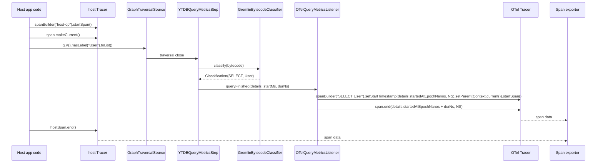
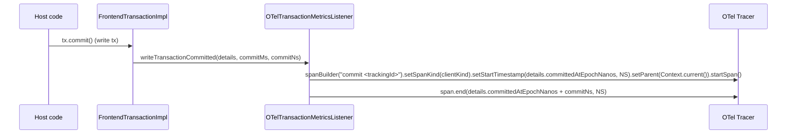
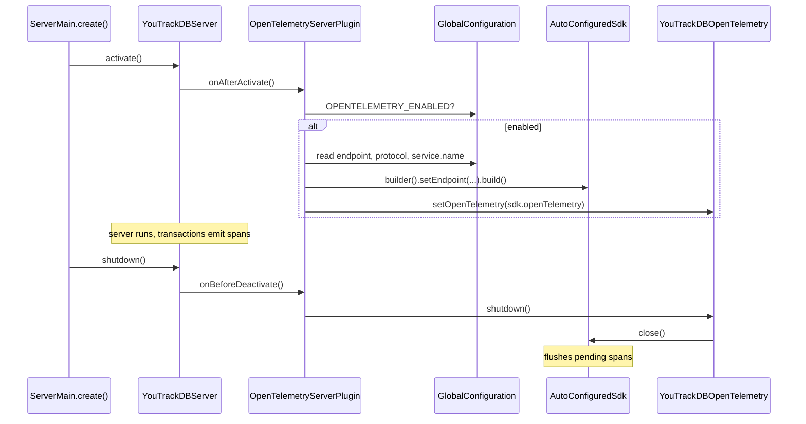

<!-- workflow-sha: 5db61a37462f0b28965113f39a81b6fcb1ed1340 -->
# YTDB-496 OpenTelemetry support — Design

## Overview

This design adds a new optional Maven module `youtrackdb-opentelemetry` that wires YTDB into OpenTelemetry across two pillars in this branch's scope: distributed tracing (spans from query and transaction listener callbacks) and logs (every record emitted through YTDB's `LogManager` chokepoint, hard-context-correlated with the active span at emission time). Metrics land in a follow-up mutation (M35) inside the same PR. The result is that a host running embedded YTDB and an operator running a standalone server both get database telemetry — spans and correlated logs — visible in any OTel-compatible viewer.

This design assumes familiarity with the existing `QueryMetricsListener` and `TransactionMetricsListener` firing sites in `YTDBQueryMetricsStep` and `FrontendTransactionImpl`, and with the `YTDBTransaction` open / commit / rollback lifecycle. The audience is contributors maintaining the metrics and transaction subsystems in `core`.

Today YTDB has an internal `QueryMetricsListener` SPI that fires only on Gremlin traversal close, plus a `TransactionMetricsListener` that fires on write-transaction commit, but the listeners are per-transaction and the project ships no OTel binding. Native SQL queries (the path used for `db.command(...)`, MATCH, and DDL) currently fire neither listener. The design closes that gap with two load-bearing additions: a global listener registry in `core` so an OTel listener registered once at startup auto-applies to every subsequent transaction; and a new listener fire site in a private helper `executeStatementWithMetrics(SQLStatement, String, Object)` called from both `DatabaseSessionEmbedded.query()` (line 617) and `executeInternal()` (line 702) so every SQL statement type (SELECT, INSERT, UPDATE, DELETE, MATCH, DDL), read-only `db.query(...)` included, flows through the same listener API.

A pair of static-utility classifiers in `core` (`GremlinBytecodeClassifier`, `SqlSyntaxClassifier`), called directly from their respective fire sites, extracts `db.operation.name` and `db.collection.name` so spans carry sem-conv v1.33.0 attributes. A thread-local `GremlinSqlSuppression` flag activated by `YTDBGraphQuery.execute` and `YTDBGraphQuery.explain` (the Gremlin-to-SQL bridge that runs each per-step SQL query, or its `EXPLAIN`-prefixed form, via `session.query()`) keeps the SQL helper silent during Gremlin-driven SQL so one traversal emits exactly one span.

The TX listener side stays narrow on purpose: only `writeTransactionCommitted` and `writeTransactionFailed` fire, both for write transactions only, and the OTel implementation emits a standalone commit span with no YTDB-side TX-lifetime wrapper. Read-only transactions emit nothing on the TX listener and therefore no commit-side span. This matches the existing YTDB read-only-TX semantics (the TX listener never fires on a read-only close) and keeps mostly-read workloads from paying alloc-and-emit cost per query for an empty container span.

On the query side, a configurable slow-query threshold gates span emission inside `OTelQueryMetricsListener.queryFinished` so a host running heavy read traffic drops fast successful queries before any tracer allocation. The global default is `OPENTELEMETRY_QUERY_SLOW_THRESHOLD_MILLIS=100` and `0` disables the gate (emit everything). Per-tag overrides go through `OPENTELEMETRY_QUERY_SLOW_THRESHOLD_TAG_RULES` (same format as the per-tag mode rules), resolved through a parallel `SlowQueryThresholdResolver` consuming `TagRule<Long>` on the same sealed interface. Errors bypass the gate because trace viewers are the primary investigation surface for failures; a 1 ms failing query still emits a span carrying `error.type` and the sanitized query text.

A second optional gate emits a wall-clock heartbeat sample: `OPENTELEMETRY_QUERY_HEARTBEAT_SAMPLE_MILLIS` (default `0` = disabled) sets a process-wide interval, and `OTelQueryMetricsListener.queryFinished` emits one span per interval regardless of query duration. The two gates compose disjunctively (heartbeat picks fast queries for visibility, slow-query catches latency outliers, errors always emit). A symmetric `OPENTELEMETRY_QUERY_HEARTBEAT_SAMPLE_TAG_RULES` provides per-tag heartbeat intervals through a parallel `SampleHeartbeatResolver` consuming `TagRule<Long>` on the same sealed interface. The mechanism counters the structural bias of random sampling (1% of queries skews toward fast queries because fast queries are simply more numerous); a wall-clock heartbeat is unbiased over time.

`YTDBTransaction` exposes a builder-style API for listener wiring: `withQueryMonitoringMode(mode)`, `withTrackingId(id)`, `withQueryListener(listener)`, and `withTransactionListener(listener)` are separate fluent methods. The new `withTrackingId(String)` stores an explicit tracking ID on the transaction; `FrontendTransaction.getTrackingId(): String` returns that explicit value when set, else falls back to `String.valueOf(getId())` so the internal-ID source stays the default.

Other subsystems restructured to fit: the nested `QueryMetricsListener.QueryDetails` gains three `Optional<String>` accessors (operation, collection, namespace) and the nested `TransactionMetricsListener.TransactionDetails` gains one (namespace), the existing exception-isolation try/catch in `FrontendTransactionImpl` and `YTDBQueryMetricsStep` widens from `Exception` to the narrower-than-Throwable union `Exception | LinkageError | AssertionError` to cover the OTel-specific failure modes (misconfigured SDK, missing exporter classes, assertion failures) without masking `VirtualMachineError` or `ThreadDeath`, the SQL hook reuses the existing `FrontendTransaction.getId(): long` accessor (no new tracking-id method) and adds three new accessors on `FrontendTransaction` — `getDefaultQueryMonitoringMode(): QueryMonitoringMode` exposing the per-TX fallback used by commit and by queries with no tag-rule match, `resolveQueryMonitoringMode(Optional<String> tag): QueryMonitoringMode` delegating to the process-global `QueryMonitoringModeResolver` for per-query mode selection from the query tag, and `iterateAllQueryListeners(): Iterable<QueryMetricsListener>` exposing the merged global-snapshot + per-TX-list view — and `GlobalConfiguration` gains a family of `OPENTELEMETRY_*` entries that drive the server-mode SDK init plus the tag-rule table (master switch, query-tag rule sets for mode / slow-query / heartbeat, exporter wiring, and two log-side entries `OPENTELEMETRY_LOGS_ENABLED` and `OPENTELEMETRY_LOGS_MIN_SEVERITY`).

In embedded mode the SDK resolution chain has three steps in priority order: host-provided via `YouTrackDBOpenTelemetry.setOpenTelemetry(otel)`, then `GlobalOpenTelemetry.get()` if the host configured the global, then a YTDB-built SDK auto-configured from `OPENTELEMETRY_*` config when neither of the first two yielded a real instance. The flag is never inert; ownership is tracked so `shutdown()` closes only the SDK YTDB created. In server mode YTDB always owns the SDK because the server is a standalone process; an `OpenTelemetrySdk` built from the same config entries wires through a `ServerLifecycleListener`-based plugin.

The rest of this document covers: Core Concepts (vocabulary primer), Class Design, Workflow, sem-conv attribute mapping, context propagation in embedded, Gremlin bytecode classification, SQL execution layer hook, OpenTelemetry logs integration, SDK lifecycle for embedded vs server, listener registration and ordering, and the exception-isolation contract.

## Core Concepts

This design introduces ten load-bearing ideas. Each is named and used without re-definition later; if a downstream section references one, the relevant definition is here. Each entry pairs the new term with what it replaces, so the delta from the baseline is visible at a glance.

**Span.** An OpenTelemetry record covering one unit of work with a start timestamp, an end timestamp, a name, a kind (CLIENT / SERVER / INTERNAL / PRODUCER / CONSUMER), a status (OK / ERROR), and arbitrary key/value attributes. Replaces "nothing in YTDB" (no prior telemetry primitive). → §"Sem-conv attribute mapping" and §"Class Design".

**Trace and Context.** A trace is a tree of spans bound by a shared `traceId`; each child span carries a `parentSpanId`. `Context` is the OTel mechanism for propagating the current span through the call stack so that a span created inside a method automatically attaches as a child of the surrounding span. Replaces "no parent/child relationship between operations". → §"Context propagation in embedded".

**Listener registry (global).** A pair of `CopyOnWriteArrayList`s of `QueryMetricsListener` and `TransactionMetricsListener` instances held in a process-global `GlobalListenerRegistry` in `core` and exposed via static methods on `YourTracks` (the existing `final` utility class). Snapshotted by `FrontendTransactionImpl.beginInternal()` into per-TX fields before `txStartCounter` increments, so both Gremlin and native-SQL transactions share one fire path. Replaces "per-TX `withQueryListener` only", which made the config flag inert. → §"Listener registration and ordering".

**Sem-conv v1.33.0.** OpenTelemetry's stable semantic conventions for database client spans, dictating attribute names (`db.system.name`, `db.query.text`, etc.), their requirement levels (Required / Conditionally Required / Recommended / Opt-In), and the span-name fallback chain. Replaces "no vendor-neutral attribute schema". → §"Sem-conv attribute mapping".

**Query tagging and per-tag mode resolution.** An enum `QueryMonitoringMode` (co-located with `QueryMetricsListener` / `TransactionMetricsListener` in `internal/common/profiler/monitoring/`) selects timing precision per query: `LIGHTWEIGHT` reads from `GranularTicker` at ~10 ms granularity with no syscall on the hot path; `EXACT` reads from `Instant.now()` for the wall-clock start (ns / μs on JDK 21 Linux) and `System.nanoTime()` for the duration delta, paying two syscalls per measurement for sub-millisecond precision. **Each query resolves its mode independently from its tag** through a process-global `QueryMonitoringModeResolver`: rules configured at startup via `OPENTELEMETRY_QUERY_MODE_TAG_RULES` map tag matchers (exact / prefix / regex) to modes, first-wins; when no rule matches, the resolver falls back to the per-TX default set via `YTDBTransaction.withQueryMonitoringMode(...)`; when no per-TX default is set, the fallback is `LIGHTWEIGHT`. Tag sources: Gremlin via `g.with(YTDBQueryConfigParam.querySummary, "X")` and SQL via the parser hint `/*+ TAG=X */` populating `SQLStatement.getQueryTag(): Optional<String>`. Two queries in the same transaction with different tags can use different modes; the commit fire site has no query tag and therefore uses the TX default. Replaces "always-EXACT timing" implied by the original design and the per-TX-snapshot scheme from earlier iterations of this design. → §"Query tagging and per-tag rule resolution", §"SQL execution layer hook", and §"Gremlin bytecode classification".

**Query source classification.** Two static-helper classifiers in `core` extract `db.operation.name` and `db.collection.name` for the two query sources YTDB supports. The Gremlin classifier walks the TinkerPop `Bytecode` instruction list to resolve the first source step (`V`/`E`/`addV`/`addE`/`drop`) and the first `hasLabel(X)` argument. The SQL classifier reads the parsed `SQLStatement` subclass (SELECT / INSERT / UPDATE / DELETE / MATCH / DDL) and the target class from the FROM / INTO / UPDATE clause. Both return `Optional.empty()` when the query shape doesn't yield clean values. Called directly from the existing fire sites: `YTDBQueryMetricsStep` for Gremlin, and the `DatabaseSessionEmbedded.executeStatementWithMetrics` helper for SQL (invoked from both `query()` and `executeInternal()`). No SPI or ServiceLoader; the call sites parse before invoking, so the classifiers piggyback on parsing that runs anyway. Replaces "raw sanitized query string only". → §"Gremlin bytecode classification" (Gremlin rules table) and §"SQL execution layer hook" (SQL rules table and statement-subclass dispatch).

**Slow-query threshold (per-tag).** A wall-clock duration in milliseconds resolved per-query from the same query tag that drives mode selection. Global default `OPENTELEMETRY_QUERY_SLOW_THRESHOLD_MILLIS=100`; per-tag overrides via `OPENTELEMETRY_QUERY_SLOW_THRESHOLD_TAG_RULES` go through a process-global `SlowQueryThresholdResolver` consuming `TagRule<Long>` on the same sealed interface that powers mode resolution. When the resolved threshold is greater than zero, `OTelQueryMetricsListener.queryFinished` returns early before any span allocation if `executionTimeNanos < thresholdNanos` and the query did not throw. Errors always emit regardless. The global default is read at OTel listener construction time; tag-rule resolution is per-query, so a long-running session can hit different thresholds for different tags. Replaces "all-or-nothing emission gated only on listener presence", which over-emitted on mostly-read workloads. → §"Slow-query threshold gating".

**Time-based query sampling (heartbeat).** A wall-clock interval in milliseconds resolved per-query from the same query tag. Global default `OPENTELEMETRY_QUERY_HEARTBEAT_SAMPLE_MILLIS=0` (disabled); positive values emit one span per `N` ms regardless of duration, picked from whichever successful query finishes first after the interval elapses. Per-tag overrides via `OPENTELEMETRY_QUERY_HEARTBEAT_SAMPLE_TAG_RULES` resolve through a process-global `SampleHeartbeatResolver` sharing the sealed `TagRule<T>` matcher hierarchy with the mode and slow-query resolvers. The race for the "first query after the interval" slot is resolved by `AtomicLong.compareAndSet` on a per-listener `lastHeartbeatNanos` field, so under load exactly one query per window claims the heartbeat slot. Composes disjunctively with the slow-query gate (a query emits if either gate passes). Replaces "no sampling beyond the slow-query gate", which biased visibility toward latency outliers and left the fast-query workload invisible. → §"Time-based sampling".

**Explicit transaction tracking ID.** A host-provided string identifier passed to a transaction via `YTDBTransaction.withTrackingId(String)`. When set, `FrontendTransaction.getTrackingId(): String` returns the explicit value; when unset, the accessor falls back to `String.valueOf(getId())` so the existing internal-ID source remains the default. Both `QueryDetails.getTransactionTrackingId()` and `TransactionDetails.getTransactionTrackingId()` read through this accessor, so explicit IDs surface in OTel span attributes (`youtrackdb.transaction.tracking_id`) and in custom listener implementations alike. Replaces the earlier "internal ID only" model where hosts had no way to attach a stable identifier from their own dispatch layer. → §"Class Design" and §"Listener registration and ordering".

**Log appender chokepoint.** YTDB's process-global `com.jetbrains.youtrackdb.internal.common.log.LogManager` is a single dispatch site that every log call from `core`, `embedded`, `server`, and the new `youtrackdb-opentelemetry` module already routes through; it currently fans out to JUL handlers, including the `ConsoleHandler` installed by `installCustomFormatter()`. The OTel module registers a new `OTelLogAppender` (a `java.util.logging.Handler`) on this chokepoint at SDK init, so every existing YTDB log call also feeds the OTel `LogRecordBuilder` pipeline without source-side changes. The appender reads `Context.current()` at `publish()` time, so any log emitted inside a query- or transaction-listener span scope carries the active `traceId`/`spanId` automatically (hard-context correlation). Earlier iterations of this design treated YTDB's own logger as friction because no SLF4J adapter exists to plug into; the named single chokepoint is exactly what makes one-class registration work. Replaces "logs not integrated" (prior design scope). → §"OpenTelemetry logs integration".

## Class Design

```mermaid
classDiagram
    class QueryMetricsListener {
        <<interface>>
        +queryFinished(QueryDetails, long, long) void
    }
    class TransactionMetricsListener {
        <<interface>>
        +writeTransactionCommitted(TransactionDetails, long, long) void
        +writeTransactionFailed(TransactionDetails, long, long, Exception) void
    }
    class QueryDetails["QueryMetricsListener.QueryDetails"] {
        <<interface>>
        +getQuery() String
        +getQuerySummary() String
        +getTransactionTrackingId() String
        +getOperationName() Optional~String~
        +getCollectionName() Optional~String~
        +getDatabaseName() Optional~String~
        +getErrorType() Optional~String~
        +getStartedAtEpochNanos() long
    }
    class TransactionDetails["TransactionMetricsListener.TransactionDetails"] {
        <<interface>>
        +getTransactionTrackingId() String
        +getDatabaseName() Optional~String~
        +getCommittedAtEpochNanos() long
    }
    class OTelQueryMetricsListener {
        -Tracer tracer
        -SpanKind clientKind
        -long defaultThresholdNanos
        -long defaultHeartbeatNanos
        -AtomicLong lastHeartbeatNanos
        +queryFinished(QueryDetails, long, long) void
    }
    class OTelTransactionMetricsListener {
        -Tracer tracer
        -SpanKind clientKind
        +writeTransactionCommitted(TransactionDetails, long, long) void
        +writeTransactionFailed(TransactionDetails, long, long, Exception) void
    }
    class OTelLogAppender {
        -Logger otelLogger
        -int minSeverityNumber
        -ThreadLocal~Boolean~ reentranceGuard
        +publish(LogRecord) void
        +flush() void
        +close() void
    }
    class YouTrackDBOpenTelemetry {
        -OpenTelemetry openTelemetry
        -boolean ownedByYtdb
        -boolean serverMode
        -Tracer tracer
        +setOpenTelemetry(OpenTelemetry) void
        ~setOpenTelemetry(OpenTelemetry, boolean ownedByYtdb, boolean serverMode) void
        +shutdown() void
        ~tracer() Tracer
        ~clientKind() SpanKind
    }
    class GremlinBytecodeClassifier {
        <<utility>>
        +classify(Bytecode) Classification$
    }
    class SqlSyntaxClassifier {
        <<utility>>
        +classify(SQLStatement) Classification$
    }
    class SqlSanitizer {
        +sanitize(String rawSql) String
    }
    class Classification {
        +operationName Optional~String~
        +collectionName Optional~String~
    }
    class QueryMonitoringModeResolver {
        -List~TagRule~ rules
        -ConcurrentHashMap~String,QueryMonitoringMode~ cache
        +resolve(Optional~String~ tag, QueryMonitoringMode txDefault) QueryMonitoringMode
        +global() QueryMonitoringModeResolver$
    }
    class SlowQueryThresholdResolver {
        -List~TagRule~ rules
        -ConcurrentHashMap~String,Long~ cache
        +resolve(Optional~String~ tag, long defaultNanos) long
        +global() SlowQueryThresholdResolver$
    }
    class SampleHeartbeatResolver {
        -List~TagRule~ rules
        -ConcurrentHashMap~String,Long~ cache
        +resolve(Optional~String~ tag, long defaultNanos) long
        +global() SampleHeartbeatResolver$
    }
    class TagRule {
        <<sealed interface>>
        +matches(String tag) boolean
        +value() T
    }
    class TagRuleExact["TagRule.Exact"] {
        -String tag
        -T value
    }
    class TagRulePrefix["TagRule.Prefix"] {
        -String prefix
        -T value
    }
    class TagRuleRegex["TagRule.Regex"] {
        -Pattern pattern
        -T value
    }
    class FrontendTransaction {
        <<interface>>
        +getDefaultQueryMonitoringMode() QueryMonitoringMode
        +resolveQueryMonitoringMode(Optional~String~ tag) QueryMonitoringMode
        +resolveSlowQueryThresholdNanos(Optional~String~ tag) long
        +resolveSampleHeartbeatNanos(Optional~String~ tag) long
        +getTrackingId() String
        +iterateAllQueryListeners() Iterable~QueryMetricsListener~
    }
    class YTDBTransaction {
        +withQueryMonitoringMode(QueryMonitoringMode mode) YTDBTransaction
        +withTrackingId(String trackingId) YTDBTransaction
        +withQueryListener(QueryMetricsListener listener) YTDBTransaction
        +withTransactionListener(TransactionMetricsListener listener) YTDBTransaction
    }
    class SQLStatement {
        +getQueryTag() Optional~String~
    }
    class OpenTelemetryServerPlugin {
        +onAfterActivate() void
        +onBeforeDeactivate() void
    }
    QueryMetricsListener ..> QueryDetails : nests
    TransactionMetricsListener ..> TransactionDetails : nests
    QueryMetricsListener <|.. OTelQueryMetricsListener
    TransactionMetricsListener <|.. OTelTransactionMetricsListener
    OTelQueryMetricsListener --> YouTrackDBOpenTelemetry : tracer()
    OTelTransactionMetricsListener --> YouTrackDBOpenTelemetry : tracer()
    OTelQueryMetricsListener --> QueryDetails : reads operation / collection / namespace
    GremlinBytecodeClassifier --> Classification : returns
    SqlSyntaxClassifier --> Classification : returns
    TagRule <|.. TagRuleExact
    TagRule <|.. TagRulePrefix
    TagRule <|.. TagRuleRegex
    QueryMonitoringModeResolver --> TagRule : holds list of
    SlowQueryThresholdResolver --> TagRule : holds list of
    SampleHeartbeatResolver --> TagRule : holds list of
    FrontendTransaction --> QueryMonitoringModeResolver : resolveQueryMonitoringMode delegates to global()
    FrontendTransaction --> SlowQueryThresholdResolver : resolveSlowQueryThresholdNanos delegates to global()
    FrontendTransaction --> SampleHeartbeatResolver : resolveSampleHeartbeatNanos delegates to global()
    YTDBTransaction --> FrontendTransaction : fluent builder stores tracking-id and mode on
    YouTrackDBOpenTelemetry --> OTelQueryMetricsListener : populates defaultThresholdNanos and defaultHeartbeatNanos from config
    OpenTelemetryServerPlugin --> YouTrackDBOpenTelemetry : setOpenTelemetry(.., ownedByYtdb=true) / shutdown
    OTelLogAppender --> YouTrackDBOpenTelemetry : loggerProvider()
```



The diagram covers the production classes the design introduces. Three interfaces in `core` are extended: `TransactionMetricsListener` and `QueryDetails` gain default methods; `QueryMetricsListener` itself stays unchanged but is consumed by a new impl; `FrontendTransaction` gains `getDefaultQueryMonitoringMode()` (renamed from the earlier `getQueryMonitoringMode()`), `resolveQueryMonitoringMode(Optional<String> tag)`, `resolveSlowQueryThresholdNanos(Optional<String> tag)`, `getTrackingId(): String` (returns the explicit ID set via `YTDBTransaction.withTrackingId(...)` when present, else `String.valueOf(getId())`), and `iterateAllQueryListeners()`. `YTDBTransaction` gains four builder-style methods: `withQueryMonitoringMode(mode)`, `withTrackingId(id)`, `withQueryListener(listener)`, and `withTransactionListener(listener)`. Each returns `this` so they chain.

`SQLStatement` gains a default-empty `getQueryTag(): Optional<String>` accessor populated by the parser when a `/*+ TAG=X */` hint precedes the statement. Two new static-utility classes (`GremlinBytecodeClassifier`, `SqlSyntaxClassifier`) and one value record (`Classification`) land in `core` next to the existing parsing infrastructure. Gremlin's classifier piggybacks on the bytecode walk `YTDBQueryMetricsStep.produceScript()` already performs, and the SQL classifier dispatches on the `SQLStatement` AST that both `DatabaseSessionEmbedded.query()` and `executeInternal()` already produce via `SQLEngine.parse(...)` before delegating to the `executeStatementWithMetrics` helper. The classifiers are pure functions, called directly from the existing fire sites; no SPI, no ServiceLoader.

Three process-global resolvers (all in `core/.../profiler/monitoring/`) reuse the same sealed `TagRule<T>` interface: `QueryMonitoringModeResolver` walks a `List<TagRule<QueryMonitoringMode>>` parsed once at startup from `OPENTELEMETRY_QUERY_MODE_TAG_RULES`; `SlowQueryThresholdResolver` walks a `List<TagRule<Long>>` parsed from `OPENTELEMETRY_QUERY_SLOW_THRESHOLD_TAG_RULES`; `SampleHeartbeatResolver` walks a `List<TagRule<Long>>` parsed from `OPENTELEMETRY_QUERY_HEARTBEAT_SAMPLE_TAG_RULES`. All three cache resolved `(tag → value)` pairs in a `ConcurrentHashMap` for cheap repeat lookups. The sealed `TagRule<T>` interface has three concrete shapes (`Exact`, `Prefix`, `Regex`) and is generic precisely so the resolvers share the matcher hierarchy. Six classes in the new OTel module implement the integration (`OTelQueryMetricsListener`, `OTelTransactionMetricsListener`, `OTelLogAppender`, `YouTrackDBOpenTelemetry`, `SqlSanitizer`, `OpenTelemetryServerPlugin`), keeping the static dependency arrow one-way (`youtrackdb-opentelemetry` → `core`).

Both OTel listeners take a `SpanKind clientKind` constructor argument that selects between CLIENT and INTERNAL for the query span and the standalone commit span. INTERNAL is used when YTDB runs in-process with the host (embedded), CLIENT when YTDB runs as a standalone server process and the host is a network client. `YouTrackDBOpenTelemetry` resolves `clientKind` from how the SDK was wired: the `OpenTelemetryServerPlugin` invokes the package-private 3-arg variant `setOpenTelemetry(otel, ownedByYtdb=true, serverMode=true)` so CLIENT propagates to both listeners; every embedded entry point (host setter, `GlobalOpenTelemetry.get()` fallback, YTDB auto-configure) defaults `serverMode=false` so INTERNAL applies. The two flags carry separate concerns: `ownedByYtdb` controls whether `shutdown()` closes the SDK; `serverMode` controls the CLIENT/INTERNAL split on emitted spans. See §"Sem-conv attribute mapping" for the sem-conv rule that drives this choice.

The producer copies each `Classification(operationName, collectionName)` value into the `QueryDetails` accessors before the listener fires. A small `GremlinSqlSuppression` utility (thread-local re-entrant counter, also in `core`) is consulted by the SQL helper before firing the listener and is activated by `YTDBGraphQuery.execute` and `YTDBGraphQuery.explain` for the duration of Gremlin-driven SQL (the second site covers any caller of `YTDBGraphQuery.explain`, including the test-driven `YTDBGraphQuery.usedIndexes` path at line 37, which delegates to `this.explain(session)` at line 38). The diagram omits it as a utility that participates only through static method calls, with no class relationship to model.

`OTelQueryMetricsListener` and `OTelTransactionMetricsListener` are independent — the query listener takes its parent context from `Context.current()` at fire time (the host's active span, when wrapped), not from any TX-side state. The two listeners are wired alongside each other by `YouTrackDBOpenTelemetry` but share no fields or callbacks. Multiple OTel facades coexisting in the same JVM (test fixtures spinning up a fresh SDK per test method) are independent for the same reason.

`OTelQueryMetricsListener` takes two additional constructor arguments alongside the existing `Tracer` and `SpanKind` pair: `long defaultThresholdNanos` populated by `YouTrackDBOpenTelemetry` from `OPENTELEMETRY_QUERY_SLOW_THRESHOLD_MILLIS` (default `100`, multiplied to nanoseconds) and `long defaultHeartbeatNanos` populated from `OPENTELEMETRY_QUERY_HEARTBEAT_SAMPLE_MILLIS` (default `0`, disabled). Both are read once at SDK init. The listener also owns an `AtomicLong lastHeartbeatNanos` field initialized to `0` and updated by `compareAndSet` when a query claims the heartbeat slot.

At each fire the listener evaluates two gates against the resolved per-query values. First the heartbeat gate: `SampleHeartbeatResolver.global().resolve(querySummary, defaultHeartbeatNanos)`; if the interval is positive and `now - lastHeartbeatNanos >= interval`, the listener CAS-claims the slot and emits. Otherwise the slow-query gate runs: `SlowQueryThresholdResolver.global().resolve(querySummary, defaultThresholdNanos)`; if the threshold is positive and `executionTimeNanos < thresholdNanos`, the listener returns early and skips all span allocation. Errors bypass both gates through `QueryDetails.getErrorType()`, populated by both fire sites from the caught exception's class FQN (see §"Slow-query threshold gating" and §"Time-based sampling" for the gate pseudocode and the error-bypass contract).

Class Design is a structural reference section; edge cases for each component live in the mechanism sections this section points to.

### References
- D-records: D1, D2, D5, D8, D9
- Invariants: Span kind by role
- Mechanics: none (single-file design)

## Workflow

The three diagrams below show, in order, a query span attaching to the host's active span, a standalone commit span emitted for a write transaction, and the server-mode SDK boot/shutdown sequence driven by `ServerLifecycleListener` callbacks. The first two capture the synchronous-on-calling-thread property the design relies on for `Context.current()` to resolve to the host's span; the cross-section §"Context propagation in embedded" carries the prose argument.

### Query span lifecycle in embedded



The flow shows that the host code's active span becomes the parent of the YTDB query span automatically, because `Context.current()` resolves on the same thread the host called `makeCurrent()` on. The classifier runs in `YTDBQueryMetricsStep` before the listener fires, populating `QueryDetails.getOperationName()` and `getCollectionName()`; the listener uses them to build the sem-conv span name `SELECT User`.

The SQL path is symmetric. A private helper `executeStatementWithMetrics(SQLStatement, String, Object)` in `DatabaseSessionEmbedded`, called from both `query()` and `executeInternal()`, plays the role of `YTDBQueryMetricsStep` as the listener fire site, and `SqlSyntaxClassifier` replaces `GremlinBytecodeClassifier` for the accessor population. Span name construction, attribute mapping, and parent-context resolution are identical from the listener's point of view, because the listener reads `QueryDetails` accessors that have already been populated by whichever classifier ran. See §"SQL execution layer hook" for the SQL-side anatomy.

### Commit span emission for write transactions



`writeTransactionCommitted` fires only for write transactions per existing YTDB semantics. A read-only transaction's implicit close path emits nothing on the TX listener and therefore no commit span. The participant box represents `FrontendTransactionImpl` because the listener fire happens inside `notifyMetricsListener()` on the committing thread, and `YTDBTransaction.commit()` delegates to it through the Gremlin and native-SQL paths alike. The commit span takes its parent from `Context.current()` (host span if the host wrapped the commit, root otherwise); no YTDB-internal TX wrapper span is created. `writeTransactionFailed` follows the same shape with `error.type` populated and span status set to ERROR.

### Server-mode SDK lifecycle



The plugin is ServiceLoader-discovered. When the new module is not on the classpath, the plugin doesn't load and the server runs with no OTel cost.

Workflow is a sequence-diagram reference section; per-mechanism edge cases live in the sections each diagram points to.

### References
- D-records: D1, D2, D4
- Mechanics: none

## Sem-conv attribute mapping

**TL;DR.** Every emitted query span carries `db.system.name="youtrackdb"` plus a fallback chain of sem-conv attributes filled in to the extent the source allows. Span name follows the v1.33.0 chain: `db.query.summary` → `db.operation.name db.collection.name` → `db.collection.name` → `db.system.name`. Query text comes from the source-appropriate sanitizer: `ValueAnonymizingTypeTranslator` for Gremlin (existing), `SqlSanitizer` for SQL (Track 4).

The full mapping per attribute:

| Attribute | Requirement | Source | Notes |
|---|---|---|---|
| `db.system.name` | Required | constant `"youtrackdb"` | sem-conv §"Notes" allows custom value when not on well-known list |
| `db.namespace` | Conditionally Required | `QueryDetails.getDatabaseName()` (Gremlin: `session.getDatabaseName()` at the `YTDBQueryMetricsStep` fire site; SQL: same at the `DatabaseSessionEmbedded.executeStatementWithMetrics` helper, populated by either call site — `query()` or `executeInternal()`) | Track 1 adds the default accessor on both `QueryDetails` and `TransactionDetails`; omitted when the session has no name |
| `db.collection.name` | Conditionally Required | classifier result `.collectionName` | absent for multi-class traversals / anonymous SQL FROM subqueries |
| `db.operation.name` | Conditionally Required | classifier result `.operationName` | one of `SELECT` / `INSERT` / `UPDATE` / `DELETE` / `MATCH` / `CREATE` / `ALTER` / `DROP` |
| `db.query.text` | Recommended | `QueryDetails.getQuery()` | already sanitized: Gremlin via `ValueAnonymizingTypeTranslator`, SQL via `SqlSanitizer` |
| `db.query.summary` | Recommended | `QueryDetails.getQuerySummary()` if set, else `"{operation} {collection}"` if both present | client-provided summary wins |
| `db.response.status_code` | Conditionally Required | YTDB error code if available | currently no canonical YTDB error-code field; omitted in YTDB-496 |
| `error.type` | Conditionally Required (on failure) | exception class FQN | set on the standalone commit span at `writeTransactionFailed`, on the query span when `statement.execute(...)` throws; also exposed via `QueryDetails.getErrorType()` so the slow-query threshold gate (§"Slow-query threshold gating") can bypass on error |
| `server.address` / `server.port` | Recommended | from server config in server mode | embedded mode omits |
| `db.response.returned_rows` | Opt-In | omitted in YTDB-496 | requires counting traversal / result-set results |

Span name fallback examples. Gremlin: a query labeled with `g.with(YTDBQueryConfigParam.querySummary, "findActiveUsers")...` produces `findActiveUsers`. An unlabeled `g.V().hasLabel("User").has("active", true).toList()` produces `SELECT User`. SQL: `db.command("SELECT FROM User WHERE active = true")` produces `SELECT User`. `db.command("MATCH {class:User, as:u}-knows->{class:User, as:f} RETURN u, f")` produces `MATCH User`. A shape that defies classification (Gremlin `g.V().union(...).path()` or SQL `SELECT FROM (SELECT FROM ...)`) produces `youtrackdb`.

Span kinds per role follow sem-conv v1.33.0 §"Span kind", which mandates CLIENT for over-network DB calls and INTERNAL for in-process and in-memory database libraries. YTDB satisfies both definitions in different deployments, so the kind is mode-aware: in embedded mode the query span and the standalone commit span are INTERNAL (YTDB runs in-process with the host); in server mode they are CLIENT (YTDB runs as a separate process the host reaches over the network). No SERVER / PRODUCER / CONSUMER spans are emitted by YTDB, and no YTDB-side INTERNAL wrapper span parents the query or commit spans — both attach directly to `Context.current()`. Track 6a's listener tests (`OTelGremlinQueryTest`, `OTelSqlQueryTest`, `OTelTransactionMetricsListenerTest`) parametrize over `clientKind` so each test exercises both INTERNAL (embedded default) and CLIENT (server-plugin path), asserting the positive cases on `SpanData.getKind()` and the negative case (no SERVER / PRODUCER / CONSUMER spans) against the in-memory exporter.

### YouTrackDB vendor attributes (intro)

**TL;DR.** OpenTelemetry's `db.<system>.*` prefix carries DB-implementation-specific structural fields beyond the standard `db.*` set; YTDB-496 reserves the `db.youtrackdb.*` namespace and ships an initial six-key set populated by the existing classifiers (`GremlinBytecodeClassifier`, `SqlSyntaxClassifier`) during the same parser-output walk that already extracts operation and collection. Values are deliberately constrained to booleans and small integers so trace consumers can group and filter queries by structural shape without paying for high-cardinality storage. Higher-resolution fields (predicate values, sort columns, property keys, per-operator timing) stay out of MVP and ship in a follow-up ticket once production demand surfaces.

Initial attribute set (MVP):

| Attribute | Source | Cardinality | Notes |
|---|---|---|---|
| `db.youtrackdb.where_present` | SQL: presence of WHERE / Gremlin: presence of `has(...)` / `where(...)` step | boolean | filter trace by "queries with predicates" vs unconditional scans |
| `db.youtrackdb.order_present` | SQL: presence of ORDER BY / Gremlin: presence of `order()` step | boolean | filter by "sorted queries" |
| `db.youtrackdb.limit_present` | SQL: presence of LIMIT / Gremlin: presence of `limit(...)` / `range(...)` / `tail(...)` step | boolean | filter by "bounded queries" |
| `db.youtrackdb.from_class_count` | SQL: count of FROM targets / Gremlin: count of top-level `V(...)` / `E(...)` start steps | small int (typically 1-3) | flag multi-target queries |
| `db.youtrackdb.step_count` | Gremlin only: count of top-level bytecode instructions | small int (typically 1-20) | rough complexity proxy; SQL omits |
| `db.youtrackdb.has_subtraversal` | Gremlin only: presence of any `__.*` sub-traversal or `match(...)` pattern | boolean | flag composite Gremlin shapes; SQL omits |

Cardinality policy. Every attribute in `db.youtrackdb.*` MUST be bounded: boolean, small integer (under ~20 distinct values), or enum. The bound applies to the *attribute value*, not to the *attribute key* (the key set is closed, defined in this table). Trace backends typically index per attribute key per distinct value, so an unbounded value range translates directly to backend storage and query cost.

Out of MVP (high-cardinality, deferred to follow-up):

- specific predicate values (`age > 30`, `name = "Alice"`) — every distinct literal blows up cardinality
- specific ORDER BY columns or `by(...)` keys — user-controlled, schema-dependent
- specific property keys read via `values(...)` or projection — same cardinality concern as ORDER BY keys
- full execution-plan structure (per-operator timing, per-step row counts) — already covered by the § Non-Goals bullet on per-operator timing; the follow-up ticket sources data from `SQLProfiler` and emits span events rather than span attributes to avoid polluting the per-span attribute set

Future-extension policy. New attributes land under `db.youtrackdb.*` if they pass two tests: (a) bounded cardinality per the policy above, and (b) extractable from existing parser output without re-walking the query. Attributes failing either test go into the per-operator span-events follow-up, which can carry higher-cardinality fields without cost-amplifying the per-span attribute set.

Extraction site. The shared `Classification` value record gains additional optional fields, one per attribute in the table above, with defaults representing "not present". `GremlinBytecodeClassifier.classify(Bytecode)` and `SqlSyntaxClassifier.classify(SQLStatement)` populate the fields during the same walk that already extracts operation and collection. The OTel listener reads the fields from `QueryDetails` accessors (extended in Track 1 alongside the existing operation / collection / namespace / errorType accessors) and sets them on the emitted span; custom (non-OTel) listeners that ignore the new accessors are unaffected.

### Edge cases / Gotchas

- An empty `db.query.text` (e.g., the rare case where `stringStatement` is null on the SQL path and `statement.getOriginalStatement()` also returns null) is acceptable; the attribute is Recommended, not Required.
- Classifiers MUST NOT throw. Any unexpected bytecode or `SQLStatement` subclass returns `Classification(Optional.empty(), Optional.empty())`. Gremlin tests cover at least: `V`-only, `addV`, `addE`, `drop()`, chained `hasLabel("A").hasLabel("B")` (first label wins), and `V().union(...)` (no clean classification). SQL tests cover each statement type plus FROM-with-subquery and multi-target FROM.
- `db.query.summary` cardinality stays low because the classifier output is low-cardinality. A host that sets `querySummary` to a per-request string defeats this; documented as a host responsibility.
- `db.namespace` resolution depends on the database name being readily available from the transaction context. If unavailable, the attribute is omitted, which is allowed by sem-conv ("if available").

### References
- D-records: D5, D6, D8, D9, D16, D19
- Mechanics: none

## Span timing capture

**TL;DR.** Span emission goes through `TimeUnit.NANOSECONDS` end-to-end so duration carries every nanosecond the fire site measured. The pattern is `setStartTimestamp(startNanos, NANOSECONDS).startSpan()` then `span.end(startNanos + executionTimeNanos, NANOSECONDS)` — zero integer division on the emission path. The listener API exposes the wall-clock start two ways: the legacy `startedAtMillis` parameter for back-compat, plus a new default-method accessor `QueryDetails.getStartedAtEpochNanos(): long` returning epoch-nanoseconds. Under `EXACT` the fire site populates the accessor at full nanosecond precision via `Instant.now()`; the default implementation derives from `startedAtMillis` so listeners that ignore the new accessor still get a sensible value.

The mapping inside `OTelQueryMetricsListener.queryFinished(...)`:

```java
long startNanos = details.getStartedAtEpochNanos();
Span span = tracer.spanBuilder(name)
    .setSpanKind(clientKind)
    .setStartTimestamp(startNanos, TimeUnit.NANOSECONDS)
    .setParent(Context.current())  // host context if host wrapped, otherwise root
    .startSpan();
// set sem-conv attributes (db.system.name, db.query.text, ...)
span.end(startNanos + executionTimeNanos, TimeUnit.NANOSECONDS);
```

Both values come from the same clock pair the fire site captured for the resolved mode at this query. Under `EXACT` the fire site reads `Instant.now()` for the start (full nanosecond field on JDK 21; OS-dependent actual resolution lands at ns / μs on Linux, ~ms on older Windows) and `System.nanoTime()` for the duration delta. Under `LIGHTWEIGHT` it reads `ticker.approximateCurrentTimeMillis() * 1_000_000L` for the start nanos and `ticker.approximateNanoTime()` for the duration delta, both at ~10 ms ticker granularity. The listener sees a consistent ns pair regardless of mode, so the OTel-recorded duration never drifts from the listener-measured duration.

Implicit `now()` would be wrong here. The listener callback fires *after* the operation completes, so `tracer.spanBuilder(...).startSpan()` without an explicit timestamp would record callback-entry time as the span start — losing the relationship between the span and the actual query timing. Passing `setStartTimestamp(...)` and `span.end(endTs)` makes the span match the measured operation.

The standalone commit span for write transactions is built the same way as a query span, with the commit start nanos read from a new `TransactionDetails.getCommittedAtEpochNanos(): long` default-method accessor (back-compat default derives from `commitAtMillis`) and the duration read from `commitTimeNanos`. Read-only transactions do not invoke this listener (existing YTDB semantics, preserved), so no commit span is emitted for them.

### Edge cases / Gotchas

- Span timestamps emit in `TimeUnit.NANOSECONDS` regardless of timing mode; source-clock resolution decides the actual precision a trace viewer renders. Concretely:

  | Mode | Start precision | Duration precision | Start source | Duration source |
  |---|---|---|---|---|
  | `EXACT` | ns / μs (OS-dependent, `Instant.now()`) | ns (`System.nanoTime` delta) | `Instant.now()` epoch-nanos | `System.nanoTime` |
  | `LIGHTWEIGHT` | ~10 ms (ticker) | ~10 ms (ticker delta) | `ticker.approximateCurrentTimeMillis * 1_000_000L` | `ticker.approximateNanoTime` |

  A 1.234567 ms query under `EXACT` records a span with duration ~1234567 ns, no integer-ms rounding on the emission path. The same query under `LIGHTWEIGHT` rounds to a ticker tick (~0 or ~10 ms) because the ticker itself updates at that granularity, not because of any emission-side conversion. Hosts that need sub-ms precision pick `EXACT` per-TX via `withQueryMonitoringMode(EXACT)` or per-tag via `OPENTELEMETRY_QUERY_MODE_TAG_RULES`.
- A clock skew between the fire site and the OTel SDK's exporter does not affect span duration, only the absolute placement on a wall-clock timeline. The exporter normalizes timestamps per the backend protocol.
- An OTel-compatible backend that requires strictly-monotonic timestamps within a single trace sees no violation: every YTDB span is built with `(start, end)` from one fire-site clock read, and `end > start` always holds because `executionTimeNanos > 0` for any completed operation.

### References
- D-records: D8, D14, D15
- Invariants: Timing-mode uniformity (per-query)
- Mechanics: none

## Context propagation in embedded

**TL;DR.** The host application's active span automatically becomes the parent of every YTDB query span. `Context.current()` resolves to the host's span because the listener fires synchronously on the caller's thread per existing YTDB semantics, and transaction operations are pinned to the owner thread via `assertOnOwningThread`. No extra plumbing is needed for the common case; a regression test guards against future threading changes.

The verification:
- `YTDBQueryMetricsStep.close()` calls `listener.queryFinished(...)` directly (no executor wrapping).
- `FrontendTransactionImpl.notifyMetricsListener()` (commit success and failure paths) runs on the committing thread.
- `FrontendTransactionImpl.assertOnOwningThread()` is a `private` method called by `beginInternal`, `monitoredCommitInternal`, and every record-CRUD entry point (`getRecord`, `exists`, `loadRecord`, `deleteRecord`, `addRecordOperation`). The `query` / `command` / `execute` / `rollback` dispatch methods on `FrontendTransactionImpl` delegate to `DatabaseSessionEmbedded` and call only `checkIfActive`, but the listener fire paths above run synchronously on the calling thread because no executor or worker pool intervenes between the dispatch call and the listener fire.
- Result: when a host wraps a YTDB transaction inside `tracer.spanBuilder("host-op").startSpan().makeCurrent()`, `Context.current()` inside the YTDB listener returns the host's context with the host span as the active span.

The async caveat: if a future refactor moves traversal close (or commit) to a worker pool, `Context.current()` on that worker would not see the host span, and the YTDB span would attach to the root of a new trace. The test suite includes a propagation test that fails loudly if this happens; the failure mode (orphan YTDB spans) is also operator-visible in the trace viewer.

Explicit propagation is not exposed in this design. A host that needs to fan out a YTDB query to a custom executor must propagate the OTel `Context` itself per OTel's standard pattern (`Context.taskWrapping(executor)` or `Context.wrap(runnable)`). YTDB does not bridge that case.

### Edge cases / Gotchas

- A host that never opens an outer span sees the YTDB span as the trace root, with a synthetic `traceId`. This is correct OTel behavior.
- Mid-transaction context changes (host pushes a span between two queries) are observed: subsequent queries attach to the newer span. This is OTel's contract.
- The standalone commit span for write transactions attaches to whatever `Context.current()` resolves to at the moment `writeTransactionCommitted` fires — typically the host's TX-wrapping span, otherwise the trace root. There is no YTDB-side wrapper span to bind queries and the commit together; that grouping is a host responsibility through an outer span if needed.

### References
- D-records: D4
- Mechanics: none

## Gremlin bytecode classification

**TL;DR.** The classifier walks the TinkerPop `Bytecode` instruction list to identify the start step (`V`/`E`/`addV`/`addE`/`drop`) and the first label-bearing operator (`hasLabel`, `addV(X)` argument, `addE(X)` argument). Maps the start step to an operation name and the label to a collection name. Returns `Optional.empty()` for both fields when the shape doesn't yield clean values; never throws.

Classification rules:

| First source step | Operation name | Collection name source |
|---|---|---|
| `V()` | `SELECT` | first `hasLabel(X)` argument, else `Optional.empty()` |
| `E()` | `SELECT` | first `hasLabel(X)` argument, else `Optional.empty()` |
| `addV(X)` | `INSERT` | `X` (label argument of addV) |
| `addV()` (no label) | `INSERT` | `Optional.empty()` |
| `addE(X)` | `INSERT` | `X` (label argument of addE) |
| step chain ending with `drop()` | `DELETE` | first `hasLabel(X)` argument before the drop, else `Optional.empty()` |
| anything else | `Optional.empty()` | `Optional.empty()` |

Implementation lives in `core/.../profiler/monitoring/GremlinBytecodeClassifier.java` as a static utility (`Classification classify(Bytecode)`). `YTDBQueryMetricsStep.close()` calls it directly when building the inline `QueryDetails` and stashes the returned `Classification` in two `Optional<String>` fields read back by `QueryDetails.getOperationName()` / `getCollectionName()`. The same `QueryDetails` instance also carries the `errorType` slot populated from any exception caught around the traversal-close path (the `step.next()` / `step.hasNext()` flow), so the slow-query threshold gate in `OTelQueryMetricsListener` can bypass on error. When no listener consults those accessors the work is paid (the call is unconditional inside the fire site), but the cost is one bytecode walk reusing the same instruction-list traversal pattern as the existing `produceScript()` sanitization, measured in microseconds and dominated by the listener call itself.

Timing capture in `YTDBQueryMetricsStep.close()` follows the per-query mode resolution mechanism described in §"Query tagging and per-tag rule resolution": the step reads the query tag from `traversal.getConfig(YTDBQueryConfigParam.querySummary)` and calls `currentTx.resolveQueryMonitoringMode(tag)` to pick the clock source for this traversal. Two Gremlin traversals in the same transaction with different tags can therefore record at different precisions; the suppressed inner SQL queries spawned by the traversal share the parent Gremlin span and emit no telemetry of their own (see §"SQL execution layer hook" for the `GremlinSqlSuppression` mechanism). Since only the outer Gremlin step reads the clock, precision uniformity within the traversal is automatic.

### Edge cases / Gotchas

- `g.V().hasLabel("A").hasLabel("B")`: returns `collectionName = "A"` (first wins). This matches sem-conv guidance to capture a single low-cardinality value rather than concatenating.
- `g.V().union(__.hasLabel("A"), __.hasLabel("B"))`: returns `collectionName = Optional.empty()` because the label is inside a sub-traversal, not a top-level instruction. The classifier does not descend into sub-traversals.
- `g.addV().property("label", "X")`: returns `collectionName = Optional.empty()` because the label is not a positional argument of `addV()`. Properties are not inspected.
- Numeric or non-string `hasLabel` argument (TinkerPop allows it via mutation in untyped code): the classifier checks `instanceof String` and returns `Optional.empty()` for non-String arguments.

### References
- D-records: D9
- Invariants: none specific (the classifier is fail-safe by contract)
- Mechanics: none

## Query tagging and per-tag rule resolution

**TL;DR.** Different statements in one transaction can claim different timing precisions when the host attaches identifying strings like `"findActiveUsers"` or `"monthly-scan"` to its calls. Gremlin uses `g.with(YTDBQueryConfigParam.querySummary, "X")`; native SQL uses the parser hint `/*+ TAG=X */`. A process-global lookup walks ordered first-wins matchers (exact, prefix, regex) configured at startup via `OPENTELEMETRY_QUERY_MODE_TAG_RULES`, mapping each identifier to a `QueryMonitoringMode` value. Fallback chain: matcher hit → per-TX default (`YTDBTransaction.withQueryMonitoringMode(...)`) → `LIGHTWEIGHT`. The identifier also surfaces as `db.query.summary` for dashboard breakdowns and sampler decisions. Replaces the earlier per-transaction-snapshot timing-mode scheme so one transaction can mix tracker-based 10 ms timing with sub-millisecond precision for hot paths.

The resolver and its rule types live next to the existing listener SPI in `core/.../profiler/monitoring/`:

```java
public final class QueryMonitoringModeResolver {
    private final List<TagRule<QueryMonitoringMode>> rules;          // immutable, compiled once at startup
    private final ConcurrentHashMap<String, QueryMonitoringMode> cache;

    public QueryMonitoringMode resolve(Optional<String> tag, QueryMonitoringMode txDefault) {
        if (tag.isEmpty()) return txDefault;
        return cache.computeIfAbsent(tag.get(), t -> resolveUncached(t, txDefault));
    }
    // resolveUncached walks rules in order, first-wins; falls back to txDefault.
}

public sealed interface TagRule<T> {
    boolean matches(String tag);
    T value();

    record Exact<T>(String tag, T value)       implements TagRule<T> { ... }
    record Prefix<T>(String prefix, T value)   implements TagRule<T> { ... }
    record Regex<T>(Pattern pattern, T value)  implements TagRule<T> { ... }
}
```

The sealed `TagRule<T>` is generic so a future per-tag slow-query threshold resolver (`SlowQueryThresholdResolver` consuming `TagRule<Long>`) reuses the same matcher hierarchy without duplicating the rule-parsing code.

Configuration format for `OPENTELEMETRY_QUERY_MODE_TAG_RULES`:

```
OPENTELEMETRY_QUERY_MODE_TAG_RULES=findActiveUsers=EXACT,prefix:expensive-=EXACT,regex:^batch-.*$=EXACT
```

- No prefix → `Exact` match.
- `prefix:X` → `Prefix` match against `tag.startsWith("X")`.
- `regex:X` → `Regex` match against `Pattern.compile("X")`.
- Comma-separated, first match wins (insertion order).
- Whitespace around `=` and `,` trimmed.
- Invalid rule (bad regex, unknown mode, malformed entry) logs WARN at startup and is dropped from the list; the resolver continues with the remaining valid rules.

The cache holds resolved `(tag → mode)` mappings so a long-running workload pays the rule walk once per distinct tag. Tags are documented as **low-cardinality identifiers**: a host that emits a unique tag per request (e.g., a UUID) defeats the cache and may blow process heap. Documented as host responsibility; not enforced by an LRU bound because typical workloads have dozens of tags, not millions.

Resolution call site on `FrontendTransaction`:

```java
default QueryMonitoringMode resolveQueryMonitoringMode(Optional<String> tag) {
    return QueryMonitoringModeResolver.global().resolve(tag, getDefaultQueryMonitoringMode());
}
```

The fire sites call this once per query before reading the clock:

```text
Gremlin path (YTDBQueryMetricsStep.close):
    tag  = traversal.getConfig(YTDBQueryConfigParam.querySummary)
    mode = currentTx.resolveQueryMonitoringMode(tag)
    if LIGHTWEIGHT: ticker reads
    else (EXACT):   System.nanoTime reads

SQL path (DatabaseSessionEmbedded.executeStatementWithMetrics):
    tag  = statement.getQueryTag()
    mode = currentTx.resolveQueryMonitoringMode(tag)
    if LIGHTWEIGHT: ticker reads
    else (EXACT):   System.nanoTime reads
```

The commit fire site has no query in flight; it uses `currentTx.getDefaultQueryMonitoringMode()` directly.

### Edge cases / Gotchas

- **No tag, no per-TX default** → `LIGHTWEIGHT`. This is the most common path and preserves the existing zero-syscall hot path for hosts that don't engage with monitoring config at all.
- **No tag, per-TX default set** → per-TX default applies. Backwards-compatible with hosts that already call `withQueryMonitoringMode(EXACT)` on every TX they care about.
- **Tag present, no rule matches** → falls back to per-TX default (then to `LIGHTWEIGHT`). A tag that the operator hasn't configured a rule for behaves identically to an untagged query; tagging never raises precision on its own.
- **Rule matches but specifies the same mode as TX default** → idempotent; the cache still records the resolution so future identical tags skip the walk.
- **Mid-TX rule change** → not supported. Rules are compiled once at startup from `OPENTELEMETRY_QUERY_MODE_TAG_RULES`; live reconfiguration is out of scope for YTDB-496. If runtime mutation becomes a requirement later, a snapshot-per-TX (analogous to the listener-registry snapshot) is the cleanest extension point.
- **Conflicting rules (two rules match the same tag)** → first-wins per insertion order. Operators ordering rules from most-specific to most-general is the documented pattern. Two `Exact` rules for the same tag is parsed as the first one only; the second logs WARN and is dropped at startup.
- **Cache cardinality blow-up** → an attacker or buggy host that emits unique tags per request grows the cache without bound. Documented as host responsibility; the listener layer keeps emitting spans either way, so the failure mode is heap pressure rather than dropped telemetry. Future hardening could add an LRU bound; not in YTDB-496.
- **Mode resolution determinism** → identical `(tag, txDefault)` always resolves to the same mode (the resolver is a pure function of immutable state). Both fire sites in one query read the same mode value because they both call `currentTx.resolveQueryMonitoringMode(tag)` with the same tag and the same TX default; the resolver returns a value, not a fresh decision.

### References
- D-records: D8, D14, D15
- Invariants: Timing-mode uniformity (per-query)
- Mechanics: none

## SQL execution layer hook

**TL;DR.** A private helper `executeStatementWithMetrics(SQLStatement, String, Object)` in `DatabaseSessionEmbedded`, called from both `query()` (line 617) and `executeInternal()` (line 702), funnels every native database statement (SELECT, INSERT, UPDATE, DELETE, MATCH, DDL — CREATE / ALTER / DROP for DDL). It wraps `statement.execute(...)` with mode-aware timing where the mode is resolved per-query from the statement's tag via `currentTx.resolveQueryMonitoringMode(statement.getQueryTag())` (see §"Query tagging and per-tag rule resolution"). The helper emits a `QueryDetails` carrying raw text, sanitized form (literals replaced with `?` placeholders), and operation / collection extracted from the parsed AST. A thread-local `GremlinSqlSuppression` flag set by `YTDBGraphQuery.execute(...)` and `YTDBGraphQuery.explain(...)` keeps the helper silent during Gremlin-driven SQL so one traversal emits exactly one span.

Hook anatomy in the `executeStatementWithMetrics` helper (both callers pass an already-parsed `SQLStatement` plus the raw SQL text and args):

```text
1. Read currentTx.iterateAllQueryListeners()  ← merged: global registry snapshot (captured at beginInternal) + per-TX list (added via withQueryListener)
2. If no listeners OR GremlinSqlSuppression.isActive():
     return statement.execute(this, args, true)         // short-circuit
   // No listeners → zero overhead when OTel is off and no per-TX listener.
   // Suppression active → no nested SQL span inside a Gremlin span.
3. Read tag = statement.getQueryTag()  ← Optional<String> populated by SQL parser from /*+ TAG=X */ hint
   Read mode = currentTx.resolveQueryMonitoringMode(tag)  ← delegates to global QueryMonitoringModeResolver;
                                                          falls back to tx.getDefaultQueryMonitoringMode() then LIGHTWEIGHT
   if LIGHTWEIGHT:
     ticker = YouTrackDBEnginesManager.instance().getTicker()
     startMillis     = ticker.approximateCurrentTimeMillis()
     startEpochNanos = startMillis * 1_000_000L          // ms-granular value lifted to ns scale
     startNanoTime   = ticker.approximateNanoTime()      // no syscalls
   else (EXACT):
     now              = Instant.now()                    // single syscall, ns / μs field
     startEpochNanos  = now.getEpochSecond() * 1_000_000_000L + now.getNano()
     startMillis      = now.toEpochMilli()               // back-compat for legacy startedAtMillis param
     startNanoTime    = System.nanoTime()                // monotonic delta base
4. Run statement.execute(this, args, true) inside the existing try/catch; capture any thrown exception as caughtError
5. elapsedNanos = (mode == LIGHTWEIGHT)
                    ? ticker.approximateNanoTime() - startNanoTime
                    : System.nanoTime() - startNanoTime
6. Build QueryDetails (rawSql, args, statement, trackingId, errorType from caughtError.getClass().getName() when present;
   startedAtMillis = startMillis; getStartedAtEpochNanos() returns startEpochNanos),
   fire listeners.queryFinished(...) wrapped in try/catch (Exception | LinkageError | AssertionError) so listener
   exceptions don't break the query. If caughtError is non-null, rethrow it after the fire so the call site behaves
   as before. QueryDetails.getErrorType() drives the slow-query threshold bypass in OTelQueryMetricsListener
   (see §"Slow-query threshold gating").
```

Both call sites do the parsing themselves before calling the helper. `query()` (line 617) parses, asserts `isIdempotent()`, then calls the helper. `executeInternal()` (line 702) uses the pre-parsed statement if its caller supplied one and otherwise calls `SQLEngine.parse(...)`, then calls the helper. The raw SQL text passed to the helper comes from `stringStatement` when non-null, else from `statement.getOriginalStatement()`. The helper itself never parses.

The `QueryDetails` impl is lazy: `getQuery()` calls `SqlSanitizer.sanitize(rawSql)` (from the OTel module) on first access; `getOperationName()` and `getCollectionName()` call `SqlSyntaxClassifier.classify(statement)` (a static utility in `core`) on first access. Hosts that don't read these accessors pay no sanitization or classification cost — the parsed `SQLStatement` is already available because `SQLEngine.parse(...)` runs unconditionally to execute the query.

Timing capture follows the per-query mode resolution model from §"Query tagging and per-tag rule resolution". The helper reads the tag from `statement.getQueryTag()` (populated by the SQL parser when a `/*+ TAG=X */` hint precedes the statement; `Optional.empty()` otherwise), then calls `currentTx.resolveQueryMonitoringMode(tag)` to pick the clock source. `LIGHTWEIGHT` reads from `GranularTicker` at 10 ms granularity, with no syscall on the hot path. `EXACT` reads `Instant.now()` for the wall-clock start (single syscall, ns / μs field on JDK 21 Linux) and `System.nanoTime()` for the monotonic duration delta; the wall-clock value populates both the legacy `startedAtMillis` listener parameter (via `Instant.toEpochMilli()`) and the new `getStartedAtEpochNanos()` accessor at full ns precision (see §"Span timing capture"). The commit fire site in `FrontendTransactionImpl.notifyMetricsListener` has no per-statement tag context and reads directly from `currentTx.getDefaultQueryMonitoringMode()`, so the commit clock pair matches whatever default the host set on the transaction (the same value the SQL hook falls back to when no tag rule matches). Different statements within one transaction can therefore record at different precisions while the commit timer remains aligned with the TX default; both fire sites in one query (Gremlin step at `YTDBQueryMetricsStep.close()` and SQL helper) resolve from the same tag and reach the same mode, satisfying the per-query Timing-mode uniformity invariant.

The Gremlin path does not double-fire. Gremlin traversals route through `session.query()`, which would otherwise re-enter the helper, but `YTDBGraphQuery.execute(...)` and `YTDBGraphQuery.explain(...)` each activate a thread-local `GremlinSqlSuppression` token (re-entrant counter, auto-closeable) for the duration of the underlying `transaction.query(...)` call (an `EXPLAIN`-prefixed query in the explain case). The helper checks `GremlinSqlSuppression.isActive()` at step 2 and short-circuits before any timer read or listener fire, so a Gremlin traversal emits exactly one span (the Gremlin one at `YTDBQueryMetricsStep.close()`) and no SQL children. This preserves the OTel sem-conv alignment of one user-facing operation to one span and prevents leaking the Gremlin-to-SQL translation as observable trace noise.

The `SqlSyntaxClassifier` dispatches on the `SQLStatement` subclass:

| Statement subclass | Operation name | Collection name source |
|---|---|---|
| `SQLSelectStatement` | `SELECT` | first FROM target class, else `Optional.empty()` |
| `SQLInsertStatement` | `INSERT` | INTO target class |
| `SQLUpdateStatement` | `UPDATE` | UPDATE target class |
| `SQLDeleteStatement` | `DELETE` | DELETE target class |
| `SQLMatchStatement` | `MATCH` | first pattern node's class, else `Optional.empty()` |
| `SQLCreateClassStatement` | `CREATE` | class name from the statement |
| `SQLAlterClassStatement` | `ALTER` | class name from the statement |
| `SQLDropClassStatement` | `DROP` | class name from the statement |
| anything else | `Optional.empty()` | `Optional.empty()` |

The `SqlSanitizer` runs a conservative regex pass over the raw SQL: replaces single-quoted string literals (handling escaped quotes), numeric literals, boolean literals, and date / timestamp literals with `?`. Already-parameterized text passes through unchanged because the literal patterns don't match `?` placeholders.

### Edge cases / Gotchas

- `stringStatement` can be null when an internal recursive call passes a pre-parsed `SQLStatement`. The hook falls back to `statement.getOriginalStatement()` for the raw SQL. If both are null (unusual), the hook emits `db.query.text=""` and the span still carries operation / collection.
- DDL statements have no literals to sanitize. `CREATE INDEX User.email UNIQUE` passes through `SqlSanitizer` unchanged.
- A statement with multi-target FROM (`SELECT FROM User, Order WHERE ...`) yields `collectionName = "User"` (first wins) per sem-conv guidance to keep cardinality low. An anonymous FROM subquery yields `Optional.empty()`.
- The transaction tracking ID comes from `String.valueOf(currentTx.getId())` — `FrontendTransaction.getId(): long` already exists at line 215 and returns a stable internal ID. No new accessor is added in Track 4.
- An exception thrown by `statement.execute(...)` propagates as before. The hook still fires the listener with the elapsed time and the SQL, with the span status set to ERROR and `error.type` populated, before the exception re-throws. The fire is wrapped so a listener exception during error handling doesn't mask the original.
- Under LIGHTWEIGHT (default), query durations shorter than the ticker's granularity (~10 ms) round to zero or one tick. Acceptable for trace viewers, which render at millisecond resolution anyway. A host that wants sub-millisecond precision picks one of two routes: configure a tag rule like `OPENTELEMETRY_QUERY_MODE_TAG_RULES=findHotpath=EXACT` and emit `/*+ TAG=findHotpath */` hints on the relevant queries, or call `YTDBTransaction.withQueryMonitoringMode(EXACT)` once on the transaction to set the default mode for every query in that TX that doesn't match a tag rule.
- A statement without a `/*+ TAG=X */` hint has `Optional.empty()` for its query tag and resolves to `currentTx.getDefaultQueryMonitoringMode()`. Callers using the legacy `YTDBTransaction.withQueryMonitoringMode(EXACT)` per-TX API see identical behavior to the earlier per-TX-snapshot scheme: every query in the TX uses EXACT.
- Tag rules are immutable after process startup; mid-TX changes to the rule table are not supported in YTDB-496 (see §"Query tagging and per-tag rule resolution" Edge cases). Mid-TX changes to the per-TX default via `YTDBTransaction.withQueryMonitoringMode(...)` take effect immediately for the next query in the same TX because the helper re-reads `getDefaultQueryMonitoringMode()` per query — no snapshot, no `next begin()` cycle latency.
- Gremlin SQL suppression is a thread-local counter (re-entrant, not a boolean). Both `YTDBGraphQuery.execute(session)` and `YTDBGraphQuery.explain(session)` wrap their underlying `transaction.query(...)` calls in try-with-resources `GremlinSqlSuppression.activate()` tokens; nested Gremlin steps inside one another increment / decrement the counter. The helper checks `GremlinSqlSuppression.isActive()` (counter > 0) before any timer read or listener fire. Counter scope is thread-local, so concurrent transactions on different threads do not interfere. Cleanup runs in `AutoCloseable.close()` even if the SQL call throws, so an exception inside Gremlin (or in explain introspection) does not leak the suppression state to the next operation on that thread.
- `DatabaseSessionEmbedded.computeScript(language, script, args)` (script-engine entry point, around line 753) is NOT instrumented at the script level. SQL statements executed by the script internally route through `db.command(...)` / `db.execute(...)` / `db.query(...)` and thus through `executeStatementWithMetrics`, emitting one SQL span per inner statement as expected. A wrapping "script" span is not emitted. Wrapping script execution in a single parent span is a future-ticket concern; the per-statement spans inside the script already provide useful telemetry.

### References
- D-records: D8, D9, D15
- Invariants: Listener exception isolation, Timing-mode uniformity (per-query — both fire sites in one query resolve to the same mode from the same tag), Gremlin span uniqueness (one Gremlin traversal emits one span; no SQL children)
- Mechanics: none

## Slow-query threshold gating

**TL;DR.** A per-query duration threshold inside `OTelQueryMetricsListener` drops spans for fast successful queries before any allocation. Global default `OPENTELEMETRY_QUERY_SLOW_THRESHOLD_MILLIS=100` emits queries slower than 100 ms; `0` disables the gate (emit everything); per-tag overrides through `OPENTELEMETRY_QUERY_SLOW_THRESHOLD_TAG_RULES` resolve against a process-global `SlowQueryThresholdResolver` consuming `TagRule<Long>` on the same sealed interface that powers mode resolution. Errors bypass the gate so failure investigations stay visible in trace viewers regardless of duration.

Configuration entries:

- `OPENTELEMETRY_QUERY_SLOW_THRESHOLD_MILLIS` (default `100`) — global default wall-clock minimum duration in milliseconds. `0` disables the gate (emit all queries that reach the listener). Positive values gate emission on `executionTimeNanos < threshold` for successful queries.
- `OPENTELEMETRY_QUERY_SLOW_THRESHOLD_TAG_RULES` (default empty) — per-tag overrides, same format as `OPENTELEMETRY_QUERY_MODE_TAG_RULES`. Comma-separated, first-wins, with `tag=ms` for exact match, `prefix:X=ms` for prefix match, `regex:X=ms` for regex match. Example: `OPENTELEMETRY_QUERY_SLOW_THRESHOLD_TAG_RULES=findActiveUsers=50,prefix:batch-=1000,regex:^report-.*$=500`. A tag whose rule matches uses that millisecond value; an unset or unmatched tag falls back to the global default.

The resolver and its rule type reuse the same machinery as `QueryMonitoringModeResolver` — only the `T` parameter on `TagRule<T>` differs (`Long` instead of `QueryMonitoringMode`):

```java
public final class SlowQueryThresholdResolver {
    private final List<TagRule<Long>> rules;           // immutable, compiled once at startup
    private final ConcurrentHashMap<String, Long> cache;

    public long resolve(Optional<String> tag, long defaultNanos) {
        if (tag.isEmpty()) return defaultNanos;
        return cache.computeIfAbsent(tag.get(), t -> resolveUncached(t, defaultNanos));
    }
    // resolveUncached walks rules in order, first-wins; values stored as nanoseconds.

    public static SlowQueryThresholdResolver global() { ... }
}
```

The gate sits inside `OTelQueryMetricsListener.queryFinished`, not in the YTDB fire site. Three reasons: (1) other listeners registered alongside the OTel one (custom host implementations) may have their own gating policy and must continue to see every event; (2) the gate is OTel-specific configuration and lives in the OTel module rather than `core`; (3) `QueryDetails` already carries the inputs the gate needs — `executionTimeNanos` arrives as a method parameter, error state arrives through `QueryDetails.getErrorType()`, and the query tag arrives through `QueryDetails.getQuerySummary()` (same source the OTel sem-conv mapping already reads).

Pseudo-implementation at the top of `queryFinished`:

```java
@Override
public void queryFinished(QueryDetails details, long startedAtMillis, long executionTimeNanos) {
  boolean isError = details.getErrorType().isPresent();
  if (!isError) {
    long thresholdNanos = SlowQueryThresholdResolver.global()
        .resolve(Optional.ofNullable(details.getQuerySummary()), defaultThresholdNanos);
    if (thresholdNanos > 0 && executionTimeNanos < thresholdNanos) {
      return;  // fast successful query — skip span allocation
    }
  }
  // existing span construction (sem-conv attributes, parent context, span.end)
}
```

`QueryDetails.getErrorType(): Optional<String>` is a new default-empty accessor added in Track 1. Both fire sites populate it from the caught exception when `statement.execute(...)` (SQL) or the traversal close (Gremlin) throws — the same exception that drives the `error.type` attribute on the emitted span. The accessor exists on the listener contract so any consumer (OTel or custom) can read error state without an additional callback signature.

The standalone commit span is not threshold-gated in this design. Commit duration is operationally interesting at every length (fast commits show throughput, slow commits show lock or fsync contention), and the per-TX volume of commit spans is bounded by transaction count rather than query count. If commit-span volume becomes a problem in practice, a follow-up adds `OPENTELEMETRY_COMMIT_SLOW_THRESHOLD_MILLIS` against the same shape — single global value plus optional per-tag rules, error bypass, gate inside the listener.

### Edge cases / Gotchas

- Default `100` reflects a typical operator threshold for a "slow query worth investigating"; queries faster than that are noise in most trace viewers. Hosts that want to emit every query set `OPENTELEMETRY_QUERY_SLOW_THRESHOLD_MILLIS=0`; tests that need every span to surface flip the value explicitly.
- A query whose duration equals the threshold emits, because the comparison is strictly `<` (less-than). A 100 ms query against a 100 ms threshold passes the gate.
- The gate evaluates before any work the listener would otherwise do — no `tracer.spanBuilder(...)`, no attribute reads from `QueryDetails` beyond `getErrorType()` and `getQuerySummary()` (both cheap, lazy in the impl). Gated-out queries pay only the resolver lookup (`ConcurrentHashMap.computeIfAbsent` once per distinct tag, O(1) on cache hit) and the listener return.
- Tag-rule cache cardinality blow-up: a misuse-pattern host that emits unique tags per request (e.g., a UUID) grows the `ConcurrentHashMap` without bound. Same caveat as for `QueryMonitoringModeResolver`; documented as host responsibility, no LRU bound in YTDB-496 because typical workloads have dozens of tags.
- A tag that matches no rule resolves to the global default. The cache still records the resolution so future identical tags skip the rule walk.
- Conflicting rules (two rules match the same tag): first-wins by insertion order. Operators order rules from most-specific to most-general. Duplicate exact rules: the first one wins; subsequent rules log WARN at startup and are dropped.
- The global default is captured at OTel listener construction time and stored in the `defaultThresholdNanos` final field. Mid-process changes to the global default require an SDK rebuild (host calls `YouTrackDBOpenTelemetry.setOpenTelemetry(...)` again, or the server restarts). The tag-rule list is also compiled once at startup; mid-process rule changes are not supported in YTDB-496 (same constraint as for mode rules).
- Custom (non-OTel) `QueryMetricsListener` implementations are unaffected. The gate lives only in `OTelQueryMetricsListener`; the listener iteration in `iterateAllQueryListeners()` still fires every registered listener for every query. Custom listeners that want their own threshold semantics can call `SlowQueryThresholdResolver.global()` themselves, or implement their own gating logic entirely.

### References
- D-records: D16 (slow-query threshold inside OTel listener, error bypass, per-tag rules via `TagRule<Long>`)
- Invariants: Listener exception isolation (the gate sits inside the try/catch wrapper at the fire site, so an exception in the threshold comparison cannot unwind the transaction)
- Mechanics: none

## Time-based sampling

**TL;DR.** A wall-clock heartbeat gate inside `OTelQueryMetricsListener` emits one span every `N` ms regardless of query duration, so operators see a representative sample of the workload even when the slow-query gate filters out everything fast. Toggleable via `OPENTELEMETRY_QUERY_HEARTBEAT_SAMPLE_MILLIS` (default `0` = disabled); per-tag overrides through `OPENTELEMETRY_QUERY_HEARTBEAT_SAMPLE_TAG_RULES` resolve against a process-global `SampleHeartbeatResolver` consuming `TagRule<Long>` on the same sealed interface that powers mode and slow-query resolution. Composes disjunctively with the slow-query gate: a query emits if either gate passes, so heartbeat picks fast queries while slow-query still catches latency outliers.

Configuration entries:

- `OPENTELEMETRY_QUERY_HEARTBEAT_SAMPLE_MILLIS` (default `0`) — global wall-clock interval in milliseconds between heartbeat emissions. Positive values cause `OTelQueryMetricsListener.queryFinished` to emit a span for the first successful query that arrives more than `N` ms after the last heartbeat emission, then advance the heartbeat clock. `0` disables the heartbeat gate entirely; only the slow-query gate emits.
- `OPENTELEMETRY_QUERY_HEARTBEAT_SAMPLE_TAG_RULES` (default empty) — per-tag overrides, same format as the slow-query rules. Comma-separated, first-wins, with `tag=ms` for exact match, `prefix:X=ms` for prefix match, `regex:X=ms` for regex match. Example: `OPENTELEMETRY_QUERY_HEARTBEAT_SAMPLE_TAG_RULES=findActiveUsers=100,prefix:batch-=5000`. A tag whose rule matches uses that interval; an unset or unmatched tag falls back to the global default.

The resolver reuses the same machinery as `SlowQueryThresholdResolver` — only the semantic of the `Long` value differs (heartbeat interval vs duration threshold):

```java
public final class SampleHeartbeatResolver {
    private final List<TagRule<Long>> rules;
    private final ConcurrentHashMap<String, Long> cache;

    public long resolve(Optional<String> tag, long defaultNanos) {
        if (tag.isEmpty()) return defaultNanos;
        return cache.computeIfAbsent(tag.get(), t -> resolveUncached(t, defaultNanos));
    }
    // resolveUncached walks rules in order, first-wins; values stored as nanoseconds.

    public static SampleHeartbeatResolver global() { ... }
}
```

The heartbeat gate sits at the top of `OTelQueryMetricsListener.queryFinished`, BEFORE the slow-query gate. Composition rule: the heartbeat gate runs first; if it claims the slot, the query emits and the slow-query gate is bypassed (saves one resolver lookup); if it does not claim, the slow-query gate evaluates as before. Error queries bypass both gates and always emit; the heartbeat clock is not advanced by error emissions, so a stream of errors does not suppress the heartbeat sample of successful queries.

Pseudo-implementation:

```java
private final AtomicLong lastHeartbeatNanos = new AtomicLong(0);

@Override
public void queryFinished(QueryDetails details, long startedAtMillis, long executionTimeNanos) {
  boolean isError = details.getErrorType().isPresent();
  if (!isError) {
    Optional<String> tag = Optional.ofNullable(details.getQuerySummary());
    long heartbeatNanos = SampleHeartbeatResolver.global().resolve(tag, defaultHeartbeatNanos);
    if (heartbeatNanos > 0 && tryClaimHeartbeat(heartbeatNanos)) {
      // heartbeat slot claimed — fall through to span emission
    } else {
      long thresholdNanos = SlowQueryThresholdResolver.global().resolve(tag, defaultThresholdNanos);
      if (thresholdNanos > 0 && executionTimeNanos < thresholdNanos) {
        return;  // both gates dropped this query
      }
    }
  }
  // existing span construction (sem-conv attributes, parent context, span.end)
}

private boolean tryClaimHeartbeat(long heartbeatNanos) {
  long now = System.nanoTime();
  long last = lastHeartbeatNanos.get();
  if (now - last < heartbeatNanos) return false;
  return lastHeartbeatNanos.compareAndSet(last, now);
}
```

The `AtomicLong.compareAndSet` resolves the multi-thread race: under load several queries finish within the same heartbeat window and all see `now - last >= heartbeatNanos`, but only the first CAS succeeds; losers fall through to the slow-query gate. The result is exactly one query per heartbeat window claims the heartbeat slot; the rest either pass the slow-query gate, get dropped, or emit on error.

### Edge cases / Gotchas

- The heartbeat clock is process-global per `OTelQueryMetricsListener` instance (one `AtomicLong`), not per-thread. This matches "one sample every N ms of wall-clock" semantics regardless of QPS or thread count. Per-thread heartbeat would emit one sample per thread per N ms, which scales noise with parallelism.
- Per-tag heartbeat intervals share the same clock. A query tagged `findHotpath` and another tagged `batchJob` arriving in the same window both compete for the same `lastHeartbeatNanos` slot; whichever wins the CAS resets the clock for everyone. This is intentional: the heartbeat is a workload-level sample, not a per-tag stream. Operators wanting per-tag streams configure dedicated OTel exporters on the SDK side.
- A query that's slow AND wins the heartbeat CAS emits only once, not twice. The composition order (heartbeat first, slow-query second) skips the slow-query gate after a heartbeat claim.
- Error queries always emit, regardless of heartbeat or slow-query state. The heartbeat clock is NOT advanced by error emissions; an error every N ms does not suppress the heartbeat sample of successful queries.
- Heartbeat-emitted spans look identical to slow-query-emitted spans in the trace viewer; no `sample.reason` attribute distinguishes them in YTDB-496. Operators wanting to tell "this was a heartbeat sample" apart from "this was actually slow" compare span duration against the configured slow-query threshold downstream. Adding an explicit attribute is a future-ticket concern (low cost; would land alongside the structured-attributes extension).
- Mid-process changes to the heartbeat interval require an SDK rebuild — same constraint as the slow-query threshold default. The tag-rule list is also compiled once at startup.
- A heartbeat interval shorter than the resolver's lookup cost (`ConcurrentHashMap.get` on a cached tag, ~50 ns) is wasted — the gate evaluates more often than it can possibly emit. Practical minimum is around 1 ms; sensible production defaults are 100 ms to 10 s.
- Disabling the heartbeat (interval = 0) makes the gate evaluate `if (0 > 0 && …)`, which short-circuits on the first conjunct. Zero overhead for the disabled case beyond the resolver lookup, which itself short-circuits on `tag.isEmpty()` and returns the default immediately.
- Tag-rule cache cardinality blow-up if a misuse-pattern host emits unique tags per request (e.g., a UUID) — same caveat as for the other two resolvers; documented as host responsibility, no LRU bound in YTDB-496.
- Custom (non-OTel) `QueryMetricsListener` implementations are unaffected. The heartbeat gate lives only in `OTelQueryMetricsListener`; the listener iteration in `iterateAllQueryListeners()` still fires every registered listener for every query. Custom listeners that want their own sampling can call `SampleHeartbeatResolver.global()` themselves.

### References
- D-records: D18 (time-based heartbeat sampling alongside slow-query gate, AtomicLong CAS for race-free single-emit per window, per-tag rules via `TagRule<Long>`)
- Invariants: Listener exception isolation (the heartbeat CAS sits inside the same try/catch wrapper at the fire site), Heartbeat-and-threshold disjunctive composition (one successful query emits at most once even when both gates would pass)
- Mechanics: none

## OpenTelemetry logs integration

**TL;DR.** YTDB's process-global `LogManager.instance()` is the single fan-out point every log call already routes through. A new `OTelLogAppender` extends `java.util.logging.Handler` and registers itself on that chokepoint at SDK init, so every existing YTDB log call also feeds the OTel `LogRecordBuilder` pipeline without source-side rewrites. The appender reads `Context.current()` at `publish()` time, so any log emitted inside a query- or transaction-listener span scope carries the active `traceId`/`spanId` automatically (hard-context correlation). A severity floor (`OPENTELEMETRY_LOGS_MIN_SEVERITY`, default `INFO`) drops below-threshold records before any OTel allocation, and the master `OPENTELEMETRY_LOGS_ENABLED` flag (default `false`) gates the entire appender so the existing log path is untouched until an operator opts in.

Configuration entries:

- `OPENTELEMETRY_LOGS_ENABLED` (default `false`) — master switch for OTel log emission. When `false`, the appender is never registered and the existing JUL handler set (`ConsoleHandler` + `AnsiLogFormatter` from `LogManager.installCustomFormatter()`) is the only sink. When `true` and `OPENTELEMETRY_ENABLED=true`, SDK init registers `OTelLogAppender` on `LogManager.instance()`.
- `OPENTELEMETRY_LOGS_MIN_SEVERITY` (default `INFO`) — minimum severity that reaches the OTel pipeline. Accepts `TRACE`, `DEBUG`, `INFO`, `WARN`, `ERROR`, `FATAL` (case-insensitive). Records below the threshold are dropped at the top of `publish(...)` before any `LogRecordBuilder` allocation. Independent from JUL level: the underlying `java.util.logging.Logger` continues to dispatch every record at or above its own level; the severity floor only filters what OTel sees.

The chokepoint is named, finite, and predates this design. `LogManager.installCustomFormatter()` already attaches a `ConsoleHandler` with `AnsiLogFormatter` (line 91-93 of `core/src/main/java/com/jetbrains/youtrackdb/internal/common/log/LogManager.java`); the OTel appender follows the same registration shape against the root JUL logger. The wiring goes through a new package-private `LogManager.installAdditionalHandler(Handler)` accessor that Track 7 (Logs) adds, so the registration is testable and the OTel module does not reach into JUL directly.

Severity mapping (JUL → OTel sem-conv `severityNumber`):

| JUL Level | OTel `severityNumber` | OTel `severityText` |
|---|---|---|
| `FINEST` / `FINER` | 1 (TRACE) | `TRACE` |
| `FINE` | 5 (DEBUG) | `DEBUG` |
| `CONFIG` / `INFO` | 9 (INFO) | `INFO` |
| `WARNING` | 13 (WARN) | `WARN` |
| `SEVERE` | 17 (ERROR) | `ERROR` |

Pseudo-implementation:

```java
public final class OTelLogAppender extends java.util.logging.Handler {
  private final Logger otelLogger;
  private final int minSeverityNumber;
  private final ThreadLocal<Boolean> reentrant = ThreadLocal.withInitial(() -> false);

  public OTelLogAppender(LoggerProvider provider, Severity minSeverity) {
    this.otelLogger = provider.get("io.youtrackdb");
    this.minSeverityNumber = minSeverity.getSeverityNumber();
  }

  @Override
  public void publish(LogRecord record) {
    if (reentrant.get()) return;
    int severityNumber = mapJulLevelToOtel(record.getLevel());
    if (severityNumber < minSeverityNumber) return;

    reentrant.set(true);
    try {
      LogRecordBuilder builder = otelLogger.logRecordBuilder()
          .setSeverity(Severity.fromSeverityNumber(severityNumber))
          .setSeverityText(record.getLevel().getName())
          .setObservedTimestamp(record.getInstant())
          .setBody(formatMessage(record));

      Throwable thrown = record.getThrown();
      if (thrown != null) {
        builder.setAttribute(AttributeKey.stringKey("exception.type"), thrown.getClass().getName());
        builder.setAttribute(AttributeKey.stringKey("exception.message"),
            thrown.getMessage() == null ? "" : thrown.getMessage());
        builder.setAttribute(AttributeKey.stringKey("exception.stacktrace"),
            stackTraceToString(thrown));
      }
      // hard context: Context.current() picks up the active span automatically.
      builder.emit();
    } catch (RuntimeException | LinkageError | AssertionError t) {
      reportError("OTel log emit failed", t instanceof Exception e ? e : new RuntimeException(t),
          ErrorManager.GENERIC_FAILURE);
    } finally {
      reentrant.set(false);
    }
  }

  @Override public void flush() { /* SDK flushes on shutdown */ }
  @Override public void close() { /* idempotent */ }
}
```

The `setObservedTimestamp` (not `setTimestamp`) follows sem-conv guidance for the "log was observed by the appender" axis. The OTel SDK fills `Timestamp` from the exporter side; the observed timestamp is the appender's wall-clock at publish time.

### Hard-context correlation across threads

Every span the OTel listeners create runs inside a `try (Scope s = span.makeCurrent())` block (see §"Context propagation in embedded"). While that scope is open on the current thread, `Context.current()` returns a context carrying the span; any log call from that thread between `makeCurrent()` and `s.close()` reaches `OTelLogAppender.publish(...)`, and the `LogRecordBuilder.emit()` call attaches the same span context to the log record. Trace viewers that support log-to-trace correlation (Grafana with the OTel collector, Jaeger with the unified UI) render the log inside the span's timeline.

The correlation is automatic only when the log call originates on the thread that owns the span scope. Logs emitted from a background thread spawned inside the span scope (a thread-pool task, a `CompletableFuture` continuation) lose the correlation unless the caller propagates the context — same caveat as for child-span creation in §"Context propagation in embedded".

### Edge cases / Gotchas

- A host that already wires JUL through SLF4J (`jul-to-slf4j` bridge): the bridge intercepts JUL records before they reach the JUL handler set, so `OTelLogAppender` never sees them. Hosts in this configuration need a parallel SLF4J appender on the OTel side, or they unbridge YTDB's logger. The design does NOT ship an SLF4J appender; the YTDB-496 scope is "log through YTDB's own chokepoint". Custom integrations beyond that are a follow-up ticket.
- High-frequency `DEBUG` / `TRACE` records (a tight loop logging every page read at `FINE`): the JUL handler set still receives them at the configured JUL level, but the severity floor drops them before any OTel allocation. Operators tune `OPENTELEMETRY_LOGS_MIN_SEVERITY` to control OTel-side volume independently from the JUL `level.properties` file the server reads.
- An exception thrown from `OTelLogAppender.publish(...)`: JUL's `Handler` contract requires the appender to not propagate exceptions back to the caller. `publish` catches the union `RuntimeException | LinkageError | AssertionError` (matching the listener-side isolation contract in §"Exception isolation contract") and reports via `Handler.reportError(...)`, so a broken OTel exporter never disrupts a YTDB log call. `VirtualMachineError` and `ThreadDeath` still propagate per the same rationale.
- Concurrent `setOpenTelemetry` calls during active logging: when the facade swaps SDKs, the previously-registered `OTelLogAppender` is unregistered via `LogManager.instance().removeAdditionalHandler(...)` before the new one is registered, so each log record reaches exactly one OTel pipeline. The window between unregister and register is small but non-zero; log records in that window are dropped on the OTel side but still reach the JUL handler set (the existing path is untouched).
- Bootstrap-time logs (records emitted before `OPENTELEMETRY_LOGS_ENABLED` is read): these reach only the JUL handlers, which is the desired behavior. Operators who need OTel coverage of bootstrap logs configure `OPENTELEMETRY_LOGS_ENABLED=true` via a JVM property (`-Dyoutrackdb.opentelemetry.logs.enabled=true`) so the flag is set before the first log call.
- Recursive logging from inside the OTel exporter: if the OTel exporter emits a log via `LogManager`, the appender would see its own log and feed it back into OTel, creating an unbounded loop. The thread-local `reentrant` guard above breaks the cycle by short-circuiting `publish(...)` when a `publish(...)` is already on the stack for this thread (same pattern as `GremlinSqlSuppression`).

### References
- D-records: D34 (single-chokepoint log appender registering on `LogManager.instance()`, severity-floor pre-filter, hard-context inheritance from `Context.current()`), D35 (thread-local re-entrance guard against recursive logging from inside the OTel exporter)
- Invariants: Listener exception isolation (the appender follows the same isolation contract; a throw from `publish` is caught and reported via `Handler.reportError`)
- Mechanics: none

## SDK lifecycle: embedded vs server

**TL;DR.** Hybrid ownership model. The host owns the `OpenTelemetry` instance when it has wired one (either explicitly through the setter or globally via `GlobalOpenTelemetry.set(...)`). When `OPENTELEMETRY_ENABLED=true` and the host has wired nothing, YTDB auto-configures its own SDK from `OPENTELEMETRY_*` config entries — the same path server mode takes. The facade tracks ownership so `shutdown()` closes only the SDK YTDB created. In server mode YTDB always owns the SDK because the server is a standalone process.

Embedded path — three-step resolution on first listener fire:

1. **Explicit setter wins**: if the host called `YouTrackDBOpenTelemetry.setOpenTelemetry(otel)`, use that instance. Ownership = host. `shutdown()` will not close it.
2. **GlobalOpenTelemetry fallback**: if the host called `GlobalOpenTelemetry.set(otel)` somewhere in its bootstrap (the standard OTel pattern), `GlobalOpenTelemetry.get()` returns the real SDK. Use that instance. Ownership = host. `shutdown()` will not close it.
3. **YTDB auto-configure**: if neither of the above produced a real SDK and `OPENTELEMETRY_ENABLED=true`, the facade builds an `OpenTelemetrySdk` via `AutoConfiguredOpenTelemetrySdk` using the `OPENTELEMETRY_*` config entries (endpoint, protocol, service name). The built SDK carries both an `SdkTracerProvider` and (when `OPENTELEMETRY_LOGS_ENABLED=true`) an `SdkLoggerProvider`; the autoconfigure builder reads the same `*_EXPORTER_ENDPOINT` / `*_EXPORTER_PROTOCOL` config to route both signals through one exporter. When `SdkLoggerProvider` is non-noop, the facade also constructs an `OTelLogAppender` from `provider.get("io.youtrackdb")` and registers it on `LogManager.instance()`. Ownership = YTDB. `shutdown()` closes this SDK (flushes both providers) and removes the appender.

If `OPENTELEMETRY_ENABLED=false` (default), step 3 is skipped and the facade returns no-op tracer; YTDB emits nothing regardless of any host wiring. The flag is the master switch.

Server path:

1. `ServerMain.create()` builds a `YouTrackDBServer` and calls `activate()`.
2. The server discovers `ServerLifecycleListener` implementations via the `ServiceLoader.load(ServerLifecycleListener.class)` call Track 5 adds to `YouTrackDBServer.activate()` (the existing code only honors explicit `registerLifecycleListener(...)` calls), appends them to the existing `lifecycleListeners` list, and calls `onBeforeActivate` on each.
3. After databases load, the server calls `onAfterActivate` on each lifecycle listener.
4. `OpenTelemetryServerPlugin.onAfterActivate()` reads config: if `OPENTELEMETRY_ENABLED=true`, builds an `AutoConfiguredOpenTelemetrySdk` carrying `SdkTracerProvider` and (when `OPENTELEMETRY_LOGS_ENABLED=true`) `SdkLoggerProvider` from the same exporter endpoint; calls the package-private 3-arg variant `YouTrackDBOpenTelemetry.setOpenTelemetry(sdk.getOpenTelemetrySdk(), ownedByYtdb=true, serverMode=true)`. The setter installs `OTelLogAppender` on `LogManager.instance()` only when the SDK's `LoggerProvider` is non-noop (logs enabled). The `serverMode=true` flag causes the facade to select `SpanKind.CLIENT` for the query and commit listeners; the `ownedByYtdb=true` flag causes `shutdown()` to close the SDK on server stop. Embedded entry points (host setter, `GlobalOpenTelemetry.get()` fallback, YTDB auto-configure) default `serverMode=false`, so embedded query and commit spans use `SpanKind.INTERNAL`.
5. Transactions run, spans emit.
6. On shutdown, `server.shutdown()` calls `onBeforeDeactivate` on every plugin. `OpenTelemetryServerPlugin.onBeforeDeactivate()` calls `YouTrackDBOpenTelemetry.shutdown()`, which unregisters listeners, removes `OTelLogAppender` from `LogManager.instance()` when registered, and closes the SDK (`OpenTelemetrySdk.close()` flushes both pending spans and log records).

Idempotence and ownership transitions:
- `setOpenTelemetry` called when YTDB has already auto-configured its own SDK: the facade closes the YTDB-owned SDK first, then installs the host's instance and flips ownership to host.
- `setOpenTelemetry` called twice with host-owned SDKs in a row: the facade does not close anything (host owns lifecycle for both); it just swaps the reference and re-registers listeners against the new tracer.
- `shutdown` called twice is a no-op the second time.
- An exception during SDK shutdown is logged but does not propagate.

### Edge cases / Gotchas

- A host that sets `OPENTELEMETRY_ENABLED=true` without wiring any OTel sees YTDB open a network connection to the configured endpoint (default `http://localhost:4317`) on first listener fire. The flag is an explicit opt-in so this is acceptable; the auto-configure path logs one INFO line with the resolved endpoint so the operator sees what happened. Hosts that do not want this MUST keep `OPENTELEMETRY_ENABLED=false`.
- Embedded host that calls `YouTrackDB.close()` without calling `YouTrackDBOpenTelemetry.shutdown()`: when ownership is YTDB the SDK keeps running until the JVM exits and OTel's own shutdown hook flushes pending spans. When ownership is host, the SDK was never ours to close.
- Server with `OPENTELEMETRY_ENABLED=false` (default): the plugin's `onAfterActivate` returns immediately. Zero OTel runtime cost. The listeners never register.
- Race on auto-configure: the facade synchronizes the resolution chain so two concurrent first-listener-fires produce exactly one SDK build.
- An invalid endpoint in `OPENTELEMETRY_EXPORTER_ENDPOINT`: the autoconfigure builder fails fast with a clear log message. In server mode the server does not start; in embedded mode the listener fire fails once (the exception is caught by the isolation wrapper), and subsequent fires re-attempt resolution (which fails the same way until the operator fixes config).

### References
- D-records: D2
- Mechanics: none

## Listener registration and ordering

**TL;DR.** A process-global registry in `core` (a pair of `CopyOnWriteArrayList`s for query and transaction listeners, exposed via static methods on `YourTracks`) holds listeners installed before transactions begin. `FrontendTransactionImpl.beginInternal()` snapshots the registry into per-TX fields before `txStartCounter` increments, and the transaction uses that snapshot for its lifetime. `YTDBTransaction.doOpen()` delegates to `beginInternal()`, so Gremlin and native-SQL transactions share the same snapshot site. Per-TX `withQueryListener` continues to work, adding listeners on top of the snapshot for that transaction only. The OTel module installs its listeners through this registry; nothing about the existing per-TX API changes.

Ordering rules:
- Within the registry, listeners fire in insertion order.
- For a given transaction, registry-snapshot listeners fire before per-TX listeners added via `withQueryListener`.
- A listener registered after a transaction has begun is not seen by that transaction; it takes effect from the next transaction onward.
- This ordering applies to BOTH fire paths: Gremlin (`YTDBQueryMetricsStep.close()`) and SQL (`DatabaseSessionEmbedded.executeStatementWithMetrics` helper). Both invoke `currentTx.iterateAllQueryListeners()` (Track 1 accessor) which yields the snapshot then the per-TX list in order, so per-TX `withQueryListener` listeners fire for SQL statements as well as Gremlin traversals.

Registration API additions — static methods on the existing `final` utility class `YourTracks` (the registry is process-global; the `YouTrackDB` interface gets no new methods, keeping `YouTrackDBRemote` and other implementors untouched):

```java
public static void registerGlobalQueryListener(QueryMetricsListener listener);
public static void unregisterGlobalQueryListener(QueryMetricsListener listener);
public static void registerGlobalTransactionListener(TransactionMetricsListener listener);
public static void unregisterGlobalTransactionListener(TransactionMetricsListener listener);
```

`YouTrackDBOpenTelemetry.setOpenTelemetry(otel)` registers a `OTelQueryMetricsListener` and an `OTelTransactionMetricsListener` instance. Subsequent `setOpenTelemetry` calls first `unregister` the previously-registered instances before registering fresh ones tied to the new SDK. `YouTrackDBOpenTelemetry.shutdown()` unregisters them.

### Edge cases / Gotchas

- Concurrent `register` and transaction `doOpen`: the registry uses `CopyOnWriteArrayList`, so a `doOpen` reads a consistent snapshot even if a `register` is in flight. The behavior is "either the listener is in the snapshot or it isn't", deterministic per transaction.
- A listener implementation that holds a reference to the YTDB transaction: the listener outlives the transaction (it lives in the global registry). The listener MUST NOT cache transaction-scoped state; if it needs per-TX state, use `TransactionDetails.getTransactionTrackingId()` as the keying value.
- Duplicate registration of the same listener instance: the registry deduplicates by reference identity. A second `register` of the same instance is a no-op.

### References
- D-records: D1
- Mechanics: none

## Exception isolation contract

**TL;DR.** Every listener callback fires inside a try/catch in the YTDB firing site. A throw from any listener (a bug, a misconfigured OTel SDK, an OOM in span allocation) is logged at WARN and swallowed, so the transaction lifecycle continues.

Isolation sites:
- `YTDBQueryMetricsStep.close()` wraps `listener.queryFinished(...)` in `try { ... } catch (Exception e) { ... }` today (line 148). Track 1 widens the catch to `catch (Exception | LinkageError | AssertionError t)` and changes the call to iterate the per-TX listener snapshot.
- `FrontendTransactionImpl.notifyMetricsListener()` (line 712) wraps the commit success and failure paths in `try { ... } catch (Exception e) { ... }` today (line 730). Track 1 widens to the same multi-catch union and iterates the snapshot.
- `DatabaseSessionEmbedded.executeStatementWithMetrics` wraps the `listener.queryFinished(...)` call for native SQL fires in the same multi-catch union.

The wrapper catches the union `Exception | LinkageError | AssertionError` (Track 1 widens both existing wrappers from `Exception` to this narrower-than-Throwable set), because the OTel-typical failure modes would otherwise unwind the transaction: a misconfigured SDK throwing `IllegalStateException`, missing exporter classes throwing `NoClassDefFoundError` (a `LinkageError`), or assertion failures in custom listener implementations. The union deliberately excludes `VirtualMachineError`, so a true `OutOfMemoryError` or `StackOverflowError` still propagates per JLS guidance. The JVM is dying anyway in that case, and silencing the fatal condition would mask the problem. `ThreadDeath` is also outside the union. The log entry uses the listener class name to point the operator at the responsible component.

When one listener in the snapshot throws, subsequent listeners in the iteration still fire. This is important because the OTel listener may be installed alongside a custom host listener; a bug in the host listener must not prevent OTel emission, and vice versa.

### Edge cases / Gotchas

- A listener that throws on every call generates one log line per call. At LDBC benchmark loads (~10k qps) this is a log flood. Acceptable in YTDB-496; if it becomes operationally painful, a follow-up adds rate limiting on the log.
- An exception in `OpenTelemetrySdk.close()` during server shutdown is logged but not propagated; the server shutdown completes regardless.

### References
- D-records: D11 (wrapper widened from `Exception` to the union `Exception | LinkageError | AssertionError`)
- Invariants: Listener exception isolation
- Mechanics: none
