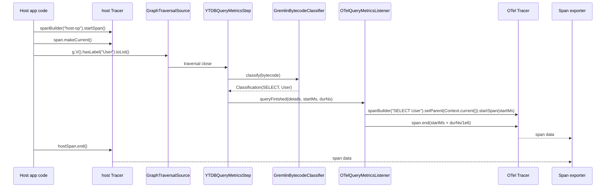
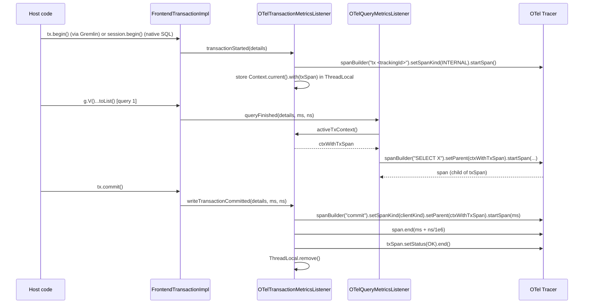
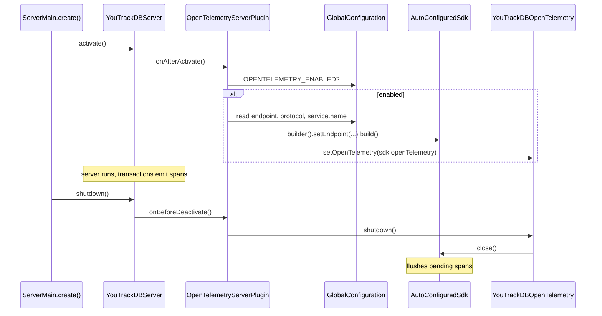

# YTDB-496 OpenTelemetry support — Design

## Overview

This design adds a new optional Maven module `youtrackdb-opentelemetry` that turns the existing YTDB listener callbacks into OpenTelemetry spans, so a host running embedded YTDB and an operator running a standalone server both get database telemetry visible in any OTel-compatible trace viewer.

This design assumes familiarity with the existing `QueryMetricsListener` and `TransactionMetricsListener` firing sites in `YTDBQueryMetricsStep` and `FrontendTransactionImpl`, and with the `YTDBTransaction` open / commit / rollback lifecycle. The audience is contributors maintaining the metrics and transaction subsystems in `core`.

Today YTDB has an internal `QueryMetricsListener` SPI that fires only on Gremlin traversal close, plus a `TransactionMetricsListener` that fires on write-transaction commit, but the listeners are per-transaction and the project ships no OTel binding. Native SQL queries (the path used for `db.command(...)`, MATCH, and DDL) currently fire neither listener. The design closes that gap with four load-bearing additions: a global listener registry in `core` so an OTel listener registered once at startup auto-applies to every subsequent transaction; two new default-no-op methods on `TransactionMetricsListener` (`transactionStarted`, `transactionRolledBack`) so the OTel module can emit a TX-lifetime parent span covering queries and commit as children; a new listener fire site in a private helper `executeStatementWithMetrics(SQLStatement, String, Object)` called from both `DatabaseSessionEmbedded.query()` (line 617) and `executeInternal()` (line 702) so every SQL statement type (SELECT, INSERT, UPDATE, DELETE, MATCH, DDL), read-only `db.query(...)` included, flows through the same listener API; and a pair of static-utility classifiers in `core` (`GremlinBytecodeClassifier`, `SqlSyntaxClassifier`), called directly from their respective fire sites, that extract `db.operation.name` and `db.collection.name` so spans carry sem-conv v1.33.0 attributes. A thread-local `GremlinSqlSuppression` flag activated by `YTDBGraphQuery.execute` and `YTDBGraphQuery.explain` (the Gremlin-to-SQL bridge that runs each per-step SQL query, or its `EXPLAIN`-prefixed form, via `session.query()`) keeps the SQL helper silent during Gremlin-driven SQL so one traversal emits exactly one span.

Other subsystems restructured to fit: the nested `QueryMetricsListener.QueryDetails` gains three `Optional<String>` accessors (operation, collection, namespace) and the nested `TransactionMetricsListener.TransactionDetails` gains one (namespace), `FrontendTransactionImpl.beginInternal()` and `rollbackInternal()` fire the new TX lifecycle calls (covering both Gremlin and native-SQL paths through one chokepoint), the existing exception-isolation try/catch in `FrontendTransactionImpl` and `YTDBQueryMetricsStep` widens from `Exception` to the narrower-than-Throwable union `Exception | LinkageError | AssertionError` to cover the OTel-specific failure modes (misconfigured SDK, missing exporter classes, assertion failures) without masking `VirtualMachineError` or `ThreadDeath`, the SQL hook reuses the existing `FrontendTransaction.getId(): long` accessor (no new tracking-id method) and adds three new accessors on `FrontendTransaction` — `getDefaultQueryMonitoringMode(): QueryMonitoringMode` exposing the per-TX fallback used by commit/rollback and by queries with no tag-rule match, `resolveQueryMonitoringMode(Optional<String> tag): QueryMonitoringMode` delegating to the process-global `QueryMonitoringModeResolver` for per-query mode selection from the query tag, and `iterateAllQueryListeners(): Iterable<QueryMetricsListener>` exposing the merged global-snapshot + per-TX-list view — and `GlobalConfiguration` gains five `OPENTELEMETRY_*` entries that drive the server-mode SDK init plus the tag-rule table.

In embedded mode the SDK resolution chain has three steps in priority order: host-provided via `YouTrackDBOpenTelemetry.setOpenTelemetry(otel)`, then `GlobalOpenTelemetry.get()` if the host configured the global, then a YTDB-built SDK auto-configured from `OPENTELEMETRY_*` config when neither of the first two yielded a real instance. The flag is never inert; ownership is tracked so `shutdown()` closes only the SDK YTDB created. In server mode YTDB always owns the SDK because the server is a standalone process; an `OpenTelemetrySdk` built from the same config entries wires through a `ServerLifecycleListener`-based plugin.

The rest of this document covers: Core Concepts (vocabulary primer), Class Design, Workflow, sem-conv attribute mapping, context propagation in embedded, transaction-lifetime span semantics, Gremlin bytecode classification, SQL execution layer hook, SDK lifecycle for embedded vs server, listener registration and ordering, and the exception-isolation contract.

## Core Concepts

This design introduces seven load-bearing ideas. Each is named and used without re-definition later; if a downstream section references one, the relevant definition is here. Each entry pairs the new term with what it replaces, so the delta from the baseline is visible at a glance.

**Span.** An OpenTelemetry record covering one unit of work with a start timestamp, an end timestamp, a name, a kind (CLIENT / SERVER / INTERNAL / PRODUCER / CONSUMER), a status (OK / ERROR), and arbitrary key/value attributes. Replaces "nothing in YTDB" (no prior telemetry primitive). → §"Sem-conv attribute mapping" and §"Class Design".

**Trace and Context.** A trace is a tree of spans bound by a shared `traceId`; each child span carries a `parentSpanId`. `Context` is the OTel mechanism for propagating the current span through the call stack so that a span created inside a method automatically attaches as a child of the surrounding span. Replaces "no parent/child relationship between operations". → §"Context propagation in embedded".

**Listener registry (global).** A pair of `CopyOnWriteArrayList`s of `QueryMetricsListener` and `TransactionMetricsListener` instances held in a process-global `GlobalListenerRegistry` in `core` and exposed via static methods on `YourTracks` (the existing `final` utility class). Snapshotted by `FrontendTransactionImpl.beginInternal()` into per-TX fields before `txStartCounter` increments, so both Gremlin and native-SQL transactions share one fire path. Replaces "per-TX `withQueryListener` only", which made the config flag inert. → §"Listener registration and ordering".

**TX-lifetime span.** The INTERNAL span the OTel TX listener opens on `transactionStarted` and closes on commit / failed-commit / rollback. Acts as the parent of every query span and the commit span emitted between begin and close. Replaces "no transaction-scoped grouping in the trace viewer". → §"Transaction-lifetime span semantics".

**Sem-conv v1.33.0.** OpenTelemetry's stable semantic conventions for database client spans, dictating attribute names (`db.system.name`, `db.query.text`, etc.), their requirement levels (Required / Conditionally Required / Recommended / Opt-In), and the span-name fallback chain. Replaces "no vendor-neutral attribute schema". → §"Sem-conv attribute mapping".

**Query tagging and per-tag mode resolution.** An enum `QueryMonitoringMode` (co-located with `QueryMetricsListener` / `TransactionMetricsListener` in `internal/common/profiler/monitoring/`) selects timing precision per query: `LIGHTWEIGHT` reads from `GranularTicker` at ~10 ms granularity with no syscall on the hot path; `EXACT` reads from `System.nanoTime()` / `System.currentTimeMillis()` for sub-millisecond precision at the cost of two syscalls per measurement. **Each query resolves its mode independently from its tag** through a process-global `QueryMonitoringModeResolver`: rules configured at startup via `OPENTELEMETRY_QUERY_MODE_TAG_RULES` map tag matchers (exact / prefix / regex) to modes, first-wins; when no rule matches, the resolver falls back to the per-TX default set via `YTDBTransaction.withQueryMonitoringMode(...)`; when no per-TX default is set, the fallback is `LIGHTWEIGHT`. Tag sources: Gremlin via `g.with(YTDBQueryConfigParam.querySummary, "X")` and SQL via the parser hint `/*+ TAG=X */` populating `SQLStatement.getQueryTag(): Optional<String>`. Two queries in the same transaction with different tags can use different modes; commit and rollback fire sites have no query tag and therefore use the TX default. Replaces "always-EXACT timing" implied by the original design and the per-TX-snapshot scheme from earlier iterations of this design. → §"Query tagging and per-tag rule resolution", §"SQL execution layer hook", and §"Gremlin bytecode classification".

**Query source classification.** Two static-helper classifiers in `core` extract `db.operation.name` and `db.collection.name` for the two query sources YTDB supports. The Gremlin classifier walks the TinkerPop `Bytecode` instruction list to resolve the first source step (`V`/`E`/`addV`/`addE`/`drop`) and the first `hasLabel(X)` argument. The SQL classifier reads the parsed `SQLStatement` subclass (SELECT / INSERT / UPDATE / DELETE / MATCH / DDL) and the target class from the FROM / INTO / UPDATE clause. Both return `Optional.empty()` when the query shape doesn't yield clean values. Called directly from the existing fire sites: `YTDBQueryMetricsStep` for Gremlin, and the `DatabaseSessionEmbedded.executeStatementWithMetrics` helper for SQL (invoked from both `query()` and `executeInternal()`). No SPI or ServiceLoader; the call sites parse before invoking, so the classifiers piggyback on parsing that runs anyway. Replaces "raw sanitized query string only". → §"Gremlin bytecode classification" (Gremlin rules table) and §"SQL execution layer hook" (SQL rules table and statement-subclass dispatch).

## Class Design

```mermaid
classDiagram
    class QueryMetricsListener {
        <<interface>>
        +queryFinished(QueryDetails, long, long) void
    }
    class TransactionMetricsListener {
        <<interface>>
        +transactionStarted(TransactionDetails) void
        +writeTransactionCommitted(TransactionDetails, long, long) void
        +writeTransactionFailed(TransactionDetails, long, long, Exception) void
        +transactionRolledBack(TransactionDetails) void
    }
    class QueryDetails["QueryMetricsListener.QueryDetails"] {
        <<interface>>
        +getQuery() String
        +getQuerySummary() String
        +getTransactionTrackingId() String
        +getOperationName() Optional~String~
        +getCollectionName() Optional~String~
        +getDatabaseName() Optional~String~
    }
    class TransactionDetails["TransactionMetricsListener.TransactionDetails"] {
        <<interface>>
        +getTransactionTrackingId() String
        +getDatabaseName() Optional~String~
    }
    class OTelQueryMetricsListener {
        -Tracer tracer
        -SpanKind clientKind
        -OTelTransactionMetricsListener txListener
        +queryFinished(QueryDetails, long, long) void
    }
    class OTelTransactionMetricsListener {
        -Tracer tracer
        -SpanKind clientKind
        -ThreadLocal~Context~ activeTxContext
        +transactionStarted(TransactionDetails) void
        +writeTransactionCommitted(TransactionDetails, long, long) void
        +writeTransactionFailed(TransactionDetails, long, long, Exception) void
        +transactionRolledBack(TransactionDetails) void
        ~activeTxContext() Context
    }
    class YouTrackDBOpenTelemetry {
        -OpenTelemetry openTelemetry
        -boolean ownedByYtdb
        -boolean serverMode
        -Tracer tracer
        +setOpenTelemetry(OpenTelemetry) void
        ~setOpenTelemetry(OpenTelemetry, boolean ownedByYtdb, boolean serverMode) void
        +shutdown() void
        ~tracer() Tracer
        ~clientKind() SpanKind
    }
    class GremlinBytecodeClassifier {
        <<utility>>
        +classify(Bytecode) Classification$
    }
    class SqlSyntaxClassifier {
        <<utility>>
        +classify(SQLStatement) Classification$
    }
    class SqlSanitizer {
        +sanitize(String rawSql) String
    }
    class Classification {
        +operationName Optional~String~
        +collectionName Optional~String~
    }
    class QueryMonitoringModeResolver {
        -List~TagRule~ rules
        -ConcurrentHashMap~String,QueryMonitoringMode~ cache
        +resolve(Optional~String~ tag, QueryMonitoringMode txDefault) QueryMonitoringMode
        +global() QueryMonitoringModeResolver$
    }
    class TagRule {
        <<sealed interface>>
        +matches(String tag) boolean
        +value() T
    }
    class TagRuleExact["TagRule.Exact"] {
        -String tag
        -T value
    }
    class TagRulePrefix["TagRule.Prefix"] {
        -String prefix
        -T value
    }
    class TagRuleRegex["TagRule.Regex"] {
        -Pattern pattern
        -T value
    }
    class FrontendTransaction {
        <<interface>>
        +getDefaultQueryMonitoringMode() QueryMonitoringMode
        +resolveQueryMonitoringMode(Optional~String~ tag) QueryMonitoringMode
        +iterateAllQueryListeners() Iterable~QueryMetricsListener~
    }
    class SQLStatement {
        +getQueryTag() Optional~String~
    }
    class OpenTelemetryServerPlugin {
        +onAfterActivate() void
        +onBeforeDeactivate() void
    }
    QueryMetricsListener ..> QueryDetails : nests
    TransactionMetricsListener ..> TransactionDetails : nests
    QueryMetricsListener <|.. OTelQueryMetricsListener
    TransactionMetricsListener <|.. OTelTransactionMetricsListener
    OTelQueryMetricsListener --> YouTrackDBOpenTelemetry : tracer()
    OTelTransactionMetricsListener --> YouTrackDBOpenTelemetry : tracer()
    OTelQueryMetricsListener --> QueryDetails : reads operation / collection / namespace
    OTelQueryMetricsListener --> OTelTransactionMetricsListener : txListener field (calls activeTxContext())
    GremlinBytecodeClassifier --> Classification : returns
    SqlSyntaxClassifier --> Classification : returns
    TagRule <|.. TagRuleExact
    TagRule <|.. TagRulePrefix
    TagRule <|.. TagRuleRegex
    QueryMonitoringModeResolver --> TagRule : holds list of
    FrontendTransaction --> QueryMonitoringModeResolver : resolveQueryMonitoringMode delegates to global()
    OpenTelemetryServerPlugin --> YouTrackDBOpenTelemetry : setOpenTelemetry(.., ownedByYtdb=true) / shutdown
```



The diagram covers the production classes the design introduces. Three interfaces in `core` are extended: `TransactionMetricsListener` and `QueryDetails` gain default methods; `QueryMetricsListener` itself stays unchanged but is consumed by a new impl; `FrontendTransaction` gains `getDefaultQueryMonitoringMode()` (renamed from the earlier `getQueryMonitoringMode()`), `resolveQueryMonitoringMode(Optional<String> tag)`, and `iterateAllQueryListeners()`. `SQLStatement` gains a default-empty `getQueryTag(): Optional<String>` accessor populated by the parser when a `/*+ TAG=X */` hint precedes the statement. Two new static-utility classes (`GremlinBytecodeClassifier`, `SqlSyntaxClassifier`) and one value record (`Classification`) land in `core` next to the existing parsing infrastructure — Gremlin's classifier piggybacks on the bytecode walk `YTDBQueryMetricsStep.produceScript()` already performs, and the SQL classifier dispatches on the `SQLStatement` AST that both `DatabaseSessionEmbedded.query()` and `executeInternal()` already produce via `SQLEngine.parse(...)` before delegating to the `executeStatementWithMetrics` helper. The classifiers are pure functions, called directly from the existing fire sites; no SPI, no ServiceLoader. A process-global `QueryMonitoringModeResolver` (also in `core/.../profiler/monitoring/`) walks a `List<TagRule<QueryMonitoringMode>>` parsed once at startup from `OPENTELEMETRY_QUERY_MODE_TAG_RULES` and caches resolved `(tag → mode)` pairs in a `ConcurrentHashMap` for cheap repeat lookups; the sealed `TagRule<T>` interface has three concrete shapes (`Exact`, `Prefix`, `Regex`) and is generic so a future per-tag slow-query threshold resolver can reuse it. Five classes in the new OTel module implement the integration (`OTelQueryMetricsListener`, `OTelTransactionMetricsListener`, `YouTrackDBOpenTelemetry`, `SqlSanitizer`, `OpenTelemetryServerPlugin`), keeping the static dependency arrow one-way (`youtrackdb-opentelemetry` → `core`).

Both OTel listeners take a `SpanKind clientKind` constructor argument that selects between CLIENT and INTERNAL for the query span and the commit child span. INTERNAL is used when YTDB runs in-process with the host (embedded), CLIENT when YTDB runs as a standalone server process and the host is a network client. The TX-lifetime span is always INTERNAL because it is a logical container, not a call. `YouTrackDBOpenTelemetry` resolves `clientKind` from how the SDK was wired: the `OpenTelemetryServerPlugin` invokes the package-private 3-arg variant `setOpenTelemetry(otel, ownedByYtdb=true, serverMode=true)` so CLIENT propagates to both listeners; every embedded entry point (host setter, `GlobalOpenTelemetry.get()` fallback, YTDB auto-configure) defaults `serverMode=false` so INTERNAL applies. The two flags carry separate concerns: `ownedByYtdb` controls whether `shutdown()` closes the SDK; `serverMode` controls the CLIENT/INTERNAL split on emitted spans. See §"Sem-conv attribute mapping" for the sem-conv rule that drives this choice.

The producer copies each `Classification(operationName, collectionName)` value into the `QueryDetails` accessors before the listener fires. A small `GremlinSqlSuppression` utility (thread-local re-entrant counter, also in `core`) is consulted by the SQL helper before firing the listener and is activated by `YTDBGraphQuery.execute` and `YTDBGraphQuery.explain` for the duration of Gremlin-driven SQL (the second site covers any caller of `YTDBGraphQuery.explain`, including the test-driven `YTDBGraphQuery.usedIndexes` path at line 37, which delegates to `this.explain(session)` at line 38). The diagram omits it as a utility that participates only through static method calls, with no class relationship to model.

The `ThreadLocal<Context>` field on `OTelTransactionMetricsListener` is **instance-scoped** — each TX listener carries its own ThreadLocal so two `YouTrackDBOpenTelemetry` facades coexisting in the same JVM (e.g., a test that builds a fresh SDK per test method) cannot leak state between each other. The query listener finds the TX listener through an explicit reference passed in at construction: `YouTrackDBOpenTelemetry` builds both listeners together and injects the TX listener into the query listener via `new OTelQueryMetricsListener(tracer, clientKind, txListener)`. The query listener reads the active TX context by calling `txListener.activeTxContext()` (instance method, package-private accessor returning `Context`). Using a ThreadLocal (rather than `Context.makeCurrent()`) avoids leaking the context across listener boundaries; using an explicit instance reference (rather than a static accessor) eliminates process-global state and lets multiple OTel facades coexist. No `@AfterEach` cleanup is needed for cross-test isolation because each test instantiates its own facade and discards it; the per-instance ThreadLocal dies with the listener.

Class Design is a structural reference section; edge cases for each component live in the mechanism sections this section points to.

### References
- D-records: D1, D2, D3, D5, D8, D9
- Invariants: Span kind by role
- Mechanics: none (single-file design)

## Workflow

The three diagrams below show, in order, a query span attaching to the host's active span, a TX-lifetime span containing query and commit children with the ThreadLocal-carried parent context, and the server-mode SDK boot/shutdown sequence driven by `ServerLifecycleListener` callbacks. Each diagram captures the synchronous-on-calling-thread property the design relies on for `Context.current()` to resolve to the host's span; the cross-section §"Context propagation in embedded" carries the prose argument.

### Query span lifecycle in embedded



The flow shows that the host code's active span becomes the parent of the YTDB query span automatically, because `Context.current()` resolves on the same thread the host called `makeCurrent()` on. The classifier runs in `YTDBQueryMetricsStep` before the listener fires, populating `QueryDetails.getOperationName()` and `getCollectionName()`; the listener uses them to build the sem-conv span name `SELECT User`.

The SQL path is symmetric. A private helper `executeStatementWithMetrics(SQLStatement, String, Object)` in `DatabaseSessionEmbedded`, called from both `query()` and `executeInternal()`, plays the role of `YTDBQueryMetricsStep` as the listener fire site, and `SqlSyntaxClassifier` replaces `GremlinBytecodeClassifier` for the accessor population. Span name construction, attribute mapping, and parent-context resolution are identical from the listener's point of view, because the listener reads `QueryDetails` accessors that have already been populated by whichever classifier ran. See §"SQL execution layer hook" for the SQL-side anatomy.

### Transaction lifecycle with full hierarchy



The participant box represents `FrontendTransactionImpl` because the listener fires happen inside `beginInternal()` / `rollbackInternal()` / `notifyMetricsListener()`. `YTDBTransaction.doOpen()` / `doRollback()` delegate to those methods, so the Gremlin path and the native-SQL path (`db.command(...)` flows that bypass the Gremlin `YTDBTransaction` wrapper but still reach `FrontendTransactionImpl` via `session.begin()`) share the same fire site.

The TX listener stores the context-carrying-TX-span in a `ThreadLocal<Context>` (not via `Context.makeCurrent()`) because the listener callback returns before any user code runs; `makeCurrent()` would leak into surrounding host code. The query listener consults the ThreadLocal directly via a package-private accessor when both listeners are registered together.

### Server-mode SDK lifecycle



The plugin is ServiceLoader-discovered. When the new module is not on the classpath, the plugin doesn't load and the server runs with no OTel cost.

Workflow is a sequence-diagram reference section; per-mechanism edge cases live in the sections each diagram points to.

### References
- D-records: D1, D2, D3, D4, D10
- Mechanics: none

## Sem-conv attribute mapping

**TL;DR.** Every emitted query span carries `db.system.name="youtrackdb"` plus a fallback chain of sem-conv attributes filled in to the extent the source allows. Span name follows the v1.33.0 chain: `db.query.summary` → `db.operation.name db.collection.name` → `db.collection.name` → `db.system.name`. Query text comes from the source-appropriate sanitizer: `ValueAnonymizingTypeTranslator` for Gremlin (existing), `SqlSanitizer` for SQL (Track 4).

The full mapping per attribute:

| Attribute | Requirement | Source | Notes |
|---|---|---|---|
| `db.system.name` | Required | constant `"youtrackdb"` | sem-conv §"Notes" allows custom value when not on well-known list |
| `db.namespace` | Conditionally Required | `QueryDetails.getDatabaseName()` (Gremlin: `session.getDatabaseName()` at the `YTDBQueryMetricsStep` fire site; SQL: same at the `DatabaseSessionEmbedded.executeStatementWithMetrics` helper, populated by either call site — `query()` or `executeInternal()`) | Track 1 adds the default accessor on both `QueryDetails` and `TransactionDetails`; omitted when the session has no name |
| `db.collection.name` | Conditionally Required | classifier result `.collectionName` | absent for multi-class traversals / anonymous SQL FROM subqueries |
| `db.operation.name` | Conditionally Required | classifier result `.operationName` | one of `SELECT` / `INSERT` / `UPDATE` / `DELETE` / `MATCH` / `CREATE` / `ALTER` / `DROP` |
| `db.query.text` | Recommended | `QueryDetails.getQuery()` | already sanitized: Gremlin via `ValueAnonymizingTypeTranslator`, SQL via `SqlSanitizer` |
| `db.query.summary` | Recommended | `QueryDetails.getQuerySummary()` if set, else `"{operation} {collection}"` if both present | client-provided summary wins |
| `db.response.status_code` | Conditionally Required | YTDB error code if available | currently no canonical YTDB error-code field; omitted in YTDB-496 |
| `error.type` | Conditionally Required (on failure) | exception class FQN | set on TX span at `writeTransactionFailed`, on query span when `statement.execute(...)` throws |
| `server.address` / `server.port` | Recommended | from server config in server mode | embedded mode omits |
| `db.response.returned_rows` | Opt-In | omitted in YTDB-496 | requires counting traversal / result-set results |

Span name fallback examples. Gremlin: a query labeled with `g.with(YTDBQueryConfigParam.querySummary, "findActiveUsers")...` produces `findActiveUsers`. An unlabeled `g.V().hasLabel("User").has("active", true).toList()` produces `SELECT User`. SQL: `db.command("SELECT FROM User WHERE active = true")` produces `SELECT User`. `db.command("MATCH {class:User, as:u}-knows->{class:User, as:f} RETURN u, f")` produces `MATCH User`. A shape that defies classification (Gremlin `g.V().union(...).path()` or SQL `SELECT FROM (SELECT FROM ...)`) produces `youtrackdb`.

Span kinds per role follow sem-conv v1.33.0 §"Span kind", which mandates CLIENT for over-network DB calls and INTERNAL for in-process and in-memory database libraries. YTDB satisfies both definitions in different deployments, so the kind is mode-aware: in embedded mode the query span and the commit child span are INTERNAL (YTDB runs in-process with the host); in server mode they are CLIENT (YTDB runs as a separate process the host reaches over the network). The TX-lifetime span is INTERNAL in both modes because it is a logical container, not a call. No SERVER / PRODUCER / CONSUMER spans are emitted by YTDB. Track 6a's listener tests (`OTelGremlinQueryTest`, `OTelSqlQueryTest`, `OTelTransactionMetricsListenerTest`) parametrize over `clientKind` so each test exercises both INTERNAL (embedded default) and CLIENT (server-plugin path), asserting the positive cases on `SpanData.getKind()` and the negative case (no SERVER / PRODUCER / CONSUMER spans) against the in-memory exporter.

### Edge cases / Gotchas

- An empty `db.query.text` (e.g., the rare case where `stringStatement` is null on the SQL path and `statement.getOriginalStatement()` also returns null) is acceptable; the attribute is Recommended, not Required.
- Classifiers MUST NOT throw. Any unexpected bytecode or `SQLStatement` subclass returns `Classification(Optional.empty(), Optional.empty())`. Gremlin tests cover at least: `V`-only, `addV`, `addE`, `drop()`, chained `hasLabel("A").hasLabel("B")` (first label wins), and `V().union(...)` (no clean classification). SQL tests cover each statement type plus FROM-with-subquery and multi-target FROM.
- `db.query.summary` cardinality stays low because the classifier output is low-cardinality. A host that sets `querySummary` to a per-request string defeats this; documented as a host responsibility.
- `db.namespace` resolution depends on the database name being readily available from the transaction context. If unavailable, the attribute is omitted, which is allowed by sem-conv ("if available").

### References
- D-records: D5, D6, D7, D8, D9
- Mechanics: none

## Span timing capture

**TL;DR.** OTel expresses span duration as `endTime - startTime`, never as an attribute. The listener API already passes the wall-clock start (`startedAtMillis`) and the monotonic duration (`executionTimeNanos`) as separate parameters of `queryFinished` and `writeTransactionCommitted`, so the OTel listener builds spans with explicit timestamps without inventing its own clock. The pattern is `setStartTimestamp(startedAtMillis, MILLISECONDS).startSpan()` then `span.end(startedAtMillis + executionTimeNanos / 1_000_000, MILLISECONDS)`, keeping the span's recorded duration aligned with what the fire site measured.

The mapping inside `OTelQueryMetricsListener.queryFinished(...)`:

```java
Span span = tracer.spanBuilder(name)
    .setSpanKind(CLIENT)
    .setStartTimestamp(startedAtMillis, TimeUnit.MILLISECONDS)
    .setParent(parentContext)  // host context or TX context from ThreadLocal
    .startSpan();
// set sem-conv attributes (db.system.name, db.query.text, ...)
span.end(startedAtMillis + executionTimeNanos / 1_000_000L, TimeUnit.MILLISECONDS);
```

Both values come from the same clock pair the fire site captured for the resolved mode at this query. Under `LIGHTWEIGHT` the fire site reads `ticker.approximateCurrentTimeMillis()` for the start and `ticker.approximateNanoTime()` for the duration delta; under `EXACT` it reads `System.currentTimeMillis()` and `System.nanoTime()`. The listener sees a consistent pair regardless of mode, so the OTel-recorded duration never drifts from the listener-measured duration.

Implicit `now()` would be wrong here. The listener callback fires *after* the operation completes, so `tracer.spanBuilder(...).startSpan()` without an explicit timestamp would record callback-entry time as the span start — losing the relationship between the span and the actual query timing. Passing `setStartTimestamp(...)` and `span.end(endTs)` makes the span match the measured operation.

The TX-lifetime span uses implicit `now()` for `startSpan()` because `transactionStarted` fires *at* the moment of begin, with no measured start to backdate. The commit-child span inside the TX is built the same way as a query span, with `commitAtMillis` / `commitTimeNanos` from `writeTransactionCommitted` filling the timestamp slots.

### Edge cases / Gotchas

- The listener API's `startedAtMillis` is in milliseconds. Under `EXACT`, the underlying clock is `System.currentTimeMillis()` (~1 ms precision); under `LIGHTWEIGHT`, the ticker resolves at ~10 ms granularity. Sub-millisecond accuracy on the span START is not preserved; the span DURATION retains nanosecond precision because `executionTimeNanos` passes through unchanged. Trace viewers render at millisecond resolution, so this is consistent with how spans display.
- A clock skew between the fire site and the OTel SDK's exporter does not affect span duration, only the absolute placement on a wall-clock timeline. The exporter normalizes timestamps per the backend protocol.
- An OTel-compatible backend that requires strictly-monotonic timestamps within a single trace sees no violation: every YTDB span is built with `(start, end)` from one fire-site clock read, and `end > start` always holds because `executionTimeNanos > 0` for any completed operation.

### References
- D-records: D8, D14, D15
- Invariants: Timing-mode uniformity (per-query)
- Mechanics: none

## Context propagation in embedded

**TL;DR.** The host application's active span automatically becomes the parent of every YTDB query span. `Context.current()` resolves to the host's span because the listener fires synchronously on the caller's thread per existing YTDB semantics, and transaction operations are pinned to the owner thread via `assertOnOwningThread`. No extra plumbing is needed for the common case; a regression test guards against future threading changes.

The verification:
- `YTDBQueryMetricsStep.close()` calls `listener.queryFinished(...)` directly (no executor wrapping).
- `FrontendTransactionImpl.notifyMetricsListener()` (commit success and failure paths) runs on the committing thread.
- `FrontendTransactionImpl.assertOnOwningThread()` is a `private` method called by `beginInternal`, `monitoredCommitInternal`, and every record-CRUD entry point (`getRecord`, `exists`, `loadRecord`, `deleteRecord`, `addRecordOperation`). The `query` / `command` / `execute` / `rollback` dispatch methods on `FrontendTransactionImpl` delegate to `DatabaseSessionEmbedded` and call only `checkIfActive`, but the listener fire paths above run synchronously on the calling thread because no executor or worker pool intervenes between the dispatch call and the listener fire.
- Result: when a host wraps a YTDB transaction inside `tracer.spanBuilder("host-op").startSpan().makeCurrent()`, `Context.current()` inside the YTDB listener returns the host's context with the host span as the active span.

The async caveat: if a future refactor moves traversal close (or commit) to a worker pool, `Context.current()` on that worker would not see the host span, and the YTDB span would attach to the root of a new trace. The test suite includes a propagation test that fails loudly if this happens; the failure mode (orphan YTDB spans) is also operator-visible in the trace viewer.

Explicit propagation is not exposed in this design. A host that needs to fan out a YTDB query to a custom executor must propagate the OTel `Context` itself per OTel's standard pattern (`Context.taskWrapping(executor)` or `Context.wrap(runnable)`). YTDB does not bridge that case.

### Edge cases / Gotchas

- A host that never opens an outer span sees the YTDB span as the trace root, with a synthetic `traceId`. This is correct OTel behavior.
- Mid-transaction context changes (host pushes a span between two queries) are observed: subsequent queries attach to the newer span. This is OTel's contract.
- The TX-lifetime span (see §"Transaction-lifetime span semantics") uses a `ThreadLocal` to carry its context to subsequent query spans rather than calling `Context.makeCurrent()`. The ThreadLocal is scoped to the TX listener instance and cleared on every TX termination path, guaranteeing no cross-transaction leakage.

### References
- D-records: D4
- Invariants: TX span boundedness
- Mechanics: none

## Transaction-lifetime span semantics

**TL;DR.** Every transaction gets one INTERNAL span covering `begin → close`. Successful write transactions add a CLIENT commit span as a child, overlapping the tail of the TX span. Failed commits set the TX span to ERROR with `error.type` populated. User rollbacks close the TX span with OK status and no commit child. Read-only transactions emit a TX span with query children and no commit child.

Lifecycle states the TX span moves through:

| Trigger | Action |
|---|---|
| `TransactionMetricsListener.transactionStarted` | Open INTERNAL span (always INTERNAL — logical container), store `(span, contextWithSpan)` in `ThreadLocal` |
| `writeTransactionCommitted` | Open child commit span with kind = `clientKind` (INTERNAL embedded, CLIENT server) at `commitAtMillis`, end at `commitAtMillis + commitTimeNanos/1e6`; end TX span with OK; clear ThreadLocal |
| `writeTransactionFailed` | End TX span with ERROR, `error.type=<cause class FQN>`, `db.response.status_code` if available; no commit span emitted; clear ThreadLocal |
| `transactionRolledBack` | End TX span with OK (rollback is not a failure); no commit span emitted; clear ThreadLocal |
| read-only close | Fires `transactionRolledBack` per existing YTDB semantics; same behavior as above |

The ThreadLocal is the carrier for context propagation to query spans inside the transaction. It holds the OTel `Context` that has the TX span set as current, but the listener does not call `Context.makeCurrent()` because that would leak the context outside YTDB. The ThreadLocal is an **instance** field on `OTelTransactionMetricsListener`, exposed via a package-private accessor `activeTxContext(): Context`. The query listener holds an explicit reference to its paired TX listener (injected by `YouTrackDBOpenTelemetry` at construction time) and calls `txListener.activeTxContext()` to read the current context. Each `YouTrackDBOpenTelemetry` facade builds its own pair of listeners, so multiple facades — including test fixtures that spin up a fresh SDK per test — never share state.

The TX span name uses the `transactionTrackingId` from `TransactionDetails`: `"tx <trackingId>"`. The tracking ID is either client-supplied via `withTrackingId(...)` or YTDB-generated from the internal transaction ID.

### Edge cases / Gotchas

- Nested transactions: per existing YTDB semantics, `TransactionMetricsListener` does not fire for nested (reentrant) inner commits. Only the outermost transaction emits a TX span.
- A listener exception during `transactionStarted` **before** the `ThreadLocal.set(...)` call (e.g., during `tracer.spanBuilder(...).startSpan()`) leaves the ThreadLocal unset; subsequent query spans attach to `Context.current()` (host's context), losing the TX-as-parent relationship. The test suite confirms the transaction completes correctly in this case, and the operator sees orphan query spans, which is the expected fail-safe behavior. The complementary case (an exception **after** the set) is covered in § "Exception isolation contract" Edge cases: the ThreadLocal stays set and is cleared by the eventual `writeTransactionCommitted` / `writeTransactionFailed` / `transactionRolledBack` path.
- An OTel SDK shutdown mid-transaction causes the `end()` call to silently drop the span. Acceptable; recovery requires a host-side reconfiguration.

### References
- D-records: D3, D5
- Invariants: TX span boundedness, Span kind by role
- Mechanics: none

## Gremlin bytecode classification

**TL;DR.** The classifier walks the TinkerPop `Bytecode` instruction list to identify the start step (`V`/`E`/`addV`/`addE`/`drop`) and the first label-bearing operator (`hasLabel`, `addV(X)` argument, `addE(X)` argument). Maps the start step to an operation name and the label to a collection name. Returns `Optional.empty()` for both fields when the shape doesn't yield clean values; never throws.

Classification rules:

| First source step | Operation name | Collection name source |
|---|---|---|
| `V()` | `SELECT` | first `hasLabel(X)` argument, else `Optional.empty()` |
| `E()` | `SELECT` | first `hasLabel(X)` argument, else `Optional.empty()` |
| `addV(X)` | `INSERT` | `X` (label argument of addV) |
| `addV()` (no label) | `INSERT` | `Optional.empty()` |
| `addE(X)` | `INSERT` | `X` (label argument of addE) |
| step chain ending with `drop()` | `DELETE` | first `hasLabel(X)` argument before the drop, else `Optional.empty()` |
| anything else | `Optional.empty()` | `Optional.empty()` |

Implementation lives in `core/.../profiler/monitoring/GremlinBytecodeClassifier.java` as a static utility (`Classification classify(Bytecode)`). `YTDBQueryMetricsStep.close()` calls it directly when building the inline `QueryDetails` and stashes the returned `Classification` in two `Optional<String>` fields read back by `QueryDetails.getOperationName()` / `getCollectionName()`. When no listener consults those accessors the work is paid (the call is unconditional inside the fire site), but the cost is one bytecode walk reusing the same instruction-list traversal pattern as the existing `produceScript()` sanitization, measured in microseconds and dominated by the listener call itself.

Timing capture in `YTDBQueryMetricsStep.close()` follows the per-query mode resolution mechanism described in §"Query tagging and per-tag rule resolution": the step reads the query tag from `traversal.getConfig(YTDBQueryConfigParam.querySummary)` and calls `currentTx.resolveQueryMonitoringMode(tag)` to pick the clock source for this traversal. Two Gremlin traversals in the same transaction with different tags can therefore record at different precisions; the suppressed inner SQL queries spawned by the traversal share the parent Gremlin span and emit no telemetry of their own (see §"SQL execution layer hook" for the `GremlinSqlSuppression` mechanism). Since only the outer Gremlin step reads the clock, precision uniformity within the traversal is automatic.

### Edge cases / Gotchas

- `g.V().hasLabel("A").hasLabel("B")`: returns `collectionName = "A"` (first wins). This matches sem-conv guidance to capture a single low-cardinality value rather than concatenating.
- `g.V().union(__.hasLabel("A"), __.hasLabel("B"))`: returns `collectionName = Optional.empty()` because the label is inside a sub-traversal, not a top-level instruction. The classifier does not descend into sub-traversals.
- `g.addV().property("label", "X")`: returns `collectionName = Optional.empty()` because the label is not a positional argument of `addV()`. Properties are not inspected.
- Numeric or non-string `hasLabel` argument (TinkerPop allows it via mutation in untyped code): the classifier checks `instanceof String` and returns `Optional.empty()` for non-String arguments.

### References
- D-records: D9
- Invariants: none specific (the classifier is fail-safe by contract)
- Mechanics: none

## Query tagging and per-tag rule resolution

**TL;DR.** Different statements in one transaction can claim different timing precisions when the host attaches identifying strings like `"findActiveUsers"` or `"monthly-scan"` to its calls. Gremlin uses `g.with(YTDBQueryConfigParam.querySummary, "X")`; native SQL uses the parser hint `/*+ TAG=X */`. A process-global lookup walks ordered first-wins matchers (exact, prefix, regex) configured at startup via `OPENTELEMETRY_QUERY_MODE_TAG_RULES`, mapping each identifier to a `QueryMonitoringMode` value. Fallback chain: matcher hit → per-TX default (`YTDBTransaction.withQueryMonitoringMode(...)`) → `LIGHTWEIGHT`. The identifier also surfaces as `db.query.summary` for dashboard breakdowns and sampler decisions. Replaces the earlier per-transaction-snapshot timing-mode scheme so one transaction can mix tracker-based 10 ms timing with sub-millisecond precision for hot paths.

The resolver and its rule types live next to the existing listener SPI in `core/.../profiler/monitoring/`:

```java
public final class QueryMonitoringModeResolver {
    private final List<TagRule<QueryMonitoringMode>> rules;          // immutable, compiled once at startup
    private final ConcurrentHashMap<String, QueryMonitoringMode> cache;

    public QueryMonitoringMode resolve(Optional<String> tag, QueryMonitoringMode txDefault) {
        if (tag.isEmpty()) return txDefault;
        return cache.computeIfAbsent(tag.get(), t -> resolveUncached(t, txDefault));
    }
    // resolveUncached walks rules in order, first-wins; falls back to txDefault.
}

public sealed interface TagRule<T> {
    boolean matches(String tag);
    T value();

    record Exact<T>(String tag, T value)       implements TagRule<T> { ... }
    record Prefix<T>(String prefix, T value)   implements TagRule<T> { ... }
    record Regex<T>(Pattern pattern, T value)  implements TagRule<T> { ... }
}
```

The sealed `TagRule<T>` is generic so a future per-tag slow-query threshold resolver (`SlowQueryThresholdResolver` consuming `TagRule<Long>`) reuses the same matcher hierarchy without duplicating the rule-parsing code.

Configuration format for `OPENTELEMETRY_QUERY_MODE_TAG_RULES`:

```
OPENTELEMETRY_QUERY_MODE_TAG_RULES=findActiveUsers=EXACT,prefix:expensive-=EXACT,regex:^batch-.*$=EXACT
```

- No prefix → `Exact` match.
- `prefix:X` → `Prefix` match against `tag.startsWith("X")`.
- `regex:X` → `Regex` match against `Pattern.compile("X")`.
- Comma-separated, first match wins (insertion order).
- Whitespace around `=` and `,` trimmed.
- Invalid rule (bad regex, unknown mode, malformed entry) logs WARN at startup and is dropped from the list; the resolver continues with the remaining valid rules.

The cache holds resolved `(tag → mode)` mappings so a long-running workload pays the rule walk once per distinct tag. Tags are documented as **low-cardinality identifiers**: a host that emits a unique tag per request (e.g., a UUID) defeats the cache and may blow process heap. Documented as host responsibility; not enforced by an LRU bound because typical workloads have dozens of tags, not millions.

Resolution call site on `FrontendTransaction`:

```java
default QueryMonitoringMode resolveQueryMonitoringMode(Optional<String> tag) {
    return QueryMonitoringModeResolver.global().resolve(tag, getDefaultQueryMonitoringMode());
}
```

The fire sites call this once per query before reading the clock:

```text
Gremlin path (YTDBQueryMetricsStep.close):
    tag  = traversal.getConfig(YTDBQueryConfigParam.querySummary)
    mode = currentTx.resolveQueryMonitoringMode(tag)
    if LIGHTWEIGHT: ticker reads
    else (EXACT):   System.nanoTime reads

SQL path (DatabaseSessionEmbedded.executeStatementWithMetrics):
    tag  = statement.getQueryTag()
    mode = currentTx.resolveQueryMonitoringMode(tag)
    if LIGHTWEIGHT: ticker reads
    else (EXACT):   System.nanoTime reads
```

Commit and rollback fire sites have no query in flight; they use `currentTx.getDefaultQueryMonitoringMode()` directly.

### Edge cases / Gotchas

- **No tag, no per-TX default** → `LIGHTWEIGHT`. This is the most common path and preserves the existing zero-syscall hot path for hosts that don't engage with monitoring config at all.
- **No tag, per-TX default set** → per-TX default applies. Backwards-compatible with hosts that already call `withQueryMonitoringMode(EXACT)` on every TX they care about.
- **Tag present, no rule matches** → falls back to per-TX default (then to `LIGHTWEIGHT`). A tag that the operator hasn't configured a rule for behaves identically to an untagged query; tagging never raises precision on its own.
- **Rule matches but specifies the same mode as TX default** → idempotent; the cache still records the resolution so future identical tags skip the walk.
- **Mid-TX rule change** → not supported. Rules are compiled once at startup from `OPENTELEMETRY_QUERY_MODE_TAG_RULES`; live reconfiguration is out of scope for YTDB-496. If runtime mutation becomes a requirement later, a snapshot-per-TX (analogous to the listener-registry snapshot) is the cleanest extension point.
- **Conflicting rules (two rules match the same tag)** → first-wins per insertion order. Operators ordering rules from most-specific to most-general is the documented pattern. Two `Exact` rules for the same tag is parsed as the first one only; the second logs WARN and is dropped at startup.
- **Cache cardinality blow-up** → an attacker or buggy host that emits unique tags per request grows the cache without bound. Documented as host responsibility; the listener layer keeps emitting spans either way, so the failure mode is heap pressure rather than dropped telemetry. Future hardening could add an LRU bound; not in YTDB-496.
- **Mode resolution determinism** → identical `(tag, txDefault)` always resolves to the same mode (the resolver is a pure function of immutable state). Both fire sites in one query read the same mode value because they both call `currentTx.resolveQueryMonitoringMode(tag)` with the same tag and the same TX default; the resolver returns a value, not a fresh decision.

### References
- D-records: D8, D14, D15
- Invariants: Timing-mode uniformity (per-query)
- Mechanics: none

## SQL execution layer hook

**TL;DR.** A private helper `executeStatementWithMetrics(SQLStatement, String, Object)` in `DatabaseSessionEmbedded`, called from both `query()` (line 617) and `executeInternal()` (line 702), funnels every native database statement (SELECT, INSERT, UPDATE, DELETE, MATCH, DDL — CREATE / ALTER / DROP for DDL). It wraps `statement.execute(...)` with mode-aware timing where the mode is resolved per-query from the statement's tag via `currentTx.resolveQueryMonitoringMode(statement.getQueryTag())` (see §"Query tagging and per-tag rule resolution"). The helper emits a `QueryDetails` carrying raw text, sanitized form (literals replaced with `?` placeholders), and operation / collection extracted from the parsed AST. A thread-local `GremlinSqlSuppression` flag set by `YTDBGraphQuery.execute(...)` and `YTDBGraphQuery.explain(...)` keeps the helper silent during Gremlin-driven SQL so one traversal emits exactly one span.

Hook anatomy in the `executeStatementWithMetrics` helper (both callers pass an already-parsed `SQLStatement` plus the raw SQL text and args):

```text
1. Read currentTx.iterateAllQueryListeners()  ← merged: global registry snapshot (captured at beginInternal) + per-TX list (added via withQueryListener)
2. If no listeners OR GremlinSqlSuppression.isActive():
     return statement.execute(this, args, true)         // short-circuit
   // No listeners → zero overhead when OTel is off and no per-TX listener.
   // Suppression active → no nested SQL span inside a Gremlin span.
3. Read tag = statement.getQueryTag()  ← Optional<String> populated by SQL parser from /*+ TAG=X */ hint
   Read mode = currentTx.resolveQueryMonitoringMode(tag)  ← delegates to global QueryMonitoringModeResolver;
                                                          falls back to tx.getDefaultQueryMonitoringMode() then LIGHTWEIGHT
   if LIGHTWEIGHT:
     ticker = YouTrackDBEnginesManager.instance().getTicker()
     startMillis = ticker.approximateCurrentTimeMillis()
     startNanos  = ticker.approximateNanoTime()         // no syscalls
   else (EXACT):
     startMillis = System.currentTimeMillis()
     startNanos  = System.nanoTime()                    // two syscalls
4. Run statement.execute(this, args, true) inside the existing try/catch
5. elapsedNanos = (mode == LIGHTWEIGHT)
                    ? ticker.approximateNanoTime() - startNanos
                    : System.nanoTime() - startNanos
6. Build QueryDetails (rawSql, args, statement, trackingId), fire listeners.queryFinished(...)
   wrapped in try/catch (Exception | LinkageError | AssertionError) so listener exceptions don't break the query
```

Both call sites do the parsing themselves before calling the helper. `query()` (line 617) parses, asserts `isIdempotent()`, then calls the helper. `executeInternal()` (line 702) uses the pre-parsed statement if its caller supplied one and otherwise calls `SQLEngine.parse(...)`, then calls the helper. The raw SQL text passed to the helper comes from `stringStatement` when non-null, else from `statement.getOriginalStatement()`. The helper itself never parses.

The `QueryDetails` impl is lazy: `getQuery()` calls `SqlSanitizer.sanitize(rawSql)` (from the OTel module) on first access; `getOperationName()` and `getCollectionName()` call `SqlSyntaxClassifier.classify(statement)` (a static utility in `core`) on first access. Hosts that don't read these accessors pay no sanitization or classification cost — the parsed `SQLStatement` is already available because `SQLEngine.parse(...)` runs unconditionally to execute the query.

Timing capture follows the per-query mode resolution model from §"Query tagging and per-tag rule resolution". The helper reads the tag from `statement.getQueryTag()` (populated by the SQL parser when a `/*+ TAG=X */` hint precedes the statement; `Optional.empty()` otherwise), then calls `currentTx.resolveQueryMonitoringMode(tag)` to pick the clock source. `LIGHTWEIGHT` reads from `GranularTicker` at 10 ms granularity, with no syscall on the hot path. `EXACT` reads from `System.nanoTime()` / `System.currentTimeMillis()`, paying two syscalls per query for sub-millisecond precision. Commit and rollback fire sites in `FrontendTransactionImpl.doCommit` and `notifyMetricsListener` have no per-statement tag context and read directly from `currentTx.getDefaultQueryMonitoringMode()`, so the commit clock pair matches whatever default the host set on the transaction (the same value the SQL hook falls back to when no tag rule matches). Different statements within one transaction can therefore record at different precisions while the commit timer remains aligned with the TX default; both fire sites in one query (Gremlin step at `YTDBQueryMetricsStep.close()` and SQL helper) resolve from the same tag and reach the same mode, satisfying the per-query Timing-mode uniformity invariant.

The Gremlin path does not double-fire. Gremlin traversals route through `session.query()`, which would otherwise re-enter the helper, but `YTDBGraphQuery.execute(...)` and `YTDBGraphQuery.explain(...)` each activate a thread-local `GremlinSqlSuppression` token (re-entrant counter, auto-closeable) for the duration of the underlying `transaction.query(...)` call (an `EXPLAIN`-prefixed query in the explain case). The helper checks `GremlinSqlSuppression.isActive()` at step 2 and short-circuits before any timer read or listener fire, so a Gremlin traversal emits exactly one span (the Gremlin one at `YTDBQueryMetricsStep.close()`) and no SQL children. This preserves the OTel sem-conv alignment of one user-facing operation to one span and prevents leaking the Gremlin-to-SQL translation as observable trace noise.

The `SqlSyntaxClassifier` dispatches on the `SQLStatement` subclass:

| Statement subclass | Operation name | Collection name source |
|---|---|---|
| `SQLSelectStatement` | `SELECT` | first FROM target class, else `Optional.empty()` |
| `SQLInsertStatement` | `INSERT` | INTO target class |
| `SQLUpdateStatement` | `UPDATE` | UPDATE target class |
| `SQLDeleteStatement` | `DELETE` | DELETE target class |
| `SQLMatchStatement` | `MATCH` | first pattern node's class, else `Optional.empty()` |
| `SQLCreateClassStatement` | `CREATE` | class name from the statement |
| `SQLAlterClassStatement` | `ALTER` | class name from the statement |
| `SQLDropClassStatement` | `DROP` | class name from the statement |
| anything else | `Optional.empty()` | `Optional.empty()` |

The `SqlSanitizer` runs a conservative regex pass over the raw SQL: replaces single-quoted string literals (handling escaped quotes), numeric literals, boolean literals, and date / timestamp literals with `?`. Already-parameterized text passes through unchanged because the literal patterns don't match `?` placeholders.

### Edge cases / Gotchas

- `stringStatement` can be null when an internal recursive call passes a pre-parsed `SQLStatement`. The hook falls back to `statement.getOriginalStatement()` for the raw SQL. If both are null (unusual), the hook emits `db.query.text=""` and the span still carries operation / collection.
- DDL statements have no literals to sanitize. `CREATE INDEX User.email UNIQUE` passes through `SqlSanitizer` unchanged.
- A statement with multi-target FROM (`SELECT FROM User, Order WHERE ...`) yields `collectionName = "User"` (first wins) per sem-conv guidance to keep cardinality low. An anonymous FROM subquery yields `Optional.empty()`.
- The transaction tracking ID comes from `String.valueOf(currentTx.getId())` — `FrontendTransaction.getId(): long` already exists at line 215 and returns a stable internal ID. No new accessor is added in Track 4.
- An exception thrown by `statement.execute(...)` propagates as before. The hook still fires the listener with the elapsed time and the SQL, with the span status set to ERROR and `error.type` populated, before the exception re-throws. The fire is wrapped so a listener exception during error handling doesn't mask the original.
- Under LIGHTWEIGHT (default), query durations shorter than the ticker's granularity (~10 ms) round to zero or one tick. Acceptable for trace viewers, which render at millisecond resolution anyway. A host that wants sub-millisecond precision picks one of two routes: configure a tag rule like `OPENTELEMETRY_QUERY_MODE_TAG_RULES=findHotpath=EXACT` and emit `/*+ TAG=findHotpath */` hints on the relevant queries, or call `YTDBTransaction.withQueryMonitoringMode(EXACT)` once on the transaction to set the default mode for every query in that TX that doesn't match a tag rule.
- A statement without a `/*+ TAG=X */` hint has `Optional.empty()` for its query tag and resolves to `currentTx.getDefaultQueryMonitoringMode()`. Callers using the legacy `YTDBTransaction.withQueryMonitoringMode(EXACT)` per-TX API see identical behavior to the earlier per-TX-snapshot scheme: every query in the TX uses EXACT.
- Tag rules are immutable after process startup; mid-TX changes to the rule table are not supported in YTDB-496 (see §"Query tagging and per-tag rule resolution" Edge cases). Mid-TX changes to the per-TX default via `YTDBTransaction.withQueryMonitoringMode(...)` take effect immediately for the next query in the same TX because the helper re-reads `getDefaultQueryMonitoringMode()` per query — no snapshot, no `next begin()` cycle latency.
- Gremlin SQL suppression is a thread-local counter (re-entrant, not a boolean). Both `YTDBGraphQuery.execute(session)` and `YTDBGraphQuery.explain(session)` wrap their underlying `transaction.query(...)` calls in try-with-resources `GremlinSqlSuppression.activate()` tokens; nested Gremlin steps inside one another increment / decrement the counter. The helper checks `GremlinSqlSuppression.isActive()` (counter > 0) before any timer read or listener fire. Counter scope is thread-local, so concurrent transactions on different threads do not interfere. Cleanup runs in `AutoCloseable.close()` even if the SQL call throws, so an exception inside Gremlin (or in explain introspection) does not leak the suppression state to the next operation on that thread.
- `DatabaseSessionEmbedded.computeScript(language, script, args)` (script-engine entry point, around line 753) is NOT instrumented at the script level. SQL statements executed by the script internally route through `db.command(...)` / `db.execute(...)` / `db.query(...)` and thus through `executeStatementWithMetrics`, emitting one SQL span per inner statement as expected. A wrapping "script" span is not emitted. Wrapping script execution in a single parent span is a future-ticket concern; the per-statement spans inside the script already provide useful telemetry.

### References
- D-records: D8, D9, D15
- Invariants: TX span boundedness, Listener exception isolation, Timing-mode uniformity (per-query — both fire sites in one query resolve to the same mode from the same tag), Gremlin span uniqueness (one Gremlin traversal emits one span; no SQL children)
- Mechanics: none

## SDK lifecycle: embedded vs server

**TL;DR.** Hybrid ownership model. The host owns the `OpenTelemetry` instance when it has wired one (either explicitly through the setter or globally via `GlobalOpenTelemetry.set(...)`). When `OPENTELEMETRY_ENABLED=true` and the host has wired nothing, YTDB auto-configures its own SDK from `OPENTELEMETRY_*` config entries — the same path server mode takes. The facade tracks ownership so `shutdown()` closes only the SDK YTDB created. In server mode YTDB always owns the SDK because the server is a standalone process.

Embedded path — three-step resolution on first listener fire:

1. **Explicit setter wins**: if the host called `YouTrackDBOpenTelemetry.setOpenTelemetry(otel)`, use that instance. Ownership = host. `shutdown()` will not close it.
2. **GlobalOpenTelemetry fallback**: if the host called `GlobalOpenTelemetry.set(otel)` somewhere in its bootstrap (the standard OTel pattern), `GlobalOpenTelemetry.get()` returns the real SDK. Use that instance. Ownership = host. `shutdown()` will not close it.
3. **YTDB auto-configure**: if neither of the above produced a real SDK and `OPENTELEMETRY_ENABLED=true`, the facade builds an `OpenTelemetrySdk` via `AutoConfiguredOpenTelemetrySdk` using the `OPENTELEMETRY_*` config entries (endpoint, protocol, service name). Ownership = YTDB. `shutdown()` closes this SDK.

If `OPENTELEMETRY_ENABLED=false` (default), step 3 is skipped and the facade returns no-op tracer; YTDB emits nothing regardless of any host wiring. The flag is the master switch.

Server path:

1. `ServerMain.create()` builds a `YouTrackDBServer` and calls `activate()`.
2. The server discovers `ServerLifecycleListener` implementations via the `ServiceLoader.load(ServerLifecycleListener.class)` call Track 5 adds to `YouTrackDBServer.activate()` (the existing code only honors explicit `registerLifecycleListener(...)` calls), appends them to the existing `lifecycleListeners` list, and calls `onBeforeActivate` on each.
3. After databases load, the server calls `onAfterActivate` on each lifecycle listener.
4. `OpenTelemetryServerPlugin.onAfterActivate()` reads config: if `OPENTELEMETRY_ENABLED=true`, builds an `AutoConfiguredOpenTelemetrySdk` with the configured endpoint, protocol, and service name; calls the package-private 3-arg variant `YouTrackDBOpenTelemetry.setOpenTelemetry(sdk.getOpenTelemetrySdk(), ownedByYtdb=true, serverMode=true)`. The `serverMode=true` flag causes the facade to select `SpanKind.CLIENT` for the query and commit listeners; the `ownedByYtdb=true` flag causes `shutdown()` to close the SDK on server stop. Embedded entry points (host setter, `GlobalOpenTelemetry.get()` fallback, YTDB auto-configure) default `serverMode=false`, so embedded query and commit spans use `SpanKind.INTERNAL`.
5. Transactions run, spans emit.
6. On shutdown, `server.shutdown()` calls `onBeforeDeactivate` on every plugin. `OpenTelemetryServerPlugin.onBeforeDeactivate()` calls `YouTrackDBOpenTelemetry.shutdown()`, which unregisters listeners and closes the SDK (`OpenTelemetrySdk.close()` flushes pending spans).

Idempotence and ownership transitions:
- `setOpenTelemetry` called when YTDB has already auto-configured its own SDK: the facade closes the YTDB-owned SDK first, then installs the host's instance and flips ownership to host.
- `setOpenTelemetry` called twice with host-owned SDKs in a row: the facade does not close anything (host owns lifecycle for both); it just swaps the reference and re-registers listeners against the new tracer.
- `shutdown` called twice is a no-op the second time.
- An exception during SDK shutdown is logged but does not propagate.

### Edge cases / Gotchas

- A host that sets `OPENTELEMETRY_ENABLED=true` without wiring any OTel sees YTDB open a network connection to the configured endpoint (default `http://localhost:4317`) on first listener fire. The flag is an explicit opt-in so this is acceptable; the auto-configure path logs one INFO line with the resolved endpoint so the operator sees what happened. Hosts that do not want this MUST keep `OPENTELEMETRY_ENABLED=false`.
- Embedded host that calls `YouTrackDB.close()` without calling `YouTrackDBOpenTelemetry.shutdown()`: when ownership is YTDB the SDK keeps running until the JVM exits and OTel's own shutdown hook flushes pending spans. When ownership is host, the SDK was never ours to close.
- Server with `OPENTELEMETRY_ENABLED=false` (default): the plugin's `onAfterActivate` returns immediately. Zero OTel runtime cost. The listeners never register.
- Race on auto-configure: the facade synchronizes the resolution chain so two concurrent first-listener-fires produce exactly one SDK build.
- An invalid endpoint in `OPENTELEMETRY_EXPORTER_ENDPOINT`: the autoconfigure builder fails fast with a clear log message. In server mode the server does not start; in embedded mode the listener fire fails once (the exception is caught by the isolation wrapper), and subsequent fires re-attempt resolution (which fails the same way until the operator fixes config).

### References
- D-records: D2
- Mechanics: none

## Listener registration and ordering

**TL;DR.** A process-global registry in `core` (a pair of `CopyOnWriteArrayList`s for query and transaction listeners, exposed via static methods on `YourTracks`) holds listeners installed before transactions begin. `FrontendTransactionImpl.beginInternal()` snapshots the registry into per-TX fields before `txStartCounter` increments, and the transaction uses that snapshot for its lifetime. `YTDBTransaction.doOpen()` delegates to `beginInternal()`, so Gremlin and native-SQL transactions share the same snapshot site. Per-TX `withQueryListener` continues to work, adding listeners on top of the snapshot for that transaction only. The OTel module installs its listeners through this registry; nothing about the existing per-TX API changes.

Ordering rules:
- Within the registry, listeners fire in insertion order.
- For a given transaction, registry-snapshot listeners fire before per-TX listeners added via `withQueryListener`.
- A listener registered after a transaction has begun is not seen by that transaction; it takes effect from the next transaction onward.
- This ordering applies to BOTH fire paths: Gremlin (`YTDBQueryMetricsStep.close()`) and SQL (`DatabaseSessionEmbedded.executeStatementWithMetrics` helper). Both invoke `currentTx.iterateAllQueryListeners()` (Track 1 accessor) which yields the snapshot then the per-TX list in order, so per-TX `withQueryListener` listeners fire for SQL statements as well as Gremlin traversals.

Registration API additions — static methods on the existing `final` utility class `YourTracks` (the registry is process-global; the `YouTrackDB` interface gets no new methods, keeping `YouTrackDBRemote` and other implementors untouched):

```java
public static void registerGlobalQueryListener(QueryMetricsListener listener);
public static void unregisterGlobalQueryListener(QueryMetricsListener listener);
public static void registerGlobalTransactionListener(TransactionMetricsListener listener);
public static void unregisterGlobalTransactionListener(TransactionMetricsListener listener);
```

`YouTrackDBOpenTelemetry.setOpenTelemetry(otel)` registers a `OTelQueryMetricsListener` and an `OTelTransactionMetricsListener` instance. Subsequent `setOpenTelemetry` calls first `unregister` the previously-registered instances before registering fresh ones tied to the new SDK. `YouTrackDBOpenTelemetry.shutdown()` unregisters them.

### Edge cases / Gotchas

- Concurrent `register` and transaction `doOpen`: the registry uses `CopyOnWriteArrayList`, so a `doOpen` reads a consistent snapshot even if a `register` is in flight. The behavior is "either the listener is in the snapshot or it isn't", deterministic per transaction.
- A listener implementation that holds a reference to the YTDB transaction: the listener outlives the transaction (it lives in the global registry). The listener MUST NOT cache transaction-scoped state; if it needs per-TX state, use `TransactionDetails.getTransactionTrackingId()` as the keying value.
- Duplicate registration of the same listener instance: the registry deduplicates by reference identity. A second `register` of the same instance is a no-op.

### References
- D-records: D1
- Invariants: TX span boundedness
- Mechanics: none

## Exception isolation contract

**TL;DR.** Every listener callback fires inside a try/catch in the YTDB firing site. A throw from any listener (a bug, a misconfigured OTel SDK, an OOM in span allocation) is logged at WARN and swallowed, so the transaction lifecycle continues. The protection extends to the two new methods `transactionStarted` and `transactionRolledBack` introduced in Track 1.

Current isolation sites:
- `YTDBQueryMetricsStep.close()` wraps `listener.queryFinished(...)` in `try { ... } catch (Exception e) { ... }` today (line 148). Track 1 widens the catch to `catch (Exception | LinkageError | AssertionError t)` and changes the call to iterate the per-TX listener snapshot.
- `FrontendTransactionImpl.notifyMetricsListener()` (line 712) wraps the commit success and failure paths in `try { ... } catch (Exception e) { ... }` today (line 730). Track 1 widens to the same multi-catch union and iterates the snapshot.

New isolation sites in this design (all in `FrontendTransactionImpl` so the existing private wrapper shape is reused without a hoist):
- `FrontendTransactionImpl.beginInternal()` wraps the loop calling `listener.transactionStarted(...)` per registered listener.
- `FrontendTransactionImpl.rollbackInternal()` wraps the loop calling `listener.transactionRolledBack(...)` per registered listener, gated by `txStartCounter == 0` so nested rollbacks don't double-fire.

The wrapper catches the union `Exception | LinkageError | AssertionError` (Track 1 widens both existing wrappers from `Exception` to this narrower-than-Throwable set), because the OTel-typical failure modes would otherwise unwind the transaction: a misconfigured SDK throwing `IllegalStateException`, missing exporter classes throwing `NoClassDefFoundError` (a `LinkageError`), or assertion failures in custom listener implementations. The union deliberately excludes `VirtualMachineError`, so a true `OutOfMemoryError` or `StackOverflowError` still propagates per JLS guidance. The JVM is dying anyway in that case, and silencing the fatal condition would mask the problem. `ThreadDeath` is also outside the union. The log entry uses the listener class name to point the operator at the responsible component.

When one listener in the snapshot throws, subsequent listeners in the iteration still fire. This is important because the OTel listener may be installed alongside a custom host listener; a bug in the host listener must not prevent OTel emission, and vice versa.

### Edge cases / Gotchas

- A listener that throws on every call generates one log line per call. At LDBC benchmark loads (~10k qps) this is a log flood. Acceptable in YTDB-496; if it becomes operationally painful, a follow-up adds rate limiting on the log.
- The TX span's ThreadLocal is set inside the try/catch wrapper. If `transactionStarted` throws **after** the `ThreadLocal.set(...)` call (e.g., during a subsequent attribute-set call on the span), the ThreadLocal remains set for the duration of the transaction. The `clear` paths in `writeTransactionCommitted` / `writeTransactionFailed` / `transactionRolledBack` run inside their own try/catch and clear the ThreadLocal in a `finally`, so eventual cleanup happens regardless of where the exception fired. The complementary "before set" case is in § "Transaction-lifetime span semantics" Edge cases.
- An exception in `OpenTelemetrySdk.close()` during server shutdown is logged but not propagated; the server shutdown completes regardless.

### References
- D-records: D11 (wrapper widened from `Exception` to the union `Exception | LinkageError | AssertionError`)
- Invariants: Listener exception isolation
- Mechanics: none
