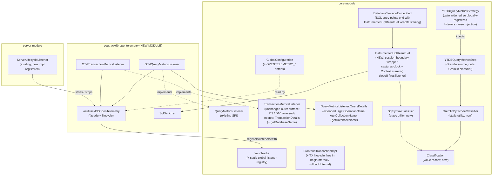

<!-- workflow-sha: 5db61a37462f0b28965113f39a81b6fcb1ed1340 -->
# YTDB-496 OpenTelemetry support

## Design Document
[design.md](design.md)

## High-level plan

### Goals

Expose YouTrackDB query and transaction telemetry through OpenTelemetry so that hosts running embedded YTDB, and operators running standalone YTDB servers, see database calls as spans in their trace viewers (Jaeger, Tempo, Datadog, etc.). The telemetry follows OTel semantic conventions v1.33.0 for database client spans so it lights up in DB-aware tooling without per-vendor adapters. The integration ships in a new optional Maven module `youtrackdb-opentelemetry`; `core` and `server` carry no OTel dependency.

Both Gremlin traversals and native SQL queries emit spans. A Gremlin query emits one CLIENT span with sanitized `db.query.text` produced by the existing `ValueAnonymizingTypeTranslator`, plus `db.operation.name` and `db.collection.name` extracted from the bytecode. A native SQL query (`db.command("SELECT ...")`, MATCH, DDL) emits one CLIENT span with the raw SQL text sanitized into placeholders, plus the operation type and target class parsed from the statement AST. Both share the same `db.system.name=youtrackdb` and attach to the host's active trace context (`Context.current()`). Write transactions emit a standalone commit span via the existing `writeTransactionCommitted` / `writeTransactionFailed` listener; read-only transactions emit no TX-lifetime span at all (D3 reversed: there is no YTDB-side wrapper span grouping query and commit). The `db.youtrackdb.transaction.tracking_id` attribute on the commit span gates by construction via `QueryDetails.getExplicitTrackingId().isPresent()` (M49), so hosts that never called `withTrackingId(...)` pay zero cardinality cost.

In embedded mode the SDK resolution chain is: host-provided via `YouTrackDBOpenTelemetry.setOpenTelemetry(...)`, then `GlobalOpenTelemetry.get()` if the host configured the global, then YTDB-built from `OPENTELEMETRY_*` config when neither of the first two yielded a real SDK. The flag is never inert: enabling `OPENTELEMETRY_ENABLED=true` always produces telemetry. In server mode YTDB always owns the SDK because the server is a standalone process.

### Constraints

- **Baseline assumption — PR #1038 and PR #1077 merged on `develop`**: [PR #1038](https://github.com/JetBrains/youtrackdb/pull/1038) (Gremlin-to-MATCH translator) and [PR #1077](https://github.com/JetBrains/youtrackdb/pull/1077) (YTDB-820 transaction-scoped result cache) are on `develop` at the time YTDB-496 implementation starts. Track 1 and Track 4 build on the following surfaces from those PRs: `YTDBMatchPlanStep` exists with a `boundaryAlias` field and an `outputType` field; `MultiPlanMatchStep` (PR #1038 Track 10 union variant) exists on `develop` so Path A union classification compiles; `CachedResultSetView` implements the public `ResultSet` interface so Track 4's wrapper composes; `IdempotentExecutionStream` exists with the substitution semantics PR #1077 documents. **Track 1 scope extension**: Track 1 adds a `private final Classification classification` field (2 String refs per boundary step instance), a fifth constructor parameter, and a public `getClassification(): Classification` accessor to `YTDBMatchPlanStep`; updates the `GremlinToMatchStrategy` construction site to compute the precomputed value once at translation time (`operation="SELECT"` hardcoded for Phase 1 read patterns; `collection` from `pattern.firstNode().aliasClasses`, else `Optional.empty()`). The accessor lands inside YTDB-496's commit history because it exists exclusively for OTel telemetry classification and the 2-String memory cost is the minimum the boundary step can pay while still supporting Path A dispatch; retaining the full ~19-field `MatchPlanInputs` IR would be wasteful for code that needs only operation and collection.
- **One-way dependency** (relaxed for the context API): `youtrackdb-opentelemetry` depends on `core` for the listener SPI. `core` MAY declare `io.opentelemetry:opentelemetry-context` as a compile-scope dependency — a ~20 KB API-only artifact with no transitive dependencies — because Track 1's `GremlinSpanLifecycleHook` and Track 4's `InstrumentedSqlResultSet` both consume `io.opentelemetry.context.Context` as a propagation handle. `core` MUST NOT pull `opentelemetry-sdk`, `opentelemetry-exporter-*`, or `opentelemetry-instrumentation-*`; those stay confined to the OTel module. Track 2's dependency-arrow check enforces this narrower invariant (allowlist `opentelemetry-context`; denylist every other `io.opentelemetry:*` artifact in `core/pom.xml`). YTDB without the OTel module retains zero OTel runtime cost beyond the context-API artifact on the classpath.
- **Sem-conv v1.33.0 compliance**: stable semantic conventions for database spans cover attribute names, requirement levels, and sanitization rules. Custom `db.system.name = "youtrackdb"` per §"Notes" of the spec.
- **Host-preferred SDK ownership in embedded**: a host that wires its own `OpenTelemetry` (via setter or `GlobalOpenTelemetry.set(...)`) wins. When no host SDK is found and `OPENTELEMETRY_ENABLED=true`, YTDB auto-configures its own SDK from `OPENTELEMETRY_*` config entries so the flag is never inert. Ownership is tracked so YTDB only closes the SDK it created. In server mode YTDB always owns the SDK because the server is a standalone process.
- **No backward-compat scaffolding**: greenfield emission, ignore `OTEL_SEMCONV_STABILITY_OPT_IN` env var (introduced for instrumentations that already emit a previous version).
- **Listener exception isolation**: callbacks run synchronously on the caller thread; existing try/catch wrapping in the listener firing sites MUST extend to the new lifecycle hooks so a misconfigured OTel SDK never breaks transaction flow.
- **JDK 21+, Maven Wrapper, Spotless on new module**, JUnit 5 tests. The new module is greenfield, no JUnit 4 inertia to preserve.
- **Coverage gate**: 85% line / 70% branch on changed code per CLAUDE.md.

### Architecture Notes

#### Component Map

- **`QueryMetricsListener` / `TransactionMetricsListener` (core, existing SPI)**: the listener contracts. Their `QueryDetails` and `TransactionDetails` types are nested interfaces inside the respective listener interfaces; the plan qualifies them as `QueryMetricsListener.QueryDetails` and `TransactionMetricsListener.TransactionDetails` on first mention. `TransactionMetricsListener` keeps its existing surface (`writeTransactionCommitted`, `writeTransactionFailed`); no new lifecycle methods are added in YTDB-496 (D3 and D10 reversed — see Decision Records).
- **`QueryMetricsListener.QueryDetails` (core, existing; extended)**: gains `getOperationName()`, `getCollectionName()`, and `getDatabaseName()` returning `Optional<String>`. Populated by both query sources: `YTDBQueryMetricsStep` for Gremlin via the bytecode classifier (operation/collection) and `session.getDatabaseName()` (namespace); `DatabaseSessionEmbedded` for SQL via the syntax classifier (operation/collection) and the session's own database name (namespace).
- **`YourTracks` (core)**: gains static methods `registerGlobalQueryListener` / `unregisterGlobalQueryListener` / `registerGlobalTransactionListener` / `unregisterGlobalTransactionListener`. The registry is process-global (a static holder in `core/.../profiler/monitoring/`); the transaction factory consults the snapshot at `FrontendTransactionImpl.beginInternal()` time and uses that snapshot for the TX's lifetime. Per-TX `withQueryListener` continues to add listeners on top of the snapshot. The `YouTrackDB` interface gets no new methods, keeping `YouTrackDBRemote` and other implementors untouched.
- **`FrontendTransactionImpl` (core)**: `beginInternal()` captures the global-listener snapshot used for the lifetime of the transaction; the existing `notifyMetricsListener` (line 712) keeps the commit/failed-commit fires unchanged in shape and widens its catch to `Exception | LinkageError | AssertionError` per D11. No new listener fires are added in `beginInternal()` or `rollbackInternal()` (D10 reversed). Five new accessors on the `FrontendTransaction` interface: `getDefaultQueryMonitoringMode(): QueryMonitoringMode` exposes the per-TX fallback set via `YTDBTransaction.withQueryMonitoringMode(...)` (used by the commit fire site and as fallback when no tag rule matches); `resolveQueryMonitoringMode(Optional<String> tag): QueryMonitoringMode` delegates to the process-global `QueryMonitoringModeResolver` for per-query mode selection from the query tag; `resolveSlowQueryThresholdNanos(Optional<String> tag): long` delegates to the process-global `SlowQueryThresholdResolver` returning the per-tag threshold or the global default (D16, used by non-OTel listeners that want the same gating semantics; the OTel listener calls the resolver directly for testability); `getTrackingId(): String` returns the explicit tracking ID set via `YTDBTransaction.withTrackingId(...)` if present, else falls back to `String.valueOf(getId())` so the existing internal-ID source stays the default; and `iterateAllQueryListeners(): Iterable<QueryMetricsListener>` exposes the merged view (global snapshot + per-TX list added via `withQueryListener`) to both fire paths so per-TX listeners fire for SQL statements too. `YTDBTransaction.doOpen()` / `doRollback()` are not touched — they delegate to the underlying impl, so Gremlin and SQL paths both go through the same fire sites. See design.md §"Query tagging and per-tag rule resolution" for the resolver mechanism, rule format, and fallback chain, and §"Slow-query threshold gating" for the symmetric threshold resolver.
- **`YTDBQueryMetricsStep` (core)**: classifies the traversal by calling the new `GremlinBytecodeClassifier.classify(Traversal)` static utility (also in `core`) and exposes the result through the enriched `QueryDetails` to the listener callback. The classifier dispatches by traversal shape: Path A (translated by PR #1038's `GremlinToMatchStrategy`) reads `YTDBMatchPlanStep.getClassification()` (the precomputed value the strategy stored at translation time per the Track 1 boundary-step extension); Path B (fallback, the original step chain) walks the bytecode as before. Existing fire site, augmented (see D9 and D20).
- **`YTDBQueryMetricsStrategy` (core)**: TinkerPop strategy that injects `YTDBQueryMetricsStep` into Gremlin traversals. Today the gate routes only on the per-TX listener; Track 1 widens it so a non-empty global query-listener snapshot also causes injection. Without this edit, a host that registers only the OTel listener via the global registry would see no Gremlin spans because the step never gets injected. Ordering versus PR #1038's translator is established by TinkerPop's category boundary alone: `YTDBQueryMetricsStrategy` is declared as a `FinalizationStrategy`, PR #1038's `GremlinToMatchStrategy` is a `ProviderOptimizationStrategy`, and TinkerPop runs every `ProviderOptimizationStrategy` to completion before any `FinalizationStrategy` starts. The metrics step lands as the terminal of whichever step list the traversal ends up with, `YTDBMatchPlanStep`-only (Path A) or the original step chain (Path B), without needing any `applyPost(GremlinToMatchStrategy.class)` cross-strategy reference. See D20.
- **`DatabaseSessionEmbedded` (core)**: SQL execution layer. Six wrap sites Track 4 installs `InstrumentedSqlResultSet.wrapIfListening(...)` against: (a) `query(String, Object...)` line 617 (return at line 638) — backs `db.query(String, Object...)` and the Gremlin-to-SQL bridge's `transaction.query(...)` path; (b) `query(String, boolean, Map)` line 652 (return at line 679) — the Map-args overload; (c) `executeInternal()` line 702 idempotent branch (return at line 742) — stream-style ResultSets; (d) `executeInternal()` line 702 non-idempotent prefetched branch (return at line 739; the `LocalResultSetLifecycleDecorator` construction the wrap site replaces sits at line 738) — `LocalResultSetLifecycleDecorator`-wrapped writes; (e + f) the two `computeScript(...)` method declarations at lines 753 and 813 whose `return queryStartedLifecycle(original)` sit at lines 785 and 847 — multi-statement scripts. The `executeInternal()` wrap-site at line 702 is the chokepoint for SIX public methods: `execute(String, Object...)` line 689, `execute(String, Map)` line 693, `execute(SQLStatement, Map)` line 697, `command(String, Object...)` line 4507, `command(String, Map)` line 4512, `command(SQLStatement, Map)` line 4517. The three `command(...)` overloads delegate to the matching `execute(...)` overload via `execute(...).close()`; all three `execute(...)` overloads route through `executeInternal()`. The Gremlin DSL paths `g.yql(...)` / `g.command(...)` reach `executeInternal()` via `YTDBCommandService.execute(...)` → `YTDBGraphImplAbstract.executeCommand(...)` → `session.execute(SQLStatement, Map)` (line 697, read/write) or → `acquireSession()` + `schemaSession.command(SQLStatement, Map)` (line 4517, DDL). Wrapping `executeInternal()` at both return branches covers every public caller automatically — `db.query(...)`, `db.command(...)`, `db.execute(...)`, AND every `g.yql(...)` / `g.command(...)` Gremlin DSL passthrough per D39. Each wrap site parses via `SQLEngine.parse(...)`, builds the `ExecutionPlan` via `statement.execute(...)`, routes the result through the existing `queryStartedLifecycle(original)` for `activeQueries` tracking (or constructs `LocalResultSetLifecycleDecorator` on the non-idempotent branch), then wraps in `InstrumentedSqlResultSet.wrapIfListening(lifecycled, statement, rawSql, args, currentTx)` before returning. Track 4 adds the trailing `wrapIfListening(...)` call at all six wrap sites (D8). Covers SELECT / INSERT / UPDATE / DELETE / MATCH / DDL plus multi-statement scripts. Transaction-control (BEGIN / COMMIT / ROLLBACK) via `g.yql(...)` short-circuits in `executeCommand` before reaching `session.execute(...)` and emits no inner SQL span (outer Gremlin span classifies via D40).
- **`InstrumentedSqlResultSet` (core, NEW in `internal.core.db`)**: session-boundary `ResultSet` wrapper introduced by Track 4 as the SQL fire site. `wrapIfListening(...)` factory reads `currentTx.iterateAllQueryListeners()`; when the snapshot is empty, returns the inner result-set unchanged (zero-overhead fast path); otherwise resolves mode (`tag = Optional.empty()` since SQL has no tag source; resolver short-circuits to per-TX default), captures `startMillis` / `startEpochNanos` / `startNanoTime` under the chosen clock, captures `capturedContext = io.opentelemetry.context.Context.current()`, and allocates the wrapper. Iteration delegates to the inner result-set; each `next()` returning a non-null `Result` increments a row counter; any exception during `hasNext` / `next` is captured as `caughtError` and rethrown. `close()` computes elapsed time, builds `QueryDetails` (lazy sanitization + classification from the stored `SQLStatement`; row counter feeds `getResultCount()`), exposes `capturedContext` through `getParentContext()` so `OTelQueryMetricsListener` parents the SQL span with `setParent(details.getParentContext())`, fires every listener inside a per-listener multi-catch wrapper (`Exception | LinkageError | AssertionError`), then closes the inner result-set. The wrapper inspects nothing about the inner type, so it handles `LocalResultSet` (default and most non-cached paths) and `CachedResultSetView` (YTDB-820 cache hit and most cache miss paths) uniformly — see D8 for the full YTDB-820 inner-type matrix.
- **`LocalResultSet` (core, NOT modified by YTDB-496)**: the existing `ResultSet` impl every executor produces. The new wrapper composes over it via the public `ResultSet` interface; the existing 2-arg constructor stays in use by sub-plan callers and by YTDB-820's stream-slot substitution mechanism. Track 4 ships zero edits to `LocalResultSet.java` so YTDB-820's `IdempotentExecutionStream` substitution into the constructed `LocalResultSet`'s stream slot remains untouched. Sub-plans nested inside `LocalResultSet` (MATCH steps, sub-query steps, IF / WHILE flow control, script line steps) construct their own `LocalResultSet` instances via the existing 2-arg constructor and never reach `InstrumentedSqlResultSet`, so they do not double-fire.
- **`YTDBGraphQuery` (core)**: Gremlin-to-SQL bridge whose `execute(session)` (line 23) and `explain(session)` (line 31) each run a SQL query via `session.getActiveTransaction().query(...)`. Under Path B fallback, the underlying `transaction.query(...)` call exits through the same wrapper-installation path as direct SQL; the SQL span emitted by `InstrumentedSqlResultSet.close()` attaches as a child of the active Gremlin span because the wrapper's `capturedContext` field bound `Context.current()` at construction (the Gremlin span, already made-current by the OTel module's lifecycle hook on `YTDBQueryMetricsStep`) and the listener parents the SQL span with `setParent(details.getParentContext())`. The Path B fallback emits one Gremlin parent span + one SQL child span; Path A (translated) emits one Gremlin span only because `YTDBMatchPlanStep` calls `SelectExecutionPlan.start()` directly without going through any SQL entry point. No thread-local suppression machinery is needed (D20).
- **`GremlinBytecodeClassifier` / `SqlSyntaxClassifier` / `Classification` (core, new)**: two static-utility classes plus a shared value record. The Gremlin classifier's public entry point is `classify(Traversal)` and it dispatches internally: Path A reads `YTDBMatchPlanStep.getClassification()` (when the step list contains the translator's boundary step per PR #1038; the value is precomputed by `GremlinToMatchStrategy` and stored on the step via the Track 1 boundary-step extension); Path B walks the TinkerPop `Bytecode` as today. The SQL classifier reads the `SQLStatement` AST. Both return a `Classification(operationName, collectionName)` value the fire site copies into the `QueryDetails` accessors. Called directly — no SPI, no ServiceLoader. See D9 and D20.
- **`GlobalConfiguration` (core)**: new entries `OPENTELEMETRY_ENABLED`, `OPENTELEMETRY_EXPORTER_ENDPOINT`, `OPENTELEMETRY_EXPORTER_PROTOCOL`, `OPENTELEMETRY_EXPORTER_HEADERS` (comma-separated `key=value` pairs forwarded to the OTLP exporter as request headers; required by hosted OTLP backends — Honeycomb, Grafana Cloud, Datadog — for `Authorization=Bearer <token>`), `OPENTELEMETRY_EXPORTER_TIMEOUT_MILLIS` (default `10000`; OTLP exporter request timeout that prevents an unreachable collector from blocking exporter shutdown), `OPENTELEMETRY_SERVICE_NAME` for the server-mode SDK init, plus `OPENTELEMETRY_QUERY_SLOW_THRESHOLD_MILLIS` (default `0` = emit-all; operators opt into a positive value to drop fast successful queries) and `OPENTELEMETRY_QUERY_SLOW_THRESHOLD_TAG_RULES` (default empty, same `tag=value` / `prefix:` / `regex:` format as the mode rules) consumed by `OTelQueryMetricsListener` + the process-global `SlowQueryThresholdResolver` for slow-query gating with per-tag overrides (D16), plus `OPENTELEMETRY_COMMIT_SLOW_THRESHOLD_MILLIS` (default `0` = emit every successful commit; positive value gates successful commit spans on `executionTimeNanos < threshold`; failed commits always bypass) consumed by `OTelTransactionMetricsListener` for commit-side slow-query gating (D38), plus `OPENTELEMETRY_LOGS_ENABLED` (default `false`) and `OPENTELEMETRY_LOGS_MIN_SEVERITY` (default `INFO`) gating `OTelLogAppender` registration on the `LogManager.instance()` chokepoint (D34), plus `OPENTELEMETRY_METRICS_ENABLED` (default `false`), `OPENTELEMETRY_METRICS_PERIOD_MILLIS` (default `10000`, clamped to `>= 1000` at SDK init), and `OPENTELEMETRY_METRICS_INCLUDED_GROUPS` (default empty = all six groups enabled when metrics ON) gating `OTelMetricsBridge` against `SdkMeterProvider` + driving the six-group filter `queries`/`cache`/`storage`/`wal`/`locks`/`transactions` (D36, D37).
- **`OTelQueryMetricsListener` / `OTelTransactionMetricsListener` (new module)**: translate listener callbacks into OTel spans, taking the parent from `Context.current()` so embedded propagation is automatic.
- **`YouTrackDBOpenTelemetry` (new module)**: static facade. `setOpenTelemetry(OpenTelemetry)` for explicit host wiring; falls back to `GlobalOpenTelemetry.get()`. Registers the listeners with the global registry. Idempotent shutdown.
- **`SqlSanitizer` (new module)**: replaces string / numeric / date literals in raw SQL with `?` placeholders for `db.query.text` sanitization. Parameterized queries pass through unchanged. The only classifier-adjacent helper that stays in the OTel module — its output (`db.query.text`) is OTel-specific.

#### D1: Global listener registry

- **Alternatives considered**: keep per-TX `withQueryListener` only (config flag would be inert); auto-injection inside the `g.tx()` factory (chosen alternative for D1 → see Rationale below).
- **Rationale**: a `OPENTELEMETRY_ENABLED=true` flag must actually take effect without the host wiring every transaction by hand. A small global registry in `OYouTrackDB` consulted by the transaction factory is the least invasive way to deliver auto-enrolment while keeping per-TX override semantics intact. Factory-side auto-injection would couple the registry to the Gremlin entry point only and miss any direct `YTDBTransaction` construction.
- **Risks/Caveats**: registration order matters if multiple listeners coexist. The registry is a List preserving insertion order, and the transaction copies the current snapshot at begin time so mid-TX registrations don't take effect.
- **Implemented in**: Track 1 (registry SPI), Track 5 (OTel listener registration).

#### D2: Hybrid SDK ownership — host preferred, YTDB falls back to self-built

- **Alternatives considered**: YTDB always owns SDK in embedded (conflicts with host instrumentation when host has its own SDK); host-only in embedded with silent no-op fallback (sharp edge — operator enables flag, sees nothing, has no signal what went wrong); always-host in both modes (impossible in server mode where YTDB IS the process).
- **Rationale**: in embedded mode the resolution chain on first listener fire is (1) value passed to `YouTrackDBOpenTelemetry.setOpenTelemetry(otel)` if any, (2) `GlobalOpenTelemetry.get()` if it returns a non-no-op SDK, (3) lazy auto-configure from `OPENTELEMETRY_*` config entries via OTel autoconfigure (same path as server mode). Host-provided wins when present so we never duplicate a host's existing SDK; self-built fills the gap so `OPENTELEMETRY_ENABLED=true` always produces telemetry, regardless of whether the host has its own OTel setup. In server mode YTDB always owns the SDK because there is no host to provide one. The facade tracks ownership via an internal boolean so `shutdown()` closes the SDK only when YTDB created it.
- **Risks/Caveats**: a host that sets `OPENTELEMETRY_ENABLED=true` and forgets to wire its OTel sees YTDB silently open a network connection to the configured endpoint (default `http://localhost:4317`). The flag is an explicit opt-in so this is acceptable, and an INFO log records the situation. If the host later calls `setOpenTelemetry(...)` after self-built ran, the facade closes the YTDB-built SDK and switches to the host's instance.
- **Implemented in**: Track 5.
- **Full design**: design.md §"SDK lifecycle: embedded vs server"

#### D3: Full span hierarchy with TX as parent over query and commit (REVERSED)

- **Status**: REVERSED. The TX-lifetime wrapper span and the `transactionStarted` / `transactionRolledBack` listener methods that supported it are removed. Write transactions emit a standalone commit span via the existing `writeTransactionCommitted` / `writeTransactionFailed` API; read-only transactions emit no TX-level span at all. Query spans take their parent from `Context.current()` — the host's wrapping span when present, otherwise the trace root.
- **Reversal rationale**: the TX listener stays narrow at `writeTransactionCommitted` / `writeTransactionFailed` for write transactions only; no `transactionStarted` / `transactionRolledBack` methods exist. Mostly-read workloads would pay 2 extra spans per logical read query (TX-lifetime + implicit-rollback) for a wrapper that grouped at most one query child, and threshold-based query filtering exacerbates this by leaving the wrapper as pure noise around dropped query children. TX-level grouping in trace viewers is an OTel host responsibility through an outer host span, not a YTDB-side wrapper.
- **Alternatives considered**: defer TX-span emission until the first query-child threshold-passes (complex — buffered span construction, retroactive parent setup); separate config flag `OPENTELEMETRY_EMIT_TX_LIFETIME_SPAN` (kept the complexity); per-TX threshold rules for the wrapper (also kept the complexity).
- **Full design**: design.md §"Commit span emission for write transactions" (the Workflow subsection covering the standalone commit-span flow)

#### D4: OTel Context propagation — `Context.current()` for Gremlin and commit, explicit captured parent for SQL

- **Decision**: Gremlin query spans and the standalone commit span take their parent from `Context.current()` at fire time. The SQL query span takes its parent from the `Context` the `InstrumentedSqlResultSet` wrapper captured at construction, handed to the listener explicitly through `QueryDetails.getParentContext()` and applied via `setParent(...)`.
- **Rationale**: the `QueryMetricsListener` callback fires synchronously on the caller thread for Gremlin (`YTDBQueryMetricsStep.close()` calls the listener directly) and for commit (`assertOnOwningThread` pins TX operations to the owner thread), so `Context.current()` returns the host's active span with no extra plumbing on those paths. The SQL fire site differs: `InstrumentedSqlResultSet.close()` is driven by the consumer and is not guaranteed to run on the construction thread (a host may iterate or close the result-set on a worker). Capturing the parent at construction and passing it explicitly makes the SQL span's linkage thread-independent and guaranteed.
- **Alternatives considered**: (1) `Context.current()` at `close()` for SQL too, restored via `capturedContext.makeCurrent()` inside `close()` — initially chosen, but it left cross-thread linkage best-effort and required a `constructionThread` field, a Java `assert`, a `db.youtrackdb.span.thread_mismatch` attribute, and an outer Scope try/catch, more plumbing than the explicit-parent path for a weaker guarantee, so it was reversed. (2) explicit `withContext(Context)` per query on the public API — rejected as host-facing surface the design does not need. The "pass parent context through `QueryDetails`" option, first rejected here on a same-thread "no additional plumbing" basis, is the one now adopted for SQL: the SQL wrapper's `close()` violates the same-thread assumption that rejection rested on, and the explicit accessor is strictly less plumbing than the `makeCurrent()` machinery it replaces.
- **Risks/Caveats**: if a future change moves Gremlin traversal close or commit to a worker pool, `Context.current()` propagation on those two paths breaks silently. Mitigated by a propagation test that wraps a YTDB query in a host-context span and asserts the YTDB span's parent matches; it fails loudly if threading changes. The SQL path is already immune because it uses the explicitly captured parent.
- **Implemented in**: Track 3 (listener implementations), Track 4 (`InstrumentedSqlResultSet` + `QueryDetails.getParentContext()`), Track 6a (propagation test), Track 6c (`OTelResultSetThreadAffinityTest` asserting cross-thread SQL linkage holds).
- **Full design**: design.md §"Context propagation in embedded" and §"SQL execution layer hook"

#### D5: Span kinds by role — mode-aware CLIENT/INTERNAL

- **Alternatives considered**: all CLIENT regardless of mode (non-compliant with sem-conv §"Span kind" which mandates INTERNAL for in-process libraries; embedded YTDB qualifies); all INTERNAL regardless of mode (loses "database edge" in service maps when YTDB runs as a separate server process); mode-aware via runtime probe of the active session (extra branching at every fire site for a value that never changes after SDK init).
- **Rationale**: sem-conv v1.33.0 §"Span kind" is explicit — CLIENT for over-network database calls, INTERNAL for in-process and in-memory database libraries. YTDB matches both definitions across deployments: embedded mode runs in-process with the host, server mode runs as a separate process the host reaches over the network. The kind is therefore mode-aware on the CLIENT/INTERNAL axis and selected once at SDK init time, not per call, and applies to both the query span and the standalone commit span. Mechanism: a `SpanKind clientKind` constructor argument on both `OTelQueryMetricsListener` and `OTelTransactionMetricsListener`, resolved by `YouTrackDBOpenTelemetry` from a new `boolean serverMode` flag — `true` only when `OpenTelemetryServerPlugin` calls the package-private 3-arg variant `setOpenTelemetry(otel, ownedByYtdb=true, serverMode=true)`, `false` for every embedded entry point (host setter, `GlobalOpenTelemetry.get()` fallback, YTDB auto-configure). The two boolean flags carry separate concerns: `ownedByYtdb` drives shutdown; `serverMode` drives the CLIENT/INTERNAL split.
- **Risks/Caveats**: a host that embeds YTDB inside a server-like process (e.g., a microservice that uses YTDB as its store) sees INTERNAL spans, which most service-map renderers will not label as a database edge. Hosts that prefer the CLIENT label in such cases can override by wiring their own `OpenTelemetry` instance and using their own instrumentation policy. Documented in the embedded section.
- **Implemented in**: Track 3 (listener constructor + facade `clientKind()` accessor), Track 5 (server plugin signals `serverMode=true` via the 3-arg setter).

#### D6: `db.system.name = "youtrackdb"` (custom value)

- **Alternatives considered**: `other_sql` (loses identity; YTDB is not SQL-only).
- **Rationale**: sem-conv §"Notes" mandates the lowercase DBMS name as a custom value when not on the well-known list. `"youtrackdb"` is unambiguous. Future PR to add it to the well-known list is a separate concern.
- **Risks/Caveats**: backends may not recognize the system name for built-in dashboards until it's registered upstream.
- **Implemented in**: Track 3.

#### D7: Delegate sampling to the OTel sampler (REVERSED — superseded by D16)

- **Status**: REVERSED. Span emission is gated at the YTDB OTel listener via the slow-query threshold mechanism (D16), not delegated wholesale to the OTel SDK sampler. The two mechanisms remain complementary: the YTDB-side gate drops fast successful queries before any span allocation, and any host-side OTel sampler operates downstream on the spans that survive the gate.
- **Reversal rationale**: the original "let the sampler decide" approach assumes every query allocates a span and then gets dropped by the sampler downstream — head samplers run inside `startSpan()`, so the alloc-and-emit cost is already paid. On heavy read traffic this is the dominant cost. Operationally, hosts also need a way to filter "uninteresting fast queries" while keeping slow ones, and trace samplers (which are stochastic) are the wrong tool for a deterministic duration-based filter. Per-tag thresholds (D16) also let operators set materially different policies for hot paths vs batch queries, which a single sampler ratio cannot express.
- **What remains**: hosts that want stochastic sampling on top of the threshold gate can still configure an OTel SDK sampler in their `OpenTelemetry` instance; that sampler applies to whatever spans the YTDB gate emits. The two mechanisms compose without coordination.
- **Full design**: design.md §"Slow-query threshold gating"

#### D8: SQL execution layer hook at `InstrumentedSqlResultSet` session-boundary wrapper

- **Alternatives considered**: per-statement-type hooks inside each `SQLSelectStatement.execute()` / `SQLMatchStatement.execute()` / etc. (DRY violation across 5+ classes); private helper `executeStatementWithMetrics(SQLStatement, String, Object)` in `DatabaseSessionEmbedded` invoked from each entry point (the original M2-superseded design; rejected because the entry points already construct a result-set and a wrapper is cleaner than touching three entry-point bodies with helper plumbing); instrumenting `LocalResultSet` itself (the M37-44 design; rejected after PR #1077 / YTDB-820 introduction because the cache returns `CachedResultSetView` for cache hits and most cache miss paths, so the `LocalResultSet`-side hook would miss every cacheable query and would also require modifying a class YTDB-820's stream-slot substitution depends on staying untouched); skip SQL entirely (loses observability for MATCH, DDL, `db.command(...)` apps, and the underlying SQL beneath Path B Gremlin fallback); hook inside `InternalExecutionPlan.start()` (catches every nested sub-plan call, not just the outer-boundary one; would emit many spans per outer query).
- **Rationale**: every `db.query()` / `db.command()` / `db.execute()` call returns a `ResultSet` produced by one of the three `DatabaseSessionEmbedded` SQL entry points (`query(String, Object...)` line 617, `query(String, boolean, Map)` line 652, `executeInternal()` line 702). Today the inner is always `LocalResultSet`; under YTDB-820 ([PR #1077](https://github.com/JetBrains/youtrackdb/pull/1077)) the inner is either `LocalResultSet` (cache disabled in v1 default, splice-failure fallback, non-deterministic bypass, `NOCACHE` hint, re-entrant under WHERE evaluation) or `CachedResultSetView` (cache hit, cache miss for cacheable RECORD / MATCH / AGGREGATE shapes). Track 4 introduces `InstrumentedSqlResultSet` in `internal.core.db` as a thin wrapper composed via the public `ResultSet` interface; each entry point ends with `return InstrumentedSqlResultSet.wrapIfListening(lifecycled, statement, rawSql, args, currentTx)` after the existing `queryStartedLifecycle(original)` call. The factory returns the inner unchanged when the listener snapshot is empty (zero-overhead fast path); otherwise it captures the start clock via mode-resolved timing (mode resolves from `currentTx.resolveQueryMonitoringMode(Optional.empty())` since SQL has no tag source per D15; resolver short-circuits to per-TX default), captures `Context.current()` into `capturedContext`, allocates the wrapper. `LIGHTWEIGHT` reads `GranularTicker.approximateNanoTime()` for zero-syscall capture; `EXACT` reads `System.nanoTime()` for sub-millisecond precision. The pre-existing `FrontendTransactionImpl.doCommit` (lines 632-707) and its `notifyMetricsListener` callee (lines 712-734) have no per-statement tag context and read directly from `currentTx.getDefaultQueryMonitoringMode()`. Iteration delegates to the inner result-set; each `next()` returning non-null `Result` increments a row counter; an exception during iteration is captured as `caughtError`. `close()` computes elapsed time, builds `QueryDetails` lazily (sanitization + classification from the stored `SQLStatement`; row count from the counter), exposes `capturedContext` through `getParentContext()` so the listener parents the SQL span via `setParent(details.getParentContext())`, fires every listener in the snapshot, then closes the inner result-set. Sub-plans nested inside the inner (MATCH steps, sub-query steps, IF / WHILE flow control, script line steps) construct their own un-instrumented `LocalResultSet` instances via the existing 2-arg constructor and never reach the wrapper, so they do not double-fire. Multi-statement scripts emit one span per script call. Gremlin Path B fallback (`YTDBGraphQuery.execute` → `transaction.query(...)` → entry-point wrapper) emits one SQL child span attached to the active Gremlin span because the wrapper's `capturedContext` captured the Gremlin span at construction and the listener uses it as the SQL span's explicit parent via `setParent(details.getParentContext())` (D20). `LocalResultSet.java` itself is NOT modified by Track 4, keeping YTDB-820's `IdempotentExecutionStream` substitution into the constructed `LocalResultSet`'s stream slot untouched.
- **Risks/Caveats**: `stringStatement` can be null when a pre-parsed `SQLStatement` is passed in by an internal recursive call; the fallback is `statement.getOriginalStatement()`. Tracking ID comes from `String.valueOf(currentTx.getId())` — `FrontendTransaction.getId(): long` already exists and returns a stable internal ID, so Track 4 does not add a new accessor. Per-statement breakdown of a multi-statement script is a future-ticket concern (would require either instrumenting `ScriptLineStep` directly or extending `QueryDetails` to carry a list of inner statements). If the consumer abandons iteration without calling `close()` (rare; `try-with-resources` is the documented usage), no listener fire happens — same drop-rate the existing per-traversal Gremlin path already has. Under YTDB-820 cache hit the same contract holds because the wrapper delegates `close()` to the consumer-facing `CachedResultSetView`. The `db.youtrackdb.query.cache.outcome` span attribute (hit / miss / bypass) is a deferred coordination point: when YTDB-820 implementation lands a `getCacheOutcome()` accessor on `CachedResultSetView`, the wrapper will stamp the attribute by type-checking the inner; until then it is omitted. Handled in Track 4.
- **Implemented in**: Track 4.
- **Full design**: design.md §"SQL execution layer hook"

#### D9: Extract `db.operation.name` and `db.collection.name` via dual-source Gremlin classifier and SQL AST

- **Alternatives considered**: omit both attributes (loses span-name quality and grouping); plugin layer with `QueryClassifier` SPI + `ServiceLoader` (rejected — buys no polymorphism for a single impl per input type and forces an `Object`-typed signature plus a `META-INF/services` manifest); pre-compute on query parse (Gremlin has no parse hook in current code, SQL parses inside `executeInternal`).
- **Rationale**: the Gremlin classifier dispatches by traversal shape into two extraction paths. **Path A (translated, post-PR #1038)**: when the traversal's step list contains a `YTDBMatchPlanStep` (which PR #1038's `GremlinToMatchStrategy` injects in place of the original step chain), the classifier reads `YTDBMatchPlanStep.getClassification()` — a precomputed `Classification(operation, collection)` value the strategy stored at translation time. `operation` is `"SELECT"` hardcoded (Phase 1 only translates read patterns); `collection` comes from `pattern.firstNode().aliasClasses` at translation time, else `Optional.empty()`. **Path B (fallback)**: when the translator declined and the original step chain survives, the classifier walks the TinkerPop `Bytecode` instruction list to identify the start step (`V`/`E`/`addV`/`addE`/`drop`) and the first label-bearing operator (`hasLabel`, `addV(X)` argument, `addE(X)` argument). For SQL the parsed `SQLStatement` is available at the entry points after `SQLEngine.parse()`; the classifier reads the statement subclass and the FROM / INTO / UPDATE clause target class. Two static-utility classifiers in `core` (`GremlinBytecodeClassifier.classify(Traversal)` with internal `classifyFromBoundaryStep(YTDBMatchPlanStep)` / `classifyFromBytecode(Bytecode)` dispatch targets; `SqlSyntaxClassifier.classify(SQLStatement)`) piggyback on parsing the fire sites already perform and return a `Classification(operationName, collectionName)` value record consumed directly by the fire site.
- **Risks/Caveats**: complex Gremlin traversals (multi-class, no label) and complex SQL (no FROM clause, anonymous tables, multi-target UPDATE / MATCH chains) won't yield clean values. Both accessors return `Optional.empty()` and the span name falls back to `db.system.name`. Path A requires the YTDB-496 Track 1 boundary-step extension (`getClassification()` accessor on `YTDBMatchPlanStep`); see D20 for the coordination point. For `MultiPlanMatchStep` (PR #1038's Track 10 union variant), `GremlinToMatchStrategy` populates the `Classification` from the first child plan's first-node class at translation time, mirroring the single-plan rule. PR #1038 Track 10 is merged on `develop` per the baseline assumption. Documented and tested.
- **Implemented in**: Track 1 (QueryDetails extension + both classifier helpers + Classification record, all in `core`), Track 3 (Gremlin fire-site wiring at `YTDBQueryMetricsStep.close()`), Track 4 (SQL fire-site wiring at the `InstrumentedSqlResultSet` session-boundary wrapper).
- **Full design**: design.md §"Gremlin bytecode classification" and §"SQL execution layer hook"

#### D10: TX lifecycle fires consolidated in `FrontendTransactionImpl` (REVERSED)

- **Status**: REVERSED with D3. No new `transactionStarted` / `transactionRolledBack` fires are added in `beginInternal()` / `rollbackInternal()`. The only TX-level fires that remain are the pre-existing `writeTransactionCommitted` / `writeTransactionFailed` in `notifyMetricsListener` (line 712), which Track 1 widens to the `Exception | LinkageError | AssertionError` catch per D11 but does not otherwise restructure.
- **Reversal rationale**: with the TX-lifetime span dropped (D3), there is no consumer that needs the begin/rollback fires. The cost of preserving them as default no-op methods on `TransactionMetricsListener` (compile-time impact for existing implementors, doc burden, isolation-wrapper widening at two additional fire sites) is not justified.
- **What remains**: the global-listener snapshot at `beginInternal()` is still captured (D1), because the query-listener path still needs it. The `iterateAllQueryListeners()` accessor on `FrontendTransaction` still merges the snapshot with per-TX listeners for both query fire sites.
- **Full design**: design.md §"Listener registration and ordering" (snapshot-at-begin mechanism); design.md §"Exception isolation contract" (notifyMetricsListener wrapper widening)

#### D11: Listener wrapper widened from `Exception` to the union `Exception | LinkageError | AssertionError`

- **Alternatives considered**: leave the existing wrappers catching `Exception` only (an `AssertionError` in a custom listener impl, or a `NoClassDefFoundError` from a partial OTel classpath, unwinds the transaction — both are realistic OTel failure modes); widen all the way to `Throwable` (masks `VirtualMachineError` and `ThreadDeath`, against JLS guidance to let those propagate so a fatal JVM condition is not silently swallowed).
- **Rationale**: an OTel listener has three realistic non-`Exception` failure modes: `AssertionError` (custom listener asserts or OTel-SDK internal assertions), `LinkageError` (`NoClassDefFoundError` from a partial OTel classpath, `ClassCircularityError` from misconfigured shading), and unchecked `Exception` subclasses (always caught). The catch widens to `catch (Exception | LinkageError | AssertionError t)` — a deliberately narrower union than `Throwable` — so all three OTel-typical failure modes are isolated from the transaction while `VirtualMachineError` (`OutOfMemoryError`, `InternalError`, `UnknownError`, `StackOverflowError`) and `ThreadDeath` propagate per JLS guidance. Three wrappers take this shape: the two existing ones (`FrontendTransactionImpl.notifyMetricsListener:730`, `YTDBQueryMetricsStep:148`) and the new `InstrumentedSqlResultSet.close()` listener-fire block. For the SQL wrapper the multi-catch wraps each per-listener fire so a listener throw does not unwind the consumer's iteration (`close()` is called from `try-with-resources` in the consumer; an unwind here propagates out of `.stream().forEach(...)` and surfaces as a query failure). The wrapper logs the caught throwable at WARN and swallows it. `MetricsRegistry.addRegistrationListener`'s fire site (Track 8, R5) uses the same union for symmetry.
- **Risks/Caveats**: a listener that triggers a true `VirtualMachineError` (genuine OOM during span allocation, stack overflow in a recursive listener) still unwinds the transaction. This is the deliberate trade-off: when the JVM is in a fatal state, taking the TX down with it is safer than masking the problem — operators see the unwound TX plus the stack trace at the original throw site, rather than a silently-corrupted process. The union covers every OTel-listener failure mode short of JVM-fatal.
- **Implemented in**: Track 1.
- **Full design**: design.md §"Exception isolation contract"

#### D12: Tracer instrumentation version from `YouTrackDBConstants.getRawVersion()`

- **Alternatives considered**: hard-code a version string (drifts); use `getVersion()` which returns `"<v> (build <r>, branch <b>)"` and is too verbose for the version slot.
- **Rationale**: OTel `getTracer(name, version)` expects a clean version string. `getRawVersion()` returns just `"0.5.0-SNAPSHOT"`. The constant lives in `internal.core.YouTrackDBConstants`; the new module is internal too, so accessing it is fine.
- **Risks/Caveats**: none.
- **Implemented in**: Track 3.

#### D13: Test infrastructure using `opentelemetry-sdk-testing`

- **Alternatives considered**: custom in-memory exporter; mock OTel APIs.
- **Rationale**: `io.opentelemetry:opentelemetry-sdk-testing` ships `InMemorySpanExporter`, `OpenTelemetryRule`, and other building blocks designed for instrumentation tests. Using it gives assertions on real SDK behavior (sampler, exporter pipeline, attribute propagation) without re-implementing the test fixtures.
- **Risks/Caveats**: adds a test-scope dependency on the new module. Acceptable.
- **Implemented in**: Track 6a (foundation: `OTelTestBase` + attribute / hierarchy / propagation tests), Track 6b (lifecycle + invariants), Track 6c (Gremlin suppression + `db.query` regression + coverage gate).

#### D14: Span timestamps captured via existing listener parameters, not new accessors

- **Alternatives considered**: implicit `tracer.spanBuilder(...).startSpan()` with no timestamp (records callback-entry time as the span start, drifting from the actual query start by however long the listener takes to run); extend `QueryDetails` with `getStartTimestampNanos()` / `getEndTimestampNanos()` accessors returning nanosecond-precision timestamps (buys sub-millisecond start precision under EXACT but adds two slots on a heavily-overridden SPI for precision the trace viewers don't render).
- **Rationale**: the listener API already passes `startedAtMillis` and `executionTimeNanos` as parameters of `queryFinished(...)` (and `commitAtMillis` / `commitTimeNanos` for `writeTransactionCommitted`). The OTel listener consumes them through `setStartTimestamp(startNanos, NANOSECONDS).startSpan()` and `span.end(startNanos + executionTimeNanos, NANOSECONDS)`, where `startNanos` reads from the new `QueryDetails.getStartedAtEpochNanos()` accessor when populated (Track 1 ships the accessor with `Optional<Long>` default-empty) and falls back to `startedAtMillis * 1_000_000L` when the accessor returns empty. The NANOSECONDS pattern preserves the full `executionTimeNanos` precision the fire site already captures, so the span START matches the resolved-mode clock precision (sub-millisecond under EXACT). Under both `LIGHTWEIGHT` and `EXACT` the two parameters come from the same clock pair the fire site captured for the resolved mode at this query, so the per-query Timing-mode uniformity invariant holds at the timestamp level. No new SPI surface beyond the optional nanosecond accessor is needed.
- **Risks/Caveats**: the fallback path through `startedAtMillis * 1_000_000L` keeps millisecond precision only when the fire site did not populate `getStartedAtEpochNanos()`. The span DURATION is preserved at nanosecond precision because `executionTimeNanos` passes through unchanged. Trace viewers render at millisecond resolution, so the loss when falling back is invisible in viewer UIs.
- **Implemented in**: Track 3 (OTel listener span mapping at `OTelQueryMetricsListener.queryFinished` and `OTelTransactionMetricsListener.writeTransactionCommitted`).
- **Full design**: design.md §"Span timing capture"

#### D15: Per-query mode resolution from Gremlin query tag (Gremlin-only tag source)

- **Alternatives considered**: keep the original per-TX `QueryMonitoringMode` snapshot model (every query in one TX uses the same precision; opting into `EXACT` for one slow query forces every other query in that TX to also use the syscall-heavy clock, even though most of them don't need it); per-query mode argument passed explicitly at every API call (changes the public `query()` / `command()` signatures and forces every caller to know about timing precision, even those who don't care); per-query mode resolved at query-end (mode-aware timing requires mode to be known at query-START to pick the clock source — can't backtrack); built-in 100 ms threshold + predicate filter from an earlier YouTrack-article draft proposal (reinvents what an OTel sampler + custom listener already provides; couples timing-precision policy to slow-query policy which are two separate concerns); add a SQL parser hint `/*+ TAG=X */` syntax for SQL-side tagging (M1-superseded; rejected because the canonical observability design is Gremlin-only for tag sources and the grammar change conflicts with the existing `/*` comment skip rule in `YouTrackDBSql.jjt`, requiring a new lexical state).
- **Rationale**: a workload that wants `EXACT` precision for specific hot paths (`findHotpath`, `monthly-scan`) shouldn't be forced to either (a) pay two syscalls per query across the whole transaction or (b) restructure code into separate transactions just to scope the precision change. The natural granularity is per-query for Gremlin traversals, and the natural identifier is a tag the host attaches at traversal-construction time via `g.with(YTDBQueryConfigParam.querySummary, "X")` (the canonical observability mechanism). SQL statements have no tag source and resolve via the per-TX default (`Optional.empty()` short-circuits the resolver). A process-global `QueryMonitoringModeResolver` walks an ordered first-wins `List<TagRule<QueryMonitoringMode>>` parsed once at startup from `OPENTELEMETRY_QUERY_MODE_TAG_RULES` (format: `tag=MODE` exact, `prefix:X=MODE` prefix, `regex:X=MODE` regex). The resolver caches resolved `(tag → mode)` mappings in a `ConcurrentHashMap` for cheap repeat lookups. Fallback chain: per-tag rule → per-TX default (`YTDBTransaction.withQueryMonitoringMode(...)`, backwards-compatible) → `LIGHTWEIGHT`. Sealed `TagRule<T>` interface is generic so the per-tag slow-query threshold resolver (D16) and the per-tag heartbeat resolver (D18) reuse the same matcher hierarchy.
- **Risks/Caveats**: per-tag overrides have Gremlin-only effective scope; SQL statements always use the per-TX default. Documented in design.md §"Query tagging and per-tag rule resolution". Cache uses bounded LRU (capacity 1024 entries, `LinkedHashMap` with access-order eviction) to cap heap exposure if a host emits unique Gremlin tags per request (e.g., a UUID templated into `querySummary`); eviction logs at INFO once per 60 s window so operators see the misuse without log flooding. Mid-TX rule-table changes are not supported (rules compiled once at startup); mid-TX `withQueryMonitoringMode` changes ARE supported and take effect on the next query in the same TX because the wrapper constructor re-reads `getDefaultQueryMonitoringMode()` per query. Conflicting rules: first-wins by insertion order, documented; operators order rules from most-specific to most-general.
- **Implemented in**: Track 1 (resolver utility + `TagRule<T>` sealed interface + config parsing + `getDefaultQueryMonitoringMode()` / `resolveQueryMonitoringMode(Optional<String>)` accessors on `FrontendTransaction` + `YTDBQueryMetricsStep` per-query mode read from `traversal.getConfig`), Track 4 (`InstrumentedSqlResultSet` constructor per-query mode read with `Optional.empty()` tag for SQL), Track 5 (`OPENTELEMETRY_QUERY_MODE_TAG_RULES` `GlobalConfiguration` entry), Track 6a (`QueryModeResolutionTest` covering rule walk, fallback chain, cache hits, Gremlin tag source).
- **Full design**: design.md §"Query tagging and per-tag rule resolution" and §"SQL execution layer hook"

#### D16: Slow-query threshold inside `OTelQueryMetricsListener`, error-bypass, per-tag overrides

- **Alternatives considered**: gate at the YTDB fire site rather than inside the OTel listener (forces a `core`-side OTel-specific concern; custom non-OTel listeners would lose visibility of fast queries they may want to count); single global threshold without per-tag rules (initial proposal; rejected because operational workloads need per-tag thresholds — a 100 ms global default is too high for hot paths and too low for batch jobs, and prefix / regex matching captures naming conventions hosts already use); OTel-native sampler in the host SDK (still pays the per-query span-allocation cost in `OTelQueryMetricsListener` even when the sampler drops the span downstream — head samplers run inside `startSpan()`, not before); Java predicate in DB settings (out of scope — same expressive power as a custom listener with its own gating, more invasive to plumb through `GlobalConfiguration`).
- **Rationale**: mostly-read workloads pay alloc-and-emit cost per query for spans the operator never inspects. The threshold mechanism resolves per-query from the same query tag the mode resolver already consumes (`details.getQuerySummary()`); two process-global resolvers (`QueryMonitoringModeResolver` for mode, `SlowQueryThresholdResolver` for threshold) share the sealed `TagRule<T>` matcher hierarchy. Global default `OPENTELEMETRY_QUERY_SLOW_THRESHOLD_MILLIS=0` (emit-all) matches the OTel-standard "emit everything, let downstream samplers decide" pattern and gives operators a first-run experience where spans show up immediately after `OPENTELEMETRY_ENABLED=true`. Operators on read-heavy workloads who want to drop fast queries set a positive value (e.g., `100`) in their `GlobalConfiguration` and document the choice in their observability runbook. Per-tag overrides go through `OPENTELEMETRY_QUERY_SLOW_THRESHOLD_TAG_RULES` in the same `tag=value` / `prefix:` / `regex:` format as the mode rules — operators can set `hot-path=10,prefix:batch-=2000` to emit hot-path queries at sub-10ms granularity while batch queries only emit above 2s. Gate evaluates at the top of `OTelQueryMetricsListener.queryFinished` against `executionTimeNanos` (already a parameter), so fast successful queries return before any `tracer.spanBuilder(...)` call or sem-conv attribute read. Errors bypass the gate via `QueryDetails.getErrorType()` so failure investigations stay visible regardless of duration — a 1 ms failing query still emits its span with `error.type` populated. Gate lives in the OTel module (not `core`) because it is OTel-specific policy; the listener-iteration in `iterateAllQueryListeners()` continues to fire every registered listener for every query, so custom listeners with their own gating policy are unaffected. Custom listeners that want the same threshold semantics can call `SlowQueryThresholdResolver.global()` themselves; the resolver lives in `core` and is independent of the OTel module.
- **Risks/Caveats**: tag-rule cache uses bounded LRU (capacity 1024) to cap heap exposure if a host emits unique tags per request; cache eviction logs at INFO when the bound is exceeded so operators see the misuse. Mid-process threshold changes (both global default and rules) need an SDK rebuild / server restart because both are captured once at startup. Threshold of exactly the duration emits (comparison is strict `<`). Default `0` (emit-all) means read-heavy workloads run with full trace volume out of the box; operators on those workloads tune the value upward and document the choice in their runbook.
- **Implemented in**: Track 1 (`QueryDetails.getErrorType(): Optional<String>` default-empty accessor on the existing nested interface; `SlowQueryThresholdResolver` + `OPENTELEMETRY_QUERY_SLOW_THRESHOLD_TAG_RULES` parsing in `core/.../profiler/monitoring/`; `FrontendTransaction.resolveSlowQueryThresholdNanos(Optional<String>)` accessor delegating to global resolver), Track 3 (`OTelQueryMetricsListener` constructor takes `long defaultThresholdNanos`; gate at top of `queryFinished` calls `SlowQueryThresholdResolver.global().resolve(querySummary, defaultThresholdNanos)`), Track 4 (`InstrumentedSqlResultSet` populates `QueryDetails.errorType` from the `caughtError` captured during inner-iteration delegation; `YTDBQueryMetricsStep.close()` populates it from any exception caught around the traversal-close path), Track 5 (`OPENTELEMETRY_QUERY_SLOW_THRESHOLD_MILLIS` default `0` + `OPENTELEMETRY_QUERY_SLOW_THRESHOLD_TAG_RULES` `GlobalConfiguration` entries; `YouTrackDBOpenTelemetry` reads the default into `defaultThresholdNanos` when building `OTelQueryMetricsListener`), Track 6a (`OTelSlowQueryThresholdTest` covering threshold-disabled emit-all, threshold-enabled drop-fast, error-bypass at small durations, equal-to-threshold inclusion, per-tag rule overrides hitting exact / prefix / regex, fallback to global default when no rule matches, cache hits on repeated tags).
- **Full design**: design.md §"Slow-query threshold gating"

#### D17: Lift `FrontendTransaction.getTrackingId(): String` from `YTDBTransaction` onto the interface

- **Alternatives considered**: reuse `FrontendTransaction.getId(): long` only (CR16 option 2 from earlier consistency review — chosen at the time as the minimal-API path; reversed here because hosts dispatching requests from a higher-level system need a way to attach their own stable identifier surfaced in traces); downcast to `YTDBTransaction` from each fire site (rejected — couples the fire sites to the Gremlin-facing subclass and prevents future non-Gremlin tracking-ID consumers); make the explicit ID overwrite the internal `getId(): long` source entirely (rejected — internal ID is still useful as the fallback, and some YTDB-internal logging already reads it).
- **Rationale**: `YTDBTransaction.withTrackingId(@Nonnull String)` and `YTDBTransaction.getTrackingId()` already exist on `develop` (`YTDBTransaction.java:231-265`) with the explicit-when-set / `String.valueOf(getId())`-fallback semantics this design relies on; the existing storage is a `private String trackingId` field plus the package-default getter. What YTDB-496 needs from these methods is interface-level access: the SQL fire site (`InstrumentedSqlResultSet.close()`) and the commit fire site (`FrontendTransactionImpl.notifyMetricsListener`) read the same accessor through the `FrontendTransaction` interface without downcasting to `YTDBTransaction`. Track 1 lifts `getTrackingId(): String` onto the `FrontendTransaction` interface with a default implementation returning `String.valueOf(getId())`; `FrontendTransactionImpl` overrides to read its own explicit-ID slot (added in Track 1 alongside the interface lift); `YTDBTransaction.getTrackingId()` keeps its existing body and just inherits the lifted contract. Both `QueryDetails.getTransactionTrackingId()` and `TransactionDetails.getTransactionTrackingId()` read through the lifted accessor. The four builder-style fluent methods on `YTDBTransaction` (`withQueryMonitoringMode`, `withTrackingId`, `withQueryListener`, `withTransactionListener`) are also pre-existing; what Track 1 changes is the storage semantics for `withQueryListener` and `withTransactionListener` (single-slot → additive list, see §"Listener registration and ordering" Per-TX semantic break), not the method signatures.
- **Risks/Caveats**: an explicit ID set after a transaction has started (i.e. after `tx.begin()`) is technically allowed but its propagation to in-flight queries depends on call order — the existing listener-snapshot model means the tracking ID is read per fire rather than at begin time, so post-begin changes do take effect for subsequent queries. Documented in §"Listener registration and ordering" Edge cases. Cardinality risk for OTel backends: the default fallback `String.valueOf(getId())` is a per-process monotonic counter that would blow per-attribute-value indexing on backends like Tempo, Jaeger Elasticsearch, and Datadog if surfaced as an attribute on every span. To bound this **by construction rather than by config flag**, the OTel listener uses a new `Optional<String>`-returning accessor `getExplicitTrackingId()` to gate the attribute: emits iff the host called `withTrackingId(...)`, omits otherwise. No `OPENTELEMETRY_INCLUDE_TRACKING_ID` flag — the explicit setter call IS the opt-in. The non-Optional `getTrackingId(): String` accessor stays for non-OTel consumers (YTDB-internal logging, custom listeners) that always want a stable string with the internal-ID fallback. Hosts who set a low-cardinality ID get safe correlation; hosts who template UUIDs per request blow cardinality and own that choice consciously.
- **Implemented in**: Track 1 (one atomic commit covering: lift `FrontendTransaction.getTrackingId(): String` onto the interface with a default impl returning `String.valueOf(getId())`; add `FrontendTransaction.getExplicitTrackingId(): Optional<String>` as a new default accessor returning `Optional.empty()`; `FrontendTransactionImpl` stores the explicit ID in a new `volatile String trackingId` field set via `setTrackingId(String)` package-private setter and overrides both lifted accessors — `getTrackingId()` returns `trackingId != null ? trackingId : String.valueOf(getId())`, `getExplicitTrackingId()` returns `Optional.ofNullable(trackingId)`; rewire `YTDBTransaction.withTrackingId(String)` to call the new `FrontendTransactionImpl.setTrackingId(String)` setter instead of mutating the existing local `private String trackingId` field, removing the now-dead `YTDBTransaction.trackingId` field; `YTDBTransaction.getTrackingId()` keeps its existing body which inherits the lifted contract; `QueryDetails.getTransactionTrackingId(): String` default impl reads `getTrackingId()`; add `QueryDetails.getExplicitTrackingId(): Optional<String>` default impl reading the interface-level accessor; `TransactionDetails.getTransactionTrackingId(): String` default impl reads `getTrackingId()`). The storage move and the setter rewire MUST land in one commit so no in-between window leaves `withTrackingId(...)` writing to the dead local field while fire sites read through the lifted accessor. Track 3 (`OTelQueryMetricsListener` reads `details.getExplicitTrackingId()` and calls `span.setAttribute("db.youtrackdb.transaction.tracking_id", explicitId)` only when the Optional is non-empty). Track 6a (`YTDBTransactionBuilderTest` covering fluent chaining, explicit-ID propagation to both listener types via the lifted accessor, fallback to internal ID when not set for non-OTel listeners, post-begin override; `OTelTrackingIdAttributeTest` covering the attribute-omitted-when-host-did-not-call-setter case and the attribute-present-when-host-set-explicit-ID case).
- **Full design**: design.md §"Core Concepts" Explicit transaction tracking ID + §"Class Design" (`YTDBTransaction` and `FrontendTransaction` class boxes show the lifted accessor)

#### D18: Time-based heartbeat query sampling alongside slow-query gate

- **Alternatives considered**: random 1% sampling at the OTel SDK sampler (skews toward fast queries because fast queries are more numerous, biasing the sample exactly opposite to what operators inspecting workloads care about; also still pays the per-query span-allocation cost in `OTelQueryMetricsListener` before the sampler drops it downstream, since head samplers run inside `startSpan()`, not before); per-thread heartbeat counter (scales noise with parallelism: at 32 threads with a 100 ms interval the process emits 32 heartbeat samples per 100 ms instead of one); always-on tracing into a ring buffer with retroactive export (CockroachDB-style; costs an allocation per query regardless of outcome, which contradicts the M26 deletion of the TX-lifetime span motivated by mostly-read workloads; ring buffer is a separate follow-up consideration); per-tag heartbeat with its own resolver and `TagRule<Long>` rule list (rejected because the heartbeat semantically samples the workload as a whole, not per query class; a per-tag clock map adds a fourth tag-cardinality cache and a per-tag-vs-global-cap configuration choice without buying capability operators cannot get from downstream OTel pipeline filtering on `db.query.summary`).
- **Rationale**: a workload running entirely below the slow-query threshold emits zero spans except for errors, which means operators inspecting the trace viewer see nothing about the fast-query workload, even though the fast-query workload is what most production traffic looks like. A wall-clock heartbeat sample restores visibility: one span per `N` ms, picked from whichever successful query finishes first after the interval, gives a representative sample independent of QPS. The mechanism composes disjunctively with the slow-query gate (a query emits if either gate passes), so heartbeat picks fast queries while slow-query still catches latency outliers. Errors always bypass both gates. The interval is a single global value with no per-tag override: heartbeat samples the workload, and per-tag streams belong to downstream pipeline filtering on `db.query.summary`. The race for the "first query after the interval" slot is resolved by `AtomicLong.compareAndSet` on a per-listener `lastHeartbeatNanos` field, so under load exactly one query per window claims the heartbeat slot; losers fall through to the slow-query gate. Default `0` (disabled) keeps the listener completely silent until an operator opts in by setting a positive value.
- **Risks/Caveats**: heartbeat-emitted spans look identical to slow-query-emitted spans in the trace viewer; no `sample.reason` attribute distinguishes them in YTDB-496 (future ticket adds one alongside structured attributes). The heartbeat clock is process-global per listener instance; under load, whichever tag wins the CAS claims the slot, biasing visibility toward high-QPS tags by construction (the intent: heartbeat answers "what is the system spending its time on right now"). Mid-process changes to the heartbeat interval require an SDK rebuild because the listener captures `defaultHeartbeatNanos` once at construction. A heartbeat interval shorter than the uncontended CAS cost (~10 ns) is wasted; practical minimum ~1 ms.
- **Implemented in**: Track 3 (`OTelQueryMetricsListener` constructor takes `long defaultHeartbeatNanos`; new `AtomicLong lastHeartbeatNanos` field initialized to `0`; new `tryClaimHeartbeat(long)` private method using `compareAndSet`; gate inserted at top of `queryFinished` BEFORE the slow-query gate per the composition order documented in design.md §"Time-based sampling"), Track 5 (`OPENTELEMETRY_QUERY_HEARTBEAT_SAMPLE_MILLIS` default `0` `GlobalConfiguration` entry; `YouTrackDBOpenTelemetry` reads the value into `defaultHeartbeatNanos` when building `OTelQueryMetricsListener`), Track 6a (`OTelHeartbeatSamplerTest` covering disabled-by-default no-emit, enabled-emit-at-interval, CAS-race exactly-one-per-window under concurrent queries, error-bypass without clock advancement, composition with slow-query gate when both would pass: emit exactly once via the heartbeat slot).
- **Full design**: design.md §"Time-based sampling"

#### D20: Path A vs Path B span semantics and PR #1038 coordination

- **Alternatives considered**: keep the original `GremlinSqlSuppression` thread-local mechanism (M3-superseded; rejected because a thread-local re-entrant counter is load-bearing only for collapsing the Gremlin→SQL chain into one span, and OTel `Context.current()` propagation accomplishes the same goal natively without thread-local plumbing while also surfacing the Gremlin→SQL translation as a visible diagnostic for Path B fallback); single-span emission per Gremlin traversal under Path B (matches the original suppression semantics but hides the translation overhead from operators, who cannot tell from the trace alone whether a traversal benefited from MATCH planning or fell back to per-step SQL); cross-category `applyPost(GremlinToMatchStrategy.class)` declaration on `YTDBQueryMetricsStrategy` (M46-superseded; rejected because the TinkerPop category boundary between `ProviderOptimizationStrategy` and `FinalizationStrategy` already provides the ordering guarantee, and cross-category `applyPost` references are filtered by TinkerPop's intra-category sort, so the declaration would have been a silent no-op).
- **Rationale**: PR #1038 introduces a Gremlin-to-MATCH translator (`GremlinToMatchStrategy`) that turns recognized Gremlin traversal subsets into one `YTDBMatchPlanStep` holding a pre-built `SelectExecutionPlan` (Path A); unrecognized traversals fall back to the native TinkerPop pipeline plus YTDB's existing half-measure strategies that emit per-step SQL (Path B). YTDB-496 accommodates both paths with a single fire site (`YTDBQueryMetricsStep.close()`) and a dual-source classifier (D9). Span shape under each path: **Path A** — one Gremlin span, no children, because `YTDBMatchPlanStep` calls `SelectExecutionPlan.start()` directly without going through any SQL entry point. **Path B** — one Gremlin parent span + one SQL child span, because `YTDBGraphQuery.execute` routes through `transaction.query(...)` which exits through the `InstrumentedSqlResultSet` wrapper; the wrapper captures `Context.current()` (the Gremlin span made-current by the OTel lifecycle hook) at construction and passes it to the listener via `getParentContext()` as the SQL span's explicit parent so the SQL span attaches as a child of the active Gremlin span. The OTel module manages the Gremlin span lifecycle directly (opens at first `hasNext()` of `YTDBQueryMetricsStep` via `tracer.spanBuilder(...).startSpan()` + `scope = span.makeCurrent()`; ends at `YTDBQueryMetricsStep.close()`) so the Gremlin span is `Context.current()` during inner SQL execution. **Direct SQL** — one SQL span parented to whatever `Context.current()` resolves to outside any Gremlin step. The Path B redundancy (Gremlin + SQL child) is intentional diagnostic information rather than noise: it signals to operators that the traversal took the slow fallback path. Strategy ordering relative to PR #1038's translator is established by the TinkerPop category boundary alone: `YTDBQueryMetricsStrategy` is a `FinalizationStrategy` (`YTDBQueryMetricsStrategy.java:14`); PR #1038's `GremlinToMatchStrategy` is a `ProviderOptimizationStrategy`; TinkerPop runs every `ProviderOptimizationStrategy` to completion before any `FinalizationStrategy` starts, so the metrics-step injection lands as the terminal of whichever step list the traversal ends up with (`YTDBMatchPlanStep`-only on Path A, original step chain on Path B). No `applyPost(GremlinToMatchStrategy.class)` declaration is needed and none is added. YTDB-496 imposes no coordination requirements on the PR #1038 changeset itself. The boundary-step extension that Path A dispatch needs (`private final Classification classification` field, constructor parameter, public `getClassification()` accessor) ships inside YTDB-496 Track 1's own commit history. The strategy's construction site (one line, additive) is also updated by Track 1 to compute the value at translation time. PR #1038 lands first on `develop`; YTDB-496 Track 1 modifies the boundary step inside the YTDB-496 branch.
- **Risks/Caveats**: under Path B, parent Gremlin span and child SQL span may carry timings captured under different `QueryMonitoringMode` values because each resolves its mode independently from its own tag source (Gremlin: traversal tag; SQL: empty → per-TX default). This is acceptable because they measure different things (outer Gremlin step duration vs. inner SQL execution time). The category-boundary ordering is symmetric under both landing orders: PR #1038 first means the metrics-step injection sees the post-translation step list; YTDB-496 first means the metrics strategy runs after every present `ProviderOptimizationStrategy` regardless of whether the translator is among them. The reversed-order scenario where the translator wipes the injected metrics step is structurally impossible because TinkerPop's pipeline schedules the two categories in disjoint passes. For `MultiPlanMatchStep` (PR #1038 Track 10 union variant holding `List<SelectExecutionPlan>`), Path A still emits one Gremlin span (the boundary step iterates plans sequentially within one step lifetime); PR #1038 Track 10 is merged on `develop` per the baseline assumption, so the boundary-step extension covers union traversals. The OTel module's Gremlin span lifecycle hook is independent of the `QueryMetricsListener.queryFinished` API; the YTDB-native listener API stays single-method per the canonical observability design, and OTel uses a deeper extension point for span lifecycle management.
- **Implemented in**: Track 1 (classifier dual-source dispatch; no `applyPost` declaration is added to `YTDBQueryMetricsStrategy` because the category boundary handles ordering), Track 3 (OTel module Gremlin span lifecycle hook + Context propagation captured by the wrapper at construction), Track 4 (`InstrumentedSqlResultSet` wrapper without suppression mechanism).
- **Full design**: design.md §"Gremlin bytecode classification" §§"Strategy ordering: metrics step after translator" / "`YTDBMatchPlanStep` classification field"; design.md §"Context propagation in embedded"; design.md §"SQL execution layer hook"
- **External**: [PR #1038 — Gremlin-to-MATCH translator design](https://github.com/JetBrains/youtrackdb/pull/1038)

#### D19: Vendor-prefixed structural query attributes under `db.youtrackdb.*`

- **Alternatives considered**: promote structural shape fields to standard `db.*` attributes (rejected — OTel sem-conv keeps the standard namespace small and stable; vendor-specific attributes belong under `db.<system>.*` per spec, and a future sem-conv addition could collide with our chosen key); ship richer attributes including predicate values and column names from day one (rejected — every distinct literal becomes a distinct attribute value, which translates directly to trace-backend index and storage cost; bounded cardinality is the spec-recommended discipline); emit structural data as span events instead of attributes (deferred to the per-operator follow-up ticket, which already plans to source data from `SQLProfiler` and is the right home for higher-cardinality detail); skip vendor attributes entirely and let consumers parse `db.query.text` (rejected — `db.query.text` is sanitized free-form prose, awkward to filter on in trace viewers; the user-facing question "show me all queries with WHERE on class Person" should be a backend filter, not a full-text grep).
- **Rationale**: trace consumers benefit from low-cardinality structural fields that let them group and filter queries without parsing `db.query.text`. The initial set covers the questions operators most commonly ask of a query trace ("which queries have predicates?", "which queries are sorted?", "which queries scan multiple classes?") with attribute values that index cheaply. The shared `Classification` value record returned by both classifiers gains additional optional fields (one per attribute in the design.md table), populated during the same parser-output walk that already extracts operation and collection. The attribute keys are vendor-prefixed `db.youtrackdb.*` per the OTel sem-conv guidance on DB-system-specific attributes. This decision is **intentionally intro-level** in YTDB-496: the framework, the namespace, the bounded-cardinality policy, and an initial six-attribute set ship now; richer attributes (predicate counts, sort directions, complexity metrics) and span-event-sourced structural data ship in follow-up tickets once the framework is validated in production.
- **Risks/Caveats**: trace backends with strict attribute-key budgets (some hosted vendors limit to ~64 keys per span) might push back on six new keys per query span; documented as host responsibility — hosts can drop subsets via SDK SpanProcessor filtering if needed. A future addition that breaks the bounded-cardinality policy would have to land as span events instead of attributes; the policy in the design pins this discipline upfront. The `Classification` record gaining six new fields is a binary-compat addition for SPI consumers since the record's accessor methods are read-only and have safe defaults.
- **Implemented in**: Track 1 (`Classification` record extended with six additional optional fields; `GremlinBytecodeClassifier.classify(Traversal)` extended to populate the four Gremlin-applicable fields during the dual-source dispatch (precomputed `Classification` read from `YTDBMatchPlanStep` for Path A, bytecode walk for Path B); `SqlSyntaxClassifier.classify(SQLStatement)` extended to populate the four SQL-applicable fields during the existing AST dispatch; new `QueryDetails` default accessors `getWherePresent(): Optional<Boolean>`, `getOrderPresent(): Optional<Boolean>`, `getLimitPresent(): Optional<Boolean>`, `getFromClassCount(): Optional<Integer>`, `getStepCount(): Optional<Integer>` (Gremlin only), `getHasSubtraversal(): Optional<Boolean>` (Gremlin only) returning the corresponding `Classification` fields), Track 3 (`OTelQueryMetricsListener.queryFinished` reads the six accessors and sets `db.youtrackdb.*` attributes on the emitted span; absent fields skip the attribute), Track 6a (`OTelVendorAttributesTest` covering presence-of and absence-of detection for each attribute across SQL and Gremlin shapes; cardinality assertion that no `db.youtrackdb.*` value exceeds the policy bound; backwards-compat assertion that custom listeners ignoring the new accessors still receive `Classification` instances).
- **Full design**: design.md §"Sem-conv attribute mapping" → "### YouTrackDB vendor attributes (intro)"

#### D34: Single-chokepoint log appender on `LogManager.instance()`, severity-floor pre-filter, hard-context inheritance

- **Alternatives considered**: JUL `Handler` on the root JUL logger (rejected — only catches records when the SLF4J binding is `slf4j-jdk14`; embedded hosts on Logback or `log4j-slf4j-impl` would see nothing); explicit log call decoration at every emit site (rejected — touches every `LogManager.instance().log(...)` callsite across `core`, `embedded`, `server`, and the new OTel module, breaks the chokepoint abstraction the existing logger relies on); OTel log API called directly from `SLF4JLogManager.log(...)` (rejected — couples `core`'s logger to an OTel dependency, violates the one-way arrow `youtrackdb-opentelemetry → core`); a Logback-specific appender (rejected — couples to one binding and breaks when the host swaps it).
- **Rationale**: `SLF4JLogManager.log(...)` (`core/src/main/java/com/jetbrains/youtrackdb/internal/common/log/SLF4JLogManager.java:38-103`) is the single method every YTDB log call crosses, regardless of which SLF4J binding is on the classpath. A new `LogAppenderHook` interface in `core/.../common/log/` is invoked at `SLF4JLogManager.log(...)` line 98 (immediately before `logEventBuilder.log()`); the OTel module ships `OTelLogAppender implements LogAppenderHook` as the built-in implementation. The hook fires after the per-logger `isEnabledForLevel(level)` filter SLF4J already applies, so it sees the same formatted message and resolved database name SLF4J would emit. The hook is registered via a new `SLF4JLogManager.installAppenderHook(LogAppenderHook)` accessor; multiple hooks coexist as separate `CopyOnWriteArrayList<LogAppenderHook>` entries. The hook reads `Context.current()` at invocation time so any log emitted inside a query- or transaction-listener span scope carries the active `traceId`/`spanId` automatically (hard-context correlation). A severity floor (`OPENTELEMETRY_LOGS_MIN_SEVERITY`, default `INFO`) drops below-threshold records before any OTel allocation. The master flag `OPENTELEMETRY_LOGS_ENABLED` (default `false`) gates the entire hook so the existing log path is untouched until an operator opts in. Working below the SLF4J facade is the load-bearing simplification: one hook, every binding (slf4j-jdk14, Logback, log4j-slf4j-impl, slf4j-simple) fires it, no per-binding adapter needed.
- **Risks/Caveats**: hosts that bind `slf4j-nop` get `isEnabledForLevel(...)` returning false for every level, so the hook never fires (documented as expected for hosts that explicitly disable logging). Bootstrap-time logs (records emitted before `OPENTELEMETRY_LOGS_ENABLED` is read) reach only the bound SLF4J provider; operators who need OTel coverage of bootstrap logs set the flag via JVM property (`-Dyoutrackdb.opentelemetry.logs.enabled=true`). Thread-local context inheritance is automatic only on the thread owning the span scope; logs emitted from background threads spawned inside the scope lose correlation unless the caller propagates the context. **Hard short-circuit when `OPENTELEMETRY_LOGS_ENABLED=false` (default)**: `YouTrackDBOpenTelemetry` does not call `SLF4JLogManager.installAppenderHook(...)`. The hook list stays empty, so the iteration inside `log(...)` reads the `CopyOnWriteArrayList`'s inner-array reference (one volatile read via `getArray()`) plus the array length (plain field read), sees zero, and skips the body. No allocation, no `Context.current()` lookup, no severity comparison. Operators opting in (flag=true) accept the per-call iteration cost; everyone else pays the two reads plus the zero-length check. **Operator warning — overlap with OTel SLF4J instrumentation**: hosts that already use `opentelemetry-instrumentation-logback-appender` or `opentelemetry-instrumentation-log4j-appender` (the standard OTel ecosystem path) must EITHER keep those appenders and leave `OPENTELEMETRY_LOGS_ENABLED=false`, OR remove those appenders and enable the YTDB hook. Running both produces one log record on the OTel side per YTDB log call multiplied by the number of paths (twice if both are installed). Documented in design.md §"OpenTelemetry logs integration" Edge cases bullet and in the operator-facing migration guide Track 5 ships.
- **Implemented in**: Track 7 (new `LogAppenderHook` interface in `core/.../common/log/`; new `installAppenderHook(LogAppenderHook)` / `removeAppenderHook(LogAppenderHook)` accessors on `SLF4JLogManager` plus the hook iteration inside `log(...)` at line 98 with the exception-isolation wrapper catching `Exception | LinkageError | AssertionError`; new `OTelLogAppender implements LogAppenderHook` in `youtrackdb-opentelemetry/src/main/java/com/jetbrains/youtrackdb/opentelemetry/logs/`; static helper mapping slf4j `event.Level` to OTel `severityNumber` (TRACE→1, DEBUG→5, INFO→9, WARN→13, ERROR→17; FATAL alias for ERROR for forward compat); `YouTrackDBOpenTelemetry` extended to build and register the appender from a non-noop `LoggerProvider`; JUnit tests covering severity floor, hard-context attach via `Context.current()`, slf4j→OTel level mapping table, fallback-channel isolation on exception in `onLog`, SLF4J-NoOp `@Disabled` regression scenario), Track 5 (new `OPENTELEMETRY_LOGS_ENABLED` and `OPENTELEMETRY_LOGS_MIN_SEVERITY` `GlobalConfiguration` entries; SDK auto-configure path builds `SdkLoggerProvider` alongside `SdkTracerProvider` when the master switch is on; server-plugin path mirrors the same conditional gating).
- **Full design**: design.md §"OpenTelemetry logs integration" (+ design-mechanics.md §"OpenTelemetry logs integration" for the slf4j→OTel severity mapping table, the full pseudo-implementation including the thread-local re-entrance guard from D35, and the edge-case bullets)

#### D35: Thread-local re-entrance guard against recursive logging from inside the OTel exporter

- **Alternatives considered**: detect recursion via stack-walk inspection (rejected — fragile, slow, depends on OTel internal class names that may change between minor SDK versions); rate-limit log emissions by source class (rejected — would mask non-recursive bugs and the recursion shape is structural not volumetric); install the OTel exporter on a dedicated thread that disables `LogManager` handler registration on that thread (rejected — over-engineered for what is a known cycle `LogManager → OTelLogAppender → OTel exporter → LogManager`; the dedicated-thread approach also defeats hard-context inheritance for any host span scope that crosses into the exporter); rely on OTel's own circular-emit protection (no such protection exists in the SDK; exporters log freely via whatever handler set they find); `ScopedValue` instead of `ThreadLocal` (rejected at this time — `ScopedValue` is JDK 21 preview API, and JDK 21 LTS is the project floor; revisit in a future ticket once the API stabilizes).
- **Rationale**: if the OTel exporter (OTLP HTTP client, batch processor, retry logic) emits a log via `LogManager` — which it might during connection failure, batch overflow, or shutdown — the appender would see its own log and feed it back into OTel, creating an unbounded loop. A simple thread-local boolean guard breaks the cycle: `publish(...)` checks the flag at entry, sets it to `true` before building/emitting the `LogRecordBuilder`, clears it in `finally`. Recursive entries on the same thread short-circuit immediately. The `ThreadLocal<Boolean>` flag is set on entry and cleared on exit via `try/finally` — a standard re-entrance-guard pattern.
- **Risks/Caveats**: a thread-local leak (the flag not cleared on exception) is impossible because cleanup runs in a `finally` block. The flag is purely additive; threads that never publish through the appender pay zero cost. Memory footprint per thread is one Boolean ref (~16 bytes on a 64-bit JVM) — negligible. The guard does not protect against cross-thread recursion (exporter on thread A → LogManager → handler dispatch → exporter on thread B → ...) — not a real failure mode for any OTel exporter shape we ship, but documented for completeness. The guard fires for legitimate logs from within `publish()`'s try block too (e.g., a log inside a custom `formatMessage(record)` override) — that's intentional; an appender that needs to log about itself does so via JUL's `Handler.reportError(...)` channel which bypasses `LogManager` entirely.
- **Implemented in**: Track 7 (`private final ThreadLocal<Boolean> reentrant = ThreadLocal.withInitial(() -> false)` field in `OTelLogAppender`; guard at top of `publish()` with `try { reentrant.set(true); ... } finally { reentrant.set(false); }` wrapping the `LogRecordBuilder` chain; JUnit tests covering recursive `LogManager.instance().log(...)` from within a mock exporter installed as the OTel `LogRecordExporter`, asserting the recursion terminates after exactly one cycle). No Track 5 work needed; the guard is contained within the appender class.
- **Full design**: design.md §"OpenTelemetry logs integration" Edge cases bullet "Recursive logging from inside the OTel exporter" (+ design-mechanics.md §"OpenTelemetry logs integration" pseudo-implementation showing the guard placement and `reentrant.set(false)` cleanup in `finally`)

#### D36: `OTelMetricsBridge` surfaces `Profiler.getMetricsRegistry()` via async instruments, scheduled task advances YTDB-side time-windows independently of OTel `PeriodicMetricReader`

- **Alternatives considered**: re-implement metric counting inside the OTel module (rejected — duplicates the existing profiler infrastructure, risks divergence between the in-JVM `Profiler` view that operational tooling already consumes and the OTel-exposed view); pull-based on each OTel collection cycle without a YTDB-side task (rejected — OTel `PeriodicMetricReader` only fires on its own cadence, so YTDB-side `TimeRate.advance()` would stall between polls and read stale rate values; a `TimeRate` whose `flushRate` is shorter than the OTel cadence would silently freeze); push-based via `BoundLongCounter.add(...)` from instrumented call sites inside `core` (rejected — requires touching every counter-update site in storage / cache / WAL / transaction subsystems, breaks the one-way `youtrackdb-opentelemetry → core` arrow); single `ObservableLongCounter` per metric registered eagerly at SDK init with no scheduled task (initial proposal; refined to include the YTDB-side time-window-advance task after the `TimeRate` window stall concern surfaced).
- **Rationale**: `Profiler.getMetricsRegistry()` already holds the counter set every operator-facing dashboard needs (cache hit ratios, page-read counts, WAL pending bytes, lock contention, query throughput, per-database storage size); the profiler runs independently of OTel and is updated by storage / cache / WAL / transaction subsystems on their own threads. The OTel bridge subscribes to that registry via async instruments rather than duplicating the metric model — `ObservableLongCounter`, `ObservableLongGauge`, `ObservableDoubleHistogram` callbacks read through the `Metric<T>` references at every collection cycle. The bridge surfaces a curated subset (see design.md §"Metrics integration" → "### Counter inventory and sem-conv mapping" for the table) under sem-conv v1.33.0 DB metric names where the spec defines them as stable (`db.client.connection.count` stable, `db.client.operation.duration` stable, `db.client.response.returned_rows` experimental), plus the `youtrackdb.*` namespace for vendor-specific gauges (cache, WAL, lock, storage, transaction shapes). A `ScheduledExecutorService` task scheduled at `OPENTELEMETRY_METRICS_PERIOD_MILLIS` interval advances YTDB-side time-windowed metrics (`TimeRate.advance()`, `Ratio.flush()`) that have their own `flushRate` semantics independent of the OTel `PeriodicMetricReader` cadence — without this task, `TimeRate.currentRate()` reads stale rate values between exporter polls. The bridge is read-only; the profiler keeps writing on its own threads. The six-group taxonomy from D37 drives the include-list filter.
- **Risks/Caveats**: high-cardinality per-database fan-out at gauges like `youtrackdb.storage.size_bytes` produces one OTel data point per `database` attribute value at every collection cycle (hosts with 10k+ databases see 10k+ data points per period; the exporter side absorbs that). The bridge does NOT add per-class or per-RID attributes — `MetricScope.Class` profiler entries collapse to one OTel data point per `(metric, database)` pair; per-class breakdown is a follow-up via a dedicated raw-profiler-dump exporter. Exporter back-pressure on the OTel side blocks only the OTel internal export thread; the bridge's scheduled task runs independently and YTDB's in-JVM metric collection is not stalled. Bridge thread vs profiler-thread contention surfaces as a single `AtomicReference` CAS in `TimeRate.advance()`; worst case is one window behind reality, acceptable for the default 10-second collection cadence. SDK swap during active metrics: old bridge `stop()` runs before new bridge `start()`, so each `ObservableInstrument` is registered against exactly one `SdkMeterProvider` at a time; metric-reader poll during the window sees zero data points. Profiler-not-initialized race during very early bootstrap registers zero callbacks and logs WARN — recovery via JVM system property so the bridge waits for `Profiler.onStartup()` instead of racing it. Registration-listener exception isolation: `MetricsRegistry.addRegistrationListener` fires each `Consumer<MetricRegistrationEvent>` synchronously on the database-open thread. A throwing listener (misconfigured OTel `Meter`, missing exporter class, AssertionError from a debug build) would propagate up through `MetricsGroup.init(...)` and crash the database-open path. Track 8 wraps each listener fire in a `try { listener.accept(event); } catch (Exception | LinkageError | AssertionError t) { LogManager.instance().warn(...); }` so a broken listener logs at WARN and the database-open completes; a regression test asserts a throwing listener does not break `databaseMetric(...)`. **Hard short-circuit when `OPENTELEMETRY_METRICS_ENABLED=false` (default)**: `YouTrackDBOpenTelemetry` does not construct `OTelMetricsBridge`, does not call `start()`, does not register any `ObservableInstrument`, does not subscribe to `MetricsRegistry.addRegistrationListener`, and does not schedule the time-window-advance task. The `MetricGroup` enum and the `forEachMetric` / `addRegistrationListener` accessors still land in `core` (the API surface is permanent), but no OTel-side code runs until the flag is on. Operators opting in accept the bridge cost; everyone else pays zero beyond the one-time `MetricGroup` enum field on each `MetricDefinition`. **Operator warning — overlap with `opentelemetry-jmx-metrics`**: hosts that already pipe YTDB's JMX `MetricsMBean` through OTel via the `opentelemetry-jmx-metrics` extension must EITHER keep that path and leave `OPENTELEMETRY_METRICS_ENABLED=false`, OR switch to the YTDB bridge for the sem-conv-compliant attribute shapes. Running both produces duplicate counters on the OTel side (one set from the JMX extension's introspection, one set from the YTDB bridge's curated sem-conv mapping); operators run one or the other. The YTDB bridge ships the sem-conv DB metric naming (`db.client.connection.count`, `db.client.operation.duration`) the JMX path cannot supply without a per-metric translation rule.
- **Implemented in**: Track 8 (new `OTelMetricsBridge` class in `youtrackdb-opentelemetry/src/main/java/com/jetbrains/youtrackdb/opentelemetry/metrics/`: `Meter`, `ScheduledExecutorService`, `Set<MetricGroup>`, `Map<String, ObservableInstrument>` private fields; `start()` iterates `Profiler.getMetricsRegistry()`, builds the instrument map keyed by OTel metric name, registers each callback against the `SdkMeterProvider`'s `Meter` (`provider.get("io.youtrackdb")`), and schedules the time-window-advance task at `OPENTELEMETRY_METRICS_PERIOD_MILLIS` interval; `stop()` cancels the task, calls `unregister()` on each `ObservableInstrument`, and clears the map (idempotent); `refresh()` is a test seam that forces synchronous read through each registered callback; `YouTrackDBOpenTelemetry` extended to build and register the bridge from a non-noop `MeterProvider`; JUnit tests covering registration with the curated counter subset, scheduled-task advance behavior for `TimeRate` reads between exporter polls, SDK-swap window semantics (exactly-one-MeterProvider invariant), profiler-not-initialized race), Track 5 (new `OPENTELEMETRY_METRICS_ENABLED`, `OPENTELEMETRY_METRICS_PERIOD_MILLIS`, `OPENTELEMETRY_METRICS_INCLUDED_GROUPS` `GlobalConfiguration` entries; SDK auto-configure path builds `SdkMeterProvider` alongside `SdkTracerProvider` + `SdkLoggerProvider` when the master switch is on; period values below 1000 ms clamped to 1000 at SDK init; server-plugin path mirrors the same conditional gating).
- **Full design**: design.md §"Metrics integration" (+ design-mechanics.md §"Metrics integration" for the full sem-conv v1.33.0 / `youtrackdb.*` counter inventory tables, the `start()`/`stop()`/`refresh()` lifecycle, and the six-bullet edge cases)

#### D38: Commit-side slow-query threshold inside `OTelTransactionMetricsListener`, error bypass, single global threshold

- **Alternatives considered**: emit every successful commit unconditionally (original M26 design — kept the failure investigation path simple but produced one commit span per write transaction regardless of duration, which on write-heavy workloads doubles trace-viewer cardinality without proportional operational value; addressed here as an opt-in throttle rather than a default behavior change); per-tag rules symmetric with the query gate (rejected — commits fire at the transaction boundary and have no per-statement query-tag context, so a `TagRule<Long>` resolver keyed on a non-existent input would never match; per-database overrides are the natural future extension and route through `TransactionDetails.getDatabaseName()` instead, but no production demand has surfaced); heartbeat-style commit sampling (rejected — commit volume is bounded by transaction count rather than query count, so the "fast-query workload is invisible" problem the heartbeat gate solves for queries does not surface for commits in any realistic workload).
- **Rationale**: write-heavy workloads emit one commit span per transaction. Operators inspecting commit-side latency want to drop fast successful commits and keep only the slow ones (lock contention, fsync stalls) plus every failed commit. Symmetric with the query-side slow-query gate (D16): the gate sits inside `OTelTransactionMetricsListener.writeTransactionCommitted`, evaluated before any span allocation, with a single comparison against `defaultCommitThresholdNanos`. Failed commits bypass unconditionally so failure investigations stay visible. The default is `0` (emit every successful commit), which preserves today's always-emit behavior and matches the M26 baseline — operators wanting to drop fast commits opt in explicitly. Contrast with the query-side default of `100` ms: queries fire at high frequency on read-heavy workloads, so dropping fast successful queries is the default; commits stay operationally interesting at any duration, so the default is to keep them. No per-tag rules in v1 because commits have no tag source; the natural future extension axis is per-database (via `TransactionDetails.getDatabaseName()` and a `TagRule<Long>` resolver shape that mirrors the query-side resolvers), gated behind operator demand.
- **Risks/Caveats**: a host that flips `OPENTELEMETRY_COMMIT_SLOW_THRESHOLD_MILLIS` from `0` to a positive value silently drops the fast-commit spans from existing dashboards; documented in the §"Commit slow-query gating" config table and in operator notes for the OTel module. Mid-process changes to the global default require an SDK rebuild because the listener captures `defaultCommitThresholdNanos` once at construction (same constraint as the query-side `defaultThresholdNanos`). Custom (non-OTel) `TransactionMetricsListener` implementations are unaffected — the gate lives only in `OTelTransactionMetricsListener`; the listener iteration in the merged-snapshot view (Track 1) still fires every registered listener for every commit, and custom listeners that want their own gating semantics implement it inside their callbacks. A failed commit emits regardless of duration, which means a workload that fails every commit emits one span per failure regardless of the threshold; this is intentional symmetry with the query-side error bypass.
- **Implemented in**: Track 3 (`OTelTransactionMetricsListener` constructor takes `long defaultCommitThresholdNanos`; gate at top of `writeTransactionCommitted` returns early when `defaultCommitThresholdNanos > 0 && executionTimeNanos < defaultCommitThresholdNanos`; `writeTransactionFailed` unchanged), Track 5 (`OPENTELEMETRY_COMMIT_SLOW_THRESHOLD_MILLIS` default `0` `GlobalConfiguration` entry; `YouTrackDBOpenTelemetry` reads the default into `defaultCommitThresholdNanos` (multiplied to nanoseconds) when building `OTelTransactionMetricsListener`), Track 6a (`OTelCommitSlowThresholdTest` covering default-zero emit-all-successful, threshold-enabled drop-fast-successful, equal-to-threshold inclusion, failed-commit bypass regardless of duration, mid-process-change-requires-SDK-rebuild scenario).
- **Full design**: design.md §"Commit slow-query gating" (+ design-mechanics.md §"Commit slow-query gating" for the pseudo-implementation and the per-database future-extension hook)

#### D37: Group-based opt-in via `OPENTELEMETRY_METRICS_INCLUDED_GROUPS`, six-group taxonomy

- **Alternatives considered**: per-counter allow-list with explicit metric names (rejected — operationally heavy because the curated counter inventory has dozens of entries, and brittle across YTDB versions when a profiler counter is renamed); regex pattern on metric names (rejected — operators can express the same intent with a six-element group enum without learning a regex DSL); namespace-prefix include (e.g., `youtrackdb.cache.*`) (initial proposal; rejected because sem-conv DB metrics live under `db.client.*` which mixes query and session concerns inside one prefix — the group taxonomy cuts orthogonally to the namespace and lets operators express "I want connection counts but not duration histograms"); JMX-style attribute filtering (rejected — too low-level for an operator-facing config knob, and the bridge does not expose attribute-level filtering anyway).
- **Rationale**: operators with exporter cardinality budgets want to opt into subsets of the metric inventory rather than choose all-or-nothing. The six groups (`queries`, `cache`, `storage`, `wal`, `locks`, `transactions`) match the structural subsystems an operator thinks of when planning their observability surface — "I want storage and WAL metrics but my exporter can't take query histograms" maps directly to `OPENTELEMETRY_METRICS_INCLUDED_GROUPS=storage,wal`. The bridge classifies each profiler metric into one of the six groups at registration time by reading a `group()` annotation on `MetricDefinition`. When the included-groups set is non-empty, the bridge skips `register()` for metrics whose group is excluded; the corresponding OTel metric simply does not appear at the exporter. The default empty value enables every group ("metrics ON = everything"); a host that wants nothing leaves `OPENTELEMETRY_METRICS_ENABLED=false`.
- **Risks/Caveats**: a profiler counter added in a future release without a `group()` annotation falls back to a sentinel group (Track 8 picks the default — likely `OTHER` treated as included so omission does not silently drop counters); the sentinel is documented in `core/.../profiler/metrics/MetricGroup.java`'s Javadoc and named in the `MetricGroup` enum so reviewers see the contract. Unrecognized group names in the config log one WARN line and are ignored, matching the existing handling for unrecognized tag-rule entries. The taxonomy is intentionally fixed at six; adding a seventh group requires a config-grammar change and a coordinated rollout (config schema, operator-facing docs, dashboard templates that hard-code the six values).
- **Implemented in**: Track 8 (new `MetricGroup` enum in `core/.../profiler/metrics/` with values `QUERIES`, `CACHE`, `STORAGE`, `WAL`, `LOCKS`, `TRANSACTIONS` (plus a fallback sentinel); new `MetricDefinition.group(): MetricGroup` accessor on the existing parser-output base class returning the metric's classification, with a default fallback to the sentinel for metrics without an explicit annotation; existing `MetricsRegistry` entries annotated with their group at construction time across `core` / `embedded` / `server`; `OTelMetricsBridge.start()` reads the included-groups set from `OPENTELEMETRY_METRICS_INCLUDED_GROUPS` (comma-split, trim, uppercase, ignore unrecognized with WARN) and skips `register()` for metrics whose `group()` is excluded; JUnit tests covering empty-set-includes-everything, single-group filter, multi-group filter, unrecognized group WARN behavior, sentinel group default), Track 5 (new `OPENTELEMETRY_METRICS_INCLUDED_GROUPS` `GlobalConfiguration` entry parsing the comma-separated string).
- **Full design**: design.md §"Metrics integration" → "Counter group filter" sub-section (+ design-mechanics.md §"Metrics integration" → "Counter group filter" sub-section for the six-row group classification table)

#### D39: Gremlin DSL service-call SQL paths covered by the existing `executeInternal()` wrap-site

- **Decision**: `g.yql(...)` and `g.command(...)` SQL execution flows through the existing Track 4 wrap-site at `DatabaseSessionEmbedded.executeInternal()` (line 702). No new wrap-sites required. The Gremlin DSL paths reach the wrap-site via `YTDBCommandService.execute(...)` → `YTDBGraphImplAbstract.executeCommand(...)` → `session.execute(SQLStatement, Map)` (line 697, read/write statements) or → `acquireSession()` + `schemaSession.command(SQLStatement, Map)` (line 4517, DDL). Both `session.execute(SQLStatement, Map)` and `command(SQLStatement, Map)` are thin delegates that route through `executeInternal()`, so Track 4's wrap-site covers them automatically. Inner SQL span emits with full `SqlSyntaxClassifier`-derived attributes (`db.operation.name`, `db.collection.name`, sanitized `db.query.text`).
- **Rationale**: discovered during plan review for the `g.yql()` / `g.command()` coverage question that `session.execute(SQLStatement, Map)` and `schemaSession.command(SQLStatement, Map)` are not separate code paths from `executeInternal()` — they delegate to it. The design's wrap-site at line 702 covers six public methods that funnel through it: `execute(String, Object...)` line 689, `execute(String, Map)` line 693, `execute(SQLStatement, Map)` line 697, `command(String, Object...)` line 4507, `command(String, Map)` line 4512, `command(SQLStatement, Map)` line 4517. Documenting the chain explicitly prevents a future reviewer from re-asking the question and adding redundant wrap-sites.
- **Alternatives considered**:
  - Add separate wrap-sites for `execute(SQLStatement, Map)` and `command(SQLStatement, Map)` (rejected — they delegate to `executeInternal()`, wrapping them would double-fire on every Gremlin DSL call).
  - Hook inside `YTDBCommandService.execute(...)` directly (rejected — couples the instrumentation to Gremlin service infrastructure rather than the SQL execution layer; would require parallel wrap logic for direct `db.execute(SQLStatement, ...)` callers; less symmetric with the existing SQL wrap-site model).
  - Skip the outer Gremlin span for "pure SQL passthrough" traversals (rejected — breaks `g.with(YTDBQueryConfigParam.querySummary, ...).yql(...)` tag propagation given D15's Gremlin-only tag-source policy; would need a separate tag-passing mechanism not in v1 scope).
- **Consequences**:
  - `g.yql("SELECT FROM User WHERE name = ?", "Alice")` emits two spans: outer Gremlin span (classified by `GremlinBytecodeClassifier` extension per D40) + inner SQL span via the wrap-site. Both attach to `Context.current()` parent-child via D20.
  - `g.command("CREATE INDEX User.email UNIQUE")` DDL emits two spans similarly — the DDL routes through `schemaSession.command(SQLStatement, Map)` (separate session acquired via `acquireSession()`) which delegates to `execute(SQLStatement, Map)` → `executeInternal()`, hitting the wrap-site.
  - `g.yql("BEGIN")` / `g.yql("COMMIT")` / `g.yql("ROLLBACK")` short-circuit in `YTDBGraphImplAbstract.executeCommand` BEFORE reaching `session.execute(SQLStatement, Map)` (they call `tx.readWrite()` / `tx.commit()` / `tx.rollback()` directly and return `SqlCommandExecutionResult.unit()`). Outer Gremlin span emits with `db.operation.name = "BEGIN"` / `"COMMIT"` / `"ROLLBACK"` from the D40 classifier extension. No inner SQL span. `COMMIT` additionally produces a standalone commit span via the existing `TransactionMetricsListener` (D3).
  - PR #1038's translation strategy does not translate `CallStep[YTDBCommandService]` (no MATCH equivalent applicable for arbitrary SQL). Pure passthrough traversals always fall into the Path B branch where the D40 classifier extension applies. Track 1's classifier dispatcher checks `YTDBMatchPlanStep` first (Path A) before walking bytecode (Path B), so the new logic only runs when PR #1038's translation declined — correct ordering, no double-classification.
- **Implemented in**: Track 4 (no new wrap-site code; documentation of the chain in the Plan of Work for edit #4 and Validation scenarios for `g.yql(...)` / `g.command(...)` calls hitting the wrap-site). Track 6c (`OTelGremlinDslPassthroughTest` covering the four shapes: single yql, chain with tx control, mixed graph+yql, administrative-only).
- **Full design**: design.md §"SQL execution layer hook" (Gremlin DSL service-call paths paragraph)

#### D40: `GremlinBytecodeClassifier` recognizes `CallStep[YTDBCommandService]` for outer-span classification

- **Decision**: Extend `GremlinBytecodeClassifier` (Track 1 deliverable) to recognize `CallStep[YTDBCommandService.NAME]` and `CallStep[YTDBCommandService.YQL_NAME]` during the Path B bytecode walk. For pure passthrough traversals (bytecode contains only `CallStep[YTDBCommandService]` instances, optionally with terminal aggregates like `toList` / `count`), the classifier extracts `CallStep.parameters["command"]` as raw SQL, parses via `SQLEngine.parse(...)` (cached through `YqlStatementCache`), and runs `SqlSyntaxClassifier` on the result. The outer Gremlin span carries SQL-derived `db.operation.name` + `db.collection.name` + sanitized `db.query.text` plus YTDB-specific custom attributes for wrapper-vs-native disambiguation. For chains containing multiple `CallStep` instances, the classifier picks the first non-administrative statement (skips BEGIN/COMMIT/ROLLBACK) and records the full chain summary in `db.youtrackdb.gremlin.statements_summary`. For mixed shapes (bytecode contains graph steps AND `CallStep`), normal Path B classification runs against the graph steps; the embedded SQL is exposed only via `db.youtrackdb.gremlin.embedded_sql.N` custom attributes capped at the first 3 entries (N = 0..2; sanitized-SQL values are medium-high cardinality so the cap is tighter than the `statements_summary` cap of 5).
- **Rationale**: pure passthrough traversals (`g.yql("SELECT FROM User")`) would otherwise emit an outer Gremlin span with `youtrackdb` catch-all classification and a Gremlin-expression `db.query.text` — uninformative and inconsistent with the inner SQL span that already carries the correct classification. Operators want to filter / group by `db.operation.name` and `db.collection.name` regardless of call entry point (Gremlin DSL vs direct `db.query(...)`). Extracting the embedded SQL at classifier time gives both spans the same SQL classification, plus YTDB-specific attributes that distinguish wrapper from direct call.
- **Alternatives considered**:
  - Defer to v2 with outer span as `youtrackdb` catch-all (rejected — observability quality gap is large; operator filtering becomes inconsistent across call paths).
  - Skip outer Gremlin span entirely for pure passthrough traversals (rejected — breaks `g.with(YTDBQueryConfigParam.querySummary, ...).yql(...)` tag propagation per D15; would need separate tag-passing mechanism from Gremlin source to SQL wrap-site, not in v1 scope).
  - Emit single span by suppressing inner wrap-site when outer is Gremlin DSL (rejected — wrap-site needs thread-local context for "called from Gremlin DSL" detection, which D20 reversed; relying on `Context.current()` instead is sufficient for parent-child but cannot signal suppression without thread-local plumbing).
  - Emit identical SQL classification on outer + inner without YTDB-specific disambiguation attributes (rejected — operator cannot distinguish "ran via Gremlin DSL" from "ran via direct `db.query()`" for overhead analysis or migration auditing).
- **Consequences**:
  - Track 1 `GremlinBytecodeClassifier` deliverable grows: add `CallStep[YTDBCommandService]` recognition path with SQL parse + classify dispatch alongside the existing Path A (`YTDBMatchPlanStep`) and Path B (graph-step bytecode walk) branches.
  - `YTDBCommandService.NAME` and `YQL_NAME` become a soft API contract; renaming them breaks the classifier. Track 1 adds an inline comment at the constant declarations referencing the classifier dependency.
  - Bytecode-walk cost grows by one `SQLEngine.parse(...)` per `CallStep` (mitigated by `YqlStatementCache` LRU hit on repeat calls — same SQL string parses once per process).
  - Track 4 wrapper gains a `Context.current()` lookup at fire time for the `db.youtrackdb.sql.invoked_via` attribute: when `Span.fromContext(Context.current()).getAttribute("db.youtrackdb.gremlin.dsl_method")` is non-null, the inner SQL span carries `db.youtrackdb.sql.invoked_via = "gremlin_dsl"`; otherwise `"native"`. Single attribute read per fire.
  - Sem-conv compliance improved — outer Gremlin span now carries Required `db.system.name` AND Recommended `db.operation.name` / `db.collection.name` for pure passthrough traversals; non-passthrough mixed shapes still get Required-only outer (normal Path B catch-all) + Recommended inner from the wrap-site.
  - Custom attribute namespace: `db.youtrackdb.gremlin.dsl_method` (`"yql"` / `"command"`), `db.youtrackdb.gremlin.statement_count` (int), `db.youtrackdb.gremlin.has_graph_steps` (bool), `db.youtrackdb.gremlin.has_transaction_control` (bool), `db.youtrackdb.gremlin.statements_summary` (joined string, set only when `statement_count > 1`, capped at 5 statements then `"; +N more"`), `db.youtrackdb.gremlin.embedded_sql.N` (sanitized SQL string for mixed shapes, N = 0..2 capped — medium-high cardinality, three-entry bound). Plus `db.youtrackdb.gremlin.no_op` (bool) for empty-command edge case.
- **Implemented in**: Track 1 (extend `GremlinBytecodeClassifier` with the `CallStep[YTDBCommandService]` branch; pure-passthrough vs mixed-shape detection; `Classification` record gains `customAttrs: Map<String, Object>` field to carry the custom attributes; unit tests assert classification for each shape — single yql, chain with tx control, mixed, administrative-only, empty command). Track 3 (`OTelQueryMetricsListener` reads `Classification.customAttrs` and sets the corresponding `db.youtrackdb.gremlin.*` attributes on the outer Gremlin span). Track 4 (wrapper reads `Context.current()` at construction and sets `db.youtrackdb.sql.invoked_via` on the inner SQL span at fire time). Track 6c (`OTelGremlinDslPassthroughTest` end-to-end coverage).
- **PR #1038 interaction**: PR #1038's translation strategy does not translate `CallStep[YTDBCommandService]` (no MATCH equivalent applicable for arbitrary SQL). Pure passthrough traversals always fall into the Path B branch where this extension applies. Track 1's classifier dispatcher checks `YTDBMatchPlanStep` first (Path A) before walking bytecode (Path B), so the new logic only runs when PR #1038's translation declined — correct ordering, no double-classification.
- **Full design**: design.md §"Sem-conv attribute mapping" → "### YouTrackDB Gremlin DSL passthrough attributes" (this section's top matter carries the span-name fallback examples and the four `g.yql(...)` example shapes)

#### D41: Quick-start observability stack lands inside YTDB-496 PR as example-files-only deliverable

- **Decision**: Ship a self-contained docker-compose example stack under `youtrackdb-opentelemetry/examples/docker-compose/` inside the YTDB-496 PR rather than deferring to a follow-up ticket. The stack assembles five pinned-version services (OTel Collector 0.110.0, Jaeger 1.62, Loki 3.2.0, Prometheus v2.55.0, Grafana 11.3.0) into one `docker compose up` command, with three pre-provisioned Grafana dashboards (overview, queries, storage) and Jaeger-to-Loki / Jaeger-to-Prometheus correlators. The deliverable is example-files-only: zero source-code edits in `core`, `server`, or the OTel module, and the directory is excluded from the OTel module's Maven `<resources>` so `mvn package` does not copy it into the built JAR.
- **Rationale**: three operator-facing and engineering reasons land this inside YTDB-496 instead of as a follow-up:
  1. The seventeen `OPENTELEMETRY_*` config entries Track 5 introduces have no end-to-end verification surface unless an operator can stand up a real Collector. Without a bundled example, the first operator to try YTDB-OTel has to assemble the stack from upstream OTel docs, debug version-mismatch surprises in the Collector config schema between minor releases, and write their own dashboards — high friction that kills adoption.
  2. The PR description names Jaeger, Tempo, Grafana Cloud, Honeycomb, and Datadog as supported backends. Shipping a working example for the open-source path (Jaeger + Loki + Prometheus + Grafana) anchors the claim concretely; the same `OPENTELEMETRY_EXPORTER_HEADERS` / `OPENTELEMETRY_EXPORTER_ENDPOINT` settings carry hosts to the hosted backends.
  3. The three pillars (traces from Tracks 1+3+4, logs from Track 7, metrics from Track 8) need an integrated viewer to demonstrate trace-to-logs and trace-to-metrics correlation. A separate ticket would mean shipping the pillars unverified and the integration ungrokkable until the follow-up lands. A smoke script that exits non-zero when any pillar fails to land within 30 s gives the optional CI job a deterministic signal.
- **Alternatives considered**:
  - Defer the example to a follow-up ticket post-YTDB-496 (rejected — leaves the three pillars unverified end-to-end and the operator first-run experience hostile; the seventeen config entries become guesswork without a working reference).
  - Ship `helm` charts or a Kubernetes manifest set instead of docker-compose (rejected — users on Kubernetes already run their own Collector + UI stack and bring their own conventions; docker-compose covers the workstation-demo use case the example targets, and Kubernetes adoption is a separate ticket if operator demand surfaces).
  - Ship hosted-backend example configs (Honeycomb, Datadog, Grafana Cloud) alongside the local-dev stack (rejected — each backend's auth scheme deserves its own README the local-dev example would clutter; the local-dev stack is the on-ramp, hosted configs are a separate follow-up if requested).
  - Ship Tempo instead of Jaeger for traces (rejected — Tempo splits the ingester / querier / compactor into three processes for production storage tiers, none of which a local-dev example needs; Jaeger 1.62 single-binary deployment plus OTLP-native receiver since 1.35 covers the demo cleanly; operators preferring Tempo substitute one image and the Collector's `otlp/jaeger` exporter, the YTDB side does not change).
  - Ship Grafana alert rules in addition to the dashboards (rejected — alert rules like "queries with error rate above 1 percent" or "commit P99 above 100 ms" are workload-dependent; the README points at Grafana's alerting docs and links to the metric names the rules would target).
- **Consequences**:
  - Track 11 contributes the example directory tree and an optional, label-gated CI workflow under `.github/workflows/otel-example-smoke.yml`. Zero touches to `core`, `server`, or the OTel module beyond the example directory.
  - The smoke script (`scripts/smoke.sh`) becomes the load-bearing signal that the example stack and the YTDB-side wiring agree. CI gates this only on PRs that touch the OTel module or the example directory (label-driven), so the default PR pipeline is unaffected.
  - Pinned image versions bind the example to one known-working set. The Collector config schema changes between minor versions; `latest` tags would silently break the example. Dependabot is deliberately NOT configured against this directory; a follow-up ticket (`YTDB-OTel-EXAMPLE-VERSIONS`) covers the periodic refresh with an explicit smoke-script gate.
  - Three deliberate omissions an operator productionizing YTDB-OTel must address: no TLS / auth on the Collector's OTLP receivers (binds to `127.0.0.1` only); no retention or storage tuning beyond defaults (Loki 7 days, Prometheus 15 days, filesystem storage); no alerting rules. Documented in `design.md §"Quick-start observability stack (operator example)" → Production-vs-local-dev trade-offs` and in `README.md`.
  - Coexistence with a host's own Collector / viewer is a known port-collision case on `4317`. `scripts/up.sh` checks the port before starting; the compose file accepts `OTLP_GRPC_HOST_PORT` env var for host-side remap. Documented in the README troubleshooting section.
- **Implemented in**: Track 11 (full deliverable list, validation criteria, in-scope file list, follow-up tickets — see `plan/track-11.md`).
- **Full design**: design.md §"Quick-start observability stack (operator example)" + design-mechanics.md §"Quick-start observability stack" (Collector pipeline shape, trace-to-logs / trace-to-metrics correlator wiring, smoke-script verification semantics).

#### D42: Advisory framework foundation — four metrics + three attribute flags pre-positioned for Phase 2 advisory dashboards

- **Decision**: Pre-position the foundation for a future Phase 2 advisory-dashboard layer (recommending operator-tunable settings based on observed patterns) inside YTDB-496 by adding four advisor-foundation metrics to Track 8's scope and three advisor flags to Track 1's `Classification` record. The advisory dashboards themselves are NOT in YTDB-496 — they ship in a separate follow-up ticket `YTDB-OTel-ADVISORY-DASHBOARDS` once production data calibrates threshold rules and recommendation magnitudes. What lands in YTDB-496 is the metric and attribute surface area Phase 2 will read; the surface costs near-zero to add now because the writer-sites already exist in YTDB's profiler and classifier walks.
- **Rationale**: three reasons land the foundation inside YTDB-496 rather than as part of the Phase 2 follow-up:
  1. **Retrofit cost**. Adding four new metrics to `CoreMetrics` and three new fields to `Classification` later means re-opening Track 1 and Track 8 file lists, re-running coverage gates against the changed SPI surface, and re-doing the design.md §"Sem-conv attribute mapping" → "YouTrackDB vendor attributes (intro)" cardinality budget walk. Doing it now costs ~3 hours of additional implementation and ~50 lines of design; doing it later costs reopening already-merged tracks plus re-review.
  2. **Operator usability today, even without dashboards**. The four metrics and three attribute flags are immediately useful for any operator running custom Grafana queries — they can filter on `db.youtrackdb.advisor.full_scan=true` to find missing-index candidates, or alert on `cache.eviction_rate` growth, without waiting for the advisory dashboards. The Phase 2 dashboards are a UX wrapper around data that already provides operator value.
  3. **Zero blocking dependency on Phase 2 timing**. The follow-up ticket `YTDB-OTel-ADVISORY-DASHBOARDS` can ship whenever production calibration matures — six months later, twelve months later, never. The foundation in YTDB-496 stands on its own as additional observability surface.
- **Alternatives considered**:
  - Defer entire advisory framework (metrics + attributes + dashboards) to follow-up ticket (rejected — retrofit cost as named above, plus the four metrics are operationally useful on their own; deferring means operators get incomplete diagnostic surface even before Phase 2 lands).
  - Ship advisory dashboards in YTDB-496 alongside the foundation (rejected — threshold rules and recommendation magnitudes need production data to calibrate; shipping un-calibrated rules risks misleading operators during first production rollout. Workload classification boundaries also need production data; an OLTP-read-heavy threshold from a single benchmark workload extrapolates badly).
  - Add only the metrics, skip the attribute flags (rejected — the three attribute flags piggyback on the existing classifier walk in Track 1 with near-zero implementation cost; deferring them just to come back and modify `Classification` later is the worst of both worlds).
  - Add only the attribute flags, skip the metrics (rejected — Phase 2 advisory dashboards need both metric trends over time and per-query attribute flags; attribute-only foundation gives Phase 2 half the data it needs).
- **Consequences**:
  - **Track 8 scope grows from five new `CoreMetrics` entries to nine** (five baseline operator-diagnostic + four advisor-foundation: `BUFFER_POOL_EVICTION_RATE`, `INDEX_LOOKUP_VS_FULL_SCAN_RATIO`, `TX_ROLLBACK_RATE`, `CONNECTION_POOL_SATURATION`). Track 8's curated counter inventory grows from 16 instruments to 19 (3 sem-conv + 16 `youtrackdb.*`). Writer-site additions stay minimal because all four advisor metrics piggyback on already-instrumented profiler sites (disk-cache eviction, index-step branch, `TransactionWriteRollbackRate` increment, `DatabaseSessionRegistry` active-count read).
  - **Track 1 `Classification` record grows from nine fields (operation + collection + six structural + customAttrs) to twelve fields** with three new advisor-foundation `Optional` fields (`advisorFullScan`, `advisorCrossClassCount`, `advisorLargeResult`). Both classifiers populate the new fields during the existing parser-output walk using index-availability and result-size heuristics. `QueryDetails` accessor count grows from eleven to fourteen.
  - **`db.youtrackdb.advisor.*` attribute namespace** reserved in design.md §"Sem-conv attribute mapping" → "YouTrackDB vendor attributes (intro)" with the same bounded-cardinality policy as the structural attributes. Initial set carries three flags; future-extension policy allows additional flags following the same policy.
  - **Phase 2 follow-up ticket scope is bounded to UX layer**: recommendation panels with threshold rules, tuning guide document mapping symptoms to `GlobalConfiguration` tunables, workload classification synthesis, alert rules with runbook annotations. No additional metric or attribute work — it consumes the foundation YTDB-496 ships.
  - **Cardinality budget impact is bounded**: four new metrics each carry one or two attribute keys at most (database name + optional class name); three new attribute flags are all bounded primitives (boolean or small integer). The bounded-cardinality policy in §"YouTrackDB vendor attributes (intro)" already covers the additions.
- **Implemented in**: Track 1 (three `Classification` fields + three `QueryDetails` accessors + classifier extension to populate them; full implementation in `plan/track-1.md` deliverable list and Plan of Work edit 3), Track 8 (four `CoreMetrics` entries + writer-site additions + `OTelMetricsBridge` curated inventory extension; full implementation in `plan/track-8.md` deliverable 3b and edit 4).
- **Full design**: design.md §"Sem-conv attribute mapping" → "YouTrackDB vendor attributes (intro)" → Advisor-foundation namespace (`db.youtrackdb.advisor.*`); design.md §"Quick-start observability stack (operator example)" → "Future: advisory dashboards (Phase 2)".

### Invariants

- **One-way dependency** (relaxed for the context API): `core` MAY declare `io.opentelemetry:opentelemetry-context` as a compile-scope dependency — a ~20 KB API-only artifact with no transitive dependencies — because `GremlinSpanLifecycleHook` (Track 1) and `InstrumentedSqlResultSet` (Track 4) both consume `io.opentelemetry.context.Context` as a propagation handle. `core` MUST NOT pull `opentelemetry-sdk`, `opentelemetry-exporter-*`, or `opentelemetry-instrumentation-*`. `server` carries no OTel imports beyond the context API inherited from `core`. Enforced by Maven dependency scope and verified by Track 2's static check in the build (allowlist `opentelemetry-context` only; denylist every other `io.opentelemetry:*` artifact).
- **Listener exception isolation**: an OTel listener throwing any `Exception`, `LinkageError`, or `AssertionError` inside a callback MUST NOT propagate to the transaction. Track 1 widens the existing `Exception`-only catch in `FrontendTransactionImpl.notifyMetricsListener` and `YTDBQueryMetricsStep.close()` to `catch (Exception | LinkageError | AssertionError t)`, and Track 4 applies the same shape to the SQL fire wrapper in `InstrumentedSqlResultSet.close()`. `VirtualMachineError` and `ThreadDeath` are deliberately excluded from the union and propagate per JLS guidance.
- **`db.system.name = "youtrackdb"`** is a compile-time constant in `YouTrackDBOpenTelemetry`; no caller can override it.
- **Span kind by role (mode-aware)**: Query span and standalone commit span MUST be INTERNAL in embedded mode and CLIENT in server mode, selected once at SDK init from `YouTrackDBOpenTelemetry.serverMode` and propagated to both listeners via the `SpanKind clientKind` constructor argument. No SERVER / PRODUCER / CONSUMER kinds are emitted by YTDB in any mode. No YTDB-side INTERNAL wrapper span parents the query or commit spans — both attach directly to `Context.current()` (D3 reversed). Checked by Track 6a's listener tests parametrized over both `clientKind` values plus a negative assertion that the in-memory exporter never captures a span with any of the three excluded kinds.
- **Per-fire-site Timing-mode uniformity**: each listener fire site for ONE query resolves mode independently from its own tag source. `YTDBQueryMetricsStep.close()` (Gremlin) reads the tag from `traversal.getConfig(YTDBQueryConfigParam.querySummary)` and calls `currentTx.resolveQueryMonitoringMode(tag)`. `InstrumentedSqlResultSet.wrapIfListening(...)` (SQL) passes `Optional.empty()` to the same resolver, which short-circuits to the per-TX default. Commit and rollback fire sites (`FrontendTransactionImpl.notifyMetricsListener()` and the rollback chokepoint) have no query tag in scope and read directly from `currentTx.getDefaultQueryMonitoringMode()`, so commit timing aligns with whatever default the host set on the transaction. Under Path B fallback both fire sites emit (the SQL span becomes a child of the Gremlin span via `Context.current()` propagation per D20), and the two spans may carry timings captured under different modes — this is acceptable because they measure different things (outer Gremlin step duration vs. inner SQL execution time). Different queries within the same transaction can use different modes when their tags resolve to different rules — this is intentional, not a violation. Checked by `OTelTimingModeTest` (per-fire-site uniformity + commit-uses-TX-default scenarios) and `QueryModeResolutionTest` in Track 6a (rule-walk correctness, fallback chain, cache hit behavior). See design.md §"Query tagging and per-tag rule resolution" for the resolver mechanism and §"SQL execution layer hook" for the per-query timing read.
- **Path A vs Path B span counts**: Path A (translated Gremlin, post-PR-1038) emits one Gremlin span with no SQL children because `YTDBMatchPlanStep` calls `SelectExecutionPlan.start()` directly without going through any SQL entry point. Path B (fallback) emits one Gremlin parent span and one SQL child span; the child carries the sanitized SQL translated from Gremlin and signals to operators that the traversal fell back to per-step SQL rather than benefiting from MATCH planning. Direct SQL emits one SQL span (no Gremlin parent). DDL emits one SQL span. Multi-statement scripts emit one SQL span per script call. The Path B redundancy is intentional diagnostic information rather than noise. Checked by `OTelPathSpanShapeTest` in Track 6c asserting the span count + parent-child shape for each path.
- **Heartbeat-and-threshold disjunctive composition** (per-query): a single successful query emits at most one span. The heartbeat gate runs first; a successful CAS claim of the heartbeat slot emits the span and bypasses the slow-query gate for that query. A losing CAS falls through to the slow-query gate, which emits if `executionTimeNanos >= thresholdNanos`. Errors bypass both gates and emit unconditionally; the heartbeat clock is not advanced by error emissions, so a stream of errors does not suppress the heartbeat sample of successful queries. Checked by `OTelHeartbeatSamplerTest` in Track 6a (composition scenario: slow query that arrives in the heartbeat window emits via heartbeat reason and the `lastHeartbeatNanos` advances; subsequent slow query in the same window emits via slow-query reason without resetting the clock).
- **Heartbeat per-window behavior under contention** is NOT exactly-one (sub-invariant of the above, called out separately because operators routinely misread "heartbeat" as guaranteed sole-emitter per window): the heartbeat slot is claimed by exactly one query per window, but other queries in the same window that ALSO pass the slow-query gate emit independently. Operators expecting "one sample per window regardless of QPS" set the slow-query threshold above the workload's expected duration so only the heartbeat sample emits; otherwise a high-QPS slow-query stream dominates the window count.

### Integration Points

- `YourTracks.registerGlobalQueryListener(QueryMetricsListener)` and matching unregister, plus the transaction-listener pair — static methods on the existing `final` utility class (CR9: registry is process-global; the `YouTrackDB` interface gets no new methods).
- `QueryMetricsListener.QueryDetails#getOperationName(): Optional<String>`, `#getCollectionName(): Optional<String>`, `#getDatabaseName(): Optional<String>`, `#getErrorType(): Optional<String>`, and `#getQuerySource(): Optional<QuerySource>`, new default accessors on the existing nested interface. The `errorType` accessor exposes the FQN of any exception caught around the fire-site execution (Gremlin traversal close, SQL `statement.execute(...)`) so OTel-listener-side gating can bypass the threshold on error (D16). The `querySource` accessor returns `Optional.of(QuerySource.GREMLIN)` when populated by `YTDBQueryMetricsStep.close()` and `Optional.of(QuerySource.SQL)` when populated by `InstrumentedSqlResultSet.close()`; `OTelQueryMetricsListener.queryFinished` reads it to route between enrich-existing-span (Gremlin, hook-managed) and create-new-span (SQL) paths per design.md §"Context propagation in embedded".
- `QueryMetricsListener.QueryDetails#getWherePresent(): Optional<Boolean>`, `#getOrderPresent(): Optional<Boolean>`, `#getLimitPresent(): Optional<Boolean>`, `#getFromClassCount(): Optional<Integer>`, `#getStepCount(): Optional<Integer>` (Gremlin only), `#getHasSubtraversal(): Optional<Boolean>` (Gremlin only), six additional default accessors on the existing nested interface. Populated by the extended classifiers during the same parser-output walk that already extracts operation and collection. Drive `db.youtrackdb.*` vendor attributes on the emitted span (D19); see design.md §"Sem-conv attribute mapping" → "### YouTrackDB vendor attributes (intro)" for the attribute table and cardinality policy.
- `QueryMetricsListener.QueryDetails#getInvokedVia(): Optional<String>`, new default accessor on the existing nested interface (D40). Returns `Optional.of("gremlin_dsl")` when `InstrumentedSqlResultSet.close()` detects an outer Gremlin span via `Span.fromContext(capturedContext).getAttribute("db.youtrackdb.gremlin.dsl_method") != null`; `Optional.of("native")` otherwise. The Gremlin fire site (`YTDBQueryMetricsStep.close()`) leaves the accessor at the default `Optional.empty()` — the disambiguation is meaningful only for the inner SQL span, where the outer Gremlin span identity drives it. `OTelQueryMetricsListener.queryFinished` reads the accessor and sets the corresponding `db.youtrackdb.sql.invoked_via` attribute on the emitted span when present.
- `TransactionMetricsListener.TransactionDetails#getDatabaseName(): Optional<String>`, new default accessor on the existing nested interface.
- `InstrumentedSqlResultSet` session-boundary wrapper, new file in `core` at `internal.core.db`. Track 4 introduces the wrapper class (D8) with fields (`inner`, `statement`, `rawSql`, `args`, `currentTx`, `listeners`, `mode`, `capturedContext`, `startMillis`, `startEpochNanos`, `startNanoTime`, `rowCount`, `caughtError`), the `wrapIfListening(...)` static factory, iteration delegation with row counter + exception capture, and a `close()` that hands `capturedContext` to the listener through `getParentContext()` as the SQL span's explicit parent. The three SQL execution entry points on `DatabaseSessionEmbedded` (`query(String, Object...)` line 617, `query(String, boolean, Map)` line 652, `executeInternal()` line 702) each end with `return InstrumentedSqlResultSet.wrapIfListening(lifecycled, statement, rawSql, args, currentTx)` after `queryStartedLifecycle(original)`. `LocalResultSet.java` is NOT modified by Track 4; the wrapper composes via the public `ResultSet` interface so YTDB-820's stream-slot substitution machinery remains untouched. See design.md §"SQL execution layer hook" for the constructor + close pseudocode, the inner-type matrix covering YTDB-820 cache states, the per-query mode resolution (`currentTx.resolveQueryMonitoringMode(Optional.empty())`), the tracking-ID source (`currentTx.getId()` via `String.valueOf(...)`), and the timer pattern.
- `GremlinSpanLifecycleHook` interface in `core/.../profiler/monitoring/` (Track 1 owner) and the OTel module's `OTelGremlinSpanLifecycleHook` impl (Track 3 owner) plus the `OTelGremlinFinalizationStrategy` that installs the impl on each `YTDBQueryMetricsStep` via `step.setLifecycleHook(...)` after `YTDBQueryMetricsStrategy` ran. The hook opens the Gremlin span at first `hasNext()` and ends it at `close()` AFTER `queryFinished` returns from the listener iteration. During iteration `Context.current()` resolves to the hook-managed Gremlin span; any inner `InstrumentedSqlResultSet` constructor captures that Context into `capturedContext` and passes it to the listener via `getParentContext()` as the SQL span's explicit parent, so the SQL span emits as a child of the Gremlin span (D20). `OTelQueryMetricsListener.queryFinished` reads `details.getQuerySource()` to route: on `GREMLIN` it enriches the hook-managed span via `Span.fromContext(Context.current())` and does not call `spanBuilder()` or `end()`; on `SQL` it creates a new span as in the workflow diagram. See design.md §"Context propagation in embedded" for the four-step lifecycle.
- `FrontendTransaction.getDefaultQueryMonitoringMode(): QueryMonitoringMode`, new accessor on the existing interface returning the per-TX fallback mode set via `YTDBTransaction.withQueryMonitoringMode(...)`. Used by the commit fire site and as fallback in `resolveQueryMonitoringMode(Optional<String>)` when no tag rule matches. See design.md §"Query tagging and per-tag rule resolution" for the fallback chain.
- `FrontendTransaction.resolveQueryMonitoringMode(Optional<String> tag): QueryMonitoringMode`, new accessor on the existing interface delegating to the process-global `QueryMonitoringModeResolver` for per-query mode selection from the query tag. See design.md §"Query tagging and per-tag rule resolution" for the resolver mechanism, rule format, and cache behavior.
- `FrontendTransaction.resolveSlowQueryThresholdNanos(Optional<String> tag): long`, new accessor on the existing interface delegating to the process-global `SlowQueryThresholdResolver` for per-query threshold selection from the query tag. Falls back to the global default from `OPENTELEMETRY_QUERY_SLOW_THRESHOLD_MILLIS` (default `0` = emit-all) when no tag rule matches. See design.md §"Slow-query threshold gating" for the resolver mechanism and OTel listener gate behavior.
- `FrontendTransaction.getTrackingId(): String`, lifted from `YTDBTransaction` onto the `FrontendTransaction` interface so both the SQL fire site and the commit fire site read it through the interface without downcasting (D17). Default impl on the interface returns `String.valueOf(getId())`; `FrontendTransactionImpl` overrides to read the explicit-ID slot set via the new `setTrackingId(String)` package-private setter. `YTDBTransaction.getTrackingId()` keeps its existing body and now satisfies the interface contract by inheritance. Both `QueryDetails.getTransactionTrackingId()` and `TransactionDetails.getTransactionTrackingId()` default impls read through the lifted accessor on `FrontendTransaction`.
- `YTDBTransaction.withQueryMonitoringMode(QueryMonitoringMode)`, `withTrackingId(String)`, `withQueryListener(QueryMetricsListener)`, `withTransactionListener(TransactionMetricsListener)`, four pre-existing builder-style fluent methods on `YTDBTransaction` (already on `develop`). Each returns `this` so they chain. YTDB-496 changes the storage semantics for `withQueryListener` and `withTransactionListener` from single-slot to additive (Track 1, see §"Listener registration and ordering" Per-TX semantic break); the method signatures are unchanged. `withTrackingId(String)` is also rewired by Track 5 to delegate to `FrontendTransactionImpl.setTrackingId(String)` so the explicit ID lands on the impl-side slot the lifted accessor reads (D17).
- `QueryMonitoringModeResolver` in `core/.../profiler/monitoring/`, new utility class holding an immutable rule list parsed from `OPENTELEMETRY_QUERY_MODE_TAG_RULES` at startup plus a bounded-LRU cache (`Collections.synchronizedMap` over `LinkedHashMap(1024, 0.75f, true)` with access-order eviction, capacity 1024; INFO once per 60 s window on eviction) of resolved `(tag → mode)` pairs. Exposes `resolve(Optional<String> tag, QueryMonitoringMode txDefault): QueryMonitoringMode` and a static `global()` singleton accessor.
- `SlowQueryThresholdResolver` in `core/.../profiler/monitoring/`, new utility class symmetric to `QueryMonitoringModeResolver`: holds an immutable `List<TagRule<Long>>` parsed from `OPENTELEMETRY_QUERY_SLOW_THRESHOLD_TAG_RULES` at startup plus the same bounded-LRU cache shape (capacity 1024, access-order eviction, INFO-rate-limited). Exposes `resolve(Optional<String> tag, long defaultNanos): long` and a static `global()` singleton accessor. Values are stored as nanoseconds; the config format uses milliseconds (`tag=ms` / `prefix:X=ms` / `regex:X=ms`) and the parser converts at startup.
- `TagRule<T>` sealed interface in `core/.../profiler/monitoring/`, new generic abstraction with three record implementations (`Exact<T>`, `Prefix<T>`, `Regex<T>`). Generic so the two resolvers, `QueryMonitoringModeResolver` (`TagRule<QueryMonitoringMode>`) and `SlowQueryThresholdResolver` (`TagRule<Long>`), reuse the same matcher hierarchy. The heartbeat gate (D18) reads a single global `defaultHeartbeatNanos` final field at the listener level; no resolver, no tag, no cache.
- `FrontendTransaction.iterateAllQueryListeners(): Iterable<QueryMetricsListener>`, new accessor returning the merged view: global snapshot (captured at `beginInternal`) followed by per-TX listeners added via `withQueryListener`. Consumed by both `YTDBQueryMetricsStep.close()` (Gremlin path, Track 1 snapshot iteration refactor) and `InstrumentedSqlResultSet.wrapIfListening(...)` (SQL path, Track 4 — stored as a per-wrapper snapshot and iterated at `close()`) so per-TX listeners fire for SQL statements as well as Gremlin traversals.
- `GremlinBytecodeClassifier.classify(Traversal): Classification` and `SqlSyntaxClassifier.classify(SQLStatement): Classification`, two static-utility classes in `core`. The Gremlin classifier dispatches across three branches: Path A reads `YTDBMatchPlanStep.getClassification()` (the precomputed value the Track 1 boundary-step extension stores on the PR #1038 boundary step); Pure passthrough (D40) recognizes `CallStep[YTDBCommandService]` bytecode and extracts the embedded SQL via `SQLEngine.parse` + `SqlSyntaxClassifier`; Path B walks the bytecode. Called directly from `YTDBQueryMetricsStep.close()` (Gremlin path) and `InstrumentedSqlResultSet.close()` (SQL path via lazy `QueryDetails.getOperationName()` / `getCollectionName()`). No SPI, no ServiceLoader; the `Classification` value record carries `operationName`, `collectionName`, the six structural fields from D19, and a `customAttrs: Map<String, Object>` (D40) for the `db.youtrackdb.gremlin.*` attributes Path B branches derive. See D9, D19, D20, D40.
- `YouTrackDBOpenTelemetry.setOpenTelemetry(OpenTelemetry)` and `shutdown()`, new module entry points. A package-private 2-arg variant `setOpenTelemetry(OpenTelemetry, boolean ownedByYtdb)` exists for `OpenTelemetryServerPlugin` to signal server-mode ownership.
- `YouTrackDBServer.activate()` extended with `ServiceLoader.load(ServerLifecycleListener.class)` so the new `OpenTelemetryServerPlugin` auto-registers without explicit operator wiring (CR3: existing code uses only manual `registerLifecycleListener`; Track 5 adds the ServiceLoader call).
- `ServerLifecycleListener.onAfterActivate()` / `onBeforeDeactivate()`, bound by a new `OpenTelemetryServerPlugin` in the new module.

### Non-Goals

- **TinkerPop `ProfileStep` / native YTDB Explain integration**: out of scope. The Gremlin-to-SQL explain bridge is a parallel concern, not part of the OTel emission path.
- **`OTEL_SEMCONV_STABILITY_OPT_IN` env var**: greenfield emission of stable v1.33.0 conventions, no legacy version to switch between.
- **Per-operator execution-plan timing inside a query span**: out of scope. Each query emits one CLIENT (server) or INTERNAL (embedded) span covering the full execution; the internal structure of `SelectExecutionPlan` (MatchFirstStep, MatchStep, Prefetch, projection, etc.) stays opaque in the trace. Operators debugging slow plans use `EXPLAIN` / `SQLProfiler`. The same applies to translated Gremlin traversals (YTDB-558): the boundary step's underlying MATCH plan is not decomposed into child spans or span events. A future ticket may add opt-in plan-operator span events sourced from `SQLProfiler` if operators request that visibility, gated by a per-tag rule symmetric to the slow-query threshold.

## Checklist

- [ ] Track 1: Foundation extension in `core` for OTel-readiness
  > Extend the listener SPI in `core` so the OTel module can install against it: new accessors on the nested `QueryDetails` and `TransactionDetails` interfaces, a `Classification` value record plus two static-utility classifiers (`GremlinBytecodeClassifier`, `SqlSyntaxClassifier`), a process-global listener registry on `YourTracks`, the `QueryMonitoringModeResolver` + `SlowQueryThresholdResolver` + sealed `TagRule<T>` triple, the tracking-ID lift onto `FrontendTransaction`, and the exception-isolation wrapper widening to `Exception | LinkageError | AssertionError`. No `transactionStarted` / `transactionRolledBack` methods are added (D3 / D10 reversed). Detailed description in `plan/track-1.md`.
  > **Scope:** ~9 steps (single coherent stream of core SPI work; each step is one commit-sized unit) covering: (1) `TransactionDetails` namespace accessor + `notifyMetricsListener` wrapper widening, (2) fourteen `QueryDetails` accessors (operation, collection, namespace, errorType from D5/D9/D16 plus where_present, order_present, limit_present, from_class_count, step_count, has_subtraversal from D19 plus advisor_full_scan, advisor_cross_class_count, advisor_large_result from D42 plus explicitTrackingId from D17), (3) `Classification` record (extended with six structural fields per D19 plus three advisor flags per D42) + two classifier helpers populating the operation/collection slots, the structural slots, and the advisor flags during the same parser-output walk, (4) `GlobalListenerRegistry` + four `YourTracks` static methods, (5) `beginInternal()` global-listener snapshot capture (no new lifecycle fires), (6) `QueryMonitoringModeResolver` + `SlowQueryThresholdResolver` + `TagRule<T>` sealed interface + config parsing for `OPENTELEMETRY_QUERY_MODE_TAG_RULES` / `OPENTELEMETRY_QUERY_SLOW_THRESHOLD_TAG_RULES` + `getDefaultQueryMonitoringMode()` + `resolveQueryMonitoringMode(Optional<String>)` + `resolveSlowQueryThresholdNanos(Optional<String>)` accessors plus the tracking-ID lift (`FrontendTransaction.getTrackingId()` + `getExplicitTrackingId()` accessors, `FrontendTransactionImpl.trackingId` field + `setTrackingId(String)` setter, `YTDBTransaction.withTrackingId(...)` rewired to call the impl-side setter, dead local `YTDBTransaction.trackingId` field removed — all in this same step so no in-between staleness window per T5), (7) strategy gate widening, (8) snapshot iteration refactor + `YTDBQueryMetricsStep` per-query mode read from `traversal.getConfig` + exception-wrapper widening to `Exception | LinkageError | AssertionError`, (9) JUnit tests including `QueryMonitoringModeResolverTest`, `SlowQueryThresholdResolverTest`, classifier-extension tests asserting structural-attribute population across the Gremlin and SQL shape matrix, plus `YTDBTransactionBuilderTest` covering explicit-ID propagation through both `getTrackingId()` (always-stable string) and `getExplicitTrackingId()` (Optional, empty when host did not set).

- [ ] Track 2: `youtrackdb-opentelemetry` Maven module skeleton
  > Create the new module under the root reactor with parent inheritance, OTel BOM-driven dependencies, Spotless config, and an empty package layout ready for the listener implementations. Adds a Maven dependency-arrow check so `core` never gains an OTel import. Detailed description in `plan/track-2.md`.
  > **Scope:** ~3 steps covering module pom, root reactor wiring, dependency direction check.

- [ ] Track 3: OTel listener implementations
  > Implement `OTelQueryMetricsListener`, `OTelTransactionMetricsListener`, and the `YouTrackDBOpenTelemetry` facade inside the new module, mapping callbacks to sem-conv-compliant spans with the right kind, attributes (standard `db.*` plus the `db.youtrackdb.*` vendor attributes from D19), and parent context. The query listener also owns the two emission gates (slow-query threshold D16 and time-based heartbeat sampler D18). Detailed description in `plan/track-3.md`.
  > **Scope:** ~6 steps covering query listener + slow-query gate + heartbeat gate (`AtomicLong lastHeartbeatNanos` + `tryClaimHeartbeat(long)` private method calling `compareAndSet`), TX listener, facade, sem-conv attribute mapping including the six `db.youtrackdb.*` vendor attributes set when their `QueryDetails` accessors return non-empty, span-name fallback.
  > **Depends on:** Track 1, Track 2

- [ ] Track 4: SQL execution layer `InstrumentedSqlResultSet` wrapper + SQL query sanitizer
  > Funnel every native SQL statement (`db.query(...)`, `db.command(...)`, `db.execute(...)`, multi-statement scripts via `computeScript(...)`, and Gremlin DSL passthrough via `g.yql(...)` / `g.command(...)`) through a new session-boundary `InstrumentedSqlResultSet` wrapper installed at six sites on `DatabaseSessionEmbedded`. The wrapper captures the start clock and `Context.current()` at construction, counts rows during iteration via wrapper-side `hasNext()` / `next()` plus `tryAdvance` / `forEachRemaining` overrides, and fires `QueryMetricsListener.queryFinished(...)` on every listener at `close()` inside the multi-catch (`Exception | LinkageError | AssertionError`) wrapper; `LocalResultSet.java` is NOT modified so YTDB-820's stream-slot substitution stays untouched. Detailed description in `plan/track-4.md`.
  > **Scope:** ~8 steps covering: (1) new file `InstrumentedSqlResultSet.java` in `internal.core.db` with fields (`inner`, `statement`, `rawSql`, `args`, `currentTx`, `listeners`, `mode`, `capturedContext`, `startMillis`, `startEpochNanos`, `startNanoTime`, `rowCount`, `caughtError`) and the `wrapIfListening(...)` static factory; (2) `wrapIfListening` body (read listeners; return `inner` unchanged when empty; resolve mode via `currentTx.resolveQueryMonitoringMode(Optional.empty())`; capture start clock + `Context.current()` into `capturedContext`; allocate the wrapper); (3) `hasNext()` / `next()` iteration delegating to `inner` with `rowCount++` on non-null `next()` and `caughtError` capture on throw, PLUS `tryAdvance(Consumer)` and `forEachRemaining(Consumer)` overrides routing through the wrapper's own `hasNext()` / `next()` so the Spliterator-driven consumer patterns (`stream()`, `toList()`, `findFirst()`, `detach()`, `forEachRemaining(...)`) see the row counter and error capture; (4) `close()` body (compute elapsed; build `QueryDetails` lazily including `resultCount` from the counter and `getParentContext()` returning `capturedContext`; fire listeners in `for each listener: try { listener.queryFinished(...); } catch (Exception | LinkageError | AssertionError t) { WARN }`; close `inner`); (5) wire all SIX wrap sites — both return branches of `executeInternal()` (the idempotent path after `queryStartedLifecycle(original)` and the non-idempotent prefetched branch at line 739 after the `LocalResultSetLifecycleDecorator` construction at line 738), the two regular `query(...)` entry points at lines 617 and 652, and both `computeScript(...)` returns at lines 785 and 847 (method declarations at 753 and 813); (6) `SqlSanitizer` AST-walk implementation in `core/.../profiler/monitoring/`; (7) extended `SqlSyntaxClassifier` dispatch covering every concrete `SQLStatement` subclass (~65 total) so vendor-specific statements like `CREATE VERTEX`, `DELETE EDGE`, `UPDATE EDGE`, `TRUNCATE`, `IF`, `LET`, `EXPLAIN`, `PROFILE` carry `db.collection.name` instead of falling through to `Optional.empty()`; (8) JUnit tests covering all six wrap sites including `db.execute("INSERT ...")` / `db.execute("CREATE CLASS ...")` emitting one span each, `computeScript(...)` emitting one span per script call with inner statements not double-firing, Spliterator-driven consumer patterns (`.toList()`, `.stream().count()`, `.forEachRemaining(...)`) seeing correct `getResultCount()` values and correct `errorType` on exception, mode resolution from `Optional.empty()` falling back to per-TX default, multi-statement scripts emitting one span per script, sub-plan calls (MATCH / sub-query / IF / WHILE / `ScriptLineStep`) NOT double-firing, YTDB-820 inner-type coverage (wrapper composes over `LocalResultSet`, `LocalResultSetLifecycleDecorator`, and over a mock `CachedResultSetView`-shaped inner uniformly), `getParentContext()` capture-at-construction (a listener reading `details.getParentContext()` sees the parent that was current at wrapper construction, including when `close()` runs on a different thread), `ExceptionIsolationTest` extension covering a listener that throws during the fire loop (consumer iteration completes; one WARN logged; no exception unwinds out of `close()`), and sanitizer edge cases (doubled single quotes, JSON literals, MATCHES regex predicates) plus classifier coverage tests for every new `SQLStatement` subclass added to the dispatch. Tracking ID comes from `currentTx.getTrackingId()` (lifted accessor from Track 1, per D17). `LocalResultSet.java` is NOT modified by Track 4.
  > **Depends on:** Track 1, Track 2, Track 3

- [ ] Track 5: Configuration parameters and lifecycle integration
  > Add `GlobalConfiguration` entries (`OPENTELEMETRY_ENABLED`, `OPENTELEMETRY_EXPORTER_ENDPOINT`, `OPENTELEMETRY_EXPORTER_PROTOCOL`, `OPENTELEMETRY_SERVICE_NAME`, `OPENTELEMETRY_QUERY_MODE_TAG_RULES`, `OPENTELEMETRY_QUERY_SLOW_THRESHOLD_MILLIS`, `OPENTELEMETRY_QUERY_SLOW_THRESHOLD_TAG_RULES`, `OPENTELEMETRY_QUERY_HEARTBEAT_SAMPLE_MILLIS`, `OPENTELEMETRY_COMMIT_SPAN_NAME_INCLUDES_DBNAME`, `OPENTELEMETRY_COMMIT_SLOW_THRESHOLD_MILLIS`, `OPENTELEMETRY_LOGS_LOGGER_EXCLUSIONS`), wire embedded mode (host-provided `OpenTelemetry` via setter + `GlobalOpenTelemetry.get()` fallback + lazy auto-configure from `OPENTELEMETRY_*` entries), add a `ServerLifecycleListener`-based plugin that initializes/closes the SDK in server mode based on the config flag, and add `ServiceLoader.load(ServerLifecycleListener.class)` to `YouTrackDBServer.activate()` so the plugin auto-discovers (the existing code only honors explicit `registerLifecycleListener` calls — Track 5 adds the discovery loop). After this track the OTel module auto-enrols when enabled. Detailed description in `plan/track-5.md`.
  > **Scope:** ~6 steps covering config entries (seventeen entries total: six SDK-wiring entries (`ENABLED`, `ENDPOINT`, `PROTOCOL`, `HEADERS`, `TIMEOUT_MILLIS`, `SERVICE_NAME`); five gating entries (one mode-rules table, two slow-query entries: default `0` + rules; two heartbeat entries: default + rules); three logs entries from D34 plus M55 (`OPENTELEMETRY_LOGS_ENABLED`, `OPENTELEMETRY_LOGS_MIN_SEVERITY`, `OPENTELEMETRY_LOGS_INCLUDE_MESSAGE_BODY`); three metrics entries from D36/D37 (`OPENTELEMETRY_METRICS_ENABLED`, `OPENTELEMETRY_METRICS_PERIOD_MILLIS`, `OPENTELEMETRY_METRICS_INCLUDED_GROUPS`)), embedded facade with 3-arg `setOpenTelemetry`, server plugin, ServiceLoader discovery in `YouTrackDBServer`, SDK init/close including reading the two `MILLIS` defaults into `defaultThresholdNanos` and `defaultHeartbeatNanos`, building `SdkLoggerProvider` and `SdkMeterProvider` alongside `SdkTracerProvider` from the same autoconfigure builder when their respective master switches are on, idempotence. Tracking-ID is NOT a config entry — the OTel listener gates the `db.youtrackdb.transaction.tracking_id` attribute via `QueryDetails.getExplicitTrackingId().isPresent()`, so the host's explicit `withTrackingId(...)` call IS the opt-in by construction.
  > **Depends on:** Track 2, Track 3

- [ ] Track 6a: Test suite — attribute mapping, hierarchy, propagation, tag resolution
  > Cover the listener-to-span mapping for both Gremlin and SQL paths (sem-conv attributes, span kinds, hierarchy parent/child links), context propagation in embedded (host span becomes parent), per-query mode resolution from query tag (rule walk, fallback chain, cache behavior, hint parsing), and the two emission gates (slow-query threshold + time-based heartbeat) including their disjunctive composition. Establishes the shared `OTelTestBase` infrastructure that Tracks 6b and 6c reuse. Uses `InMemorySpanExporter` so assertions run against real SDK behavior. Detailed description in `plan/track-6a.md`.
  > **Scope:** ~7 steps covering: (1) `OTelTestBase` + `OTelGremlinQueryTest`, (2) `OTelSqlQueryTest` per statement type, (3) `OTelTransactionMetricsListenerTest` hierarchy, (4) `ContextPropagationTest` (parent-child hierarchy under Path B Gremlin fallback via `Context.current()` propagation), (5) `QueryModeResolutionTest` + `OTelSlowQueryThresholdTest` covering exact / prefix / regex rule matching, fallback chain, cache hit behavior, Gremlin tag source via `g.with(YTDBQueryConfigParam.querySummary, ...)`, SQL `Optional.empty()` short-circuit to per-TX default, invalid-rule-config behavior, threshold-disabled emit-all, threshold-enabled drop-fast, error-bypass at small durations, equal-to-threshold inclusion, per-tag rule overrides on Gremlin (SQL always uses globals), (6) `OTelHeartbeatSamplerTest` covering disabled-by-default no-emit, enabled-emit-at-interval, CAS-race exactly-one-per-window under concurrent queries, error-bypass without clock advancement, composition with slow-query gate when both would pass (emit exactly once via the heartbeat slot), per-tag rule overrides on Gremlin hitting exact / prefix / regex, fallback to global default when no rule matches, (7) `OTelVendorAttributesTest` covering presence-of and absence-of detection for each `db.youtrackdb.*` attribute across the Gremlin and SQL shape matrix (with/without WHERE, ORDER BY, LIMIT; single vs multi-class FROM; step-count + has_subtraversal for Gremlin), cardinality assertion that no `db.youtrackdb.*` value exceeds the bounded-cardinality policy, backwards-compat assertion that custom non-OTel listeners ignoring the new `QueryDetails` accessors still receive valid `Classification` instances.
  > **Depends on:** Track 3, Track 4, Track 5

- [ ] Track 6b: Test suite — lifecycle and invariants
  > Cover server-mode lifecycle (init/close), the exception-isolation invariant, and the timing-mode uniformity invariant via `OTelTimingModeTest`. Builds on `OTelTestBase` from Track 6a. Detailed description in `plan/track-6b.md`.
  > **Scope:** ~4 steps covering: (1) `LifecycleTest`, (2) `ServerPluginTest` against a real `YouTrackDBServer`, (3) `ExceptionIsolationTest`, (4) `OTelTimingModeTest` for LIGHTWEIGHT / EXACT routing.
  > **Depends on:** Track 6a

- [ ] Track 6c: Test suite — Path A vs Path B span shape, db.query regression, coverage gate
  > Cover the Path A vs Path B span-shape invariant via `OTelPathSpanShapeTest` (Path A = one Gremlin span with no children; Path B = one Gremlin parent + one SQL child via `Context.current()` propagation; direct SQL = one span) and the `db.query("SELECT ...")` regression via `OTelDbQuerySpanTest`. Verifies the OTel module's coverage gate (≥85% line / ≥70% branch). Detailed description in `plan/track-6c.md`.
  > **Scope:** ~4 steps covering: (1) `OTelPathSpanShapeTest` (Path A translated traversal, Path B fallback parent-child via `Context.current()`, direct SQL, exception-safety with no Context leakage), (2) `OTelDbQuerySpanTest` regression, (3) `OTelGremlinDslPassthroughTest` (D39 / D40 end-to-end — eight scenarios covering `g.yql(...)` / `g.command(...)` shapes: pure SELECT passthrough, DDL via schema session, chain with transaction control, mixed graph+yql, administrative-only, empty command, `invoked_via` disambiguation, parameterized args sanitization), (4) coverage gate verification.
  > **Depends on:** Track 6b

- [ ] Track 7: OpenTelemetry logs pillar — `OTelLogAppender` via `SLF4JLogManager` hook
  > Wire OTel logs as the second pillar alongside traces by adding a `LogAppenderHook` SPI at the `SLF4JLogManager.log(...)` chokepoint plus an `OTelLogAppender` implementation in the OTel module with severity-floor pre-filter, hard-context inheritance via `Context.current()`, and a thread-local re-entrance guard against recursive logging. The hook fires regardless of which SLF4J binding the host has bound (server: `slf4j-jdk14`; embedded: Logback or `log4j-slf4j-impl`). Detailed description in `plan/track-7.md`.
  > **Scope:** ~4 steps covering: (1) `LogAppenderHook` interface + `installAppenderHook(...)` / `removeAppenderHook(...)` accessors + hook iteration in `SLF4JLogManager.log(...)` + JUnit test for the registration contract (additive list, double-register, throwing-hook isolation); (2) `OTelLogAppender` class with `onLog(...)` implementation, slf4j-severity-mapping helper, thread-local re-entrance guard, fallback-channel isolation via `Logger.getLogger("io.youtrackdb.otel.appender")`; (3) `YouTrackDBOpenTelemetry` extension building the appender from `LoggerProvider` and registering via `SLF4JLogManager.installAppenderHook(...)` when `OPENTELEMETRY_LOGS_ENABLED=true` and the SDK's `LoggerProvider` is non-noop, plus `shutdown()` calling `removeAppenderHook(...)`; (4) JUnit tests covering severity floor drop semantics, hard-context attach via `Context.current()` (assert `traceId`/`spanId` on emitted `LogRecordBuilder`), slf4j→OTel level mapping table, re-entrance guard via mock exporter that logs back through `LogManager`, SLF4J-NoOp `@Disabled` regression scenario (when binding is `slf4j-nop`, `isEnabledForLevel(...)` returns false and the hook never fires — documented as expected).
  > **Depends on:** Track 3, Track 5

- [ ] Track 8: OpenTelemetry metrics pillar — `OTelMetricsBridge` over `Profiler.getMetricsRegistry()`
  > Wire OTel metrics as the third pillar by surfacing `Profiler.getMetricsRegistry()` through an `OTelMetricsBridge` over OTel async instruments, with a `ScheduledExecutorService` task advancing YTDB-side time-windows independently of `PeriodicMetricReader` cadence. Adds a six-group taxonomy (`MetricGroup` enum + `MetricDefinition.group()` accessor) for cardinality-budget opt-in via `OPENTELEMETRY_METRICS_INCLUDED_GROUPS`, plus nine new `CoreMetrics` entries (five baseline diagnostic + four advisor-foundation per D42) with writer-site call additions in the disk-cache / WAL / lock-wrapper / storage / session-registry layers. Detailed description in `plan/track-8.md`.
  > **Scope:** ~7 steps covering: (1) `MetricGroup` enum + `MetricDefinition.group()` accessor + sentinel default + annotations on existing `MetricsRegistry` entries; (1a) `MetricVisitor` nested interface + `forEachMetric(MetricVisitor)` + `MetricRegistrationEvent` record + `addRegistrationListener(...)` / `removeRegistrationListener(...)` accessors on `MetricsRegistry` (the listener list fires inside `MetricsGroup.init(...)` on the registering thread; bridge offloads OTel-side registration to its executor); (1b) nine new `MetricDefinition` entries in `CoreMetrics` (five baseline diagnostic plus four advisor-foundation per D42) with writer-site call additions; (2) `OTelMetricsBridge` class with `start()` (forEachMetric walk + addRegistrationListener subscribe + scheduled-task) / `stop()` / `refresh()` methods, `ObservableInstrument` map keyed by OTel metric name; (3) curated sem-conv mapping (three stable + experimental entries from D36) — `db.client.connection.count` from `DatabaseSessionRegistry`, `db.client.operation.duration` aggregating `executionTimeNanos`, `db.client.response.returned_rows` from `QueryDetails.getResultCount()`; (4) curated `youtrackdb.*` mapping (sixteen gauges/counters covering cache / disk / WAL / lock / storage / transaction shapes plus the four advisor-foundation surfaces, mixing existing CoreMetrics entries with the nine new ones); (5) `YouTrackDBOpenTelemetry` extension building the bridge from `MeterProvider` and starting it when `OPENTELEMETRY_METRICS_ENABLED=true` and the SDK's `MeterProvider` is non-noop, plus `shutdown()` stopping the bridge; (6) JUnit tests covering curated counter registration (all 19 entries — 3 sem-conv + 16 `youtrackdb.*` — registered when master switch is on), scheduled-task advance behavior for `TimeRate.currentRate()` reads between exporter polls, lazy-DB-open registration event posts a non-blocking task to the bridge's executor, group filter via `OPENTELEMETRY_METRICS_INCLUDED_GROUPS` (empty=all, single group, multi-group, unrecognized name WARN, sentinel default), SDK-swap window exactly-one-MeterProvider invariant, profiler-not-initialized race (the initial forEachMetric walk visits zero metrics but the registration listener catches subsequent metrics so no WARN needed), and the nine new CoreMetrics writer sites firing under the expected workload.
  > **Depends on:** Track 3, Track 5

- [ ] Track 11: Quick-start observability stack (docker-compose example)
  > Ship a self-contained `youtrackdb-opentelemetry/examples/docker-compose/` directory that brings up the full open-source OTel viewer stack (OTel Collector + Jaeger + Loki + Prometheus + Grafana) via one `docker compose up`, points YTDB at it with a sample `youtrackdb.properties`, and renders three pre-provisioned Grafana dashboards (overview, queries, storage) plus trace-to-logs and trace-to-metrics correlators. Example-files-only; no source-code edits to `core`, `server`, or the OTel module. Detailed description in `plan/track-11.md`.
  > **Scope:** ~5 steps covering: (1) `docker-compose.yml` + Collector / Prometheus / Loki configs + Grafana datasource & dashboard provisioning files (pinned image versions; healthchecks on every service); (2) three Grafana dashboards as committed JSON (overview, queries, storage); (3) `README.md` + `sample-youtrackdb.properties` operator walkthrough; (4) four shell scripts under `scripts/` (`up.sh`, `down.sh`, `logs.sh`, `smoke.sh` exit-non-zero if no spans land within 30 s); (5) optional, label-gated CI job under `.github/workflows/otel-example-smoke.yml` running the smoke script against the example stack.
  > **Depends on:** Track 5 (config entries the sample properties reference), Tracks 1+3+4 (traces pillar verified by smoke), Track 7 (logs pillar), Track 8 (metrics pillar).

## Plan Review
- [x] Plan review (consistency + structural) — passed at iteration 1 (consistency: 1 iteration; structural: 1 iteration; combined manual `/review-plan` re-run after Mutations 15-18 and the M55-58 commits that added Track 11 plus the D41/D42 advisory foundation).

**Auto-fixed (mechanical)**: CR1 (`implementation-plan.md` D8 L84 `(d) executeInternal()` non-idempotent prefetched branch said `(return at line 738)` but the actual `return result;` is at line 739; line 738 is the `LocalResultSetLifecycleDecorator` construction the wrap site replaces — corrected to `(return at line 739; the LocalResultSetLifecycleDecorator construction the wrap site replaces sits at line 738)` so the citation matches the format pattern of (a)/(b)/(c) which name the return-statement line), S1 (Track 1 plan-file intro paragraph trimmed from 4 sentences to 3 — accessor enumeration condensed to category names, redundant "no behavior change" sentence dropped; full detail remains in `plan/track-1.md`), S2 (Track 3 intro trimmed from 4 sentences to 3 — the gate-mechanism details condensed into the same sentence as the gate names), S3 (Track 4 intro trimmed from 9 sentences to 3 — major bloat removal of file:line citations, M3/M1 supersedence notes, and edge-case enumerations all of which already live in `plan/track-4.md`), S4 (Track 7 intro trimmed from 4 sentences to 3 — the per-component implementation detail condensed; binding-fires-everywhere sentence kept because it's the load-bearing operator-facing claim), S5 (Track 8 intro trimmed from 7 sentences to 3 — `MetricGroup` / `MetricDefinition` / `MetricsRegistry` accessor specifics moved to `plan/track-8.md`, headline `OTelMetricsBridge` mechanism + six-group taxonomy + nine new `CoreMetrics` entries retained), S6 (Track 11 intro trimmed from 4 sentences to 3 — the PR-description anchoring justification sentence dropped because it's marketing prose, not load-bearing for execution).

**Escalated (design decisions)**: none.

**Recorded (noted, no action — prior user resolution stands)**: Track 1 scope still says `~9 steps` and Track 4 scope still says `~8 steps`, both over the 5-7 step cap from `structural-review.md`. Mutation-9 plan-review round captured the user's choice (Variant B) to keep Track 1 whole at ~8 steps with the explanatory note; M55-58's D42 advisor-foundation additions grew the Track 1 count by one. The user's prior resolution extends to the continued drift; no fresh escalation issued.

**Design mutations during this Phase 2 re-run**: none — all fixes landed in `implementation-plan.md` only; `design.md` was not edited this run.

**Prior plan-review history (preserved for traceability):**

- Manual `/review-plan` re-run after Mutations 13-14 — passed at iteration 3. Auto-fixed: CR1 (phantom `YTDBGraphStep.usedIndexes` → `YTDBGraphQuery.usedIndexes` across `design.md` L119, `implementation-plan.md` L81, `plan/track-4.md` L80/L96), CR2 (`assertOnOwningThread` enumeration in `design.md` L299 corrected to list actual callers — `beginInternal`, `monitoredCommitInternal`, the five record-CRUD entries), CR3 (loose "lines 650-722" range in `design.md` L410 + `implementation-plan.md` D8 L144 tightened to `doCommit` 632-707 + snapshot 650-664 + `notifyMetricsListener` 712-734), CR5 (gate-discovered regression — `plan/track-4.md` L92 still carried stale `lines 650-722` after CR3 fix; corrected during gate), S2 (Track 4 intro trimmed from 5 to 3 sentences), S3 (Track 3 intro trimmed from 4 to 3 sentences). Escalated: S1 (user picked option (3) — three-way split of Track 6 into 6a / 6b / 6c). Recorded suggestions: CR4 (cosmetic `monitoredCommitInternal` cite), two Mutation 16 cold-read suggestions. Design mutations: 15-18. See commit `2f32781609`.
- Manual `/review-plan` re-run after Mutation 9 — passed at iteration 3. Auto-fixed: CR1, CR2, CR4, CR12, S18, S19, S20, S22, S23. Escalated: CR3 (Variant A — re-route `YTDBQueryMetricsStep` mode read at fire time, later refactored under CR5), CR5 (Variant C — `QueryMonitoringMode` snapshot is immutable for the TX's lifetime, with mid-TX setter effect deferred to the next `begin()`), S17 (Variant B — keep Track 1 whole at ~8 steps with explanatory note), S21 (option (a) — leave D14 `**Implemented in**: Track 3` as-is). Mutations 10 + 11 logged. See commit `79865a9750` for the per-finding resolutions.
- Manual `/review-plan` re-run after Mutation 8 — passed at iteration 1. Auto-fixed: S15 (stale `plan/track-1.md` L117 "Out of scope" bullet rewritten), S16 (D9's "Implemented in" line extended). Escalated: none. See commit `64243821b0`.
- Manual `/review-plan` re-run after Mutation 7 — passed. Auto-fixed: CR1, CR2, S12, S14. Escalated: S13 (leave Class Design diagram class count as-is). See commit `5ad4400d84`.
- Prior manual `/review-plan` round 1 fixes: CR-R1, CR-R3, CR-R4, S7, S8, S9, S11 (mechanical); CR-R2, S10 (escalated). See commit `3a579afa8e`.
- Prior autonomous Phase 2 fixes: CR2, CR6, CR7, CR8, CR10, CR11, CR13, CR14, CR15, CR17, CR18, S1, S2, S3, S5 (mechanical); CR1, CR3, CR4, CR5, CR9, CR12, CR16, S4, S6 (escalated). See `805dc04ab3 [YTDB-496] Add initial implementation plan and design` and `ca7f5231c6 Plan review autonomous fixes for ytdb-496-opentelemetry-support`.

## Final Artifacts
- [ ] Phase 4: Final artifacts (`design-final.md`, `adr.md`)
