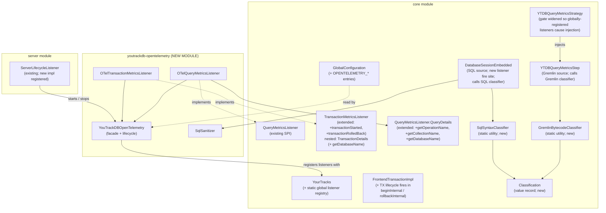

# YTDB-496 OpenTelemetry support

## Design Document
[design.md](design.md)

## High-level plan

### Goals

Expose YouTrackDB query and transaction telemetry through OpenTelemetry so that hosts running embedded YTDB, and operators running standalone YTDB servers, see database calls as spans in their trace viewers (Jaeger, Tempo, Datadog, etc.). The telemetry follows OTel semantic conventions v1.33.0 for database client spans so it lights up in DB-aware tooling without per-vendor adapters. The integration ships in a new optional Maven module `youtrackdb-opentelemetry`; `core` and `server` carry no OTel dependency.

Both Gremlin traversals and native SQL queries emit spans. A Gremlin query emits one CLIENT span with sanitized `db.query.text` produced by the existing `ValueAnonymizingTypeTranslator`, plus `db.operation.name` and `db.collection.name` extracted from the bytecode. A native SQL query (`db.command("SELECT ...")`, MATCH, DDL) emits one CLIENT span with the raw SQL text sanitized into placeholders, plus the operation type and target class parsed from the statement AST. Both share the same `db.system.name=youtrackdb` and attach to the host's active trace context (`Context.current()`). Transactions get their own INTERNAL parent span covering `begin → close`, with the existing commit metrics listener emitting a child CLIENT span for the commit operation; the TX span carries the existing tracking ID.

In embedded mode the SDK resolution chain is: host-provided via `YouTrackDBOpenTelemetry.setOpenTelemetry(...)`, then `GlobalOpenTelemetry.get()` if the host configured the global, then YTDB-built from `OPENTELEMETRY_*` config when neither of the first two yielded a real SDK. The flag is never inert: enabling `OPENTELEMETRY_ENABLED=true` always produces telemetry. In server mode YTDB always owns the SDK because the server is a standalone process.

### Constraints

- **One-way dependency**: `youtrackdb-opentelemetry` depends on `core` for the listener SPI; `core` MUST NOT pull OTel libraries in transitively. YTDB without the OTel module continues to have zero OTel runtime cost.
- **Sem-conv v1.33.0 compliance**: stable semantic conventions for database spans cover attribute names, requirement levels, and sanitization rules. Custom `db.system.name = "youtrackdb"` per §"Notes" of the spec.
- **Host-preferred SDK ownership in embedded**: a host that wires its own `OpenTelemetry` (via setter or `GlobalOpenTelemetry.set(...)`) wins. When no host SDK is found and `OPENTELEMETRY_ENABLED=true`, YTDB auto-configures its own SDK from `OPENTELEMETRY_*` config entries so the flag is never inert. Ownership is tracked so YTDB only closes the SDK it created. In server mode YTDB always owns the SDK because the server is a standalone process.
- **No backward-compat scaffolding**: greenfield emission, ignore `OTEL_SEMCONV_STABILITY_OPT_IN` env var (introduced for instrumentations that already emit a previous version).
- **Listener exception isolation**: callbacks run synchronously on the caller thread; existing try/catch wrapping in the listener firing sites MUST extend to the new lifecycle hooks so a misconfigured OTel SDK never breaks transaction flow.
- **JDK 21+, Maven Wrapper, Spotless on new module**, JUnit 5 tests. The new module is greenfield, no JUnit 4 inertia to preserve.
- **Coverage gate**: 85% line / 70% branch on changed code per CLAUDE.md.

### Architecture Notes

#### Component Map

- **`QueryMetricsListener` / `TransactionMetricsListener` (core, existing SPI)**: the listener contracts. Their `QueryDetails` and `TransactionDetails` types are nested interfaces inside the respective listener interfaces; the plan qualifies them as `QueryMetricsListener.QueryDetails` and `TransactionMetricsListener.TransactionDetails` on first mention. `TransactionMetricsListener` gains two new default no-op methods (`transactionStarted`, `transactionRolledBack`) so existing implementations keep compiling.
- **`QueryMetricsListener.QueryDetails` (core, existing; extended)**: gains `getOperationName()`, `getCollectionName()`, and `getDatabaseName()` returning `Optional<String>`. Populated by both query sources: `YTDBQueryMetricsStep` for Gremlin via the bytecode classifier (operation/collection) and `session.getDatabaseName()` (namespace); `DatabaseSessionEmbedded` for SQL via the syntax classifier (operation/collection) and the session's own database name (namespace).
- **`YourTracks` (core)**: gains static methods `registerGlobalQueryListener` / `unregisterGlobalQueryListener` / `registerGlobalTransactionListener` / `unregisterGlobalTransactionListener`. The registry is process-global (a static holder in `core/.../profiler/monitoring/`); the transaction factory consults the snapshot at `FrontendTransactionImpl.beginInternal()` time and uses that snapshot for the TX's lifetime. Per-TX `withQueryListener` continues to add listeners on top of the snapshot. The `YouTrackDB` interface gets no new methods, keeping `YouTrackDBRemote` and other implementors untouched.
- **`FrontendTransactionImpl` (core)**: `beginInternal()` / `rollbackInternal()` become the chokepoints for `transactionStarted` / `transactionRolledBack` fires and capture the global-listener snapshot. Three new accessors on the `FrontendTransaction` interface: `getDefaultQueryMonitoringMode(): QueryMonitoringMode` exposes the per-TX fallback set via `YTDBTransaction.withQueryMonitoringMode(...)` (used by commit/rollback fire sites and as fallback when no tag rule matches); `resolveQueryMonitoringMode(Optional<String> tag): QueryMonitoringMode` delegates to the process-global `QueryMonitoringModeResolver` for per-query mode selection from the query tag; and `iterateAllQueryListeners(): Iterable<QueryMetricsListener>` exposes the merged view (global snapshot + per-TX list added via `withQueryListener`) to both fire paths so per-TX listeners fire for SQL statements too. `YTDBTransaction.doOpen()` / `doRollback()` are not touched — they delegate to the underlying impl, so Gremlin and SQL paths both go through the same fire sites. See design.md §"Transaction-lifetime span semantics" for the lifecycle-fire iteration, the `txStartCounter == 0` gating, and the `notifyMetricsListener` wrapper reuse; see §"Query tagging and per-tag rule resolution" for the resolver mechanism, rule format, and fallback chain.
- **`YTDBQueryMetricsStep` (core)**: classifies the traversal bytecode by calling the new `GremlinBytecodeClassifier.classify(Bytecode)` static utility (also in `core`) and exposes the result through the enriched `QueryDetails` to the listener callback. Existing fire site, augmented.
- **`YTDBQueryMetricsStrategy` (core)**: TinkerPop strategy that injects `YTDBQueryMetricsStep` into Gremlin traversals. Today the gate routes only on the per-TX listener; Track 1 widens it so a non-empty global query-listener snapshot also causes injection. Without this edit, a host that registers only the OTel listener via the global registry would see no Gremlin spans because the step never gets injected.
- **`DatabaseSessionEmbedded` (core)**: SQL execution layer; carries two parallel call sites — `query()` (lines 617-686) backing `db.query(...)` and the Gremlin bridge, plus `executeInternal()` (lines 702-751) backing `command()` / `execute()`. Track 4 extracts a private helper `executeStatementWithMetrics(SQLStatement, String, Object)` invoked from both call sites; the helper wraps `statement.execute(...)` with a mode-aware timer (reads `currentTx.resolveQueryMonitoringMode(statement.getQueryTag())`; routes to `GranularTicker` for `LIGHTWEIGHT` or `System.nanoTime()` for `EXACT`), short-circuits when `GremlinSqlSuppression.isActive()` is true (so Gremlin-driven SQL does not emit nested children), and emits a `QueryDetails` carrying raw SQL, sanitized text, operation name, and target collection populated from `SqlSyntaxClassifier.classify(SQLStatement)` (a new static utility in `core`, called on the AST `SQLEngine.parse(...)` already produces at each call site). Covers SELECT / INSERT / UPDATE / DELETE / MATCH / DDL through one helper. Track 4 also extends the SQL parser to recognize the hint `/*+ TAG=X */` preceding a statement and populate `SQLStatement.getQueryTag(): Optional<String>`.
- **`YTDBGraphQuery` (core)**: Gremlin-to-SQL bridge whose `execute(session)` (line 23) and `explain(session)` (line 31) each run a SQL query via `session.getActiveTransaction().query(...)`. Track 4 wraps BOTH calls in try-with-resources `GremlinSqlSuppression.activate()` tokens so the SQL helper short-circuits for the duration of Gremlin-driven SQL (the explain wire prevents parasitic SQL spans on any caller of `YTDBGraphQuery.explain`, including the test-driven `YTDBGraphQuery.usedIndexes` path at line 37, which delegates to `this.explain(session)` at line 38). Counter is re-entrant so nested Gremlin steps inside one another do not interfere.
- **`GremlinSqlSuppression` (core, new)**: process-global static utility holding a ThreadLocal re-entrant counter plus an `AutoCloseable` activation token. Lives in `core/.../profiler/monitoring/` alongside the listener SPI. Exposed methods: `activate(): AutoCloseable` (increments the counter; the returned token's `close()` decrements it) and `isActive(): boolean` (counter > 0). Consulted by the SQL helper before firing the listener; activated by `YTDBGraphQuery.execute`.
- **`GremlinBytecodeClassifier` / `SqlSyntaxClassifier` / `Classification` (core, new)**: two static-utility classes plus a shared value record. Each classifier reads its source-specific input (`Bytecode` for Gremlin, `SQLStatement` for SQL) and returns a `Classification(operationName, collectionName)` value the fire site copies into the `QueryDetails` accessors. Called directly — no SPI, no ServiceLoader.
- **`GlobalConfiguration` (core)**: new entries `OPENTELEMETRY_ENABLED`, `OPENTELEMETRY_EXPORTER_ENDPOINT`, `OPENTELEMETRY_EXPORTER_PROTOCOL`, `OPENTELEMETRY_SERVICE_NAME` for the server-mode SDK init.
- **`OTelQueryMetricsListener` / `OTelTransactionMetricsListener` (new module)**: translate listener callbacks into OTel spans, taking the parent from `Context.current()` so embedded propagation is automatic.
- **`YouTrackDBOpenTelemetry` (new module)**: static facade. `setOpenTelemetry(OpenTelemetry)` for explicit host wiring; falls back to `GlobalOpenTelemetry.get()`. Registers the listeners with the global registry. Idempotent shutdown.
- **`SqlSanitizer` (new module)**: replaces string / numeric / date literals in raw SQL with `?` placeholders for `db.query.text` sanitization. Parameterized queries pass through unchanged. The only classifier-adjacent helper that stays in the OTel module — its output (`db.query.text`) is OTel-specific.

#### D1: Global listener registry

- **Alternatives considered**: keep per-TX `withQueryListener` only (config flag would be inert); auto-injection inside the `g.tx()` factory (chosen alternative for D1 → see Rationale below).
- **Rationale**: a `OPENTELEMETRY_ENABLED=true` flag must actually take effect without the host wiring every transaction by hand. A small global registry in `OYouTrackDB` consulted by the transaction factory is the least invasive way to deliver auto-enrolment while keeping per-TX override semantics intact. Factory-side auto-injection would couple the registry to the Gremlin entry point only and miss any direct `YTDBTransaction` construction.
- **Risks/Caveats**: registration order matters if multiple listeners coexist. The registry is a List preserving insertion order, and the transaction copies the current snapshot at begin time so mid-TX registrations don't take effect.
- **Implemented in**: Track 1 (registry SPI), Track 5 (OTel listener registration).

#### D2: Hybrid SDK ownership — host preferred, YTDB falls back to self-built

- **Alternatives considered**: YTDB always owns SDK in embedded (conflicts with host instrumentation when host has its own SDK); host-only in embedded with silent no-op fallback (sharp edge — operator enables flag, sees nothing, has no signal what went wrong); always-host in both modes (impossible in server mode where YTDB IS the process).
- **Rationale**: in embedded mode the resolution chain on first listener fire is (1) value passed to `YouTrackDBOpenTelemetry.setOpenTelemetry(otel)` if any, (2) `GlobalOpenTelemetry.get()` if it returns a non-no-op SDK, (3) lazy auto-configure from `OPENTELEMETRY_*` config entries via OTel autoconfigure (same path as server mode). Host-provided wins when present so we never duplicate a host's existing SDK; self-built fills the gap so `OPENTELEMETRY_ENABLED=true` always produces telemetry, regardless of whether the host has its own OTel setup. In server mode YTDB always owns the SDK because there is no host to provide one. The facade tracks ownership via an internal boolean so `shutdown()` closes the SDK only when YTDB created it.
- **Risks/Caveats**: a host that sets `OPENTELEMETRY_ENABLED=true` and forgets to wire its OTel sees YTDB silently open a network connection to the configured endpoint (default `http://localhost:4317`). The flag is an explicit opt-in so this is acceptable, and an INFO log records the situation. If the host later calls `setOpenTelemetry(...)` after self-built ran, the facade closes the YTDB-built SDK and switches to the host's instance.
- **Implemented in**: Track 5.
- **Full design**: design.md §"SDK lifecycle: embedded vs server"

#### D3: Full span hierarchy with TX as parent over query and commit

- **Alternatives considered**: query-only spans (loses TX context in viewer); query+commit only without TX parent (commit span "floats" in the trace).
- **Rationale**: a trace viewer's value is showing "this request did X, Y, Z" with timing. Without a TX span as parent, multiple queries inside one TX render as disjoint database calls; with it, the user sees `TX 850ms { query 47ms, query 600ms, commit 50ms }` which matches the operator's mental model. Requires extending `TransactionMetricsListener` with `transactionStarted` and `transactionRolledBack` defaults.
- **Risks/Caveats**: TX spans for read-only transactions get no commit child (no `writeTransactionCommitted` fires). The TX span still closes cleanly because `transactionRolledBack` covers user-initiated rollback (including the silent rollback at end of a read-only TX `close()`).
- **Implemented in**: Track 1 (listener API extension), Track 3 (OTelTransactionMetricsListener).
- **Full design**: design.md §"Transaction-lifetime span semantics"

#### D4: Automatic OTel Context propagation via `Context.current()`

- **Alternatives considered**: explicit `withContext(Context)` per query; pass parent context through `QueryDetails`.
- **Rationale**: the existing `QueryMetricsListener` callback fires synchronously on the caller thread. `YTDBQueryMetricsStep.close()` calls the listener directly, and `assertOnOwningThread` enforces TX operations stay on the owner thread. `Context.current()` therefore returns the host's active span. No additional plumbing.
- **Risks/Caveats**: if a future change moves traversal close to a worker pool, propagation breaks silently. Mitigated by a test that runs a host-context span around a YTDB query and asserts the YTDB query span's parent matches; the test fails loudly if threading changes.
- **Implemented in**: Track 3 (listener implementations) and Track 6a (propagation test).
- **Full design**: design.md §"Context propagation in embedded"

#### D5: Span kinds by role — mode-aware CLIENT/INTERNAL

- **Alternatives considered**: all CLIENT regardless of mode (non-compliant with sem-conv §"Span kind" which mandates INTERNAL for in-process libraries; embedded YTDB qualifies); all INTERNAL regardless of mode (loses "database edge" in service maps when YTDB runs as a separate server process); mode-aware via runtime probe of the active session (extra branching at every fire site for a value that never changes after SDK init).
- **Rationale**: sem-conv v1.33.0 §"Span kind" is explicit — CLIENT for over-network database calls, INTERNAL for in-process and in-memory database libraries. YTDB matches both definitions across deployments: embedded mode runs in-process with the host, server mode runs as a separate process the host reaches over the network. The kind is therefore mode-aware on the CLIENT/INTERNAL axis and selected once at SDK init time, not per call. The TX-lifetime span is INTERNAL in both modes because it is a logical container, not a call. Mechanism: a `SpanKind clientKind` constructor argument on both `OTelQueryMetricsListener` and `OTelTransactionMetricsListener`, resolved by `YouTrackDBOpenTelemetry` from a new `boolean serverMode` flag — `true` only when `OpenTelemetryServerPlugin` calls the package-private 3-arg variant `setOpenTelemetry(otel, ownedByYtdb=true, serverMode=true)`, `false` for every embedded entry point (host setter, `GlobalOpenTelemetry.get()` fallback, YTDB auto-configure). The two boolean flags carry separate concerns: `ownedByYtdb` drives shutdown; `serverMode` drives the CLIENT/INTERNAL split.
- **Risks/Caveats**: a host that embeds YTDB inside a server-like process (e.g., a microservice that uses YTDB as its store) sees INTERNAL spans, which most service-map renderers will not label as a database edge. Hosts that prefer the CLIENT label in such cases can override by wiring their own `OpenTelemetry` instance and using their own instrumentation policy. Documented in the embedded section.
- **Implemented in**: Track 3 (listener constructor + facade `clientKind()` accessor), Track 5 (server plugin signals `serverMode=true` via the 3-arg setter).

#### D6: `db.system.name = "youtrackdb"` (custom value)

- **Alternatives considered**: `other_sql` (loses identity; YTDB is not SQL-only).
- **Rationale**: sem-conv §"Notes" mandates the lowercase DBMS name as a custom value when not on the well-known list. `"youtrackdb"` is unambiguous. Future PR to add it to the well-known list is a separate concern.
- **Risks/Caveats**: backends may not recognize the system name for built-in dashboards until it's registered upstream.
- **Implemented in**: Track 3.

#### D7: Delegate sampling to the OTel sampler

- **Alternatives considered**: built-in `queryThresholdNanos` filter (proposed in the YouTrack draft); per-query AlwaysOn.
- **Rationale**: emitting a span and then letting the host's sampler decide is the standard OTel pattern. Built-in threshold filtering is a worse heuristic (a 1 ms failed query carries more signal than a 500 ms scan returning a million rows) and reinvents what OTel SDK already provides (`TraceIdRatioBased`, `ParentBased`, `AlwaysOn`).
- **Risks/Caveats**: under heavy benchmark load (LDBC) the unfiltered span volume can overwhelm an unsampled exporter. The host must configure a sampler. Documented in the embedded section.
- **Implemented in**: Track 3.

#### D8: SQL execution layer hook in `DatabaseSessionEmbedded.executeStatementWithMetrics` helper, called from both `query()` and `executeInternal()`

- **Alternatives considered**: per-statement-type hooks inside each `SQLSelectStatement.execute()` / `SQLMatchStatement.execute()` / etc. (DRY violation across 5+ classes); hook inside `LocalResultSet` constructor (misses DDL and non-idempotent commands); skip SQL entirely (loses observability for MATCH, DDL, `db.command(...)` apps, and underlying SQL beneath Gremlin); hook only in `executeInternal()` (silently misses `db.query(...)` because `query()` has its own duplicated parse+execute body at line 617 that does NOT route through `executeInternal()`).
- **Rationale**: `DatabaseSessionEmbedded` has two parallel SQL paths today: `executeInternal()` (lines 702-751) backs `command()` / `execute()`; `query()` (lines 617-686) is a separate idempotent path used by both native `db.query(...)` callers and the Gremlin bridge (`YTDBGraphQuery.execute` → `transaction.query(...)` → `session.query()`). Track 4 extracts a private helper `executeStatementWithMetrics(SQLStatement, String, Object)` wrapping `statement.execute(this, args, true)` with a timer, listener fire, and `QueryDetails` build, and invokes the helper from both call sites. Both call sites parse via `SQLEngine.parse(...)` before delegating, so the helper takes the already-parsed AST plus the raw SQL text (from `stringStatement` when present, else `statement.getOriginalStatement()`) plus `args`. Elapsed time follows the per-query mode resolution from D15: the helper reads `statement.getQueryTag()` (populated by the SQL parser hint `/*+ TAG=X */`) and calls `currentTx.resolveQueryMonitoringMode(tag)` to pick the clock source. `LIGHTWEIGHT` reads `GranularTicker.approximateNanoTime()` for zero-syscall capture; `EXACT` reads `System.nanoTime()` for sub-millisecond precision. The pre-existing `FrontendTransactionImpl.doCommit` (lines 632-707) and its `notifyMetricsListener` callee (lines 712-734) have no query tag context and read directly from `currentTx.getDefaultQueryMonitoringMode()`; `YTDBQueryMetricsStep.close()` follows the same per-query resolution as the SQL helper using the tag from `traversal.getConfig(YTDBQueryConfigParam.querySummary)`. To prevent Gremlin traversals from double-firing (one Gremlin span at `YTDBQueryMetricsStep.close()` plus one SQL span per underlying `YTDBGraphStep`), `YTDBGraphQuery.execute` activates a thread-local `GremlinSqlSuppression` token (re-entrant counter, auto-closeable) for the duration of the underlying `transaction.query(...)` call; the helper checks `GremlinSqlSuppression.isActive()` at step 2 and short-circuits before any timer read or listener fire. Net result: one Gremlin traversal = one Gremlin span; one native SQL call (via `query`, `command`, or `execute`) = one SQL span.
- **Risks/Caveats**: `stringStatement` can be null when a pre-parsed `SQLStatement` is passed in by an internal recursive call; the fallback is `statement.getOriginalStatement()`. Tracking ID comes from `String.valueOf(currentTx.getId())` — `FrontendTransaction.getId(): long` already exists and returns a stable internal ID, so Track 4 does not add a new accessor. `GremlinSqlSuppression` is a process-global static with a ThreadLocal counter; concurrent transactions on different threads do not interfere. Handled in Track 4.
- **Implemented in**: Track 4.
- **Full design**: design.md §"SQL execution layer hook"

#### D9: Extract `db.operation.name` and `db.collection.name` from both Gremlin bytecode and SQL AST

- **Alternatives considered**: omit both attributes (loses span-name quality and grouping); plugin layer with `QueryClassifier` SPI + `ServiceLoader` (rejected — buys no polymorphism for a single impl per input type and forces an `Object`-typed signature plus a `META-INF/services` manifest); pre-compute on query parse (Gremlin has no parse hook in current code, SQL parses inside `executeInternal`).
- **Rationale**: for Gremlin the bytecode is available in `YTDBQueryMetricsStep` (line 131 `traversal.getBytecode()`); the classifier identifies the start step (`V`/`E`/`addV`/`addE`/...) and the first `hasLabel` or `addV`/`addE` label argument. For SQL the parsed `SQLStatement` is available in `executeInternal` after `SQLEngine.parse()`; the classifier reads the statement subclass (SELECT / INSERT / UPDATE / DELETE / MATCH / DDL) and the FROM / INTO / UPDATE clause target class. Both yield low-cardinality values that drive `{db.operation.name} {db.collection.name}` span names per sem-conv. Two static-utility classifiers in `core` (`GremlinBytecodeClassifier`, `SqlSyntaxClassifier`) piggyback on parsing the fire sites already perform — `produceScript()`'s instruction walk for Gremlin, `SQLEngine.parse(...)`'s unconditional AST production for SQL — and return a `Classification(operationName, collectionName)` value record consumed directly by the fire site.
- **Risks/Caveats**: complex Gremlin traversals (multi-class, no label) and complex SQL (no FROM clause, anonymous tables, multi-target UPDATE / MATCH chains) won't yield clean values. Both accessors return `Optional.empty()` and the span name falls back to `db.system.name`. Documented and tested.
- **Implemented in**: Track 1 (QueryDetails extension + both classifier helpers + Classification record, all in `core`), Track 3 (Gremlin fire-site wiring at `YTDBQueryMetricsStep.close()`), Track 4 (SQL fire-site wiring at `DatabaseSessionEmbedded.executeInternal()`).
- **Full design**: design.md §"Gremlin bytecode classification" and §"SQL execution layer hook"

#### D10: TX lifecycle fires consolidated in `FrontendTransactionImpl`

- **Alternatives considered**: fire from `YTDBTransaction.doOpen()` / `doRollback()` only (covers Gremlin path; `db.command(...)` SQL flows that don't cross `YTDBTransaction` get no TX-parent span); fire from both `YTDBTransaction` and `FrontendTransactionImpl` (risks double TX spans for Gremlin-initiated transactions that traverse both classes).
- **Rationale**: `beginInternal()` and `rollbackInternal()` are the single chokepoints for every TX path in the codebase. Gremlin's `YTDBTransaction.doOpen()` calls `activeSession.begin()` which routes through `beginInternal()`; `DatabaseSessionEmbedded.begin()` calls it directly. Same for rollback (many call sites in `DatabaseSessionEmbedded`, plus the Gremlin path). Putting both fires inside `FrontendTransactionImpl` covers Gremlin and native SQL with one fire site each. The existing private `notifyMetricsListener` wrapper sits in the same class, so the two new fires reuse the same try/catch shape without needing a hoisted helper.
- **Risks/Caveats**: `rollbackInternal()` is called recursively from error paths inside `FrontendTransactionImpl`; the new fire must be gated by `txStartCounter == 0` so nested rollbacks don't emit multiple `transactionRolledBack` callbacks. The snapshot must be captured before `txStartCounter` increments in `beginInternal()` so nested begins reuse the outermost snapshot.
- **Implemented in**: Track 1.
- **Full design**: design.md §"Transaction lifecycle with full hierarchy"

#### D11: Listener wrapper widened from `Exception` to the union `Exception | LinkageError | AssertionError`

- **Alternatives considered**: leave the existing wrappers catching `Exception` only (an `AssertionError` in a custom listener impl, or a `NoClassDefFoundError` from a partial OTel classpath, unwinds the transaction — both are realistic OTel failure modes); widen all the way to `Throwable` (masks `VirtualMachineError` and `ThreadDeath`, against JLS guidance to let those propagate so a fatal JVM condition is not silently swallowed).
- **Rationale**: an OTel listener has three realistic non-`Exception` failure modes: `AssertionError` (custom listener asserts or OTel-SDK internal assertions), `LinkageError` (`NoClassDefFoundError` from a partial OTel classpath, `ClassCircularityError` from misconfigured shading), and unchecked `Exception` subclasses (always caught). The catch widens to `catch (Exception | LinkageError | AssertionError t)` — a deliberately narrower union than `Throwable` — so all three OTel-typical failure modes are isolated from the transaction while `VirtualMachineError` (`OutOfMemoryError`, `InternalError`, `UnknownError`, `StackOverflowError`) and `ThreadDeath` propagate per JLS guidance. Both existing wrappers (`FrontendTransactionImpl.notifyMetricsListener:730`, `YTDBQueryMetricsStep:148`) take this shape, and the same shape applies to the two new TX-lifecycle fires. The wrapper logs the caught throwable at WARN and swallows it.
- **Risks/Caveats**: a listener that triggers a true `VirtualMachineError` (genuine OOM during span allocation, stack overflow in a recursive listener) still unwinds the transaction. This is the deliberate trade-off: when the JVM is in a fatal state, taking the TX down with it is safer than masking the problem — operators see the unwound TX plus the stack trace at the original throw site, rather than a silently-corrupted process. The union covers every OTel-listener failure mode short of JVM-fatal.
- **Implemented in**: Track 1.
- **Full design**: design.md §"Exception isolation contract"

#### D12: Tracer instrumentation version from `YouTrackDBConstants.getRawVersion()`

- **Alternatives considered**: hard-code a version string (drifts); use `getVersion()` which returns `"<v> (build <r>, branch <b>)"` and is too verbose for the version slot.
- **Rationale**: OTel `getTracer(name, version)` expects a clean version string. `getRawVersion()` returns just `"0.5.0-SNAPSHOT"`. The constant lives in `internal.core.YouTrackDBConstants`; the new module is internal too, so accessing it is fine.
- **Risks/Caveats**: none.
- **Implemented in**: Track 3.

#### D13: Test infrastructure using `opentelemetry-sdk-testing`

- **Alternatives considered**: custom in-memory exporter; mock OTel APIs.
- **Rationale**: `io.opentelemetry:opentelemetry-sdk-testing` ships `InMemorySpanExporter`, `OpenTelemetryRule`, and other building blocks designed for instrumentation tests. Using it gives assertions on real SDK behavior (sampler, exporter pipeline, attribute propagation) without re-implementing the test fixtures.
- **Risks/Caveats**: adds a test-scope dependency on the new module. Acceptable.
- **Implemented in**: Track 6a (foundation: `OTelTestBase` + attribute / hierarchy / propagation tests), Track 6b (lifecycle + invariants), Track 6c (Gremlin suppression + `db.query` regression + coverage gate).

#### D14: Span timestamps captured via existing listener parameters, not new accessors

- **Alternatives considered**: implicit `tracer.spanBuilder(...).startSpan()` with no timestamp (records callback-entry time as the span start, drifting from the actual query start by however long the listener takes to run); extend `QueryDetails` with `getStartTimestampNanos()` / `getEndTimestampNanos()` accessors returning nanosecond-precision timestamps (buys sub-millisecond start precision under EXACT but adds two slots on a heavily-overridden SPI for precision the trace viewers don't render).
- **Rationale**: the listener API already passes `startedAtMillis` and `executionTimeNanos` as parameters of `queryFinished(...)` (and `commitAtMillis` / `commitTimeNanos` for `writeTransactionCommitted`). The OTel listener consumes them through `setStartTimestamp(startedAtMillis, MILLISECONDS).startSpan()` and `span.end(startedAtMillis + executionTimeNanos / 1_000_000, MILLISECONDS)`. The span's recorded duration matches the fire-site measurement at nanosecond resolution because `executionTimeNanos` is passed through unchanged. Under both `LIGHTWEIGHT` and `EXACT` the two parameters come from the same clock pair the fire site captured for the resolved mode at this query, so the per-query Timing-mode uniformity invariant holds at the timestamp level. No new SPI surface is needed.
- **Risks/Caveats**: `startedAtMillis` carries millisecond precision (~10 ms under LIGHTWEIGHT, ~1 ms under EXACT), so the span START loses sub-millisecond detail. The span DURATION is preserved at nanosecond precision because `executionTimeNanos` passes through unchanged. Trace viewers render at millisecond resolution, so the loss is invisible in viewer UIs.
- **Implemented in**: Track 3 (OTel listener span mapping at `OTelQueryMetricsListener.queryFinished` and `OTelTransactionMetricsListener.writeTransactionCommitted`).
- **Full design**: design.md §"Span timing capture"

#### D15: Per-query mode resolution from query tag with SQL hint syntax

- **Alternatives considered**: keep the original per-TX `QueryMonitoringMode` snapshot model (every query in one TX uses the same precision; opting into `EXACT` for one slow query forces every other query in that TX to also use the syscall-heavy clock, even though most of them don't need it); per-query mode argument passed explicitly at every API call (changes the public `query()` / `command()` signatures and forces every caller to know about timing precision, even those who don't care); per-query mode resolved at query-end (mode-aware timing requires mode to be known at query-START to pick the clock source — can't backtrack); built-in 100 ms threshold + predicate filter from an earlier YouTrack-article draft proposal (reinvents what an OTel sampler + custom listener already provides; couples timing-precision policy to slow-query policy which are two separate concerns).
- **Rationale**: a workload that wants `EXACT` precision for specific hot paths (`findHotpath`, `monthly-scan`) shouldn't be forced to either (a) pay two syscalls per query across the whole transaction or (b) restructure code into separate transactions just to scope the precision change. The natural granularity is per-query, and the natural identifier for "this query is a hot path" is a tag the host attaches at query-construction time. Gremlin already supports tagging via `g.with(YTDBQueryConfigParam.querySummary, "X")`; SQL gets a new parser hint `/*+ TAG=X */` (Oracle/Postgres convention, non-invasive, recognized by the SQL parser and exposed as `SQLStatement.getQueryTag(): Optional<String>`). A process-global `QueryMonitoringModeResolver` walks an ordered first-wins `List<TagRule<QueryMonitoringMode>>` parsed once at startup from `OPENTELEMETRY_QUERY_MODE_TAG_RULES` (format: `tag=MODE` exact, `prefix:X=MODE` prefix, `regex:X=MODE` regex). The resolver caches resolved `(tag → mode)` mappings in a `ConcurrentHashMap` for cheap repeat lookups. Fallback chain: per-tag rule → per-TX default (`YTDBTransaction.withQueryMonitoringMode(...)`, backwards-compatible) → `LIGHTWEIGHT`. Sealed `TagRule<T>` interface is generic so a future per-tag slow-query threshold resolver reuses the same matcher hierarchy.
- **Risks/Caveats**: cache cardinality blow-up if a misuse-pattern host emits unique tags per request (e.g., a UUID); documented as host responsibility, not enforced by LRU bound in YTDB-496 because typical workloads have dozens of tags, not millions. Mid-TX rule-table changes are not supported (rules compiled once at startup); mid-TX `withQueryMonitoringMode` changes ARE supported and take effect on the next query in the same TX because the helper re-reads `getDefaultQueryMonitoringMode()` per query. Conflicting rules: first-wins by insertion order, documented; operators order rules from most-specific to most-general.
- **Implemented in**: Track 1 (resolver utility + `TagRule<T>` sealed interface + config parsing + `getDefaultQueryMonitoringMode()` / `resolveQueryMonitoringMode(Optional<String>)` accessors on `FrontendTransaction` + `YTDBQueryMetricsStep` per-query mode read from `traversal.getConfig`), Track 4 (SQL parser hint grammar change + `SQLStatement.getQueryTag()` accessor + `executeStatementWithMetrics` per-query mode read from `statement.getQueryTag()`), Track 5 (`OPENTELEMETRY_QUERY_MODE_TAG_RULES` `GlobalConfiguration` entry), Track 6a (`QueryModeResolutionTest` covering rule walk, fallback chain, cache hits, hint parsing edge cases).
- **Full design**: design.md §"Query tagging and per-tag rule resolution" and §"SQL execution layer hook"

### Invariants

- **One-way dependency**: `core` and `server` carry no OTel imports. Enforced by Maven dependency scope and verified by a static check in the build.
- **TX span boundedness**: every `transactionStarted` callback that fires MUST be followed by exactly one of `writeTransactionCommitted` / `writeTransactionFailed` / `transactionRolledBack`, so OTel never leaks an unclosed span.
- **Listener exception isolation**: an OTel listener throwing any `Exception`, `LinkageError`, or `AssertionError` inside a callback MUST NOT propagate to the transaction. Track 1 widens the existing `Exception`-only catch in `FrontendTransactionImpl.notifyMetricsListener` and `YTDBQueryMetricsStep.close()` to `catch (Exception | LinkageError | AssertionError t)`, and applies the same shape to the two new TX-lifecycle fires. `VirtualMachineError` and `ThreadDeath` are deliberately excluded from the union and propagate per JLS guidance.
- **TX lifecycle fire chokepoint**: `transactionStarted` and `transactionRolledBack` fire exclusively from `FrontendTransactionImpl.beginInternal()` and `rollbackInternal()` respectively, both gated by `txStartCounter == 0` so nested begins/rollbacks do not double-fire.
- **`db.system.name = "youtrackdb"`** is a compile-time constant in `YouTrackDBOpenTelemetry`; no caller can override it.
- **Span kind by role (mode-aware)**: TX span MUST be INTERNAL in both modes (logical container). Query span and commit span MUST be INTERNAL in embedded mode and CLIENT in server mode, selected once at SDK init from `YouTrackDBOpenTelemetry.serverMode` and propagated to both listeners via the `SpanKind clientKind` constructor argument. No SERVER / PRODUCER / CONSUMER kinds are emitted by YTDB in any mode. Checked by Track 6a's listener tests parametrized over both `clientKind` values plus a negative assertion that the in-memory exporter never captures a span with any of the three excluded kinds.
- **Timing-mode uniformity (per-query)**: both listener fire sites for ONE query (`YTDBQueryMetricsStep.close()` for Gremlin and `DatabaseSessionEmbedded.executeStatementWithMetrics` helper for SQL) resolve mode from the same query tag through `currentTx.resolveQueryMonitoringMode(tag)` and therefore reach the same `QueryMonitoringMode` value, so a Gremlin span and its underlying SQL span (when suppression is bypassed in tests) record at identical precision. Commit and rollback fire sites (`FrontendTransactionImpl.notifyMetricsListener()` and the rollback chokepoint) have no query tag in scope and read directly from `currentTx.getDefaultQueryMonitoringMode()`, so commit timing aligns with whatever default the host set on the transaction. Different queries within the same transaction can use different modes when their tags resolve to different rules — this is intentional, not a violation. Checked by `OTelTimingModeTest` (per-query uniformity + commit-uses-TX-default scenarios) and the new `QueryModeResolutionTest` in Track 6a (rule-walk correctness, fallback chain, cache hit behavior). See design.md §"Query tagging and per-tag rule resolution" for the resolver mechanism and §"SQL execution layer hook" for the per-query timing read.
- **Gremlin span uniqueness**: one Gremlin traversal emits exactly one query span; the SQL `executeStatementWithMetrics` helper short-circuits when `GremlinSqlSuppression.isActive()` so the Gremlin-to-SQL translation never produces nested child spans. Activation is owned by `YTDBGraphQuery.execute` via a try-with-resources token. Checked by `OTelGremlinSuppressionTest` in Track 6c asserting one span per traversal regardless of how many `YTDBGraphStep` instances the strategy injects.

### Integration Points

- `YourTracks.registerGlobalQueryListener(QueryMetricsListener)` and matching unregister, plus the transaction-listener pair — static methods on the existing `final` utility class (CR9: registry is process-global; the `YouTrackDB` interface gets no new methods).
- `TransactionMetricsListener#transactionStarted(TransactionDetails)` and `#transactionRolledBack(TransactionDetails)`, new default no-op methods on the existing nested `TransactionMetricsListener` SPI. Fire sites: `FrontendTransactionImpl.beginInternal()` and `rollbackInternal()`.
- `QueryMetricsListener.QueryDetails#getOperationName(): Optional<String>`, `#getCollectionName(): Optional<String>`, and `#getDatabaseName(): Optional<String>`, new default accessors on the existing nested interface.
- `TransactionMetricsListener.TransactionDetails#getDatabaseName(): Optional<String>`, new default accessor on the existing nested interface.
- `DatabaseSessionEmbedded.executeStatementWithMetrics(SQLStatement, String, Object)`, new private helper invoked from both `query()` (line 617) and `executeInternal()` (line 702); wraps `statement.execute(...)` for every SQL path including read-only `db.query(...)`. See design.md §"SQL execution layer hook" for the per-query mode resolution (`currentTx.resolveQueryMonitoringMode(statement.getQueryTag())`), the tracking-ID source (`currentTx.getId()` via `String.valueOf(...)`), the `GremlinSqlSuppression.isActive()` short-circuit, and the timer pattern.
- `SQLStatement.getQueryTag(): Optional<String>`, new accessor on the existing parser-output base class populated by the SQL parser when a `/*+ TAG=X */` hint precedes the statement. Default `Optional.empty()` when no hint present.
- `GremlinSqlSuppression.activate(): AutoCloseable` and `GremlinSqlSuppression.isActive(): boolean`, new static utility in `core/.../profiler/monitoring/`. Activated by `YTDBGraphQuery.execute(session)` via try-with-resources around the underlying `transaction.query(...)` call; consulted by the SQL helper before firing the listener.
- `FrontendTransaction.getDefaultQueryMonitoringMode(): QueryMonitoringMode`, new accessor on the existing interface returning the per-TX fallback mode set via `YTDBTransaction.withQueryMonitoringMode(...)`. Used by commit/rollback fire sites and as fallback in `resolveQueryMonitoringMode(Optional<String>)` when no tag rule matches. See design.md §"Query tagging and per-tag rule resolution" for the fallback chain.
- `FrontendTransaction.resolveQueryMonitoringMode(Optional<String> tag): QueryMonitoringMode`, new accessor on the existing interface delegating to the process-global `QueryMonitoringModeResolver` for per-query mode selection from the query tag. See design.md §"Query tagging and per-tag rule resolution" for the resolver mechanism, rule format, and cache behavior.
- `QueryMonitoringModeResolver` in `core/.../profiler/monitoring/`, new utility class holding an immutable rule list parsed from `OPENTELEMETRY_QUERY_MODE_TAG_RULES` at startup plus a `ConcurrentHashMap` cache of resolved `(tag → mode)` pairs. Exposes `resolve(Optional<String> tag, QueryMonitoringMode txDefault): QueryMonitoringMode` and a static `global()` singleton accessor.
- `TagRule<T>` sealed interface in `core/.../profiler/monitoring/`, new generic abstraction with three record implementations (`Exact<T>`, `Prefix<T>`, `Regex<T>`). Generic so a future per-tag slow-query threshold resolver (`TagRule<Long>`) reuses the same matcher hierarchy.
- `FrontendTransaction.iterateAllQueryListeners(): Iterable<QueryMetricsListener>`, new accessor returning the merged view: global snapshot (captured at `beginInternal`) followed by per-TX listeners added via `withQueryListener`. Consumed by both `YTDBQueryMetricsStep.close()` (Gremlin path, Track 1 snapshot iteration refactor) and `DatabaseSessionEmbedded.executeStatementWithMetrics` helper (SQL path, Track 4) so per-TX listeners fire for SQL statements as well as Gremlin traversals.
- `GremlinBytecodeClassifier.classify(Bytecode): Classification` and `SqlSyntaxClassifier.classify(SQLStatement): Classification`, two static-utility classes in `core` called directly from `YTDBQueryMetricsStep.close()` and the `DatabaseSessionEmbedded.executeStatementWithMetrics` helper (invoked from both `query()` and `executeInternal()`) respectively. No SPI, no ServiceLoader; the `Classification` value record is the shared return type.
- `YouTrackDBOpenTelemetry.setOpenTelemetry(OpenTelemetry)` and `shutdown()`, new module entry points. A package-private 2-arg variant `setOpenTelemetry(OpenTelemetry, boolean ownedByYtdb)` exists for `OpenTelemetryServerPlugin` to signal server-mode ownership.
- `YouTrackDBServer.activate()` extended with `ServiceLoader.load(ServerLifecycleListener.class)` so the new `OpenTelemetryServerPlugin` auto-registers without explicit operator wiring (CR3: existing code uses only manual `registerLifecycleListener`; Track 5 adds the ServiceLoader call).
- `ServerLifecycleListener.onAfterActivate()` / `onBeforeDeactivate()`, bound by a new `OpenTelemetryServerPlugin` in the new module.

### Non-Goals

- **OTel Metrics signal (histograms, counters)**: out of scope. Span-only telemetry. Percentile metrics are explicitly deferred in the YouTrack design article and tracked separately.
- **TinkerPop `ProfileStep` / native YTDB Explain integration**: out of scope. The Gremlin-to-SQL explain bridge is a parallel concern, not part of the OTel emission path.
- **`OTEL_SEMCONV_STABILITY_OPT_IN` env var**: greenfield emission of stable v1.33.0 conventions, no legacy version to switch between.

## Checklist

- [ ] Track 1: Foundation extension in `core` for OTel-readiness
  > Extend the listener SPI in `core` so the OTel module can install against it: new default methods on `TransactionMetricsListener`, new `Optional<String>` accessors on `QueryDetails` and `TransactionDetails`, a `Classification` value record, two static-utility classifier classes (`GremlinBytecodeClassifier`, `SqlSyntaxClassifier`) living next to the existing parsing infrastructure, a process-global listener registry on `YourTracks`, TX-lifecycle fires inside `FrontendTransactionImpl`, a strategy-gate widening, snapshot iteration at call sites, multi-catch widened exception wrappers (`Exception | LinkageError | AssertionError`), a process-global `QueryMonitoringModeResolver` utility + `TagRule<T>` sealed interface in `core/.../profiler/monitoring/` parsing `OPENTELEMETRY_QUERY_MODE_TAG_RULES` at startup, two new accessors on `FrontendTransaction` (`getDefaultQueryMonitoringMode()` for the per-TX fallback used by commit/rollback + `resolveQueryMonitoringMode(Optional<String> tag)` delegating to the resolver for per-query mode selection), and `iterateAllQueryListeners(): Iterable<QueryMetricsListener>` returning the merged global-snapshot + per-TX-list view so both fire paths honor per-TX `withQueryListener` listeners. No behavior change for transactions without registered listeners or configured tag rules. Detailed description in `plan/track-1.md`.
  > **Scope:** ~9 steps (single coherent stream of core SPI work; each step is one commit-sized unit) covering: (1) two `TransactionMetricsListener` defaults + `TransactionDetails` namespace accessor, (2) three `QueryDetails` accessors, (3) `Classification` record + two classifier helpers, (4) `GlobalListenerRegistry` + four `YourTracks` static methods, (5) `beginInternal()` listener snapshot capture + lifecycle fires (no `QueryMonitoringMode` snapshot — mode resolves per-query), (6) `QueryMonitoringModeResolver` + `TagRule<T>` sealed interface + config parsing for `OPENTELEMETRY_QUERY_MODE_TAG_RULES` + `getDefaultQueryMonitoringMode()` + `resolveQueryMonitoringMode(Optional<String>)` accessors, (7) strategy gate widening, (8) snapshot iteration refactor + `YTDBQueryMetricsStep` per-query mode read from `traversal.getConfig` + exception-wrapper widening to `Exception | LinkageError | AssertionError`, (9) JUnit tests including `QueryMonitoringModeResolverTest`.

- [ ] Track 2: `youtrackdb-opentelemetry` Maven module skeleton
  > Create the new module under the root reactor with parent inheritance, OTel BOM-driven dependencies, Spotless config, and an empty package layout ready for the listener implementations. Adds a Maven dependency-arrow check so `core` never gains an OTel import. Detailed description in `plan/track-2.md`.
  > **Scope:** ~3 steps covering module pom, root reactor wiring, dependency direction check.

- [ ] Track 3: OTel listener implementations
  > Implement `OTelQueryMetricsListener`, `OTelTransactionMetricsListener`, and the `YouTrackDBOpenTelemetry` facade inside the new module. The listener maps every Gremlin callback to sem-conv-compliant spans with the right kind, attributes, and parent context, reading pre-populated `QueryDetails` accessors (classification owned by Track 1; SQL source wired in Track 4; registration in Track 5). Detailed description in `plan/track-3.md`.
  > **Scope:** ~5 steps covering query listener, TX listener, facade, sem-conv attribute mapping, span-name fallback.
  > **Depends on:** Track 1, Track 2

- [ ] Track 4: SQL execution layer helper, Gremlin-SQL suppression, and SQL query sanitizer
  > Funnel every native SQL statement (SELECT / INSERT / UPDATE / DELETE / MATCH / DDL, including read-only `db.query(...)`) through a private `executeStatementWithMetrics(SQLStatement, String, Object)` helper on `DatabaseSessionEmbedded`, invoked from both `query()` (line 617) and `executeInternal()` (line 702), so every statement flows through `QueryMetricsListener.queryFinished(...)`. Add `GremlinSqlSuppression` (re-entrant ThreadLocal counter + `AutoCloseable` token) in `core/.../profiler/monitoring/`, wrap `YTDBGraphQuery.execute(session)`'s underlying `transaction.query(...)` so the helper short-circuits during Gremlin-driven SQL, and ship `SqlSanitizer` (literal-to-`?` replacement) in the OTel module (SQL classifier lands in Track 1; Track 4's helper calls it directly to populate the `QueryDetails` operation/collection accessors). Detailed description in `plan/track-4.md`.
  > **Scope:** ~8 steps covering: (1) extract `executeStatementWithMetrics` helper + wire from `executeInternal()` reading mode via `currentTx.resolveQueryMonitoringMode(statement.getQueryTag())`, (2) wire helper from `query()` (after the `isIdempotent` check) with the same per-query mode read; (3) `GremlinSqlSuppression` utility class in `core`; (4) activate suppression in `YTDBGraphQuery.execute`; (5) `SqlSanitizer` regex implementation in the OTel module; (6) SQL parser grammar extension in `YouTrackDBSql.jjt` to recognize `/*+ TAG=X */` hint preceding a statement and populate the AST; (7) `SQLStatement.getQueryTag(): Optional<String>` accessor on the parser-output base class; (8) JUnit tests covering helper coverage of both call sites, suppression entry/exit, sanitizer edge cases, hint parsing in different statement positions (before SELECT / INSERT / UPDATE / DELETE / MATCH / DDL), invalid hint syntax handling. Tracking ID comes from the existing `currentTx.getId()` via `String.valueOf(...)`; no new `FrontendTransaction.getTrackingId()` accessor needed.
  > **Depends on:** Track 1, Track 2, Track 3

- [ ] Track 5: Configuration parameters and lifecycle integration
  > Add `GlobalConfiguration` entries (`OPENTELEMETRY_ENABLED`, `OPENTELEMETRY_EXPORTER_ENDPOINT`, `OPENTELEMETRY_EXPORTER_PROTOCOL`, `OPENTELEMETRY_SERVICE_NAME`, `OPENTELEMETRY_QUERY_MODE_TAG_RULES`), wire embedded mode (host-provided `OpenTelemetry` via setter + `GlobalOpenTelemetry.get()` fallback + lazy auto-configure from `OPENTELEMETRY_*` entries), add a `ServerLifecycleListener`-based plugin that initializes/closes the SDK in server mode based on the config flag, and add `ServiceLoader.load(ServerLifecycleListener.class)` to `YouTrackDBServer.activate()` so the plugin auto-discovers (the existing code only honors explicit `registerLifecycleListener` calls — Track 5 adds the discovery loop). After this track the OTel module auto-enrols when enabled. Detailed description in `plan/track-5.md`.
  > **Scope:** ~6 steps covering config entries (five entries total, including the new `OPENTELEMETRY_QUERY_MODE_TAG_RULES` consumed by Track 1's `QueryMonitoringModeResolver`), embedded facade with 3-arg `setOpenTelemetry`, server plugin, ServiceLoader discovery in `YouTrackDBServer`, SDK init/close, idempotence.
  > **Depends on:** Track 2, Track 3

- [ ] Track 6a: Test suite — attribute mapping, hierarchy, propagation, tag resolution
  > Cover the listener-to-span mapping for both Gremlin and SQL paths (sem-conv attributes, span kinds, hierarchy parent/child links), context propagation in embedded (host span becomes parent), and per-query mode resolution from query tag (rule walk, fallback chain, cache behavior, hint parsing). Establishes the shared `OTelTestBase` infrastructure that Tracks 6b and 6c reuse. Uses `InMemorySpanExporter` so assertions run against real SDK behavior. Detailed description in `plan/track-6a.md`.
  > **Scope:** ~5 steps covering: (1) `OTelTestBase` + `OTelGremlinQueryTest`, (2) `OTelSqlQueryTest` per statement type, (3) `OTelTransactionMetricsListenerTest` hierarchy, (4) `ContextPropagationTest`, (5) `QueryModeResolutionTest` covering exact / prefix / regex rule matching, fallback chain (tag rule → per-TX default → LIGHTWEIGHT), cache hit behavior on repeated tag, SQL hint `/*+ TAG=X */` parsing for each statement type, missing-hint behavior (empty Optional), invalid-rule-config behavior (WARN log + skip).
  > **Depends on:** Track 3, Track 4, Track 5

- [ ] Track 6b: Test suite — lifecycle and invariants
  > Cover server-mode lifecycle (init/close), the exception-isolation invariant, and the timing-mode uniformity invariant via `OTelTimingModeTest`. Builds on `OTelTestBase` from Track 6a. Detailed description in `plan/track-6b.md`.
  > **Scope:** ~4 steps covering: (1) `LifecycleTest`, (2) `ServerPluginTest` against a real `YouTrackDBServer`, (3) `ExceptionIsolationTest`, (4) `OTelTimingModeTest` for LIGHTWEIGHT / EXACT routing.
  > **Depends on:** Track 6a

- [ ] Track 6c: Test suite — Gremlin suppression, db.query regression, coverage gate
  > Cover the Gremlin span uniqueness invariant via `OTelGremlinSuppressionTest` (one traversal = one span, no SQL children) and the `db.query("SELECT ...")` regression via `OTelDbQuerySpanTest`. Verifies the OTel module's coverage gate (≥85% line / ≥70% branch). Detailed description in `plan/track-6c.md`.
  > **Scope:** ~3 steps covering: (1) `OTelGremlinSuppressionTest` (single-step / multi-hop / exception-safety scenarios), (2) `OTelDbQuerySpanTest` regression, (3) coverage gate verification.
  > **Depends on:** Track 6b

## Plan Review
- [x] Plan review (consistency + structural) — passed at iteration 3 (consistency: 3 iterations including the gate-discovered CR5 regression and its fix; structural: 2 iterations; combined Phase 2 manual re-run after Mutations 13-14).

**Auto-fixed (mechanical)**: CR1 (phantom `YTDBGraphStep.usedIndexes` symbol replaced with `YTDBGraphQuery.usedIndexes` at line 37 delegating to `this.explain(session)` at line 38, across `design.md` L119, `implementation-plan.md` L81, `plan/track-4.md` L80 and L96), CR2 (`assertOnOwningThread` enumeration in `design.md` L299 corrected to list the actual callers — `beginInternal`, `monitoredCommitInternal`, and the five record-CRUD entries — and to explain that the propagation argument still holds via the synchronous-on-calling-thread property of the listener fire paths), CR3 (loose "lines 650-722" range in `design.md` L410 and `implementation-plan.md` D8 L144 tightened to `doCommit` lines 632-707 with the snapshot at 650-664, plus `notifyMetricsListener` callee at 712-734), CR5 (gate-discovered regression — `plan/track-4.md` L92 still carried the stale `lines 650-722`; the third surface was missed by the initial CR3 fix and corrected during gate verification), S2 (Track 4 plan-file intro paragraph trimmed from 5 sentences to 3; classifier-ownership reminder moved to a parenthetical), S3 (Track 3 plan-file intro paragraph trimmed from 4 sentences to 3; em-dash parenthetical replaced with a comma-clause to comply with house-style).

**Escalated (design decisions)**: S1 (user picked option (3) — three-way split of Track 6 into Track 6a (~4 steps: `OTelTestBase` + `OTelGremlinQueryTest`, `OTelSqlQueryTest`, `OTelTransactionMetricsListenerTest`, `ContextPropagationTest`), Track 6b (~4 steps: `LifecycleTest`, `ServerPluginTest`, `ExceptionIsolationTest`, `OTelTimingModeTest`), Track 6c (~3 steps: `OTelGremlinSuppressionTest`, `OTelDbQuerySpanTest`, coverage gate); dependency chain 6a → Tracks 3+4+5, 6b → Track 6a, 6c → Track 6b. Original `plan/track-6.md` deleted; three new track files created. Rename propagated to `**Implemented in**` lines on D4 (Track 6a) and D13 (Track 6a / 6b / 6c), invariant cites for `OTelTimingModeTest` (Track 6b) and `OTelGremlinSuppressionTest` (Track 6c), `design.md` L246 (Track 6a's listener tests; underlying inaccuracy about which test asserts span kinds also corrected), and inter-track dependency lines in `plan/track-2.md`, `track-3.md`, `track-4.md`, `track-5.md`).

**Recorded suggestions (non-actioned)**: CR4 (`monitoredCommitInternal (L224)` cite in `design.md` L299 is one delegation hop off; the assert lives in the shared private `commitInternalImpl` callee — cosmetic precision; logged in Mutation 16 of `design-mutations.md`), plus two Mutation 16 cold-read stylistic suggestions (split L299 into two sentences for scannability; drop the incidental `checkIfActive` clause to focus on the load-bearing executor / worker-pool claim).

**Design mutations during this Phase 2 re-run**: Mutation 15 (`content-edit`: § Class Design L119 phantom-symbol fix; whole-doc cold-read per periodic counter 15 % 5 == 0), Mutation 16 (`content-edit`: § Context propagation in embedded L299 enumeration fix), Mutation 17 (`content-edit`: § SQL execution layer hook L410 line-range tightening), Mutation 18 (`content-edit`: § Sem-conv attribute mapping L246 Track 6 → Track 6a rename with accuracy correction). All four logged in `design-mutations.md`.

**Prior plan-review history (preserved for traceability):**

- Manual `/review-plan` re-run after Mutation 9 — passed at iteration 3. Auto-fixed: CR1, CR2, CR4, CR12, S18, S19, S20, S22, S23. Escalated: CR3 (Wariant A — re-route `YTDBQueryMetricsStep` mode read at fire time, later refactored under CR5), CR5 (Wariant C — `QueryMonitoringMode` snapshot is immutable for the TX's lifetime, with mid-TX setter effect deferred to the next `begin()`), S17 (Wariant B — keep Track 1 whole at ~8 steps with explanatory note), S21 (option (a) — leave D14 `**Implemented in**: Track 3` as-is). Mutations 10 + 11 logged. See commit `79865a9750` for the per-finding resolutions.
- Manual `/review-plan` re-run after Mutation 8 — passed at iteration 1. Auto-fixed: S15 (stale `plan/track-1.md` L117 "Out of scope" bullet rewritten), S16 (D9's "Implemented in" line extended). Escalated: none. See commit `64243821b0`.
- Manual `/review-plan` re-run after Mutation 7 — passed. Auto-fixed: CR1, CR2, S12, S14. Escalated: S13 (leave Class Design diagram class count as-is). See commit `5ad4400d84`.
- Prior manual `/review-plan` round 1 fixes: CR-R1, CR-R3, CR-R4, S7, S8, S9, S11 (mechanical); CR-R2, S10 (escalated). See commit `3a579afa8e`.
- Prior autonomous Phase 2 fixes: CR2, CR6, CR7, CR8, CR10, CR11, CR13, CR14, CR15, CR17, CR18, S1, S2, S3, S5 (mechanical); CR1, CR3, CR4, CR5, CR9, CR12, CR16, S4, S6 (escalated). See `805dc04ab3 [YTDB-496] Add initial implementation plan and design` and `ca7f5231c6 Plan review autonomous fixes for ytdb-496-opentelemetry-support`.

## Final Artifacts
- [ ] Phase 4: Final artifacts (`design-final.md`, `adr.md`)
