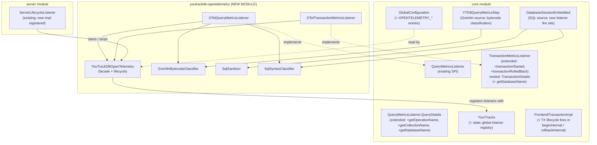

# YTDB-496 OpenTelemetry support

## Design Document
[design.md](design.md)

## High-level plan

### Goals

Expose YouTrackDB query and transaction telemetry through OpenTelemetry so that hosts running embedded YTDB, and operators running standalone YTDB servers, see database calls as spans in their trace viewers (Jaeger, Tempo, Datadog, etc.). The telemetry follows OTel semantic conventions v1.33.0 for database client spans so it lights up in DB-aware tooling without per-vendor adapters. The integration ships in a new optional Maven module `youtrackdb-opentelemetry`; `core` and `server` carry no OTel dependency.

Both Gremlin traversals and native SQL queries emit spans. A Gremlin query emits one CLIENT span with sanitized `db.query.text` produced by the existing `ValueAnonymizingTypeTranslator`, plus `db.operation.name` and `db.collection.name` extracted from the bytecode. A native SQL query (`db.command("SELECT ...")`, MATCH, DDL) emits one CLIENT span with the raw SQL text sanitized into placeholders, plus the operation type and target class parsed from the statement AST. Both share the same `db.system.name=youtrackdb` and attach to the host's active trace context (`Context.current()`). Transactions get their own INTERNAL parent span covering `begin → close`, with the existing commit metrics listener emitting a child CLIENT span for the commit operation; the TX span carries the existing tracking ID.

In embedded mode the SDK resolution chain is: host-provided via `YouTrackDBOpenTelemetry.setOpenTelemetry(...)`, then `GlobalOpenTelemetry.get()` if the host configured the global, then YTDB-built from `OPENTELEMETRY_*` config when neither of the first two yielded a real SDK. The flag is never inert: enabling `OPENTELEMETRY_ENABLED=true` always produces telemetry. In server mode YTDB always owns the SDK because the server is a standalone process.

### Constraints

- **One-way dependency**: `youtrackdb-opentelemetry` depends on `core` for the listener SPI; `core` MUST NOT pull OTel libraries in transitively. YTDB without the OTel module continues to have zero OTel runtime cost.
- **Sem-conv v1.33.0 compliance**: stable semantic conventions for database spans cover attribute names, requirement levels, and sanitization rules. Custom `db.system.name = "youtrackdb"` per §"Notes" of the spec.
- **Host-preferred SDK ownership in embedded**: a host that wires its own `OpenTelemetry` (via setter or `GlobalOpenTelemetry.set(...)`) wins. When no host SDK is found and `OPENTELEMETRY_ENABLED=true`, YTDB auto-configures its own SDK from `OPENTELEMETRY_*` config entries so the flag is never inert. Ownership is tracked so YTDB only closes the SDK it created. In server mode YTDB always owns the SDK because the server is a standalone process.
- **No backward-compat scaffolding**: greenfield emission, ignore `OTEL_SEMCONV_STABILITY_OPT_IN` env var (introduced for instrumentations that already emit a previous version).
- **Listener exception isolation**: callbacks run synchronously on the caller thread; existing try/catch wrapping in the listener firing sites MUST extend to the new lifecycle hooks so a misconfigured OTel SDK never breaks transaction flow.
- **JDK 21+, Maven Wrapper, Spotless on new module**, JUnit 5 tests. The new module is greenfield, no JUnit 4 inertia to preserve.
- **Coverage gate**: 85% line / 70% branch on changed code per CLAUDE.md.

### Architecture Notes

#### Component Map

- **`QueryMetricsListener` / `TransactionMetricsListener` (core, existing SPI)**: the listener contracts. Their `QueryDetails` and `TransactionDetails` types are nested interfaces inside the respective listener interfaces; the plan qualifies them as `QueryMetricsListener.QueryDetails` and `TransactionMetricsListener.TransactionDetails` on first mention. `TransactionMetricsListener` gains two new default no-op methods (`transactionStarted`, `transactionRolledBack`) so existing implementations keep compiling.
- **`QueryMetricsListener.QueryDetails` (core, existing; extended)**: gains `getOperationName()`, `getCollectionName()`, and `getDatabaseName()` returning `Optional<String>`. Populated by both query sources: `YTDBQueryMetricsStep` for Gremlin via the bytecode classifier (operation/collection) and `session.getDatabaseName()` (namespace); `DatabaseSessionEmbedded` for SQL via the syntax classifier (operation/collection) and the session's own database name (namespace).
- **`YourTracks` (core)**: gains static methods `registerGlobalQueryListener` / `unregisterGlobalQueryListener` / `registerGlobalTransactionListener` / `unregisterGlobalTransactionListener`. The registry is process-global (a static holder in `core/.../profiler/monitoring/`); the transaction factory consults the snapshot at `FrontendTransactionImpl.beginInternal()` time and uses that snapshot for the TX's lifetime. Per-TX `withQueryListener` continues to add listeners on top of the snapshot. The `YouTrackDB` interface gets no new methods, keeping `YouTrackDBRemote` and other implementors untouched.
- **`FrontendTransactionImpl` (core)**: `beginInternal()` captures the registry snapshot into a new `txListenerSnapshot` field and iterates it firing `transactionStarted`; `rollbackInternal()` iterates the same snapshot firing `transactionRolledBack` (gated by `txStartCounter == 0` so nested rollbacks don't double-fire). The existing private `notifyMetricsListener` wrapper covers commit success/failure unchanged; the same try/catch shape applies to the two new fires. `YTDBTransaction.doOpen()` / `doRollback()` are not touched — they delegate to the underlying impl, so Gremlin and SQL paths both go through the same fire sites.
- **`YTDBQueryMetricsStep` (core)**: classifies the traversal bytecode via `GremlinBytecodeClassifier` and exposes the result through the enriched `QueryDetails` to the listener callback. Existing fire site, augmented.
- **`DatabaseSessionEmbedded` (core)**: SQL execution entry point at `executeInternal()` (lines 702-751). New listener fire site wraps `statement.execute(...)` with a timer and emits a `QueryDetails` carrying the raw SQL, the sanitized text, the operation name, and the target collection. Covers SELECT / INSERT / UPDATE / DELETE / MATCH / DDL through one method.
- **`GlobalConfiguration` (core)**: new entries `OPENTELEMETRY_ENABLED`, `OPENTELEMETRY_EXPORTER_ENDPOINT`, `OPENTELEMETRY_EXPORTER_PROTOCOL`, `OPENTELEMETRY_SERVICE_NAME` for the server-mode SDK init.
- **`OTelQueryMetricsListener` / `OTelTransactionMetricsListener` (new module)**: translate listener callbacks into OTel spans, taking the parent from `Context.current()` so embedded propagation is automatic.
- **`YouTrackDBOpenTelemetry` (new module)**: static facade. `setOpenTelemetry(OpenTelemetry)` for explicit host wiring; falls back to `GlobalOpenTelemetry.get()`. Registers the listeners with the global registry. Idempotent shutdown.
- **`GremlinBytecodeClassifier` (new module)**: maps a TinkerPop `Bytecode` to `{operationName, collectionName}` for sem-conv attributes.
- **`SqlSanitizer` (new module)**: replaces string / numeric / date literals in raw SQL with `?` placeholders for `db.query.text` sanitization. Parameterized queries pass through unchanged.
- **`SqlSyntaxClassifier` (new module)**: walks the parsed SQL statement AST to extract `db.operation.name` (SELECT / INSERT / UPDATE / DELETE / MATCH / CREATE / ALTER / DROP) and `db.collection.name` (target class from FROM / INTO / UPDATE clauses).

#### D1: Global listener registry

- **Alternatives considered**: keep per-TX `withQueryListener` only (config flag would be inert); auto-injection inside the `g.tx()` factory (chosen alternative for D1 → see Rationale below).
- **Rationale**: a `OPENTELEMETRY_ENABLED=true` flag must actually take effect without the host wiring every transaction by hand. A small global registry in `OYouTrackDB` consulted by the transaction factory is the least invasive way to deliver auto-enrolment while keeping per-TX override semantics intact. Factory-side auto-injection would couple the registry to the Gremlin entry point only and miss any direct `YTDBTransaction` construction.
- **Risks/Caveats**: registration order matters if multiple listeners coexist. The registry is a List preserving insertion order, and the transaction copies the current snapshot at begin time so mid-TX registrations don't take effect.
- **Implemented in**: Track 1 (registry SPI), Track 5 (OTel listener registration).

#### D2: Hybrid SDK ownership — host preferred, YTDB falls back to self-built

- **Alternatives considered**: YTDB always owns SDK in embedded (conflicts with host instrumentation when host has its own SDK); host-only in embedded with silent no-op fallback (sharp edge — operator enables flag, sees nothing, has no signal what went wrong); always-host in both modes (impossible in server mode where YTDB IS the process).
- **Rationale**: in embedded mode the resolution chain on first listener fire is (1) value passed to `YouTrackDBOpenTelemetry.setOpenTelemetry(otel)` if any, (2) `GlobalOpenTelemetry.get()` if it returns a non-no-op SDK, (3) lazy auto-configure from `OPENTELEMETRY_*` config entries via OTel autoconfigure (same path as server mode). Host-provided wins when present so we never duplicate a host's existing SDK; self-built fills the gap so `OPENTELEMETRY_ENABLED=true` always produces telemetry, regardless of whether the host has its own OTel setup. In server mode YTDB always owns the SDK because there is no host to provide one. The facade tracks ownership via an internal boolean so `shutdown()` closes the SDK only when YTDB created it.
- **Risks/Caveats**: a host that sets `OPENTELEMETRY_ENABLED=true` and forgets to wire its OTel sees YTDB silently open a network connection to the configured endpoint (default `http://localhost:4317`). The flag is an explicit opt-in so this is acceptable, and an INFO log records the situation. If the host later calls `setOpenTelemetry(...)` after self-built ran, the facade closes the YTDB-built SDK and switches to the host's instance.
- **Implemented in**: Track 5.
- **Full design**: design.md §"SDK lifecycle: embedded vs server"

#### D3: Full span hierarchy with TX as parent over query and commit

- **Alternatives considered**: query-only spans (loses TX context in viewer); query+commit only without TX parent (commit span "floats" in the trace).
- **Rationale**: a trace viewer's value is showing "this request did X, Y, Z" with timing. Without a TX span as parent, multiple queries inside one TX render as disjoint database calls; with it, the user sees `TX 850ms { query 47ms, query 600ms, commit 50ms }` which matches the operator's mental model. Requires extending `TransactionMetricsListener` with `transactionStarted` and `transactionRolledBack` defaults.
- **Risks/Caveats**: TX spans for read-only transactions get no commit child (no `writeTransactionCommitted` fires). The TX span still closes cleanly because `transactionRolledBack` covers user-initiated rollback (including the silent rollback at end of a read-only TX `close()`).
- **Implemented in**: Track 1 (listener API extension), Track 3 (OTelTransactionMetricsListener).
- **Full design**: design.md §"Transaction-lifetime span semantics"

#### D4: Automatic OTel Context propagation via `Context.current()`

- **Alternatives considered**: explicit `withContext(Context)` per query; pass parent context through `QueryDetails`.
- **Rationale**: the existing `QueryMetricsListener` callback fires synchronously on the caller thread. `YTDBQueryMetricsStep.close()` calls the listener directly, and `assertOnOwningThread` enforces TX operations stay on the owner thread. `Context.current()` therefore returns the host's active span. No additional plumbing.
- **Risks/Caveats**: if a future change moves traversal close to a worker pool, propagation breaks silently. Mitigated by a test that runs a host-context span around a YTDB query and asserts the YTDB query span's parent matches; the test fails loudly if threading changes.
- **Implemented in**: Track 3 (listener implementations) and Track 6 (propagation test).
- **Full design**: design.md §"Context propagation in embedded"

#### D5: Span kinds by role

- **Alternatives considered**: all CLIENT (commit aligns but TX is not a single call); all INTERNAL (loses "database edge" in service maps); mode-aware (CLIENT server, INTERNAL embedded; adds branching for no benefit).
- **Rationale**: sem-conv v1.33.0 defaults DB spans to CLIENT and allows INTERNAL for in-memory DBs. The query and commit are database calls; the TX span is a logical container, not a call, so INTERNAL fits. Picking CLIENT for query in both modes keeps service maps consistent and trace viewers labeling YTDB as a database edge. Query span is CLIENT, TX span is INTERNAL, commit span is CLIENT.
- **Risks/Caveats**: none significant; the choice is observable in viewer styling only.
- **Implemented in**: Track 3.

#### D6: `db.system.name = "youtrackdb"` (custom value)

- **Alternatives considered**: `other_sql` (loses identity; YTDB is not SQL-only).
- **Rationale**: sem-conv §"Notes" mandates the lowercase DBMS name as a custom value when not on the well-known list. `"youtrackdb"` is unambiguous. Future PR to add it to the well-known list is a separate concern.
- **Risks/Caveats**: backends may not recognize the system name for built-in dashboards until it's registered upstream.
- **Implemented in**: Track 3.

#### D7: Delegate sampling to the OTel sampler

- **Alternatives considered**: built-in `queryThresholdNanos` filter (proposed in the YouTrack draft); per-query AlwaysOn.
- **Rationale**: emitting a span and then letting the host's sampler decide is the standard OTel pattern. Built-in threshold filtering is a worse heuristic (a 1 ms failed query carries more signal than a 500 ms scan returning a million rows) and reinvents what OTel SDK already provides (`TraceIdRatioBased`, `ParentBased`, `AlwaysOn`).
- **Risks/Caveats**: under heavy benchmark load (LDBC) the unfiltered span volume can overwhelm an unsampled exporter. The host must configure a sampler. Documented in the embedded section.
- **Implemented in**: Track 3.

#### D8: SQL execution layer hook at `DatabaseSessionEmbedded.executeInternal()`

- **Alternatives considered**: per-statement-type hooks inside each `SQLSelectStatement.execute()` / `SQLMatchStatement.execute()` / etc. (DRY violation across 5+ classes); hook inside `LocalResultSet` constructor (misses DDL and non-idempotent commands); skip SQL entirely (loses observability for MATCH, DDL, `db.command(...)` apps, and underlying SQL beneath Gremlin).
- **Rationale**: `DatabaseSessionEmbedded.executeInternal()` (lines 702-751) is the single point where every SQL statement type funnels through: SELECT, INSERT, UPDATE, DELETE, MATCH, and DDL (CREATE / ALTER / DROP) all flow through the same `statement.execute(this, args, true)` call. Wrapping it with a timer and firing the listener once per execution gives one hook covering everything. The raw SQL text is available as `stringStatement`, parameters as `args`, the transaction context as `currentTx`, and elapsed time as a `System.nanoTime()` delta.
- **Risks/Caveats**: `stringStatement` can be null when a pre-parsed `SQLStatement` is passed in by an internal recursive call; the fallback is `statement.getOriginalStatement()`. Tracking ID comes from `String.valueOf(currentTx.getId())` — `FrontendTransaction.getId(): long` already exists and returns a stable internal ID, so Track 4 does not add a new accessor. Handled in Track 4.
- **Implemented in**: Track 4.
- **Full design**: design.md §"SQL execution layer hook"

#### D9: Extract `db.operation.name` and `db.collection.name` from both Gremlin bytecode and SQL AST

- **Alternatives considered**: omit both attributes (loses span-name quality and grouping); pre-compute on query parse (Gremlin has no parse hook in current code, SQL parses inside `executeInternal`).
- **Rationale**: for Gremlin the bytecode is available in `YTDBQueryMetricsStep` (line 131 `traversal.getBytecode()`); the classifier identifies the start step (`V`/`E`/`addV`/`addE`/...) and the first `hasLabel` or `addV`/`addE` label argument. For SQL the parsed `SQLStatement` is available in `executeInternal` after `SQLEngine.parse()`; the classifier reads the statement subclass (SELECT / INSERT / UPDATE / DELETE / MATCH / DDL) and the FROM / INTO / UPDATE clause target class. Both yield low-cardinality values that drive `{db.operation.name} {db.collection.name}` span names per sem-conv. Two parallel classifier impls share the same `QueryClassifier` SPI loaded via ServiceLoader from `core`.
- **Risks/Caveats**: complex Gremlin traversals (multi-class, no label) and complex SQL (no FROM clause, anonymous tables, multi-target UPDATE / MATCH chains) won't yield clean values. Both accessors return `Optional.empty()` and the span name falls back to `db.system.name`. Documented and tested.
- **Implemented in**: Track 1 (QueryDetails extension, classifier SPI slot), Track 3 (Gremlin classifier impl), Track 4 (SQL classifier impl).
- **Full design**: design.md §"Gremlin bytecode classification" and §"SQL execution layer hook"

#### D10: TX lifecycle fires consolidated in `FrontendTransactionImpl`

- **Alternatives considered**: fire from `YTDBTransaction.doOpen()` / `doRollback()` only (covers Gremlin path; `db.command(...)` SQL flows that don't cross `YTDBTransaction` get no TX-parent span); fire from both `YTDBTransaction` and `FrontendTransactionImpl` (risks double TX spans for Gremlin-initiated transactions that traverse both classes).
- **Rationale**: `beginInternal()` and `rollbackInternal()` are the single chokepoints for every TX path in the codebase. Gremlin's `YTDBTransaction.doOpen()` calls `activeSession.begin()` which routes through `beginInternal()`; `DatabaseSessionEmbedded.begin()` calls it directly. Same for rollback (six call sites in `DatabaseSessionEmbedded`, plus the Gremlin path). Putting both fires inside `FrontendTransactionImpl` covers Gremlin and native SQL with one fire site each. The existing private `notifyMetricsListener` wrapper sits in the same class, so the two new fires reuse the same try/catch shape without needing a hoisted helper.
- **Risks/Caveats**: `rollbackInternal()` is called recursively from error paths inside `FrontendTransactionImpl`; the new fire must be gated by `txStartCounter == 0` so nested rollbacks don't emit multiple `transactionRolledBack` callbacks. The snapshot must be captured before `txStartCounter` increments in `beginInternal()` so nested begins reuse the outermost snapshot.
- **Implemented in**: Track 1.

#### D11: Listener wrapper widened from `Exception` to `Throwable`

- **Alternatives considered**: leave the existing wrappers catching `Exception` only (design promise of "catches Throwable" downgrades to current code; an `Error` from OOM in OTel span allocation unwinds the TX).
- **Rationale**: an OTel listener that throws an `Error` (OOME during span allocation, `AssertionError` in a misconfigured SDK) MUST NOT take down the transaction. Both existing wrappers (`FrontendTransactionImpl.notifyMetricsListener:730`, `YTDBQueryMetricsStep:148`) catch `Exception` today; Track 1 widens them to `Throwable` and applies the same shape to the two new TX-lifecycle fires. The widening logs the throwable at WARN and swallows it.
- **Risks/Caveats**: catching `Throwable` masks JVM-fatal errors (`OutOfMemoryError`, `StackOverflowError`) when they originate inside the listener. The log line preserves operator visibility; YTDB's own code paths around the listener call remain free to throw and propagate normally.
- **Implemented in**: Track 1.

#### D12: Tracer instrumentation version from `YouTrackDBConstants.getRawVersion()`

- **Alternatives considered**: hard-code a version string (drifts); use `getVersion()` which returns `"<v> (build <r>, branch <b>)"` and is too verbose for the version slot.
- **Rationale**: OTel `getTracer(name, version)` expects a clean version string. `getRawVersion()` returns just `"0.5.0-SNAPSHOT"`. The constant lives in `internal.core.YouTrackDBConstants`; the new module is internal too, so accessing it is fine.
- **Risks/Caveats**: none.
- **Implemented in**: Track 3.

#### D13: Test infrastructure using `opentelemetry-sdk-testing`

- **Alternatives considered**: custom in-memory exporter; mock OTel APIs.
- **Rationale**: `io.opentelemetry:opentelemetry-sdk-testing` ships `InMemorySpanExporter`, `OpenTelemetryRule`, and other building blocks designed for instrumentation tests. Using it gives assertions on real SDK behavior (sampler, exporter pipeline, attribute propagation) without re-implementing the test fixtures.
- **Risks/Caveats**: adds a test-scope dependency on the new module. Acceptable.
- **Implemented in**: Track 6.

### Invariants

- **One-way dependency**: `core` and `server` carry no OTel imports. Enforced by Maven dependency scope and verified by a static check in the build.
- **TX span boundedness**: every `transactionStarted` callback that fires MUST be followed by exactly one of `writeTransactionCommitted` / `writeTransactionFailed` / `transactionRolledBack`, so OTel never leaks an unclosed span.
- **Listener exception isolation**: an OTel listener throwing inside any callback (including `Throwable`) MUST NOT propagate to the transaction. Track 1 widens the existing `Exception`-only catch in `FrontendTransactionImpl.notifyMetricsListener` and `YTDBQueryMetricsStep.close()` to `Throwable`, and applies the same shape to the two new TX-lifecycle fires.
- **TX lifecycle fire chokepoint**: `transactionStarted` and `transactionRolledBack` fire exclusively from `FrontendTransactionImpl.beginInternal()` and `rollbackInternal()` respectively, both gated by `txStartCounter == 0` so nested begins/rollbacks do not double-fire.
- **`db.system.name = "youtrackdb"`** is a compile-time constant in `YouTrackDBOpenTelemetry`; no caller can override it.
- **Span kind by role**: query span MUST be CLIENT, TX span MUST be INTERNAL, commit span MUST be CLIENT, and no SERVER / PRODUCER / CONSUMER kinds are emitted by YTDB. Checked by tests asserting on `SpanData.getKind()` for the positive cases and by a negative assertion that the in-memory exporter never captures a span with any of the three excluded kinds.

### Integration Points

- `YourTracks.registerGlobalQueryListener(QueryMetricsListener)` and matching unregister, plus the transaction-listener pair — static methods on the existing `final` utility class (CR9: registry is process-global; the `YouTrackDB` interface gets no new methods).
- `TransactionMetricsListener#transactionStarted(TransactionDetails)` and `#transactionRolledBack(TransactionDetails)`, new default no-op methods on the existing nested `TransactionMetricsListener` SPI. Fire sites: `FrontendTransactionImpl.beginInternal()` and `rollbackInternal()`.
- `QueryMetricsListener.QueryDetails#getOperationName(): Optional<String>`, `#getCollectionName(): Optional<String>`, and `#getDatabaseName(): Optional<String>`, new default accessors on the existing nested interface.
- `TransactionMetricsListener.TransactionDetails#getDatabaseName(): Optional<String>`, new default accessor on the existing nested interface.
- `DatabaseSessionEmbedded.executeInternal()`, new listener fire site wrapping `statement.execute(...)` for the SQL path. Uses `currentTx.getId()` (existing) as the tracking ID via `String.valueOf(...)`; no new `FrontendTransaction.getTrackingId()` accessor is added.
- `QueryClassifier` SPI in core (ServiceLoader-discovered), one impl per source language in the OTel module.
- `YouTrackDBOpenTelemetry.setOpenTelemetry(OpenTelemetry)` and `shutdown()`, new module entry points. A package-private 2-arg variant `setOpenTelemetry(OpenTelemetry, boolean ownedByYtdb)` exists for `OpenTelemetryServerPlugin` to signal server-mode ownership.
- `YouTrackDBServer.activate()` extended with `ServiceLoader.load(ServerLifecycleListener.class)` so the new `OpenTelemetryServerPlugin` auto-registers without explicit operator wiring (CR3: existing code uses only manual `registerLifecycleListener`; Track 5 adds the ServiceLoader call).
- `ServerLifecycleListener.onAfterActivate()` / `onBeforeDeactivate()`, bound by a new `OpenTelemetryServerPlugin` in the new module.

### Non-Goals

- **OTel Metrics signal (histograms, counters)**: out of scope. Span-only telemetry. Percentile metrics are explicitly deferred in the YouTrack design article and tracked separately.
- **TinkerPop `ProfileStep` / native YTDB Explain integration**: out of scope. The Gremlin-to-SQL explain bridge is a parallel concern, not part of the OTel emission path.
- **`OTEL_SEMCONV_STABILITY_OPT_IN` env var**: greenfield emission of stable v1.33.0 conventions, no legacy version to switch between.

## Checklist

- [ ] Track 1: Foundation extension in `core` for OTel-readiness
  > Extend the existing listener SPI with the hooks the OTel module needs: two new default-no-op methods on `TransactionMetricsListener` (begin / rollback), a process-global listener registry exposed as static methods on `YourTracks`, three new default accessors on `QueryMetricsListener.QueryDetails` (operation / collection / namespace), one new default accessor on `TransactionMetricsListener.TransactionDetails` (namespace), a `QueryClassifier` SPI slot, new TX-lifecycle fires inside `FrontendTransactionImpl.beginInternal()` / `rollbackInternal()`, a gate update in `YTDBQueryMetricsStrategy` so globally-registered listeners actually receive callbacks, refactor of existing single-listener call sites to iterate the per-TX snapshot, and widening of the existing exception-isolation wrappers from `Exception` to `Throwable`. No behavior change for transactions without registered listeners; every existing call path stays green. Detailed description in `plan/track-1.md`.
  > **Scope:** ~8 steps covering SPI extension, registry holder, QueryDetails/TransactionDetails enrichment, QueryClassifier SPI slot, TX lifecycle fires in `FrontendTransactionImpl`, strategy gate, snapshot iteration, exception-wrapper widening.

- [ ] Track 2: `youtrackdb-opentelemetry` Maven module skeleton
  > Create the new module under the root reactor with parent inheritance, OTel BOM-driven dependencies, Spotless config, and an empty package layout ready for the listener implementations. Adds a Maven dependency-arrow check so `core` never gains an OTel import. Detailed description in `plan/track-2.md`.
  > **Scope:** ~3 steps covering module pom, root reactor wiring, dependency direction check.

- [ ] Track 3: OTel listener implementations and Gremlin bytecode classifier
  > Implement `OTelQueryMetricsListener`, `OTelTransactionMetricsListener`, the `YouTrackDBOpenTelemetry` facade, and the Gremlin bytecode classifier inside the new module. Maps every Gremlin callback to sem-conv-compliant spans with the right kind, attributes, and parent context. SQL source wiring lands in Track 4; registration logic in Track 5. Detailed description in `plan/track-3.md`.
  > **Scope:** ~6 steps covering query listener, TX listener, facade, Gremlin classifier, sem-conv attribute mapping, span-name fallback.
  > **Depends on:** Track 1, Track 2

- [ ] Track 4: SQL execution layer hook, sanitizer, and syntax classifier
  > Add a listener fire site at `DatabaseSessionEmbedded.executeInternal()` so every native SQL statement (SELECT / INSERT / UPDATE / DELETE / MATCH / DDL) flows through `QueryMetricsListener.queryFinished(...)`, and implement `SqlSanitizer` (literal-to-`?` replacement) plus `SqlSyntaxClassifier` (operation + collection from the parsed AST) inside the OTel module; both classifier impls register through the `QueryClassifier` SPI from Track 1. Detailed description in `plan/track-4.md`.
  > **Scope:** ~5 steps covering executeInternal hook, SQL-flavored QueryDetails impl, sanitizer rules, syntax classifier per statement type (using `SQLSelectStatement` / `SQLInsertStatement` / `SQLUpdateStatement` / `SQLDeleteStatement` / `SQLMatchStatement` / `SQLCreateClassStatement` / `SQLAlterClassStatement` / `SQLDropClassStatement` subclasses), tests for each statement type. Tracking ID comes from the existing `currentTx.getId()` via `String.valueOf(...)`; no new `FrontendTransaction.getTrackingId()` accessor needed.
  > **Depends on:** Track 1, Track 3

- [ ] Track 5: Configuration parameters and lifecycle integration
  > Add `GlobalConfiguration` entries, wire embedded mode (host-provided `OpenTelemetry` via setter + `GlobalOpenTelemetry.get()` fallback + lazy auto-configure from `OPENTELEMETRY_*` entries), add a `ServerLifecycleListener`-based plugin that initializes/closes the SDK in server mode based on the config flag, and add `ServiceLoader.load(ServerLifecycleListener.class)` to `YouTrackDBServer.activate()` so the plugin auto-discovers (the existing code only honors explicit `registerLifecycleListener` calls — Track 5 adds the discovery loop). After this track the OTel module auto-enrols when enabled. Detailed description in `plan/track-5.md`.
  > **Scope:** ~6 steps covering config entries, embedded facade with 2-arg `setOpenTelemetry`, server plugin, ServiceLoader discovery in `YouTrackDBServer`, SDK init/close, idempotence.
  > **Depends on:** Track 2, Track 3

- [ ] Track 6: Test suite using `opentelemetry-sdk-testing`
  > Cover the listener-to-span mapping for both Gremlin and SQL paths (sem-conv attributes, span kinds, hierarchy parent/child links), context propagation in embedded (host span becomes parent), server-mode lifecycle (init/close), and the exception-isolation invariant. Uses `InMemorySpanExporter` so assertions run against real SDK behavior. Detailed description in `plan/track-6.md`.
  > **Scope:** ~7 steps covering Gremlin attribute mapping, SQL attribute mapping, hierarchy, context propagation, lifecycle, exception isolation, coverage gate.
  > **Depends on:** Track 3, Track 4, Track 5

## Plan Review
- [x] Plan review (consistency + structural) — passed at iteration 2

**Auto-fixed (mechanical)**: CR2 (added Track 1 step widening `YTDBQueryMetricsStrategy` gate so globally-registered listeners cause the step to inject); CR6 (qualified `QueryMetricsListener.QueryDetails` nesting in plan, design class diagram, and Track 1 signatures); CR7 (same for `TransactionMetricsListener.TransactionDetails`); CR8 (static methods on the `final` utility class `YourTracks`); CR10 (added package-private 2-arg `setOpenTelemetry(OpenTelemetry, boolean ownedByYtdb)` overload to design class diagram and Integration Points); CR11 (standardised `ThreadLocal<Context>` across design class diagram, prose, sequence diagram, Track 3); CR13 (Track 3 consumes the existing `QueryDetails.getQuery()` rather than reaching into the package-private translator); CR14 (`assertOnOwningThread` correctly attributed to `FrontendTransactionImpl`); CR15 (SQL prefix on DDL parser class names — `SQLCreateClassStatement` / `SQLAlterClassStatement` / `SQLDropClassStatement`); CR17 (Track 1 explicit step refactoring the existing single-listener call sites to iterate the per-TX snapshot); CR18 (gate-verification finding — `SQLDeleteStatement.getFromClause()` instead of `getTarget()`); S1 (collapsed Track 5's duplicate `Depends on:` line); S2 (added Track 2 to Track 5's dependency annotation); S3 (Track 4 intro paragraph trimmed from 4 sentences to 2); S5 (renumbered D14 → D13 to close the numbering gap).

**Escalated (design decisions)**: CR1 (resolved option 3 — TX-lifecycle fires consolidated in `FrontendTransactionImpl.beginInternal()` / `rollbackInternal()` covering Gremlin and native-SQL paths through one chokepoint; new D10); CR3 (resolved option 1 — Track 5 adds `ServiceLoader.load(ServerLifecycleListener.class)` to `YouTrackDBServer.activate()`); CR4 (resolved option 1 — Track 1 widens existing wrappers from `Exception` to `Throwable`; new D11); CR5 (eliminated by CR1 option 3); CR9 (resolved option 1 — registry is process-global; static methods on `YourTracks` only; `YouTrackDB` interface gets no new methods); CR12 (resolved option 1 — `getDatabaseName(): Optional<String>` added to both `QueryDetails` and `TransactionDetails`); CR16 (resolved option 2 — reuse existing `FrontendTransaction.getId(): long`; no new accessor); S4 (resolved option 1 — Track 1 stays at 8 steps; steps tightly coupled, single PR sequence preferred); S6 (resolved option 2 — span-kind invariant tightened with explicit SERVER / PRODUCER / CONSUMER exclusion plus negative-assertion test obligation).

## Final Artifacts
- [ ] Phase 4: Final artifacts (`design-final.md`, `adr.md`)
