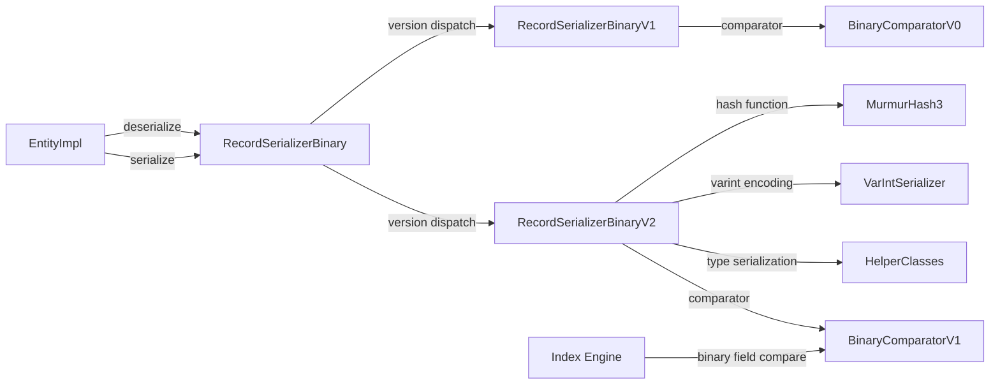

# Open Hash Map Property Serializer (V2)

## High-level plan

### Goals

Replace the current linear-scan serialization format (V1) with a new V2 format
that uses an open-addressing hash map layout for O(1) property lookup during
deserialization. The current format stores properties sequentially in a
header+values layout where every property lookup (`deserializePartial`,
`deserializeField`) requires scanning the entire header — O(n) per field.
The new format embeds a hash table directory in the serialized bytes so that
individual property access is O(1) with a single hash computation and one
indirection.

**Why this matters:**
- `deserializePartial()` and `deserializeField()` are hot-path operations
  used by index lookups, query evaluation, and binary field comparison.
- Entities with 20-50+ properties pay a significant cost for linear header
  scanning on every partial read.
- The new format also enables faster `getFieldNames()` by reading the hash
  table directory rather than scanning variable-length header entries.

### Constraints

1. **Backward compatibility**: V1 records already on disk must remain readable.
   The version byte at position 0 of each serialized record dispatches to the
   correct deserializer. New records are written in V2; old records are read
   with V1.
2. **Space budget**: Records live on 8 KB pages. The hash table overhead must
   be small — a few percent of record size at most. Perfect hashing with
   brute-force seed search at 2x capacity (4x for N>40) adds ~6 bytes
   metadata + empty slots (each slot is a 3-byte fixed-size entry).
3. **Serialization latency**: The perfect hash seed search runs at
   serialization time. With 2x capacity (4x for N>40), seed search
   completes in <1 ms — acceptable for a write path.
4. **Deterministic hashing**: Must use a portable, well-defined hash function
   (not `String.hashCode()`). The existing `MurmurHash3` (128-bit) class
   at `internal.common.hash.MurmurHash3` can be adapted.
5. **Schema-aware and schema-less**: V1 supports both global-property-ID
   encoding (schema-aware, compact) and inline field-name encoding
   (schema-less). V2 must support both. The hash table keys are always
   the property name strings — schema-aware properties are resolved to names
   during hash table construction.
6. **Delta serialization**: `EntitySerializerDelta` is unused dead code —
   removed in Track 1 as a cleanup prerequisite. Transaction-level change
   tracking is handled by EntityEntry state flags, not by a separate
   serializer.
7. **Embedded entities**: Embedded entities (type EMBEDDED) are recursively
   serialized. The V2 format applies recursively — each embedded entity gets
   its own hash table directory.
8. **BinaryComparator**: The `BinaryComparatorV0` performs byte-level
   comparisons on serialized fields. A V2 comparator must locate field bytes
   via the hash table instead of linear scan.

### Architecture Notes

#### Component Map



- **RecordSerializerBinary** — modified: extend `serializerByVersion` array
  to include V2, update `CURRENT_RECORD_VERSION` to 1
- **RecordSerializerBinaryV2** — new: implements `EntitySerializer` with
  open-addressing hash map format
- **MurmurHash3** — modified: add a 32-bit seeded variant for hash table
  index computation (current impl is 128-bit unseeded)
- **BinaryComparatorV1** — new: field lookup via hash table for binary
  comparison
- **VarIntSerializer** — unchanged, reused for encoding integers
- **HelperClasses** — unchanged, reused for type-specific serialization
- **EntityImpl** — unchanged, interacts only through `EntitySerializer`
  interface
- **Index Engine** — unchanged, uses `BinaryComparator` interface

#### D1: Perfect hashing with brute-force seed search

- **Alternatives considered**:
  - *Robin Hood hashing* — O(1) amortized but ~1.5 avg probes, requires
    probing logic on read path, bounded but non-zero worst case
  - *Swiss Table* — SIMD-dependent, high implementation complexity,
    negligible benefit at N ≤ 50
  - *Cuckoo hashing* — guaranteed O(1) but poor space efficiency (50% load
    with 2 hash functions) or 3 non-contiguous accesses (3 hash functions)
  - *Linear probing* — simple but unbounded worst-case probe chains
  - *Plain linear scan (status quo)* — O(n) per field lookup
- **Rationale**: For the "build once, read many" pattern with small key sets
  (5-50 properties), perfect hashing is optimal:
  - Exactly 1 hash + 1 array access per lookup (true O(1), no probing)
  - Tiny metadata (4-byte seed + capacity)
  - At 2x capacity (4x for N>40), seed search for N ≤ 50 completes in <100 μs
  - Simple serialized format (seed + flat slot array + key-value data)
  - No probing logic on the hot read path
  - Existing MurmurHash3 provides high-quality, portable hash function
- **Risks/Caveats**:
  - Seed search is probabilistic — for pathological key sets at tight
    capacity, it may need many attempts. Mitigation: if seed not found
    within a reasonable limit (e.g. 10,000 attempts), increase capacity
    by one step and retry.
  - MurmurHash3 is 128-bit; we need a 32-bit variant for table indexing.
    Adding a lightweight 32-bit seeded MurmurHash3 is straightforward.
  - Each serialized record carries 4 bytes of seed overhead. For records
    with very few properties (1-2), this is proportionally larger. But
    for the common case (5-50 properties), it is negligible.
- **Implemented in**: Track 4 (seed search and hash table construction), with Track 3 (hash function) and Track 5 (comparator) as supporting tracks

#### D2: Power-of-two capacity with Fibonacci hashing for index computation

- **Alternatives considered**:
  - *Prime-number capacity with modulo* — better distribution but requires
    integer division (slower than bitwise AND)
  - *Arbitrary capacity with modulo* — same division cost, no distribution
    benefit
- **Rationale**: Power-of-two capacity enables `hash & (capacity - 1)` for
  index computation, avoiding division. Fibonacci hashing
  (`(hash * 2654435769) >>> (32 - log2(capacity))`) breaks up clustering
  patterns that plain modulo introduces with power-of-two sizes.
  For N ≤ 50, the next power of two after 2×N (or 4×N for N>40)
  gives compact capacity (≤ 256 slots).
- **Risks/Caveats**: Power-of-two sizing wastes some slots compared to
  exact-fit sizing. For small N this is at most a few extra slots.
- **Implemented in**: Track 4

#### D3: Slot format — fixed-size entries with offset + key hash prefix

- **Alternatives considered**:
  - *Offset only (no hash prefix)* — saves 1-2 bytes per slot but requires
    jumping to the key-value area and comparing the full key on every probe
    (in fallback/verification scenarios)
  - *Full hash storage* — 4 bytes per slot, overkill since perfect hashing
    has no collisions
- **Rationale**: Each slot stores a 1-byte hash prefix (high 8 bits of hash)
  plus a 2-byte offset to the key-value entry. The hash prefix enables fast
  rejection of mismatches when verifying the key (defense against hash
  collisions in corrupted data). 3 bytes per slot keeps the table compact.
  For capacity 64, the hash table is 192 bytes — well within page budget.
  If a record's key-value data exceeds 64 KB (extremely unlikely for
  entity properties), we can use 3-byte offsets at a 4-byte slot size.
- **Risks/Caveats**: 2-byte offset limits key-value region to 64 KB.
  Records rarely approach this size, but if they do, a 3-byte offset
  variant is a straightforward extension.
- **Implemented in**: Track 4

#### D4: Fallback to linear layout for 0-2 properties

- **Alternatives considered**:
  - *Always use hash table* — simpler code but wastes space for trivial
    records
- **Rationale**: For 0-2 properties, a hash table adds overhead with no
  lookup benefit. Records with 0 properties need only a class name. Records
  with 1-2 properties are faster to scan linearly than to hash. A simple
  flag in the header (e.g., property count 0-2 signals linear mode)
  switches to a compact inline layout identical to V1's approach.
- **Risks/Caveats**: Two code paths (hash table vs linear) add complexity.
  Mitigation: the linear path is a trivial subset of the hash path.
- **Implemented in**: Track 4

#### Invariants

- **Hash table correctness**: For every serialized record in V2 format, the
  hash table must satisfy: `murmurhash3_32(propertyName, seed) & (capacity-1)`
  maps to a slot containing the correct offset to that property's key-value
  data. No two properties map to the same slot.
- **Round-trip fidelity**: `deserialize(serialize(entity))` must produce an
  entity with identical property names, types, and values.
- **Backward compatibility**: Records with version byte 0 must continue to
  deserialize correctly via V1. Records with version byte 1 use V2.
- **Partial deserialization correctness**: `deserializePartial(fields)` must
  return exactly the same values as full `deserialize()` for those fields.
- **Binary comparator equivalence**: `BinaryComparatorV1` must produce the
  same comparison results as `BinaryComparatorV0` for identical field values.

#### Integration Points

- **RecordSerializerBinary.init()**: Register V2 serializer at index 1 in the
  `serializerByVersion` array. Set `CURRENT_RECORD_VERSION = 1`.
- **EntityImpl**: No changes needed — it interacts through the
  `EntitySerializer` interface via `RecordSerializerBinary`.
- **BinaryComparator**: Index engine uses `getComparator()` from the
  serializer. V2 returns `BinaryComparatorV1`.
- **MurmurHash3**: New static method `hash32WithSeed(byte[], int offset,
  int len, int seed)` added to existing class.

**Detailed design**: See [design.md](design.md) for binary format layouts, workflow diagrams, capacity analysis, and performance characteristics.

#### Non-Goals

- **In-memory property storage changes**: EntityImpl already uses
  `HashMap<String, EntityEntry>` in memory. This plan only changes the
  serialized binary format.
- **Delta serialization format changes**: Not in scope. `EntitySerializerDelta`
  is removed as dead code in Track 1.
- **Automatic migration of existing V1 records**: Old records remain in V1
  format until re-written (e.g., on update). No background migration.
- **Compression**: No inline compression in the hash table format. The
  storage layer handles LZ4 compression independently.
- **Variable-width slots or complex encoding**: Keeping slot format fixed-size
  for simplicity and alignment.

## Checklist

- [x] Track 1: Remove dead EntitySerializerDelta
  > Delete `EntitySerializerDelta` and its test class — they are unused dead
  > code that will confuse implementers working on the new V2 serializer.
  >
  > **What**: Remove `EntitySerializerDelta.java` and
  > `EntitySerializerDeltaTest.java`. The only production reference is a
  > static utility method `getFieldType()` called from
  > `RecordSerializerBinaryV1.serializeEntity()` — move that method into
  > `RecordSerializerBinaryV1` before deleting.
  > **How**: Move `getFieldType()` to `RecordSerializerBinaryV1`, update the
  > call site, delete both files, run spotless and compile.
  > **Constraints**: Must not break any existing tests.
  > **Interactions**: Clears the way for Tracks 3-6 by removing confusing
  > dead code from the serialization package.
  >
  > **Scope:** ~1 step covering method relocation and file deletion
  >
  > **Track episode:**
  > Moved `getFieldType()` into `RecordSerializerBinaryV1` as `private static`
  > and deleted `EntitySerializerDelta.java` (1,472 lines) and its test class.
  > Straightforward cleanup with no surprises or cross-track impact.
  >
  > **Step file:** `tracks/track-1.md` (1 step, 0 failed)
  >
  > **Strategy refresh:** CONTINUE — no downstream impact detected.

- [x] Track 2: Strengthen partial deserialization test coverage
  > Add tests that form the behavioral contract for partial deserialization.
  > These tests run against V1 today and must pass unchanged against V2
  > once it is registered — they act as a safety net for the serializer
  > replacement.
  >
  > **What**: Add test coverage for the following gaps:
  > - **`getProperty()` triggers partial deserialization**: Persist an entity
  >   to disk, reload it, access a single property, and verify that only
  >   that property was deserialized (the others remain unloaded). This
  >   tests the `EntityImpl.checkForProperties(name)` →
  >   `deserializePartial()` path that real application code exercises.
  > - **`deserializeField()` unit tests**: Directly test the binary field
  >   location mechanism used by index comparators — serialize an entity,
  >   call `deserializeField()` for each property, verify correct type and
  >   byte position.
  > - **Partial deserialization edge cases**: request a non-existent field
  >   (should return null, not throw); request schema-aware and schema-less
  >   fields in the same entity; partial deserialization of embedded
  >   entities; partial deserialization with null-valued properties.
  > - **`getFieldNames()` correctness**: Verify that field names extracted
  >   from serialized bytes match the original property names for entities
  >   with schema-aware properties, schema-less properties, and mixed.
  >
  > **How**: Add test methods to the existing parameterized
  > `EntitySchemalessBinarySerializationTest` (runs against all serializer
  > versions). For the `getProperty()`-triggers-partial-deserialization
  > test, use a database-backed test that persists and reloads an entity.
  >
  > **Constraints**: Tests must be serializer-version-agnostic — they test
  > the `EntitySerializer` contract, not V1-specific behavior. When V2 is
  > registered, these tests must pass without modification.
  >
  > **Interactions**: No code dependencies on other tracks. Provides the
  > test safety net that Tracks 3-6 rely on for correctness validation.
  >
  > **Scope:** ~2-3 steps covering partial deserialization contract tests,
  > deserializeField tests, and edge case tests
  >
  > **Track episode:**
  > Added 12 test methods to `EntitySchemalessBinarySerializationTest` forming
  > a comprehensive behavioral contract for partial deserialization. Tests cover
  > partial deserialization edge cases, `deserializeField()` for all 13
  > binary-comparable types, `getFieldNames()` for schema-aware and mixed-mode
  > entities, and a persist-reload `getProperty()` integration test. All tests
  > are serializer-version-parameterized and will serve as the safety net for
  > V2 implementation. No surprises or cross-track impact.
  >
  > **Step file:** `tracks/track-2.md` (2 steps, 0 failed)
  >
  > **Strategy refresh:** CONTINUE — no downstream impact detected.

- [x] Track 3: MurmurHash3 32-bit seeded variant
  > Add a 32-bit seeded hash method to the existing `MurmurHash3` class.
  > The current implementation provides only 128-bit unseeded hashing.
  > The new method `hash32WithSeed(byte[] data, int offset, int len, int seed)`
  > returns a 32-bit hash suitable for hash table index computation.
  >
  > **What**: Implement MurmurHash3 32-bit finalization with seed parameter.
  > **How**: Standard MurmurHash3_x86_32 algorithm — single 32-bit state,
  > block processing in 4-byte chunks, tail handling, finalization mix.
  > **Constraints**: Must be deterministic and portable (no JVM-specific
  > behavior). Must match the reference C implementation for test vectors.
  > **Interactions**: Used by Track 4 (serializer) and Track 5 (comparator)
  > for hash computation.
  >
  > **Scope:** ~2-3 steps covering implementation and test vectors
  >
  > **Track episode:**
  > Implemented `MurmurHash3.hash32WithSeed(byte[], int, int, int)` — standard
  > MurmurHash3_x86_32 algorithm with offset support. Added 33 test methods
  > covering reference vectors, all tail lengths, seed variation, high-byte
  > masking, offset correctness, and typical property name strings that lock in
  > exact hash values for the V2 serializer. No surprises or cross-track impact.
  >
  > **Step file:** `tracks/track-3.md` (2 steps, 0 failed)
  >
  > **Strategy refresh:** CONTINUE — no downstream impact detected.

- [x] Track 4: RecordSerializerBinaryV2 — hash map serialization format
  > Core track: implement the new V2 serializer that writes and reads the
  > open-addressing hash map format.
  >
  > **What**: New `RecordSerializerBinaryV2` class implementing
  > `EntitySerializer` with:
  > - Serialization: compute perfect hash seed for property names, build
  >   hash table directory, write seed + capacity + slot array + key-value
  >   data.
  > - Deserialization: read seed + capacity, compute hash for requested
  >   field, index into slot array, follow offset to key-value data.
  > - Partial deserialization: O(1) per requested field instead of O(n) scan.
  > - Field names extraction: iterate non-empty slots in the hash table.
  > - Fallback: for 0-2 properties, use compact linear layout.
  >
  > **How — Binary format layout**:
  > ```
  > [class name: varint len + UTF-8 bytes]   (0 len if no class)
  > [property count: varint]
  > --- if count <= 2: linear mode ---
  > [for each property: name-encoding + type + value-size + value-bytes]
  > --- if count > 2: hash table mode ---
  > [hash seed: 4 bytes, little-endian uint32]
  > [capacity: 1 byte (log2 of actual capacity, max 8 → 256 slots)]
  > [slot array: capacity × 3 bytes each]
  >   slot = [hash8: 1 byte] [offset: 2 bytes LE]
  >   empty slot = [0x00] [0x0000]
  > [key-value entries, packed sequentially]
  >   entry = [name-encoding] [type byte] [value-size varint] [value-bytes]
  >   name-encoding:
  >     schema-aware: varint (propertyId+1)*-1
  >     schema-less: varint len + UTF-8 bytes
  > ```
  >
  > **Constraints**:
  > - Slot offset is relative to the start of the key-value region.
  > - Offset 0x0000 with hash8 0x00 is the empty sentinel. If a property
  >   genuinely hashes to hash8=0x00 and offset=0, store hash8 as 0x01
  >   (collision in the verification byte is harmless for correctness since
  >   key comparison is always performed).
  > - Seed search must succeed for all valid property sets. If no seed found
  >   within 10,000 attempts at current capacity, double capacity and retry.
  > - Embedded entities are serialized recursively with their own hash tables.
  > - Schema-aware property encoding uses global property IDs, same as V1.
  >
  > **Interactions**: Depends on Track 3 (MurmurHash3 32-bit). Track 5
  > (comparator) depends on this track's format.
  >
  > **Scope:** ~5-7 steps covering seed search algorithm, serialization,
  > deserialization (full + partial + field), field name extraction,
  > registration in RecordSerializerBinary, and round-trip tests
  > **Depends on:** Track 2, Track 3
  >
  > **Track episode:**
  > Implemented `RecordSerializerBinaryV2` — open-addressing perfect hash map
  > serializer for O(1) property lookup. Supports linear mode (≤2 properties)
  > and hash table mode (>2 properties) with Fibonacci-hashed slots (1-byte
  > hash8 + 2-byte offset). Seed search is brute-force with capacity doubling
  > (max 1024). Embedded entities/sets/lists/maps serialize recursively in V2.
  > Registered as version 1 in `RecordSerializerBinary`; V1 remains readable.
  > Key discoveries: V1's recursive `serializeValue()` required V2 to override
  > all recursive types; full deserialization needed `rawContainsProperty()`
  > guard to avoid overwriting in-memory modifications during lazy loading.
  >
  > **Step file:** `tracks/track-4.md` (4 steps, 0 failed)
  >
  > **Strategy refresh:** CONTINUE — no downstream impact detected.

- [~] Track 5: BinaryComparatorV1 — hash-based field lookup for binary comparison
  > Implement a new binary comparator that uses the V2 hash table format
  > to locate fields for byte-level comparison, replacing the linear scan
  > in `BinaryComparatorV0`.
  >
  > **What**: New `BinaryComparatorV1` class implementing `BinaryComparator`.
  > Uses the hash table directory to locate a field's serialized bytes in
  > O(1), then delegates to the same byte-comparison logic as V0.
  >
  > **How**: The comparator receives a `BytesContainer` positioned after the
  > version byte. It reads the hash table header (seed, capacity), computes
  > the hash for the requested field name, indexes into the slot array,
  > follows the offset to the value bytes, and returns a `BinaryField`
  > wrapping those bytes.
  >
  > **Constraints**: Must produce identical comparison results to
  > `BinaryComparatorV0` for the same field values — only the field-location
  > mechanism changes.
  >
  > **Interactions**: Depends on Track 4 (V2 format). Used by index engine
  > for binary field comparison.
  >
  > **Scope:** ~2-3 steps covering comparator implementation, integration
  > with V2 serializer, and equivalence tests against V0
  > **Depends on:** Track 4
  >
  > **Track episode:**
  > SKIPPED — Technical review (T1) found that `BinaryComparator` interface
  > only operates on pre-located `BinaryField` values. Field location is done
  > by `EntitySerializer.deserializeField()`, which V2 already implements with
  > O(1) hash table lookup in Track 4. A new `BinaryComparatorV1` would
  > duplicate `BinaryComparatorV0` with zero behavioral difference.
  >
  > **Step file:** `tracks/track-5.md` (0 steps, 0 failed — skipped)
  >
  > **Strategy refresh:** CONTINUE — skip has no downstream impact. Track 6
  > integration tests can verify binary comparison correctness using
  > V2's `deserializeField()` + existing `BinaryComparatorV0`.

- [x] Track 6: Integration testing and backward compatibility verification
  > End-to-end tests verifying that V2 works correctly in the full database
  > lifecycle: create entities, persist to disk, read back, update, query
  > via Gremlin, and verify backward compatibility with V1 records.
  >
  > **What**: Integration tests covering:
  > - Round-trip: serialize V2 → deserialize V2 for all property types
  > - Mixed-version: V1 records coexist with V2 records in the same database
  > - Partial deserialization: verify O(1) field access returns correct values
  > - Embedded entities: recursive V2 serialization
  > - Schema-aware and schema-less properties in the same entity
  > - Edge cases: empty entity, single property, max properties (~100+),
  >   very long property names, null values, all 23 property types
  > - Binary comparator equivalence: V0 and V1 produce identical results
  >
  > **How**: Add test methods to existing test classes where appropriate.
  > Create a dedicated `RecordSerializerBinaryV2Test` for format-level
  > tests. Use the existing test infrastructure (JUnit 4 in core).
  >
  > **Constraints**: Must pass with `-Dyoutrackdb.test.env=ci` (disk storage).
  >
  > **Interactions**: Depends on Tracks 4 and 5.
  >
  > **Scope:** ~3-5 steps covering round-trip tests, mixed-version tests,
  > edge case tests, and full database lifecycle tests
  > **Depends on:** Track 4, Track 5
  >
  > **Track episode:**
  > Added 17 integration tests across 3 steps verifying V2 serializer correctness
  > in real database scenarios: schema-aware round-trip (including 100+ properties
  > stress test and long property names), link type round-trip (LINK, LINKLIST,
  > LINKSET, LINKMAP), database lifecycle (persist→close→reopen), and binary
  > comparator equivalence (BinaryComparatorV0 with V2-serialized fields). Key
  > discovery: `getProperty()` for LINK values triggers lazy-load via
  > `session.load(rid)`, requiring real persisted entities for link tests. No plan
  > deviations or cross-track impact — this is the final track.
  >
  > **Step file:** `tracks/track-6.md` (3 steps, 0 failed)
