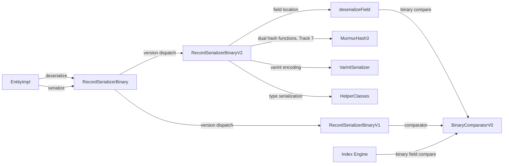

# Open Hash Map Property Serializer (V2)

## High-level plan

### Goals

Replace the current linear-scan serialization format (V1) with a new V2 format
that uses an open-addressing hash map layout for O(1) property lookup during
deserialization. The current format stores properties sequentially in a
header+values layout where every property lookup (`deserializePartial`,
`deserializeField`) requires scanning the entire header — O(n) per field.
The new format embeds a hash table directory in the serialized bytes so that
individual property access is O(1) with a single hash computation and one
indirection.

**Why this matters:**
- `deserializePartial()` and `deserializeField()` are hot-path operations
  used by index lookups, query evaluation, and binary field comparison.
- Entities with 20-50+ properties pay a significant cost for linear header
  scanning on every partial read.
- The new format also enables faster `getFieldNames()` by reading the hash
  table directory rather than scanning variable-length header entries.

### Constraints

1. **Backward compatibility**: V1 records already on disk must remain readable.
   The version byte at position 0 of each serialized record dispatches to the
   correct deserializer. New records are written in V2; old records are read
   with V1.
2. **Space budget**: Records live on 8 KB pages. The hash table overhead must
   be small — a few percent of record size at most. Bucketized cuckoo at
   ~85% load factor adds 5 bytes metadata (4-byte seed + 1-byte log2) +
   bucket slots (each slot is a 3-byte fixed-size entry). At 85% load,
   the table is more compact than the original 50%-load perfect hash design.
3. **Serialization latency**: Hash table construction must be O(n) — no
   brute-force seed search. The original perfect hashing approach caused a
   5× write path slowdown in JMH benchmarks due to seed search (up to
   10,000 attempts). Bucketized cuckoo uses greedy placement with short
   displacement chains, completing in a single O(n) pass.
4. **Deterministic hashing**: Must use a portable, well-defined hash function
   (not `String.hashCode()`). The existing `MurmurHash3` (128-bit) class
   at `internal.common.hash.MurmurHash3` can be adapted.
5. **Schema-aware and schema-less**: V1 supports both global-property-ID
   encoding (schema-aware, compact) and inline field-name encoding
   (schema-less). V2 must support both. The hash table keys are always
   the property name strings — schema-aware properties are resolved to names
   during hash table construction.
6. **Delta serialization**: `EntitySerializerDelta` is unused dead code —
   removed in Track 1 as a cleanup prerequisite. Transaction-level change
   tracking is handled by EntityEntry state flags, not by a separate
   serializer.
7. **Embedded entities**: Embedded entities (type EMBEDDED) are recursively
   serialized. The V2 format applies recursively — each embedded entity gets
   its own hash table directory.
8. **BinaryComparator**: The `BinaryComparatorV0` performs byte-level
   comparisons on serialized fields. V2's `deserializeField()` locates
   field bytes via the hash table; `BinaryComparatorV0` is reused as-is
   (confirmed in Track 5 review).

### Architecture Notes

#### Component Map



- **RecordSerializerBinary** — modified (Track 4): `serializerByVersion`
  array includes V2 at index 1, `CURRENT_RECORD_VERSION = 1`
- **RecordSerializerBinaryV2** — modified (Track 7): replace perfect hash
  seed search with bucketized cuckoo construction; raise linear mode
  threshold from 2 to 12; bucket-based lookup in deserialization
- **MurmurHash3** — modified (Track 3): `hash32WithSeed()` 32-bit seeded
  variant. Used with two different seeds for cuckoo's dual hash functions.
- **BinaryComparatorV0** — unchanged, reused for all versions (Track 5
  confirmed no V1 comparator needed)
- **VarIntSerializer** — unchanged, reused for encoding integers
- **HelperClasses** — unchanged, reused for type-specific serialization
- **EntityImpl** — unchanged, interacts only through `EntitySerializer`
  interface
- **Index Engine** — unchanged, uses `BinaryComparator` interface

#### D1: ~~Perfect hashing~~ → ~~Bucketized cuckoo~~ → Linear probing (revised)

- **Approach 1 (Tracks 4-6)**: Perfect hashing with brute-force seed search.
  JMH benchmarks showed **5× write path slowdown**. Replaced in Track 7.
- **Approach 2 (Track 7)**: Bucketized cuckoo hashing (b=4, d=2, ~85% load).
  JMH benchmarks (Track 8, CCX33) showed **2-2.5× write path regression**
  vs V1 (e.g., 6,649 ns vs 2,715 ns at 50 properties). Displacement chains
  and dual hash computation during construction were the bottleneck.
- **Alternatives investigated** (Track 9 research):
  - *Robin Hood hashing* — hash8 fast-reject already provides the same
    benefit (avoiding false key comparisons). Worst-case improvement is
    only 2-3 probes at N≤100. Not worth the construction complexity.
  - *Swiss Table metadata separation* — counterproductive at our table sizes
    (39-300 bytes, 1-5 cache lines). Separating hash8 from offsets means
    two accesses instead of one contiguous read.
  - *SWAR (SIMD-in-a-register)* — 3-byte interleaved slot layout doesn't
    pack neatly into a `long`. Rearranging hurts locality at these sizes.
  - *Quadratic probing* — loses linear probing's sequential cache-line
    utilization. At load factor 0.625, primary clustering is mild.
  - *Minimal perfect hashing (ShockHash, PtrHash, qlibs/mph)* — latest
    2025 approaches still require brute-force construction. Already rejected.
- **Chosen: Plain linear probing with Fibonacci hashing**
  - Single hash function (MurmurHash3 with seed)
  - Sequential probing: hash → Fibonacci index → scan forward for match/empty
  - Load factor ~0.625 (5/8): average 1.83 probes, worst-case ~10 at N=100
  - hash8 fast-reject per slot (255/256 non-matching slots rejected without
    following offset)
- **Rationale**:
  - **Trivially O(n) construction** — for each key: hash, Fibonacci-index,
    scan forward for empty slot. No eviction chains, no seed retries, no
    dual hash computation. This directly addresses the cuckoo regression.
  - **Cache-friendly reads** — sequential memory access pattern maximizes
    cache line utilization. At our table sizes, the entire table fits in L1.
  - **Simplest possible implementation** — ~100 lines less than cuckoo.
    No buckets, no displacement chains, no alternate-bucket logic.
  - **Tombstone-free termination** — since we never delete, unsuccessful
    lookups stop at the first empty slot (bounded probe length).
- **Space comparison** (50 properties):
  - Cuckoo (85% load, b=4): 64 slots × 3B = 192 bytes
  - Linear probing (62.5% load): 80 slots × 3B = 240 bytes (+48B, negligible)
- **Risks/Caveats**:
  - Worst-case probe length is unbounded in theory (O(log N) expected with
    good hash function). At load factor 0.625 with N≤100 and MurmurHash3,
    worst case is ~10-12 probes — each is just a byte comparison with hash8.
  - Lower load factor (62.5% vs 85%) uses ~25% more slot space, but the
    absolute overhead is small (48 extra bytes at 50 properties).
- **Implemented in**: Track 4 (perfect hash), Track 7 (cuckoo), Track 9
  (linear probing)

#### D2: Power-of-two capacity with Fibonacci hashing for index computation

- **Alternatives considered**:
  - *Prime-number capacity with modulo* — better distribution but requires
    integer division (slower than bitwise AND)
  - *Arbitrary capacity with modulo* — same division cost, no distribution
    benefit
- **Rationale**: Power-of-two slot count enables Fibonacci hashing
  (`(hash * 2654435769) >>> (32 - log2(capacity))`) for slot index
  computation. This breaks up clustering patterns and avoids division.
  For N properties at 62.5% load:
  `capacity = nextPowerOfTwo(ceil(N / 0.625))`.
  Example: N=50 → minSlots=80 → capacity=128 → 384 bytes.
- **Risks/Caveats**: Power-of-two rounding can cause load factor variation.
  The space cost is still small and accepted as a trade-off for avoiding
  integer division on the hot read path.
- **Implemented in**: Track 4 (original), Track 7 (bucket-based), Track 9
  (slot-based linear probing)

#### D3: Slot format — fixed-size entries with offset + key hash prefix

- **Alternatives considered**:
  - *Offset only (no hash prefix)* — saves 1-2 bytes per slot but requires
    jumping to the key-value area and comparing the full key on every probe
  - *Full hash storage* — 4 bytes per slot, wastes space for small tables
- **Rationale**: Each slot stores a 1-byte hash prefix (high 8 bits of the
  hash) plus a 2-byte offset to the key-value entry. In linear probing,
  hash8 is **critical for performance**: during sequential slot scanning,
  the hash8 prefix rejects 255/256 non-matching slots without following
  the offset — this makes the probe sequence nearly free. 3 bytes per slot
  keeps the table compact.
- **Risks/Caveats**: 2-byte offset limits key-value region to 64 KB.
  Records rarely approach this size, but if they do, a 3-byte offset
  variant is a straightforward extension.
- **Implemented in**: Track 4 (original), unchanged across all revisions

#### D4: 3-tier hybrid routing (revised from 2-tier)

- **Original (Track 4)**: 2-tier — linear for ≤2 properties, hash table
  for >2.
- **Revised (Track 7)**: 3-tier hybrid:

  | Tier | Property count | Mode | Lookup cost |
  |---|---|---|---|
  | 1 | 0–2 | Linear (compact, no hash overhead) | O(n), n≤2 |
  | 2 | 3–12 | Linear (raised threshold) | O(n), n≤12 |
  | 3 | 13+ | Linear probing hash table | O(1) avg, ~1.83 probes |

- **Rationale**: For 3-12 properties, hash table overhead (seed + slots)
  exceeds the cost of linear scan. At 12 entries with ~30 bytes average
  per entry, the KV region is ~360 bytes (~6 cache lines). Linear scan
  avoids hash computation entirely. The hash table only pays off for 13+
  properties where O(n) scanning becomes measurable.
- **Risks/Caveats**: Two code paths (linear and hash table). Tiers 1 and 2
  share the same linear serialization code — the only difference is the
  routing threshold.
- **Implemented in**: Track 4 (original 2-tier), Track 7 (3-tier with
  cuckoo), Track 9 (3-tier with linear probing)

#### ~~D5: Dual hash functions for cuckoo~~ (removed in Track 9)

- **Status**: Removed. Linear probing uses a single hash function
  (`MurmurHash3.hash32WithSeed(nameBytes, 0, len, seed)`). No dual
  hash computation needed. The seed is still stored (4 bytes) to allow
  deterministic hash table reconstruction.
- **Original design (Track 7)**: Two hash functions derived from a single
  seed via XOR with `0x85ebca6b`. Removed because linear probing does
  not need alternate bucket placement.

#### ~~D6: Cuckoo construction algorithm~~ (removed in Track 9)

- **Status**: Removed. Replaced by trivial linear probing insertion:
  1. For each property, compute `hash = MurmurHash3.hash32WithSeed(...)`.
  2. Compute slot index via Fibonacci hashing.
  3. Scan forward (wrapping) until an empty slot is found.
  4. Place hash8 + offset in the empty slot.
  No eviction chains, no seed retries, no capacity doubling.
- **Original design (Track 7)**: Greedy cuckoo placement with displacement
  chains (up to 500 evictions) and seed retry (up to 10 attempts).
  Caused 2-2.5× write path regression.

#### Invariants

- **Linear probing hash table correctness**: For every serialized record in
  V2 hash table mode (>12 properties), each property must be locatable by
  starting at `slot = fibonacciIndex(hash(name, seed), log2Capacity)` and
  probing forward (wrapping). The property's slot contains the correct hash8
  prefix and offset. No two properties occupy the same slot. The probe
  sequence always terminates — either at a matching slot or an empty slot.
- **Round-trip fidelity**: `deserialize(serialize(entity))` must produce an
  entity with identical property names, types, and values — for all three
  tiers (linear ≤2, linear 3-12, linear-probing hash table >12).
- **Backward compatibility**: Records with version byte 0 must continue to
  deserialize correctly via V1. Records with version byte 1 use V2.
- **Partial deserialization correctness**: `deserializePartial(fields)` must
  return exactly the same values as full `deserialize()` for those fields.
- **Binary comparator equivalence**: `BinaryComparatorV0` produces correct
  comparison results for V2-serialized fields located via `deserializeField()`.

#### Integration Points

- **RecordSerializerBinary.init()**: Register V2 serializer at index 1 in the
  `serializerByVersion` array. Set `CURRENT_RECORD_VERSION = 1`. (Done in
  Track 4, unchanged by Track 7.)
- **EntityImpl**: No changes needed — it interacts through the
  `EntitySerializer` interface via `RecordSerializerBinary`.
- **BinaryComparator**: Index engine uses `getComparator()` from the
  serializer. V2 returns `BinaryComparatorV0` (Track 5 confirmed no
  separate V1 comparator needed).
- **MurmurHash3**: `hash32WithSeed(byte[], int offset, int len, int seed)`
  — called with a single seed for linear probing slot index computation.

**Detailed design**: See [design.md](design.md) for binary format layouts, workflow diagrams, capacity analysis, and performance characteristics.

#### Non-Goals

- **In-memory property storage changes**: EntityImpl already uses
  `HashMap<String, EntityEntry>` in memory. This plan only changes the
  serialized binary format.
- **Delta serialization format changes**: Not in scope. `EntitySerializerDelta`
  is removed as dead code in Track 1.
- **Automatic migration of existing V1 records**: Old records remain in V1
  format until re-written (e.g., on update). No background migration.
- **Compression**: No inline compression in the hash table format. The
  storage layer handles LZ4 compression independently.
- **Variable-width slots or complex encoding**: Keeping slot format fixed-size
  for simplicity and alignment.

## Checklist

- [x] Track 1: Remove dead EntitySerializerDelta
  > Delete `EntitySerializerDelta` and its test class — they are unused dead
  > code that will confuse implementers working on the new V2 serializer.
  >
  > **What**: Remove `EntitySerializerDelta.java` and
  > `EntitySerializerDeltaTest.java`. The only production reference is a
  > static utility method `getFieldType()` called from
  > `RecordSerializerBinaryV1.serializeEntity()` — move that method into
  > `RecordSerializerBinaryV1` before deleting.
  > **How**: Move `getFieldType()` to `RecordSerializerBinaryV1`, update the
  > call site, delete both files, run spotless and compile.
  > **Constraints**: Must not break any existing tests.
  > **Interactions**: Clears the way for Tracks 3-6 by removing confusing
  > dead code from the serialization package.
  >
  > **Scope:** ~1 step covering method relocation and file deletion
  >
  > **Track episode:**
  > Moved `getFieldType()` into `RecordSerializerBinaryV1` as `private static`
  > and deleted `EntitySerializerDelta.java` (1,472 lines) and its test class.
  > Straightforward cleanup with no surprises or cross-track impact.
  >
  > **Step file:** `tracks/track-1.md` (1 step, 0 failed)
  >
  > **Strategy refresh:** CONTINUE — no downstream impact detected.

- [x] Track 2: Strengthen partial deserialization test coverage
  > Add tests that form the behavioral contract for partial deserialization.
  > These tests run against V1 today and must pass unchanged against V2
  > once it is registered — they act as a safety net for the serializer
  > replacement.
  >
  > **What**: Add test coverage for the following gaps:
  > - **`getProperty()` triggers partial deserialization**: Persist an entity
  >   to disk, reload it, access a single property, and verify that only
  >   that property was deserialized (the others remain unloaded). This
  >   tests the `EntityImpl.checkForProperties(name)` →
  >   `deserializePartial()` path that real application code exercises.
  > - **`deserializeField()` unit tests**: Directly test the binary field
  >   location mechanism used by index comparators — serialize an entity,
  >   call `deserializeField()` for each property, verify correct type and
  >   byte position.
  > - **Partial deserialization edge cases**: request a non-existent field
  >   (should return null, not throw); request schema-aware and schema-less
  >   fields in the same entity; partial deserialization of embedded
  >   entities; partial deserialization with null-valued properties.
  > - **`getFieldNames()` correctness**: Verify that field names extracted
  >   from serialized bytes match the original property names for entities
  >   with schema-aware properties, schema-less properties, and mixed.
  >
  > **How**: Add test methods to the existing parameterized
  > `EntitySchemalessBinarySerializationTest` (runs against all serializer
  > versions). For the `getProperty()`-triggers-partial-deserialization
  > test, use a database-backed test that persists and reloads an entity.
  >
  > **Constraints**: Tests must be serializer-version-agnostic — they test
  > the `EntitySerializer` contract, not V1-specific behavior. When V2 is
  > registered, these tests must pass without modification.
  >
  > **Interactions**: No code dependencies on other tracks. Provides the
  > test safety net that Tracks 3-6 rely on for correctness validation.
  >
  > **Scope:** ~2-3 steps covering partial deserialization contract tests,
  > deserializeField tests, and edge case tests
  >
  > **Track episode:**
  > Added 12 test methods to `EntitySchemalessBinarySerializationTest` forming
  > a comprehensive behavioral contract for partial deserialization. Tests cover
  > partial deserialization edge cases, `deserializeField()` for all 13
  > binary-comparable types, `getFieldNames()` for schema-aware and mixed-mode
  > entities, and a persist-reload `getProperty()` integration test. All tests
  > are serializer-version-parameterized and will serve as the safety net for
  > V2 implementation. No surprises or cross-track impact.
  >
  > **Step file:** `tracks/track-2.md` (2 steps, 0 failed)
  >
  > **Strategy refresh:** CONTINUE — no downstream impact detected.

- [x] Track 3: MurmurHash3 32-bit seeded variant
  > Add a 32-bit seeded hash method to the existing `MurmurHash3` class.
  > The current implementation provides only 128-bit unseeded hashing.
  > The new method `hash32WithSeed(byte[] data, int offset, int len, int seed)`
  > returns a 32-bit hash suitable for hash table index computation.
  >
  > **What**: Implement MurmurHash3 32-bit finalization with seed parameter.
  > **How**: Standard MurmurHash3_x86_32 algorithm — single 32-bit state,
  > block processing in 4-byte chunks, tail handling, finalization mix.
  > **Constraints**: Must be deterministic and portable (no JVM-specific
  > behavior). Must match the reference C implementation for test vectors.
  > **Interactions**: Used by Track 4 (serializer) and Track 5 (comparator)
  > for hash computation.
  >
  > **Scope:** ~2-3 steps covering implementation and test vectors
  >
  > **Track episode:**
  > Implemented `MurmurHash3.hash32WithSeed(byte[], int, int, int)` — standard
  > MurmurHash3_x86_32 algorithm with offset support. Added 33 test methods
  > covering reference vectors, all tail lengths, seed variation, high-byte
  > masking, offset correctness, and typical property name strings that lock in
  > exact hash values for the V2 serializer. No surprises or cross-track impact.
  >
  > **Step file:** `tracks/track-3.md` (2 steps, 0 failed)
  >
  > **Strategy refresh:** CONTINUE — no downstream impact detected.

- [x] Track 4: RecordSerializerBinaryV2 — hash map serialization format
  > Core track: implement the new V2 serializer that writes and reads the
  > open-addressing hash map format.
  >
  > **What**: New `RecordSerializerBinaryV2` class implementing
  > `EntitySerializer` with:
  > - Serialization: compute perfect hash seed for property names, build
  >   hash table directory, write seed + capacity + slot array + key-value
  >   data.
  > - Deserialization: read seed + capacity, compute hash for requested
  >   field, index into slot array, follow offset to key-value data.
  > - Partial deserialization: O(1) per requested field instead of O(n) scan.
  > - Field names extraction: iterate non-empty slots in the hash table.
  > - Fallback: for 0-2 properties, use compact linear layout.
  >
  > **How — Binary format layout**:
  > ```
  > [class name: varint len + UTF-8 bytes]   (0 len if no class)
  > [property count: varint]
  > --- if count <= 2: linear mode ---
  > [for each property: name-encoding + type + value-size + value-bytes]
  > --- if count > 2: hash table mode ---
  > [hash seed: 4 bytes, little-endian uint32]
  > [capacity: 1 byte (log2 of actual capacity, max 8 → 256 slots)]
  > [slot array: capacity × 3 bytes each]
  >   slot = [hash8: 1 byte] [offset: 2 bytes LE]
  >   empty slot = [0xFF] [0xFFFF]
  > [key-value entries, packed sequentially]
  >   entry = [name-encoding] [type byte] [value-size varint] [value-bytes]
  >   name-encoding:
  >     schema-aware: varint (propertyId+1)*-1
  >     schema-less: varint len + UTF-8 bytes
  > ```
  >
  > **Constraints**:
  > - Slot offset is relative to the start of the key-value region.
  > - Empty sentinel is hash8=0xFF with offset=0xFFFF. Since 0xFFFF is a
  >   reserved offset value (never assigned to real entries), no collision
  >   with valid data is possible. Track 7 replaces the seed search
  >   algorithm with bucketized cuckoo construction.
  > - Seed search must succeed for all valid property sets. If no seed found
  >   within 10,000 attempts at current capacity, double capacity and retry.
  > - Embedded entities are serialized recursively with their own hash tables.
  > - Schema-aware property encoding uses global property IDs, same as V1.
  >
  > **Interactions**: Depends on Track 3 (MurmurHash3 32-bit). Track 5
  > (comparator) depends on this track's format.
  >
  > **Scope:** ~5-7 steps covering seed search algorithm, serialization,
  > deserialization (full + partial + field), field name extraction,
  > registration in RecordSerializerBinary, and round-trip tests
  > **Depends on:** Track 2, Track 3
  >
  > **Track episode:**
  > Implemented `RecordSerializerBinaryV2` — open-addressing perfect hash map
  > serializer for O(1) property lookup. Supports linear mode (≤2 properties)
  > and hash table mode (>2 properties) with Fibonacci-hashed slots (1-byte
  > hash8 + 2-byte offset). Seed search is brute-force with capacity doubling
  > (max 1024). Embedded entities/sets/lists/maps serialize recursively in V2.
  > Registered as version 1 in `RecordSerializerBinary`; V1 remains readable.
  > Key discoveries: V1's recursive `serializeValue()` required V2 to override
  > all recursive types; full deserialization needed `rawContainsProperty()`
  > guard to avoid overwriting in-memory modifications during lazy loading.
  >
  > **Step file:** `tracks/track-4.md` (4 steps, 0 failed)
  >
  > **Strategy refresh:** CONTINUE — no downstream impact detected.

- [~] Track 5: BinaryComparatorV1 — hash-based field lookup for binary comparison
  > Implement a new binary comparator that uses the V2 hash table format
  > to locate fields for byte-level comparison, replacing the linear scan
  > in `BinaryComparatorV0`.
  >
  > **What**: New `BinaryComparatorV1` class implementing `BinaryComparator`.
  > Uses the hash table directory to locate a field's serialized bytes in
  > O(1), then delegates to the same byte-comparison logic as V0.
  >
  > **How**: The comparator receives a `BytesContainer` positioned after the
  > version byte. It reads the hash table header (seed, capacity), computes
  > the hash for the requested field name, indexes into the slot array,
  > follows the offset to the value bytes, and returns a `BinaryField`
  > wrapping those bytes.
  >
  > **Constraints**: Must produce identical comparison results to
  > `BinaryComparatorV0` for the same field values — only the field-location
  > mechanism changes.
  >
  > **Interactions**: Depends on Track 4 (V2 format). Used by index engine
  > for binary field comparison.
  >
  > **Scope:** ~2-3 steps covering comparator implementation, integration
  > with V2 serializer, and equivalence tests against V0
  > **Depends on:** Track 4
  >
  > **Track episode:**
  > SKIPPED — Technical review (T1) found that `BinaryComparator` interface
  > only operates on pre-located `BinaryField` values. Field location is done
  > by `EntitySerializer.deserializeField()`, which V2 already implements with
  > O(1) hash table lookup in Track 4. A new `BinaryComparatorV1` would
  > duplicate `BinaryComparatorV0` with zero behavioral difference.
  >
  > **Step file:** `tracks/track-5.md` (0 steps, 0 failed — skipped)
  >
  > **Strategy refresh:** CONTINUE — skip has no downstream impact. Track 6
  > integration tests can verify binary comparison correctness using
  > V2's `deserializeField()` + existing `BinaryComparatorV0`.

- [x] Track 6: Integration testing and backward compatibility verification
  > End-to-end tests verifying that V2 works correctly in the full database
  > lifecycle: create entities, persist to disk, read back, update, query
  > via Gremlin, and verify backward compatibility with V1 records.
  >
  > **What**: Integration tests covering:
  > - Round-trip: serialize V2 → deserialize V2 for all property types
  > - Mixed-version: V1 records coexist with V2 records in the same database
  > - Partial deserialization: verify O(1) field access returns correct values
  > - Embedded entities: recursive V2 serialization
  > - Schema-aware and schema-less properties in the same entity
  > - Edge cases: empty entity, single property, max properties (~100+),
  >   very long property names, null values, all 23 property types
  > - Binary comparator equivalence: V0 and V1 produce identical results
  >
  > **How**: Add test methods to existing test classes where appropriate.
  > Create a dedicated `RecordSerializerBinaryV2Test` for format-level
  > tests. Use the existing test infrastructure (JUnit 4 in core).
  >
  > **Constraints**: Must pass with `-Dyoutrackdb.test.env=ci` (disk storage).
  >
  > **Interactions**: Depends on Tracks 4 and 5.
  >
  > **Scope:** ~3-5 steps covering round-trip tests, mixed-version tests,
  > edge case tests, and full database lifecycle tests
  > **Depends on:** Track 4, Track 5
  >
  > **Track episode:**
  > Added 17 integration tests across 3 steps verifying V2 serializer correctness
  > in real database scenarios: schema-aware round-trip (including 100+ properties
  > stress test and long property names), link type round-trip (LINK, LINKLIST,
  > LINKSET, LINKMAP), database lifecycle (persist→close→reopen), and binary
  > comparator equivalence (BinaryComparatorV0 with V2-serialized fields). Key
  > discovery: `getProperty()` for LINK values triggers lazy-load via
  > `session.load(rid)`, requiring real persisted entities for link tests. No plan
  > deviations or cross-track impact — this is the final track.
  >
  > **Step file:** `tracks/track-6.md` (3 steps, 0 failed)
  >
  > **Strategy refresh:** CONTINUE — no downstream impact detected.

- [x] Track 7: Redesign V2 hash table — bucketized cuckoo with 3-tier routing
  > Replace the perfect hash seed search in `RecordSerializerBinaryV2` with
  > bucketized cuckoo hashing (b=4 slots/bucket, d=2 hash functions, ~85%
  > load factor). Raise linear mode threshold from 2 to 12 for the 3-tier
  > hybrid. Update all hash table utility, serialization, and deserialization
  > methods. Update V2 unit tests.
  >
  > **Track episode:**
  > Replaced perfect hash seed search with bucketized cuckoo hashing (b=4,
  > d=2, ~85% load factor). Raised linear mode threshold from 2 to 12,
  > creating 3-tier hybrid: linear (0-2), linear (3-12), cuckoo (13+).
  > Construction uses greedy placement with displacement chains and seed
  > retry — O(n) vs the previous brute-force seed search (up to 10,000
  > attempts). Read path checks at most 2 buckets (8 slots) with hash8
  > fast-reject. Net code reduction of ~255 lines. Key discoveries:
  > deterministic slot-0 eviction caused ping-pong displacement cycles —
  > fixed with round-robin eviction; integer overflow risk in bucket count
  > computation — fixed with long arithmetic. Coverage: 91.9% line / 85.4%
  > branch. No cross-track impact.
  >
  > **Step file:** `tracks/track-7.md` (4 steps, 0 failed)
  >
  > **Strategy refresh:** CONTINUE — no downstream impact detected.
  >
  > **Depends on:** Track 3, Track 4

- [x] Track 8: Integration testing and write performance verification
  > Verify the cuckoo-based V2 format in real database scenarios. Update
  > existing Track 6 integration tests for the new format. Add cuckoo-specific
  > edge case tests. Run JMH benchmarks to confirm write path improvement.
  >
  > **Track episode:**
  > Added 5 tier-boundary integration tests (disk-storage DB lifecycle for
  > linear and cuckoo tiers, cuckoo partial deserialization, binary comparator
  > equivalence) and created a JMH benchmark (`RecordSerializerBenchmark`)
  > with 6 methods (serialize, deserializeFull, deserializePartial) comparing
  > V1 vs V2 across 4 property counts (5, 13, 20, 50). CCX33 benchmark
  > results revealed cuckoo construction is **2-2.5× slower** than V1 on the
  > write path (e.g., 6,649 ns vs 2,715 ns at 50 properties). Partial
  > deserialization showed only a modest 23% improvement at 50 properties.
  > **Cross-track impact:** Write path regression triggered decision to replace
  > cuckoo with linear probing in Track 9.
  >
  > **Step file:** `tracks/track-8.md` (2 steps, 0 failed)
  >
  > **Strategy refresh:** ADJUST — Cuckoo hashing write path regression
  > (2-2.5×) confirmed by JMH benchmarks on CCX33. Adding Track 9 to replace
  > cuckoo with plain linear probing (single hash, sequential probing, ~0.625
  > load factor). Track 9 modifies `RecordSerializerBinaryV2` internals only —
  > no changes to binary format structure, slot format, or linear mode.

- [x] Track 9: Replace cuckoo with linear probing
  > Replace bucketized cuckoo hashing in `RecordSerializerBinaryV2` with
  > plain linear probing. Cuckoo construction (displacement chains, dual
  > hash functions, seed retries) caused a 2-2.5× write path regression
  > confirmed by JMH benchmarks (Track 8). Linear probing provides O(n)
  > construction with a single hash function and sequential slot scanning.
  >
  > **What**: Modify `RecordSerializerBinaryV2` hash table internals:
  > - **Construction**: Replace `buildCuckooTable()` / `cuckooInsert()` with
  >   linear probing insert: hash → Fibonacci index → scan forward for empty
  >   slot (wrapping). Single MurmurHash3 call per key, no eviction chains.
  > - **Lookup** (3 methods: `deserializePartialHashTable`,
  >   `deserializeFieldHashTable`, `scanBucketForPartialDeserialize` /
  >   `scanBucketForFieldDeserialize`): Replace 2-bucket scan with linear
  >   probe: hash → Fibonacci index → scan forward, hash8 fast-reject per
  >   slot, stop at empty slot.
  > - **Capacity**: `nextPowerOfTwo(ceil(N / 0.625))` — load factor ~0.625
  >   (5/8), giving average 1.83 probes for successful lookup.
  > - **Constants**: Remove `BUCKET_SIZE`, `CUCKOO_XOR_CONSTANT`,
  >   `MAX_EVICTIONS`, `MAX_SEED_RETRIES`, `computeH2Seed()`. The
  >   `log2NumBuckets` header byte becomes `log2Capacity` (number of slots,
  >   not buckets). Seed stays (single hash function).
  > - **Binary format**: Slot array is now a flat array of `capacity` slots
  >   (not grouped into buckets). Same 3-byte slot format (hash8 + offset).
  >   Header: seed (4B) + log2Capacity (1B) + slot array + KV entries.
  > - **Tests**: Update all V2 unit tests and integration tests. The
  >   `RecordSerializerBenchmark` from Track 8 will serve as the verification
  >   benchmark — re-run on CCX33 after implementation to confirm write path
  >   improvement.
  >
  > **Constraints**: Must not change the linear mode (≤12 properties).
  > Must pass all existing V2 tests after updating hash table internals.
  > The `LINEAR_MODE_THRESHOLD` stays at 12.
  >
  > **Interactions**: Modifies `RecordSerializerBinaryV2` only. No changes
  > to `RecordSerializerBinary`, `RecordSerializerBinaryV1`, or any other
  > file outside the V2 serializer and its tests.
  >
  > **Scope:** ~3-4 steps covering construction rewrite, lookup rewrite
  > (all 3 hash-table-mode read paths), constant/capacity cleanup, and
  > test updates
  > **Depends on:** Track 7, Track 8
  >
  > **Track episode:**
  > Replaced bucketized cuckoo hashing with plain linear probing in
  > `RecordSerializerBinaryV2`. Single MurmurHash3 call per key with
  > sequential slot scanning — O(n) construction, no eviction chains or
  > seed retries. Load factor ~0.625 gives average 1.83 probes. Steps 1-4
  > were merged into a single commit because removing cuckoo constants made
  > read paths and tests uncompilable. Review fixes tightened property count
  > validation to 2047, added `log2Capacity < 1` rejection, and added
  > runtime assertions in `buildHashTable`. Net: -204 lines. Coverage:
  > 90.7% line / 82.8% branch. No cross-track impact.
  >
  > **Step file:** `tracks/track-9.md` (4 steps merged into 1 commit, 0 failed)
  >
  > **Strategy refresh:** CONTINUE — Track 9's linear probing replacement
  > does not change allocation patterns. Track 10 GC optimization strategy
  > remains valid; line numbers need re-discovery due to code shifts.

- [x] Track 10: Reduce GC pressure in V2 serialization path
  > Investigate and fix excessive object allocation in
  > `RecordSerializerBinaryV2.serialize()` that causes high GC pressure
  > observed in `RecordSerializerBenchmark` JMH runs.
  >
  > **Track episode:**
  > Reduced GC pressure through three targeted optimizations: (1) eliminated
  > per-property `BytesContainer` allocation by adding `reset()` and reusing
  > a single `tempBuffer` — discovered that `reset()` must zero used bytes
  > due to V1 delegate serializers relying on zero-initialized memory;
  > (2) eliminated `slotHash8[]` intermediate array by writing hash8 directly
  > into `slotArray` during linear probing; (3) eliminated double UTF-8
  > encoding for schema-less properties in hash table mode by passing
  > pre-encoded `nameBytes[]` to `serializePropertyEntry()`. CCX33 benchmarks
  > confirmed V2 linear mode (5 props) allocates 9% less than V1 (536 vs
  > 592 B/op). Hash table mode (13-50 props) still allocates ~1.7× V1 —
  > remaining gap is structural hash table construction overhead. Write path
  > regression persists: 1.7-2× slower than V1 at 13-50 properties. Partial
  > deserialize wins only at 50 properties (29% faster). Full deserialize
  > shows no improvement. **Cross-track impact:** Write path regression
  > motivates Track 11 to explore a fundamentally different approach.
  >
  > **Step file:** `tracks/track-10.md` (4 steps, 0 failed)
  >
  > **Strategy refresh:** CONTINUE — Track 11 already accounts for
  > Track 10's write path regression findings. No adjustments needed.

- [x] Track 11: Replace hash table with hash-accelerated linear scan
  > Replace the linear probing hash table in `RecordSerializerBinaryV2` with
  > a simpler approach: keep V1's linear scan but prefix each property entry
  > with a 4-byte MurmurHash3 hash of the property name. During partial
  > deserialization, the hash is compared first — on mismatch, the entry is
  > skipped without constructing a String or resolving the property ID.
  >
  > **Track episode:**
  > Replaced the linear probing hash table in `RecordSerializerBinaryV2` with
  > hash-accelerated linear scan. Each property entry is now prefixed with a
  > 4-byte MurmurHash3 hash. During partial deserialization, hash mismatch
  > rejects entries without String construction. Removed all hash table code
  > (slot arrays, Fibonacci hashing, capacity computation, buildHashTable).
  > Net: -1,072 lines in implementation, +93 lines from review fixes.
  > Key discovery: incremental modification of V2 was necessary — a complete
  > rewrite caused a subtle SecurityAccessException during DB authentication;
  > incremental in-place editing avoided the issue. Track-level code review
  > (2 iterations, 6 agents) found and fixed: (1) correctness bug in
  > `deserializePartial` where two requested fields with the same 32-bit hash
  > would cause the second to be silently lost; (2) missing
  > `validateValueLength` in 5 deserialization paths; (3) dead
  > `deserializeFieldLinear` method. Added deterministic hash collision
  > regression tests. Final test count: 95 (was 85 pre-track). This is the
  > last track — no cross-track impact.
  >
  > **Step file:** `tracks/track-11.md` (2 steps, 0 failed)
  > **Depends on:** Track 10
