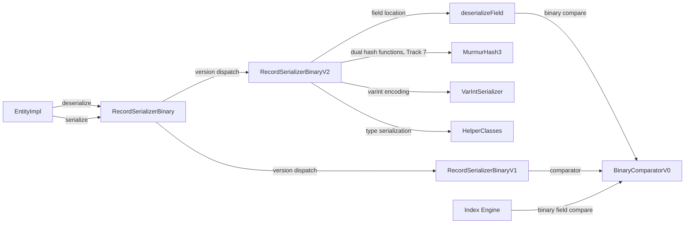

# Open Hash Map Property Serializer (V2)

## High-level plan

### Goals

Replace the current linear-scan serialization format (V1) with a new V2 format
that uses an open-addressing hash map layout for O(1) property lookup during
deserialization. The current format stores properties sequentially in a
header+values layout where every property lookup (`deserializePartial`,
`deserializeField`) requires scanning the entire header — O(n) per field.
The new format embeds a hash table directory in the serialized bytes so that
individual property access is O(1) with a single hash computation and one
indirection.

**Why this matters:**
- `deserializePartial()` and `deserializeField()` are hot-path operations
  used by index lookups, query evaluation, and binary field comparison.
- Entities with 20-50+ properties pay a significant cost for linear header
  scanning on every partial read.
- The new format also enables faster `getFieldNames()` by reading the hash
  table directory rather than scanning variable-length header entries.

### Constraints

1. **Backward compatibility**: V1 records already on disk must remain readable.
   The version byte at position 0 of each serialized record dispatches to the
   correct deserializer. New records are written in V2; old records are read
   with V1.
2. **Space budget**: Records live on 8 KB pages. The hash table overhead must
   be small — a few percent of record size at most. Bucketized cuckoo at
   ~85% load factor adds 5 bytes metadata (4-byte seed + 1-byte log2) +
   bucket slots (each slot is a 3-byte fixed-size entry). At 85% load,
   the table is more compact than the original 50%-load perfect hash design.
3. **Serialization latency**: Hash table construction must be O(n) — no
   brute-force seed search. The original perfect hashing approach caused a
   5× write path slowdown in JMH benchmarks due to seed search (up to
   10,000 attempts). Bucketized cuckoo uses greedy placement with short
   displacement chains, completing in a single O(n) pass.
4. **Deterministic hashing**: Must use a portable, well-defined hash function
   (not `String.hashCode()`). The existing `MurmurHash3` (128-bit) class
   at `internal.common.hash.MurmurHash3` can be adapted.
5. **Schema-aware and schema-less**: V1 supports both global-property-ID
   encoding (schema-aware, compact) and inline field-name encoding
   (schema-less). V2 must support both. The hash table keys are always
   the property name strings — schema-aware properties are resolved to names
   during hash table construction.
6. **Delta serialization**: `EntitySerializerDelta` is unused dead code —
   removed in Track 1 as a cleanup prerequisite. Transaction-level change
   tracking is handled by EntityEntry state flags, not by a separate
   serializer.
7. **Embedded entities**: Embedded entities (type EMBEDDED) are recursively
   serialized. The V2 format applies recursively — each embedded entity gets
   its own hash table directory.
8. **BinaryComparator**: The `BinaryComparatorV0` performs byte-level
   comparisons on serialized fields. V2's `deserializeField()` locates
   field bytes via the hash table; `BinaryComparatorV0` is reused as-is
   (confirmed in Track 5 review).

### Architecture Notes

#### Component Map



- **RecordSerializerBinary** — modified (Track 4): `serializerByVersion`
  array includes V2 at index 1, `CURRENT_RECORD_VERSION = 1`
- **RecordSerializerBinaryV2** — modified (Track 7): replace perfect hash
  seed search with bucketized cuckoo construction; raise linear mode
  threshold from 2 to 12; bucket-based lookup in deserialization
- **MurmurHash3** — modified (Track 3): `hash32WithSeed()` 32-bit seeded
  variant. Used with two different seeds for cuckoo's dual hash functions.
- **BinaryComparatorV0** — unchanged, reused for all versions (Track 5
  confirmed no V1 comparator needed)
- **VarIntSerializer** — unchanged, reused for encoding integers
- **HelperClasses** — unchanged, reused for type-specific serialization
- **EntityImpl** — unchanged, interacts only through `EntitySerializer`
  interface
- **Index Engine** — unchanged, uses `BinaryComparator` interface

#### D1: ~~Perfect hashing~~ → Bucketized cuckoo hashing (revised)

- **Original approach (Tracks 4-6)**: Perfect hashing with brute-force seed
  search. JMH benchmarks showed **5× write path slowdown** due to the seed
  search loop (up to 10,000 attempts per serialization). Replaced in Track 7.
- **Alternatives considered**:
  - *Perfect hashing (original D1)* — true O(1) reads but 5× write
    regression from brute-force seed search. **Rejected after benchmarking.**
  - *Robin Hood hashing* — O(1) amortized, ~1.5 avg probes, cache-friendly
    sequential probing. Good but unbounded worst-case probe chains.
  - *Linear probing* — simplest, cache-friendly, but unbounded worst case.
  - *Swiss Table* — SIMD-dependent, high implementation complexity.
  - *Classic cuckoo (b=1)* — only 50% load factor, wastes space.
- **Chosen: Bucketized cuckoo hashing (b=4, d=2)**
  - 2 hash functions, 4 slots per bucket, ~85% target load factor
  - Following RocksDB's Cuckoo Table (build-once/read-many SST format)
    and DPDK's `librte_hash` (industry-standard network cuckoo table)
- **Rationale**:
  - **O(n) construction** — greedy placement with short displacement chains.
    No brute-force seed search. Seed retry is extremely rare at 85% load.
  - **Bounded worst-case reads** — at most 2 bucket checks (8 slots).
    Hash8 prefix on each slot enables fast rejection without following offset.
  - **95% achievable load factor** — nearly 2× more space-efficient than
    the original 50%-load perfect hash design.
  - **Proven in production** — RocksDB (87% load, build-once), DPDK (b=8,
    95% load), MemC3 (concurrent cuckoo with tags).
  - **Minimal code delta** — same 3-byte slot format (hash8 + offset),
    same Fibonacci hashing for bucket index, same MurmurHash3 function.
    Main changes: bucket grouping, dual hash functions, cuckoo construction.
- **Risks/Caveats**:
  - Read path is 2 bucket checks (up to 8 slots) instead of 1 slot.
    At our table sizes (≤192 bytes for 50 properties), the entire table
    fits in L1 cache, so the extra probing cost is negligible.
  - Displacement chains can theoretically cycle, requiring seed retry.
    At 85% load with b=4, this is vanishingly rare for N ≤ 50.
  - Two hash computations per lookup in worst case (second bucket). In
    common case, key is found in first bucket (single hash computation).
- **Implemented in**: Track 4 (original perfect hash, superseded), Track 7
  (cuckoo redesign)

#### D2: Power-of-two bucket count with Fibonacci hashing for index computation

- **Alternatives considered**:
  - *Prime-number capacity with modulo* — better distribution but requires
    integer division (slower than bitwise AND)
  - *Arbitrary capacity with modulo* — same division cost, no distribution
    benefit
- **Rationale**: Power-of-two bucket count enables Fibonacci hashing
  (`(hash * 2654435769) >>> (32 - log2(numBuckets))`) for bucket index
  computation. This breaks up clustering patterns and avoids division.
  For N properties at 85% load with b=4 slots/bucket:
  `numBuckets = nextPowerOfTwo(ceil(N / (4 * 0.85)))`.
  Example: N=50 → minBuckets=15 → numBuckets=16 → 64 slots → 192 bytes.
- **Risks/Caveats**: Power-of-two rounding can cause significant load factor
  drops at certain property counts (e.g., 30 properties → 47% load instead
  of 85% due to rounding 9 → 16 buckets). The space cost is still small
  (192 bytes for the bucket array at 16 buckets) and accepted as a trade-off
  for avoiding integer division on the hot read path.
- **Implemented in**: Track 4 (original, slot-based), Track 7 (revised,
  bucket-based)

#### D3: Slot format — fixed-size entries with offset + key hash prefix

- **Alternatives considered**:
  - *Offset only (no hash prefix)* — saves 1-2 bytes per slot but requires
    jumping to the key-value area and comparing the full key on every probe
  - *Full hash storage* — 4 bytes per slot, wastes space for small tables
- **Rationale**: Each slot stores a 1-byte hash prefix (high 8 bits of the
  primary hash, h1) plus a 2-byte offset to the key-value entry. In the
  cuckoo design, hash8 is **critical for performance**: when scanning a
  4-slot bucket, the hash8 prefix rejects 255/256 non-matching slots
  without following the offset — this makes bucket scanning nearly free.
  3 bytes per slot keeps the table compact. For 16 buckets × 4 slots =
  192 bytes — well within page budget.
- **Risks/Caveats**: 2-byte offset limits key-value region to 64 KB.
  Records rarely approach this size, but if they do, a 3-byte offset
  variant is a straightforward extension.
- **Implemented in**: Track 4 (original), Track 7 (preserved unchanged)

#### D4: 3-tier hybrid routing (revised from 2-tier)

- **Original (Track 4)**: 2-tier — linear for ≤2 properties, hash table
  for >2.
- **Revised (Track 7)**: 3-tier hybrid:

  | Tier | Property count | Mode | Lookup cost |
  |---|---|---|---|
  | 1 | 0–2 | Linear (compact, no hash overhead) | O(n), n≤2 |
  | 2 | 3–12 | Linear (raised threshold) | O(n), n≤12 |
  | 3 | 13+ | Bucketized cuckoo hash table | O(1), ≤8 slot checks |

- **Rationale**: For 3-12 properties, hash table overhead (seed + buckets)
  exceeds the cost of linear scan. At 12 entries with ~30 bytes average
  per entry, the KV region is ~360 bytes (~6 cache lines). Linear scan
  avoids hash computation entirely. The hash table only pays off for 13+
  properties where O(n) scanning becomes measurable.
- **Risks/Caveats**: Three code paths add complexity. Mitigation: tiers 1
  and 2 share the same linear serialization code — the only difference is
  the routing threshold. The cuckoo tier is a clean separate path. In
  implementation terms, there are 2 code paths (linear and cuckoo); the
  "3-tier" naming reflects three distinct performance profiles, not three
  code paths.
- **Implemented in**: Track 4 (original 2-tier), Track 7 (revised 3-tier)

#### D5: Dual hash functions for cuckoo — seeded MurmurHash3

- **Alternatives considered**:
  - *Two independent seeds (8 bytes stored)* — wastes 4 bytes of record
    overhead for no measurable independence benefit at our table sizes.
  - *Tabulation hashing* — theoretically stronger independence guarantees
    but requires lookup tables, adding implementation complexity.
  - *Single hash split (low 16 / high 16 bits)* — saves a hash computation
    but reduces independence, increasing collision probability.
- **Design**: Two hash functions derived from a single stored seed:
  - `h1 = MurmurHash3.hash32WithSeed(nameBytes, 0, len, seed)`
  - `h2 = MurmurHash3.hash32WithSeed(nameBytes, 0, len, seed ^ 0x85ebca6b)`
  - The XOR constant (`0x85ebca6b`) is a MurmurHash3 finalization constant,
    ensuring seed independence while remaining deterministic.
- **Rationale**: Single stored seed (4 bytes) derives two independent hash
  functions via XOR with a well-tested constant. This provides sufficient
  independence for our table sizes (N ≤ 100) while minimizing record overhead.
- **Read path optimization**: h2 is computed only if the key is not found
  in bucket1. In the common case (key in first bucket), only h1 is computed.
- **Risks/Caveats**: The XOR constant must be non-zero to ensure h1 ≠ h2
  for the same key. The chosen constant (MurmurHash3 finalization constant)
  is well-tested, but any non-zero constant would work.
- **Implemented in**: Track 7

#### D6: Cuckoo construction algorithm

- **Design**: Greedy placement with random-walk displacement chains:
  1. For each property, compute bucket1 (from h1) and bucket2 (from h2).
  2. If bucket1 has an empty slot → place there.
  3. Else if bucket2 has an empty slot → place there.
  4. Else evict a random item from bucket1, place current item there,
     re-place evicted item in its alternate bucket. Repeat for up to
     500 evictions.
  5. If chain exceeds 500 → increment seed and retry from scratch.
- **Capacity computation**: `numBuckets = nextPowerOfTwo(ceil(N / (b * 0.85)))`
  where b=4. This targets ~85% load factor.
- **Rationale**: Random-walk eviction is simpler than BFS and performs
  well at 85% load with b=4. For N ≤ 50, displacement chains are typically
  0-2 steps. Seed retry is a safe fallback but virtually never triggered.
  RocksDB uses the same approach (greedy + seed retry at 87% load).
- **Risks/Caveats**: Pathological key sets could require multiple seed
  retries. At 85% load with b=4, probability is vanishingly small for
  N ≤ 100. If seed retry occurs, it adds one O(n) pass — still far cheaper
  than the original 10,000-attempt perfect hash seed search.
- **Implemented in**: Track 7

#### Invariants

- **Cuckoo hash table correctness**: For every serialized record in V2 hash
  table mode (>12 properties), each property must be locatable by checking
  at most 2 buckets: `bucket1 = fibonacciIndex(h1(name, seed), log2NumBuckets)`
  and `bucket2 = fibonacciIndex(h2(name, seed), log2NumBuckets)`. Exactly
  one slot in one of these two buckets contains the property's hash8 prefix
  and offset. No two properties occupy the same slot.
- **Round-trip fidelity**: `deserialize(serialize(entity))` must produce an
  entity with identical property names, types, and values — for all three
  tiers (linear ≤2, linear 3-12, cuckoo >12).
- **Backward compatibility**: Records with version byte 0 must continue to
  deserialize correctly via V1. Records with version byte 1 use V2.
- **Partial deserialization correctness**: `deserializePartial(fields)` must
  return exactly the same values as full `deserialize()` for those fields.
- **Binary comparator equivalence**: `BinaryComparatorV0` produces correct
  comparison results for V2-serialized fields located via `deserializeField()`.

#### Integration Points

- **RecordSerializerBinary.init()**: Register V2 serializer at index 1 in the
  `serializerByVersion` array. Set `CURRENT_RECORD_VERSION = 1`. (Done in
  Track 4, unchanged by Track 7.)
- **EntityImpl**: No changes needed — it interacts through the
  `EntitySerializer` interface via `RecordSerializerBinary`.
- **BinaryComparator**: Index engine uses `getComparator()` from the
  serializer. V2 returns `BinaryComparatorV0` (Track 5 confirmed no
  separate V1 comparator needed).
- **MurmurHash3**: `hash32WithSeed(byte[], int offset, int len, int seed)`
  — called with two different seeds for cuckoo's dual hash functions.

**Detailed design**: See [design.md](design.md) for binary format layouts, workflow diagrams, capacity analysis, and performance characteristics.

#### Non-Goals

- **In-memory property storage changes**: EntityImpl already uses
  `HashMap<String, EntityEntry>` in memory. This plan only changes the
  serialized binary format.
- **Delta serialization format changes**: Not in scope. `EntitySerializerDelta`
  is removed as dead code in Track 1.
- **Automatic migration of existing V1 records**: Old records remain in V1
  format until re-written (e.g., on update). No background migration.
- **Compression**: No inline compression in the hash table format. The
  storage layer handles LZ4 compression independently.
- **Variable-width slots or complex encoding**: Keeping slot format fixed-size
  for simplicity and alignment.

## Checklist

- [x] Track 1: Remove dead EntitySerializerDelta
  > Delete `EntitySerializerDelta` and its test class — they are unused dead
  > code that will confuse implementers working on the new V2 serializer.
  >
  > **What**: Remove `EntitySerializerDelta.java` and
  > `EntitySerializerDeltaTest.java`. The only production reference is a
  > static utility method `getFieldType()` called from
  > `RecordSerializerBinaryV1.serializeEntity()` — move that method into
  > `RecordSerializerBinaryV1` before deleting.
  > **How**: Move `getFieldType()` to `RecordSerializerBinaryV1`, update the
  > call site, delete both files, run spotless and compile.
  > **Constraints**: Must not break any existing tests.
  > **Interactions**: Clears the way for Tracks 3-6 by removing confusing
  > dead code from the serialization package.
  >
  > **Scope:** ~1 step covering method relocation and file deletion
  >
  > **Track episode:**
  > Moved `getFieldType()` into `RecordSerializerBinaryV1` as `private static`
  > and deleted `EntitySerializerDelta.java` (1,472 lines) and its test class.
  > Straightforward cleanup with no surprises or cross-track impact.
  >
  > **Step file:** `tracks/track-1.md` (1 step, 0 failed)
  >
  > **Strategy refresh:** CONTINUE — no downstream impact detected.

- [x] Track 2: Strengthen partial deserialization test coverage
  > Add tests that form the behavioral contract for partial deserialization.
  > These tests run against V1 today and must pass unchanged against V2
  > once it is registered — they act as a safety net for the serializer
  > replacement.
  >
  > **What**: Add test coverage for the following gaps:
  > - **`getProperty()` triggers partial deserialization**: Persist an entity
  >   to disk, reload it, access a single property, and verify that only
  >   that property was deserialized (the others remain unloaded). This
  >   tests the `EntityImpl.checkForProperties(name)` →
  >   `deserializePartial()` path that real application code exercises.
  > - **`deserializeField()` unit tests**: Directly test the binary field
  >   location mechanism used by index comparators — serialize an entity,
  >   call `deserializeField()` for each property, verify correct type and
  >   byte position.
  > - **Partial deserialization edge cases**: request a non-existent field
  >   (should return null, not throw); request schema-aware and schema-less
  >   fields in the same entity; partial deserialization of embedded
  >   entities; partial deserialization with null-valued properties.
  > - **`getFieldNames()` correctness**: Verify that field names extracted
  >   from serialized bytes match the original property names for entities
  >   with schema-aware properties, schema-less properties, and mixed.
  >
  > **How**: Add test methods to the existing parameterized
  > `EntitySchemalessBinarySerializationTest` (runs against all serializer
  > versions). For the `getProperty()`-triggers-partial-deserialization
  > test, use a database-backed test that persists and reloads an entity.
  >
  > **Constraints**: Tests must be serializer-version-agnostic — they test
  > the `EntitySerializer` contract, not V1-specific behavior. When V2 is
  > registered, these tests must pass without modification.
  >
  > **Interactions**: No code dependencies on other tracks. Provides the
  > test safety net that Tracks 3-6 rely on for correctness validation.
  >
  > **Scope:** ~2-3 steps covering partial deserialization contract tests,
  > deserializeField tests, and edge case tests
  >
  > **Track episode:**
  > Added 12 test methods to `EntitySchemalessBinarySerializationTest` forming
  > a comprehensive behavioral contract for partial deserialization. Tests cover
  > partial deserialization edge cases, `deserializeField()` for all 13
  > binary-comparable types, `getFieldNames()` for schema-aware and mixed-mode
  > entities, and a persist-reload `getProperty()` integration test. All tests
  > are serializer-version-parameterized and will serve as the safety net for
  > V2 implementation. No surprises or cross-track impact.
  >
  > **Step file:** `tracks/track-2.md` (2 steps, 0 failed)
  >
  > **Strategy refresh:** CONTINUE — no downstream impact detected.

- [x] Track 3: MurmurHash3 32-bit seeded variant
  > Add a 32-bit seeded hash method to the existing `MurmurHash3` class.
  > The current implementation provides only 128-bit unseeded hashing.
  > The new method `hash32WithSeed(byte[] data, int offset, int len, int seed)`
  > returns a 32-bit hash suitable for hash table index computation.
  >
  > **What**: Implement MurmurHash3 32-bit finalization with seed parameter.
  > **How**: Standard MurmurHash3_x86_32 algorithm — single 32-bit state,
  > block processing in 4-byte chunks, tail handling, finalization mix.
  > **Constraints**: Must be deterministic and portable (no JVM-specific
  > behavior). Must match the reference C implementation for test vectors.
  > **Interactions**: Used by Track 4 (serializer) and Track 5 (comparator)
  > for hash computation.
  >
  > **Scope:** ~2-3 steps covering implementation and test vectors
  >
  > **Track episode:**
  > Implemented `MurmurHash3.hash32WithSeed(byte[], int, int, int)` — standard
  > MurmurHash3_x86_32 algorithm with offset support. Added 33 test methods
  > covering reference vectors, all tail lengths, seed variation, high-byte
  > masking, offset correctness, and typical property name strings that lock in
  > exact hash values for the V2 serializer. No surprises or cross-track impact.
  >
  > **Step file:** `tracks/track-3.md` (2 steps, 0 failed)
  >
  > **Strategy refresh:** CONTINUE — no downstream impact detected.

- [x] Track 4: RecordSerializerBinaryV2 — hash map serialization format
  > Core track: implement the new V2 serializer that writes and reads the
  > open-addressing hash map format.
  >
  > **What**: New `RecordSerializerBinaryV2` class implementing
  > `EntitySerializer` with:
  > - Serialization: compute perfect hash seed for property names, build
  >   hash table directory, write seed + capacity + slot array + key-value
  >   data.
  > - Deserialization: read seed + capacity, compute hash for requested
  >   field, index into slot array, follow offset to key-value data.
  > - Partial deserialization: O(1) per requested field instead of O(n) scan.
  > - Field names extraction: iterate non-empty slots in the hash table.
  > - Fallback: for 0-2 properties, use compact linear layout.
  >
  > **How — Binary format layout**:
  > ```
  > [class name: varint len + UTF-8 bytes]   (0 len if no class)
  > [property count: varint]
  > --- if count <= 2: linear mode ---
  > [for each property: name-encoding + type + value-size + value-bytes]
  > --- if count > 2: hash table mode ---
  > [hash seed: 4 bytes, little-endian uint32]
  > [capacity: 1 byte (log2 of actual capacity, max 8 → 256 slots)]
  > [slot array: capacity × 3 bytes each]
  >   slot = [hash8: 1 byte] [offset: 2 bytes LE]
  >   empty slot = [0xFF] [0xFFFF]
  > [key-value entries, packed sequentially]
  >   entry = [name-encoding] [type byte] [value-size varint] [value-bytes]
  >   name-encoding:
  >     schema-aware: varint (propertyId+1)*-1
  >     schema-less: varint len + UTF-8 bytes
  > ```
  >
  > **Constraints**:
  > - Slot offset is relative to the start of the key-value region.
  > - Empty sentinel is hash8=0xFF with offset=0xFFFF. Since 0xFFFF is a
  >   reserved offset value (never assigned to real entries), no collision
  >   with valid data is possible. Track 7 replaces the seed search
  >   algorithm with bucketized cuckoo construction.
  > - Seed search must succeed for all valid property sets. If no seed found
  >   within 10,000 attempts at current capacity, double capacity and retry.
  > - Embedded entities are serialized recursively with their own hash tables.
  > - Schema-aware property encoding uses global property IDs, same as V1.
  >
  > **Interactions**: Depends on Track 3 (MurmurHash3 32-bit). Track 5
  > (comparator) depends on this track's format.
  >
  > **Scope:** ~5-7 steps covering seed search algorithm, serialization,
  > deserialization (full + partial + field), field name extraction,
  > registration in RecordSerializerBinary, and round-trip tests
  > **Depends on:** Track 2, Track 3
  >
  > **Track episode:**
  > Implemented `RecordSerializerBinaryV2` — open-addressing perfect hash map
  > serializer for O(1) property lookup. Supports linear mode (≤2 properties)
  > and hash table mode (>2 properties) with Fibonacci-hashed slots (1-byte
  > hash8 + 2-byte offset). Seed search is brute-force with capacity doubling
  > (max 1024). Embedded entities/sets/lists/maps serialize recursively in V2.
  > Registered as version 1 in `RecordSerializerBinary`; V1 remains readable.
  > Key discoveries: V1's recursive `serializeValue()` required V2 to override
  > all recursive types; full deserialization needed `rawContainsProperty()`
  > guard to avoid overwriting in-memory modifications during lazy loading.
  >
  > **Step file:** `tracks/track-4.md` (4 steps, 0 failed)
  >
  > **Strategy refresh:** CONTINUE — no downstream impact detected.

- [~] Track 5: BinaryComparatorV1 — hash-based field lookup for binary comparison
  > Implement a new binary comparator that uses the V2 hash table format
  > to locate fields for byte-level comparison, replacing the linear scan
  > in `BinaryComparatorV0`.
  >
  > **What**: New `BinaryComparatorV1` class implementing `BinaryComparator`.
  > Uses the hash table directory to locate a field's serialized bytes in
  > O(1), then delegates to the same byte-comparison logic as V0.
  >
  > **How**: The comparator receives a `BytesContainer` positioned after the
  > version byte. It reads the hash table header (seed, capacity), computes
  > the hash for the requested field name, indexes into the slot array,
  > follows the offset to the value bytes, and returns a `BinaryField`
  > wrapping those bytes.
  >
  > **Constraints**: Must produce identical comparison results to
  > `BinaryComparatorV0` for the same field values — only the field-location
  > mechanism changes.
  >
  > **Interactions**: Depends on Track 4 (V2 format). Used by index engine
  > for binary field comparison.
  >
  > **Scope:** ~2-3 steps covering comparator implementation, integration
  > with V2 serializer, and equivalence tests against V0
  > **Depends on:** Track 4
  >
  > **Track episode:**
  > SKIPPED — Technical review (T1) found that `BinaryComparator` interface
  > only operates on pre-located `BinaryField` values. Field location is done
  > by `EntitySerializer.deserializeField()`, which V2 already implements with
  > O(1) hash table lookup in Track 4. A new `BinaryComparatorV1` would
  > duplicate `BinaryComparatorV0` with zero behavioral difference.
  >
  > **Step file:** `tracks/track-5.md` (0 steps, 0 failed — skipped)
  >
  > **Strategy refresh:** CONTINUE — skip has no downstream impact. Track 6
  > integration tests can verify binary comparison correctness using
  > V2's `deserializeField()` + existing `BinaryComparatorV0`.

- [x] Track 6: Integration testing and backward compatibility verification
  > End-to-end tests verifying that V2 works correctly in the full database
  > lifecycle: create entities, persist to disk, read back, update, query
  > via Gremlin, and verify backward compatibility with V1 records.
  >
  > **What**: Integration tests covering:
  > - Round-trip: serialize V2 → deserialize V2 for all property types
  > - Mixed-version: V1 records coexist with V2 records in the same database
  > - Partial deserialization: verify O(1) field access returns correct values
  > - Embedded entities: recursive V2 serialization
  > - Schema-aware and schema-less properties in the same entity
  > - Edge cases: empty entity, single property, max properties (~100+),
  >   very long property names, null values, all 23 property types
  > - Binary comparator equivalence: V0 and V1 produce identical results
  >
  > **How**: Add test methods to existing test classes where appropriate.
  > Create a dedicated `RecordSerializerBinaryV2Test` for format-level
  > tests. Use the existing test infrastructure (JUnit 4 in core).
  >
  > **Constraints**: Must pass with `-Dyoutrackdb.test.env=ci` (disk storage).
  >
  > **Interactions**: Depends on Tracks 4 and 5.
  >
  > **Scope:** ~3-5 steps covering round-trip tests, mixed-version tests,
  > edge case tests, and full database lifecycle tests
  > **Depends on:** Track 4, Track 5
  >
  > **Track episode:**
  > Added 17 integration tests across 3 steps verifying V2 serializer correctness
  > in real database scenarios: schema-aware round-trip (including 100+ properties
  > stress test and long property names), link type round-trip (LINK, LINKLIST,
  > LINKSET, LINKMAP), database lifecycle (persist→close→reopen), and binary
  > comparator equivalence (BinaryComparatorV0 with V2-serialized fields). Key
  > discovery: `getProperty()` for LINK values triggers lazy-load via
  > `session.load(rid)`, requiring real persisted entities for link tests. No plan
  > deviations or cross-track impact — this is the final track.
  >
  > **Step file:** `tracks/track-6.md` (3 steps, 0 failed)
  >
  > **Strategy refresh:** CONTINUE — no downstream impact detected.

- [ ] Track 7: Redesign V2 hash table — bucketized cuckoo with 3-tier routing
  > Replace the perfect hash seed search in `RecordSerializerBinaryV2` with
  > bucketized cuckoo hashing (b=4 slots/bucket, d=2 hash functions, ~85%
  > load factor). Raise linear mode threshold from 2 to 12 for the 3-tier
  > hybrid. Update all hash table utility, serialization, and deserialization
  > methods. Update V2 unit tests.
  >
  > **What**: Modify `RecordSerializerBinaryV2` to:
  > - Replace `findPerfectHashSeed()` with cuckoo construction (greedy
  >   placement + displacement chains, seed retry on failure).
  > - Group slots into buckets of 4. Bucket index via Fibonacci hashing.
  > - Dual hash functions: `h1(name, seed)` and `h2(name, seed ^ 0x85ebca6b)`.
  > - Lookup: check bucket1 (4 slots with hash8 fast-reject) → if miss,
  >   check bucket2.
  > - Change `LINEAR_MODE_THRESHOLD` from 2 to 12.
  > - Rename `computeLog2Capacity()` → `computeLog2NumBuckets()`. The
  >   `log2Capacity` field in the binary format is reinterpreted as
  >   `log2NumBuckets` — total slot count is now `(1 << log2NumBuckets) * 4`.
  >
  > **Binary format (hash table mode, >12 properties)**:
  > ```
  > [class name: varint len + UTF-8 bytes]
  > [property count: varint]
  > [seed: 4 bytes LE]
  > [log2NumBuckets: 1 byte]
  > [bucket array: numBuckets × 4 slots × 3 bytes]
  >   bucket = [slot0][slot1][slot2][slot3]
  >   slot = [hash8: 1 byte][offset: 2 bytes LE]
  >   empty slot = [0xFF][0xFFFF]
  > [key-value entries packed sequentially]
  > ```
  >
  > **Constraints**:
  > - Existing V1 backward compatibility must be preserved (version dispatch
  >   is unchanged).
  > - All existing parameterized tests (`EntitySchemalessBinarySerializationTest`)
  >   must continue to pass — they test the `EntitySerializer` contract.
  > - The V2 format version byte remains 1. The cuckoo binary format is
  >   **wire-incompatible** with the perfect hash V2 format from Tracks 4-6
  >   (same version byte, different layout). No migration is provided; any
  >   test databases created during Tracks 4-6 must be deleted before running
  >   Track 7 tests. This is safe since no V2 records exist in production
  >   (feature branch not merged to develop).
  > - Embedded entities continue to use V2 format recursively.
  >
  > **Interactions**: Modifies code from Track 4. No changes to
  > `RecordSerializerBinary`, `MurmurHash3`, or `BinaryComparatorV0`.
  >
  > **Scope:** ~5-6 steps covering cuckoo construction algorithm, serialization
  > rework, deserialization rework (partial + field are the main cuckoo-path
  > work; full deserialization is trivial — it reads KV entries linearly and
  > ignores the hash table), threshold change, and test updates
  > **Depends on:** Track 3, Track 4

- [ ] Track 8: Integration testing and write performance verification
  > Verify the cuckoo-based V2 format in real database scenarios. Update
  > existing Track 6 integration tests for the new format. Add cuckoo-specific
  > edge case tests. Run JMH benchmarks to confirm write path improvement.
  >
  > **What**: Integration tests covering:
  > - All 3 tiers: linear (≤2), linear (3-12), cuckoo (>12 properties)
  > - Displacement chain scenarios: entities with property names that hash
  >   to the same buckets, forcing eviction chains during construction
  > - Bucket boundary: entities with exactly 13 properties (threshold)
  > - Large entities: 50+ and 100+ properties at 85% load
  > - Backward compatibility: V1 records still readable alongside V2 cuckoo
  > - Database lifecycle: persist → close → reopen → verify
  > - Binary comparator: `BinaryComparatorV0` with cuckoo-serialized fields
  > - JMH benchmark: run write-path benchmarks to confirm write path
  >   improvement over the perfect hash baseline. The `jmh-ldbc` module
  >   contains existing LDBC benchmarks; a serialization-focused micro-
  >   benchmark may need to be created if none exists.
  >
  > **How**: Update existing integration test methods from Track 6. Add new
  > test methods for cuckoo-specific scenarios. Reuse existing test
  > infrastructure.
  >
  > **Constraints**: Must pass with `-Dyoutrackdb.test.env=ci` (disk storage).
  >
  > **Interactions**: Depends on Track 7 (serializer code) and Track 6
  > (existing integration tests to update).
  >
  > **Scope:** ~4-5 steps covering tier-boundary tests, displacement chain
  > tests, database lifecycle tests, and benchmark setup + verification
  > (benchmark step may require creating a new JMH class)
  > **Depends on:** Track 6, Track 7
