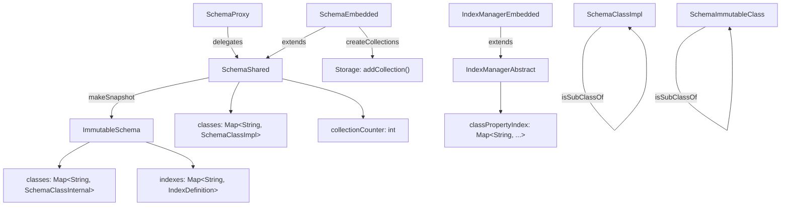

# Case-Sensitive Class and Index Names

## Design Document
[design.md](design.md)

## High-level plan

### Goals
Eliminate allocation pressure caused by pervasive `toLowerCase()` calls on
class and index name lookups. Both `SchemaShared` and `ImmutableSchema` (and
their callers) normalize every class/index name to lowercase before map
operations. This creates throwaway `String` objects on every lookup — a
measurable source of GC pressure on the hot path.

The fix: make class names and index names **case-sensitive** throughout the
schema and index layers. Store map keys using the original-case name as
provided at creation time. Remove all `toLowerCase()` / `equalsIgnoreCase()`
calls that exist solely for case-insensitive matching.

### Constraints
- **Backward compatibility (on-disk format)**: No migration needed. The
  on-disk schema records (`SchemaClassImpl.toStream()`) already store the
  original-case class name in the `"name"` property. Binary record
  serialization also preserves original case. The only place lowercase was
  enforced was in-memory map keys — the persistent format is already
  case-preserving.
- **Collection (cluster) names remain lowercase but need disambiguation**:
  `SchemaEmbedded.createCollections()` lowercases the class name to derive
  collection names. With case-sensitive class names, two classes like
  `Person` and `PERSON` would both derive `person`, colliding. A global
  schema-level index (monotonically increasing counter) must be appended to
  every collection name (e.g., `person_0`, `person_1`) to guarantee
  uniqueness. This counter is persisted in the schema record.
- **Internal class set**: The static `internalClasses` set in `SchemaShared`
  contains lowercase names (`"v"`, `"e"`, `"le"`). This set is only
  consulted during collection creation (already in a lowercase context) and
  does not affect class-name lookup. The set remains lowercase since the
  check happens after the class name is lowercased for collection naming.
- **Test impact**: Several tests explicitly rely on case-insensitive class
  lookup (e.g., `SchemaTest.checkSchema()` looks up `"Whiz"` as `"whiz"` and
  `"WHIZ"`). These must be updated to use the exact class name. Tests that
  assert specific collection names (e.g., `"person"`) must be updated to
  expect the new `<lowercase>_<index>` format.

### Architecture Notes

#### Component Map

- **SchemaShared** (`classes` map, `collectionCounter`): The primary mutable
  store for schema classes keyed by name. Currently all keys are lowercased
  via `toLowerCase(Locale.ENGLISH)`. Change: store keys using original case.
  ~11 `toLowerCase()` call sites. New `collectionCounter` field provides a
  monotonically increasing integer for unique collection name generation,
  persisted in the schema record via `toStream()`/`fromStream()`.
- **SchemaEmbedded** (extends SchemaShared): All create/drop/getOrCreate
  methods lowercase the class name before map operations. Change: use
  original case. ~10 call sites. `createCollections()` changes to always
  append the global counter to the lowercased class name
  (`<lowercase>_<counter>`).
- **ImmutableSchema** (`classes` map, `indexes` map): Immutable snapshot
  built from SchemaShared. Constructor lowercases class and index names for
  map keys. Lookup methods lowercase again. Change: store and look up by
  original case. ~6 call sites.
- **SchemaProxy**: `getOrCreateClass()` lowercases before delegating.
  Change: pass through as-is. 1 call site.
- **SchemaClassImpl / SchemaImmutableClass**: `isSubClassOf(String)` uses
  `equalsIgnoreCase()`. Change: use `equals()`. 2 call sites.
- **SchemaClassImpl**: `matchesType()` property validation uses
  `equalsIgnoreCase()`. Change: use `equals()`. 1 call site.
- **SchemaClassImpl** is abstract; the concrete mutable implementation is
  `SchemaClassEmbedded extends SchemaClassImpl`.
- **Additional `equalsIgnoreCase` call sites** outside the schema/index
  layer that compare class names and must switch to `equals()`:
  `CheckSafeDeleteStep` (compares with `"V"` / `"E"`),
  `DatabaseImport` (class drop ordering and `"ORestricted"` check),
  `VertexEntityImpl` (edge class detection).
- **IndexManagerAbstract** (`classPropertyIndex` map): Outer key is
  class name lowercased via `toLowerCase(Locale.ROOT)`. Change: use
  original case. ~4 call sites (`getIndexOnProperty`, both `toLowerCase`
  calls in `getClassIndex`, and `addIndexInternalNoLock`).
- **IndexManagerEmbedded**: Read/remove/re-insert into
  `classPropertyIndex` with lowercased class name. Change: use original
  case. ~3 call sites.

#### D1: Remove toLowerCase() rather than use case-insensitive map
- **Alternatives considered**: (a) Use `TreeMap` with
  `String.CASE_INSENSITIVE_ORDER` — keeps case-insensitive behavior but
  removes per-call allocation. (b) Remove all case normalization and use
  exact-match `HashMap`.
- **Rationale**: Option (b) chosen. Case-insensitive class names were
  inherited from OrientDB and provide no value — YouTrackDB is an internal
  database where class names are controlled. Removing normalization entirely
  is simpler, faster (`HashMap` O(1) vs `TreeMap` O(log n)), and eliminates
  a whole class of subtle bugs (e.g., locale mismatch between
  `Locale.ENGLISH` and `Locale.ROOT` in different code paths).
- **Risks/Caveats**: Any external code that relied on case-insensitive
  class lookup will break. Since YouTrackDB is used internally, this is
  acceptable.
- **Implemented in**: Track 1, Track 2

#### D2: Global collection counter for unique collection names
- **Alternatives considered**: (a) Keep current approach — try base
  lowercase name, fall back to `_1`, `_2` suffix on collision. (b) Always
  append a global schema counter to the lowercased class name.
- **Rationale**: Option (b). With case-sensitive class names, `Person` and
  `PERSON` both derive collection name `person`. The current collision
  fallback (`getNextAvailableCollectionName`) would handle this but relies
  on scanning existing names. A global counter is deterministic, avoids
  scanning, and produces stable names. The counter is a new `int` field in
  `SchemaShared`, persisted in the schema record as `"collectionCounter"`.
  `createCollections()` produces names like `person_0`, `person_1`, etc.
  Collection names remain lowercase.
- **Risks/Caveats**: Existing databases have collections named without the
  counter suffix (e.g., `person` not `person_0`). This is fine because
  `fromStream()` rebuilds the in-memory schema from the stored class-to-
  collection-ID mapping (integer-based, not name-based). Existing collection
  names are not renamed — only newly created classes get the counter suffix.
  For schemas created before this change (no `collectionCounter` property),
  the counter is initialized to `classes.size()`. For schemas with the
  property, the persisted value is used. Note: the old collision-fallback
  logic could produce `_1`, `_2` suffixed names that look like counter
  names. In practice, `classes.size()` is typically larger than any
  existing `_N` suffix, and `addCollection` would detect a duplicate name
  at the storage level, so collisions are unlikely.
- **Implemented in**: Track 1

#### D3: Keep internalClasses set lowercase
- **Alternatives considered**: (a) Update `internalClasses` to canonical
  case and compare against original class name. (b) Keep lowercase,
  compare against the already-lowercased collection-name string.
- **Rationale**: Option (b). The `internalClasses` set is only consulted
  in `createCollections()` after the class name has been lowercased for
  collection-name derivation. The set controls collection-creation policy
  (minimum collection count for internal classes), not class identity.
  Keeping it lowercase is consistent with collection naming.
- **Risks/Caveats**: None.
- **Implemented in**: Track 1

#### Invariants
- Map keys in `SchemaShared.classes` must exactly equal
  `SchemaClassImpl.getName()` (original case, no normalization).
- Collection names for newly created classes are always lowercase with a
  counter suffix (`<lowercase>_<counter>`).
- `collectionCounter` is monotonically increasing and never reused.

#### Integration Points
- **SQL parser** (`SQLCreateClassStatement`, `SQLAlterClassStatement`,
  `SelectExecutionPlanner`, `MatchExecutionPlanner`): These pass class
  names verbatim to schema methods. No changes needed — they already rely
  on the schema layer for normalization. After migration, SQL queries must
  use exact-case class names.
- **Gremlin integration** (`YTDBGraphImplAbstract`, `YTDBVertexImpl`,
  `YTDBGraphQueryBuilder`): Same — pass labels verbatim. No changes needed.
- **Binary serialization** (`RecordSerializerBinaryV1`): Already stores
  original-case names. On deserialization, calls `schema.getClass(className)`
  which will now require exact case match. Since the serialized name was
  obtained from `clazz.getName()` (original case), this is correct.
- **Security and metadata classes** (`SecurityShared`, `FunctionLibraryImpl`,
  `SequenceLibraryImpl`, `SchedulerImpl`): Use string constants for class
  names. No changes needed as long as constants match the schema.

#### Non-Goals
- Renaming existing collections in existing databases (existing collections
  keep their current names; only new classes get counter-suffixed names)
- Adding any migration or upgrade path for existing databases (not needed)
- Changing property name case handling
- Changing SQL keyword case handling (SQL keywords remain case-insensitive)
- Providing backward-compatible case-insensitive class name resolution

**Note — SQL behavioral change**: After this migration, SQL queries must
use exact-case class names (e.g., `SELECT FROM Person`, not
`SELECT FROM person` if the class was created as `Person`). SQL keywords
themselves remain case-insensitive. This is a user-facing behavioral change.

## Checklist

- [x] Track 1: Schema layer — case-sensitive class names + collection counter
  > Remove all `toLowerCase()` calls used for class-name map key
  > normalization in the schema layer. Add a global collection counter for
  > unique collection name generation.
  >
  > **Track episode:**
  > Removed all `toLowerCase()` / `equalsIgnoreCase()` class-name
  > normalization across the entire schema layer (SchemaShared, SchemaEmbedded,
  > ImmutableSchema, SchemaProxy, SchemaClassImpl, SchemaImmutableClass) and
  > adjacent code (CheckSafeDeleteStep, DatabaseImport, VertexEntityImpl).
  > Added global `collectionCounter` to SchemaShared for deterministic
  > collection naming (`<lowercase>_<counter>`), persisted via
  > toStream/fromStream. Key discovery: `renameCollection()` had a hidden
  > dependency on old naming convention and was rewritten. Legacy superclass
  > fallback (case-insensitive scan + warning) added to fromStream for
  > backward compat. Original 6-step decomposition collapsed to 3 steps
  > because schema API layers cannot be tested independently. No cross-track
  > impact — Track 2 and Track 3 proceed as planned.
  >
  > **Step file:** `tracks/track-1.md` (3 steps, 0 failed)
  >
  > **Strategy refresh:** ADJUST — Track 3 scope reduced because Track 1
  > Step 3 already fixed 15 core-module test files. Track 3 now covers only
  > remaining test fixes (tests module, HookReadTest, StorageBackupMTStateTest)
  > plus any tests broken by Track 2's index changes.

- [ ] Track 2: Index name and IndexManager — case-sensitive names
  > Remove `toLowerCase()` from index-name map keys in `ImmutableSchema` and
  > from class-name keys in the `classPropertyIndex` map in
  > `IndexManagerAbstract` / `IndexManagerEmbedded`.
  >
  > - **ImmutableSchema**: Constructor `indexes` map population
  >   (`indexName.toLowerCase(Locale.ROOT)` → `indexName`), `indexExists()`,
  >   and `getIndexDefinition()` — remove `toLowerCase()`.
  > - **IndexManagerAbstract**: `getIndexOnProperty()`,
  >   `getClassIndex()` (two `toLowerCase` calls — parameter and comparison),
  >   `addIndexInternalNoLock()` — remove
  >   `className.toLowerCase(Locale.ROOT)` from `classPropertyIndex` key
  >   operations. ~4 call sites total.
  > - **IndexManagerEmbedded**: `removeClassPropertyIndexInternal()` — remove
  >   `toLowerCase()` from get/remove/put on `classPropertyIndex`.
  > - **Additional `equalsIgnoreCase` call sites** (index/class-name
  >   comparisons in the index layer): `Index` and `IndexManagerEmbedded`
  >   security-filtered property checks, `DatabaseImport` index-name
  >   comparison — switch to `equals()`.
  >
  > **Depends on:** Track 1 (class names must already be case-sensitive so
  > that `indexDefinition.getClassName()` returns the canonical-case name
  > used as map key).
  >
  > **Scope:** ~3 steps covering ImmutableSchema index changes,
  > IndexManagerAbstract/Embedded changes, and verification

- [ ] Track 3: Test fixes
  > Update all tests that rely on case-insensitive class or index name
  > lookup behavior. Known tests:
  >
  > - **`SchemaTest.checkSchema()`** (`tests` module): Looks up `"Whiz"` as
  >   `"whiz"` and `"WHIZ"` — must use exact name `"Whiz"`.
  > - **`IndexCollectionEmptinessCheckTest`** (`core` module): Expects
  >   collection name derived from `className.toLowerCase()` — must be
  >   updated to expect the new `<lowercase>_<counter>` format.
  > - **`HookReadTest`** (`core` module): Uses `equalsIgnoreCase` for class
  >   name comparison — change to `equals`.
  > - **`StorageBackupMTStateTest`** (`core` module): Uses
  >   `equalsIgnoreCase` for class name comparison — change to `equals`.
  > - Additional tests discovered during execution that break due to
  >   case-mismatch lookups.
  > - **Deferred from Track 2 code review (TC2):** Add tests for
  >   `isAllClasses()` guard in `Index.isLabelSecurityDefined` and
  >   `IndexManagerEmbedded.checkSecurityConstraintsForIndexCreate` — verify
  >   wildcard column-security rules work with the new `equals()` filter.
  > - **Deferred from Track 2 code review (TC3):** Add test for
  >   `DatabaseImport.importIndexes()` `equals` check on
  >   `EXPORT_IMPORT_INDEX_NAME`.
  > - **Deferred from Track 2 code review (TC4):** Add index name
  >   preservation test across session reload (create → persist → reload →
  >   case-sensitive lookup).
  >
  > **Depends on:** Track 1, Track 2
  >
  > **Scope:** ~3-5 steps covering known test fixes, discovery of additional
  > broken tests via test run, fixing remaining failures, and deferred test
  > scenarios from Track 2 code review

## Final Design Document
- [ ] Phase 4: Final design document (`design-final.md`)
