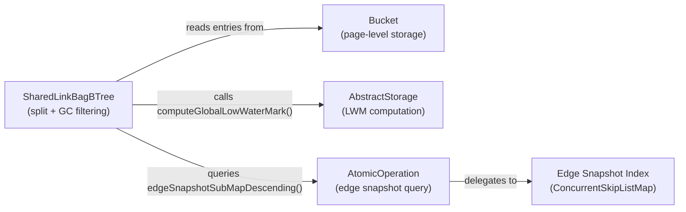

# Edge Tombstone GC During Page Split

## High-level plan

### Goals

Garbage-collect tombstone entries from `SharedLinkBagBTree` during leaf page
splits. Tombstones are created by cross-transaction edge deletions and
accumulate indefinitely in the B-tree today. By filtering them out during
splits — when entries are already being redistributed — we reclaim space
with minimal overhead and without a separate background GC sweep.

A tombstone is safe to remove when:
1. Its timestamp is below the global low-water mark (LWM), meaning all
   active transactions can already see the deletion.
2. No entries exist in the edge snapshot index for the same logical edge
   (same `componentId`, `ridBagId`, `targetCollection`, `targetPosition`),
   meaning no active reader can resurrect an older live version.

Both conditions are required. Condition 2 guards against ghost edge
resurrection: if a stale snapshot entry lingers (snapshot cleanup is lazy
and threshold-based), removing the tombstone without checking would let
a reader fall through to the snapshot index and find an old live version.

### Constraints

- **Performance**: Page splits are on the write hot path. The GC check
  must be cheap. Deserializing key+value for each entry adds cost, but
  the split already iterates all entries and copies raw bytes — the
  additional deserialization is bounded by bucket size (~hundreds of
  entries at most per 8 KB page).
- **Snapshot query cost**: Checking the edge snapshot index requires a
  range query per tombstone. This is a `ConcurrentSkipListMap.subMap()`
  call — O(log n) per tombstone, acceptable during split.
- **LWM computation**: Computing the global LWM iterates all
  `TsMinHolder` instances (one per thread with active transactions).
  This is already done by the existing snapshot cleanup and is cheap.
  We compute it once per split, not per entry.
- **Atomicity**: Tombstone removal during split must be atomic with the
  split itself — both happen within the same `AtomicOperation`. The tree
  size counter must be adjusted for removed tombstones.
- **Non-leaf nodes**: Only leaf buckets contain tombstones. Internal
  (non-leaf) nodes store separator keys without values. Filtering applies
  only to leaf splits.
- **Separator key validity**: If a split is still needed after filtering,
  the midpoint and separation key are computed from the surviving entries.
- **WAL correctness**: No new WAL record types are needed. The filtered
  entries simply don't appear in the new pages written by the split.
  Crash recovery replays the split as-is.

### Architecture Notes

#### Component Map

- **SharedLinkBagBTree**: Modified to filter removable tombstones during
  `splitBucket()`. Computes LWM once per split via the `storage` reference
  inherited from `DurableComponent` (parent class). Queries snapshot index
  via `AtomicOperation` for each tombstone candidate.
- **Bucket**: Unchanged. Entries are filtered before being passed to
  `addAll()` on the new bucket.
- **AbstractStorage**: Already exposes `computeGlobalLowWaterMark()`.
  No changes needed.
- **AtomicOperation** (interface): Already exposes
  `edgeSnapshotSubMapDescending()`. No changes needed.
- **Edge Snapshot Index**: Read-only during GC check. Not modified by
  the split.

#### D1: GC during split vs. separate background sweep

- **Alternatives considered**:
  1. Background sweep: periodic scan of all leaf pages to remove stale
     tombstones. Requires full tree traversal, extra I/O, and a separate
     locking protocol.
  2. GC during split (chosen): piggyback on the split's entry
     redistribution. Zero extra I/O — entries are already being copied.
  3. GC during reads: check and remove on read. Violates read-only
     semantics and adds write contention to reads.
- **Rationale**: Splits already iterate and copy all entries. Filtering
  during this redistribution adds minimal overhead (one LWM computation +
  one snapshot query per tombstone) while avoiding a separate sweep
  infrastructure. Tombstones accumulate in hot pages (pages that receive
  writes and thus split), so split-time GC naturally targets the right
  pages.
- **Risks/Caveats**: Tombstones in pages that never split again will
  never be collected. This is acceptable — such pages are cold and the
  space waste is bounded. A future background sweep can address this if
  needed.
- **Implemented in**: Track 1

#### D2: Filter-rebuild-retry before splitting

- **Alternatives considered**:
  1. Filter during entry collection for split: skip tombstones when
     building left/right entry lists, always proceed with the split on
     the filtered entries.
  2. Filter-rebuild-retry (chosen): collect surviving entries, rebuild
     the bucket without tombstones, then retry the insert. Only proceed
     with the split if the insert still fails (bucket still full).
- **Rationale**: If tombstone removal frees enough space, the insert
  succeeds without splitting at all — avoiding an unnecessary split that
  would create two under-filled buckets. The rebuild uses the existing
  `shrink(0, serializerFactory)` + `addAll()` pattern. The retry is the same `addLeafEntry()`
  call the caller already makes. This naturally handles every case:
  all entries removed (empty bucket, insert trivially succeeds), some
  removed (may or may not need split), none removed (normal split).
- **Risks/Caveats**: The rebuild adds one extra page write when
  tombstones are found but the insert still fails. This is negligible
  compared to the split's own page writes.
- **Implemented in**: Track 1

#### D3: LWM computation strategy — once per split

- **Alternatives considered**:
  1. Cache LWM globally with periodic refresh.
  2. Compute per tombstone entry.
  3. Compute once per split invocation (chosen).
- **Rationale**: LWM computation iterates `TsMinHolder` instances (one
  per thread with active transactions — typically <100). This is cheap
  but not free. Computing once per split amortizes the cost across all
  tombstone checks in that split.
- **Risks/Caveats**: The LWM may advance between computation and use.
  This is safe — using a stale (lower) LWM is conservative: we may skip
  some eligible tombstones but never remove one prematurely.
- **Implemented in**: Track 1

#### Invariants

- **No ghost resurrection**: After tombstone removal, `findVisibleEntry()`
  must never return a live entry for an edge that was deleted. This
  requires that no snapshot entries exist for the edge.
- **Tree size consistency**: The entry point's `treeSize` must equal the
  actual number of leaf entries. Tombstone removal must decrement the
  counter.
- **Split correctness**: After a filtered split, every surviving entry
  in the left bucket must have a key < separation key, and every entry
  in the right bucket must have a key >= separation key.
- **No unnecessary splits**: If tombstone removal frees enough space
  for the insert, no split occurs — the tree depth and bucket count
  remain unchanged. This naturally handles all cases including
  all-tombstone buckets (empty → insert succeeds).

#### Integration Points

- **`splitBucket()`**: Entry point for the GC logic. The filtering
  happens inside the existing split method before entries are
  distributed to left/right buckets.
- **`storage.computeGlobalLowWaterMark()`**: Existing method on
  `AbstractStorage`, already used by snapshot cleanup.
- **`atomicOperation.edgeSnapshotSubMapDescending()`**: Existing method
  on `AtomicOperation`, already used by `findVisibleSnapshotEntry()`.
- **`updateSize()`**: Existing method to adjust tree size counter.

#### Non-Goals

- Background sweep of cold pages (tombstones in pages that never split).
- GC of non-tombstone stale versions (these go to the snapshot index
  and are already cleaned by `evictStaleEdgeSnapshotEntries()`).
- Compaction or defragmentation of pages after tombstone removal.

## Checklist

- [x] Track 1: Tombstone filtering during leaf page split
  > Implement GC of removable tombstones during leaf page splits in
  > `SharedLinkBagBTree`. The approach is filter-rebuild-retry: when a
  > leaf bucket overflows, filter out removable tombstones, rebuild the
  > bucket with surviving entries, and retry the insert. Only if the
  > insert still fails does the normal split proceed (on the already-
  > filtered entries). Tree size is decremented for each removed tombstone.
  >
  > **What**:
  > - Add a `hasEdgeSnapshotEntries()` helper that queries the atomic
  >   operation's edge snapshot index for a given logical edge.
  > - Add an `isRemovableTombstone()` method that checks: tombstone flag,
  >   ts < LWM, and no snapshot entries.
  > - Add a `filterAndRebuildBucket()` method that iterates all entries
  >   in a leaf bucket, collects survivors (skipping removable tombstones),
  >   rebuilds the bucket via `shrink(0, serializerFactory)` + `addAll(survivors)`, and
  >   returns the count of removed tombstones.
  > - Modify the split call site in `put()` (the `while (!addLeafEntry)`
  >   loop): before calling `splitBucket()`, attempt tombstone filtering.
  >   If any tombstones were removed, retry the insert via `continue`
  >   (re-evaluates the loop condition, which calls `addLeafEntry()` on
  >   the filtered bucket). If the retry succeeds, the loop exits
  >   naturally. If it fails, the next iteration proceeds with normal
  >   `splitBucket()` (gcAttempted flag prevents re-filtering).
  > - Decrement tree size for each removed tombstone.
  >
  > **Constraints**:
  > - LWM computed once per GC attempt via
  >   `storage.computeGlobalLowWaterMark()`.
  > - Snapshot query via `atomicOperation.edgeSnapshotSubMapDescending()`
  >   — same pattern as `findVisibleSnapshotEntry()`.
  > - Only leaf buckets are filtered (non-leaf nodes have no tombstones).
  > - GC attempt happens at most once per insert — a flag prevents
  >   repeated filtering if the insert still overflows after GC.
  > - WAL: no new record types; filtered entries simply don't appear in
  >   the rebuilt page.
  >
  > **Scope:** ~4-5 steps covering helper methods, filter-rebuild-retry
  > logic, tree size adjustment, and formatting
  >
  > **Track episode:**
  > Implemented filter-rebuild-retry tombstone GC in both `put()` and
  > `remove()` paths of `SharedLinkBagBTree`. Three helper methods added:
  > `hasEdgeSnapshotEntries()`, `isRemovableTombstone()`,
  > `filterAndRebuildBucket()`. GC runs at most once per insert via
  > `gcAttempted` flag. 3 planned steps combined into 1 implementation
  > commit (helpers are private, untestable in isolation). 15+ tests
  > cover basic GC, snapshot preservation, ghost resurrection prevention,
  > tree size consistency, LWM boundary conditions, mixed scenarios, and
  > edge cases. No cross-track impact — Track 2 and Track 3 can proceed
  > as planned.
  >
  > **Step file:** `tracks/track-1.md` (3 steps, 0 failed)

- [ ] Track 2: Tests for edge tombstone GC during split
  > Comprehensive tests verifying tombstone GC correctness during page
  > splits. Tests must cover: basic tombstone removal, snapshot entry
  > preservation, ghost resurrection prevention, tree size consistency,
  > and mixed tombstone/live entry scenarios.
  >
  > **What**:
  > - Test that tombstones below LWM with no snapshot entries are removed
  >   during split.
  > - Test that tombstones below LWM WITH snapshot entries are preserved
  >   (no ghost resurrection).
  > - Test that tombstones above LWM are preserved (active transaction
  >   might need them).
  > - Test tree size consistency after splits with tombstone removal.
  > - Test that `findVisibleEntry()` returns correct results after
  >   tombstone GC (no ghost resurrection for any snapshot state).
  > - Test mixed scenarios: bucket with both live entries and tombstones,
  >   some removable and some not.
  > - Test edge case: bucket where all entries are removable tombstones.
  >
  > **Constraints**:
  > - Tests should use the existing test infrastructure pattern from
  >   `SharedLinkBagBTreePutSITest` / `SharedLinkBagBTreeRemoveSITest`.
  > - Must force page splits by inserting enough entries to overflow
  >   bucket capacity.
  > - Must control LWM by manipulating `TsMinHolder` state. The existing
  >   SI test classes (`SharedLinkBagBTreePutSITest`, etc.) already
  >   demonstrate `TsMinHolder` manipulation for snapshot isolation
  >   testing — follow the same pattern.
  > - Must verify both B-tree state and snapshot index state after GC.
  >
  > **Scope:** ~4-5 steps covering unit tests for helpers, split GC
  > integration tests, visibility correctness tests, and edge cases
  > **Depends on:** Track 1

- [ ] Track 3: Concurrent and crash-recovery tests for tombstone GC
  > Robustness tests verifying tombstone GC correctness under concurrent
  > access and after crash/recovery scenarios.
  >
  > **What**:
  > - **Concurrent GC tests (TX1/TX2)**: Multiple threads performing
  >   concurrent `put()` and `remove()` operations on the same
  >   `SharedLinkBagBTree` while tombstone GC is active. Verify that
  >   concurrent GC-triggering splits don't corrupt the tree (no lost
  >   entries, no duplicate entries, tree size consistent with actual
  >   content). Test concurrent writers where some threads insert live
  >   entries and others insert cross-tx tombstones, both triggering GC.
  > - **Crash recovery test (TY1)**: Simulate crash during or after
  >   tombstone GC by writing entries that trigger GC, then performing
  >   WAL replay/recovery. Verify that the recovered B-tree state is
  >   consistent: tree size matches actual entries, no ghost resurrection,
  >   surviving entries are intact. Use the existing crash-recovery test
  >   infrastructure (atomic operation commit + storage reopen pattern).
  >
  > **Constraints**:
  > - Concurrent tests should use `ConcurrentTestHelper` or similar
  >   multi-threaded test patterns from the codebase.
  > - Crash recovery test should follow the pattern of existing WAL
  >   recovery tests — commit an atomic operation containing GC'd splits,
  >   close storage uncleanly, reopen, and verify state.
  > - Must verify tree invariants (size, ordering, no duplicates) after
  >   concurrent operations complete.
  >
  > **Scope:** ~2-3 steps covering concurrent GC stress tests and
  > crash-recovery verification
  > **Depends on:** Track 1
