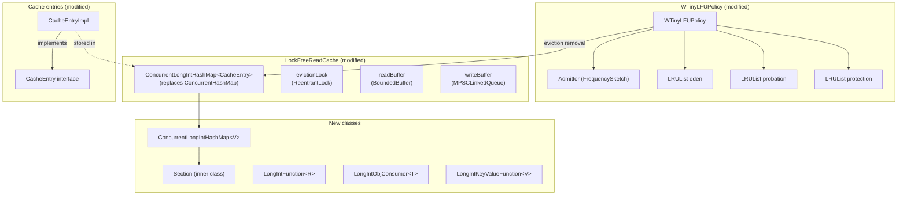

# Primitive CHM Cache — Replace ConcurrentHashMap with Open-Addressing Primitive Map

## High-level plan

### Goals

Replace `ConcurrentHashMap<PageKey, CacheEntry>` in `LockFreeReadCache` with a custom
open-addressing concurrent hash map (`ConcurrentLongIntHashMap`) that stores
`(long fileId, int pageIndex)` inline in parallel arrays. This achieves:

1. **Zero per-access allocation**: eliminates transient `PageKey` objects on the hot
   read path (`doLoad()`), reducing young-generation GC pressure under sustained workloads.
2. **~80% reduction in per-entry memory overhead**: from ~96 bytes (CHM Node + PageKey +
   amortized table slot) to ~20 bytes (3 array slots), saving ~38 MB at full cache
   capacity (524K entries with 4 GB / 8 KB pages).
3. **O(segment-capacity) bulk file removal**: `clearFile()` becomes a linear sweep per
   segment instead of O(filledUpTo) individual allocations + hash probes, eliminating
   the most expensive path called on every file close, truncate, and delete.
4. **Improved CPU cache behavior**: linear array access replaces pointer-chasing through
   Node and PageKey objects, benefiting hardware prefetcher on the probe loop.

### Constraints

- **Apache 2.0 license compatibility**: the fork is from Apache BookKeeper
  (`ConcurrentLongHashMap`), which is Apache 2.0 — compatible with our license.
  Must preserve attribution in file headers.
- **Concurrency correctness**: BookKeeper's `ConcurrentLongHashMap` had known
  concurrency bugs (BOOKKEEPER-4317). The adaptation introduces a second key field,
  adding another dimension to the probe logic. Thorough concurrent stress testing
  is mandatory.
- **No behavioral change to eviction policy**: `WTinyLFUPolicy` must continue to
  function identically — same admission decisions, same LRU ordering, same
  eviction callbacks. Only the data structure backing its map reference changes.
- **`compute()` as virtual lock**: `releaseFromWrite()` uses `data.compute()` purely
  for its segment-locking side-effect (atomically storing to write cache). The new
  map must support a `compute()` operation that holds the segment write lock while
  the remapping function executes, even when the key is absent.
- **Key 0 / pageIndex 0 are valid**: unlike BookKeeper's original where key `0L` is
  the empty sentinel, our map must handle `fileId=0` and `pageIndex=0` as valid keys.
  Emptiness is determined by the value slot (null), not the key slots.
- **Existing test suite must pass unchanged**: the map replacement is an internal
  implementation detail. All `LockFreeReadCache` tests, `WTinyLFUPolicy` tests,
  batching tests, and integration tests must pass without modification.
- **Thread safety model**: `get()` must remain lock-free on the fast path (optimistic
  stamp read). `compute()`/`put()` use segment write locks. Segment count is
  configurable (default 16).

### Architecture Notes

#### Component Map

- **ConcurrentLongIntHashMap** (new): open-addressing segmented hash map with
  `(long fileId, int pageIndex)` composite key stored in parallel `long[]` and
  `int[]` arrays. Forked from BookKeeper's `ConcurrentLongHashMap` and adapted
  for two-field keys. Lives in `core/.../internal/common/collection/`.
- **Section** (new, inner class): extends `StampedLock`, holds per-segment arrays
  (`long[] fileIds`, `int[] pageIndices`, `V[] values`), manages probing, resize,
  and tombstone cleanup.
- **LongIntFunction** (new): `R apply(long fileId, int pageIndex)` — avoids boxing
  for `computeIfAbsent` mapping function.
- **LongIntObjConsumer** (new): `void accept(long fileId, int pageIndex, V value)` —
  avoids boxing for `forEach` iteration.
- **LongIntKeyValueFunction** (new): `V apply(long fileId, int pageIndex, V currentValue)` —
  remapping function for `compute()`.
- **LockFreeReadCache** (modified): `data` field type changes from
  `ConcurrentHashMap<PageKey, CacheEntry>` to `ConcurrentLongIntHashMap<CacheEntry>`.
  All `new PageKey(...)` allocations in `doLoad()`, `silentLoadForRead()`, `clearFile()`
  are eliminated. `clearFile()` calls `removeByFileId()`.
- **WTinyLFUPolicy** (modified): constructor and eviction methods updated to use
  `ConcurrentLongIntHashMap` API. `data.remove(victim.getPageKey(), victim)` becomes
  `data.remove(victim.getFileId(), victim.getPageIndex(), victim)`.
- **CacheEntryImpl** (modified): stores `long fileId` and `int pageIndex` directly
  instead of a `PageKey` field. Eliminates one object allocation per entry creation.
- **CacheEntry interface** (modified): `getPageKey()` removed; callers already have
  `getFileId()` and `getPageIndex()`.
- **PageKey** (removed): `chm.PageKey` record is deleted. The `local.PageKey` class
  used by `WOWCache` is unaffected (different package, different field types).

#### D1: Fork BookKeeper's ConcurrentLongHashMap as the base

- **Alternatives considered**:
  - JCTools `NonBlockingHashMapLong` (lock-free, Cliff Click design) — single `long`
    key only, no composite key support without boxing/combining into a single long
    (lossy for `long fileId + int pageIndex`).
  - Eclipse Collections `LongObjectHashMap` — not concurrent.
  - Build from scratch — higher risk, no battle-tested probe/resize logic.
  - Inline fileId+pageIndex into a single `long` key (`(fileId << 32) | pageIndex`) —
    lossy since `fileId` is `long` (upper 32 bits lost).
- **Rationale**: BookKeeper's design is well-matched: segmented open-addressing with
  StampedLock, optimistic reads, ~740 LOC, Apache 2.0 licensed. The adaptation to a
  composite key is mechanical — add a second key array and extend the probe/hash logic.
  The existing probe/resize/tombstone logic has been production-hardened in BookKeeper.
- **Risks/Caveats**: BookKeeper had concurrency bugs (BOOKKEEPER-4317 — race in
  rehash + get). Review the fork carefully and add targeted concurrent stress tests.
  The two-field key adds one more array read per probe step.
- **Implemented in**: Track 1

#### D2: Use null value slot (not key slots) to determine emptiness

- **Alternatives considered**:
  - Use sentinel key values (e.g., `fileId = Long.MIN_VALUE`) to mark empty slots,
    matching BookKeeper's original approach.
  - Use a separate `boolean[] occupied` array.
- **Rationale**: `fileId=0` and `pageIndex=0` are valid keys in YouTrackDB (file IDs
  start at 0). BookKeeper's original uses key `0L` as empty sentinel, which would
  break here. Checking the value slot for null (same as BookKeeper's `EmptyValue`)
  is safe because null values are disallowed. This avoids adding a sentinel scheme
  or an extra array.
- **Risks/Caveats**: Must ensure all probe loops check `values[idx] == null` for
  emptiness, never `keys[idx] == 0`. BookKeeper already does this (it checks
  `values[bucket]`), so the adaptation is natural.
- **Implemented in**: Track 1

#### D3: Eliminate PageKey from CacheEntry interface

- **Alternatives considered**:
  - Keep `getPageKey()` and return a lazily-constructed PageKey for backward
    compatibility.
  - Store fileId/pageIndex directly but keep PageKey as a convenience wrapper.
- **Rationale**: `getPageKey()` is called at 2 sites in `LockFreeReadCache` and
  9 sites in `WTinyLFUPolicy` (4 hash-based, 2 map-removal, 3 assertion lookups).
  `CacheEntryChanges` has one delegation site. All callers ultimately need
  `getFileId()` and `getPageIndex()`, which are already on the `CacheEntry`
  interface. Removing `getPageKey()` is cleaner than maintaining a wrapper.
- **Risks/Caveats**: This is a breaking change to the `CacheEntry` internal
  interface. All usages must be updated in the same commit. `chm.PageKey` is
  deleted; `local.PageKey` (used by WOWCache) is unaffected.
- **Implemented in**: Track 2

#### D4: Bulk removeByFileId via linear segment sweep

- **Alternatives considered**:
  - Keep per-page removal loop but without PageKey allocation (pass primitives
    directly to `remove(fileId, pageIndex)`).
  - Maintain a secondary index (fileId -> set of pageIndices) for O(1) lookup.
- **Rationale**: Per-page removal still does O(filledUpTo) hash probes, most of
  which are misses (the file may have 100K total pages but only 1K in cache).
  A linear sweep over the segment arrays is O(segmentCapacity) with excellent
  cache locality (sequential array reads). At 524K total entries / 16 segments,
  each segment sweep touches ~50K slots — fast with hardware prefetch.
  A secondary index adds memory and complexity for marginal benefit.
- **Risks/Caveats**: The sweep touches all slots in each segment, not just those
  belonging to the target fileId. For very small files, per-page removal might be
  faster. In practice, `clearFile()` is called on file close/truncate/delete —
  not a latency-sensitive path — and the elimination of 100K+ allocations more
  than compensates.
- **Implemented in**: Track 1 (map method), Track 2 (integration into clearFile)

#### D5: Frequency sketch keying after PageKey removal

- **Alternatives considered**:
  - Use `Objects.hash(fileId, pageIndex)` (boxed).
  - Use the murmur hash from the map itself (64-bit, truncated to int).
  - Compute a separate lightweight int hash.
- **Rationale**: The frequency sketch (`Admittor.increment/frequency`) takes an
  `int` hash. Currently it uses `PageKey.hashCode()` — the record's
  auto-generated `hashCode()` (functionally equivalent to
  `Objects.hash(fileId, pageIndex)`). After removing PageKey, we need a
  consistent int hash. We can expose a static `hash(long fileId, int pageIndex)`
  method on `ConcurrentLongIntHashMap` that returns an int-range hash, or compute
  it inline. Using the same hash function as the map (truncated to int) ensures
  consistency and avoids a separate hash path.
- **Risks/Caveats**: The frequency sketch uses the hash for approximate frequency
  counting. Minor hash distribution changes may slightly alter admission decisions,
  but TinyLFU is designed to be robust to hash quality. No functional impact.
- **Implemented in**: Track 2

#### Invariants

- **No allocation on read hit path**: `get(long fileId, int pageIndex)` must not
  allocate any objects. The optimistic read path (stamp + array reads + validate)
  must be allocation-free. (Verified by code inspection: no `new` expressions, no
  autoboxing, no iterator creation on the optimistic read path.)
- **removeByFileId atomicity per segment**: each segment's sweep holds the segment
  write lock for its duration. Cross-segment removal is not atomic, but this
  matches the current behavior (individual `CHM.remove()` calls are not collectively
  atomic).
- **Tombstone bounds**: after `removeByFileId`, tombstone cleanup must run to prevent
  unbounded tombstone accumulation. The backward-sweep cleanup from BookKeeper's
  design handles this.
- **Eviction policy consistency**: after any map mutation (put, remove, removeByFileId),
  the WTinyLFU policy's LRU lists must be updated under the eviction lock. The
  existing `afterAdd/afterRead/onRemove` protocol is preserved.

#### Integration Points

- **LockFreeReadCache.data**: the single field replacement that drives all changes.
  All map operations flow through this field.
- **WTinyLFUPolicy constructor**: changes from
  `WTinyLFUPolicy(ConcurrentHashMap<PageKey, CacheEntry>, ...)` to
  `WTinyLFUPolicy(ConcurrentLongIntHashMap<CacheEntry>, ...)`.
- **WTinyLFUPolicy.purgeEden()**: eviction removal changes from
  `data.remove(victim.getPageKey(), victim)` to
  `data.remove(victim.getFileId(), victim.getPageIndex(), victim)`.
- **CacheEntry interface**: `getPageKey()` is removed; `getFileId()` and
  `getPageIndex()` remain.
- **CacheEntryChanges**: delegates to `CacheEntry`; `getPageKey()` delegation removed.
- **Admittor/FrequencySketch**: keying changes from `cacheEntry.getPageKey().hashCode()`
  to a static hash utility method. This affects both `onAccess`/`onAdd` increment
  calls and `purgeEden()` frequency comparison calls
  (`candidate.getPageKey().hashCode()`, `victim.getPageKey().hashCode()`).

#### Non-Goals

- **Replacing PageKey in WOWCache**: `local.PageKey` (used by `WOWCache`,
  `dirtyPages`, `exclusiveWritePages`, `lockManager`) is a completely separate class
  in a different package with different field types (`int fileId, long pageIndex`).
  It is out of scope.
- **Lock-free writes**: the map uses StampedLock write locks per segment, matching
  BookKeeper's design. A fully lock-free map (Cliff Click style) is significantly
  more complex and not necessary for this use case.
- **Auto-shrink by default**: shrinking is available but disabled by default (matching
  BookKeeper). The cache has a stable working set size; shrinking adds complexity
  without clear benefit.
- **Changing the eviction algorithm**: WTinyLFU is retained as-is. Only the backing
  map changes.

## Checklist

- [x] Track 1: ConcurrentLongIntHashMap — Core Data Structure
  > Implement the open-addressing concurrent hash map with composite
  > `(long fileId, int pageIndex)` key, forked from BookKeeper's
  > `ConcurrentLongHashMap`.
  >
  > **Track episode:**
  > Delivered `ConcurrentLongIntHashMap<V>` — segmented open-addressing
  > concurrent hash map with composite `(long fileId, int pageIndex)` keys,
  > 91 unit tests. Key deviations: Section uses composition (has-a StampedLock)
  > not inheritance; removeByFileId uses unconditional same-capacity rehash
  > (simpler than planned conditional tombstone threshold); probe loop and
  > rehash duplication extracted into shared helpers. hashForFrequencySketch
  > deferred to Track 2 as planned. No cross-track impact — standalone data
  > structure consumed by Track 2.
  >
  > **Step file:** `tracks/track-1.md` (5 steps, 0 failed)
  >
  > **Strategy refresh:** CONTINUE — no downstream impact detected.

- [x] Track 2: Integration into LockFreeReadCache and WTinyLFUPolicy
  > Replace `ConcurrentHashMap<PageKey, CacheEntry>` with
  > `ConcurrentLongIntHashMap<CacheEntry>` in `LockFreeReadCache` and update
  > all dependent code.
  >
  > **Track episode:**
  > Replaced `ConcurrentHashMap<PageKey, CacheEntry>` with
  > `ConcurrentLongIntHashMap<CacheEntry>` in `LockFreeReadCache` and
  > `WTinyLFUPolicy`, eliminating all `PageKey` allocations on the hot read
  > path. Key discoveries: (1) `N_CPU << 1` is not guaranteed power-of-two —
  > fixed by wrapping with `ceilingPowerOfTwo()` (plan incorrectly stated map
  > constructor aligns section count internally); (2) removing `filledUpTo`
  > parameter from `clearFile()` was a natural consequence of
  > `removeByFileId()` — simplified `deleteStorage`/`closeStorage` callers.
  > No cross-track impact — Track 3 (stress tests) can proceed as planned
  > against the integrated system.
  >
  > **Step file:** `tracks/track-2.md` (4 steps, 0 failed)
  >
  > **Depends on:** Track 1

- [ ] Track 3: Concurrent Stress Testing
  > Validate concurrency correctness of the full integrated system under
  > realistic contention patterns.
  >
  > **What**: Multi-threaded stress tests that exercise the
  > `ConcurrentLongIntHashMap` and `LockFreeReadCache` under concurrent
  > read/write/remove/removeByFileId workloads to catch races, deadlocks,
  > and data corruption.
  >
  > **How**:
  > - **Map-level concurrent tests**: multiple threads performing interleaved
  >   `get/put/remove/computeIfAbsent` on overlapping keys, verifying that
  >   no entries are lost or duplicated. Include a specific test for concurrent
  >   `removeByFileId` + `get/put` on the same and different files.
  > - **clearFile under concurrent load**: simulate file close while other
  >   threads are reading/writing pages from the same and different files.
  >   Verify that all pages for the closed file are removed, no pages from
  >   other files are affected, and no deadlock occurs.
  > - **Optimistic read validation**: stress the optimistic-read-to-read-lock
  >   fallback path by running high-frequency writes alongside reads, verifying
  >   that get() never returns stale or corrupt data.
  > - **Rehash under concurrent access**: trigger rehash (via many inserts) while
  >   other threads read and remove, verifying correctness through the resize.
  >
  > **Constraints**:
  > - Tests must be deterministic enough to reproduce failures (use
  >   `ConcurrentTestHelper` from test-commons, controlled thread counts)
  > - Run with `-ea` (assertions enabled) so map and policy invariants are
  >   checked during stress runs
  > - Tests should run in reasonable time (<30s each) for CI
  > - Map-level tests go in `core/src/test/java/.../internal/common/collection/`
  > - Integrated cache-level tests go in
  >   `core/src/test/java/.../internal/core/storage/cache/chm/`
  >
  > **Interactions**: depends on Track 1 for the map class and Track 2 for the
  > integrated `LockFreeReadCache` with the new map.
  >
  > **Scope:** ~3 steps covering map-level concurrent correctness tests,
  > removeByFileId + concurrent access tests, integrated clearFile stress test
  >
  > **Depends on:** Track 1, Track 2
