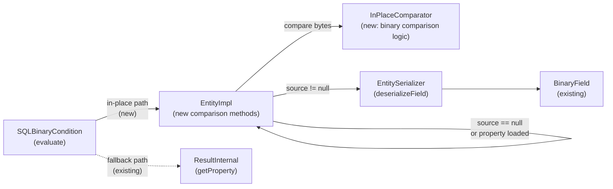

# In-Place Property Comparison for SQL WHERE Clauses

## Design Document
[design.md](design.md)

## High-level plan

### Goals

Avoid property deserialization overhead during SQL WHERE clause evaluation
(SELECT and MATCH queries) by comparing property values in-place — either
against the already-deserialized Java object in the `properties` map, or
directly against the serialized bytes in the `source` buffer.

This targets the hot path in `SQLBinaryCondition.evaluate()`, which currently
always calls `Entity.getProperty()` (triggering full deserialization) before
any comparison. The optimization applies to simple comparisons of the form
`property <op> constant` where `<op>` is `=`, `<>`, `!=`, `<`, `>`, `<=`, `>=`.

### Constraints

- **Pure read-only on serialized bytes.** The comparison must not trigger
  deserialization or modify `source`. The `properties` map and `source`
  buffer remain untouched after comparison.
- **Fallback required.** If the property type is not binary-comparable
  (collections, embedded, etc.), or if type conversion fails, fall back to
  the existing deserialization path transparently.
- **Single header scan per property.** For v1, each in-place comparison
  scans the serialized record header to locate the field. Multi-property
  optimization is out of scope.
- **Cross-type numeric support.** The passed-in Java value is converted to
  the serialized property's type before same-type binary comparison. This
  covers common cases like INTEGER property vs LONG literal.
- **Generated code.** `SQLBinaryCondition.java` is JavaCC-generated but
  already has hand-written methods. Modifications must preserve the JavaCC
  checksum comment and not break regeneration.
- **No collation support in v1.** Collated string comparisons fall back to
  the deserialization path. This can be added in a follow-up.

### Architecture Notes

#### Component Map

- **SQLBinaryCondition** — Hook point. `evaluate(Result, CommandContext)` is
  modified to detect simple `property <op> constant` patterns and delegate
  to EntityImpl's new comparison methods before falling back to the existing
  `left.execute()` / `right.execute()` path.
- **EntityImpl** — Gets new public methods `isPropertyEqualTo(name, value)`
  and `comparePropertyTo(name, value)`. These check the `properties` map
  directly (via `properties.get(name)`, not `checkForProperties()`) first,
  navigating `EntityEntry` indirection (`exists()`, null value handling),
  then fall back to serialized comparison via `source`. The `source` field
  is inherited from `RecordAbstract`.
- **InPlaceComparator** — New utility class with static methods for
  same-type binary comparison. Reads values directly from `BytesContainer`
  without allocation. Handles type conversion of the passed-in Java value.
- **EntitySerializer / RecordSerializerBinaryV1** — Existing
  `deserializeField()` method locates a field in serialized bytes and returns
  a `BinaryField` (type + raw bytes pointer). Used as-is.
- **ResultInternal** — Existing `getProperty()` path. Used as fallback when
  in-place comparison is not applicable.
- **BinaryField** — Existing class. Holds field name, type, and a
  `BytesContainer` pointing at the raw serialized value bytes.

#### D1: Comparison methods on EntityImpl, not on ResultInternal or operator level
- **Alternatives considered**: (a) Add methods to `ResultInternal`; (b) Add
  binary evaluation to `SQLBinaryCompareOperator`; (c) Intercept in
  `SQLSuffixIdentifier.execute()`.
- **Rationale**: EntityImpl owns both the `properties` map and the `source`
  buffer. It is the natural place to decide "deserialized or serialized?"
  and dispatch accordingly. ResultInternal would need to reach through to
  EntityImpl anyway. Operator-level interception is too late (values already
  extracted).
- **Risks/Caveats**: EntityImpl is already a large class. The new methods
  should be thin dispatchers, delegating binary logic to InPlaceComparator.
- **Implemented in**: Track 1

#### D2: Convert passed-in value to property's serialized type (not NxN matrix)
- **Alternatives considered**: (a) Full NxN cross-type matrix like
  `BinaryComparatorV0`; (b) Serialize the Java value and compare bytes;
  (c) Convert Java value to match property type, then same-type comparison.
- **Rationale**: Option (c) is simplest. The Java value is already
  deserialized, so converting `Integer → Short` is trivial
  (`Number.shortValue()`). This gives ~13 same-type comparison methods
  instead of ~170 type-pair branches. For incompatible conversions, we
  fall back to deserialization.
- **Risks/Caveats**: Narrowing conversions (e.g., LONG → SHORT) may lose
  precision. If the value doesn't fit, fall back rather than silently
  truncate.
- **Implemented in**: Track 1

#### D3: New clean comparison logic instead of reusing BinaryComparatorV0
- **Alternatives considered**: Reuse `BinaryComparatorV0.isEqual()` and
  `compare()`.
- **Rationale**: BinaryComparatorV0 has semantic inconsistencies (isEqual
  parses strings to numbers, compare does lexical comparison). It also
  operates on two `BinaryField` objects, while our case has one BinaryField
  and one Java object. Building clean logic is simpler and avoids inheriting
  bugs.
- **Risks/Caveats**: Must ensure the new logic matches standard Java
  `Comparable.compareTo()` semantics that the rest of the SQL engine expects.
- **Implemented in**: Track 1

#### D4: Integration at SQLBinaryCondition.evaluate() level
- **Alternatives considered**: (a) FilterStep level; (b) SQLSuffixIdentifier
  level; (c) Operator level.
- **Rationale**: SQLBinaryCondition has access to left expression (property
  name), right expression (constant value), operator type, and the Result.
  It can check `isBaseIdentifier()` and `isEarlyCalculated()` to detect the
  optimizable pattern. The existing `isIndexAware()` method already uses the
  same pattern detection, confirming this is the right abstraction level.
- **Risks/Caveats**: SQLBinaryCondition is generated code. Changes must be
  careful to preserve the JavaCC structure.
- **Implemented in**: Track 2

#### D5: Use `Optional<Boolean>` for tri-state return type
- **Alternatives considered**: (a) Custom `OptionalBoolean` class; (b)
  Custom enum `ComparisonResult { TRUE, FALSE, FALLBACK }`; (c)
  `OptionalInt` with convention (0 = false, 1 = true, empty = fallback);
  (d) `Optional<Boolean>`.
- **Rationale**: `Optional<Boolean>` is the simplest option — it uses
  standard library types, is self-documenting, and the boxing overhead is
  negligible since this is not the inner comparison loop (the actual byte
  comparison is the hot path). A custom enum would be cleaner semantically
  but adds a class for minimal benefit.
- **Risks/Caveats**: The risk is accidentally using
  `Optional.ofNullable(someNullBoolean)` which returns `Optional.empty()`
  instead of the intended tri-state signal. Callers must use
  `Optional.of(true)` / `Optional.of(false)` / `Optional.empty()`.
  Note: `Optional.of(null)` throws `NullPointerException`, so it is not
  a silent-corruption risk.
- **Implemented in**: Track 1

#### D6: Property access security — fall back when `propertyAccess` restricts
- **Alternatives considered**: (a) Always check `propertyAccess.isReadable()`
  in the in-place path; (b) Skip the check entirely (SQL engine enforces
  access at a higher level); (c) Fall back to deserialization path when
  `propertyAccess` is non-null and restricts the property.
- **Rationale**: Option (c) maintains defense-in-depth consistency with
  `getProperty()` while keeping the fast path simple. When `propertyAccess`
  is null (the common case), no check is needed. When it's non-null,
  checking `isReadable()` and falling back if false avoids diverging from
  `getProperty()` security behavior.
- **Risks/Caveats**: None significant — the `propertyAccess` field is
  rarely non-null in production.
- **Implemented in**: Track 1

#### Invariants

- In-place comparison must produce the same result as the existing
  deserialization + `Comparable.compareTo()` path for all supported types.
- The `source` byte array and `properties` map must not be modified by
  comparison operations.
- When `source` is `null` (entity dirty or fully deserialized), comparison
  must use the deserialized Java value from the `properties` map.
- Narrowing numeric conversions that would lose precision must fall back to
  the deserialization path, not silently truncate.
- When either the property value or the passed-in value is null, the
  comparison must return empty (`Optional.empty()` / `OptionalInt.empty()`)
  to fall back to the standard SQL NULL handling in `SQLBinaryCondition`.
  SQL NULL semantics (`NULL = NULL` → `NULL`, not `true`) are enforced by
  the existing operator path, not by the in-place comparison methods.

#### Integration Points

- `SQLBinaryCondition.evaluate(Result, CommandContext)` — entry point for
  the optimization. Detects optimizable patterns and delegates to EntityImpl.
- `EntityImpl.isPropertyEqualTo(String, Object)` — new public method.
- `EntityImpl.comparePropertyTo(String, Object)` — new public method
  returning `OptionalInt` (empty = fallback needed).
- `RecordSerializerBinaryV1.deserializeField()` — existing method used to
  locate field bytes without deserialization. Full signature:
  `deserializeField(DatabaseSessionEmbedded db, BytesContainer bytes,
  SchemaClass iClass, String iFieldName, boolean embedded,
  ImmutableSchema schema, PropertyEncryption encryption)`. Parameters are
  sourced from EntityImpl: `session` (field), `new BytesContainer(source, 1)`
  (skip version byte at `source[0]`), `getImmutableSchemaClass(session)`,
  field name, `isEmbedded()`,
  `session.getMetadata().getImmutableSchemaSnapshot()`,
  `propertyEncryption` (field).
- `RecordSerializerBinary.INSTANCE.getSerializer(source[0])` — used to get
  the versioned serializer matching the record's format version byte
  (stored at `source[0]`). Do not use `getCurrentSerializer()` as it may
  return a different version than the record was serialized with.

#### Non-Goals

- Multi-property optimization (batch header scan for multiple WHERE
  conditions on the same record).
- Collation-aware string comparison in the binary path.
- Replacing or deprecating BinaryComparatorV0 / legacy SQLFilterCondition.
- Optimizing non-simple expressions (nested paths, function calls,
  arithmetic expressions).

## Checklist

- [x] Track 1: InPlaceComparator and EntityImpl comparison methods
  > Implement the core in-place comparison infrastructure:
  >
  > - **InPlaceComparator** — new utility class with static methods for
  >   same-type binary comparison of each supported PropertyTypeInternal
  >   (INTEGER, LONG, SHORT, BYTE, FLOAT, DOUBLE, STRING, BOOLEAN, DATETIME,
  >   DATE, DECIMAL, BINARY, LINK). Each method reads the serialized value
  >   from a `BytesContainer` and compares against a passed-in Java object.
  >   Includes type conversion logic to convert the Java value to the
  >   property's serialized type (e.g., `Integer → Short` via
  >   `Number.shortValue()`) with overflow/precision checks that signal
  >   "fallback needed" rather than silently truncating.
  >
  > - **EntityImpl.isPropertyEqualTo(String, Object)** — returns
  >   `Optional<Boolean>`: true/false if comparison succeeded, empty if
  >   fallback needed. Checks `properties` map first (deserialized path),
  >   then uses `deserializeField()` + InPlaceComparator (serialized path).
  >   **Critical**: the `properties` map must be checked directly via
  >   `properties.get(name)` — not via `checkForProperties()` or
  >   `getProperty()`, which trigger deserialization from `source` and
  >   would defeat the optimization. Must navigate `EntityEntry`
  >   indirection: check `entry.exists()`, handle `entry.value == null`.
  >
  > - **EntityImpl.comparePropertyTo(String, Object)** — returns
  >   `OptionalInt`: comparison result if succeeded, empty if fallback
  >   needed. Same dispatch logic as isPropertyEqualTo.
  >
  > - Both methods are pure read-only: no deserialization triggered, `source`
  >   unchanged. When `propertyAccess` is non-null and restricts the
  >   property, fall back to the deserialization path.
  >
  > - Unit tests covering all 13 comparable types, cross-type numeric
  >   conversion, null handling, overflow fallback, and equivalence with
  >   the standard Java comparison path.
  >
  > **Scope:** ~5-7 steps covering InPlaceComparator implementation (types
  > batched by encoding similarity), EntityImpl dispatch methods,
  > type conversion with overflow detection, and unit tests
  >
  > **Track episode:**
  > Built InPlaceComparator (13 types, type conversion with precision-safe
  > overflow detection), InPlaceResult enum, and EntityImpl dispatch methods
  > (isPropertyEqualTo, comparePropertyTo). Both methods check properties
  > map first without triggering deserialization, then fall back to
  > serialized bytes, then FALLBACK. Track-level review caught 4 blockers:
  > FLOAT/DOUBLE precision guards missing in deserialized path (cross-path
  > equivalence violation), DECIMAL NaN/Infinity crash, and matching bugs
  > in the test oracle. All fixed. LINK equality added to deserialized
  > path (was FALLBACK-only, now matches source path). 235 tests total.
  >
  > **Step file:** `tracks/track-1.md` (4 steps, 0 failed)
  >
  > **Strategy refresh:** CONTINUE — no downstream impact detected.

- [ ] Track 2: SQLBinaryCondition integration
  > Wire the EntityImpl comparison methods into the modern SQL execution
  > engine:
  >
  > - Modify `SQLBinaryCondition.evaluate(Result, CommandContext)` to detect
  >   optimizable patterns: `left.isBaseIdentifier()` AND
  >   `right.isEarlyCalculated(ctx)` AND `currentRecord.isEntity()` AND
  >   `left.getCollate(currentRecord, ctx)` is null AND
  >   `right.getCollate(currentRecord, ctx)` is null AND
  >   operator is one of `=`, `<>`, `!=`, `<`, `>`, `<=`, `>=`
  >   (note: `<>` is `SQLNeqOperator`, `!=` is `SQLNeOperator` — both must
  >   be recognized).
  >
  > - When the pattern matches, extract the property name from
  >   `left.getDefaultAlias().getStringValue()`, compute the right-hand
  >   value via `right.execute(currentRecord, ctx)`, and delegate to
  >   `EntityImpl.isPropertyEqualTo()` or `comparePropertyTo()`.
  >
  > - If the EntityImpl method returns empty (fallback), fall through to
  >   the existing deserialization path.
  >
  > - Handle the `evaluate(Identifiable, CommandContext)` overload
  >   similarly: check `instanceof EntityImpl`, apply the same pattern
  >   detection and in-place comparison. This overload receives an
  >   `Identifiable` directly (no `Result` wrapper to unwrap), so the
  >   EntityImpl is accessed via a direct cast instead of `asEntity()`.
  >
  > - SQL-level integration tests verifying that SELECT and MATCH queries
  >   with WHERE clauses produce identical results with and without the
  >   optimization (correctness, not performance).
  >
  > **Scope:** ~3-5 steps covering SQLBinaryCondition modification,
  > operator dispatch, fallback logic, and SQL-level integration tests
  >
  > **Depends on:** Track 1

## Final Design Document
- [ ] Phase 4: Final design document (`design-final.md`)
