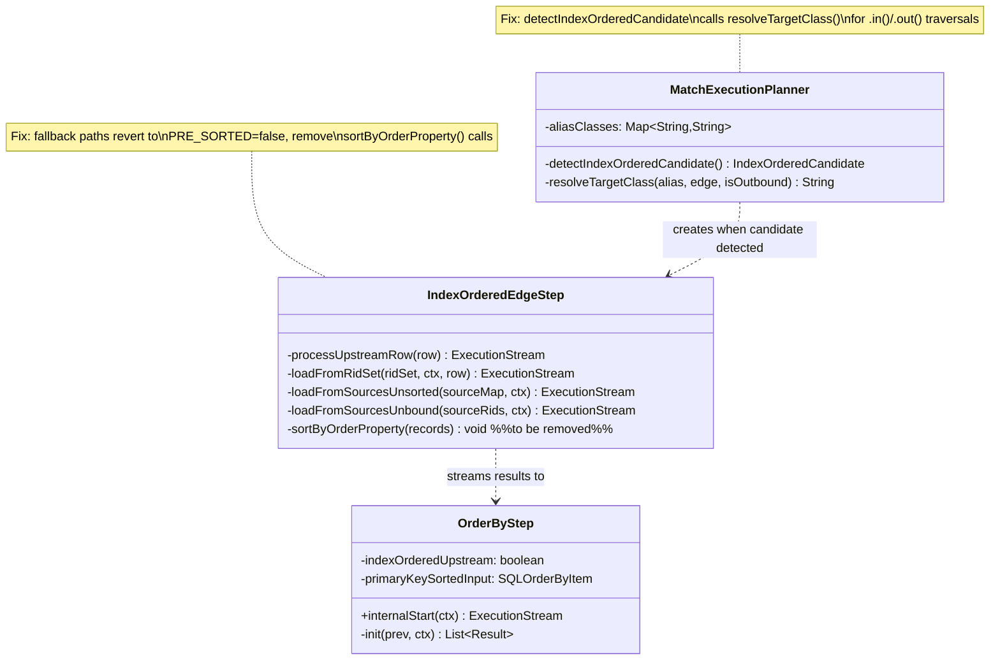
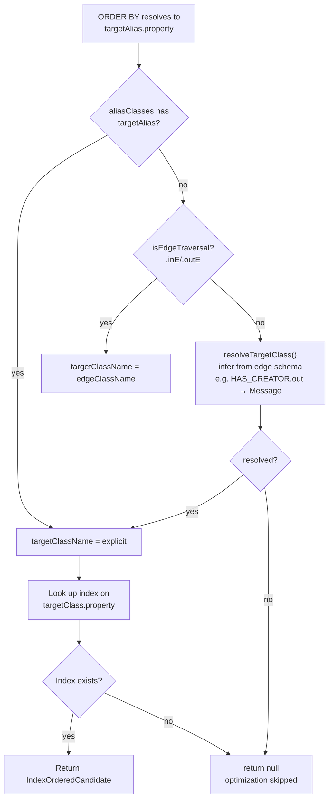
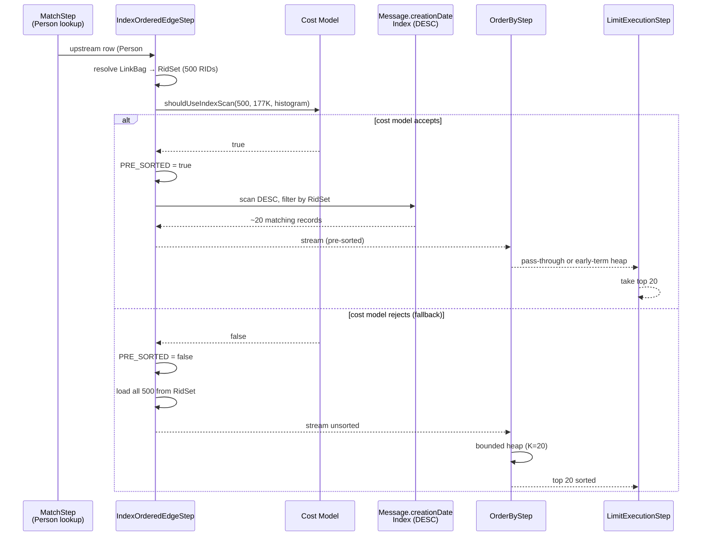

# YTDB-635: Fix index-ordered MATCH — Design

## Overview

Two targeted fixes to the index-ordered MATCH optimization on the
`index-ordered-match` branch. The optimization replaces a standard MatchStep
with an IndexOrderedEdgeStep that scans a property index in ORDER BY direction,
filtered by the source vertex's LinkBag RidSet. This avoids loading all edge
targets and sorting — instead loading only the top K records for LIMIT queries.

The optimization was not firing for the highest-value queries (IS2, IC2) due to
a class inference gap, and the fallback path was penalized by a sort-push-down
that replaced the efficient bounded heap with a full materialization + sort.

## Class Design

**MatchExecutionPlanner** owns the detection logic. `detectIndexOrderedCandidate`
currently resolves `targetClassName` only from `aliasClasses` (explicit class
constraint) or `edgeClassName` (for `.inE()`/`.outE()`). The fix adds a third
path: call `resolveTargetClass()` for `.in()`/`.out()` to infer the class from
the edge schema's LINK property. `resolveTargetClass()` already exists and is
used by the pre-filter infrastructure — no new code, just a new call site.

**IndexOrderedEdgeStep** has three fallback methods that were modified by the
sort-push-down: `loadFromRidSet` (single-source), `loadFromSourcesUnsorted`
(multi-source FILTERED_BOUND), `loadFromSourcesUnbound` (multi-source
FILTERED_UNBOUND). All three are reverted to set `PRE_SORTED = false` and
stream unsorted results. The `sortByOrderProperty` helper is removed.

**OrderByStep** is unchanged. When `PRE_SORTED = false`, it uses the standard
bounded heap: O(N log K) comparisons, O(K) memory. When `PRE_SORTED = true`
(index scan succeeded), it passes through (single-field) or uses bounded heap
with early termination (multi-field).

## Workflow

### Detection flow (after fix)

The new path (node F) uses `resolveTargetClass()` which looks up the edge class
schema (e.g., HAS_CREATOR), finds the linked vertex property (`out` LINK →
Message), and returns the class name. This enables detection for IS2
(Person → Message) and IC2 (friend → Message).

### Execution flow — single-source (IS2)

Key behavior: in the **index scan** path, only ~20 records are loaded (the
first K matching entries from the DESC index scan). In the **fallback** path,
all 500 records are loaded but the bounded heap uses O(K) memory and O(N log K)
comparisons — restoring the efficient pre-push-down behavior.

## Cost model interaction with warm cache

The cost model (`IndexOrderedCostModel`) assigns higher cost to random record
loads (`randRead`) than sequential index page reads (`seqRead`). For IS2 with
500 edges, 177K index entries, and LIMIT 20:

- **Index scan cost**: ~176 (30 sequential pages + 20 random loads + RidSet build)
- **Load-all cost**: ~2503 (500 random loads + sort)

The model correctly accepts the index scan. In a warm-cache JMH benchmark,
random reads are cheaper than on disk (cache hits vs page faults), but the
25x reduction in record loads (20 vs 500) still dominates because each load
involves record deserialization, which is CPU-bound regardless of cache state.

## Fallback path — why bounded heap is better

The sort-push-down replaced the bounded heap with full sort in fallback paths.
For LIMIT K queries with K << N:

| Aspect | Bounded heap (restored) | Full sort (reverted) |
|--------|------------------------|---------------------|
| Comparisons | O(N log K) | O(N log N) |
| Memory | O(K) | O(N) |
| Downstream benefit | None (all N flow through) | K flow through |
| IS2 (N=500, K=20) | 500 × 4.3 ≈ 2150 | 500 × 9 ≈ 4500 |

The downstream benefit of sort-push-down only helps when there are expensive
edges after IndexOrderedEdgeStep. For IS2 and IC2, the target alias is the
last edge — no downstream edges exist. The bounded heap is strictly better.
