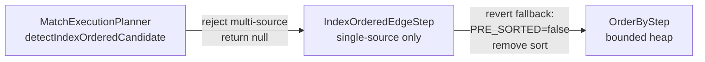

# YTDB-635: Fix index-ordered MATCH — revert sort-push-down + single-source only

## Design Document
[design.md](design.md)

## High-level plan

### Goals

Unblock the index-ordered MATCH optimization from delivering its expected
performance gains on LDBC benchmarks:

1. **Revert sort-push-down** — fallback paths materialize O(N) + sort O(N log N)
   instead of streaming to OrderByStep bounded heap O(N log K). Strictly worse
   for LIMIT queries.

2. **Restrict to single-source only** — multi-source mode (IC11, IC2, IC8) adds
   reverse-lookup overhead that cancels the index scan benefit. Profiling
   confirmed IC11 is -9% slower. Disabling multi-source eliminates all
   regressions and simplifies IndexOrderedEdgeStep by ~400 lines.

After the rebase onto develop, class inference already works for `.in()`/`.out()`
via `addAliases` → `inferClassFromEdgeSchema` (from YTDB-592 hash-join PR).
No class inference changes needed.

Expected impact: IS2 loads ~20 records instead of ~500. IS7 similar gains.
IC11 returns to baseline (per-source traversal + pre-filter). Zero regressions.

### Constraints

- Changes scoped to `IndexOrderedEdgeStep` (fallback revert + multi-source
  removal) and `MatchExecutionPlanner.detectIndexOrderedCandidate` (reject
  multi-source). No changes to cost model, OrderByStep, or detection logic
  for single-source.
- Must not regress any IS/IC benchmark vs develop.
- Branch is `index-ordered-match`, rebased onto develop via
  `lazy-recursive-stream`.

### Architecture Notes

#### Component Map

- **MatchExecutionPlanner.detectIndexOrderedCandidate** — When source is not
  single-row guaranteed, return null (skip optimization). Remove all
  multi-source mode logic (MultiSourceMode enum, mode detection, cost checks).
- **IndexOrderedEdgeStep** — Remove multi-source dispatch, all multi-source
  methods (filteredBound, filteredUnbound, unfilteredBound, unfilteredUnbound,
  indexScanWithUnion, indexScanGlobal, loadFromSourcesUnsorted,
  loadFromSourcesUnbound, matchTargetToSources, resolveReverseEdges,
  estimateTotalEdges, batchedStream), MultiSourceMode references. Revert
  sort-push-down in remaining fallback (loadFromRidSet): set PRE_SORTED=false,
  remove sortByOrderProperty. Remove IndexOrderedCandidate fields only used
  by multi-source (multiSourceMode, reverseFieldName, sourceClassName).
- **OrderByStep** — No changes.

#### D1: Revert sort-push-down — restore bounded heap for fallback paths

- **Alternatives**: Keep push-down universally (worse for IS2/IC2) or
  selectively (complex).
- **Rationale**: Bounded heap O(N log K) strictly better than O(N log N) for
  LIMIT K << N. No LDBC query benefits from downstream-edge push-down.
- **Risks**: Queries with expensive downstream edges after IndexOrderedEdgeStep
  fallback will process N records instead of K. Pre-existing behavior.
- **Implemented in**: Track 1

#### D2: Restrict index-ordered to single-source — disable multi-source

- **Alternatives**: Tune cost model (doesn't work — warm cache makes model
  assumptions wrong), add reverse lookup cost penalty (insufficient — model
  still favors scan), keep multi-source with better heuristics (complex).
- **Rationale**: Profiling confirmed multi-source reverse lookup overhead
  dominates any benefit. Per-source traversal with pre-filters is more
  efficient for multi-source queries. Single-source queries (IS2, IS7)
  don't need reverse lookup and get clean wins. Removing multi-source
  eliminates ~400 lines of complex code.
- **Risks**: Future queries that would benefit from multi-source index scan
  won't get it. Acceptable — can be re-added with a better cost model.
- **Implemented in**: Track 2

#### Invariants

- When `VAR_INDEX_ORDERED_PRE_SORTED = false`, OrderByStep uses standard
  bounded heap (no pass-through, no early termination).
- `detectIndexOrderedCandidate` returns null for any multi-source pattern.
- `detectIndexOrderedCandidate` returns a valid candidate for IS2-style
  single-source queries (Person by id → `.in('HAS_CREATOR')` → Message).
- Fallback path (`loadFromRidSet`) streams unsorted to OrderByStep.

#### Non-Goals

- Multi-source cost model improvements (disabled entirely instead)
- Changes to OrderByStep logic
- Propagating ORDER BY from outer SELECT to MATCH planner

## Checklist

- [ ] Track 1: Revert sort-push-down in fallback path
  > Revert sort-push-down in `IndexOrderedEdgeStep.loadFromRidSet`:
  > change PRE_SORTED from true to false (line 167), remove
  > `sortByOrderProperty(records)` call. Note: multi-source fallback
  > sites (lines 283, 303, 366, 560) will be removed entirely in Track 2,
  > so only the single-source fallback (line 167) needs the revert.
  >
  > Also revert `loadFromRidSet` to stream unsorted results and remove
  > the `sortByOrderProperty` helper method.
  >
  > Run existing tests to verify.
  >
  > **Scope:** ~2 steps covering fallback PRE_SORTED revert, helper removal

- [ ] Track 2: Disable multi-source and add explain tests
  > In `detectIndexOrderedCandidate`: when `!sourceHasRidConstraint`,
  > return null immediately (skip multi-source). Remove all multi-source
  > detection logic (MultiSourceMode enum, mode selection, cost checks,
  > isFilteredScanLikelyWorthwhile, isUpstreamBindingNeeded,
  > isTargetOfEarlierEdge, hasSingleRowGuarantee stays).
  >
  > In `IndexOrderedEdgeStep`: remove `multiSourceDispatch` and all
  > multi-source methods (filteredBound, filteredUnbound, unfilteredBound,
  > unfilteredUnbound, indexScanWithUnion, indexScanGlobal,
  > loadFromSourcesUnsorted, loadFromSourcesUnbound, matchTargetToSources,
  > resolveReverseEdges, estimateTotalEdges, batchedStream, pickMultiSourceStrategy).
  > Remove constructor parameters: multiSourceMode, reverseFieldName,
  > sourceClassName. Remove IndexOrderedCandidate fields for multi-source.
  > Remove GlobalConfiguration entries: QUERY_INDEX_ORDERED_MAX_SOURCES.
  >
  > In `IndexOrderedCostModel`: remove `pickMultiSourceStrategy` and
  > `MultiSourceStrategy` enum (only single-source `computeCosts` remains).
  >
  > Update IC11 explain test to expect standard MATCH plan (no INDEX ORDERED).
  > Add IS2 explain test verifying INDEX ORDERED MATCH detection.
  > Add IS7 explain test if applicable.
  > Remove/update unit tests for multi-source modes.
  >
  > **Scope:** ~4-5 steps covering multi-source rejection, dead code removal,
  > explain tests, test cleanup
  > **Depends on:** Track 1

## Final Artifacts
- [ ] Phase 4: Final artifacts (`design-final.md`, `adr.md`)
