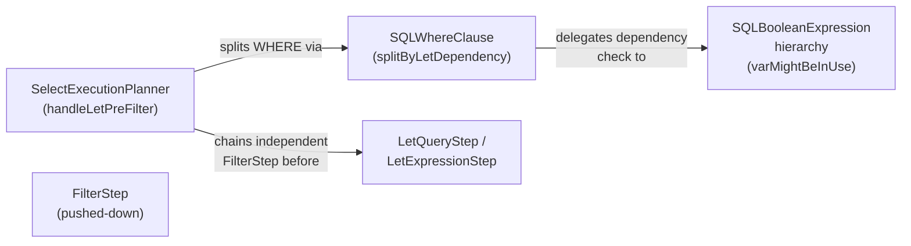

# YTDB-660: Predicate Push-Down Past Per-Record LET Subqueries — ADR

## Summary

Per-record LET subqueries in `SELECT...LET...WHERE` queries execute for
every upstream row, even when the WHERE clause contains predicates that
could filter rows before the LET runs. This optimization splits the WHERE
clause into LET-independent and LET-dependent halves at plan-construction
time, inserting an early `FilterStep` before the per-record LET steps.
Rows eliminated by the independent filter never trigger the expensive LET
subquery evaluation.

The change modifies two files: `SQLWhereClause` (new split method and
record type) and `SelectExecutionPlanner` (new `handleLetPreFilter` method
in the pipeline assembly). No AST classes, execution step classes, or other
planner methods were modified.

## Goals

- **Push LET-independent WHERE predicates before per-record LET** — reduce
  unnecessary subquery executions when the WHERE filter is selective.
  Achieved as planned.
- **Preserve query semantics** — the push-down must never change results.
  Verified by 12 unit tests and 11 integration tests covering all split
  paths, plus the full existing core test suite (1041 test classes, 0
  failures).
- **Concrete impact (LDBC IC10)** — the birthday range filter passes ~8%
  of rows and is independent of the `$scores` LET subquery. After
  push-down, LET subquery executions drop from ~800 to ~64 (12.5x
  reduction). This goal motivated the feature.

## Constraints

All constraints from the plan were satisfied as designed:

- **OR-safety**: Multi-OR WHERE with mixed LET dependencies is never split.
  The entire WHERE stays after LET. Implemented via the quick-check +
  multi-OR branch detection in `splitByLetDependency`.
- **`$parent` safety**: Conjuncts referencing `$parent` are conservatively
  classified as LET-dependent at both the whole-expression and per-conjunct
  levels, using the existing `refersToParent()` method.
- **Synthetic LET variables**: `extractSubQueries()` runs before pipeline
  assembly and creates `$$$SUBQUERY$$_N` references. These are naturally
  detected by `varMightBeInUse` — no special handling was needed.
- **Plan cache**: The push-down changes internal plan structure but not the
  cache key (original SQL text). This is correct because the split is
  deterministic and the cached plan is a deep copy.
- **`tryPushDownFilterIntoExpand` compatibility**: The SubQueryStep guard
  in `handleLetPreFilter` prevents creating a false
  `SubQueryStep -> FilterStep` adjacency.
- **Empty per-record LET**: The guard checks both `null` and
  `getItems().isEmpty()`.

No new constraints were discovered during implementation.

## Architecture Notes

### Component Map

- **SelectExecutionPlanner** — `handleLetPreFilter()` (private, line 1727)
  sits at phase 5b between `handleFetchFromTarget` and `handleLet`.
  Collects LET variable names inline, calls `splitByLetDependency`,
  conditionally chains a `FilterStep`, and adjusts `info.whereClause` for
  the subsequent `handleWhere`.
- **SQLWhereClause** — `splitByLetDependency(Set<String>)` (line 878) and
  `LetSplitResult` record (line 854). Follows the `splitByParentReference`
  pattern. Uses `expressionReferencesAnyLetVar` private helper (line 936).
- **SQLBooleanExpression hierarchy** — unchanged. Existing
  `varMightBeInUse(String)` and `refersToParent()` provide all needed
  dependency checks.
- **FilterStep** — unchanged. Reused as-is for the pushed-down filter.
- **LetQueryStep / LetExpressionStep** — unchanged. Simply repositioned
  after the pushed-down FilterStep in the chain.

### Decision Records

#### D1: Reuse existing `varMightBeInUse` instead of adding new AST method
- **Status**: Implemented as planned.
- **Rationale**: `varMightBeInUse(String)` already propagates through the
  entire AST hierarchy (17+ classes). A simple loop over the LET variable
  set (via `expressionReferencesAnyLetVar`) avoids touching the parser AST
  for a marginal optimization. In practice LET clauses have 1-3 variables
  and WHERE has 1-5 conjuncts.

#### D2: Follow `splitByParentReference()` pattern for the new split method
- **Status**: Implemented as planned.
- **Rationale**: The existing pattern (unwrap single-OR, iterate AND
  conjuncts, partition by predicate, rebuild via `buildWhereWith`) was
  reused directly. The only divergence is multi-OR handling: while
  `splitByParentReference` returns immediately for multi-OR,
  `splitByLetDependency` lets the quick-check at the top classify the
  entire expression (full push-down if no LET refs at all, fully dependent
  otherwise).

#### D3: Treat all LETs as a single block
- **Status**: Implemented as planned.
- **Rationale**: Inter-LET dependencies make fine-grained push-down
  (between individual LET steps) complex and error-prone. The
  all-or-nothing approach is safe, simple, and captures the dominant case
  (WHERE is fully LET-independent). Fine-grained push-down can be added
  later if profiling shows benefit.

#### D4: Inline LET variable collection (emerged during implementation)
- **Rationale**: The original design proposed a separate
  `collectLetVarNames()` helper on the planner. During implementation the
  collection was inlined directly in `handleLetPreFilter()` since it is a
  simple loop used exactly once. This is a minor simplification with no
  architectural impact.

### Invariants

- **Semantic equivalence**: For any query, the result set is identical with
  and without the push-down. Verified by the full test suite.
- **No push-down when no LET**: When `perRecordLetClause` is null or empty,
  the pipeline is unchanged.
- **No push-down for LET-dependent WHERE**: When every conjunct references
  a LET variable, the entire WHERE stays after LET.
- **OR-safety**: A multi-OR WHERE with mixed dependencies is never split.

### Non-Goals

- Fine-grained push-down between individual LET steps (inter-LET)
- Push-down of ORDER BY or LIMIT past LET
- Modifying the MATCH execution planner (different code path)

## Key Discoveries

- **`splitByParentReference` pattern is robust and reusable**: The
  unwrap-OR / iterate-AND / partition / rebuild-via-`buildWhereWith` pattern
  in `SQLWhereClause` generalized cleanly to a new split dimension with
  minimal code. Future WHERE-splitting optimizations can follow the same
  template.
- **Multi-OR divergence is intentional**: Unlike `splitByParentReference`
  which immediately classifies multi-OR as parent-referencing,
  `splitByLetDependency` allows full push-down of multi-OR when no branch
  references any LET variable. This is safe because the quick-check
  (`expressionReferencesAnyLetVar` + `refersToParent`) examines the entire
  expression tree, and partial OR splitting is never attempted.
- **`SubQueryStep` adjacency is a real concern**: The guard against
  `SubQueryStep` as the last chained step was confirmed necessary during
  integration testing — `FROM (subquery)` queries create a `SubQueryStep`
  that `tryPushDownFilterIntoExpand` would incorrectly match if a
  `FilterStep` were inserted immediately after it.
- **Coverage of `assert` lines**: JaCoCo reports phantom uncovered branches
  for Java `assert` statements. The `coverage-gate.py` script handles this
  with special-case exclusion logic — the final coverage numbers (100% line,
  85% branch) account for this correctly.
