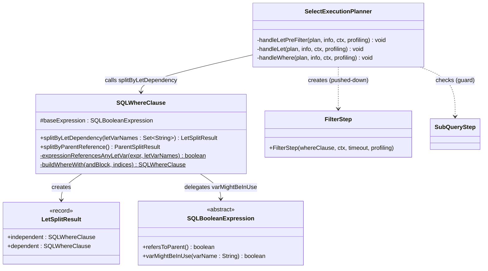
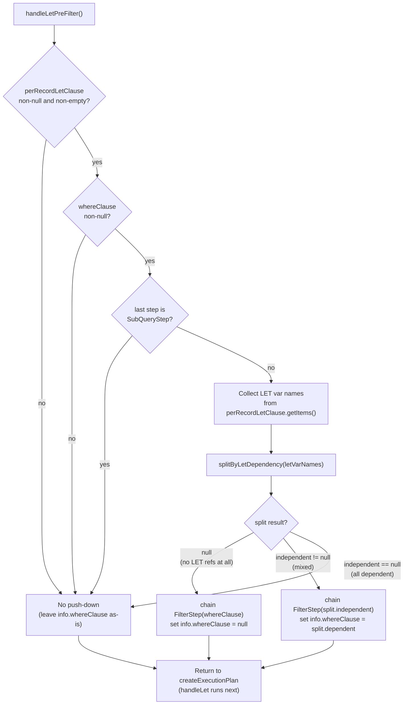
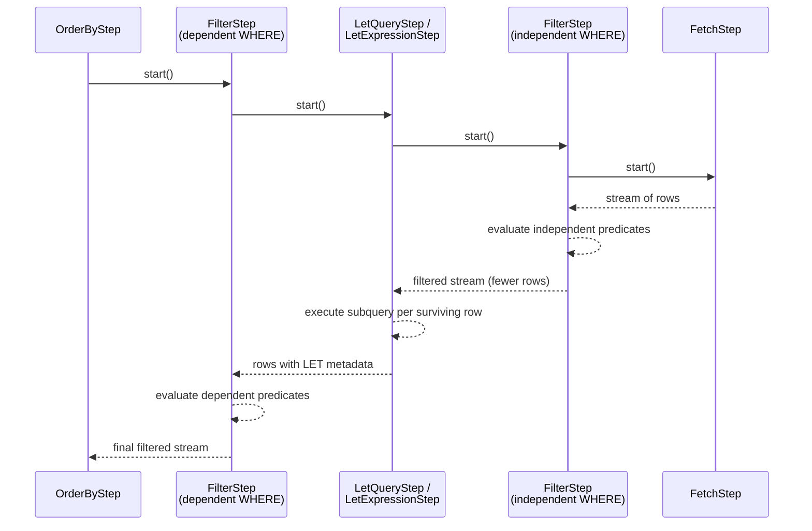

# YTDB-660: Predicate Push-Down Past Per-Record LET Subqueries — Final Design

## Overview

The optimization splits the WHERE clause of a `SELECT...LET...WHERE` query
into two parts at plan-construction time, filtering rows before expensive
per-record LET subqueries execute. The change is confined to two files:

- **`SQLWhereClause`** — new `splitByLetDependency(Set<String>)` method and
  `LetSplitResult` record that partition AND-level conjuncts into
  LET-independent and LET-dependent halves.
- **`SelectExecutionPlanner`** — new `handleLetPreFilter()` method inserted
  between `handleFetchFromTarget` (phase 5) and `handleLet` (phase 6) in
  the pipeline assembly.

No AST classes, execution step classes, or other planner methods were
modified. The pushed-down filter reuses the existing `FilterStep` class and
is distinguishable in EXPLAIN output by its position before the LET steps.

The implementation matches the original design with one minor simplification:
the design proposed a separate `collectLetVarNames()` helper on the planner,
but the LET variable collection was inlined directly in `handleLetPreFilter()`
since it is only used once and is straightforward.

## Class Design

`SQLWhereClause.splitByLetDependency()` follows the same structural pattern
as the existing `splitByParentReference()`: unwrap to a single-OR
single-AND block, iterate conjuncts, partition by a predicate, and rebuild
two WHERE clauses via the shared `buildWhereWith()` helper. The dependency
check delegates to `expressionReferencesAnyLetVar()`, a private static
helper that loops over the LET variable names and calls the existing
`varMightBeInUse(String)` on the AST (decision D1 — reuse, not duplicate).

`LetSplitResult` is a public inner record with two nullable fields:
`independent` (conjuncts safe to evaluate before LET) and `dependent`
(conjuncts that must wait until after LET). A `null` return from
`splitByLetDependency` means the entire WHERE is LET-independent and can
be fully pushed down.

`SelectExecutionPlanner.handleLetPreFilter()` is a private method that
collects per-record LET variable names inline, calls
`splitByLetDependency`, and conditionally chains a `FilterStep` before the
LET steps. Three guards skip the optimization: (1) no per-record LET or
empty items list, (2) no WHERE clause, (3) last chained step is a
`SubQueryStep` (avoids false adjacency with `tryPushDownFilterIntoExpand`).

## Workflow

### Pipeline Assembly (Plan Construction Time)

The method sits at phase 5b in the planner's pipeline table, between
`handleFetchFromTarget` (phase 5) and `handleLet` (phase 6). The three
guard checks are evaluated first; only when all pass does the method
proceed to collect variable names and attempt the split. The split result
determines one of three outcomes: full push-down (entire WHERE moved before
LET), partial push-down (independent conjuncts before LET, dependent after),
or no push-down (all conjuncts stay after LET).

### Runtime Execution (Pull-Based Stream)

The runtime pipeline is pull-based: each step's `start()` recursively
pulls from its predecessor. The pushed-down `FilterStep` (IF) sits between
`FetchStep` and `LetQueryStep`, so LET subqueries execute only for rows
that pass the independent filter. This is the core performance benefit —
for LDBC IC10, the birthday range filter passes ~8% of rows, reducing LET
subquery executions from ~800 to ~64.

## WHERE Clause Splitting Logic

The `splitByLetDependency` method handles four structural cases of the
WHERE clause AST:

1. **Single AND block** (`WHERE a AND b AND c`): Each conjunct is checked
   independently via `expressionReferencesAnyLetVar` and `refersToParent`.
   Conjuncts that reference any LET variable or `$parent` go to `dependent`;
   the rest go to `independent`. Both halves are rebuilt via `buildWhereWith`.

2. **Single OR block wrapping one AND child** — the normal flattened form
   after `whereClause.flatten()`. Same as case 1 after unwrapping the
   single OR branch.

3. **Multi-OR block** (`WHERE (a AND b) OR (c AND d)`): Unlike
   `splitByParentReference()` which returns immediately for multi-OR, this
   method iterates all OR branches via the quick-check at the top. If any
   sub-expression in any branch references a LET variable or `$parent`, the
   entire WHERE is classified as dependent. Push-down applies only when ALL
   sub-expressions in ALL branches are LET-independent (the quick-check
   returns `null`, meaning full push-down). Partial splitting of an OR is
   never attempted because it would change query semantics.

4. **Single condition** (`WHERE a > 5`): Treated as a single-element AND
   block. If LET-dependent, classified as `dependent`; if LET-independent,
   the quick-check at the top returns `null` (full push-down).

The `$parent` guard is applied at two levels: in the quick-check
(`refersToParent()` on the entire expression) and per-conjunct during AND
partitioning. This ensures `$parent`-referencing predicates never get pushed
down, even in mixed AND blocks.

## Safety: Synthetic LET Variables

The `extractSubQueries()` optimization runs during `optimizeQuery()` —
before pipeline assembly. It replaces inline subqueries in WHERE with
`$$$SUBQUERY$$_N` variable references and adds corresponding synthetic LET
items to `perRecordLetClause`. When `handleLetPreFilter` collects LET
variable names, these synthetic names are included. When
`splitByLetDependency` runs, `varMightBeInUse` correctly detects the
`$$$SUBQUERY$$_N` references in the WHERE AST and classifies affected
conjuncts as LET-dependent. No special handling was needed.

## Safety: SubQueryStep Guard

When the FROM target is a subquery (`SELECT FROM (SELECT ...)`),
`handleSubqueryAsTarget` creates a `SubQueryStep` as the first pipeline
step. The existing `tryPushDownFilterIntoExpand` optimization looks for a
`SubQueryStep -> FilterStep` adjacency pattern. If `handleLetPreFilter`
inserted a `FilterStep` immediately after a `SubQueryStep`, it would create
a false match. The guard at the top of `handleLetPreFilter` checks
`steps.getLast() instanceof SubQueryStep` and skips the optimization when
true, preventing this interference.
