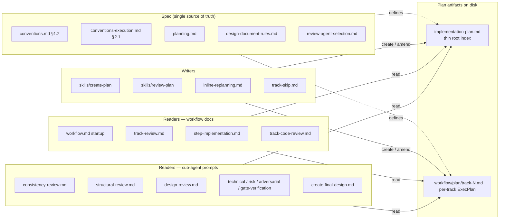

# YTDB-817 — Split `implementation-plan.md` into `_workflow/plan/track-N.md` with thin root index

## Design Document
[design.md](design.md)

## High-level plan

### Goals

Replace the monolithic `implementation-plan.md` with a directory-of-tracks shape derived from OpenAI's ExecPlan template, so:
- a fresh `/execute-tracks` session reads a thin root index plus the one per-track file it needs, instead of the whole plan;
- a human reviewer can pick a track and see its full picture (purpose, scope, decisions, acceptance, progress) in one file without flipping between sections of a 500–2200-line document;
- restart-from-cold works: any new session can resume work on a track from `_workflow/plan/track-N.md` alone.

Move 4 is the structural anchor for the rest of YTDB-813 — Moves 1, 2, 3 land per-track after this defines what a track *is* as a file.

### Constraints

- **In-flight branches keep their current format.** Branches with active workflow state under `_workflow/tracks/` (rollback-log, pinless-disk-cache, read-cache-concurrency-bug, si-links-consistency, ytdb-614-property-map, …) are not migrated. The new shape applies only to plans created after this lands.
- **This branch self-migrates atomically with the spec change.** The plan's own `_workflow/tracks/` directory and `track-1.md`…`track-4.md` files share the same commit history as the workflow they modify, so the "in-flight branches keep their current format" rule cannot apply here. Track 2's final step performs the atomic switch — `git mv` of this branch's `_workflow/tracks/` → `_workflow/plan/`, 5-section → 14-section shape migration of each track file (back-filling Track 1's already-written episode content from `## Steps` blockquotes to `## Episodes` blocks), and the episode-writer rewire (`step-implementation.md` sub-step 7 + `episode-format-reference.md` + adjacent Progress writers in `track-review.md` / `track-code-review.md`) all in one commit. See D13.
- **No automated migration tooling.** Out of scope per YTDB-817.
- **No substance changes to Phase A/B/C decision semantics.** Phase model, gate semantics, review iteration limits, risk-tag rules, and the resume protocol all stay identical. The write-side episode discipline gains the mandatory `[ctx=<level>]` field on Progress entries and Episodes block headers per D12 (a forcing function for context-window monitoring), and the writer-side multi-section write per D9 / D11 — these are write-format changes that change what gets recorded at each Progress/Episode write, but they do not change which writes happen or when. Decision semantics — the rules controlling phase transitions, gate passes/fails, retry decisions, escalation triggers — are unchanged.
- **Sibling Moves' slots are pre-allocated, not pre-filled.** Move 4 reserves the ADDED/MODIFIED/REMOVED slot (Move 2) and the EARS/Gherkin acceptance slot (Move 3); leaving them empty is fine — Moves 1–3 populate them.
- **No new test infrastructure.** Workflow-machinery change. Validation is a manual `/create-plan` smoke test against a synthetic task plus a grep verification.

### Architecture Notes

#### Component Map

- **`conventions.md` §1.2, `conventions-execution.md` §2.1, `planning.md`, `design-document-rules.md`** — single source of truth for the new directory layout, per-track template, lifecycle table, and section budgets. Update once; every reader and writer references them.
- **`review-agent-selection.md`** — single source of truth for Phase B/C dimensional-review agent dispatch. Touched only by Track 1 to add the workflow-review agents group, per-agent file-pattern triggers, and the baseline-skip override for workflow-only diffs. Required before Tracks 2–4 so their Phase C reviews dispatch the workflow-review agents instead of the Java-focused baseline.
- **`_workflow/plan/track-N.md` (was `_workflow/tracks/track-N.md`)** — per-track ExecPlan adopting OpenAI's 12-section template, plus a retained `## Base commit` housekeeping sibling. Restart-from-cold readable: a fresh session reading only this file can resume.
- **`implementation-plan.md` (root)** — thin checklist index. Carries Goals / Constraints / Architecture Notes plus one line per track (intro + Scope + Depends-on + link to track file). Move 2 later adds the ADDED/MODIFIED/REMOVED triad per track.
- **Writers** (`/create-plan`, `/review-plan`, inline-replanning, track-skip) — every code path that creates or amends the root or a per-track file. Templates point at the new shape.
- **Readers** (`workflow.md` startup, Phase A/B/C docs, sub-agent prompts) — every doc that names a section heading or the `tracks/` path. Mechanical updates; old section names retire as their content folds into new sections.

#### D1: One file per track, not a directory per track

- **Alternatives considered**: a directory per track (`_workflow/plan/track-1/` containing `plan.md`, artifact subfiles); keep the current flat layout.
- **Rationale**: the 12-section ExecPlan template fits comfortably in one Markdown file. A per-track directory adds navigation friction without an immediate artifact need — we have no binary artifacts or large companion files per track today. If a future use case needs per-track artifacts, a single track can graduate to a directory without re-shaping the whole format.
- **Risks/Caveats**: if Move 3's EARS/Gherkin lines plus Move 1's inlined Decision Records bloat individual track files past the structural-review caps, we may revisit. Mitigation: per-section budgets already exist and structural review enforces them.
- **Implemented in**: Track 2
- **Full design**: design.md §"New per-track file shape"

#### D2: Root `implementation-plan.md` is a thin index, not a 13th ExecPlan

- **Alternatives considered**: apply the 12-section template to the root file too (every plan is a recursive ExecPlan); keep the current root shape unchanged.
- **Rationale**: the root carries cross-track context (Goals, Constraints, Architecture Notes top-level Component Map, top-level Decision Records that span tracks) plus a checklist. OpenAI's PLANS.md is one ExecPlan per feature; we stack N per-track ExecPlans under one umbrella. Forcing the umbrella into ExecPlan shape would duplicate sections (Purpose, Progress) that already live per-track.
- **Risks/Caveats**: root and per-track files use different shapes, so the reader must know which one they're looking at. Mitigated by file location (root is always `implementation-plan.md`; tracks are always `plan/track-N.md`) and by per-track files starting with `# Track N: <title>`.
- **Implemented in**: Track 2
- **Full design**: design.md §"Root index — `implementation-plan.md`" (see subsection *Distinct from per-track ExecPlan*)

#### D3: Section order is OpenAI's verbatim — continuous-log sections near the top

- **Alternatives considered**: reorder to put plan-at-start sections (Purpose / Context / Plan of Work / Concrete Steps) first, then continuous-log (Progress / Surprises / Decision Log) at the bottom — closer to today's `## Description` + `## Progress` + `## Steps` reading order.
- **Rationale**: OpenAI puts Progress / Surprises / Decision Log / Outcomes right after Purpose so a resume reader sees current state before static plan. We adopt the same — restart-from-cold is the goal that distinguishes ExecPlan from a static plan.
- **Risks/Caveats**: humans coming from our current shape will initially expect Steps near the top. Mitigated by leaving `## Concrete Steps` at section #8 (matching OpenAI) and surfacing the section ordering in the design doc.
- **Implemented in**: Track 2
- **Full design**: design.md §"Continuous-log discipline" (see subsection *Why continuous-log sections come first*)

#### D4: Adopt all 12 section names verbatim; retain `## Base commit`; fold `## Reviews completed` into Outcomes & Retrospective

- **Alternatives considered**: keep existing names (`## Description`, `## Steps`, `## Reviews completed`) to minimize rewire blast radius; rename everything to ExecPlan names including `## Base commit`; keep `## Reviews completed` as its own section in the new shape.
- **Rationale**: section-name fidelity to OpenAI makes the format recognizable to anyone who has read the cookbook (Move 4's stated motivation). The rewire is mechanical (~85 references across ~30 files). `## Base commit` doesn't map to any of the 12 slots cleanly — it's workflow housekeeping (Phase B writes; Phase C reads). Keeping it as a separate sibling avoids forcing a parse-tree change on every workflow reader. `## Reviews completed` is genuinely a continuous log of review outcomes per phase, so it folds naturally into **Outcomes & Retrospective** with each entry timestamped. `## Episodes` (see D11) is similarly a workflow-specific addition alongside `## Base commit` — added on top of OpenAI's 12 rather than overloading one of them with per-step episode content.
- **Risks/Caveats**: every reader that today greps for `## Description` or `## Reviews completed` needs the new section name. Tracks 3 and 4 sweep these.
- **Implemented in**: Track 2 (spec) + Tracks 3 & 4 (rewire)
- **Full design**: design.md §"Section mapping — old shape to new"

#### D5: Continuous-log sections live at track-file level; per-step episodes live in their own dedicated section, not nested under Concrete Steps

- **Alternatives considered**: keep all discoveries inside per-step episodes only; duplicate every discovery in both a per-step episode and the track-level Surprises section; keep the per-step episode wedged inside each Concrete Steps item (status quo of today's `## Steps` blockquote).
- **Rationale**: OpenAI's restart-from-cold invariant requires Surprises / Decision Log to be readable from the top of the file without scanning every step. Per-step episodes belong in a dedicated continuous-log section (one block per step, identified by step number + commit SHA) — that cleanly separates the plan-at-start (Concrete Steps roster, immutable after Phase A) from the continuous-log (per-step blocks, written one per Phase B commit). Cross-cutting discoveries promote to `## Surprises & Discoveries` from the orchestrator's sub-step 7 episode write. Decision Log captures execution-time decisions (inline-replan choices, scope-downs, dependency reveals) that today are scattered across step blockquotes. The dedicated section's exact name is settled by D11 (`## Episodes`); D5 covers only the track-level-vs-Concrete-Steps placement decision and the four-section continuous-log discipline. See D9 for the per-step-episode separation from Concrete Steps and D11 for the section-naming choice.
- **Risks/Caveats**: episode now lands in up to four sections (Progress timestamp + per-step block + optional Surprises promotion + optional Decision Log entry) instead of one blockquote. Drift risk if a writer forgets a section. Mitigation: orchestrator sub-step 7 follows a deterministic write checklist; `episode-format-reference.md` codifies the multi-section write; the per-step block is authoritative for per-step content, Surprises is authoritative for cross-track facts (see D11 for the per-step block's section name and the cross-step-only role of `## Artifacts and Notes`).
- **Implemented in**: Track 2 (spec) + Track 3 (orchestrator multi-section episode-write path in `step-implementation.md`)
- **Full design**: design.md §"Continuous-log discipline" and §"Step episode storage"

#### D6: Reserve pre-allocated slots for sibling Moves 1, 2, 3

- **Alternatives considered**: leave Move 4 silent on the other Moves' content; merge the Moves into one larger change.
- **Rationale**: Moves 1–3 are content additions, not structural changes. Reserving slots lets each Move land as a pure content addition with no structural rewire of the new format. Specifically: **Purpose / Big Picture** opens with a one-line BLUF; the line immediately below it carries the ADDED/MODIFIED/REMOVED triad (Move 2). **Decision Log** is the inlined-per-track Decision Records home (Move 1; the trailing one-line backlink Decision Log at the bottom of the root plan is what the *root* index carries). **Validation and Acceptance** is the EARS/Gherkin acceptance line location (Move 3).
- **Risks/Caveats**: slots are empty until Moves 1–3 land. The `/create-plan` template seeds them with HTML-comment placeholders so a Phase 2 structural review doesn't treat the empty section as a defect.
- **Implemented in**: Track 2 (spec — templates with placeholders) + Track 3 (writer templates)
- **Full design**: design.md §"Slot reservation for Moves 1, 2, 3"

#### D7: Rename `_workflow/tracks/` to `_workflow/plan/` and the "step file" glossary term to "track file"

- **Alternatives considered**: keep the `tracks/` directory name and the "step file" term unchanged; rename the directory but keep "step file" as the prose term; rename the term but keep the directory; rename both.
- **Rationale**: YTDB-817 names `/plan/<track>/` and the sibling Moves anchor on the new name. Paired with the directory rename, the prose term "step file" → "track file" aligns the vocabulary with the file basename (`track-N.md`), the design class name (`TrackFile`), and the new directory name (`plan/`). The "step file" term dates from when each step's inline blockquote carried most of the per-track content; with the new 12-section shape, steps are roster entries inside `## Concrete Steps`, not files. Treating both as one rename concept (file path + prose vocabulary) lands them in the same Track 2 commit pair and gives reviewers a single audit trail. Each rename is mechanical: directory rename ~85 references in ~30 files; term rename ~300 references in ~35 files.
- **Risks/Caveats**: a single missed reference silently breaks `/create-plan` or `/execute-tracks` on the next plan, or leaves a confusing mixed-vocabulary doc. Mitigated by grep verification at end of Track 2 (both renames separately) and at end of Track 4 (full sweep). The term-rename blast radius is larger than the path-rename, so it lands as its own adjacent commit within Track 2 — splitting keeps each diff focused.
- **Implemented in**: Track 2, step 1 (directory rename commit) and Track 2, step 2 (terminology rename commit)
- **Full design**: design.md §"Directory and terminology rename mechanics"

#### D8: Phase B/C dimensional review must dispatch workflow-review agents on workflow-machinery diffs

- **Alternatives considered**: leave Phase B/C selection unchanged and rely on the `/code-review` standalone skill for ad-hoc workflow review; add the workflow-review agents to Phase B/C's baseline (always-on); fold a generic "workflow concerns" check into the existing `review-code-quality` agent.
- **Rationale**: `.claude/workflow/review-agent-selection.md` today selects only Java-focused agents. A workflow-only diff (markdown / shell / JSON) gives them nothing to review; their findings are vacuous and they may falsely flag absence of tests, missing docstrings, etc. The six workflow-review agents (`review-workflow-consistency`, `review-workflow-prompt-design`, `review-workflow-instruction-completeness`, `review-workflow-hook-safety`, `review-workflow-context-budget`, `review-workflow-writing-style`) already exist with the right rubrics; the `/code-review` skill's triage already routes them on workflow-machinery files. Phase B/C must agree with that routing so the in-workflow review path and the standalone path dispatch the same agents on the same diff. Adding them as a conditional group (rather than baseline) preserves correctness for Java-only diffs.
- **Risks/Caveats**: finding-prefix collisions if `W*` overlaps existing prefixes (verified non-colliding at Track 1 step 1). Possibly noisy `review-workflow-writing-style` findings on plan / design markdown updates — the agent already has writing-style rules calibrated for concise-doc; existing branches' Phase C runs of this rubric will confirm calibration.
- **Implemented in**: Track 1
- **Full design**: design.md §"Phase B/C dimensional review triage update"

#### D9: Per-step episode is one block in a dedicated section, not a blockquote inside the Concrete Steps item

- **Alternatives considered**: keep today's coupling (each Concrete Steps item carries its episode inline as a blockquote); split the episode across multiple targeted sections (What-was-done only in one section, What-was-discovered only in Surprises) without a per-step block; keep Concrete Steps items as the episode home and add a separate section only for cross-step artifacts.
- **Rationale**: Concrete Steps is the plan-at-start (Phase A decomposition produces it, then it's immutable). Per-step episodes are continuous-log (one new write per Phase B commit). Wedging continuous-log content into a plan-at-start section makes the orchestrator's read/write paths ugly: episode-write modifies an existing item rather than appending a new entry; resume-readers and Phase 4 aggregators must parse nested blockquotes. Splitting them gives one section per semantic — Concrete Steps for "what we're going to do" (roster + risk tag, with `[x]`/`[!]`/`[ ]` status preserved on the roster line so resume-readers can still scan for "next step"), `## Episodes` (introduced by D11) for "what each step actually did" (one block per step, joined by step number + commit SHA). Cross-cutting discoveries still promote to Surprises; execution-time decisions still go to Decision Log; phase transitions + completions log to Progress with ISO timestamps.
- **Risks/Caveats**: visual co-location of plan and outcome is lost — readers who want to see "what was Step 3 supposed to do, and what actually happened" must look at two sections. Mitigated by joining on step number (every Episodes block titled `### Step N — commit <SHA>, <ISO>`) so the visual lookup is mechanical, and by D11's ordering decision (`## Episodes` lands immediately after `## Concrete Steps` so the two are physically adjacent in the file).
- **Implemented in**: Track 2 (spec — per-track template + section-mapping) + Track 3 (writer: `step-implementation.md` sub-step 7 multi-section write; `episode-format-reference.md`) + Track 4 (readers: every grep of a step blockquote becomes a section-join)
- **Full design**: design.md §"Step episode storage"

#### D10: Plan-at-start sections split into Phase 1 track-level tier and Phase A step-aware tier

- **Alternatives considered**: treat every plan-at-start section as `/create-plan`'s responsibility at Phase 1 (forces `## Idempotence and Recovery` and step-referencing prose to invent fictional step structure before decomposition); move Idempotence and Recovery to a per-step roster annotation under `## Concrete Steps` (fights OpenAI's section template and scatters the concern across step entries); drop `## Idempotence and Recovery` entirely (loses a useful Phase A forcing function for retry / rollback thinking).
- **Rationale**: `## Idempotence and Recovery` is defined as naming specific steps and per-step recovery paths — content that cannot exist before Phase A decomposes the track into a step roster. The step-referencing parts of `## Plan of Work` and the per-step EARS/Gherkin lines in `## Validation and Acceptance` (which Move 3 will populate) share the same constraint. The workflow's "details at latest possible point" principle is already codified for step decomposition (Concrete Steps is Phase A's output, not Phase 1's); extending the same principle to other step-aware sections keeps Phase 1 producing a well-formed track file from track-level understanding alone and defers step-aware content to Phase A. The split is captured in design.md §"Core Concepts" (two-tier vocabulary) and §"Lifecycle table" (per-section authoring phase).
- **Risks/Caveats**: `/create-plan` template now writes placeholder bodies (`<!-- Populated at Phase A ... -->`) in `## Idempotence and Recovery` and `## Concrete Steps`. `structural-review.md` must treat a heading followed by a placeholder-only comment as a non-defect — same exemption shape that D6 introduces for sibling-Move reserved slots, just extended to cover Phase A placeholders too. Two placeholder kinds will coexist on a Phase-1-written track file: Phase A placeholders (cleared when Phase A runs) and sibling-Move placeholders (cleared when that Move lands); structural review treats both as non-defects until the relevant phase / Move lands.
- **Implemented in**: Track 3 (writer changes — `/create-plan` SKILL.md template produces Phase A placeholders; `step-implementation.md` codifies the Phase A write path for `## Idempotence and Recovery` plus the step-references append to `## Plan of Work`) + Track 4 (`structural-review.md` placeholder-exemption extension covering Phase A placeholders alongside D6's sibling-Move reserved slots)
- **Full design**: design.md §"Core Concepts" and §"Lifecycle table"

#### D11: Add `## Episodes` as a separate section for per-step blocks; keep `## Artifacts and Notes` for cross-step content only

- **Alternatives considered**: keep the original design (`## Artifacts and Notes` holds both per-step episode blocks and cross-step artifacts — overloaded section name where the dominant content doesn't match the section name); rename `## Artifacts and Notes` to `## Episodes` and find a different home for cross-step artifacts (loses cookbook fidelity on a section that doesn't need to be touched, and cross-step artifacts have no natural alternative home); internal subsection split inside `## Artifacts and Notes` (`### Per-step episodes` + `### Cross-step artifacts`; D4 honored verbatim but the split is visible only after entering the section, hurting discoverability).
- **Rationale**: per-step episodes are the dominant content of the previously-overloaded `## Artifacts and Notes` section; naming a section for its dominant content matches the rest of the design (Progress / Decision Log / Outcomes are all named for their content). Cross-step artifacts (the rare use) retain their OpenAI-intended home in `## Artifacts and Notes`. D4 already permits workflow-specific section additions on top of OpenAI's 12 — `## Base commit` is the precedent; adding `## Episodes` follows the same pattern. Discoverability wins both for fresh human readers (the section name reveals its content from the table of contents) and for sub-agents (their prompts can name the section explicitly rather than referencing a sub-section inside an overloaded parent).
- **Risks/Caveats**: section count in the per-track file grows from 13 (12 ExecPlan + `## Base commit`) to 14 (+ `## Episodes`). Section ordering decision: `## Episodes` lands between `## Concrete Steps` and `## Validation and Acceptance` to keep roster + result physically adjacent — a deviation from the "continuous-log at top" rule (Episodes IS continuous-log, but the reader-flow benefit of co-location with Concrete Steps outweighs the consistency cost; see the §"Why continuous-log sections come first" subsection in `design.md` §"Continuous-log discipline" for the rationale). Phase B sub-step 7's canonical episode-write target moves from `## Artifacts and Notes` to `## Episodes`; the four-section checklist shape (always-write to Episodes + always-write to Progress + conditional Surprises + conditional Decision Log) is unchanged in shape, only in destination.
- **Implemented in**: Track 2 (spec — `/create-plan` template adds `## Episodes`; `conventions-execution.md` §2.1 lifecycle table adds the row; section-mapping table points Steps-blockquote rows to `## Episodes`) + Track 3 (writer — `step-implementation.md` sub-step 7 canonical write target changes from Artifacts and Notes to Episodes; `episode-format-reference.md` updates the templates) + Track 4 (readers — `structural-review.md` section-order check learns about Episodes; readers that today grep `## Artifacts and Notes` for step content now grep `## Episodes`)
- **Full design**: design.md §"Step episode storage" and §"New per-track file shape"

#### D12: Mandatory `[ctx=<level>]` field on every Progress entry and Episodes block

- **Alternatives considered**: keep `Context: <level>` as an optional named field inside Episodes only (status quo for the pre-D12 shape); add the field to all five continuous-log sections including the conditional ones (Surprises, Decision Log, Outcomes); attach it to the Concrete Steps roster line instead of Progress; rely on a post-factum audit at Phase C track-code-review or structural-review to verify presence after the fact.
- **Rationale**: a periodic forcing function for context-window monitoring is more reliable than gate-at-phase-boundary alone. Making the field mandatory on every Progress entry and every Episodes block header forces the orchestrator to read `/tmp/claude-code-context-usage-$PPID.txt` at every write, so a transition from `safe` to `warning` is observed at the very next continuous-log write rather than at the next explicit gate. Progress is the highest-cadence continuous-log section (per phase event + per step + per review iteration); Episodes is per step; together they give one `ctx` read per Phase B step and per Phase C iteration. Conditional sections (Surprises, Decision Log) add no periodicity benefit since they fire only on cross-cutting findings or execution-time decisions. The field reflects the **orchestrator's** window at write time, not the implementer sub-agent's — the orchestrator is the long-lived session the existing handoff gates care about. Writing `[ctx=warning]` or `[ctx=critical]` is not a passive audit-log entry — it triggers the existing mid-phase-handoff protocol (`mid-phase-handoff.md`) and the inline gates already codified in `workflow.md` §Context Consumption Check and the per-phase docs.
- **Risks/Caveats**: enforcement is **write-time only**. The canonical sub-step 7 order in `step-implementation.md` — and the same order in every other Progress writer (Phase A decomposition-complete, Phase C iteration writes, Phase C track-completion, the failed-step `[!]` path) — reads the statusline file before the Progress / Episodes writes, so the field is present by construction. A post-factum audit at Phase C or structural-review was considered and **rejected**: backfilling the field after a missed write is fiction (the actual `ctx` at write time is unrecoverable), and the forcing-function failure (warning gate skipped) has already paid its cost by the time the audit fires. Fallback when `/tmp/claude-code-context-usage-$PPID.txt` is missing (right after `/clear`, race conditions): `[ctx=unknown]`. Per-section budget impact ~12 chars per Progress entry — negligible.
- **Implemented in**: Track 2 (spec — `conventions-execution.md` §2.1 lifecycle table notes the mandatory field on Progress and Episodes rows; design.md §"Continuous-log discipline" carries the canonical subsection) + Track 3 (writer — `step-implementation.md` sub-step 7 codifies the canonical statusline-read-then-write order; same order applied to every other Progress writer; `episode-format-reference.md` updated)
- **Full design**: design.md §"Continuous-log discipline" subsection *Mandatory `[ctx=<level>]` field*

#### D13: Track 2's final step is an atomic shape switch, pulling the writer-rewrite forward from Track 3

- **Alternatives considered**: (a) keep the original decomposition — directory rename in Track 2 step 1, shape rewrite spread across Track 2 steps 3-5, writer rewrite in Track 3 step 5 — and migrate this branch's own files in a separate later commit; (b) make the workflow tooling support both shapes during a transition window within this branch (dual-format reader fallbacks); (c) freeze the workflow snapshot for this branch and apply every spec change in one closing commit at end of Track 4; (d) **writer-rewire-first** — land the writer rewire as its own commit *before* the directory rename + shape migration, having the new sub-step 7 write to a `## Episodes` section that doesn't yet exist on disk for this branch (the orchestrator session that ran the writer-rewire commit would itself end immediately after the commit, before any session ever reads the inconsistent intermediate state). The (d) variant is the strongest alternative because no session ever reads a file in inconsistent state *during the same session that wrote it*. It fails because **every commit boundary is a potential resume point**: a user might `/clear` and re-enter `/execute-tracks` between the writer-rewire commit and the shape-migration commit. The orchestrator at session start would load the new `step-implementation.md` sub-step 7 (writing to `## Episodes`) but read an on-disk track file with `## Steps` blockquotes — exactly the dual-shape tooling failure that (b) is rejected for, just expressed as a between-commit resume hazard rather than a within-commit fallback. The atomicity is load-bearing precisely because it removes the resume-point hazard, not just the within-session hazard.
- **Rationale**: every commit on this branch must leave the workflow tooling under `.claude/workflow/` consistent with the on-disk track files under `docs/adr/ytdb-817-new-track-format/_workflow/`, because the same orchestrator that's executing the plan is the consumer of both. Splitting the path / shape / writer changes across multiple commits leaves at least one intermediate commit where Phase C of a just-completed track reads workflow docs naming section headings the on-disk file doesn't have, or where sub-step 7 writes the episode to a section the renamed file no longer carries. Dual-shape tooling violates the plan's "no transitional mechanism" stance (Non-Goals). Freezing the snapshot for the whole branch defers every spec change to one giant terminal commit, losing the per-track review boundaries. The pragmatic fix is the atomic-switch step: Track 2's last step rolls (i) the writer rewrite previously assigned to Track 3 step 5 (`step-implementation.md` sub-step 7 + `episode-format-reference.md` + the D12 canonical write order across every Progress writer), (ii) the on-disk directory rename of this branch's own `_workflow/tracks/`, and (iii) the shape migration of each of this branch's own track-N.md files into one commit. After this step the whole branch is on the new shape; Track 3 keeps only the writer-SKILL updates (`create-plan/SKILL.md`, `review-plan/SKILL.md`, `inline-replanning.md`, `track-skip.md`).
- **Risks/Caveats**: the atomic step is large (~7 file edits + 4 track-file shape migrations + 1 `git mv`); Phase A's risk-tag heuristic should mark it `high`, which triggers full dimensional review at Phase B. The step's OWN episode-write target is the very section structure it just created — the orchestrator session running this step must end immediately after the commit and let Phase C start a fresh session that reads the new shape; the step's `**How**:` calls this out explicitly so the orchestrator writes the step's episode in the new shape directly (no mid-session fallback to old logic). Backfilled timestamps on migrated Track 1 / Track 2 (steps 1–5) episodes use `[ctx=unknown]` per the D12 fallback rule (the recorded levels at the original write time are unrecoverable).
- **Implemented in**: Track 2 (final step) — also scopes-down Track 3 step 5 by removing its writer-rewrite portion.
- **Full design**: design.md §"Self-modification handling"

### Invariants

- **Restart-from-cold:** a session reading only `_workflow/plan/track-N.md` can determine current phase, what's next, all cross-cutting discoveries, and all execution-time decisions. ASPIRATIONAL — Track 2 designs the section layout; Track 3 wires orchestrator writes; Track 4's manual smoke test validates.
- **Section-name consistency:** every workflow-doc reference to a track-file section heading names a heading that `/create-plan` actually writes. ASPIRATIONAL — Tracks 3 and 4 sweep all references; the end-of-Track-4 grep verification confirms.
- **Terminology consistency:** no workflow doc, sub-agent prompt, agent prompt, skill file, or workflow script under `.claude/workflow/`, `.claude/skills/`, `.claude/agents/`, or `.claude/scripts/` references the legacy "step file" / "step-file" / `_workflow/tracks/` / `tracks/track-N.md` / `--tracks-dir` / `tracks_dir` terms after Track 2 lands. ENFORCED by grep verification at end of Track 2 step 1 (path-token sweep), end of Track 2 step 2 (terminology + render-slim-plan.py SUBSECTION_KEYWORDS sweep), end of Track 2 step 6 (this branch's own ADR tree path + prose-label sweep), and end of Track 4 (full re-sweep to catch regressions). Quoted occurrences inside intentional historical references (e.g., retroactive prose explaining why the rename happened) are allowed and must live in fenced Markdown that the grep excludes; fenced-Markdown current examples ARE rewritten. The four sweep subtrees match the verification regex scope in `tracks/track-2.md` step 1+2 — earlier plan revisions named only `.claude/workflow/` and `.claude/skills/`; Phase A iter-1 findings T1, T6, and A10 expanded the scope to include `.claude/agents/` (sub-agent prompts read by Phase B/C dimensional review) and `.claude/scripts/` (`render-slim-plan.py` SUBSECTION_KEYWORDS token + `design-mechanical-checks.py` `--tracks-dir` flag).
- **Phase B/C agent dispatch on workflow-machinery diffs:** Phase B (`risk: high` step-level) and Phase C (track-level) dimensional reviews dispatch the six workflow-review agents on workflow-machinery files, and skip the four Java-focused baseline agents when the diff is workflow-only. ASPIRATIONAL — Track 1 wires the selection rule; this track's own Phase C review and Tracks 2–4's Phase C reviews exercise it.
- **No regression for in-flight branches:** branches with active `_workflow/tracks/` state continue to work under their old format. ENFORCED at the spec level by the no-retroactive-migration rule; Track 1's `review-agent-selection.md` edits are additive (new group + override; baseline + conditional logic unchanged) so in-flight branches' Phase C reviews on Java code keep dispatching the same agents.
- **Mandatory `[ctx=<level>]` field on continuous-log writes:** every entry in `## Progress` and every block header in `## Episodes` carries `[ctx=<level>]` where `<level>` ∈ {safe, info, warning, critical, unknown}. ASPIRATIONAL — Track 2 step 6 wires the canonical statusline-read-then-write order into `step-implementation.md` sub-step 7 and every other Progress writer (Phase A decomposition-complete, Phase C iteration writes, Phase C track-completion, the failed-step `[!]` path); thereafter ENFORCED by write-time discipline. No post-factum audit — a missing field is unrecoverable. Provides the periodic forcing function for context-window monitoring; transitions from `safe` to `warning` are observed at the next continuous-log write rather than at the next explicit gate. See D12.

### Integration Points

- **`/create-plan` SKILL.md** writes the new per-track shape and the new root index shape. Step 1b's `mkdir -p ... tracks` updates to `mkdir -p ... plan`.
- **`/execute-tracks` startup protocol** (`workflow.md` §Startup Protocol) reads the new root + per-track files.
- **`/review-plan`** routes through the consistency + structural review prompts; those prompts are updated to read the new shape.
- **Inline replanning** (`inline-replanning.md` § Updating plan and track files — section heading renamed in Track 2, case 1 "New track") writes the new per-track shape.
- **Track-skip** (`track-skip.md` step 3) names the `_workflow/plan/` path for the terminal track-file delete.
- **Phase 4** (`create-final-design.md`) aggregates per-track content from `_workflow/plan/track-N.md`.

### Non-Goals

- Retroactive split or migration of existing ADR plans (YTDB-817 out-of-scope).
- Implementing Moves 1, 2, 3 themselves — separate sibling issues (YTDB-814, YTDB-815, YTDB-816).
- Changing Phase A/B/C **decision semantics** — gate semantics, review iteration limits, risk-tag rules, and the resume protocol are unchanged. (Write-side episode discipline changes per D9 / D11 / D12 are not decision-semantics changes — they alter what gets recorded at each Progress / Episode write, not when writes happen or which phase transitions / gate verdicts they drive. Mirrors the Constraint at line 22.)
- Adding automated workflow tests; validation is the manual `/create-plan` smoke test plus grep verification.
- Tooling to detect format drift on existing branches.

## Checklist

- [x] Track 1: Enrich Phase B/C review-agent-selection with workflow-machinery triage
  > Extend `.claude/workflow/review-agent-selection.md` so Phase B and Phase C dimensional reviews dispatch the six workflow-review agents on workflow-machinery diffs, and skip the four baseline code/test agents when the diff is workflow-only. Without this, Phase C of Tracks 2–4 would dispatch only Java-focused agents and find nothing meaningful in our markdown-only diff. Lands first so every subsequent track's Phase C dispatches the right agents.
  >
  > **Track episode:**
  > Aligned Phase B/C dimensional review with `/code-review` SKILL.md Step 5a-5d + Step 6 so workflow-machinery diffs dispatch the six workflow-review agents (`WC/WP/WI/WH/WB/WS`) and skip the four Java-focused baseline agents on workflow-only diffs (D8). Three implementation commits: Step 1 load-bearing rewrite of `review-agent-selection.md` (new tier + three-case override + Examples); Step 2 one-line recap update in `step-implementation.md` sub-step 4(a); Step 3 four-item side-by-side sync check minting a durable HTML audit anchor at end-of-file. Track 1's own Phase C exercised the new override (case 1, workflow-only) and confirmed the four "always launched" agents fire: consistency, instruction-completeness, context-budget, writing-style.
  >
  > Two cross-cutting discoveries surfaced during Phase C: (a) Track 1's additive scope introduced stale "Baseline agents (4) always run" prose in three sibling docs that Phase A's narrow re-verification missed (`track-code-review.md` §Multi-Step Tracks, `code-review-protocol.md` summary, `review-iteration.md` finding-prefix registry, `finding-synthesis-recipe.md` pivot order) — fixed in one `Review fix:` commit. (b) The SKILL.md ↔ `review-agent-selection.md` mirror is a load-bearing sync contract that lived only in a `_workflow/` step episode the Phase 4 cleanup deletes; promoted to a durable `### Maintenance` subsection so the contract survives merge into develop. One Track 2 plan correction (WC#5) captures the §2.1 agent-count line that became stale.
  >
  > Phase C ran one review-fix iteration on 8 in-scope findings (F1-F8) with iter-2 gate-check PASS across all three dimensions that had open findings (WC, WI, WS); WB had no findings. 4 findings deferred: WC#5 → Track 2; WC#6 (pre-existing budget commentary) → out of scope; WI#4 + WI#5 → self-improvement reflection.
  >
  > **Track file:** `plan/track-1.md` (3 steps, 0 failed)
  >
  > **Strategy refresh:** CONTINUE — no downstream impact detected. WC#5 plan correction (Track 1 Phase C deferred finding) already folded into Track 2 description; no other Track 1 discoveries affect Track 2 scope.

- [x] Track 2: Define the new shape + atomic shape switch (spec + directory rename + terminology rename + writer rewire + self-migration)
  > Update the single source of truth — `conventions.md` §1.2 + §1.1 glossary, `conventions-execution.md` §2.1, `planning.md`, and `design-document-rules.md`'s boundary table — to describe the new per-track ExecPlan shape, the new root-index shape, the per-section lifecycle, and the new section budgets. Includes two paired mechanical renames (per D7): directory `_workflow/tracks/` → `_workflow/plan/` and prose term "step file" → "track file". Ends with an **atomic shape switch** (per D13) that rolls the episode-writer rewire (previously assigned to Track 3 step 5: `step-implementation.md` sub-step 7 + `episode-format-reference.md` + adjacent Progress writers in `track-review.md` / `track-code-review.md`), the `git mv` of this branch's own `_workflow/tracks/` → `_workflow/plan/`, and the 5-section → 14-section shape migration of each of this branch's own track-N.md files (back-filling Track 1's already-written episodes) into one commit — so every reader and writer in Tracks 3 and 4 starts against the new vocabulary AND this branch's own workflow state on the new shape.
  >
  > **Track episode:**
  > Landed the 14-section per-track ExecPlan shape (12 OpenAI sections + `## Episodes` + `## Base commit`), the paired `_workflow/tracks/` → `_workflow/plan/` directory rename and "step file" → "track file" prose rename (~300 mentions across 35+ files), the four single-source-of-truth specs (`conventions.md`, `conventions-execution.md` §2.1, `planning.md`, `design-document-rules.md` boundary table), the D12 mandatory `[ctx=<level>]` write rule on Progress / Episodes, and the atomic shape switch (D13) that rewired the episode-writer, renamed this branch's own directory, and shape-migrated all four on-disk track files in one commit. Six steps (1 low, 2 medium, 3 low, 4 medium, 5 low, 6 high), all `[x]`, plus three small reconciliation follow-up commits (Steps 2/4/6) absorbing cross-file drift each primary commit surfaced at end-of-step verification.
  >
  > **Cross-track impact:** D13 pulled Track 3's original step 5 (episode-writer rewire) into Track 2 step 6 — **Track 3 now ends at step 4**. Phase C also pulled `inline-replanning.md` case 1 into Track 2 (D13 atomicity applies symmetrically to inline-replanning as a writer); cases 2-6 remain Track 4 scope. Track 4's reader-pass inherits the "transient reader-side staleness window" — every reader-side `## Description` / `**What/How/Constraints/Interactions**` / `## Reviews completed` / `## Steps` mention in workflow prompts and reader docs still uses legacy names; sub-agents fall back to reading the whole file (mitigation documented in plan/track-2.md §Interfaces and Dependencies). **Phase 4 must sync WC3** — `design.md:302` migration table still uses `Context: <level>` instead of canonical `[ctx=<level>]`; `create-final-design.md` distillation should catch this drift.
  >
  > **Discoveries:** (a) Cross-file rename + section-split work consistently surfaces drift at end-of-step verification, not during the implementer pass — observed across Steps 2 (`03afffa669`), 4 (`86970accd3`), 6 (`6fdc2f6dc3`), and both Phase C iterations (`a01f1d9342`, `3822b7f157`); Track 4's reader-pass should expect the same shape. (b) Phase C surfaced two writer-side completeness gaps the Phase B implementer pass had missed — WI1 (Phase B's `match result.RESULT` was missing the `RESULT_MISSING` handler that Phase C already had) and WI2 (sub-step 7 multi-section write had no resume reconciliation); both applied with option-(a) "roster `[x]` is primary marker; resume derives missing Progress entries from Episodes" pattern consistent with existing recovery semantics.
  >
  > **Phase C** ran two review-fix iterations against the cumulative track diff. Iteration 1: 11 findings applied (WC1+WC2+WC4+WC7 / WI1+WI2+WI3 case 1+WI4 / WP1+WP2 / WH1), gate-check PASS across 4 dispatched dimensions (consistency, instruction-completeness, prompt-design, hook-safety) with zero new findings, Review fix: `a01f1d9342`. Iteration 2: 9 should-fix findings applied (WP3+WP5+WP6 / WB1 / WS1+WS4+WS5 / WI5+WI9), gate-check PASS across 4 dimensions (prompt-design, context-budget, writing-style, instruction-completeness) with zero new findings, Review fix: `3822b7f157`. Iteration 3 not needed.
  >
  > **Track file:** `plan/track-2.md` (6 steps, 0 failed)
  >
  > **Strategy refresh:** ADJUST — Track 3 description updated to drop the stale "inline-replanning.md case 1" claim (already landed in Track 2 step 6 atomic switch + Phase C iter-1 WI3) and clarify that cases 2–6 remain in Track 3 scope as writer-SKILL section-name updates against the new 14-section shape.

- [x] Track 3: Update writer SKILLs (`/create-plan`, `/review-plan`, inline-replanning, track-skip)
  > Update every writer SKILL that authors or amends a per-track file or the root index: `/create-plan` SKILL gets the new track-file template; `/review-plan` is a thin wrapper to verify; `inline-replanning.md` cases 2–6 get section-name updates against the new shape (case 1 was already rewired in Track 2 step 6's atomic switch + Phase C iter-1 review-fix WI3); `track-skip.md` picks up section-name updates. **The episode-writer rewire that originally lived here as step 5 (`step-implementation.md` sub-step 7, `episode-format-reference.md`, and the D12 canonical write order across every Progress writer) has moved into Track 2's atomic shape switch (D13)** so the writer logic, the on-disk shape, and this branch's own track files all change in one commit. Track 3 is now strictly the writer-SKILL section-name + template update.
  >
  > **Track episode:**
  > Updated four writer SKILLs to author the 14-section ExecPlan shape Track 2 landed: `create-plan/SKILL.md` Step 4 template body rewrote from 5-section legacy to 14-section canonical; `review-plan/SKILL.md`, `inline-replanning.md` cases 2–6, and `track-skip.md` swept legacy section names (`## Description`, `## Reviews completed`, `## Steps`), legacy `**What/How/Constraints/Interactions**` blockquote-shape references (rewritten to the four 14-section homes: `## Purpose / Big Picture` + `## Context and Orientation` + `## Plan of Work` + `## Interfaces and Dependencies`), two line-broken "step file" residuals (fixed to "track file"), and one `tracks/` path-token residual. Four implementation commits (1 medium, 3 low; all `[x]`, 0 failed) plus one Phase C review-fix commit absorbing 9 in-scope findings.
  >
  > **Cross-track impact:** Phase C iter-1 uncovered a load-bearing writer-side drift between `create-plan/SKILL.md`'s template body and `inline-replanning.md` case 1 on `## Progress` shape — the SKILL prepopulates four `- [ ]` phase checkpoints (Review + decomposition / Step implementation / Track-level code review / Track completion) that the State C resume protocol in `workflow.md` reads as phase markers; inline-replanning previously claimed the section starts empty. A track authored via inline-replan would have lacked the markers the resume protocol depends on. Reconciliation landed in iteration 1. The same drift survives in `conventions-execution.md` §2.1 *Section lifecycle* table — plan correction folded into Track 4's description (commit `67e89234fe`).
  >
  > **Phase C** ran one review-fix iteration against the cumulative track diff. 5 workflow-review dimensions dispatched (WC / WP / WI / WB / WS); WH skipped (no hooks / scripts / settings in the diff); baseline 4 Java-focused agents skipped (workflow-only diff, case 1 override). 9 in-scope findings applied (1 blocker `WC1`/`WP1`/`WI3`; 5 should-fix; 3 suggestion). Gate-check PASS across all 5 dispatched dimensions with zero new in-scope findings — iteration 1 terminal. 4 findings deferred (`WC4` → Phase 4 `design.md` sync; `WI5`/`WS2` → `track-3.md` ephemeral workflow scaffolding; `WS3` → borderline). 1 finding out of scope (`WI6`: pre-existing `create-plan/SKILL.md` Step 5 commit path). Review fix: `fe8e45c279`.
  >
  > **Track file:** `plan/track-3.md` (4 steps, 0 failed)
  >
  > **Strategy refresh:** CONTINUE — Track 3's sole cross-cutting discovery (`conventions-execution.md` §2.1 *Section lifecycle* `## Progress` row stale `(empty)` claim) is already folded into Track 4's description. No Component Map / Decision Record / dependency drift surfaced.

- [ ] Track 4: Update readers (workflow docs, sub-agent prompts, remaining references)
  > Update every code path that reads a per-track file by section heading: Phase A (`track-review.md`), Phase B readers (`step-implementation.md`, `implementer-rules.md`, `step-implementation-recovery.md`), Phase C (`track-code-review.md`), all sub-agent prompts, plus `workflow.md` startup and the remaining workflow docs. Readers that today grep a step's inline blockquote (risk tag, episode fields) now perform a section-join: risk tag from `## Concrete Steps` roster line, episode content from `## Episodes ### Step N` block (per D11). Track 3 Phase C surfaced one plan correction routed here: `conventions-execution.md` §2.1 *Section lifecycle* table's `## Progress` row currently says Phase 1 writer is `(empty)`, but `/create-plan` actually prepopulates four `- [ ]` phase checkpoints (Review + decomposition / Step implementation / Track-level code review / Track completion) that State C resume reads as phase markers — Track 4 should sync the lifecycle table row to match the writer's functional behaviour. Ends with a manual `/create-plan` smoke test and a final grep verification.
  > **Scope:** ~5 steps covering Phase A/B/C reader docs (with section-join pattern), sub-agent prompts, `workflow.md` + remaining docs, the `conventions-execution.md` §2.1 `## Progress` lifecycle-row sync, the smoke test, and the final grep verification sweep.
  > **Depends on:** Track 3

## Plan Review
- [x] Plan review (consistency + structural) — passed at iteration 1 (consistency) + iteration 2 (structural; one regression in iteration 1 surfaced + fixed at gate)

**Auto-fixed (mechanical)**: CR3 retag of `[ctx=<level>]` invariant from ENFORCED to ASPIRATIONAL (current code has no rule; Track 2 step 6 wires it); S3 Track 2 intro paragraph trimmed from 4 sentences to 3 to fit the 1-3 sentence cap; S5 Track 4 plan-Checklist intro swept `## Artifacts and Notes ### Step N` → `## Episodes ### Step N` to match the D11 canonicalisation already applied in the step file.

**Escalated (design decisions)**: CR1 (`risk-tagging.md` bullet retargeted from non-existent `§Lifecycle table` to `§Step-file format` with post-Track-2-rename forward pointer); CR2 (ran `edit-design` to add §"Self-modification handling" to design.md capturing D13's atomic-step rationale; plan D13 parenthetical dropped); S1 (D5 rewritten in place to drop the `## Artifacts and Notes` episode claim that D11 superseded; D5 now defers section naming to D11 and retains only its four-section continuous-log discipline); S2 (Track 4 description swept — every `## Artifacts and Notes ### Step N` per-step-episode reference replaced with `## Episodes ### Step N`; `## Artifacts and Notes` preserved for the cross-step carve-out; episode-format-reference.md bullet corrected from `## Concrete Steps` to `## Episodes`; create-final-design.md aggregation list now includes Episodes; smoke-test bullet corrected to 14 sections); S4 (final grep verification extended from 3 to 5 sweeps, adding `^## Steps$` and `^## Reviews completed$` anchored regexes).

**Known residual**: design.md `top-level-cap` should-fix (16 sections vs ~15 cap), accepted as debt — consolidating the new §"Self-modification handling" into a neighbour section would mix concerns; the new section captures a distinct invariant that doesn't fit §"Directory and terminology rename mechanics" or §"Step episode storage".

## Final Artifacts
- [ ] Phase 4: Final artifacts (`design-final.md`, `adr.md`)
