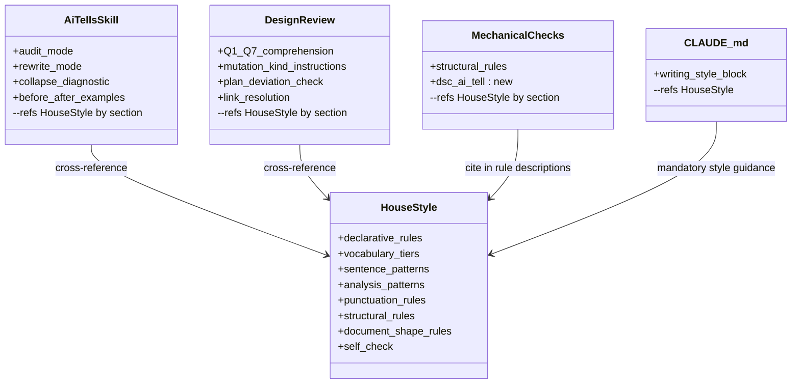
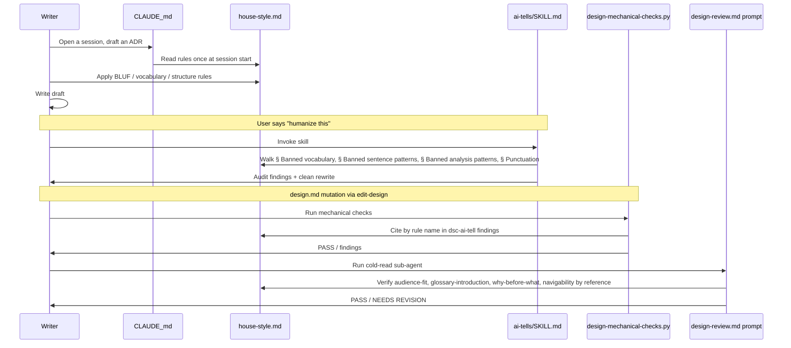

# House Style — Design

## Overview

This design is for contributors who maintain or read the project's writing-style infrastructure — the four `.claude/` files that govern prose across every authored surface (design, plan, track, issue, PR, commit body, comment, status prose), plus anyone whose drafting workflow runs against the consolidated `house-style.md`. It assumes familiarity with the BLUF (bottom-line-up-front) prose convention, the Architecture Decision Record (ADR) shape used under `docs/adr/`, the `D<N>` / `Invariant <N>` notation used in this project's References footers, and the YTDB issue scope split: YTDB-836 (this consolidation) and YTDB-837 (the follow-up that expands `house-style.md` pointers into additional files, out of scope here).

Four files currently carry overlapping declarative rules about how project prose should read: `.claude/output-styles/concise-doc.md` (BLUF + banned vocabulary + em-dash discipline), `.claude/skills/ai-tells/SKILL.md` (~70% catalogue overlap with concise-doc plus audit/rewrite workflow), `.claude/workflow/prompts/design-review.md` (declarative rules mixed with comprehension verification), and `.claude/scripts/design-mechanical-checks.py` (structural regex rules, no AI-tell scan). Every rule change touches three files; the cold-read prompt has grown to 346 lines repeating shapes that other files already state.

This design consolidates every declarative writing rule into a single renamed file, `.claude/output-styles/house-style.md`, and converts the three other files into thin overlays that cross-reference it. The classic editorial term "house style" matches the actual scope — a project-internal style book covering vocabulary, tone, structure, and document shape across every written surface.

The enabling primitive is **cross-reference by section name**: every rule lives once in `house-style.md`, and every other file points to it via `house-style.md § <Section name>`. The mechanical script gains a new `dsc-ai-tell` rule that automates the subset of `house-style.md` patterns that can be detected by regex, while the cold-read prompt shrinks to verification-only mode (Q1-Q7 comprehension plus a checklist that names each rule by reference).

Four discrete artifacts change as a group: `house-style.md` (renamed and broadened, absorbing rules from three other files plus 12 humanizer-gap patterns), `ai-tells/SKILL.md` (trimmed to ≤80 lines, procedural overlay), `design-review.md` (trimmed to ≤200 lines, verification-only), and `design-mechanical-checks.py` (gains `dsc-ai-tell`). Fourteen string references to the old `concise-doc` / `Concise Doc` name are updated across `CLAUDE.md`, `.claude/skills/code-review/SKILL.md`, `.claude/agents/review-workflow-consistency.md`, `.claude/agents/review-workflow-writing-style.md`, and the renamed source file's own frontmatter — see § Rename: every reference site across the repo for the full table. The `dsc-ai-tell` regex is calibrated against three known-good ADRs (`persist-visible-count`, `index-gc`, `non-durable-wow`) selected as the empirical false-positive baseline because they ship merged on `develop` and were written in the target style.

Document roadmap: § Core Concepts defines the three new terms. § Class Design shows the four artifacts and their cross-reference topology before and after. § Workflow shows the rule-lookup path a writer or reviewer traces. § Internal layout of `house-style.md` specifies the consolidated file's section structure. § dsc-ai-tell calibration specifies the four regex refinements derived from probing the three known-good ADRs. § Rename: every reference site across the repo enumerates every string-reference location. This design fits inside `design.md`; no companion `design-mechanics.md` is needed because the prose is under the 2,000-line split trigger.

## Core Concepts

**House style.** The renamed `.claude/output-styles/house-style.md` (formerly `concise-doc.md`). Single source of declarative writing rules for the project — vocabulary, sentence patterns, analysis patterns, punctuation, structural rules, and document-shape rules. Referenced by name from every other writing-style surface (the `ai-tells` skill, the cold-read prompt, the mechanical script, and the workflow agents). → § House-style organization.

**dsc-ai-tell.** The new mechanical-check rule added to `design-mechanical-checks.py`. Implements the subset of `house-style.md` patterns that can be detected by regex without judgment: Tier-1 vocabulary scan, negative parallelism, em-dash density, Title Case headings (H2+), signposting openers, copula avoidance, authority tropes, hyphenated word-pair clusters, and fragmented headers. Findings are `auto_applicable: false` — rewrites need human judgment. → § dsc-ai-tell calibration.

**Humanizer gap patterns.** Twelve AI-writing patterns identified from a gap analysis against the [blader/humanizer](https://github.com/blader/humanizer) catalogue that are missing from current concise-doc and ai-tells: superficial -ing analyses, copula avoidance, passive voice / subjectless fragments, filler phrases, excessive hedging, generic positive conclusions, persuasive authority tropes, signposting, fragmented headers, hyphenated word-pair overuse, elegant variation, and false ranges. Each is named in `house-style.md § Banned analysis patterns` with an inline before/after example. → § House-style organization.

## Class Design

**TL;DR.** Four artifacts after the refactor: one writer (`house-style.md`) and three readers (`ai-tells/SKILL.md`, `design-review.md` cold-read prompt, `dsc-ai-tell` rule in `design-mechanical-checks.py`), plus `CLAUDE.md` as the integration point that declares the file mandatory for the listed surfaces. Every rule change touches one file.

The four artifacts and their cross-reference topology after the refactor:



Before the refactor, the same boxes existed but with arrows reversed and duplicated: `concise-doc.md`, `ai-tells/SKILL.md`, and `design-review.md` each carried their own copy of the vocabulary / sentence-pattern / structural rules. The mechanical script had no AI-tell scan and no rule-citation edges to any prose source.

The four-file post-refactor topology gives one writer (`house-style.md`) and three readers (`ai-tells`, `design-review`, `dsc-ai-tell`), plus the `CLAUDE.md` integration point that declares the file mandatory for the listed surfaces. Every rule change touches one file.

## Workflow

**TL;DR.** Writer, cold-read sub-agent, and mechanical script all look up rules in `house-style.md` by section name. The sequence diagram below traces the new lookup path; the behavioral change is that no actor duplicates a rule.

Before the consolidation, a writer drafting an ADR who needed a specific rule had to know which of four files held it: vocabulary lived in `concise-doc.md`, audit workflow in `ai-tells/SKILL.md`, structural rules in `design-review.md`, and regex enforcement in `design-mechanical-checks.py`. Drift between the four sources meant the writer could follow the rule in one file and still trip the check in another. After the consolidation, every actor — writer, cold-read sub-agent, mechanical script — looks up rules in the same file by the same section names.



The key behavioral change: `house-style.md` is read by every actor — directly by the writer (via CLAUDE.md's mandatory directive), structurally by the cold-read prompt (which names rules and asks "does this section satisfy `house-style.md § Why-before-what`?" rather than restating the rule), and semantically by the mechanical script (which cites the rule name in every finding description). No actor duplicates the rule.

## Internal layout of `house-style.md`

**TL;DR.** `house-style.md` organizes rules into nine top-level sections that progress from affirmative anchors (BLUF, voice) through narrowest-to-broadest banned patterns (vocabulary → sentence → analysis → punctuation → structural) to document-shape rules (the design-doc-specific subset) and close with a self-check. The 12 humanizer-gap patterns live under § Banned analysis patterns with inline before/after examples.

The full section list:

```
## What this style governs
## BLUF lead
## Voice and tone
## Banned vocabulary
    ### Tier 1 — hard ban
    ### Tier 2 — strongly avoid
    ### Tier 3 — promotional language
    ### Era-specific (current as of May 2026)
## Banned sentence patterns
    ### Negative parallelism
    ### Sycophantic openers
    ### Throat-clearing
    ### Closing phrases
    ### Trailing hedges
    ### Prompt-restating
    ### Knowledge-cutoff disclaimers
## Banned analysis patterns
    ### Superficial -ing analysis            <- humanizer §3
    ### Copula avoidance                     <- humanizer §8
    ### Passive voice and subjectless         <- humanizer §13
    ### Hedge stacking
    ### Filler hedges
    ### Vague attribution
    ### Generic positive conclusions          <- humanizer §25
    ### Persuasive authority tropes          <- humanizer §27
    ### Signposting                          <- humanizer §28
    ### Elegant variation                    <- humanizer §11
    ### False ranges                         <- humanizer §12
## Punctuation and typography
    ### Em-dash discipline
    ### Hyphenated word-pair overuse          <- humanizer §26
    ### Curly quotes
    ### Excessive boldface
## Structural rules
    ### Section length cap
    ### Bullet discipline
    ### Inline-header lists
    ### Title Case headings forbidden
    ### Heading hierarchy
    ### Fragmented headers                   <- humanizer §29
    ### No faux-symmetry
## Document-shape rules (design/ADR-specific)
    ### Overview concept-first
    ### Audience-fit
    ### Glossary-introduction
    ### Why-before-what
    ### Navigability
    ### Edge cases sub-section required
    ### References footer shape
    ### Same-shape sibling consolidation
## Self-check
```

**Rationale for the ordering.** BLUF + Voice come first because they are the affirmative anchors — every other rule is "what to remove"; without anchors the negative rules are decontextualized. Banned-pattern sections progress narrowest to broadest (single word → phrase → sentence → punctuation → paragraph → document). Document-shape rules live last in the drafting region because they apply only to design/ADR surfaces — a contributor writing a commit body or a status update can stop reading after § Structural rules.

**12 humanizer-gap patterns, each with before/after.** Acceptance requires inline examples; one example block per pattern in `### <Pattern name>` style, roughly 5 lines per pattern (before line, after line, one-line rationale). Total gap-section weight: ~60 lines.

**Length budget.** Estimated 400-500 lines total. Well under the 2,000-line `design-mechanics.md` trigger; well above current `concise-doc.md`'s 92 lines; remains scannable.

**Frontmatter.**

```yaml
---
name: House Style
description: BLUF-first project house style — vocabulary, tone, structure, and document-shape rules for design / plan / track / issue / PR / commit-body / comment / status prose. Strips AI-tell vocabulary, hedging, faux-symmetric structure.
---
```

The frontmatter `name: House Style` lets the existing `/output-style` slash command pick the file up unchanged (the slash command reads `name:`, not the filename).

### References

- D2: Consolidate declarative rules into `house-style.md`.
- Invariant 2: `house-style.md` is the only declarative source — `ai-tells`, `design-review`, and `dsc-ai-tell` cross-reference by section name.

## dsc-ai-tell calibration

**TL;DR.** Eight regex rules become the new `dsc-ai-tell` check function in `design-mechanical-checks.py`. Four are safe to ship as proposed in YTDB-836 (Tier-1 vocabulary, negative parallelism, signposting, copula/authority tropes); four need refinements to avoid false positives on technical ADR prose (Title Case heading must exempt H1; hyphenated-pair rule restricted to adjectival clusters within a paragraph; em-dash density uses blank-line-bounded paragraph detection; fragmented-header rule requires heading-lemma overlap, not just length).

**Refinement 1 — Title Case heading regex starts at `^#{2,6}`.** All three known-good ADRs have legitimate Title-Case H1 document titles ("Persist Approximate Index Entries Count — Architecture Decision Record"). Limiting the rule to H2+ preserves the convention that document titles use Title Case while H2+ section headings use sentence case. No other heading-level false positives observed on the three ADRs.

**Refinement 2 — Hyphenated word-pair rule restricted to adjectival clusters in a paragraph.** Hyphenated-pair density on the three known-good ADRs ranges from 7.5 to 23.3 per 500 words. The high count on `non-durable-wow` (23.3/500w) is legitimate technical compound nouns (`write-ahead`, `in-memory`, `log-structured`, `non-durable`, `on-disk`). The humanizer's underlying signal is *adjectival ornament* ("fast-paced", "well-crafted", "next-generation"), not repetition of one technical term. The rule fires when 3+ **distinct** hyphenated pairs appear in the same paragraph (blank-line-bounded outside fenced code) AND the pairs sit in adjectival position (immediately before a noun, or in a comma-separated list of modifiers). Repetition of `write-ahead` 20 times in one section does not trigger; "the fast-paced, well-crafted, next-generation design" does.

**Refinement 3 — Em-dash density uses paragraph detection.** "≤1 em-dash per paragraph" requires real paragraph detection, not per-line. The script already has fence-aware parsing (`parse_code_fence`, `fence_closes`); reuse it. Paragraph = blank-line-bounded block outside fenced code. Empirical em-dash counts in known-good ADRs: 11/141 lines, 12/183 lines, 15/274 lines — all well below the threshold given typical paragraph counts.

**Refinement 4 — Fragmented-header rule requires word-overlap detection.** "Heading followed by ≤1-line paragraph restating the heading lemma" needs lemma overlap, not just length. A 1-line paragraph after a heading is fine when the paragraph adds information; it is the AI tell only when the paragraph echoes the heading's content words. Implementation: take the heading's content words (lower-cased, stop-words removed), check the following 1-line paragraph for the same content words, fire if ≥50% overlap. If empirically noisy, demote severity from `should-fix` to `suggestion`.

**Severity, finding shape, and auto-applicability.** Each `dsc-ai-tell` finding follows the existing `make_finding` schema in `design-mechanical-checks.py`:

```python
make_finding(
    severity="should-fix",
    rule="dsc-ai-tell",
    location=f"{path}:{lineno}",
    description=f"<pattern name> per house-style.md § <Section>: '<matched text>'",
    suggested_fix="<one-line suggestion>",
    auto_applicable=False,  # rewrites need judgment
)
```

Each pattern within `dsc-ai-tell` is sub-typed in the description (`Tier-1 vocabulary`, `negative-parallelism`, `signposting`, etc.) so a reviewer can grep the JSON output by pattern type.

**Test fixture.** A seeded `dsc-ai-tell-fixture.md` at `.claude/scripts/tests/fixtures/` contains one paragraph per banned pattern. A companion runner (`.claude/scripts/tests/run-dsc-ai-tell-validation.sh` or similar) invokes `design-mechanical-checks.py` against (a) the fixture — expects ≥1 finding per pattern; (b) the three known-good ADRs — expects zero `dsc-ai-tell` findings. Documented in `house-style.md § Self-check` as the verification recipe.

### References

- D3: `dsc-ai-tell` calibration approach (four refinements).
- D4: Test fixture and verification approach.
- Invariant 3: Zero false positives on `persist-visible-count`, `index-gc`, `non-durable-wow`.

## Rename: every reference site across the repo

**TL;DR.** Fourteen string references to `concise-doc` / `Concise Doc` are spread across five files: `CLAUDE.md` (2, including the `/output-style concise-doc` slash-command line), `.claude/skills/code-review/SKILL.md` (1), `.claude/agents/review-workflow-consistency.md` (1), `.claude/agents/review-workflow-writing-style.md` (9, heavily threaded), and `.claude/output-styles/concise-doc.md` itself (1, frontmatter `name:`). The table below adds one more row (the line-3 `description:` rewrite, a content rewrite shipping with the rename rather than a grep match), bringing the total reference-site count to 15. The find-and-replace is mechanical but must be exhaustive: the acceptance criterion is **zero grep matches** across `.claude/`, `docs/`, and `CLAUDE.md`.

**Full surface enumeration.**

| File | Line | Current text | New text |
|---|---|---|---|
| `.claude/output-styles/concise-doc.md` | 2 | `name: Concise Doc` | `name: House Style` (in renamed file) |
| `.claude/output-styles/concise-doc.md` | 3 | `description: BLUF-first writing style for design docs…` | (replaced — see § House-style organization for new frontmatter) |
| `CLAUDE.md` | 93 | `…use the **Concise Doc** output style at \`.claude/output-styles/concise-doc.md\`…` | `…use the **House Style** output style at \`.claude/output-styles/house-style.md\`…` |
| `CLAUDE.md` | 102 | `…suggest \`/output-style concise-doc\`…` | `…suggest \`/output-style house-style\`…` |
| `.claude/skills/code-review/SKILL.md` | 313 | `concise-doc style: banned vocabulary…` | `house-style: banned vocabulary…` |
| `.claude/agents/review-workflow-consistency.md` | 72 | `"Concise Doc style"` must match the canonical name in their source file (`.claude/output-styles/concise-doc.md`).` | `"House Style"` must match the canonical name in their source file (`.claude/output-styles/house-style.md`).` |
| `.claude/agents/review-workflow-writing-style.md` | 3 | `per the concise-doc output style. Dispatched by /code-review.` | `per the house-style output style. Dispatched by /code-review.` |
| `.claude/agents/review-workflow-writing-style.md` | 7 | `project's **concise-doc** output style` | `project's **house-style** output style` |
| `.claude/agents/review-workflow-writing-style.md` | 9 | `## Project context — concise-doc style` | `## Project context — house-style` |
| `.claude/agents/review-workflow-writing-style.md` | 11 | `The project ships a \`.claude/output-styles/concise-doc.md\` style…` | `The project ships a \`.claude/output-styles/house-style.md\` style…` |
| `.claude/agents/review-workflow-writing-style.md` | 13 | `Read \`.claude/output-styles/concise-doc.md\` once…` | `Read \`.claude/output-styles/house-style.md\` once…` |
| `.claude/agents/review-workflow-writing-style.md` | 26 | `Use **\`Read\`** on the changed files and on \`.claude/output-styles/concise-doc.md\`…` | `Use **\`Read\`** on the changed files and on \`.claude/output-styles/house-style.md\`…` |
| `.claude/agents/review-workflow-writing-style.md` | 62 | `The concise-doc rule is one per paragraph…` | `The house-style rule is one per paragraph…` |
| `.claude/agents/review-workflow-writing-style.md` | 102 | `Read \`.claude/output-styles/concise-doc.md\` once.` | `Read \`.claude/output-styles/house-style.md\` once.` |
| `.claude/agents/review-workflow-writing-style.md` | 137 | `The concise-doc style is **mandatory**…` | `The house-style is **mandatory**…` |

**Verification.** After every find-and-replace step, run:

```bash
grep -rnE "concise-doc|Concise Doc" .claude/ docs/ CLAUDE.md
```

The acceptance criterion is zero matches. The file rename uses `git mv .claude/output-styles/concise-doc.md .claude/output-styles/house-style.md` to preserve history.

**Out of scope per the issue.** YTDB-836 does NOT expand pointers to `house-style.md` into new files (e.g., `conventions.md`, workflow prompts, implementer/orchestrator files). Those pointer additions land in YTDB-837. This track only updates *existing* references.

### References

- D1: Rename approach (full rename + FRR vs minimal rename).
- Invariant 1: Zero grep matches for `concise-doc` / `Concise Doc` across `.claude/`, `docs/`, `CLAUDE.md`.
