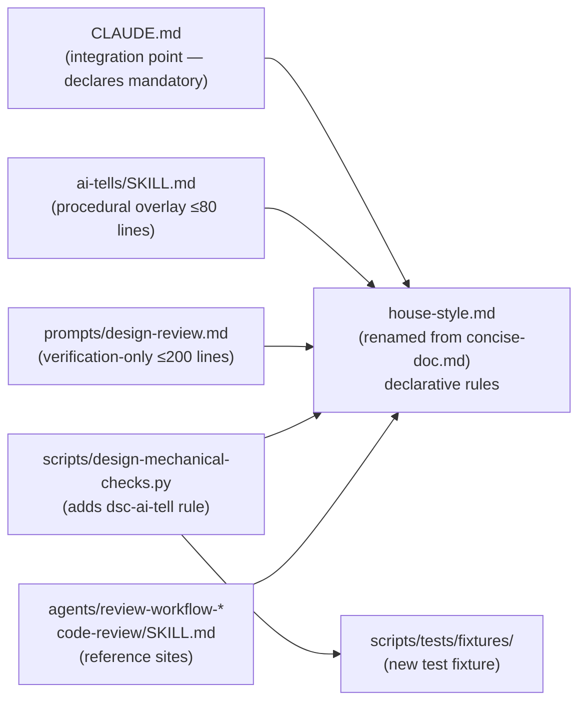

# House Style

## Design Document
[design.md](design.md)

## High-level plan

### Goals

Consolidate declarative writing rules from four overlapping files into a single renamed source (`.claude/output-styles/house-style.md`) and convert the other three into thin overlays that cross-reference it. Every rule change should touch one file, not three. Add the missing AI-tell mechanical-check rule (`dsc-ai-tell`) so the existing structural pipeline catches the subset of writing-style patterns detectable by regex. Land before YTDB-832 (which adds new cold-read trigger entries) and before YTDB-837 / YTDB-838 (both block on the rename).

### Constraints

- **Backward compatibility — none required.** The four target files are project-internal `.claude/` infrastructure. No external consumers; the `/output-style` slash command reads frontmatter `name:`, so the file rename plus frontmatter update keeps invocation working.
- **Acceptance gate — zero grep matches.** After Track 1 lands, `grep -rnE "concise-doc|Concise Doc" .claude/ docs/ CLAUDE.md --exclude-dir=_workflow` must return zero results. `--exclude-dir=_workflow` skips the planning artifacts under `docs/adr/ytdb-836-house-style/_workflow/` that legitimately document the old name; that directory is removed by the Phase 4 cleanup commit before merge into `develop` per `CLAUDE.md § Workflow Artifacts`, so the post-merge tree has zero matches by the same gate without the flag.
- **`dsc-ai-tell` calibration baseline.** Zero false positives on three named ADRs: `docs/adr/persist-visible-count/adr.md`, `docs/adr/index-gc/adr.md`, `docs/adr/non-durable-wow/adr.md`. Empirical data collected during research: Tier-1 vocab scan and signposting / copula / authority regexes are clean on all three; Title Case rule must exempt H1; hyphenated-pair rule must distinguish adjectival clusters from technical compounds (non-durable-wow has 23.3 hyphenated pairs per 500 words, all legitimate).
- **Length budgets per the issue acceptance criteria.** `ai-tells/SKILL.md` ≤ 80 lines, `design-review.md` ≤ 200 lines.
- **File rename uses `git mv`** to preserve history.
- **No scope creep into YTDB-837 / YTDB-838.** Updating *existing* `concise-doc` / `Concise Doc` string references is in scope; *adding new* `house-style.md` pointers into files that don't currently reference the rules (workflow prompts beyond `design-review.md`, agent prompts beyond the two named above, implementer/orchestrator files, `conventions.md`) is out of scope.

### Architecture Notes

#### Component Map

- **`house-style.md`** — created by `git mv` from `concise-doc.md`, then rewritten to absorb the consolidated rule set per `design.md § Internal layout of house-style.md`. **Track 1.**
- **`ai-tells/SKILL.md`** — trimmed to ≤80 lines; keeps audit/rewrite mode toggle, "collapse-without-opener" diagnostic, and before/after examples; cross-references `house-style.md` by section name. **Track 2.**
- **`prompts/design-review.md`** — trimmed to ≤200 lines; strips declarative rule statements; each verification entry references the rule by name (e.g., "Verify audience-fit per house-style.md § Audience-fit"). Keeps Q1-Q7, `phase4-creation` plan-deviation surfacing, and mutation-kind-specific instructions. **Track 3.**
- **`design-mechanical-checks.py`** — gains `check_dsc_ai_tell` function; each finding cites `house-style.md § <Section>` in its `description`. **Track 4.**
- **`CLAUDE.md`** — § Writing Style block updated to reference the new filename and the broader scope. **Track 1.**
- **Agents (`review-workflow-consistency.md`, `review-workflow-writing-style.md`) and `code-review/SKILL.md`** — string references updated as part of the FRR sweep. **Track 1.**
- **`scripts/tests/fixtures/dsc-ai-tell-fixture.md`** — new seeded fixture exercising every banned pattern; companion runner verifies fixture hits and the three known-good ADRs stay clean. **Track 4.**

#### D1: Full rename to `house-style.md` (vs minimal rename or sibling file)

- **Alternatives considered**: (a) keep `concise-doc.md`, just broaden the frontmatter description; (b) add `house-style.md` as a sibling file pointing back to `concise-doc.md` for the legacy rules; (c) full rename + find-and-replace across the repo (chosen).
- **Rationale**: (a) leaves a misleading filename ("only documents", "only conciseness") that mismatches the actual scope (vocabulary, tone, structure, document shape across every authored surface). (b) doubles the lookup surface and creates two sources of truth, which is exactly the problem the refactor exists to solve. (c) gives one authoritative file name that matches the editorial term writers use ("the house style"). The rename surface is bounded (14 string references in 5 files, all internal `.claude/` infrastructure).
- **Risks/Caveats**: missed string references would violate the acceptance criterion. Mitigation: run `grep -rnE "concise-doc|Concise Doc" .claude/ docs/ CLAUDE.md` after every FRR step and require zero matches before commit. The `git mv` preserves history.
- **Implemented in**: Track 1 (step references added during execution).
- **Full design**: design.md §"Rename: every reference site across the repo"

#### D2: Consolidate declarative rules into `house-style.md`

- **Alternatives considered**: (a) leave the rules duplicated across four files (status quo); (b) consolidate rules into the existing `ai-tells` skill; (c) consolidate into a new `house-style.md` and convert the other three into thin overlays (chosen).
- **Rationale**: (a) every rule change touches three files, with measurable drift between sources (the cold-read prompt at 346 lines mostly restates rules already in concise-doc and ai-tells). (b) `ai-tells` is a skill — it's invoked deliberately by the user; a writer drafting an ADR should not have to invoke a skill to know what the rules are. (c) gives one authoritative declarative source that every other artifact (skill, cold-read prompt, mechanical script, agents) references by section name. The `ai-tells` skill becomes the procedural audit/rewrite tool that *applies* the rules; the rules themselves live in the style file.
- **Risks/Caveats**: cross-references between `house-style.md` and the three readers must use stable section names — section renames after this lands would break every reader. Mitigation: the section structure is fixed in `design.md § Internal layout of house-style.md` and validated during Track 1.
- **Implemented in**: Tracks 1, 2, 3.
- **Full design**: design.md §"Internal layout of `house-style.md`"

#### D3: `dsc-ai-tell` calibration approach — four refinements over the issue's literal regex list

- **Alternatives considered**: (a) ship the regex list from YTDB-836 § Scope item 5 verbatim; (b) apply four data-driven refinements informed by probing the three known-good ADRs (chosen); (c) ship only the regexes with proven zero false positives (Tier-1 vocab, negative parallelism, signposting, copula, authority) and defer the rest.
- **Rationale**: (a) the literal Title Case regex would false-positive on the legitimate Title-Case H1 ADR titles (`# Persist Approximate Index Entries Count — Architecture Decision Record`); the literal hyphenated-pair density rule would false-positive on `non-durable-wow.md` (23.3 pairs/500w of legitimate technical compounds). (c) drops useful checks that *would* work with refinement. (b) calibrates each rule against real data: Title Case → H2+ only; hyphenated-pair → adjectival clusters in a paragraph only; em-dash density → paragraph detection using existing fence-aware parser; fragmented-header → word-overlap with heading lemma. All four refinements are mechanical and absorbable inside Track 4 — no scope inflation.
- **Risks/Caveats**: the fragmented-header word-overlap heuristic may be empirically noisy; the design names a fallback (demote severity to `suggestion`) if Track 4 validation shows false positives. The hyphenated-pair adjectival-detection regex is heuristic — sentence parsing is hard; if the regex over-fires, demote severity.
- **Implemented in**: Track 4.
- **Full design**: design.md §"dsc-ai-tell calibration"

#### D4: Test fixture and verification approach

- **Alternatives considered**: (a) inline test cases in the script's docstring; (b) Python unit-test file; (c) seeded markdown fixture + shell runner that invokes the script (chosen).
- **Rationale**: (c) keeps the test infrastructure aligned with how the script is invoked in real use — `python3 design-mechanical-checks.py --design-path <fixture>` — and produces a JSON output that the runner can grep for the expected `dsc-ai-tell` rule hits. The fixture lives at `.claude/scripts/tests/fixtures/dsc-ai-tell-fixture.md` and contains one paragraph per banned pattern; the runner invokes the script against (i) the fixture (expect ≥1 finding per pattern type) and (ii) the three known-good ADRs (expect zero `dsc-ai-tell` findings). No Python unit-test scaffolding to set up.
- **Risks/Caveats**: shell runner can't easily express per-pattern expectations as cleanly as a unit test — Track 4 review should confirm the runner output is reviewer-friendly (each expected/actual mismatch printed clearly).
- **Implemented in**: Track 4.
- **Full design**: design.md §"dsc-ai-tell calibration" (Test fixture sub-paragraph)

#### D5: Fold scope item 5 (mechanical-checks regex pass) into a single PR with items 1-4

- **Alternatives considered**: (a) ship items 1-4 as one PR and item 5 as a separate standalone PR (the issue's literal "can ship as a standalone PR" suggestion); (b) fold item 5 into the same PR as items 1-4 (chosen).
- **Rationale**: item 5 is *functionally* independent — its regex doesn't depend on the file rename. But the `dsc-ai-tell` finding descriptions cite `house-style.md § <Section>` by name; landing item 5 first would either require placeholder citations (to be updated after items 1-4 land) or commit messages that don't compile against current state. Landing as one PR keeps every commit self-consistent and matches user direction during research. Track 4 still runs in parallel with Tracks 2 and 3 (no inter-track dependency) — folding affects PR shape, not execution sequencing.
- **Risks/Caveats**: larger PR is slightly harder to review. Mitigation: the four tracks decompose by file, so the diff has clear per-file boundaries.
- **Implemented in**: All four tracks land in one PR.

### Invariants

- **Invariant 1 — Zero grep matches.** `grep -rnE "concise-doc|Concise Doc" .claude/ docs/ CLAUDE.md --exclude-dir=_workflow` returns zero results after Track 1 completes. Test: end-of-track shell check. The `--exclude-dir=_workflow` flag scopes the gate to live in-scope files; the planning artifacts under `docs/adr/ytdb-836-house-style/_workflow/` legitimately reference the old name and are removed by the Phase 4 cleanup commit before merge.
- **Invariant 2 — Single declarative source.** `house-style.md` is the only declarative source. `ai-tells/SKILL.md` and `prompts/design-review.md` cross-reference by section name; neither restates rules. Test: in each of `ai-tells/SKILL.md` and `prompts/design-review.md`, every occurrence of a declarative-rule phrase ("Banned vocabulary", "Em-dash discipline", "Title Case headings forbidden", etc.) must appear inside a `house-style.md § <Section>` cross-reference token. A free-standing heading or paragraph titled `## Banned vocabulary` (or equivalent declarative restatement) outside `house-style.md` is a violation. Mechanical form: `grep -nE "^#+\s+(Banned vocabulary|Em-dash discipline|Title Case headings forbidden)" .claude/skills/ai-tells/SKILL.md .claude/workflow/prompts/design-review.md` must return zero matches.
- **Invariant 3 — Zero false positives on three known-good ADRs.** `dsc-ai-tell` produces zero findings on `docs/adr/persist-visible-count/adr.md`, `docs/adr/index-gc/adr.md`, `docs/adr/non-durable-wow/adr.md`. Test: Track 4's runner script invokes `design-mechanical-checks.py` against each ADR and asserts the JSON output contains zero findings with `rule == "dsc-ai-tell"`.
- **Invariant 4 — Length caps.** `ai-tells/SKILL.md` ≤ 80 lines; `prompts/design-review.md` ≤ 200 lines. Test: `wc -l` at end of Tracks 2 and 3.

### Integration Points

- **`CLAUDE.md § Writing Style for Design Docs and Issues`** — updated to reference `house-style.md` by new name; the surface list (ADR / issue body / PR description / YouTrack issue body) is preserved.
- **`/output-style` slash command** — reads frontmatter `name:`; rename `Concise Doc` → `House Style` keeps invocation working. New slash-command form: `/output-style house-style`.
- **`edit-design` skill mutation pipeline** — `design-mechanical-checks.py` is invoked by `edit-design/SKILL.md § Step 3`; new `dsc-ai-tell` findings flow through the existing finding pipeline (review log, iteration loop) without changes to `edit-design`.

### Non-Goals

- **Activation hook on disk writes** (PreToolUse on `docs/adr/**`, `_workflow/**`, `issue-*.md`, source files) — covered by YTDB-837.
- **Activation hook on YouTrack MCP write tools** — covered by YTDB-838.
- **Expanding `house-style.md` pointers into new files** (`conventions.md`, additional workflow prompts, review agents, implementer / orchestrator files) — covered by YTDB-837.
- **`### Recipes` snippet for YouTrack issue authoring** — covered by YTDB-838.
- **New severity tier, new reviewer agent, new file-kind taxonomy** — out of scope; the existing `severity: should-fix` and the existing reviewer agents handle the new rules.
- **Retroactive rewrite of merged design docs** — out of scope; the mutation discipline already states "every mutation lands without introducing or worsening findings", not "every existing file passes today."
- **Always-on session `outputStyle: house-style`** in `.claude/settings.json` — out of scope; selective activation via the YTDB-837 / YTDB-838 hooks plus cognitive pointers in prompts is the chosen mechanism.

## Checklist

- [x] Track 1: Rename `concise-doc.md` → `house-style.md` and consolidate declarative rules
  > Move `concise-doc.md` to `house-style.md` via `git mv`, rewrite its content per `design.md § Internal layout of house-style.md` (absorbing ai-tells Tier-3 vocab + extra rules, design-review.md's Human-reader cold-read additions, design-review.md's Structural findings, and the 12 humanizer-gap patterns with inline before/after examples), update the frontmatter `name:` and `description:` to name the broader scope, and find-and-replace the 14 string references to `concise-doc` / `Concise Doc` across `CLAUDE.md`, `.claude/skills/code-review/SKILL.md`, `.claude/agents/review-workflow-consistency.md`, `.claude/agents/review-workflow-writing-style.md`, and the renamed source file's own frontmatter. The acceptance check is `grep -rnE "concise-doc|Concise Doc" .claude/ docs/ CLAUDE.md --exclude-dir=_workflow` returning zero matches.
  >
  > **Track episode:**
  > Track 1 consolidated four overlapping writing-style sources into one renamed declarative file at `.claude/output-styles/house-style.md` and swept the 14 string references across 4 live files plus the renamed source's own frontmatter. The new file (366 lines) absorbs Tier 3/4 vocab + structural cold-read rules + the 12 humanizer-gap patterns with inline before/after examples; downstream Tracks 2, 3, 4 cite its 10 canonical H2 sections. Iteration 1 of track review applied 6 follow-up fixes (2 self-violations in the source-of-truth file, 2 stale-framing fixes in `review-workflow-writing-style.md`, 2 cosmetic em-dash cleanups); gate check verified all clean. **Cross-track context:** the H2 `Document-shape rules (design / ADR-specific)` carries a trailing parenthetical Tracks 2-4 must cite verbatim if they cite the full heading; the inline banned-vocabulary lists that previously lived in the writing-style agent are now removed (the F3 delegation pattern is the durable shape for future vocabulary checks). One transient citation gap remains until Track 4 lands `dsc-ai-tell`.
  >
  > **Track file:** `plan/track-1.md` (3 steps, 0 failed; 1 review-fix iteration)
  >
  > **Strategy refresh:** CONTINUE — Track 1's 10 H2 section names are stable and Track 2's planned cross-references (`Banned vocabulary`, `Banned sentence patterns`, `Banned analysis patterns`, `Punctuation and typography`, `Structural rules`) all resolve. The trailing parenthetical on "Document-shape rules (design / ADR-specific)" is canonical but is not currently cited by Track 2.

- [x] Track 2: Trim `ai-tells/SKILL.md` to procedural overlay
  > Strip the static catalogue lists (vocabulary tiers, structural tells, tone tells, punctuation tells, content tells, era-specific tells) from `ai-tells/SKILL.md`. Keep the audit/rewrite mode toggle, the "if the sentence collapses without the opener, delete the whole sentence" diagnostic, and the before/after rewrite examples. Add cross-references to `house-style.md § <Section>` for the catalogue lookups, so a user invoking the skill is directed to the consolidated declarative source. Final file must be ≤ 80 lines.
  >
  > **Track episode:**
  > Track 2 trimmed `.claude/skills/ai-tells/SKILL.md` from 156 lines to 62 lines (18 lines of headroom under the 80-line cap). The static catalogue (vocabulary tiers, structural tells, tone tells, punctuation tells, content tells, era-specific tells) became a single `## Catalogue lookups` H2 with five cross-references into `.claude/output-styles/house-style.md`; the collapse-without-opener diagnostic moved under `## Workflow` with an explicit "Apply during Pass 1:" prefix so the procedural intent is unambiguous. Phase C surfaced 5 findings across 4 reviewer dimensions (WC + WP + WI + WS; WB had none, hook-safety skipped). All 5 accepted in iter-1, all 4 gate-checks PASS. The two should-fix findings were F1 (path anchor to `.claude/output-styles/house-style.md` under the H2 so a sub-agent invoked without project CLAUDE.md context can still resolve the path) and F5 (em-dash trim in the Step 1 episode paragraph). Three suggestions cleaned up the Tier-naming hint, the dedup intent between Structural and Tone bullets, and the Pass-1 binding on the relocated diagnostic. WP2's flag on the 856-char `description:` frontmatter was rejected at synthesis (acceptance gate (d) freezes the frontmatter byte-identical) and is left as a future cleanup candidate. **Cross-track context:** the 5 H2 names cited in the new `## Catalogue lookups` block all resolve live on disk, so Tracks 3 and 4 inherit a stable reference contract; Track 3's verification-only refactor of `design-review.md` and Track 4's `dsc-ai-tell` finding descriptions can cite the same H2 names without further coordination.
  >
  > **Track file:** `plan/track-2.md` (1 step, 0 failed; 1 review-fix iteration)

- [ ] Track 3: Refactor `prompts/design-review.md` to verification-only
  > Strip declarative rule statements from `prompts/design-review.md § Human-reader cold-read additions` (audience-fit, glossary-introduction, why-before-what, navigability) and from `§ Structural findings` (Overview concept-first, References footer, Edge cases, same-shape siblings). Each verification entry must reference the rule by name (e.g., "Verify audience-fit per house-style.md § Audience-fit"). Keep Q1-Q7 comprehension questions, plan-deviation surfacing for `phase4-creation`, and the mutation-kind-specific instructions. Final file must be ≤ 200 lines.
  > **Scope:** ~2 steps covering the verification-only refactor and the ≤200-line verification
  > **Depends on:** Track 1

- [ ] Track 4: Add `dsc-ai-tell` rule to `design-mechanical-checks.py`
  > Add a new `check_dsc_ai_tell` function to `design-mechanical-checks.py` that emits `dsc-ai-tell` findings for: Tier-1 banned vocabulary scan, negative parallelism (`\bit'?s not\b.*\bit'?s\b`), em-dash density (>1 per paragraph; reuse existing fence-aware parser), Title Case heading detection on H2+ (`^#{2,6}` only), signposting openers ("Let's dive", "Let's break", "Here's what you need"), copula avoidance ("serves as", "stands as"), persuasive authority tropes ("at its core", "fundamentally", "the real question"), hyphenated-pair adjectival clusters (3+ distinct pairs in same paragraph in adjectival position), and fragmented headers (heading + ≤1-line paragraph with ≥50% lemma overlap). Each finding cites `house-style.md § <Section>` in its description. `auto_applicable: false` — rewrites need judgment. Create test fixture at `.claude/scripts/tests/fixtures/dsc-ai-tell-fixture.md` exercising each pattern, plus a runner script that asserts (i) fixture hits ≥1 per pattern and (ii) the three known-good ADRs (`persist-visible-count`, `index-gc`, `non-durable-wow`) have zero `dsc-ai-tell` findings.
  > **Scope:** ~3 steps covering the check function, the test fixture + runner, and validation against the three calibration ADRs
  > **Depends on:** Track 1 (descriptions cite house-style.md by section name)

## Plan Review
- [x] Plan review (consistency + structural) — passed at iteration 2 (consistency); iteration 1 (structural)

**Auto-fixed (mechanical)**:
- CR2: added `STOP_WORDS: frozenset[str]` constant to Track 4's constants checklist (required by the fragmented-header content-word-overlap rule).
- CR3: corrected "Twelve / 12 string references" → "Fourteen / 14 string references" across six sites (`implementation-plan.md:54,116`, `plan/track-1.md:8,35,43`, plus the design.md § Rename TL;DR via `edit-design` mutation 2). The actual count is 14 (CLAUDE.md ×2 + code-review ×1 + review-workflow-consistency ×1 + review-workflow-writing-style ×9 + concise-doc.md frontmatter ×1) across five files.
- CR4: Track 4's `main()` placement pointer corrected from the structural-shape block (`if run_design_shape_checks:`) to the content-scan block (`if args.target in ("design", "both"):` next to `check_dsc_parenthetical_asides`).
- CR5: Invariant 2's test tightened with a concrete mechanical grep form so every declarative-rule phrase outside `house-style.md` is detectable in CI.
- CR6: Overview off-by-counting regression at design.md:13 (the CR3 iteration-1 sweep missed this seventh location) — fixed via `edit-design` mutation 3.
- CR7: Invariant 2's grep example "Title Case forbidden" updated to "Title Case headings forbidden" to match the actual planned `house-style.md` section name at design.md:157.

**Escalated (design decisions)**:
- CR1: Track 4's `check_dsc_ai_tell` signature scope. User chose **match the 5-arg bounded-aware sibling** — signature updated to `(file_path, lines, sections=None, changed_section=None, scope="whole-doc") -> List[Dict]` so bounded-mode mutations restrict findings to the changed section, consistent with `check_dsc_parenthetical_asides`.

**Structural review**: PASS iteration 1 with zero findings.

## Final Artifacts
- [ ] Phase 4: Final artifacts (`design-final.md`, `adr.md`)
