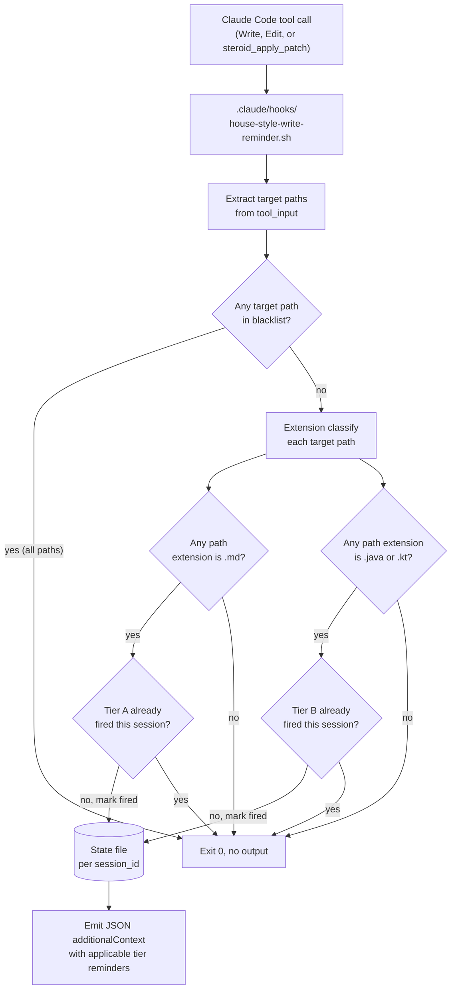

# Activate house style across the workflow — Design

## Overview

YTDB-836 consolidated the project's writing-style rules into one declarative file at `.claude/output-styles/house-style.md`. The rules are now authoritative there, but no mechanical surface fires them at write time and the workflow prompts, review agents, implementer files, and orchestrator files carry zero cross-references to the rule file. Implementer commit message bodies, code comments, continuous-log entries, status updates, inline-replanning prose, and review-report findings drift into AI register because no rule reaches them.

This design activates the rule set across the workflow with two complementary mechanisms. A PreToolUse hook fires on every `Write`, `Edit`, and `steroid_apply_patch` invocation (the apply-patch tool ID is `mcp__<server>__steroid_apply_patch` where the server-name segment is the user-global `mcpServers` registry key from `~/.claude.json`; the hook matches it via the regex `mcp__.+__steroid_apply_patch` so the same wiring works under any registry-key choice) whose target path matches an extension glob, surfacing the appropriate tier of rules via `hookSpecificOutput.additionalContext`. One-line in-prompt pointers in `conventions.md` (the new canonical anchor) plus 10 workflow prompts, 18 review agents, 4 implementer files, and 9 orchestrator files name the rule file by path so the reading agent knows where to load the rules from.

The enabling primitive is the existing PreToolUse hook pattern in `.claude/hooks/mcp-steroid-grep-reminder.sh`: JSON-via-stdout `hookSpecificOutput.additionalContext` emission, per-session state file keyed by the Claude pid walked from the process tree, jq-or-printf fallback. The new `house-style-write-reminder.sh` reuses this skeleton with a different matcher and a per-tier state model.

The mechanism splits along a three-tier model. Tier A applies the full rule set to all Markdown files. Tier B applies only the AI-tell subset (four sections of `house-style.md`) to Java and Kotlin source where the rule reaches code comments. Other tool inputs stay silent. Subsystems that change to fit: the `.claude/settings.json` hook wiring picks up a new `PreToolUse` entry; the project `CLAUDE.md § Writing Style` block broadens its surface list from four named bullets to "all Markdown files"; every prose-producing workflow file gains one citation line.

The remaining sections cover, in order: the hook runtime decision flow (Workflow); the mapping of each tier to specific sections of `house-style.md` (Tier mapping to house-style.md sections); how the hook extracts target paths from each invocation shape (Hook input parsing across three tool shapes); the state file that bounds reminders to once per session per tier (Rate-limit semantics); and the explicit list of files the hook stays silent on regardless of extension (Path blacklist for rule-source self-edits).

## Workflow



The hook reads the tool input from stdin as JSON, extracts every target path (`tool_input.file_path` for Write or Edit; `+++ b/<path>` lines from the patch text for `steroid_apply_patch`), and runs the decision pipeline above. Both tiers can fire from a single invocation when an apply-patch input mixes Markdown and source files. Both reminders concatenate into one `additionalContext` string because Claude Code accepts one hook output per call.

The hook never blocks the underlying tool invocation. Exit code is always 0, no `deny` decision, no stderr noise. Hook latency stays under the 5-second timeout configured in `.claude/settings.json` because every operation is local filesystem or in-process text parsing.

## Tier mapping to house-style.md sections

**TL;DR.** The full rule set covers Markdown; a four-fragment subset covers Java and Kotlin. The hook's stored reminders cite the rule file by repo-relative path and name each applicable fragment so a future restructure can be detected through `grep -L` rather than silent breakage.

The full mapping:

| Tier | Triggered by | Surfaces | Sections cited |
|---|---|---|---|
| A | `*.md` paths | Full house-style: BLUF lead, banned vocabulary, em-dash discipline, structural rules, document-shape rules | `house-style.md § BLUF lead`, `§ Voice and tone`, `§ Banned vocabulary`, `§ Banned sentence patterns`, `§ Banned analysis patterns`, `§ Punctuation and typography`, `§ Structural rules`, `§ Document-shape rules` |
| B | `*.java`, `*.kt` paths | AI-tell subset: vocabulary, sentence patterns, analysis patterns, em-dash discipline (no structural rules; no document-shape rules) | `house-style.md § Banned vocabulary`, `§ Banned sentence patterns`, `§ Banned analysis patterns`, `§ Em-dash discipline` |
| Silent | every other extension | nothing | n/a |

The four Tier-B sections are the rule fragments that apply equally at code-comment scale. Document-shape rules (Overview concept-first, Core Concepts, Edge-cases sub-sections, References footers) apply only to whole documents. Structural rules (BLUF, ≤200-word section cap) are document-scoped. Title-case heading checks fire on H2+ inside documents, not on prose lines inside a Java file.

D3 commits the pointers in Tracks 3-5 to citing these section names directly rather than via a synthetic anchor in `house-style.md`. The trade-off: if `house-style.md` is restructured and a section is renamed or merged, every Tier-B pointer plus the hook's stored strings must be updated in one commit. The mitigation is that the four section names are stable headings after YTDB-836, and a future rename can be detected mechanically through `grep` for the citation strings.

### Edge cases / Gotchas

- A path with no recognized extension (`Dockerfile`, `Makefile`, `LICENSE`) falls into the silent branch. Comment prose in these files is rare and the project carries few.
- A Markdown file under `.claude/output-styles/` matches Tier A by extension, but the path blacklist suppresses the reminder. See `Path blacklist for rule-source self-edits`.
- A Java file with no comments still triggers the Tier-B reminder if it is the first Java edit of the session. The hook is path-triggered, not content-triggered. The YTDB-837 acceptance bullet that names specific banned phrases describes the user-observable outcome (the reminder appearing on the same turn as the edit) without requiring the hook to inspect comment contents.

### References

- D-records: D1, D3, D6
- Invariants: none
- Mechanics: n/a

## Hook input parsing across three tool shapes

**TL;DR.** `Write` and `Edit` pass the target path directly. The MCP Steroid apply-patch variant (matched at the dispatch site by the regex `mcp__.+__steroid_apply_patch` since the `<server>` segment depends on how the MCP server is keyed in `~/.claude.json`) passes a patch string that may name multiple files via `+++ b/<path>` lines. A single jq pipeline normalizes both invocation styles into a JSON array of paths.

The jq pipeline:

```jq
.tool_name as $t
| if $t == "Write" or $t == "Edit" then [.tool_input.file_path]
  elif ($t | test("^mcp__.+__steroid_apply_patch$")) then
    [.tool_input.patch | scan("(?m)^\\+\\+\\+ b/(.+)$") | .[0]]
  else [] end
```

The settings.json matcher mirrors the regex shape (`"matcher": "Write|Edit|mcp__.+__steroid_apply_patch"`), so the dispatch-site regex and the hook-internal regex agree. The greedy `.+` covers server-name segments that contain double-underscores; `[^_]+` would be tighter but assumes server names never embed underscores.

Output is a JSON array of target paths the hook iterates over. When jq is unavailable, the script falls back to a Python one-liner that reads stdin, parses JSON via the standard library, and emits the same array shape. The fallback never escalates to a non-zero exit code.

The apply-patch input field name (`tool_input.patch` versus another field such as `tool_input.input` or `tool_input.patchText`) is confirmed during Phase A by reading `mcp-steroid://skill/apply-patch-tool-description` via `steroid_fetch_resource`. The pipeline above uses `tool_input.patch` as the working assumption; the actual field name will be fixed before the hook ships.

### Edge cases / Gotchas

- An apply-patch input that produces zero `+++` lines (malformed patch, stat-only patch) yields an empty array. The hook stays silent rather than emitting a fabricated reminder.
- An apply-patch input with mixed Tier-A and Tier-B target paths fires both reminders in one invocation. The decision flow handles this by emitting one JSON output whose `additionalContext` string concatenates both reminder bodies separated by a blank line.
- A relative `tool_input.file_path` is normalized via `realpath -m` (GNU coreutils) or `python3 -c 'import os; print(os.path.realpath(p))'` as portable fallback. Extension matching applies to the basename after normalization.

### References

- D-records: D4
- Invariants: Invariant 1: hook latency under 5 seconds (matches the existing `PreToolUse` timeout in `.claude/settings.json`)
- Mechanics: n/a

## Rate-limit semantics

**TL;DR.** The hook fires each tier reminder at most once per logical Claude session. State lives at `${TMPDIR:-/tmp}/house-style-reminder-${session_id}.txt`, a text file with one line per fired tier (`A` or `B`). The `session_id` is the top-level field of every PreToolUse hook input JSON; it changes on `/clear` and on every fresh conversation, so the throttle window resets exactly at the logical session boundary the reminder cares about. Concurrent sessions in different worktrees keep separate state because each has its own `session_id`.

State file lifecycle:

1. New conversation starts (or `/clear` runs): Claude Code generates a fresh `session_id`. The state file for that id does not yet exist.
2. First tool call matching a tier glob: the hook reads (or creates) the state file at `${TMPDIR:-/tmp}/house-style-reminder-${session_id}.txt`, checks for the tier letter, emits the reminder when the letter is absent, appends the letter, returns.
3. Subsequent calls in the same tier under the same `session_id`: state file contains the letter, hook stays silent.
4. First call in a different tier: reminder fires for the new tier, state file gains a second line.
5. `/clear` or a fresh conversation: Claude Code issues a new `session_id`; the state file path changes; reminders refire under the new id.
6. The Claude process exits: no automated cleanup of past state files. They persist in `/tmp` until reboot or manual cleanup. Stale files from past sessions don't interfere because the filename embeds the id.

The keying choice (session_id rather than Claude pid) is the load-bearing difference from `mcp-steroid-grep-reminder.sh`. That hook uses pid-tree walk keying because its 5-minute time-window throttling does not need to track logical session boundaries; the writing reminder does. Keying by pid would survive across `/clear` (the Claude process persists), which would silently suppress reminders the user expects to see after a context reset. The session_id key makes the reset automatic with no explicit cleanup logic in the hook script.

### Edge cases / Gotchas

- If `/tmp` (or the resolved `TMPDIR`) is unwritable, the hook degrades to firing every call. The reminder is informational and must not block the underlying tool invocation when state cannot be persisted. The hook still emits valid JSON; the only failure mode is extra reminders in a constrained environment.
- If two hook invocations fire concurrently under the same `session_id` (one Tier-A and one Tier-B in flight at the same instant, possible when an apply-patch input mixes extensions), both writes append to the state file. POSIX `O_APPEND` writes of short strings are atomic, and the file content stays correct (`A\nB` or `B\nA`).
- `/clear` does reset the reminder cadence (this is by design). Claude Code emits a fresh `session_id` after the clear, the state-file path changes, and the next Markdown or Java edit refires the appropriate tier reminder. The user-global `CLAUDE.md § Writing Style` block is also reloaded into the cleared context, so the user has both the auto-loaded rule pointer and a fresh hook reminder available early in the new session.

### References

- D-records: D2
- Invariants: Invariant 2: each tier reminder fires at most once per Claude session
- Mechanics: n/a

## Path blacklist for rule-source self-edits

**TL;DR.** The hook stays silent when any target path matches `.claude/output-styles/house-style.md`, `.claude/skills/ai-tells/SKILL.md`, `.claude/scripts/design-mechanical-checks.py`, or `.claude/scripts/tests/test_dsc_ai_tell.py`. Editing the rule file, its companion skill, or the mechanical-enforcement script should not surface the rule reminder itself.

The list is hardcoded in the hook script as a `case` block:

```bash
case "$path" in
  *.claude/output-styles/house-style.md) return 1 ;;
  *.claude/skills/ai-tells/SKILL.md) return 1 ;;
  *.claude/scripts/design-mechanical-checks.py) return 1 ;;
  *.claude/scripts/tests/test_dsc_ai_tell.py) return 1 ;;
esac
```

The function returns 1 (suppress reminder) on a match, 0 (no suppression) otherwise. The check runs against every target path that the parsing pipeline yields. A multi-file apply-patch where any path is blacklisted suppresses the reminder for that path only; non-blacklisted paths in the same input still fire their tier reminder.

The blacklist applies before the rate-limit check, so a session that edits only blacklisted files never fires either tier reminder and the state file stays empty. The rate-limit window is not burned by self-edits to the rule file.

### Edge cases / Gotchas

- A path like `.claude/output-styles/house-style.md.bak` does not match. The `case` patterns are exact suffixes after normalization.
- A new file joining the rule-source set (e.g., a future `.claude/output-styles/code-comment-style.md`) needs explicit addition to the blacklist. The hook does not auto-discover related rule files. The maintenance cost is one `case` line.
- The blacklist intentionally covers four files: the rule prose, the procedural skill that audits drafts, the mechanical regex enforcer, and the regex test fixtures. The fixture file is included because the test inputs contain literal AI-tell phrases that would otherwise trip the reminder when the test file is edited.

### References

- D-records: D6
- Invariants: Invariant 3: rule-source files never trigger their own reminder
- Mechanics: n/a
