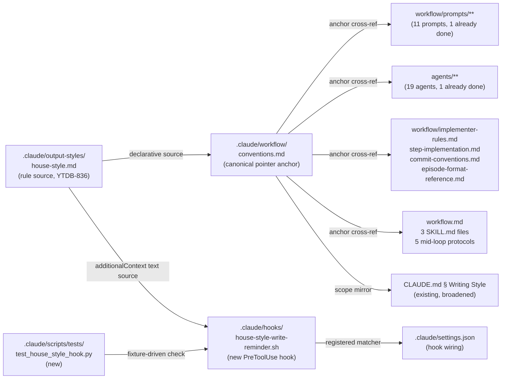

# Activate house style across the workflow

## Design Document
[design.md](design.md)

## High-level plan

### Goals

Activate `.claude/output-styles/house-style.md` across the workflow surface after YTDB-836 consolidated the rules into one declarative file. Today the rule file exists but only applies when Claude remembers to load and follow it via the project `CLAUDE.md § Writing Style for Design Docs and Issues` block. No mechanical surface fires the rules at write time, and the workflow prompts, review agents, implementer files, and orchestrator files all carry zero cross-references to the rule file. Implementer commit message bodies, code comments, continuous-log entries, status updates, inline-replanning prose, and review-report findings drift into AI register because no rule reaches them.

Two complementary mechanisms close the gap:

1. **PreToolUse hook** fires on `Write`, `Edit`, and any `mcp__<server>__steroid_apply_patch` invocation (server-name segment matched by regex, since the `~/.claude.json` registry key varies across installs) for tool inputs that target Markdown or Java/Kotlin source. Surfaces full house-style on Markdown (Tier A) and the AI-tell subset on Java/Kotlin (Tier B). Rate-limited per session per tier so the reminder lands once early in a writing burst, then stays silent.
2. **In-prompt pointers** in `conventions.md`, 10 of 11 workflow prompts, 18 of 19 prose-producing review agents, four implementer files, and nine orchestrator files. One-line cross-references by name; no rule restatement. (The two skipped files — `prompts/design-review.md` and `agents/review-workflow-writing-style.md` — already name house-style directly per YTDB-836.)

### Constraints

- **YTDB-836 stays authoritative.** This work adds activation surfaces; it does not change the rule set. `.claude/output-styles/house-style.md` and the `dsc-ai-tell` regex rule in `scripts/design-mechanical-checks.py` remain the sole sources of truth for what counts as in-style.
- **5-second hook timeout** (matches the existing `PreToolUse` timeout in `.claude/settings.json`). The implementation runs offline of any external service and degrades gracefully when `jq` is unavailable, mirroring the existing `mcp-steroid-*` hooks.
- **Hook must not block tool execution.** JSON-via-stdout `hookSpecificOutput.additionalContext` is the only output channel; no non-zero exit codes, no `deny` decisions, no stderr noise.
- **No always-on output style.** The `outputStyle: house-style` global setting stays out of scope per the YTDB-837 non-goal list (chat replies and ad-hoc work stay outside the hook).
- **Per-session state file** uses the `${TMPDIR:-/tmp}/house-style-reminder-${session_id}.txt` pattern keyed by the `session_id` field that Claude Code includes in every hook input JSON. `session_id` changes on `/clear` and on every fresh conversation, so the rate-limit window naturally resets at the logical session boundary the writing reminder cares about. Distinct from `mcp-steroid-grep-reminder.sh`, which keys by Claude pid (walked from the process tree) because its 5-minute time-window throttling does not need to track session boundaries.

### Architecture Notes

#### Component Map

- **`.claude/output-styles/house-style.md`** — Existing file from YTDB-836. Unchanged by this plan. Section names (`Banned vocabulary`, `Banned sentence patterns`, `Banned analysis patterns`, `Em-dash discipline`, `Structural rules`, `Document-shape rules`) are stable headings every pointer references by name.
- **`.claude/workflow/conventions.md`** — New § "Writing style for Markdown and prose artifacts" added by Track 1. Lists the tier mapping, names house-style.md as the rule source, and gives the citation every other pointer cross-refs. Loaded at every `/execute-tracks` startup.
- **`.claude/hooks/house-style-write-reminder.sh`** — New PreToolUse hook added by Track 2. Bash script following the pattern of `mcp-steroid-grep-reminder.sh` (jq-or-printf JSON emission, fail-silent on every error mode) but keyed by `session_id` extracted from the hook input JSON per D2 — diverging from the grep-reminder's Claude-pid keying and dropping its `stat` mtime read because per-session reset semantics make the 5-minute time window irrelevant. Per-tier state lives in `${TMPDIR:-/tmp}/house-style-reminder-${session_id}.txt`. Emits `hookSpecificOutput.additionalContext`.
- **`.claude/settings.json`** — Modified by Track 2 to add a `PreToolUse` matcher entry for `Write|Edit|mcp__.+__steroid_apply_patch` (regex on the server-name segment per D4) wired to the new hook.
- **`.claude/scripts/tests/test_house_style_hook.py`** — New stand-alone Python test runner added by Track 2 (invoked as `python3 .claude/scripts/tests/test_house_style_hook.py`, matching the existing `test_dsc_ai_tell.py` pattern). Fixture-driven coverage of tier matching, rate-limit, apply-patch input parsing, jq-fallback, path blacklist.
- **Workflow prompts** — `adversarial-review.md`, `consistency-gate-verification.md`, `consistency-review.md`, `create-final-design.md`, `dimensional-review-gate-check.md`, `review-gate-verification.md`, `risk-review.md`, `structural-gate-verification.md`, `structural-review.md`, `technical-review.md`. Track 3 adds one-line pointers. `design-review.md` already references house-style by name; skip.
- **Review agents** — All 19 except `review-workflow-writing-style.md` (already names house-style). Track 3 adds one-line pointers.
- **Implementer files** — Track 4 adds Tier-A pointer (log/commit/PR prose) and Tier-B pointer (code-comment prose) to the four named files.
- **Orchestrator files** — Track 5 adds Tier-B subset pointers to `workflow.md`, the three top-level `SKILL.md` files, and the five mid-loop protocols.
- **`CLAUDE.md § Writing Style`** — Track 1 broadens the scope from "ADR / design / issue / PR / YouTrack bodies" to "all Markdown files" so the project-level guidance mirrors the hook's broader Tier-A glob.

#### Invariants

All three are ASPIRATIONAL — Track 2 implements them. Each maps to a testable assertion in `.claude/scripts/tests/test_house_style_hook.py`.

- **Invariant 1: hook latency under 5 seconds.** The PreToolUse hook completes within the 5-second timeout configured in `.claude/settings.json`, matching the existing `mcp-steroid-grep-reminder.sh` hook's runtime envelope. *Assertion*: each Track 2 test case measures end-to-end subprocess duration and fails if any single invocation exceeds 5 s.
- **Invariant 2: each tier reminder fires at most once per Claude session.** Under one `session_id`, Tier A fires at most once and Tier B fires at most once regardless of how many tool invocations match. `/clear` or a fresh conversation issues a new `session_id` and the throttle resets. *Assertion*: Track 2 rate-limit test cases (a) confirm second-invocation-same-tier-same-session is silent; (b) confirm same-path-fresh-session re-fires the reminder.
- **Invariant 3: rule-source files never trigger their own reminder.** The four blacklisted paths (`.claude/output-styles/house-style.md`, `.claude/skills/ai-tells/SKILL.md`, `.claude/scripts/design-mechanical-checks.py`, `.claude/scripts/tests/test_dsc_ai_tell.py`) stay silent regardless of extension or tier. *Assertion*: Track 2 blacklist test cases confirm each blacklisted path produces no reminder and does not burn the rate-limit window for the matching tier.

#### D1: Extension-based tier matching, all `*.md` → Tier A

- **Alternatives considered**: (a) Literal globs from the YTDB-837 description (`docs/adr/**`, `_workflow/**`, `issue-*.md`) — risks missing project READMEs, module docs, CLAUDE.md, and `.claude/**/*.md` content. (b) Path-prefix matching by role (workflow vs docs vs root) — fragile, breaks on file moves. (c) Extension-based (chosen) — one stable rule.
- **Rationale**: User explicitly broadened scope mid-research: "we use *.md files for project documentation in wide patterns so we should apply to all *.md files." Markdown is the project's documentation prose register; the cost of one extra reminder on an unusual README edit is paid once per session via the rate-limit.
- **Risks/Caveats**: Hook fires on edits to `house-style.md` itself unless explicitly excluded. D6 covers the blacklist.
- **Implemented in**: Track 2

#### D2: Per-session per-tier rate-limit keyed by `session_id`

- **Alternatives considered**: (a) No rate-limit — fires every Write, noisy. (b) Time-window rate-limit (every N minutes, the pattern from `mcp-steroid-grep-reminder.sh`) — over-engineering for a once-per-session reminder, and `/clear` would silently inherit the prior window. (c) Per-Claude-pid keying — survives across `/clear` because the Claude process and pid persist, so a post-`/clear` "session" reads the prior state and stays silent (broken semantics for this reminder). (d) Per-`session_id` keying (chosen) — `session_id` is part of every PreToolUse hook input JSON, changes on `/clear` and on every fresh conversation, so the rate-limit naturally resets at the logical session boundary.
- **Rationale**: The reminder surfaces rules early in a writing burst. `/clear` is a logical session boundary (the user starts a fresh conversation context), so the reminder should fire again post-`/clear`. Keying by Claude pid would preserve state across `/clear` and silently suppress reminders the user expects to see. Keying by `session_id` makes the reset automatic with no explicit cleanup logic, and the hook code is simpler than the pid-tree walk pattern.
- **Risks/Caveats**: State files accumulate in `/tmp` over time (same as pid-keyed; no automated cleanup, relies on reboot). The hook diverges from the `mcp-steroid-grep-reminder.sh` precedent that uses pid-tree walk; the reviewer must understand that the two hooks have different keying because they encode different semantics (time-window vs per-logical-session). A session that writes Markdown after a long quiet period within the same session misses a fresh reminder; acceptable because the user-global `CLAUDE.md § Writing Style` stays in context throughout the session.
- **Implemented in**: Track 2

#### D3: Reference Tier-B subset sections by name in each pointer

- **Alternatives considered**: (a) Add a dedicated `Tier-B subset` anchor in `house-style.md` listing the four source sections — single lookup target, but doubles maintenance burden when the subset evolves. (b) Restate subset rules inline in each pointer — too much duplication across 30+ files. (c) Reference the four source sections by name in each Tier-B pointer (chosen) — explicit enough to navigate, no duplicate rule text.
- **Rationale**: User picked this option in research. Keeps `house-style.md` as the sole declarative source and pointers stay short.
- **Risks/Caveats**: If `house-style.md` is restructured, every pointer needs updating. Mitigation: the four section names are stable headings post-YTDB-836.
- **Implemented in**: Tracks 3, 4, 5

#### D4: MCP-server-agnostic matcher for `steroid_apply_patch`

- **Alternatives considered**: (a) `Write|Edit` only — misses multi-file patches that the implementer routes through MCP Steroid per `.claude/workflow/conventions.md §1.4 *Tooling discipline* → "Other mcp-steroid routes"`. (b) Hardcode the literal tool name `mcp__localhost-6315__steroid_apply_patch` — works for the current `~/.claude.json` registry but silently stops firing when the server is registered under a different name (`mcp-steroid`, `intellij`, etc.). (c) Regex match `mcp__.+__steroid_apply_patch` (chosen) — covers every registry-name choice, anchored on the stable tool-name suffix. (d) Add `steroid_execute_code` too — too broad; that tool accepts arbitrary Kotlin code and target paths are not extractable.
- **Rationale**: User flagged apply-patch coverage explicitly in research, then flagged the server-name fragility on re-read. The `mcp__<server>__<tool>` naming convention puts the user-global registry key in the middle segment; that key varies across teammates and installs. The tool-name suffix `steroid_apply_patch` is stable as long as the MCP Steroid plugin keeps its tool name. Claude Code's hook matcher is regex-based (the existing `"matcher": "Grep"` is one literal token in regex syntax), so `Write|Edit|mcp__.+__steroid_apply_patch` works.
- **Risks/Caveats**: The hook's jq pipeline must mirror the regex form via `test("^mcp__.+__steroid_apply_patch$")` to keep settings.json and the script in agreement. Greedy `.+` survives server names with double-underscores; `[^_]+` would be tighter but assumes server names never include underscores. Apply-patch input shape is `tool_input.hunks` — an array of `{file_path, old_string, new_string}` objects, not a single `file_path` or unified-diff string; the hook enumerates `hunks[].file_path` via `[.tool_input.hunks[].file_path] | unique` (jq) or the Python fallback's equivalent array walk. Confirmed against `mcp-steroid://skill/apply-patch-tool-description` during plan review.
- **Implemented in**: Track 2

#### D5: Acceptance via Python tests plus a manual smoke note

- **Alternatives considered**: (a) Tests only — misses the live-session sanity check the YTDB-837 acceptance criteria name explicitly. (b) Manual only — no regression coverage when the hook is changed later. (c) Both (chosen).
- **Rationale**: User picked this option in research. The hook is small; tests are cheap; the manual smoke note matches the issue's acceptance language verbatim. Pattern is established by the existing `.claude/scripts/tests/test_dsc_ai_tell.py` fixture-driven test.
- **Risks/Caveats**: The Python test suite under `.claude/scripts/tests/` already runs (see existing `test_dsc_ai_tell.py`), so no new tooling is required.
- **Implemented in**: Track 2

#### D6: Path blacklist for rule-source self-edits

- **Alternatives considered**: (a) No blacklist — minor self-reference noise when editing the rule file itself. (b) Env-var-controlled blacklist — adds config surface. (c) Hardcoded blacklist (chosen).
- **Rationale**: Two files explicitly carry house-style rule text (`house-style.md`, `ai-tells/SKILL.md`) and one script enforces them mechanically (`design-mechanical-checks.py`). Reminders are pointless on edits to these.
- **Risks/Caveats**: If new files join the rule-source set, the blacklist needs an update. Mitigation: blacklist is one case-block in the hook script, trivial to extend.
- **Implemented in**: Track 2

### Non-Goals

- Always-on `outputStyle: house-style` session setting (explicit non-goal from YTDB-837).
- Commit-msg git hook for vocabulary enforcement (explicit non-goal from YTDB-837).
- Retroactive rewrite of historical commits or merged docs (explicit non-goal from YTDB-837).
- Rule changes to `house-style.md` itself (those landed in YTDB-836).
- Hook coverage for `steroid_execute_code` invocations that write files via `VfsUtil.saveText`. The tool input is arbitrary Kotlin code; target paths are not extractable in 5 seconds.
- A new `Tier-B subset` section in `house-style.md` (D3 chose to reference the four source sections by name instead).

## Checklist
- [x] Track 1: conventions.md § Writing style anchor + CLAUDE.md scope broadening
  > Adds the canonical § "Writing style for Markdown and prose artifacts" section to `.claude/workflow/conventions.md` naming `house-style.md` as the rule source, listing the tier mapping (full house-style on Markdown, AI-tell subset on Java/Kotlin), and giving the citation every other pointer cross-refs. Also broadens the project `CLAUDE.md § Writing Style` block from the narrow 4-surface list to "all Markdown files" so project-level guidance mirrors the hook's Tier-A glob.
  >
  > **Track episode:**
  > Landed §1.5 *Writing style for Markdown and prose artifacts* in `.claude/workflow/conventions.md` as the canonical anchor for Tracks 2-5 and the Track 2 PreToolUse hook, and broadened the project `CLAUDE.md § Writing Style` block to cover all Markdown files plus three non-Markdown prose surfaces (PR titles/descriptions, commit-message bodies, YouTrack issue bodies). Phase C iteration 1 tightened the anchor: added a fourth tier-table row so the CLAUDE.md ↔ conventions.md mirror is symmetric, appended a locator grep recipe to §1.5's closing paragraph so future rename discipline has an operational instruction, and dropped a redundant CLAUDE.md enumeration that duplicated the new table row. All 4 dimensional gate-checks PASS at iteration 1.
  >
  > **Cross-track impact for Tracks 2-5:** the §1.5 heading slug `## 1.5 Writing style for Markdown and prose artifacts`, the relative path `../output-styles/house-style.md`, and the four banned-section names (`Banned vocabulary`, `Banned sentence patterns`, `Banned analysis patterns`, `Em-dash discipline`) are durable strings every downstream pointer must cite verbatim — the §1.5 locator grep depends on those exact section names to find pointer sites at future rename time. Tracks 3-5 cross-referencing the §1.5 tier table also inherit the new non-Markdown prose-surfaces row without needing a separate amendment.
  >
  > **Track file:** `plan/track-1.md` (2 steps, 0 failed)
  >
  > **Strategy refresh:** CONTINUE — no downstream impact detected.

- [x] Track 2: PreToolUse hook + settings + tests
  > Adds `.claude/hooks/house-style-write-reminder.sh` wired into `.claude/settings.json` under a `PreToolUse` matcher `Write|Edit|mcp__.+__steroid_apply_patch` (regex on the server-name segment so the hook fires regardless of how the MCP server is keyed in `~/.claude.json`). Implements extension-based tier matching (`*.md` → Tier A, `*.java|*.kt` → Tier B, else silent), per-session per-tier rate-limit, path blacklist for rule-source self-edits, apply-patch input parsing, and jq fallback. Adds Python tests under `.claude/scripts/tests/test_house_style_hook.py` covering tier matching, rate-limit semantics, apply-patch parsing, fallback paths.
  >
  > **Track episode:**
  > Landed the PreToolUse hook + settings wiring + three durable captured fixtures + a 17-case stand-alone Python validation runner. Hook keys per-session rate-limit state by the input JSON's `session_id` (not Claude pid) so `/clear` resets the throttle naturally; reminder bodies cite `conventions.md §1.5` and name the four Tier-B heading slugs from `house-style.md` verbatim, with `test_16_section_name_guard` standing in as a drift guard against future renames. Hook latency lands at 14-27 ms (5 s production timeout, 3 s test budget). Phase C surfaced one hook-safety guard the implementer refined (TMPDIR-non-writable + bash redirection-error stderr leak combination resolved via `test -w "$state_dir"` pre-check), four em-dash + one banned-pattern episode-prose fixes, and three minor consistency sweeps (`stat` mtime phrase removed from the plan, `§1.5` no-space form unified across CLAUDE.md / hook / tests, `H3 nested under` phrasing matched in both hook reminder and conventions.md tier table).
  >
  > **Cross-track impact for Tracks 3-5:** the new PreToolUse hook fires on every Write/Edit/apply_patch from `b44f421345` onward, so any prose-producing session writing Markdown will see the Tier-A reminder once at the first Markdown write of the session and stay silent thereafter; this is the designed cadence. Any new Tier-A pointer added in Tracks 3-5 should cite `conventions.md §1.5` using the no-space form (matches the M6 sweep) and reference the four heading slugs `## Banned vocabulary`, `## Banned sentence patterns`, `## Banned analysis patterns`, `### Em-dash discipline` verbatim (matches the `test_16_section_name_guard` drift check).
  >
  > **Track file:** `plan/track-2.md` (3 steps, 0 failed)
  >
  > **Strategy refresh:** ADJUST — Track 3 pointer-wording template will be aligned to Track 2's conventions (`§1.5` no-space form, four banned-section heading slugs `## Banned vocabulary` / `## Banned sentence patterns` / `## Banned analysis patterns` / `### Em-dash discipline` named verbatim) during Phase A decomposition. No track-file disk content changes at the gate.

- [ ] Track 3: Pointers in workflow prompts and review agents
  > One-line cross-references to `house-style.md` (and the Track 1 conventions.md anchor) in 10 workflow prompts (skip `design-review.md`, already verification-only per YTDB-836) and 18 prose-producing review agents (skip `review-workflow-writing-style.md`, already references house-style by name). Pointers cite the rule source and the tier that applies; no rule restatement.
  > **Scope:** ~2 steps covering workflow prompts and review agents.
  > **Depends on:** Track 1

- [ ] Track 4: Pointers in implementer + commit-convention files (Tier A + Tier B split)
  > Adds Tier-A pointer to `implementer-rules.md § Tooling discipline` for log / commit / PR prose, and Tier-B pointer for code-comment prose. Adds matching pointers in `step-implementation.md` (continuous-log + step-episode writes — Tier A), `commit-conventions.md` (message-body discipline — Tier A), and `episode-format-reference.md` (episode prose — Tier A).
  > **Scope:** ~2 steps covering implementer-rules + episode-format and step-implementation + commit-conventions.
  > **Depends on:** Track 1

- [ ] Track 5: Pointers in orchestrator files (Tier-B subset for chat-scale prose)
  > Adds Tier-B subset pointer to `workflow.md` (top-level orchestrator), the three top-level `SKILL.md` files (`create-plan`, `execute-tracks`, `review-plan`), and the five mid-loop protocols (`mid-phase-handoff.md`, `inline-replanning.md`, `review-mode.md`, `review-iteration.md`, `design-decision-escalation.md`). Pointer wording explicitly exempts structural rules (BLUF lead, ≤200-word section cap, document-shape) from chat-scale prose.
  > **Scope:** ~2 steps covering workflow.md + SKILL.md files and the mid-loop protocols.
  > **Depends on:** Track 1

## Plan Review
- [x] Plan review (consistency + structural) — passed at iteration 2 (consistency) + iteration 1 (structural)

**Auto-fixed (mechanical)**: CR1 (apply-patch tool input shape — rewrote design.md § Hook input parsing + Workflow paragraph at line 50 + 5 mirror sites in track-2 + 2 sites in implementation-plan D4); CR2 (`16` → `18 of 19 prose-producing review agents` in plan line 15); CR3 (`the 11 workflow prompts` → `10 of 11 workflow prompts` in plan line 15 with skipped-files parenthetical); CR4 (house-style.md heading depth in tier-mapping table — H3 `Em-dash discipline` nested in Punctuation and typography, full H2 text `Document-shape rules (design / ADR-specific)`; mirrored in track-5 § Context); CR6 (track-3 acceptance grep tightened to a pointer-specific substring); CR7 (track-2 citation form for §1.4 Other mcp-steroid routes); CR8 (track-2 line 54 `tmp_path` → `tempfile.TemporaryDirectory()` to match stand-alone-runner framing); CR9 (D4 Risks/Caveats apply-patch description swept); CR10 (D4 Alternatives §1.4 anchor form swept); S2 (track-2 heading typo `Idempetence` → `Idempotence`); S4 (track-2 in-scope-files entry `PreToolUse[1]` → non-indexed wording).

**Escalated (design decisions)**: CR5 — user chose stand-alone Python runner (matching `test_dsc_ai_tell.py`) over pytest framing; propagated into track-2 § Context, § Plan of Work, § Validation, and implementation-plan test-file bullet. S1 — user chose regex everywhere (matcher form `mcp__.+__steroid_apply_patch` per D4); applied to plan Component Map, track-2 deliverable, track-2 acceptance bullet (literal mentions in D4 alternative (b) and the historical mutation log left intact as deliberate examples). S3 — user chose to add a new `#### Invariants` subsection enumerating I1 (hook latency <5s), I2 (one reminder per tier per session), I3 (rule-source files silent), all ASPIRATIONAL with Track-2 test assertions.

## Final Artifacts
- [ ] Phase 4: Final artifacts (`design-final.md`, `adr.md`)
