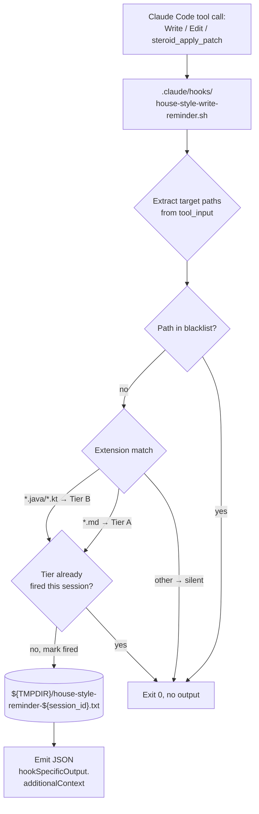

# Track 2: PreToolUse hook + settings + tests

## Purpose / Big Picture
After this track lands, every `Write` / `Edit` / `steroid_apply_patch` invocation (the latter via any `mcp__<server>__steroid_apply_patch` tool ID, regardless of the server-name segment) targeting a Markdown or Java/Kotlin file surfaces the appropriate tier of house-style rules via `hookSpecificOutput.additionalContext` — once per session per tier — and a Python test suite guards the behavior against regressions.

<!-- Reserved for Move 2 — ADDED/MODIFIED/REMOVED triad. Empty until Move 2 lands. -->

Adds `.claude/hooks/house-style-write-reminder.sh` wired into `.claude/settings.json` under a `PreToolUse` matcher `Write|Edit|mcp__.+__steroid_apply_patch` (regex on the server-name segment so the hook fires regardless of how the MCP server is keyed in `~/.claude.json`). Implements extension-based tier matching (`*.md` → Tier A, `*.java|*.kt` → Tier B, else silent), per-session per-tier rate-limit, path blacklist for rule-source self-edits, apply-patch input parsing, and jq fallback. Adds Python tests under `.claude/scripts/tests/test_house_style_hook.py` covering tier matching, rate-limit semantics, apply-patch parsing, fallback paths.

## Progress
- [x] Review + decomposition
- [ ] Step implementation
- [ ] Track-level code review
- [ ] Track completion
- [x] 2026-05-19T14:30Z [ctx=info] Review + decomposition complete

## Surprises & Discoveries
<!-- Continuous-log. Empty at Phase 1. -->

## Decision Log
<!-- Continuous-log. Empty at Phase 1. -->

<!-- Reserved for Move 1 — per-track inlined Decision Records. -->

## Outcomes & Retrospective
<!-- Continuous-log. Empty at Phase 1. -->
- [x] Technical: PASS at iteration 2 (12 findings, 11 accepted, 1 rejected). Iter-1 produced 0 blockers / 6 should-fix / 6 suggestions. The orchestrator accepted T1–T7, T9–T12 and applied fixes (operation ordering, `session_id` fallback, mixed-tier concatenation, byte budget, normalization-before-blacklist, timing assertion at 3 s, apply-patch variant explicit, chmod 755 rationale, Component Map fix in `implementation-plan.md:55`). T8 (matcher anchoring) deferred to a header-comment note in the hook script because the hook's internal jq check already anchors the suffix via `test("^mcp__.+__steroid_apply_patch$")` per D4. Iter-2 gate-check verified every fix landed.
- [x] Adversarial: PASS at iteration 2 (12 findings, 11 accepted, 1 rejected). Iter-1 produced 2 blockers + 6 should-fix + 4 suggestions. The orchestrator accepted A1–A9, A11–A12 and applied fixes (matcher-semantics probes in Step 2, captured fixtures, flock-wrapped critical section for A3 blocker, realpath-normalize-before-blacklist for A4 blocker, §1.5 section-name drift guard, 3-s test budget headroom, non-file-edit scope gap acknowledged, mixed-extension apply-patch coverage, byte budget, malformed-input fixtures). A10 (bash-vs-Python primitive) deferred to a header-comment note in the hook script — downstream-clean. Iter-2 gate-check verified both blockers (A3 + A4) closed and every other fix landed.
- Risk: skipped (Track 2 is Moderate-3-step and lacks performance / durability / security characteristics; the complexity table mandates Technical + Adversarial only).

## Context and Orientation

**Scope clarification.** The hook covers the file-edit slice (`*.md`, `*.java`, `*.kt` paths arriving via `Write`, `Edit`, or `mcp__.+__steroid_apply_patch`) of the Tier-A scope in `.claude/workflow/conventions.md §1.5`. PR titles/descriptions, commit-message bodies, and YouTrack issue bodies are also Tier A per §1.5 row 2 but are out-of-scope for this hook because they are not produced via `Write`/`Edit`/`steroid_apply_patch`. Activation for those non-file surfaces relies on the in-prompt pointers Tracks 3-5 add to workflow prompts, review agents, implementer files, and orchestrator files — not on the hook.

The repository already carries two PreToolUse hooks following a stable pattern:

- `.claude/hooks/mcp-steroid-probe.sh` runs on `SessionStart`, probes IDE liveness, emits `hookSpecificOutput.additionalContext` JSON. Demonstrates the curl-with-timeout + jq pattern.
- `.claude/hooks/mcp-steroid-grep-reminder.sh` runs on `PreToolUse` with the `Grep` matcher, rate-limits to once per 5 minutes per session keyed by Claude pid walked from the process tree, emits `hookSpecificOutput.additionalContext` JSON. Demonstrates the pid-tree walk and the `/tmp/<unique>-${claude_pid}.txt` state file pattern. **Note**: this hook uses time-window throttling, so per-pid keying is correct for it. The house-style hook needs per-logical-session semantics instead and therefore keys by `session_id` from the hook input JSON (which changes on `/clear` and on every fresh conversation).

`.claude/settings.json` carries the existing hook wiring under `hooks.PreToolUse[0]` (the Grep matcher). The new entry sits as a sibling under the same `PreToolUse` key.

The MCP Steroid `apply_patch` tool input shape was confirmed in plan review via `mcp-steroid://skill/apply-patch-tool-description`. The tool takes `tool_input.hunks` — an array of objects, each with `file_path`, `old_string`, `new_string` (all strings). There is **no** `patch` field and **no** unified-diff text; target paths come from `[.tool_input.hunks[].file_path] | unique` (jq) or the equivalent array iteration in the Python fallback. The project rule in `.claude/workflow/conventions.md §1.4 *Tooling discipline* → "Other mcp-steroid routes"` covers when to route through the tool. The tool ID at the dispatch site is `mcp__<server>__steroid_apply_patch` where `<server>` is the user-global `mcpServers` registry key from `~/.claude.json`; the hook matches it via the regex `mcp__.+__steroid_apply_patch` so it fires under any registry-key choice.

The existing `.claude/scripts/tests/test_dsc_ai_tell.py` is the pattern source — a stand-alone Python runner (not pytest-collected) invoked as `python3 .claude/scripts/tests/test_dsc_ai_tell.py`. The new `test_house_style_hook.py` follows the same shape: subprocess-invoke the bash script with fixture JSON on stdin, assert the parsed JSON output matches expectations. The runner exits 0 on pass, non-zero on fail.

Concrete deliverables this track produces:

1. `.claude/hooks/house-style-write-reminder.sh` — bash script with: input parsing (jq + Python fallback), `session_id` extraction from the hook input JSON (`tool_input` peer field), tier matching (extension-based), path blacklist (D6), apply-patch parsing, per-tier rate-limit state file at `${TMPDIR:-/tmp}/house-style-reminder-${session_id}.txt`, `hookSpecificOutput.additionalContext` emission.
2. `.claude/settings.json` — new `PreToolUse` entry with matcher `Write|Edit|mcp__.+__steroid_apply_patch` (regex on the server-name segment per D4 so the hook fires regardless of MCP-server registry key), timeout 5 seconds.
3. `.claude/scripts/tests/test_house_style_hook.py` — stand-alone Python runner (matching `test_dsc_ai_tell.py`) with subprocess fixtures for: Tier-A Markdown path → Tier-A reminder; Tier-B Java path → Tier-B reminder; neutral path → silent; second invocation same tier → silent (rate-limit); blacklisted path → silent; apply-patch input → all matching paths trigger appropriate tier; missing jq → printf fallback emits valid JSON.

## Plan of Work

The track delivers in three steps, in order:

**Step 1 — Write the hook script.** Start from the `mcp-steroid-grep-reminder.sh` skeleton (jq-or-printf fallback, state-file write pattern, fail-silent exit-0 envelope). Diverge from the pattern source on keying — read `session_id` from the hook input JSON instead of walking the process tree, per D2. The hook pipeline runs operations in a fixed order:

1. Read stdin → parse the input JSON. jq pipeline first; on `command -v jq` miss or non-zero exit, fall through to a Python one-liner (`python3 -c 'import json,sys; …'`).
2. Extract `session_id` from the top-level field. If empty or absent, fall back to a unique-per-invocation suffix (`$$` of the hook PID) so the state-file path never collapses to a shared `…-reminder-.txt`. The fallback sacrifices the rate-limit guarantee for that one invocation but preserves correctness.
3. Extract target paths: `tool_input.file_path` for `Write`/`Edit`; `[.tool_input.hunks[].file_path] | unique` for `mcp__.+__steroid_apply_patch` (the array of `{file_path, old_string, new_string}` hunk objects confirmed against `mcp-steroid://skill/apply-patch-tool-description`).
4. Normalize each path to an absolute path via `realpath -m <path>` (GNU) with a portable Python fallback (`python3 -c 'import os,sys; print(os.path.realpath(sys.argv[1]))'`) when the GNU-only `-m` flag is unavailable on BSD coreutils. Normalization runs BEFORE the blacklist check.
5. Blacklist check against the four hardcoded paths (D6): `.claude/output-styles/house-style.md`, `.claude/skills/ai-tells/SKILL.md`, `.claude/scripts/design-mechanical-checks.py`, `.claude/scripts/tests/test_dsc_ai_tell.py`. Match runs on the normalized absolute path with suffix patterns (`*<rel-path>`). Blacklisted paths contribute no tier and burn no rate-limit slot.
6. Tier classification on remaining paths: `*.md` → Tier A; `*.java` / `*.kt` → Tier B; other extensions silently contribute nothing. One invocation may carry paths of mixed tiers (e.g., an apply-patch covering both `.md` and `.java` hunks) — both tiers fire in one output (see step 8).
7. Rate-limit check inside a critical section. Wrap the read-decide-write sequence in a `flock` on a sidecar lock file (`${TMPDIR:-/tmp}/house-style-reminder-${session_id}.lock`) or an atomic `mkdir`-as-lock pattern, so two concurrent same-session same-tier invocations cannot both read an empty state file and both fire. The state file at `${TMPDIR:-/tmp}/house-style-reminder-${session_id}.txt` carries one letter per fired tier (`A`, `B`). On lock-acquisition failure (concurrent invocation already holds the lock), exit 0 silently — the holder will fire the reminder.
8. Emit JSON on stdout via jq (with printf fallback) carrying `hookSpecificOutput.additionalContext` set to the reminder body. When both tiers are owed for the same invocation, concatenate the Tier-A body, a blank line, and the Tier-B body into one `additionalContext` string (Claude Code accepts one hook output per call). Each tier reminder body is capped at ≤500 characters; the concatenated payload stays ≤1500 characters including the JSON envelope.

The reminder body cites `.claude/workflow/conventions.md §1.5 Writing style for Markdown and prose artifacts` by repo-relative path and names the four Tier-B AI-tell subset section headings (`§ Banned vocabulary`, `§ Banned sentence patterns`, `§ Banned analysis patterns`, `§ Em-dash discipline`) verbatim per D3.

Header comment in the script names the bash-vs-Python primitive choice for future readers (bash matches the existing PreToolUse hook pattern even though this hook does more parsing than the precedent), the user-global Concurrent Agent File Isolation rule the `${session_id}` suffix satisfies, and the unanchored-regex over-match risk on the `mcp__.+__steroid_apply_patch` matcher (acceptable for an informational reminder).

Step 1 sets executable permissions on the hook script (`chmod 755`) as defense-in-depth; the hook would still fire via `bash <path>` without the executable bit, but the chmod matches the convention of the two existing pattern hooks.

**Step 2 — Wire the hook into `.claude/settings.json` + capture fixtures + smoke check.** Append one new entry under `hooks.PreToolUse[]` with matcher `Write|Edit|mcp__.+__steroid_apply_patch` and timeout 5 seconds, sibling to the existing `Grep` entry. The smoke check runs two differentiating probes against the live hook input format:

1. Trigger an `Edit` on a Markdown path — expect Tier-A reminder (validates the regex alternation `Write|Edit` actually engages).
2. Trigger an `mcp__localhost-6315__steroid_apply_patch` invocation with mixed `.md` + `.java` hunks — expect concatenated Tier-A + Tier-B reminder (validates the `.+` regex pattern and the mixed-tier concatenation).

The probes capture the actual hook input JSON Claude Code emits and write the captured fixtures to `.claude/scripts/tests/fixtures/house-style-smoke-write.json`, `house-style-smoke-edit.json`, and `house-style-smoke-apply-patch.json`. These fixtures land as durable test inputs (they survive Phase 4 cleanup because they live outside `_workflow/`). If alternation or `.+` fails to engage, the fallback is to split the single regex matcher into three explicit matcher entries (`Write`, `Edit`, `mcp__.+__steroid_apply_patch`); the discovery is recorded in the Step 2 episode.

**Step 3 — Write the stand-alone Python test runner** at `.claude/scripts/tests/test_house_style_hook.py` matching the `test_dsc_ai_tell.py` shape (stand-alone runner, `python3 .claude/scripts/tests/test_house_style_hook.py`, exit 0 on pass). Each test invokes the hook as a subprocess via `subprocess.run(..., input=<fixture-json>, capture_output=True, text=True, timeout=10)`, wraps the call in `time.perf_counter()` to assert elapsed ≤ 3 seconds (2 s headroom against the 5 s production timeout), points `TMPDIR` at a per-test `tempfile.TemporaryDirectory()` so state files are isolated, and parses stdout via `json.loads` to assert on `hookSpecificOutput.additionalContext`.

Test cases must include:

1. Tier-A markdown path → Tier-A reminder fires.
2. Tier-B Java path → Tier-B reminder fires.
3. Tier-B Kotlin path → Tier-B reminder fires.
4. Silent extension (e.g., `.xml`, `Dockerfile`, no extension) → empty `additionalContext`, exit 0.
5. Same-tier-same-session second invocation → silent (rate-limit).
6. Fresh `session_id` post-`/clear` simulation → Tier-A reminder fires again.
7. Cross-tier same-session sequential → each tier fires once.
8. Mixed-tier single apply-patch invocation (`.md` + `.java` hunks) → both reminder bodies concatenated in one `additionalContext`.
9. Mixed-tier apply-patch with a silent extension (`.md` + `.xml`) → Tier A only.
10. Blacklisted path (each of the four files) → silent. Each file tested under absolute path, basename only, and repo-relative path to confirm the realpath normalization fires before the blacklist check.
11. Empty `hunks: []` array → silent (no fabricated reminder).
12. `tool_input.file_path: null`, `tool_input` missing entirely, hook input is non-JSON text → exit 0, no stderr noise, no `additionalContext`.
13. Concurrent same-tier same-session invocations (two subprocesses started in parallel, same `session_id`, same Markdown path) → at most one emits non-empty `additionalContext`.
14. At least two `mcp__<server>__steroid_apply_patch` variants with different middle-segment server keys (e.g., `mcp__localhost-6315__steroid_apply_patch` and `mcp__intellij__steroid_apply_patch`) to exercise the `.+` regex.
15. Captured-fixture replay: load each of the three smoke fixtures from `.claude/scripts/tests/fixtures/house-style-smoke-*.json` and assert the hook produces the expected reminder shape against the real hook input format.
16. Section-name guard: read `.claude/output-styles/house-style.md` and confirm the four Tier-B heading lines (`## Banned vocabulary`, `## Banned sentence patterns`, `## Banned analysis patterns`, `### Em-dash discipline`) exist as exact heading text. Fail with a clear message naming the missing heading if any rename slips through.

Ordering constraints: Step 1 must land before Step 2 (the smoke check needs the hook to exist); Step 2 must land before Step 3 (Step 3's captured-fixture replay tests depend on the fixture files Step 2 writes).

Invariants to preserve: existing PreToolUse matcher for `Grep` stays wired and unchanged. The hook's failure modes (jq missing, malformed input JSON, missing/null `session_id`, missing/null `tool_input.file_path`, empty `hunks`, state-file unreadable, lock-acquisition contention) must degrade silently — exit 0, no stderr noise, never block the underlying tool invocation.

## Concrete Steps
1. Write `.claude/hooks/house-style-write-reminder.sh` implementing the 8-stage pipeline (read stdin → parse JSON via jq with Python fallback → extract `session_id` with `$$` fallback → extract target paths from `tool_input.file_path` or `tool_input.hunks[].file_path` → realpath-normalize each → blacklist check → tier classify → flock-wrapped rate-limit check + emit) plus `chmod 755`. Reminder bodies cite `.claude/workflow/conventions.md §1.5` and the four Tier-B section names. Header comment documents bash-vs-Python primitive choice, the Concurrent Agent File Isolation rule the `${session_id}` suffix satisfies, and the unanchored-regex over-match risk. — risk: high (concurrency: introduces a flock-wrapped read-decide-write critical section in a PreToolUse hook that fires on every `Write` / `Edit` / `mcp__.+__steroid_apply_patch` invocation across every session; failure modes propagate to every write turn)  [ ]
2. Add the new `PreToolUse` entry to `.claude/settings.json` with matcher `Write|Edit|mcp__.+__steroid_apply_patch` and timeout 5, run the two differentiating smoke probes (Edit on Markdown for alternation; `mcp__localhost-6315__steroid_apply_patch` with mixed `.md`+`.java` hunks for `.+` and concatenation), capture the live hook input JSON for each probe to `.claude/scripts/tests/fixtures/house-style-smoke-{write,edit,apply-patch}.json`, and paste a one-paragraph smoke confirmation into the step's episode. — risk: medium (workflow-infra change to `.claude/settings.json` plus new durable test fixtures; no production code, but affects every session's hook firing)  [ ]
3. Write `.claude/scripts/tests/test_house_style_hook.py` as a stand-alone Python runner (matching `test_dsc_ai_tell.py`'s invocation pattern) covering the 16 test cases enumerated in § Plan of Work Step 3: tier matching, silent extensions, sequential and concurrent rate-limit, mixed-tier concatenation, mixed-tier with silent extension, blacklist under three path forms (absolute, basename, repo-relative), empty hunks, malformed input, two apply-patch middle-segment variants, captured-fixture replay, and the §1.5 section-name drift guard. Each test wraps the subprocess invocation in `time.perf_counter()` and asserts ≤ 3 s. — risk: low (default: tests-only file under `.claude/scripts/tests/`; no shared test infrastructure changes; runner is stand-alone)  [ ]

## Episodes
<!-- Continuous-log. Empty at Phase 1. -->

## Validation and Acceptance

- Hook fires on `Write`, `Edit`, and any `mcp__<server>__steroid_apply_patch` invocation (the matcher regex `mcp__.+__steroid_apply_patch` covers every registry-name choice) for `*.md` paths and surfaces the full-house-style reminder. Acceptance bullet from YTDB-837: "A test branch where a non-compliant draft is written into `docs/adr/<branch>/` surfaces house-style rules via the hook within the same Write/Edit turn."
- Hook fires on `*.java` / `*.kt` paths and surfaces only the AI-tell subset reminder. Acceptance bullet from YTDB-837: "A test code-file edit that adds a comment containing `delve` or `It's not X, it's Y` surfaces the AI-tell subset via the hook." Note: the hook is path-triggered, not content-triggered; the comment-content trigger language in the issue describes the user-observable outcome, not the hook's detection mechanism.
- Hook stays silent on every other path (silent extensions, missing/null `tool_input.file_path`, empty `hunks: []`, non-JSON stdin, missing `session_id` — all degrade silently with exit 0 and no stderr noise).
- Subsequent invocations same tier same session stay silent (rate-limit).
- Subsequent invocations across tiers in the same session each fire once. A mixed-tier apply-patch invocation (e.g., `.md` + `.java` hunks in one input) fires both reminders concatenated in one `additionalContext` string and marks both tiers fired.
- Concurrent same-tier same-session invocations (two parallel tool calls within one model turn) emit at most one non-empty `additionalContext`. The read-decide-write critical section is wrapped in a `flock` (or atomic-mkdir equivalent) on a sidecar lock file at `${TMPDIR:-/tmp}/house-style-reminder-${session_id}.lock`.
- Blacklisted paths (`.claude/output-styles/house-style.md`, `.claude/skills/ai-tells/SKILL.md`, `.claude/scripts/design-mechanical-checks.py`, `.claude/scripts/tests/test_dsc_ai_tell.py`) stay silent regardless of extension AND regardless of input form (absolute path, basename only, or repo-relative path) because target paths are normalized via `realpath -m` (with a portable Python fallback) before the blacklist check runs.
- Hook never blocks the underlying tool invocation: exit code 0, no `deny` decision, no stderr noise on any failure mode.
- jq fallback works: setting `PATH` to omit jq still produces valid JSON via printf.
- additionalContext byte budget: each tier reminder body stays ≤500 characters; the concatenated mixed-tier payload stays ≤1500 characters including the JSON envelope.
- Hook latency: every test case asserts `subprocess.run` elapsed time ≤ 3 seconds (Invariant I1 in `implementation-plan.md`, tightened from the 5 s production timeout to leave 2 s headroom against the hard-kill).
- §1.5 anchor drift guard: the test runner reads `.claude/output-styles/house-style.md` and confirms the four Tier-B section heading lines (`## Banned vocabulary`, `## Banned sentence patterns`, `## Banned analysis patterns`, `### Em-dash discipline`) exist verbatim. A future rename in `house-style.md` that breaks Tier-B pointer sites fails the runner before the pointer sites silently rot.
- Captured fixtures from Step 2 (`.claude/scripts/tests/fixtures/house-style-smoke-{write,edit,apply-patch}.json`) are real hook input shapes Claude Code emits during a live session; Step 3 replays at least one captured fixture per tool shape as durable evidence the hook handles the actual input format, complementing the synthesized fixtures.
- Python test suite at `.claude/scripts/tests/test_house_style_hook.py` runs as a stand-alone runner from the repository root (`python3 .claude/scripts/tests/test_house_style_hook.py`) and passes (exit code 0); matches the existing `test_dsc_ai_tell.py` invocation pattern.

<!-- Phase A placeholder for per-step EARS/Gherkin lines. -->

<!-- Reserved for Move 3. -->

## Idempotence and Recovery

- **Step 1 (hook script):** idempotent by re-running the file write — `steroid_apply_patch` validates `old_string` uniqueness before applying; the script is a new file so any partial write is replaced by a full rewrite. Recovery from a partial write: `git checkout HEAD -- .claude/hooks/house-style-write-reminder.sh` and re-run Step 1. The `chmod 755` is a separate atomic operation; if it lands but the file does not, the orphan permission is cleaned up by `git checkout`.
- **Step 2 (settings + smoke + fixture capture):** idempotent by re-running the settings.json edit on the same hunk. Recovery from a partial write: `git checkout HEAD -- .claude/settings.json` reverts to the pre-Step-2 baseline; re-run Step 2. Fixture files under `.claude/scripts/tests/fixtures/` are also idempotent — `git checkout` removes any incomplete capture, and the smoke probes can be re-run from scratch. The smoke episode prose lives in the step's episode block; if interrupted between fixture capture and episode write, the captured fixtures persist on disk for re-use without re-running the probes.
- **Step 3 (test runner):** idempotent by re-running the file write. Recovery: `git checkout HEAD -- .claude/scripts/tests/test_house_style_hook.py` reverts to baseline; re-run Step 3. If a test fails during execution, fix the test or the hook; the runner is stand-alone and stateless across invocations (each test isolates `TMPDIR` via `tempfile.TemporaryDirectory()`).
- **Cross-step recovery:** because Step 1 lands the hook on disk and Step 2 wires it into settings.json, a partial Step 2 commit (settings change without hook present) could fire a missing-script hook invocation on the next Write/Edit. Mitigation: Step 1's commit must land before Step 2's settings edit; the orchestrator commits each step separately per the workflow's "one step = one commit" rule, so partial-cross-step state is bounded by the per-step commit boundary.

## Artifacts and Notes
<!-- Continuous-log. -->

## Interfaces and Dependencies

- **PreToolUse hook decision flow**: extract target paths, blacklist check, extension classification, rate-limit check (per-session per-tier), emit additionalContext or stay silent.

**In-scope files:**
- `.claude/hooks/house-style-write-reminder.sh` (new — hook script with regex-based tool-name match for the apply-patch variant)
- `.claude/settings.json` (modify — add a new entry under `hooks.PreToolUse` with matcher `Write|Edit|mcp__.+__steroid_apply_patch`)
- `.claude/scripts/tests/fixtures/house-style-smoke-write.json`, `house-style-smoke-edit.json`, `house-style-smoke-apply-patch.json` (new — durable captured hook input fixtures written by Step 2's smoke check and replayed by Step 3 as real-input regression evidence)
- `.claude/scripts/tests/test_house_style_hook.py` (new — Python tests must cover at least two different middle-segment server-key values, e.g., `mcp__localhost-6315__steroid_apply_patch` and `mcp__intellij__steroid_apply_patch`, so the regex `.+` semantics are exercised, not just the current registry key)

**Out-of-scope files:**
- `.claude/hooks/mcp-steroid-grep-reminder.sh` (pattern source; not modified)
- `.claude/hooks/mcp-steroid-probe.sh` (pattern source; not modified)
- `.claude/output-styles/house-style.md` (rule source; unchanged per YTDB-837 non-goals)

**Inter-track dependencies:**
- **Upstream**: Track 1 (the hook's additionalContext text cites the new conventions.md anchor heading).
- **Downstream**: none.

**Compatibility requirements:**
- Existing `PreToolUse` Grep matcher stays unchanged and wired.
- Existing `SessionStart` mcp-steroid-probe hook stays unchanged and wired.
- The hook script is portable across Linux and macOS (BSD stat vs GNU stat), matching `mcp-steroid-grep-reminder.sh`'s portability rule.

**Library / function signatures relevant to this track:**
- `session_id` (string) — top-level field of every PreToolUse hook input JSON. Changes on `/clear` and on every fresh conversation. The state-file key.
- `tool_input.file_path` (string) — present on `Write` and `Edit` invocations.
- `tool_input.hunks` (array of objects) — for `mcp__<server>__steroid_apply_patch`, each hunk has `file_path`, `old_string`, `new_string` (all strings). The hook enumerates `hunks[].file_path` and dedups. Confirmed against `mcp-steroid://skill/apply-patch-tool-description`.
- `tool_name` regex match `^mcp__.+__steroid_apply_patch$` — the dispatch site identifies the apply-patch variant regardless of MCP-server registry-key choice.
- State file format: one line per fired tier (`A` or `B`) for the session.

## Base commit
f0a1e39415c7c23809127b6595a6f23c1281117c
