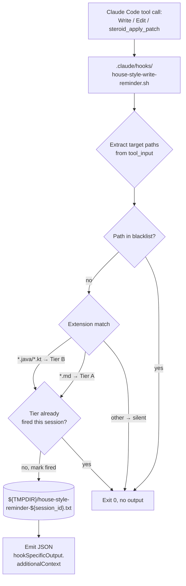

# Track 2: PreToolUse hook + settings + tests

## Purpose / Big Picture
After this track lands, every `Write` / `Edit` / `steroid_apply_patch` invocation (the latter via any `mcp__<server>__steroid_apply_patch` tool ID, regardless of the server-name segment) targeting a Markdown or Java/Kotlin file surfaces the appropriate tier of house-style rules via `hookSpecificOutput.additionalContext` — once per session per tier — and a Python test suite guards the behavior against regressions.

<!-- Reserved for Move 2 — ADDED/MODIFIED/REMOVED triad. Empty until Move 2 lands. -->

Adds `.claude/hooks/house-style-write-reminder.sh` wired into `.claude/settings.json` under a `PreToolUse` matcher `Write|Edit|mcp__.+__steroid_apply_patch` (regex on the server-name segment so the hook fires regardless of how the MCP server is keyed in `~/.claude.json`). Implements extension-based tier matching (`*.md` → Tier A, `*.java|*.kt` → Tier B, else silent), per-session per-tier rate-limit, path blacklist for rule-source self-edits, apply-patch input parsing, and jq fallback. Adds Python tests under `.claude/scripts/tests/test_house_style_hook.py` covering tier matching, rate-limit semantics, apply-patch parsing, fallback paths.

## Progress
- [ ] Review + decomposition
- [ ] Step implementation
- [ ] Track-level code review
- [ ] Track completion

## Surprises & Discoveries
<!-- Continuous-log. Empty at Phase 1. -->

## Decision Log
<!-- Continuous-log. Empty at Phase 1. -->

<!-- Reserved for Move 1 — per-track inlined Decision Records. -->

## Outcomes & Retrospective
<!-- Continuous-log. Empty at Phase 1. -->

## Context and Orientation

The repository already carries two PreToolUse hooks following a stable pattern:

- `.claude/hooks/mcp-steroid-probe.sh` runs on `SessionStart`, probes IDE liveness, emits `hookSpecificOutput.additionalContext` JSON. Demonstrates the curl-with-timeout + jq pattern.
- `.claude/hooks/mcp-steroid-grep-reminder.sh` runs on `PreToolUse` with the `Grep` matcher, rate-limits to once per 5 minutes per session keyed by Claude pid walked from the process tree, emits `hookSpecificOutput.additionalContext` JSON. Demonstrates the pid-tree walk and the `/tmp/<unique>-${claude_pid}.txt` state file pattern. **Note**: this hook uses time-window throttling, so per-pid keying is correct for it. The house-style hook needs per-logical-session semantics instead and therefore keys by `session_id` from the hook input JSON (which changes on `/clear` and on every fresh conversation).

`.claude/settings.json` carries the existing hook wiring under `hooks.PreToolUse[0]` (the Grep matcher). The new entry sits as a sibling under the same `PreToolUse` key.

The MCP Steroid `apply_patch` tool input shape was confirmed in plan review via `mcp-steroid://skill/apply-patch-tool-description`. The tool takes `tool_input.hunks` — an array of objects, each with `file_path`, `old_string`, `new_string` (all strings). There is **no** `patch` field and **no** unified-diff text; target paths come from `[.tool_input.hunks[].file_path] | unique` (jq) or the equivalent array iteration in the Python fallback. The project rule in `.claude/workflow/conventions.md §1.4 *Tooling discipline* → "Other mcp-steroid routes"` covers when to route through the tool. The tool ID at the dispatch site is `mcp__<server>__steroid_apply_patch` where `<server>` is the user-global `mcpServers` registry key from `~/.claude.json`; the hook matches it via the regex `mcp__.+__steroid_apply_patch` so it fires under any registry-key choice.

The existing `.claude/scripts/tests/test_dsc_ai_tell.py` is the pattern source — a stand-alone Python runner (not pytest-collected) invoked as `python3 .claude/scripts/tests/test_dsc_ai_tell.py`. The new `test_house_style_hook.py` follows the same shape: subprocess-invoke the bash script with fixture JSON on stdin, assert the parsed JSON output matches expectations. The runner exits 0 on pass, non-zero on fail.

Concrete deliverables this track produces:

1. `.claude/hooks/house-style-write-reminder.sh` — bash script with: input parsing (jq + Python fallback), `session_id` extraction from the hook input JSON (`tool_input` peer field), tier matching (extension-based), path blacklist (D6), apply-patch parsing, per-tier rate-limit state file at `${TMPDIR:-/tmp}/house-style-reminder-${session_id}.txt`, `hookSpecificOutput.additionalContext` emission.
2. `.claude/settings.json` — new `PreToolUse` entry with matcher `Write|Edit|mcp__.+__steroid_apply_patch` (regex on the server-name segment per D4 so the hook fires regardless of MCP-server registry key), timeout 5 seconds.
3. `.claude/scripts/tests/test_house_style_hook.py` — stand-alone Python runner (matching `test_dsc_ai_tell.py`) with subprocess fixtures for: Tier-A Markdown path → Tier-A reminder; Tier-B Java path → Tier-B reminder; neutral path → silent; second invocation same tier → silent (rate-limit); blacklisted path → silent; apply-patch input → all matching paths trigger appropriate tier; missing jq → printf fallback emits valid JSON.

## Plan of Work

The track delivers in three steps, in order:

Step 1 — Write the hook script. Start from the `mcp-steroid-grep-reminder.sh` skeleton (claude-pid walk, jq-or-printf fallback, state-file rate-limit). Add: extension-based tier classification on `tool_input.file_path`; apply-patch input parsing via `tool_input.hunks[].file_path` (array of hunk objects, confirmed in plan review against `mcp-steroid://skill/apply-patch-tool-description`); the path blacklist (D6); per-tier state-file entries (one line per tier-fire), checked before emitting. The reminder strings are stored as bash heredocs and reference the Track 1 conventions.md anchor by relative path.

Step 2 — Wire the hook into `.claude/settings.json` and run a manual smoke check. The smoke check edits one Tier-A path and one Tier-B path interactively, captures the emitted `additionalContext`, and pastes a one-paragraph confirmation into the step's episode.

Step 3 — Write the stand-alone Python test runner at `.claude/scripts/tests/test_house_style_hook.py` (matching the `test_dsc_ai_tell.py` invocation pattern: `python3 .claude/scripts/tests/test_house_style_hook.py`; exit 0 on pass, non-zero on fail). Each test invokes the hook as a subprocess, pipes fixture JSON on stdin (carrying `session_id`, `tool_name`, `tool_input`), parses the JSON output, and asserts on the `additionalContext` content. Each test creates its own `tempfile.TemporaryDirectory()` and points `TMPDIR` at it so the state file is isolated per test. Test cases must include: (a) state-file isolation between two distinct `session_id` values (the post-`/clear` simulation — same Markdown path fires the Tier-A reminder again under a fresh `session_id`); (b) state-file persistence within one `session_id` across multiple invocations (the rate-limit case).

Ordering constraints: Step 1 must land before Step 2 (the smoke check needs the hook to exist); Step 2 must land before Step 3 (the test suite asserts the wiring works end-to-end, so the smoke check serves as the existence proof). Step 1 needs to land the script with executable permissions (`chmod 755`).

Invariants to preserve: existing PreToolUse matcher for `Grep` stays wired and unchanged. The hook's failure modes (jq missing, malformed input JSON, state-file unreadable) must degrade silently — never block the underlying tool invocation.

## Concrete Steps
<!-- Phase A placeholder — decomposition writes a thin numbered roster here. -->

## Episodes
<!-- Continuous-log. Empty at Phase 1. -->

## Validation and Acceptance

- Hook fires on `Write`, `Edit`, and any `mcp__<server>__steroid_apply_patch` invocation (the matcher regex `mcp__.+__steroid_apply_patch` covers every registry-name choice) for `*.md` paths and surfaces the full-house-style reminder. Acceptance bullet from YTDB-837: "A test branch where a non-compliant draft is written into `docs/adr/<branch>/` surfaces house-style rules via the hook within the same Write/Edit turn."
- Hook fires on `*.java` / `*.kt` paths and surfaces only the AI-tell subset reminder. Acceptance bullet from YTDB-837: "A test code-file edit that adds a comment containing `delve` or `It's not X, it's Y` surfaces the AI-tell subset via the hook." Note: the hook is path-triggered, not content-triggered; the comment-content trigger language in the issue describes the user-observable outcome, not the hook's detection mechanism.
- Hook stays silent on every other path.
- Subsequent invocations same tier same session stay silent (rate-limit).
- Subsequent invocations across tiers in the same session each fire once.
- Blacklisted paths (`.claude/output-styles/house-style.md`, `.claude/skills/ai-tells/SKILL.md`, `.claude/scripts/design-mechanical-checks.py`, `.claude/scripts/tests/test_dsc_ai_tell.py`) stay silent regardless of extension.
- Hook never blocks the underlying tool invocation: exit code 0, no `deny` decision, no stderr noise.
- jq fallback works: setting `PATH` to omit jq still produces valid JSON via printf.
- Python test suite at `.claude/scripts/tests/test_house_style_hook.py` runs as a stand-alone runner from the repository root (`python3 .claude/scripts/tests/test_house_style_hook.py`) and passes (exit code 0); matches the existing `test_dsc_ai_tell.py` invocation pattern.

<!-- Phase A placeholder for per-step EARS/Gherkin lines. -->

<!-- Reserved for Move 3. -->

## Idempotence and Recovery
<!-- Phase A placeholder. -->

## Artifacts and Notes
<!-- Continuous-log. -->

## Interfaces and Dependencies

- **PreToolUse hook decision flow**: extract target paths, blacklist check, extension classification, rate-limit check (per-session per-tier), emit additionalContext or stay silent.

**In-scope files:**
- `.claude/hooks/house-style-write-reminder.sh` (new — hook script with regex-based tool-name match for the apply-patch variant)
- `.claude/settings.json` (modify — add a new entry under `hooks.PreToolUse` with matcher `Write|Edit|mcp__.+__steroid_apply_patch`)
- `.claude/scripts/tests/test_house_style_hook.py` (new — Python tests must cover at least two different `mcp__<server>__steroid_apply_patch` variants to guard the regex against future hardcoding regressions)

**Out-of-scope files:**
- `.claude/hooks/mcp-steroid-grep-reminder.sh` (pattern source; not modified)
- `.claude/hooks/mcp-steroid-probe.sh` (pattern source; not modified)
- `.claude/output-styles/house-style.md` (rule source; unchanged per YTDB-837 non-goals)

**Inter-track dependencies:**
- **Upstream**: Track 1 (the hook's additionalContext text cites the new conventions.md anchor heading).
- **Downstream**: none.

**Compatibility requirements:**
- Existing `PreToolUse` Grep matcher stays unchanged and wired.
- Existing `SessionStart` mcp-steroid-probe hook stays unchanged and wired.
- The hook script is portable across Linux and macOS (BSD stat vs GNU stat), matching `mcp-steroid-grep-reminder.sh`'s portability rule.

**Library / function signatures relevant to this track:**
- `session_id` (string) — top-level field of every PreToolUse hook input JSON. Changes on `/clear` and on every fresh conversation. The state-file key.
- `tool_input.file_path` (string) — present on `Write` and `Edit` invocations.
- `tool_input.hunks` (array of objects) — for `mcp__<server>__steroid_apply_patch`, each hunk has `file_path`, `old_string`, `new_string` (all strings). The hook enumerates `hunks[].file_path` and dedups. Confirmed against `mcp-steroid://skill/apply-patch-tool-description`.
- `tool_name` regex match `^mcp__.+__steroid_apply_patch$` — the dispatch site identifies the apply-patch variant regardless of MCP-server registry-key choice.
- State file format: one line per fired tier (`A` or `B`) for the session.
