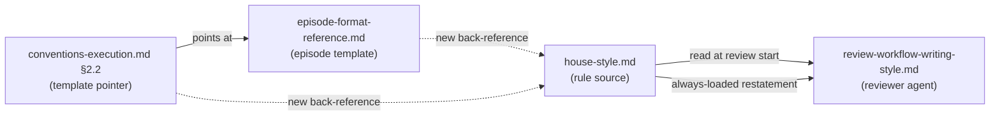

# Carve ExecPlan structured-field episodes out of the section length cap

## Design Document
[design.md](design.md)

## High-level plan

### Goals

Rewrite the `house-style.md § Structural rules` "Section length cap" rule as a soft cap with two complements:

1. A categorical exemption list naming template-bound content shapes where every paragraph is load-bearing (ExecPlan structured-field paragraph blocks under `## Episodes`, edit-list subsections, full state-machine tables, file:line citation blocks, multi-step derivations under `design-mechanics.md`).
2. A padding-based finding criterion for free-form prose that exceeds 200 words: flag only when the section also contains banned vocabulary, banned sentence patterns, or restatement. Length alone is not a finding.

Propagate the wording to the four other declarative sites of the rule (`house-style.md § Self-check` step 7, plus three sites in `review-workflow-writing-style.md`: frontmatter `description:`, key rules list, review criteria). Add back-references from `episode-format-reference.md § Episode length rule` and `conventions-execution.md §2.2 Episode Formats` to the new house-style exemption.

This eliminates the recurring Phase C track-level writing-style DROP that fires on every track with substantive multi-paragraph episodes. Source: YTDB-899, observed on Track 2 of the `ytdb-837-activate-in-house-style` ADR, three findings DROPped at 578 / 489 / 496 words.

### Constraints

- The reviewer agent reads `house-style.md` once at review start. Its frontmatter `description:` is also loaded into every system reminder. If the rule body in `house-style.md` says "soft cap with exemption" but any reviewer-agent restatement still says "200-word section cap," the reviewer drifts toward the always-loaded text. All five declarative sites must move in the same change.
- House-style applies to authored prose surfaces under `_workflow/`. The new exemption is text-and-prompt only; no mechanical-check script changes.
- The mechanical-check script (`design-mechanical-checks.py`) enforces a different cap (lines per `##` section on design.md only) that this change does not touch.
- No HTML comment markers or visible "length-cap-exempt" annotations in authored prose. The exemption is structural (template-bound categories) plus reviewer judgment (padding-based finding criterion).

### Architecture Notes

#### Component Map

- **`.claude/output-styles/house-style.md`** — Single declarative source for the section length cap. The rule body (line 262 in `## Structural rules`) and the self-check (line 363 in `## Self-check`, step 7) both restate it. The exemption clause and the soft-cap rewording land here.
- **`.claude/agents/review-workflow-writing-style.md`** — The Phase C track-level writing-style review agent. Restates the cap in three places: frontmatter `description:` (line 3, always loaded into every system reminder), key rules list (line 18), review criteria (lines 69-71, under the `### Section length` heading). All three rewrite to match the new house-style wording.
- **`.claude/workflow/episode-format-reference.md` § Episode length rule** — Already states "no hard line limit" for episodes, which is the contradiction YTDB-899 names. Gains a one-line back-reference to the new house-style exemption.
- **`.claude/workflow/conventions-execution.md` §2.2 Episode Formats** — Forwards to `episode-format-reference.md` for the template. Gains a back-reference to the house-style exemption next to the field list.

#### D1: Soft cap with categorical exemption (flavor 1)

- **Alternatives considered**: (A) Strict carveout: enumerate the seven labels named in YTDB-899 (and three more from the full template) as named exceptions in `house-style.md`. (B) Reasoning-required marker: every >200-word section opens with a prose or HTML-comment marker naming the reason. (C) Padding-based reframe: recast the rule as "no padding," using 200 words only as a heuristic trigger for closer review.
- **Rationale**: Flavor 1 (categorical exemption + soft cap default with padding-based judgment for non-exempt prose) covers more legitimate cases than (A). Without naming labels the rule captures template-bound content broadly (edit lists, state-machine tables, file:line citations, design-mechanics derivations) that would otherwise re-litigate as separate DROPs. It avoids the in-prose pollution of (B): markers either visually clutter authored content (visible prose) or rely on HTML-comment parsing reliability (invisible comments), and shift the discipline from "write tight prose" to "remember marker syntax." It keeps the deterministic structural check that (C) loses: the reviewer answers "is this section in an exempt category?" before falling back to judgment.
- **Risks/Caveats**: The exemption list is non-exhaustive — future template additions either match an existing category name or land an explicit addition. The padding-based judgment for non-template prose is an LLM call and may drift; mitigated by keeping the trigger threshold (200 words) explicit and naming the padding patterns the reviewer must look for (banned vocabulary, banned sentence patterns, restatement).
- **Implemented in**: Track 1
- **Full design**: design.md §"Exemption categories" (covers the five exempt content shapes and the structural-check criterion that picks them out)

#### D2: Land the rule in `house-style.md`, with back-references from template docs

- **Alternatives considered**: (A) Land the rule in `episode-format-reference.md` only and have `house-style.md` reference it. (B) Land in `conventions-execution.md §2.2` and back-reference from house-style.
- **Rationale**: The reviewer agent reads `house-style.md` once at review start; the rule must be readable from there or the reviewer never fires the exemption. Other docs (episode-format-reference, conventions-execution) are read on demand by execution-time code, not by the reviewer. Landing in house-style means the rule is present where it's applied, with back-references serving readers approaching from the template side.
- **Risks/Caveats**: House-style.md is the single declarative source for writing rules; the file already runs ~370 lines. The exemption clause is ~6 lines, well within tolerance.
- **Implemented in**: Track 1

#### D3: Update all five declarative sites in one atomic change

- **Alternatives considered**: Stagger the rewrite — rule body first, reviewer-agent restatements in a follow-up commit.
- **Rationale**: The reviewer agent's frontmatter `description:` is loaded into every system reminder ("...and 200-word-section cap per the house-style output style"). If the rule body says "soft cap with exemption" but the always-loaded description says "200-word section cap," reviewer behavior drifts toward the description because it is the part the agent always sees. The same logic applies to the key rules list (line 18) and review criteria (lines 69-71) — any one of them not updated re-introduces the bug. Atomic change forces consistency.
- **Risks/Caveats**: Larger commit touching five files. Mitigated by the change being mechanical (rule rewording) and reviewable as a single diff.
- **Implemented in**: Track 1

### Invariants

- After the change, `grep "Section length cap exception" .claude/output-styles/house-style.md` returns the new clause.
- All five declarative sites (two in `house-style.md`, three in `review-workflow-writing-style.md`) carry consistent wording about the soft cap and the exemption.
- A Phase C track-level writing-style review on a track with a `## Episodes` block whose structured-field paragraphs exceed 200 words does not produce a section-length finding against those paragraphs.

### Integration Points

- The writing-style reviewer agent reads `.claude/output-styles/house-style.md` at review start (see `review-workflow-writing-style.md § Process` step 1). The exemption clause lands inside `## Structural rules`, so the agent picks it up via the same read.
- `episode-format-reference.md § Episode length rule` (line 346) and `conventions-execution.md §2.2 Episode Formats` (line 284) are the back-reference landing sites for readers approaching the rule from the template side.

### Non-Goals

- The cap for non-template free-form prose stays at ~200 words. The default is not raised.
- No changes to the episode template field set (`What was done`, `What was discovered`, etc.) — only the length rule.
- No changes to `.claude/scripts/design-mechanical-checks.py`'s per-`##`-section length cap on design.md (a separate, line-based rule that operates during mutation, not review).
- No HTML comment markers, visible prose markers, or other in-document annotations to flag exemptions.
- No changes to the `ai-tells` skill, which audits a different cross-section of house-style rules (vocabulary, sentence patterns, openers/closers, not section length).

## Checklist
- [ ] Track 1: Rewrite the section length cap and propagate
  > Rewrite `house-style.md § Structural rules` "Section length cap" as a soft cap with a categorical exemption (template-bound content) plus a padding-based finding criterion for free-form prose. Propagate the wording to the four other declarative sites (`house-style.md § Self-check` step 7, `review-workflow-writing-style.md` frontmatter `description:`, key rules list, review criteria). Add back-references from `episode-format-reference.md § Episode length rule` and `conventions-execution.md §2.2`.
  > **Scope:** ~2-3 steps covering rule rewrite + reviewer-agent restatement updates + back-references

## Plan Review
- [x] Plan review (consistency + structural) — passed at iteration 2

**Auto-fixed (mechanical)**: CR1 — line range for the `### Section length` review-criteria block in `review-workflow-writing-style.md` cited as "70-72" in Component Map and track Context and Orientation; corrected to "69-71" (heading at line 69, bullets at 70-71). CR2 — same residual "70-72" citation in D3 Rationale; corrected to "69-71". S1 — Track 1 plan-checklist intro paragraph ran 4 sentences (trailing pointer sentence pushed it past the 1-3 sentence budget); dropped the trailing "Detailed description in `plan/track-1.md`." pointer.

**Escalated (design decisions)**: none.

## Final Artifacts
- [ ] Phase 4: Final artifacts (`design-final.md`, `adr.md`)
