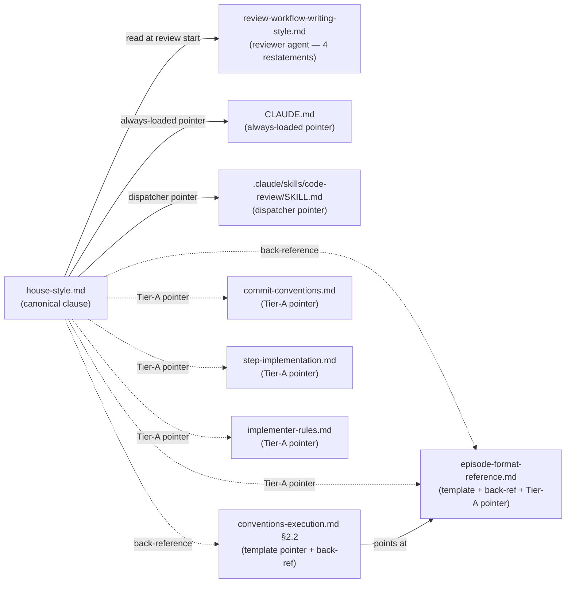

# Carve ExecPlan structured-field episodes out of the section length cap — Architecture Decision Record

## Summary

The `house-style.md § Structural rules` "Section length cap" rule said every `###` subsection was ≤ 200 words, and the Phase C `review-workflow-writing-style` agent applied it indiscriminately. ExecPlan episode blocks under `## Episodes` use the labeled-bold-paragraph template (`**What was done:**`, `**What was discovered:**`, `**What changed from the plan:**`, `**Key files:**`, `**Critical context:**`, plus three failed-step labels) and are sized to cross-track impact per `episode-format-reference.md § Episode length rule` ("no hard line limit"). On every track with substantive cross-track impact the episodes crossed 200 words; the reviewer flagged them; the orchestrator DROPped the finding because the suggested remediation (split into H4 subsections) broke the template. The same contradiction fired repeatedly across the workflow, and YTDB-899 captured it.

The change rewrites the canonical clause in `.claude/output-styles/house-style.md § Structural rules` as a soft cap with two complements: a categorical exemption list naming five template-bound content shapes where every paragraph is load-bearing, and a padding-based finding criterion for free-form prose that exceeds the cap. The same wording propagated to every declarative restatement of the rule across the codebase and gained back-references from the template's home docs and Tier-A pointer sites.

## Goals

Achieved as planned:

- Rewrite the canonical clause as a soft cap plus a five-category exemption list (ExecPlan structured-field paragraph blocks under `## Episodes`, edit-list subsections, full state-machine tables, file:line citation blocks, multi-step derivations under `design-mechanics.md`) plus a padding-based finding criterion citing `§ Banned vocabulary`, `§ Banned sentence patterns`, and `§ Elegant variation` by name.
- Propagate the new wording to every other declarative restatement so the reviewer agent's drift surface stays consistent — the reviewer-agent frontmatter description (always loaded into every system reminder), the key-rules bullet, the review-criteria block, the output-format template, the `CLAUDE.md` always-loaded house-style activation paragraph, and the `/code-review` dispatcher entry.
- Add back-references from `episode-format-reference.md § Episode length rule` and `conventions-execution.md §2.2` so a reader approaching from the template side finds the exemption.

Added during execution:

- Sweep four Tier-A pointer sites (`commit-conventions.md`, `step-implementation.md`, `implementer-rules.md`, `episode-format-reference.md`) that carried verbatim "≤200-word section cap" phrasing and rewrite them to "soft section length cap with template-bound exemptions" — the Phase A deferral rationale for these sites had been factually incorrect.
- Add a unit-of-evaluation tie-breaker to the exemption clause so mixed-content parents (a `## Episodes` parent containing both exempt structured-field blocks and non-exempt free-form prose) are scored block by block, not section by section.

## Constraints

All planning-time constraints held:

- The reviewer agent reads `house-style.md` once at review start, its frontmatter `description:` is loaded into every system reminder, and the dispatcher restatements in `CLAUDE.md` and `.claude/skills/code-review/SKILL.md` are loaded transitively. All declarative sites moved in the same change so the reviewer cannot drift toward an outdated restatement.
- House-style applies to authored prose surfaces under `_workflow/`. The change is text-and-prompt only; no mechanical-check script changes.
- The mechanical-check script (`design-mechanical-checks.py`) enforces a different cap (lines per `##` section on `design.md` only) that the change does not touch.
- No HTML comment markers or visible "length-cap-exempt" annotations in authored prose. The exemption is structural (template-bound categories) plus reviewer judgment (padding-based finding criterion).

## Architecture Notes

### Component Map

- **`.claude/output-styles/house-style.md`** — canonical clause site. Three bullets under `## Structural rules`: "Section length cap" (soft cap default), "Section length cap exception" (five categories + unit-of-evaluation tie-breaker), "Padding-based finding criterion" (the post-cap quality predicate). Self-check step 7 mirrors the rule.
- **`.claude/agents/review-workflow-writing-style.md`** — Phase C track-level writing-style reviewer agent. Four restatements: frontmatter `description:` (always loaded into every system reminder), key rules list, review criteria block (under the `### Section length` heading), and the output-format template (the `Recommended` finding shape the agent fills in).
- **`CLAUDE.md`** (project root) — line 102. Compressed during track-level review to a brief always-loaded paragraph pointing at the canonical clause rather than restating the full rule.
- **`.claude/skills/code-review/SKILL.md`** — line 313, the `/code-review` agent-dispatch list. Compressed during track-level review to sibling shape with the other dispatcher entries.
- **`.claude/workflow/episode-format-reference.md` § Episode length rule** — gains a back-reference to the new "Section length cap exception" clause; its existing Tier-A pointer also rewritten to soft-cap phrasing.
- **`.claude/workflow/conventions-execution.md` §2.2 Episode Formats** — gains a back-reference next to the labeled-bold-paragraph template description.
- **`.claude/workflow/commit-conventions.md`**, **`step-implementation.md`**, **`implementer-rules.md`** — three additional Tier-A pointer sites whose verbatim "≤200-word section cap" phrasing was rewritten to "soft section length cap with template-bound exemptions" so the always-loaded surfaces stay consistent with the canonical clause.

### Decision Records

#### D1: Soft cap with categorical exemption (flavor 1)

- **Alternatives considered**: (A) Strict carveout: enumerate the seven labels named in YTDB-899 (and three more from the full template) as named exceptions in `house-style.md`. (B) Reasoning-required marker: every >200-word section opens with a prose or HTML-comment marker naming the reason. (C) Padding-based reframe: recast the rule as "no padding," using 200 words only as a heuristic trigger for closer review.
- **Rationale**: Flavor 1 (categorical exemption + soft cap default with padding-based judgment for non-exempt prose) covers more legitimate cases than (A). Without naming labels the rule captures template-bound content broadly (edit lists, state-machine tables, file:line citations, design-mechanics derivations) that would otherwise re-litigate as separate DROPs. It avoids the in-prose pollution of (B): markers either visually clutter authored content (visible prose) or rely on HTML-comment parsing reliability (invisible comments), and shift the discipline from "write tight prose" to "remember marker syntax." It keeps the deterministic structural check that (C) loses: the reviewer answers "is this section in an exempt category?" before falling back to judgment.
- **Risks/Caveats**: The exemption list is non-exhaustive — future template additions either match an existing category name or land an explicit addition. The padding-based judgment for non-template prose is an LLM call and may drift; mitigated by keeping the trigger threshold (200 words) explicit and naming the padding patterns the reviewer must look for (banned vocabulary, banned sentence patterns, restatement).
- **Outcome**: Implemented as planned. One refinement landed during track-level code review — the unit-of-evaluation tie-breaker (see D4 below). Implemented in `.claude/output-styles/house-style.md` § Structural rules, bullets "Section length cap", "Section length cap exception", and "Padding-based finding criterion"; full design walk-through in `design-final.md § Exemption categories` and `§ Padding-based finding criterion`.

#### D2: Land the rule in `house-style.md`, with back-references from template docs

- **Alternatives considered**: (A) Land the rule in `episode-format-reference.md` only and have `house-style.md` reference it. (B) Land in `conventions-execution.md §2.2` and back-reference from house-style.
- **Rationale**: The reviewer agent reads `house-style.md` once at review start; the rule must be readable from there or the reviewer never fires the exemption. Other docs (episode-format-reference, conventions-execution) are read on demand by execution-time code, not by the reviewer. Landing in house-style means the rule is present where it's applied, with back-references serving readers approaching from the template side.
- **Risks/Caveats**: `house-style.md` is the single declarative source for writing rules; the file already runs ~370 lines. The exemption clause is ~6 lines, well within tolerance.
- **Outcome**: Implemented as planned. Canonical clause at `.claude/output-styles/house-style.md § Structural rules` bullets "Section length cap exception" and "Padding-based finding criterion"; back-references at `.claude/workflow/episode-format-reference.md § Episode length rule` and `.claude/workflow/conventions-execution.md §2.2 Episode Formats`.

#### D3: Update all declarative sites in one atomic change

- **Alternatives considered**: Stagger the rewrite — rule body first, restatements in a follow-up commit.
- **Rationale**: The reviewer agent's frontmatter `description:` is loaded into every system reminder ("...and 200-word-section cap per the house-style output style"). The same drift applies to `CLAUDE.md` line 102 (loaded every session) and `.claude/skills/code-review/SKILL.md` line 313 (loaded on every `/code-review` dispatch). If the rule body says "soft cap with exemption" but any always-loaded or dispatcher restatement still says "200-word section cap," reviewer behavior drifts toward the restatements because those are what the agent always sees. The same logic applies to the agent's key rules list, review criteria, and output-format template — any one of them not updated re-introduces the bug. Atomic change forces consistency.
- **Risks/Caveats**: Larger commit touching multiple files. Mitigated by the change being mechanical (rule rewording) and reviewable as a single diff.
- **Outcome**: Implemented as planned in three independently-reviewable commits (rule body; six always-loaded and dispatcher restatements; two back-references), all landing before the track-level review. The track-level review found that four additional Tier-A pointer sites also carried the verbatim cap phrasing and needed the same rewrite — see D5 below.

#### D4: Unit-of-evaluation tie-breaker for mixed-content parents (emerged during execution)

- **Context**: The original exemption clause named five exempt content shapes but did not specify how to score a parent section containing both exempt and non-exempt blocks. A `## Episodes` parent containing one structured-field block (exempt) plus one free-form prose block (non-exempt) was ambiguous — does the exemption inherit downward to the prose, or is each block scored independently?
- **Rationale**: Each block is scored independently. The smallest labeled block containing the prose is the unit, not the `##` parent. Without this rule a single non-exempt paragraph nested under an exempt parent would inherit the exemption and bypass the cap entirely, re-introducing exactly the surface area the rule meant to constrain.
- **Outcome**: Added as a sentence on the "Section length cap exception" bullet in `.claude/output-styles/house-style.md`. Surfaced during track-level code review when the gap became visible on the change itself.

#### D5: Tier-A pointer sites also need the soft-cap phrasing (emerged during execution)

- **Context**: The original plan deferred four Tier-A pointer sites (`commit-conventions.md`, `step-implementation.md`, `implementer-rules.md`, `episode-format-reference.md`) on the rationale that they labeled the rule by name without restating its content. The track-level review found that all four sites in fact carried the verbatim "≤200-word section cap" phrase, so the deferral rationale was factually wrong — and the drift surface remained until those sites were rewritten too.
- **Rationale**: Tier-A pointer sites carry the same always-loaded drift risk as the canonical restatements when they include the rule's literal phrasing. The fix is mechanical: replace "≤200-word section cap" with "soft section length cap with template-bound exemptions" so the pointer labels the new rule rather than the retired one. Verifying the actual contents of the pointer text — rather than assuming "label by name only" — is the discipline that prevents this class of deferral.
- **Outcome**: All four sites rewritten during the track-level review fix commit. Each now points at the rule by category-correct phrasing without carrying a stale literal restatement.

### Invariants & Contracts

- After the change, a Phase C `review-workflow-writing-style` review on a track with substantive multi-paragraph episodes (≥400 words in a structured-field block under `## Episodes`) does not produce a section-length finding against those paragraphs.
- All declarative sites (canonical clause + self-check step 7 in `house-style.md`; four sites in `review-workflow-writing-style.md`; `CLAUDE.md` line 102; `.claude/skills/code-review/SKILL.md` line 313; back-references in `episode-format-reference.md` and `conventions-execution.md`; Tier-A pointer sites in `commit-conventions.md`, `step-implementation.md`, `implementer-rules.md`, and `episode-format-reference.md`) carry wording consistent with the canonical clause.
- A mixed-content `## Episodes` parent containing one exempt block plus one non-exempt block is scored block by block: the structured-field block exempt, the free-form block subject to the soft cap.
- Length alone is not a finding for any section. The padding-based finding criterion is the predicate; the word count is a heuristic trigger only.

### Integration Points

- The writing-style reviewer agent reads `.claude/output-styles/house-style.md` at review start. The exemption clause lands inside `## Structural rules`, so the agent picks it up via the same read.
- `episode-format-reference.md § Episode length rule` and `conventions-execution.md §2.2 Episode Formats` are the back-reference landing sites for readers approaching the rule from the template side.

### Non-Goals

- The cap for non-template free-form prose stays at ~200 words. The default is not raised.
- No changes to the episode template field set (`What was done`, `What was discovered`, etc.) — only the length rule.
- No changes to `.claude/scripts/design-mechanical-checks.py`'s per-`##`-section line cap on `design.md` (a separate, line-based rule that operates during mutation, not review).
- No HTML comment markers, visible prose markers, or other in-document annotations to flag exemptions.
- No changes to the `ai-tells` skill, which audits a different cross-section of house-style rules (vocabulary, sentence patterns, openers/closers — not section length).

## Key Discoveries

- **Ephemeral-identifier pre-commit gate has a known false-positive on Markdown heading-level notation.** The gate's regex matches tokens like `H2+`, `H3`, and `H4` as if they were workflow-track or workflow-step ephemeral labels. The notation appears 5× in the unmodified base of `.claude/output-styles/house-style.md` as legitimate documentation of Markdown heading levels, and is a documented allowed pass-through. Future workflow-doc edits touching files with heading-level notation should expect the same false positive at the pre-commit gate.

- **The reviewer-agent frontmatter `description:` budget is tight against multi-element rule shapes.** The frontmatter `description:` is loaded into every system reminder, so its content matters for drift, but the always-loaded budget caps it near ~150 characters. The new three-element rule (soft cap + exempt categories + padding criterion) had to drop the padding-criterion mention from the description, relying on the agent body and `house-style.md` itself to carry the full criterion. Other always-loaded restatements have more room.

- **Deferral-on-rationale-without-verification is a recurring leak source.** The original Phase A track review deferred four Tier-A pointer sites on the rationale that they only labeled the rule by name and so could not drift. Track-level code review surfaced that all four sites in fact carried the verbatim "≤200-word section cap" phrase. The lesson is mechanical: when deferring sites on a "labels-by-name" rationale, grep the actual content of those sites first — the labels-by-name claim is verifiable in seconds.

- **The unit-of-evaluation question is not obvious from a rule that names content shapes.** Naming five exempt content shapes is necessary but not sufficient. A parent section containing both an exempt block and a non-exempt block needs an explicit tie-breaker, otherwise the reviewer has to guess. The fix is one sentence in the exemption clause, but the gap surfaced only when track-level review re-read the change on a real document with a mixed-content parent.

- **A grep validation that relies on single-line regex misses multi-line link wraps.** The track's validation grep (`grep "house-style.*Section length cap exception\|house-style.md § Structural rules"`) used a single-line regex that captured the back-reference link wrap onto one line and the clause label onto the next as separate matches. Both anchors are present in both back-reference files, just on adjacent lines in `conventions-execution.md`. A future audit that needs both anchors on a single line would need a multi-line-aware tool (`pcre2grep -M`, `rg --multiline`, or similar).
