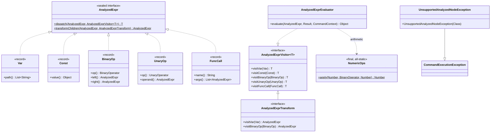
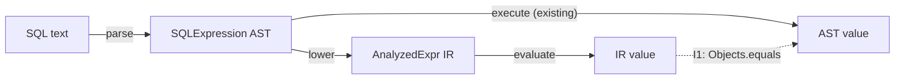
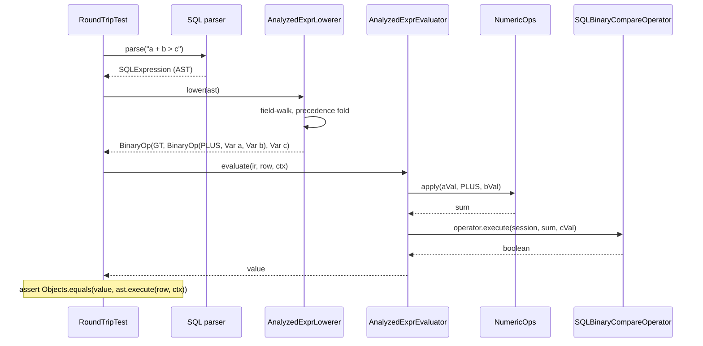

<!-- workflow-sha: 6b81c6b970b0c58300e4c053a5883c2482d3dd25 -->
# Analyzed-expression substrate (S0) — Design

## Overview

YouTrackDB has no analyzed form for SQL expressions. The `SQL*` parse-tree
classes under `core/.../sql/parser/` are the raw AST, the analyzed form, the
optimizer surface, and the runtime evaluator all at once: optimizer rewrites live
as methods on parse nodes (`SQLBooleanExpression.flatten`, `mergeUsingAnd`) and
executor steps embed AST fragments directly. Every later decision routes through
the parse tree.

This design adds `AnalyzedExpr`: a small sealed-interface intermediate
representation (IR — a data-only tree the optimizer and evaluator read instead of
the parse tree) that lives alongside the AST. S0 is slice 0 of YTDB-901; it builds
the substrate and ships behind no flag with no live executor consumer. S1 wires the
first consumer; S3+ port the optimizer rewrites onto the IR.

S0's core is a Java 21 sealed interface with five immutable record
variants (`Var`, `Const`, `BinaryOp`, `UnaryOp`, `FuncCall`). Sealing lets the
compiler enforce an exhaustive `switch` over the variant set, so the nodes need no
`accept(visitor)` method. Each visitor call is then a direct (monomorphic) call.

S0 builds four pieces over the sealed type:

- A visitor/transform framework.
- A lowering pass that converts the covered AST subset to `AnalyzedExpr`.
- A runtime evaluator over that IR.
- A `NumericOps` helper extracted from the AST so both evaluators share one
  promotion engine.

Acceptance is round-trip parity — for
every covered SQL fragment, `lower(parse(sql)).evaluate(row, ctx)` equals
`parse(sql).execute(row, ctx)` — with no existing test changed.

This document is for contributors who maintain the SQL layer
(`core/.../sql/parser/`) and will read or extend the analyzed tree in S1+. It
assumes familiarity with the `SQL*` parse-node shapes and `CommandContext` /
`Result` evaluation, and with Java 21 sealed types and records. The rest of the
document is structured as: Core Concepts, then Class Design and Workflow diagrams,
then four reader-journey Parts — the substrate, the lowering pass, the evaluator,
and verification.

## Core Concepts

This design introduces six load-bearing ideas. Each is named here and used without
re-definition in the Parts that follow.

**Sealed IR with record variants.** `AnalyzedExpr` is a sealed Java interface
permitting exactly five immutable record variants. The variants carry data only —
equality, hashing, and accessors come from record defaults, no behavior. It replaces
the abstract-class-plus-subclasses idiom the AST uses (`SQLBooleanExpression` plus 21
subclasses), where each node carries its own `evaluate`/`execute` behavior. → Part 1
§"Sealed IR and exhaustive dispatch".

**Static visitor dispatch.** A visitor is an interface (`AnalyzedExprVisitor<T>`)
with one `visitX` method per variant; a single static `AnalyzedExpr.dispatch(expr,
visitor)` carries the one `switch` over the sealed type and calls the right `visitX`.
The nodes have no `accept(visitor)` method. It replaces the classic Visitor pattern's
per-node virtual `accept` call. → Part 1 §"Sealed IR and exhaustive dispatch".

**Structural sharing.** A rewrite pass (`AnalyzedExprTransform`) that changes one
subtree returns the *same instance* for every unchanged node, rebuilding only the
nodes on the path from the change to the root. "Same" is reference identity (`==`),
not value equality. It replaces nothing in the AST (the AST has no transform framework);
it is the shape S3+ optimizer passes will use. → Part 1 §"Transform passes and
structural sharing".

**`NumericOps`.** A neutral `final` all-static class at `core/.../sql/util/` that
owns the numeric-promotion engine — typed-pair widening, per-operator null handling,
`Date + Long`, and `String` concatenation. It is extracted whole from
`SQLMathExpression.Operator`; the AST's `Operator.apply(...)` and the new evaluator
both delegate to it. It replaces the promotion logic that currently lives only inside
the AST enum. → Part 3 §"NumericOps: one shared promotion engine".

**Structural precedence fold.** The AST stores arithmetic as a flat list of operands
and mixed-precedence operators and resolves precedence at evaluate time. The lowerer
reproduces that precedence-and-associativity nesting structurally to build a
correctly-nested `BinaryOp` tree; it reproduces only the *nesting*, never the value
arithmetic (that comes from `NumericOps`). It replaces nothing — the AST keeps its own
fold untouched. → Part 2 §"Precedence fold: flat AST list to nested BinaryOp".

**Round-trip parity.** The S0 acceptance test: lowering then evaluating a covered SQL
fragment yields a value `Objects.equals` to what the AST's own `execute` yields,
including null and type-coercion outcomes. The AST is the reference; a divergence is
a real evaluator or `NumericOps` bug, never a reason to relax the test. → Part 4
§"Round-trip parity and the test matrix".

## Class Design



The diagram shows the four artifact groups S0 delivers and how they relate.
`AnalyzedExpr` is the sealed root; the five records under it carry data only.
`AnalyzedExprVisitor<T>` is the generic visitor interface the evaluator implements
directly (so the evaluator must enumerate every variant — exhaustiveness, see Part 1).
`AnalyzedExprTransform` is the rewrite-pass shape that extends the visitor with
`AnalyzedExpr` as the return type and carries recurse-into-children defaults.
`NumericOps` sits in a separate package (`sql/util/`) that both the AST and the
evaluator depend on; the evaluator calls it for arithmetic. The two static helpers on
`AnalyzedExpr` (`dispatch`, `transformChildren`) carry the dispatch switch and the
recurse-and-rebuild logic once, so individual visitors and passes never re-write
them. `UnsupportedAnalyzedNodeException` extends the existing
`CommandExecutionException` so lowering failures surface as ordinary SQL
execution-time errors. The `BinaryOperator` / `UnaryOperator` operator tags carried by
`BinaryOp` / `UnaryOp` are the IR's own small enums (`+ - * /` for binary; `NOT` for
unary); they are not the AST's `SQLMathExpression.Operator`.

## Workflow



The flowchart shows the two evaluation paths the round-trip parity test
(invariant I1) compares. The existing path (`parse → AST.execute`) is the reference.
The new path (`parse → lower → evaluate`) is what S0 adds. For every SQL fragment in
the covered subset the two values must be `Objects.equals`. Lowering either produces a
complete IR tree or throws `UnsupportedAnalyzedNodeException` (invariant I2, no silent
fallback); it never returns a partial tree. The sequence below shows a single covered
comparison flowing through the new path.



The sequence shows the load-bearing reuse points. Arithmetic value semantics come
from the shared `NumericOps` (Part 3), not from a fold the lowerer reimplements. The
evaluator calls the AST's own `SQLBinaryCompareOperator` instance for the comparison.
Because it is the same operator object, the comparison inherits the AST's collation and
its EQ/NE session handling unchanged (Part 3, §"Comparison: replicate the AST sequence").
The lowerer's field-walk visits each recognized field of the AST node and throws on any
field outside the S0 subset. It is exhaustive-or-throw (Part 2): a covered fragment lowers
fully, and an out-of-subset shape throws rather than mis-reading.

# Part 1 — The substrate

The substrate is the sealed `AnalyzedExpr` IR plus the visitor/transform framework
and the lowering-failure exception. It is greenfield (new package
`core/.../query/analyzed/`, confirmed absent on develop) and has no dependency on the
lowering pass, evaluator, or verification work.

## Sealed IR and exhaustive dispatch

**TL;DR.** `AnalyzedExpr` is a sealed interface with five record variants carrying
data only. A visitor is an interface with one `visitX` per variant; a single static
`AnalyzedExpr.dispatch(expr, visitor)` carries the one `switch`. There is no
`accept(visitor)` on the nodes. Sealing makes adding a sixth variant a compile-time
break across the dispatcher and every visitor — the exhaustiveness that invariant I3
names.

The AST's incumbent idiom is an abstract base class with concrete subclasses
(`SQLBooleanExpression` plus 21 subclasses), where each node carries its own behavior
and dispatch is a virtual method call. For an IR that S3+ optimizer passes will walk
repeatedly in a long pipeline, that per-node virtual call is megamorphic — the JVM
cannot resolve it to one target, so it stays an indirect call. Sealing the IR removes
that cost: the compiler knows the closed set of five variants, so a `switch` over the
sealed type is exhaustive without a `default`, and the JIT lowers it to a table jump.
After the switch resolves, each `visitor.visitX(x)` is a direct monomorphic call. This
is the first sealed-type use in the codebase.

The five variants and the data each carries:

- `Var(List<String> path)` — an unresolved lexical name path. S0 lowers **single-segment**
  `Var`s (`["name"]`); a multi-segment path such as `p.name` is out of the S0 subset and
  throws `UnsupportedAnalyzedNodeException`, deferred to S1+ (D6-R). The `List<String>`
  shape is kept for S10, which will replace `Var` with range-table-resolved references
  (names bound to their `FROM`-clause source) — which is why S0 does not bake in a
  resolution model.
- `Const(Object value)` — a literal value (integer, string, boolean, or a negative
  number whose `sign` flag the parser already folded into the literal at parse time, so
  it arrives as one negated value rather than a unary-minus node).
- `BinaryOp(BinaryOperator op, AnalyzedExpr left, AnalyzedExpr right)` — `+ - * /` and
  the six comparisons `= != < <= > >=`. `BinaryOperator` is the IR's own small enum,
  not the AST's `SQLMathExpression.Operator`.
- `UnaryOp(UnaryOperator op, AnalyzedExpr operand)` — boolean `NOT` only. There is no
  unary-minus variant in practice: the grammar has no `-expr` node for non-literals
  (unary minus is a parse-time `sign` flag folded into a numeric literal), so lowering
  never produces `UnaryOp(MINUS)`. `UnaryOp` exists for `NOT` (the AST's `SQLNotBlock`).
- `FuncCall(String name, List<AnalyzedExpr> args)` — a function call. Method-call
  coercion syntax (`.asInteger()`) is structurally a function call and lowers here.

The YTDB-915 issue body lists a sixth variant, `Cast`; S0 ships without it. YouTrackDB
grammar has no `CAST(x AS T)` form (the grammar file `YouTrackDBSql.jjt` has no `CAST`
production), so type coercion is written as method-call syntax — `.asInteger()`,
`.asDate()` — carried on `SQLModifier.methodCall` and structurally a function call.
Those already lower through `FuncCall`. A dedicated `Cast` variant would have to carry a
target-type tag — the type a `CAST` would name, e.g. `INTEGER` or `DATE` — that no S0
lowering or evaluator path would read, so it would be a variant with no consumer. A later slice can add `Cast` if explicit `CAST` grammar
or an optimizer rewrite ever needs it. Two alternatives were rejected:

- Keep `Cast` and lower the method-call coercions into it — rejected because it invents a
  cast taxonomy to model what is already a function call.
- Ship `Cast` as a placeholder with no lowering — rejected as dead code.

Dispatch is centralized. `AnalyzedExpr.dispatch(expr, visitor)` is a static helper
holding the one `switch (expr)`:

```text
switch (expr) {
  case Var v        -> visitor.visitVar(v)
  case Const c      -> visitor.visitConst(c)
  case BinaryOp b   -> visitor.visitBinaryOp(b)
  case UnaryOp u    -> visitor.visitUnaryOp(u)
  case FuncCall f   -> visitor.visitFuncCall(f)
}
```

One `visitX` per variant makes the IR's shape explicit and self-documenting. The base
`AnalyzedExprVisitor<T>` carries **no** default methods, so a direct implementer (the
evaluator; any future non-`AnalyzedExpr`-returning pass) must enumerate every variant.
Adding a sixth variant then breaks the dispatcher's `switch` and every direct
implementer at compile time — invariant I3.

### Edge cases / Gotchas

- Adding a sixth variant is an intended compile-time break, not a regression. The
  sealed `switch` (no `default`) and the no-default base visitor are what force the
  audit of every dispatch site.
- The relaxation for transform passes (defaults that recurse into children) is scoped
  to `AnalyzedExprTransform` and never touches the base `AnalyzedExprVisitor<T>` — see
  the next section.

### Decisions & invariants

- D-records: D1 (sealed-interface IR with five record variants), D2 (visitor as
  interface; static `switch` dispatch, no `accept`), D4 (`Cast` variant dropped from S0
  scope), D6 (`Var` carries a `List<String>` name path), D6-R (S0 lowers single-segment
  `Var`s only; multi-segment paths throw, deferred to S1+)
- Invariants: I3

## Transform passes and structural sharing

**TL;DR.** `AnalyzedExprTransform extends AnalyzedExprVisitor<AnalyzedExpr>` is the
rewrite-pass shape for S3+ optimizer slices. Its five `visitX` methods carry
recurse-into-children defaults; the base visitor carries none. A static
`transformChildren(expr, t)` recurses one level and returns the *same instance* when no
child changed (reference identity), constructing a new parent record only when a child
changed.

Optimizer passes typically rewrite one subtree and leave the rest untouched. Rebuilding
the whole tree on every pass would allocate `O(tree-size)` per pass. Structural sharing
avoids that: a fold that fires at depth 10 of a 50-node tree allocates only the new node
plus the parent chain back to the root; every untouched subtree is returned by
reference. Centralizing the identity-comparison logic in one `transformChildren` helper
keeps individual passes from re-implementing (and subtly mis-implementing) it.

Worked example. A pass folds the constant subexpression in `(1 + 2) * x`, whose IR is
`BinaryOp(STAR, BinaryOp(PLUS, Const 1, Const 2), Var x)`. The pass's `visitBinaryOp`
on the inner `PLUS` node returns a new `Const 3`. `transformChildren` on the outer
`STAR` node then sees one child changed (the left went from the `PLUS` node to `Const
3`) and one child unchanged (`Var x`), so it allocates one new `BinaryOp(STAR, Const 3,
Var x)` and reuses the original `Var x` instance by reference. Nothing below `Var x` is
rebuilt. Had no child changed — say a pass that matches only `FuncCall` ran over this
tree — `transformChildren` would return the original `STAR` node itself, and the pass
would allocate nothing.

`transformChildren`'s per-variant behavior:

- Leaf variants (`Var`, `Const`) return self.
- Compound variants (`BinaryOp`, `UnaryOp`) recurse into each child; if every child
  returns by reference unchanged, return the parent by reference; otherwise build one
  new parent record.
- `FuncCall` lazily allocates its new argument list on the first changed element, so an
  unchanged argument list is never copied.

The five default `visitX` on `AnalyzedExprTransform` do exactly this: leaf variants
return self, compound variants call `transformChildren`. A pass that rewrites one
variant overrides only that `visitX` and inherits pass-through for the rest. This
removes four boilerplate overrides per pass while leaving the base
`AnalyzedExprVisitor<T>` strict, so the evaluator (which implements the base visitor)
still breaks at compile time on a new variant. This is the same shape as Calcite's
`RexShuttle`, Spark's `TreeNode.transform`, and ANTLR's `*BaseVisitor`.

### Edge cases / Gotchas

- Equality is by reference identity, not value. A transform that reconstructs an
  `equals`-but-distinct copy of an unchanged node counts as "changed" and defeats the
  sharing. The rule for transform authors: return the input reference when no change
  applies; never rebuild an equal copy.
- Adding a new IR variant requires an explicit audit of every transform pass. A pass
  needing special handling for the new variant fails *silently* (default-recurses)
  rather than at compile time, because the defaults make every variant
  pass-through-able. Make the audit part of the variant-addition checklist — this is the
  one place the I3 compile-time guarantee does not reach.

### Decisions & invariants

- D-records: D8 (`AnalyzedExprTransform` with structural sharing), D9 (defaults on
  `AnalyzedExprTransform`, none on the base visitor)
- Invariants: I3

## Lowering failures: UnsupportedAnalyzedNodeException

**TL;DR.** `UnsupportedAnalyzedNodeException(astNode.getClass())` is thrown for any AST
shape outside the S0 covered subset; it extends the existing
`CommandExecutionException`. Carrying the unsupported AST class name gives an actionable
diagnostic.

Lowering happens in the same logical phase as execution preparation, and
`CommandExecutionException` is the established base for SQL execution-time errors, so an
unsupported-node failure surfaces the same way other execution-time failures do.
Extending `BaseException` would be less specific; extending `ParseException` would put
the failure on the wrong (parser-side) layer. The exception is the mechanism behind
invariant I2: a successful `lower(...)` return means full IR coverage of the input,
because the only alternative to a complete tree is a throw.

### Edge cases / Gotchas

- The exception carries the AST node's class, not its rendered text, so the diagnostic
  names the unsupported *shape* (e.g. `SQLJson`) rather than echoing user SQL.

### Decisions & invariants

- D-records: D7 (`UnsupportedAnalyzedNodeException extends
  CommandExecutionException`)
- Invariants: I2

# Part 2 — The lowering pass

Lowering converts the covered AST subset to `AnalyzedExpr`. It depends on Part 1 (it
produces IR types) and is the heaviest piece because it owns three non-obvious
mechanisms: an exhaustive-or-throw field walk over a union-style AST, transparent
recursion through parenthesis grouping, and a structural precedence fold over the AST's
flat operator list.

## Field-walk: exhaustive-or-throw over the union AST

**TL;DR.** The AST is union-style — `SQLExpression` holds a fixed field set with one
field non-null per instance. The lowerer field-walks the recognized in-subset fields and
throws `UnsupportedAnalyzedNodeException` on anything else, so invariant I2 (a successful
`lower` means full coverage) holds by construction regardless of which fields a future
parser change adds.

`SQLExpression` is not a class hierarchy the lowerer can dispatch on; it is one class
with a bag of fields, exactly one non-null per parsed expression. The current field set
(confirmed via PSI on develop) is: `isNull`, `rid`, `mathExpression`,
`arrayConcatExpression`, `json`, `booleanExpression`, `booleanValue`, `literalValue`,
plus the `singleQuotes` / `doubleQuotes` flags. The S0 subset covers only
`mathExpression`, `booleanExpression`, `literalValue`, `booleanValue`, and `isNull`;
`rid`, `arrayConcatExpression`, and `json` are out of subset and must throw.

The walk does not assume the recognized fields are the complete set. It dispatches on the
recognized in-subset fields and throws on everything else as the default. This matters
because the field set changes as the parser evolves: the inherited `SimpleNode.value` field
and the "old executor" fallback chain in `SQLExpression.execute` (commented "only for old
executor — manually replaced params") were missing from the field set inventoried above.
Asserting field-walk completeness over an incomplete field set would be unsound. Defaulting to throw-on-unknown
makes I2 robust to the gap: an unrecognized non-null field throws rather than being
silently mis-read. Whether `SimpleNode.value` is ever non-null on the modern parser path
is a Phase-A PSI verification note — if dead, the walk may ignore it; if reachable, the
throw-default already makes lowering throw rather than mis-read.

Once the walk reaches `mathExpression` (`SQLBaseExpression extends SQLMathExpression`,
fields `number`, `identifier`, `inputParam`, `string`, `modifier`), it descends into
these leaf shapes:

- `number` (a `SQLNumber`) → `Const`. A negative literal lowers to a negative `Const`
  (the `sign` flag is already folded in).
- `identifier` (a `SQLBaseIdentifier`) with no modifier → `Var`, **single-segment only**;
  a multi-segment suffix-chain (`p.name`) is out of the S0 subset and throws (deferred to
  S1+ — D6-R). With a modifier (method call) → `FuncCall`.
- `string` / character literal, optionally with a modifier → `Const`, or `FuncCall` for
  a method call.
- `inputParam` (a bind parameter `?` / `:name`) → throw. S0 does not lower bind
  parameters; the future-slice shape (dedicated `Param` variant vs evaluate-time
  threading) is an open question that gates no S0 artifact.

`SQLBaseIdentifier` has exactly one of `levelZero` (a `SQLLevelZeroIdentifier`) or
`suffix` (a `SQLSuffixIdentifier`) non-null. `Var`'s name path flattens that identifier
into a `List<String>` via an `identifierToPath` mapper. S0 supports the single-segment
shape (a bare column name); a multi-segment chain is out of subset (D6-R), so its exact
suffix-chain shape stays a deferred S1+ detail. Only the `suffix` form lowers: a
single-segment `suffix` column → `Var`, and a `suffix` carrying a method-call modifier →
`FuncCall`. The `levelZero` form is out of the S0 subset — a `SQLLevelZeroIdentifier`
carrying a top-level `functionCall` (including the iteration functions `any()` / `all()`),
the `self` reference (`@this`), or an inline `collection` (`[..]`). `identifierToPath`
handles only the `suffix` shape, so a `levelZero` identifier hits the field-walk's
exhaustive-or-throw default (D14/D7) and throws `UnsupportedAnalyzedNodeException`.
`any()` / `all()` must throw specifically: they carry property-iteration semantics
(`SQLBinaryCondition.evaluate(Result)`'s `isFunctionAny` / `isFunctionAll` branches) that
the IR comparison evaluator, replicating only the slow comparison sequence, does not
reproduce. So `FuncCall` comes solely from a method-call modifier (`SQLModifier.methodCall`),
never from a top-level `levelZero` function call. Boolean `NOT` lowers from `SQLNotBlock` (fields `sub`,
`negate`): `SQLNotBlock(negate=true, sub)` → `UnaryOp(NOT, lower(sub))`; `negate=false`
is a pass-through to `lower(sub)`.

### Edge cases / Gotchas

- `value` field gap: the field-walk's throw-default is the safety net for any AST field
  the field set missed (`SimpleNode.value` is the known example), so a field-set gap
  degrades to a throw, never to a wrong value.
- Bind parameters throw in S0 by design; do not mistake the open future-slice question
  for a blocking gap.

### Decisions & invariants

- D-records: D6 (`Var` name path from the flattened identifier), D6-R (single-segment
  only; multi-segment paths throw, deferred to S1+), D7 (out-of-subset
  fields throw `UnsupportedAnalyzedNodeException`), D14 (field-walk is
  exhaustive-or-throw; `value` flagged for Phase-A PSI), D18 (`levelZero`
  identifiers — top-level `functionCall` incl. `any()`/`all()`, `@this`, inline
  collections — are out of the S0 subset and throw; `FuncCall` comes only from
  method-call modifiers)
- Invariants: I2

## Parenthesis: recurse on grouping, throw on subquery

**TL;DR.** A parenthesized arithmetic expression like `(a + b) * c` is in the covered
subset. `SQLParenthesisExpression` carries two mutually-exclusive payloads: `expression`
(pure grouping) and `statement` (a subquery). The lowerer lowers the grouping form by
recursing — `lower(expression)` — and throws only when `statement != null` or for a
`CaseExpression`. No `Paren` IR variant exists.

Parentheses are the user's precedence-override mechanism, so `(a + b) * c` is one of the
most common precedence inputs; treating every `ParenthesisExpression` as a throw-case
would make round-trip parity (I1) unsatisfiable on it. The grouping wrapper is
transparent at evaluate time — the AST's `expression` form delegates straight to
`expression.execute(...)` — so recursing through it reproduces the AST exactly. The IR
tree's nesting already encodes grouping, so a dedicated `Paren` variant would be
redundant and S3+ optimizer passes would only have to strip it. Only `statement` (a
subquery) and `CaseExpression` (CASE WHEN) are out of S0 scope and throw.

### Edge cases / Gotchas

- The two payloads are mutually exclusive; the lowerer checks `statement != null` first
  and throws, otherwise recurses into `expression`.

### Decisions & invariants

- D-records: D10 (`SQLParenthesisExpression`: recurse on `expression`, throw on
  `statement`/CASE)
- Invariants: I1, I2

## Precedence fold: flat AST list to nested BinaryOp

**TL;DR.** `SQLMathExpression` stores arithmetic as a flat list — `childExpressions`
plus `operators` — at one nesting level, and resolves precedence at evaluate time, not
parse time. The lowerer reproduces that precedence-and-associativity nesting
*structurally* to build a correctly-nested `BinaryOp` IR tree. The AST's own fold
(`calculateWithOpPriority` / `iterateOnPriorities`) is left untouched. All *value*
semantics come from the shared `NumericOps` at evaluate time, never from this fold.

The prior design assumed the AST math node was already binary. It is not. The grammar
rule `MathExpression()` collects all operators of mixed precedence into one flat list at
one nesting level (`FirstLevelExpression() ( <op> FirstLevelExpression() )*`), then
`unwrapIfNeeded()` collapses a single-child node to its child. Precedence is resolved at
execute time by a precedence-climbing reduction (`calculateWithOpPriority` →
`iterateOnPriorities(Deque, Deque<Operator>)`, using `Operator.getPriority()` and `<=`
left-associative reduction). If the lowerer copied the flat list naively, round-trip
parity would break on any expression mixing precedence levels.

Worked interleaving — why a naive copy breaks parity. Take `a + b * c`. The AST parses
this as one flat node: `childExpressions = [a, b, c]`, `operators = [PLUS, STAR]`. `STAR`
has priority 10 (binds tighter), `PLUS` has priority 20. The AST's `iterateOnPriorities`
reduces the tightest-binding operator first, so it computes `b * c` and then `a + (b *
c)`. A naive left-to-right lowering would instead build `BinaryOp(STAR, BinaryOp(PLUS, a,
b), c)` — i.e. `(a + b) * c` — and evaluate `(a + b) * c`. For `a=1, b=2, c=3` the AST
yields `1 + 6 = 7` and the naive tree yields `3 * 3 = 9`. The two diverge, and I1 fails.
The lowerer therefore runs the same precedence-climbing reduction the AST runs: keyed on
`Operator.getPriority()` with `<=` left-associative reduction, producing `BinaryOp(PLUS,
Var a, BinaryOp(STAR, Var b, Var c))` so the IR tree's shape matches the AST's evaluation
order.

Why reimplement the fold structurally rather than share one fold. Two folds is the same
drift surface that the `NumericOps` extraction (Part 3) eliminates for promotion, so the
question is fair. But the share-the-fold options penalize the live path. The AST fold is
the *hot* math-eval path (`iterateOnPriorities` drives every AST math evaluation); the IR
fold is *cold* in S0 (no IR consumer until S1). Extracting a generic fold parameterized
by a combiner would inject a functional-interface call into the hot AST eval loop. The
shared fold would be called with two different combiner lambdas (the AST's `apply`,
lowering's `new BinaryOp`), so the call site sees two receiver types — bimorphic — which
the JIT cannot collapse to one inlinable target. That conflicts with the codebase's
preference for monomorphic call sites the JIT can inline (the same preference D1/D2's
static dispatch follows). The reimplemented fold is *purely structural*: it determines nesting
only. All value semantics — null sentinel, numeric promotion, `Date + Long`,
`String` concat — come from the shared `NumericOps` at evaluate time. So the duplicated
logic is a textbook precedence-climbing reduction — low risk. The genuine drift surface,
promotion, stays single-homed in `NumericOps`.

### Edge cases / Gotchas

- The fold reproduces *only* nesting. If the lowerer ever reached for a value computation
  here, that would be a second promotion engine and a drift bug; arithmetic values are
  the evaluator's job via `NumericOps`.
- Left-associativity must match the AST's `<=` reduction: `a - b - c` is `(a - b) - c`,
  not `a - (b - c)`. The two differ in value, so the test matrix pins it (Part 4).

### Decisions & invariants

- D-records: D12 (lowerer builds the nested `BinaryOp` tree by a structural
  precedence-climbing fold; value semantics from shared `NumericOps`)
- Invariants: I1

# Part 3 — The evaluator

The evaluator implements `AnalyzedExprVisitor<Object>` directly (so it must enumerate
every variant) and produces a value for a lowered IR tree. It depends on Part 1 (IR
types), Part 2 (lowering produces trees to evaluate), and the `NumericOps` extraction
below. Its two load-bearing mechanisms are arithmetic via shared `NumericOps` and a
comparison path that replicates the AST's exact sequence.

## NumericOps: one shared promotion engine

**TL;DR.** The whole numeric-promotion engine moves out of `SQLMathExpression.Operator`
into a neutral `final class NumericOps` (private constructor, all-static) at
`core/.../sql/util/`. `SQLMathExpression.Operator.apply(...)` becomes a thin delegator;
the new evaluator delegates to the same `NumericOps` for `+ - * /`. With one home for
promotion, AST/IR drift on edge cases is structurally impossible.

If the AST and IR evaluators each held their own promotion logic, they would drift on
edge cases — integer-vs-double divide, null propagation, `Date + Long`. A single shared
helper makes divergence impossible. `sql/util/` (confirmed absent on develop) is a fresh
neutral location both layers can depend on; placing `NumericOps` inside `query/analyzed/`
would force a backward dependency from the AST package to a sibling, and `sql/method/`
already means typed method dispatch.

The extraction is whole-enum, not narrow. `SQLMathExpression.Operator` is an inner enum
with 12 constants — `STAR`, `SLASH`, `REM`, `PLUS`, `MINUS`, three shifts, `BIT_AND`,
`XOR`, `BIT_OR`, `NULL_COALESCING`. The numeric argument on each constant is its
precedence priority. The promotion engine all 12 share has four parts:

- The five abstract typed-pair `apply(...)` overloads (`Integer`, `Long`, `Float`,
  `Double`, `BigDecimal`).
- The fallback `apply(Object, Object)`.
- The shared widening entry `apply(Number, Operator, Number)`, which widens by the right
  operand's runtime type.
- The private static `toLong` helper.

The narrow alternative extracts only the `+ - * /` paths. The other eight operators
invoke the same widening, so the shared widening helper would be split across
`NumericOps` and `Operator` — an unclean seam. Whole-enum extraction gives a clean
single home and a self-verifying acceptance gate: every existing AST math test must stay
green after `Operator.apply` becomes a delegator.

The math semantics the existing AST tests pin, which must be preserved exactly across the
AST/IR split:

- Integer-divide returns the integer type when the remainder is zero, else widens to
  `Double`.
- Null propagation: `null + x = x`, `null - x = 0 - x`, `null * x = null`,
  `null / x = null`.
- `Date + Long` and `Long + Date` produce a `Date`; `Date - Long` produces a `Date`
  (`Date - Date` is not handled by the AST and is out of scope).
- `+` does `String` concatenation when either operand is a `String` (the other operand is
  `toString()`-ed).

### Edge cases / Gotchas

- The eight operators outside the S0 IR subset (`REM`, shifts, bitwise,
  `NULL_COALESCING`) get extracted but have no S0 IR consumer. That is intended — they
  keep working through the AST delegator; the only cost is the larger set of AST-side
  call sites the extraction touches.
- `NumericOps` is all-static with a private constructor, and the extraction touches the
  **live** AST arithmetic hot path (`Operator.apply` runs on every AST math eval via
  `iterateOnPriorities`). Perf-neutrality rests on leaving the existing **two-hop** virtual
  dispatch intact: `operator.apply(left, right)` → the per-constant `apply(Object, Object)`
  body → the shared widening `apply(Number, Operator, Number)`, which itself re-dispatches
  virtually via `operation.apply(typed, typed)`. The whole-enum lift-and-shift moves the
  shared widening into the all-static `NumericOps` and adds only a monomorphic `NumericOps`
  delegation around it — no new virtual indirection, and the added static call inlines. The
  typed `apply(...)` overloads either stay on the enum (with `NumericOps` calling back) or
  move with it; **the `NumericOps` extraction work must state that boundary**. S0's acceptance gate stays the existing
  math-test suite (e.g. `MathExpressionTest`, correctness) green after the delegation;
  runtime perf-neutrality is verified at S1's LDBC JMH gate (YTDB-916's CCX33-neutral
  acceptance and YTDB-901's umbrella JMH-neutrality requirement), the first slice with a
  live consumer to measure — not a standalone S0 Hetzner run.

### Decisions & invariants

- D-records:
  - D5 (`NumericOps` lives at a neutral `core/.../sql/util/` location both the AST
    package and the new `query/analyzed/` package can depend on). Rejected: duplicate
    the promotion logic in the IR evaluator (guarantees drift); place it inside
    `query/analyzed/` (forces a backward dependency from the AST package to a sibling);
    place it under `sql/method/` (that package already means typed method dispatch).
    D5-R supersedes only D5's scope half (whole-enum vs narrow extraction); the
    placement fork above remains live.
  - D5-R (`NumericOps` extraction moves the whole enum out unchanged)
  - D17 (the extraction touches the live AST arithmetic hot path; perf-neutrality rests
    on the two-hop `operator.apply` → typed `operation.apply` re-dispatch staying intact,
    and runtime measurement is deferred to S1's LDBC JMH gate)
- Invariants: I1

## Comparison: replicate the AST sequence

**TL;DR.** The IR comparison evaluator reproduces `SQLBinaryCondition.evaluate(Result,
ctx)`'s exact sequence: resolve the collate for the left operand's column (falling back
to the right) by reaching its schema property through the `Result`, apply
`collate.transform(...)` to both operands when non-null, then delegate to
the parser's own `SQLBinaryCompareOperator` instance — the same operator object the AST
holds — rather than calling `QueryOperatorEquals.equals` or `doCompare` statically. This
makes comparison parity genuinely structural: the IR runs the same code the AST runs.

The tempting shortcut — call the bare static comparison routines — drops two AST nuances
and breaks parity on real inputs.

The first nuance is collation. `Collate` is a per-property comparison transform: a
case-insensitive (`ci`) string property compares `'Foo'` and `'foo'` as equal. The AST
applies it before comparing. The confirmed `SQLBinaryCondition.evaluate(Result, ctx)`
slow-path sequence is:

1. Evaluate both operands: `leftVal = left.execute(...)`, `rightVal =
   right.execute(...)`.
2. Fetch the collate: `collate = left.getCollate(currentRecord, ctx)`, and if null,
   `collate = right.getCollate(currentRecord, ctx)`. `getCollate` is not a field read —
   it uses the `Result` to reach the operand's schema property.
3. If `collate != null`, transform both operands: `leftVal = collate.transform(leftVal)`
   and `rightVal = collate.transform(rightVal)`.
4. Delegate: `operator.execute(ctx.getDatabaseSession(), leftVal, rightVal)`.

A raw static `equals` skips steps 2 and 3, so `name = 'Foo'` against a `ci`-collated
`name` returns `true` in the AST but `false` for the raw call.

The second nuance is session threading. `SQLEqualsOperator.execute` calls
`QueryOperatorEquals.equals(session, left, right)` with the real session;
`SQLNeOperator.execute` calls `!QueryOperatorEquals.equals(null, left, right)` with a
`null` session (confirmed on develop). When the two operands are different types,
`equals` runs them through `PropertyTypeInternal.convert` — a cross-type coercion step —
before the actual compare. That coercion consults the session. A `null` session changes
how the coercion resolves, so the EQ branch (real session) and the NE branch (`null`
session) can produce different compare results on the same mixed-type operands. Calling
one shared `equals(session, ...)` for both operators would feed the same session to both
and so reproduce the AST only on `=`, drifting on `!=`. Delegating to the parser operator instance
runs the AST's exact branch for each operator, so the EQ/NE difference is reproduced by
construction. This also reinforces the single-`Result`-overload choice (D3). A `Result` carries the
projection/property context that `getCollate` reads — the suffix path resolves the
collate by asking the result's entity for its schema property
(`currentResult.asEntity()` → `getImmutableSchemaClass(session)` →
`schemaClass.getProperty(...)` → `property.getCollate()`).
The `Identifiable`-input overload skips collation — but not because a bare `Identifiable`
lacks that context. An `Identifiable` is a record reference (a RID); loading it yields an
`EntityImpl` whose `getImmutableSchemaClass` → `getProperty` → `getCollate` chain is
exactly what the resolution above consumes, so the schema context is recoverable. The
overload simply never attempts it: the skip is a deliberate AST behavioral inconsistency
(the inline author comments mark it intentional fast-path design), not a missing-context
limitation. The analyzed layer unifies that inconsistency by applying collation uniformly
through the one `Result` overload. So the IR must follow the `Result` overload, because
that is the collation-applying path the executor uses — and the collation-*correct* one.

Because the IR holds a `Var` (a name path), not an `SQLExpression`, it cannot call the
parser's `getCollate`. The IR comparison evaluator re-implements the single-property
resolution directly — the step-2 primitive, still tried left-operand-first then right:
`result.asEntity()` → `getImmutableSchemaClass(session)` →
`getProperty(name)` → `property.getCollate()`, returning `null` for any non-`Var` operand
(a literal or computed sub-expression has no column to resolve). S0 lowers
**single-segment** `Var`s only; a multi-segment path such as `p.name` throws
`UnsupportedAnalyzedNodeException` and is deferred to S1+ (D6-R). The AST resolves a
multi-segment collate by a runtime link traversal — `SQLBaseExpression.getCollate`
executes the path prefix link-by-link, then resolves the terminal property's collate on
the terminal record's schema — which a substrate slice need not reproduce. Collation is
not syntactic, so the lowerer cannot carve out collated comparisons by collation; but
path length **is** syntactic, so throwing on a multi-segment `Var` keeps round-trip
parity (I1) by construction: the IR evaluates only the operand shapes it faithfully
reproduces.

The slow path is the parity reference. `SQLBinaryCondition.evaluate` also has an in-place
comparison fast path (`tryInPlaceComparison`), but it is parity-equivalent — for any case
the slow path's collation handling would change, the fast path returns `FALLBACK` (null)
and the code falls through to the slow path. So the IR evaluator and the I1 tests target
the slow path; the IR *structure* need not encode the fast path at all.

Slow-path-only is correct **for S0** precisely because S0 ships with no live executor
consumer (Overview; Part 4) — there is no production path to regress, and round-trip
parity is the only acceptance criterion. That changes at S1: when YTDB-916 wires the
evaluator into `FilterStep` on the hot path, the evaluator must reproduce the AST's
evaluation fast paths or it regresses the most common filter shapes (and the LDBC JMH
neutrality S1 requires). Two carry the obligation: (a) the in-place comparison
(`tryInPlaceComparison` → `EntityImpl.isPropertyEqualTo` / `comparePropertyTo`, avoiding
property deserialization for `property <op> constant`; it is also the parity-preserving
seam — it returns `FALLBACK` whenever collation or coercion could change the result and
falls through to the slow path, so the S1 equivalent must keep that fall-through), and
(b) boolean `AND`/`OR` short-circuit (`SQLAndBlock` / `SQLOrBlock` stop at the first
decisive sub-block) — the latter is correctness as well as performance, since eager
evaluation can throw where the AST short-circuits past it. `AND`/`OR` are out of the S0 IR
operator set today (the comparison and arithmetic operators are the whole `BinaryOperator`
enum), so the short-circuit obligation lands when S1 extends lowering to `SQLWhereClause`.

### Edge cases / Gotchas

- Collation cannot be excluded at the expression level: it is a per-property attribute,
  not syntactic, so the subset cannot "skip collated columns". The IR must reproduce the
  collate transform.
- The ordering operators (`< <= > >=`) map to `doCompare(l, r)` compared to 0; delegating
  to the operator instance subsumes this mapping too — no separate handling.

### Decisions & invariants

- D-records: D3 (single `evaluate(Result, CommandContext)` overload), D11 (IR
  comparison evaluator replicates `SQLBinaryCondition.evaluate` — collate transform
  plus the parser-operator instance, not bare statics), D6-R (collate fetch pinned to the
  single-property resolution; multi-segment `Var` throws, deferred to S1+), D15 (the AST
  `evaluate(Identifiable)` collation skip is a deliberate AST inconsistency the analyzed
  layer unifies — collation applies uniformly via the single `Result` overload), D16
  ("fast path need not mirror" is scoped to S0; the S1+ evaluator must reproduce the AST
  evaluation fast paths on the hot path)
- Invariants: I1

## Evaluator interface: single Result overload

**TL;DR.** The evaluator exposes one `evaluate(expr, row, ctx)` overload over `Result`.
An `Identifiable`-only caller arriving in S1+ wraps its input in a synthetic entity-backed
`Result` via a small adapter helper, so it too evaluates through the collation-applying
path. A single overload keeps every visitor from implementing two paths.

The AST carries dual `(Result, …)` and `(Identifiable, …)` overloads for historical
reasons, and — as the comparison section shows — only the `Result` overload applies
collation; the `Identifiable` overload's skip is a deliberate AST inconsistency. The
analyzed tree is greenfield and serves higher-layer callers (executor steps, optimizer
passes) that already operate on `Result`, so a single `Result` overload keeps the visitor
simple and unifies that inconsistency: an `Identifiable`-only caller wrapped in a synthetic
entity-backed `Result` evaluates through the collation-applying path. This is not a rare
edge — `evaluate(Identifiable)` has ~12 production callers, including `SQLWhereClause` and
`SecurityEngine` — so the unification is an observable, deliberate behavior change: a
`ci`-collated comparison (and a `ci`-collated security predicate) begins matching
case-insensitively where the AST `Identifiable` path did not. S0's I1 round-trip parity
exercises only the `Result` overload, so it is unaffected; the divergence is an S1+
concern, and S1 (`FilterStep` / WHERE, YTDB-916) and S7 (`SecurityEngine`, YTDB-922) must
validate it when they wire the `Identifiable` path. The adapter's synthetic-`Result`
allocation is trivial, and a hot path that later cannot tolerate the wrap can grow a second
path without breaking existing code.

### Edge cases / Gotchas

- The adapter's synthetic-`Result` allocation is the only *cost* of the single-overload
  choice. Its *behavioral* consequence — collation now applies on the `Identifiable` path —
  is the deliberate convergence above, validated by S1/S7 against the ~12 callers, not an
  incidental side effect.

### Decisions & invariants

- D-records: D3 (single `evaluate(Result, CommandContext)` overload), D15 (collation
  applies uniformly through this single overload — the synthetic-`Result` wrap applies the
  collate transform for the ~12 `evaluate(Identifiable)` callers incl. WHERE /
  `SecurityEngine`, validated at S1/S7)

# Part 4 — Verification and delivery

The substrate ships with no live executor consumer, so its only S0 proof is round-trip
parity against the AST. This Part covers the parity invariant and its test matrix.

## Round-trip parity and the test matrix

**TL;DR.** For every SQL fragment in the covered subset,
`lower(parse(sql)).evaluate(row, ctx)` must be `Objects.equals` to
`parse(sql).execute(row, ctx)`, including null and type-coercion outcomes. The AST is the
reference; a divergence is a real evaluator or `NumericOps` bug, never a reason to relax
the test. A round-trip test class asserts the matrix below.

Parity is the acceptance criterion from the YTDB-915 issue, and it is what lets S0 ship a
substrate with no consumer: the AST's `execute` is the oracle, so the IR path is correct
exactly when it matches. Two further invariants back it. Invariant I2 (no silent
fallback): lowering an unsupported shape throws `UnsupportedAnalyzedNodeException` and
never returns a partial tree, so a successful `lower` means full coverage — the contract
S1+ consumers rely on. Invariant I3 (exhaustive dispatch): a new variant is a compile-time
break for every `AnalyzedExprVisitor<T>` implementation.

The test matrix exercises each non-obvious lowering and evaluation mechanism:

| Fragment | Mechanism it pins |
|---|---|
| `a + b * c` | Precedence fold: `STAR` binds tighter than `PLUS` (Part 2) |
| `a * b + c` | Precedence fold, operators in the other order |
| `a - b - c` | Left-associative reduction `(a - b) - c`, not `a - (b - c)` |
| `a - b + c` | Mixed same-priority left-associativity |
| `a / b / c` | Integer-vs-double divide widening through `NumericOps` |
| `(a + b) * c` | Parenthesis recursion overrides precedence (D10) |
| `a * (b + c)` | Parenthesis recursion, grouping on the right |
| `ci-column = 'Foo'` (mixed case) | Collation transform in comparison (D11) |
| type-coercing `!=` | NE passes a null session to coercion, EQ the live one (D11) |

Each row asserts the lowered IR tree evaluates `Objects.equals` to the AST. The
arithmetic rows pin both the structural fold (Part 2) and the shared promotion engine
(Part 3); the parenthesis rows pin D10; the two comparison rows pin the collation and
the EQ/NE session difference of D11.

Parity is a correctness oracle, not a performance one, so it is not the whole verification
bar for the YTDB-901 umbrella that parents this slice. Performance is verified separately
and per slice: under YTDB-901's umbrella JMH-neutrality requirement, every functional slice
under YTDB-901 must extend benchmark coverage for the functionality it adds — a targeted
JMH microbenchmark exercising the eval path(s) it touches, on top of the LDBC SF1 neutrality
gate — so a new expression path is measured directly rather than left green-but-unmeasured.
Each slice names which path its benchmark exercises (D17 records the S0 `NumericOps`
hot-path basis; D19 generalizes the obligation across every slice under YTDB-901, blanket
from S1 on — S0 itself stays on its correctness gate, having no live consumer to measure).

### Edge cases / Gotchas

- The matrix is the minimum required set, not an exhaustive one. Any covered fragment may
  be tested; these rows pin a mechanism a naive implementation would get wrong.
- Null and `Date + Long` outcomes are part of parity (`Objects.equals` over the produced
  values), so null-propagation rows and a `Date + Long` row belong in the suite even
  though they are not listed above as precedence/collation pins.

### Decisions & invariants

- D-records: D11 (comparison parity via the replicated AST sequence), D12 (precedence
  fold parity), D17 (S0 `NumericOps` hot-path perf-neutrality basis; runtime measurement
  deferred to S1's LDBC JMH gate), D19 (every functional slice under YTDB-901 extends
  per-functionality JMH benchmark coverage on top of LDBC neutrality, blanket across S1–S7)
- Invariants: I1, I2, I3
