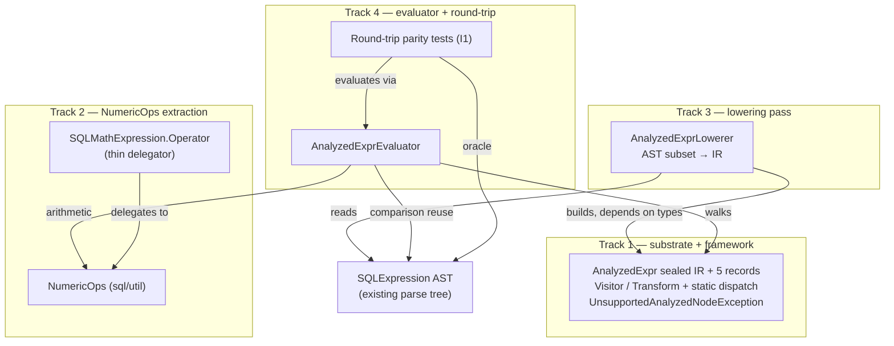

<!-- workflow-sha: 6b81c6b970b0c58300e4c053a5883c2482d3dd25 -->
# Analyzed-expression substrate (S0)

## Design Document
[design.md](design.md)

## Component Map

The slice S0 touches: a greenfield analyzed-expression IR and its framework, a
shared numeric-promotion engine extracted from the AST, a lowering pass that reads
the existing AST, and an evaluator with its parity test suite. The diagram shows the
cross-track topology; the bullets name what each track changes and why.

- **Track 1 — substrate + framework.** New package `core/.../query/analyzed/`: the
  sealed `AnalyzedExpr` IR, its five record variants, the visitor/transform interfaces
  with the centralized static `dispatch`/`transformChildren`, and the lowering-failure
  exception. Greenfield; nothing depends on it yet. Supplies the IR types Tracks 3 and 4
  consume.
- **Track 2 — NumericOps extraction.** New `core/.../sql/util/NumericOps.java` holding
  the whole numeric-promotion engine lifted from `SQLMathExpression.Operator`, which
  becomes a thin delegator. AST-side only; gives the evaluator (T4) a shared promotion
  home so AST/IR arithmetic cannot drift.
- **Track 3 — lowering pass.** New `AnalyzedExprLowerer` in `query/analyzed/` that reads
  the covered `SQLExpression` AST subset and produces `AnalyzedExpr`. Reads many AST
  classes but modifies none. Depends on T1 for the IR types.
- **Track 4 — evaluator + round-trip.** New `AnalyzedExprEvaluator` (walks the IR; calls
  `NumericOps` for arithmetic; reuses the AST's own `SQLBinaryCompareOperator` for
  comparison) plus the round-trip parity test suite that is S0's whole acceptance bar.
  Depends on T1 (types), T2 (`NumericOps`), and T3 (trees to evaluate).

## Checklist
- [x] Track 1: Substrate + framework
  > Track 1 builds the greenfield `AnalyzedExpr` substrate: a Java 21 sealed interface
  > with five immutable record variants, the static-dispatch visitor and
  > structural-sharing transform framework over it, and the
  > `UnsupportedAnalyzedNodeException` lowering-failure type. It is the foundation the
  > lowering pass and evaluator build on and has no dependency on the rest of S0.
  >
  > **Track episode:** Sealed `AnalyzedExpr` IR + 5 nested records, static
  > `dispatch`/`transformChildren`, visitor/transform framework, and
  > `UnsupportedAnalyzedNodeException` shipped (7 files, 15/15 tests, 100%/100% cov) —
  > see `plan/track-1.md` `## Episodes` § Track completion. (1 step, 0 failed)
  >
  > **Track file:** `plan/track-1.md`
  >
  > **Strategy refresh:** CONTINUE — Track 1 discoveries are IR-side (FuncCall.args()
  > read-only convention recorded for Tracks 3/4); Track 2 is AST-side and unaffected.

- [x] Track 2: NumericOps whole-enum extraction
  > Track 2 extracts the whole numeric-promotion engine out of
  > `SQLMathExpression.Operator` into a neutral `final class NumericOps` under
  > `core/.../sql/util/`, leaving `Operator.apply` a thin delegator so the AST and the new
  > IR evaluator share one promotion home. It touches the live AST arithmetic path; its
  > acceptance gate is the existing math-test suite staying green.
  >
  > **Track episode:** Whole numeric-promotion engine lifted into a new all-static
  > `NumericOps`, `Operator.apply` reduced to delegators; cross-track contract for Track 4
  > fixed and pinned by `NumericOpsTest` (24 tests, 100% line / 93.6% branch on changed
  > code) — see `plan/track-2.md` `## Episodes` § Track completion. (1 step, 0 failed)
  >
  > **Track file:** `plan/track-2.md`
  >
  > **Strategy refresh:** CONTINUE — Track 2's `NumericOps` contract flows to Track 4 (the
  > evaluator), not Track 3; lowering does no arithmetic and is unaffected. Track 3's only
  > dependency, Track 1, is complete.

- [x] Track 3: Lowering pass
  > Track 3 adds the lowering pass that converts the covered `SQLExpression` AST subset to
  > `AnalyzedExpr`, owning the three non-obvious mechanisms: an exhaustive-or-throw field
  > walk, transparent recursion through parenthesis grouping, and a structural
  > precedence-climbing fold that reproduces the AST's nesting. It depends on Track 1 for
  > the IR types.
  >
  > **Track episode:** `AnalyzedExprLowerer` lowers the covered AST subset to the IR — field
  > walk (D14), parenthesis recursion (D10), precedence fold (D12), comparison/`NOT` dispatch —
  > plus a new `AnalyzedAstAccess` read-seam for seven package-private parse-node fields; the
  > comparison dispatch was later switch-ified in review mode. `literalValue` dropped from the
  > walk is a Phase-4 `design-final` reconciliation item — see `plan/track-3.md` `## Episodes`
  > § Track completion. (1 step, 0 failed)
  >
  > **Track file:** `plan/track-3.md`
  >
  > **Strategy refresh:** CONTINUE — Track 3 delivered the lowering contracts Track 4 needs
  > (`lowerBoolean` package-visible for boolean round-trips, `NOT a = b` unparenthesized,
  > structure-only output leaving collation/session/promotion to the evaluator); no Track 4
  > assumption is contradicted. The added `AnalyzedAstAccess` parser seam is additive — Track 4
  > reaches the AST only via `SQLBinaryCompareOperator` instances and `Result`.

- [ ] Track 4: Evaluator + round-trip parity
  > Track 4 adds the `AnalyzedExprVisitor`-based evaluator — arithmetic via the shared
  > `NumericOps`, comparison by replicating the AST's exact `SQLBinaryCondition.evaluate`
  > sequence — and the round-trip parity test suite that is S0's whole acceptance
  > criterion. It depends on Track 1 (IR types), Track 2 (`NumericOps`), and Track 3
  > (lowering, to produce trees to evaluate).
  > **Scope:** ~4 files covering `AnalyzedExprEvaluator` and the round-trip parity test
  > suite.
  > **Depends on:** Track 1, Track 2, Track 3
