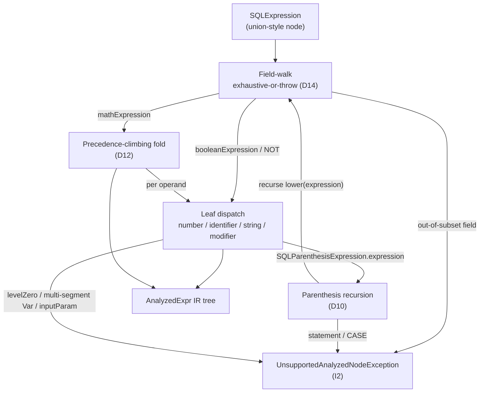

<!-- workflow-sha: 6b81c6b970b0c58300e4c053a5883c2482d3dd25 -->
# Track 3: Lowering pass

## Purpose / Big Picture
After this track lands, a covered `SQLExpression` parse tree can be converted to an
`AnalyzedExpr` IR tree by `AnalyzedExprLowerer` — and an out-of-subset shape throws
`UnsupportedAnalyzedNodeException` rather than silently mis-reading. Lowering produces a
complete tree or throws; never a partial one.

<!-- Reserved for Move 2 — ADDED/MODIFIED/REMOVED triad. Empty until Move 2 lands. -->

Track 3 adds the lowering pass that converts the covered `SQLExpression` AST subset to
`AnalyzedExpr`. It owns three non-obvious mechanisms — unpacked one at a time in the
diagram and Plan of Work below — that a naive field-by-field copy would get wrong. It
depends on Track 1 for the IR types.

Lowering is the bridge from the raw parse tree (AST) to the analyzed IR. It reads the
existing `SQL*` parse-node classes and produces `AnalyzedExpr` nodes; it modifies no AST
class. It is the heaviest S0 piece because of those three mechanisms, each pinned by
Track 4's round-trip parity matrix.

## Progress
- [x] Review + decomposition
- [x] Step implementation
- [x] Track-level code review (skipped — single-step track, full track-pass selection already ran at the step in Phase B)
- [x] Track completion

- [x] 2026-06-29T09:23Z [ctx=info] Review + decomposition complete
- [x] 2026-06-29T15:15Z [ctx=info] Step 1 complete (commit bbc638cece)
- [x] 2026-06-29T16:20Z [ctx=safe] Track complete (completion-time review-mode switch refactor, commit fc1dd9c59e)

## Surprises & Discoveries
- **Phase A review (2026-06-29): the IR models only 4 of the AST's 12 arithmetic operators,
  and the other 8 reach the in-subset `mathExpression` field — so the lowerer needs an
  operator-level throw the original Plan of Work omitted (T1/A1).** PSI-confirmed the IR
  `BinaryOperator` enum is `PLUS,MINUS,STAR,SLASH,EQ,NE,LT,LE,GT,GE` (four arithmetic + six
  comparison), while the AST `SQLMathExpression.Operator` has 12 constants. The eight extra
  (`REM`, three shifts, three bitwise, `NULL_COALESCING`) arrive carried by `operators` on a
  valid `mathExpression` node, so D14's field-walk throw-default never sees them — a literal
  fold would NPE or silently mis-map (`a % b`), breaking I2. Plan of Work step 4 now maps the
  four arithmetic operators and throws on the other eight; Validation adds the throw-cases.
  This is faithful to design.md §"NumericOps" (the eight are already scoped out of the S0 IR
  subset); the gap was only in the track's Plan of Work.
- **Phase A review (2026-06-29): comparison lowering was absent from the decomposition though
  it is in the S0 subset (A2).** The IR carries the six comparison constants, design.md
  §"Comparison" covers the mechanism, and Validation lists comparison as a coverage case, but
  the original six Plan-of-Work steps described only field-walk / math-leaf / paren / fold /
  `NOT`. PSI-confirmed `SQLBinaryCondition` (`left`/`operator`/`right`) and the 15
  `SQLBinaryCompareOperator` subtypes: seven in-subset classes map to six IR constants (both
  `!=` spellings `SQLNeqOperator`/`SQLNeOperator` → `NE`), the other eight throw. Plan of Work
  step 5 is now a boolean-expression dispatch covering comparison + `NOT` + throw-on-rest. The
  lowerer builds comparison *structure* only; collation / EQ-NE session replication is Track
  4's evaluator job (D11).
- **Phase A review (2026-06-29): the D14 `SimpleNode.value` Phase-A verification note is
  resolved (T2/R2).** PSI confirmed `value` IS non-null on the modern parser path (the
  generated `Expression()` mirrors the chosen typed field into the inherited `value`), but it
  is never set in isolation — a recognized typed field is always co-present. So the walk keys
  on the recognized typed field; `value` is not a dispatch key and must not be treated as an
  out-of-subset field. No unreachable-branch coverage problem: the throw-default fires on the
  genuinely out-of-subset typed fields (`rid`, `arrayConcatExpression`, `json`), which the
  throw-cases exercise.
- **Phase A review (2026-06-29): two design-doc wording corrections deferred to Phase 4
  (design frozen).** (1) design.md §"Field-walk" still carries the unresolved D14 "if dead,
  ignore / if reachable, throw" framing — superseded by the resolved verdict above. (2)
  design.md:469 cites `isFunctionAny`/`isFunctionAll` where the real methods are
  `evaluateAny`/`evaluateAllFunction` — the known Phase-2 CR1 deferral (R3); the track files
  already carry the correct names, and the lowerer never calls these (no Track-3 impact). Both
  are `design-final` reconciliation items, mirroring Track 2's D17 handling.
- 2026-06-29T15:15Z Step 1 added `AnalyzedAstAccess`, a new read-accessor in `sql/parser/`,
  because the JJTree-generated parse-node classes expose no public getter for seven in-subset
  fields the lowerer must read (`SQLExpression.booleanExpression`/`booleanValue`/`isNull`,
  `SQLBaseExpression.number`/`inputParam`, `SQLParenthesisExpression.expression`/`statement`).
  Track 4 and future S1+ slices read the AST through this seam; it sits in the JaCoCo-excluded
  parser package, so code added to it is not coverage-gated. See Episodes §Step 1.
- 2026-06-29T15:15Z Step 1 dropped `SQLExpression.literalValue` from the in-subset field-walk:
  it is private and never set on the SQL `Expression()` parse path (only the GQL pipeline /
  `deserialize` / `copy` write it, PSI-confirmed), so it is dead on the lowerer's only input.
  This diverges from design.md §"Field-walk" D14 (which names it in-subset) — a Phase-4
  `design-final` reconciliation item. The D14 throw-default still covers a hypothetically-set
  value, so I2 holds. See Episodes §Step 1.
- 2026-06-29T15:15Z Step 1 fixed two Track-4 contracts: a `NOT` over a bare comparison parses
  as `NOT a = b` (`SQLNotBlock.sub = SQLBinaryCondition`) — a parenthesized boolean `(a = b)` is
  a `SQLParenthesisBlock` and out of subset, so Track 4 round-trip inputs exercising `NOT` must
  use the unparenthesized form; `lowerBoolean` is package-visible so Track 4 can lower a parsed
  `SQLBinaryCondition`/`SQLNotBlock` directly; and a `Const` from the SQL path originates only
  from a number/string leaf, never `literalValue`. See Episodes §Step 1.

## Decision Log
<!-- Full inline Decision Records this track owns (four-bullet form). One block per decision: -->

#### D10: `SQLParenthesisExpression` — recurse on `expression`, throw on `statement`/CASE
- **Alternatives considered**: a dedicated `Paren` IR variant (the IR tree's nesting
  already encodes grouping — a paren node would be redundant and S3+ optimizer passes would
  only have to strip it); throwing on all parenthesized expressions (the original
  re-validation wording — but it makes I1 unsatisfiable on `(a + b) * c`, the most common
  precedence-override input; this was the blocker that surfaced the decision).
- **Rationale**: a parenthesized arithmetic expression like `(a + b) * c` is in the covered
  subset. `SQLParenthesisExpression` carries two mutually-exclusive payloads (PSI-confirmed
  fields `expression: SQLExpression` and `statement: SQLStatement`): `expression` is pure
  grouping (its `execute` delegates straight to `expression.execute(...)`) and `statement`
  is a subquery. The lowerer lowers the grouping form by recursing — `lower(expression)` —
  because the grouping wrapper is transparent at evaluate time, so recursing reproduces the
  AST exactly, and the IR tree's nesting already expresses the grouping. It throws only when
  `statement != null` or for a `CaseExpression` (CASE WHEN), both out of S0 scope.
- **Risks/Caveats**: the two payloads are mutually exclusive; the lowerer checks
  `statement != null` first and throws, otherwise recurses into `expression`. Getting that
  order wrong would mis-handle a subquery as grouping.
- **Implemented in**: this track (step references added during execution)
<!-- **Full design**: design.md §"Parenthesis: recurse on grouping, throw on subquery" -->

#### D12: Precedence fold — lowerer builds the nested `BinaryOp` tree by a structural precedence-climbing fold; value semantics come from shared `NumericOps`
- **Alternatives considered**: a generic shared fold parameterized by a combiner lambda
  (`apply` for AST eval, `new BinaryOp` for lowering) — rejected because a shared lambda
  makes one call site see two implementations, which the JIT will not inline, unlike the
  single-implementation call sites the codebase favors. A flat `childExpressions`-mirror
  IR node that shares the fold at evaluate time — rejected because it defeats the
  nested-tree IR the S3+ optimizer rewrites need.
- **Rationale**: `SQLMathExpression` stores arithmetic as a flat n-ary list
  (`childExpressions` + `operators`) at one nesting level and resolves precedence at
  evaluate time, not parse time (PSI-confirmed: the grammar rule `MathExpression()` collects
  all operators of mixed precedence into one flat list, then `unwrapIfNeeded()` collapses a
  single-child node). The AST resolves precedence by a precedence-climbing reduction
  (`calculateWithOpPriority` → `iterateOnPriorities`, keyed on `Operator.getPriority()` with
  `<=` left-associative reduction). The lowerer reproduces that
  precedence-and-associativity nesting *structurally* to build a correctly-nested `BinaryOp`
  tree; the AST's own fold is left untouched. The fold is purely structural — it determines
  nesting only — so all *value* semantics (null sentinel, numeric promotion, `Date + Long`,
  `String` concat) come from the shared `NumericOps` (D5-R) at evaluate time, never from
  this fold. The duplicated logic is therefore a textbook precedence-climbing reduction
  (low risk), and the genuine drift surface, promotion, stays single-homed in `NumericOps`.
- **Risks/Caveats**: a naive left-to-right copy breaks parity. For `a + b * c` (`STAR`
  priority 10 binds tighter than `PLUS` priority 20), the AST computes `a + (b * c)`; a
  naive copy would build `(a + b) * c`, and for `a=1, b=2, c=3` the AST yields `7` while the
  naive tree yields `9` — I1 fails. Left-associativity must also match the AST's `<=`
  reduction: `a - b - c` is `(a - b) - c`, not `a - (b - c)`, which differ in value. Both
  are pinned by Track 4's matrix. If the lowerer ever reached for a value computation in the
  fold, that would be a second promotion engine and a drift bug.
- **Implemented in**: this track (step references added during execution)
<!-- **Full design**: design.md §"Precedence fold: flat AST list to nested BinaryOp" -->

#### D14: Lowerer field-walk is exhaustive-or-throw; the `value` field is flagged for Phase-A PSI verification
- **Alternatives considered**: enumerate-and-assume-complete (unsound — the inherited
  `SimpleNode.value` field is a counterexample the original inventory missed); handle
  `value` speculatively now (premature — verify reachability first).
- **Rationale**: `SQLExpression` is union-style — one class with a fixed field bag, exactly
  one field non-null per parsed expression (PSI-confirmed field set: `singleQuotes`,
  `doubleQuotes`, `isNull`, `rid`, `mathExpression`, `arrayConcatExpression`, `json`,
  `booleanExpression`, `booleanValue`, `literalValue`). The S0 subset covers only
  `mathExpression`, `booleanExpression`, `literalValue`, `booleanValue`, and `isNull`; the
  walk dispatches on those recognized in-subset fields and throws
  `UnsupportedAnalyzedNodeException` on **anything else** as the default — so `rid`,
  `arrayConcatExpression`, and `json` throw, and so does any field a future parser change
  adds. Defaulting to throw-on-unknown makes I2 (a successful `lower` means full coverage)
  robust regardless of which fields the parser grows. The inherited `SimpleNode.value` field
  and the "old executor" fallback chain in `SQLExpression.execute` (commented "only for old
  executor — manually replaced params") were missing from the inventory; asserting
  field-walk completeness over an incomplete inventory would be unsound.
- **Risks/Caveats**: the Phase-A PSI verification note is **resolved (T2/R2)** —
  `SimpleNode.value` IS non-null on the modern parser path (the generated `Expression()`
  mirrors the chosen typed field into the inherited `value`), but it is never set in
  isolation: a recognized typed field is always co-present. So the walk keys on the
  recognized typed field and the inherited `value` is **not a dispatch key** — it must not be
  treated as an out-of-subset field (doing so would throw on every valid expression). The
  throw-default fires only on genuinely out-of-subset typed fields (`rid`,
  `arrayConcatExpression`, `json`). The design.md §"Field-walk" "if dead, ignore / if
  reachable, throw" wording is deferred to the Phase-4 `design-final` reconciliation (design
  frozen).
- **Implemented in**: this track (step references added during execution) + a Phase-A
  verification note.
<!-- **Full design**: design.md §"Field-walk: exhaustive-or-throw over the union AST" -->

#### D18: `SQLBaseIdentifier.levelZero` form is out of the S0 subset and throws; `FuncCall` comes only from method-call modifiers
- **Alternatives considered**: lower `any()`/`all()` to `FuncCall` and special-case them in
  the evaluator (rejected — pulls ANY/ALL property-iteration semantics into a no-consumer
  substrate, out of S0 scope); rely silently on the D14 throw-default without stating the
  boundary (rejected — unverifiable from the spec; a reviewer could not confirm it).
- **Rationale**: `SQLBaseIdentifier` carries exactly one of `levelZero` (a
  `SQLLevelZeroIdentifier`) or `suffix` (a `SQLSuffixIdentifier`) non-null (PSI-confirmed).
  S0 lowers `FuncCall` only from a method-call modifier on a suffix identifier
  (`SQLModifier.methodCall`, e.g. `name.asInteger()`). The `levelZero` form is the other
  branch: a `SQLLevelZeroIdentifier` carries one of three payloads — a top-level
  `functionCall` (including the iteration functions `any()`/`all()`), the `self` reference
  (`@this`), or an inline `collection` (`[..]`). None of these is in the S0 subset. Because
  `Var`'s `identifierToPath` mapper handles only the single-segment `suffix` column shape, a
  `levelZero` identifier matches no recognized field and so hits the field-walk's
  exhaustive-or-throw default (D14) and throws. `any()`/`all()` must throw specifically
  because they carry property-iteration semantics (`SQLBinaryCondition`'s `evaluateAny` /
  `evaluateAllFunction` branches, PSI-confirmed present) that the IR comparison evaluator —
  which replicates only the AST's per-row comparison path, not property-iteration — does not
  reproduce. If `any()`/`all()`
  lowered to `FuncCall`, `BinaryOp(EQ, FuncCall(any), …)` would reach the comparison
  evaluator and be mis-evaluated — a silent parity hole. Stating the boundary explicitly
  closes it in the spec and preserves I1/I2 by construction.
- **Risks/Caveats**: the boundary is symmetric with D6-R on the in-subset side — the only
  single-`SQLBaseIdentifier` shapes S0 lowers are a single-segment `suffix` column → `Var`
  (D6-R) and a `suffix` carrying a method-call modifier → `FuncCall`; every `levelZero`
  payload is excluded.
- **Implemented in**: this track (step references added during execution)
<!-- **Full design**: design.md §"Field-walk: exhaustive-or-throw over the union AST" -->

#### D6-R: S0 lowers single-segment `Var` only; multi-segment paths throw, deferred to S1+
- **Alternatives considered**: re-implement the runtime link-chain traversal in the S0 IR
  evaluator (faithful, but pulls link materialization, the `in_`/`out_` carve-out, and the
  nested-links-only restriction into a no-consumer substrate, and is blocked on D6's still-
  open exact-suffix-chain-shape Phase-A item); delegate `getCollate` to the originating
  parse node (violates D6 — `Var` is a lexical path holding no parse-node reference).
- **Rationale**: this is **one logical decision carried in two tracks** — Track 3 (the
  lowering throw, recorded here) and Track 4 (the single-property collate resolution,
  recorded there). It narrows D6: the lowerer produces a `Var` only for a single-segment
  column reference (`path.size() == 1`). A multi-segment path such as `p.name` throws
  `UnsupportedAnalyzedNodeException` and is deferred to S1+. Collation is non-syntactic (a
  per-property schema attribute), so the lowerer cannot carve out collated comparisons *by
  collation*; but path length **is** syntactic, so throwing on a multi-segment `Var` is a
  clean lowering throw that keeps round-trip parity (I1) by construction — the IR only
  handles operand shapes it faithfully reproduces. The AST's multi-segment collate is a
  runtime link traversal (executing the path prefix link-by-link, then resolving the
  terminal property's collate on the terminal record's schema), which a substrate slice need
  not reproduce. S0 ships behind no flag with no consumer, so deferring multi-segment paths
  costs nothing live.
- **Risks/Caveats**: the exact single-segment `suffix`-chain shape `identifierToPath`
  flattens is a Phase-A lowering-design detail; the multi-segment suffix shape stays a
  deferred S1+ detail. The sibling Track 4 records the same decision as the comparison-
  evaluator constraint (collate fetch pinned to single-property resolution) — keep both
  faithful to the same design seed.
- **Implemented in**: this track (the lowering throw; step references added during
  execution). Also carried in Track 4 (the collate-resolution constraint).
<!-- **Full design**: design.md §"Field-walk" and §"Comparison: replicate the AST sequence" -->

#### Step-time decisions (escalated to the user during Phase B execution)
- 2026-06-29T15:15Z (scope-add) Step 1 added `AnalyzedAstAccess`, a read-accessor in
  `sql/parser/`, to read the seven in-subset AST fields the generated parse-node classes expose
  no getter for. The lowerer stays in `query/analyzed/` per the frozen design; the accessor
  names no `query.analyzed` type, keeping the dependency forward (the "Where NumericOps lives"
  rule). User chose this over moving the lowerer into `sql/parser/` or editing the grammar. See
  Episodes §Step 1.
- 2026-06-29T15:15Z (scope-down / design-divergence) Step 1 dropped `SQLExpression.literalValue`
  from the in-subset field-walk: it is private and never set on the SQL parse path, so it is
  dead on the lowerer's only input. Diverges from design.md §"Field-walk" D14 — a Phase-4
  `design-final` reconciliation item. The D14 throw-default still covers it, so I2 holds. See
  Episodes §Step 1.

## Outcomes & Retrospective
- [x] Technical: PASS at iteration 2 (3 findings — 0 blocker, 2 should-fix, 1 suggestion; 3 drove track-file edits: T1 operator-subset gate, T2 D14 `value` verdict, T3 `getValue()` number lowering).
- [x] Risk: PASS at iteration 2 (4 findings — 0 blocker, 2 should-fix, 2 suggestion; 3 drove edits: R1 in-track tree-shape assertion, R2 D14 coverage, R4 per-shape throw checklist; R3 = known Phase-2 CR1 design-doc deferral, no Track-3 edit).
- [x] Adversarial: PASS at iteration 2 (4 findings — 0 blocker, 2 should-fix, 2 suggestion; 2 drove dedicated edits: A1 operator gate ≡ T1, A2 comparison-lowering step; A3 survived, A4 resolved by the T2/D14 `value` fix). Model pin Fable 5 unavailable in env → ran on session default Opus (D14 documented degradation; does not reopen the decision).

## Context and Orientation
`AnalyzedExprLowerer` is a new class in `core/.../query/analyzed/` (greenfield package,
PSI-confirmed absent on develop). It reads but does not modify these existing AST classes
(all PSI-confirmed present in `core/.../sql/parser/`): `SQLExpression`, `SQLMathExpression`
/ `SQLBaseExpression`, `SQLBaseIdentifier` (with `SQLLevelZeroIdentifier` /
`SQLSuffixIdentifier`), `SQLParenthesisExpression`, `SQLNotBlock`, `SQLBooleanExpression`,
and `SQLNumber` / `SQLModifier`.

The AST is **union-style**, not a class hierarchy the lowerer can dispatch on. `SQLExpression`
holds a fixed field bag with exactly one field non-null per parsed expression (PSI-confirmed
fields: `singleQuotes`, `doubleQuotes`, `isNull`, `rid`, `mathExpression`,
`arrayConcatExpression`, `json`, `booleanExpression`, `booleanValue`, `literalValue`). The
arithmetic node `SQLMathExpression` is a **flat n-ary list** (`childExpressions:
List<SQLMathExpression>`, `operators: List<Operator>`), not a binary tree — it resolves
precedence at evaluate time. These two shapes drive the field-walk (D14) and the precedence
fold (D12).

This track depends on Track 1 for the IR types (`AnalyzedExpr` and its five variants, the
operator enums, `UnsupportedAnalyzedNodeException`). It does not depend on Track 2
(`NumericOps`) or Track 4 — lowering only builds the tree's *structure*; arithmetic value
semantics are the evaluator's job. The three mechanisms it owns and how they connect:

## Plan of Work
Lowering is one new class plus a unit test. A natural build order, mechanism by mechanism:

1. **Top-level field walk over `SQLExpression` (D14).** Dispatch on the recognized
   in-subset fields (`mathExpression`, `booleanExpression`, `literalValue`, `booleanValue`,
   `isNull`); throw `UnsupportedAnalyzedNodeException(node.getClass())` on everything else
   as the default (so `rid`, `arrayConcatExpression`, `json`, and any future field throw).
   **D14 Phase-A verification note — resolved (T2/R2).** PSI confirmed `SimpleNode.value` IS
   non-null on the modern parser path (the generated `Expression()` mirrors the chosen typed
   field into the inherited `value`), but it is never set in isolation — a recognized typed
   field is always co-present. So the walk keys on the recognized typed field and the
   inherited `value` is **not a dispatch key**: a non-null `value` must NOT be treated as an
   out-of-subset field, or the walk would throw on every valid expression. The throw-default
   fires only on genuinely out-of-subset typed fields (`rid`, `arrayConcatExpression`,
   `json`). (The design.md §"Field-walk" "if dead, ignore / if reachable, throw" wording is
   deferred to the Phase-4 `design-final` reconciliation — design frozen.)
2. **Leaf descent into `SQLBaseExpression`.** Once the walk reaches `mathExpression`,
   descend into the leaf shapes (PSI-confirmed fields `number`, `identifier`, `inputParam`,
   `string`, `modifier`):
   - `number` (`SQLNumber`) → `Const` via the concrete subclass's `getValue()` (the `sign`
     flag is folded into the value by the `SQLInteger` / `SQLFloatingPoint` subclass, so a
     negative literal arrives as one negative `Const`; base `SQLNumber.getValue()` returns
     `null`, so read the value through the concrete subclass — T3).
   - `identifier` (`SQLBaseIdentifier`) with no modifier → `Var`, **single-segment only**
     (D6-R); a multi-segment suffix chain throws. With a method-call modifier → `FuncCall`.
   - `string` / character literal, optionally with a modifier → `Const`, or `FuncCall` for
     a method call.
   - `inputParam` (a bind parameter) → throw (S0 does not lower bind parameters; their
     representation is settled in a later slice and no S0 artifact depends on it).
   - A `levelZero` identifier (top-level function call incl. `any()`/`all()`, `@this`,
     inline collection) → throw (D18).
3. **Parenthesis recursion (D10).** For `SQLParenthesisExpression`, check `statement != null`
   first and throw (subquery); otherwise recurse `lower(expression)`. No `Paren` IR variant.
4. **Precedence-climbing fold (D12) + arithmetic-operator-subset gate (T1/A1).** Convert the
   flat `SQLMathExpression` (`childExpressions` + `operators`) into a nested `BinaryOp` tree
   by a structural precedence-climbing reduction keyed on `Operator.getPriority()` with `<=`
   left-associative reduction, matching the AST's `iterateOnPriorities`. The fold determines
   nesting only — no value computation. **Map each AST `Operator` to its IR `BinaryOperator`
   constant and throw on the operators the IR does not model.** The IR `BinaryOperator` enum
   carries only the four arithmetic constants `PLUS`/`MINUS`/`STAR`/`SLASH` (plus the six
   comparisons); the AST `Operator` enum has eight more — `REM` (`%`), `LSHIFT` (`<<`),
   `RSHIFT` (`>>`), `RUNSIGNEDSHIFT` (`>>>`), `BIT_AND` (`&`), `XOR` (`^`), `BIT_OR` (`|`),
   `NULL_COALESCING` (`??`) — and they arrive on the **in-subset** `mathExpression` field, so
   the D14 field-walk throw-default never sees them. Without this operator-level gate, an
   expression like `a % b` would NPE or silently mis-map, breaking I2. The fold maps the four
   arithmetic operators and throws `UnsupportedAnalyzedNodeException` on the other eight
   (design.md §"NumericOps" already scopes those eight as out of the S0 IR subset — no S0
   consumer). This is the operator-level analog of D14's field-level exhaustive-or-throw.
5. **Boolean-expression dispatch — comparison + `NOT` (exhaustive-or-throw, A2).** When the
   field-walk reaches `booleanExpression` (a `SQLBooleanExpression`; 21 direct subtypes on
   develop), dispatch on the boolean shape:
   - **Comparison** — a `SQLBinaryCondition` (PSI-confirmed fields `left: SQLExpression`,
     `operator: SQLBinaryCompareOperator`, `right: SQLExpression`) → `BinaryOp(<cmp>,
     lower(left), lower(right))`, mapping the concrete `SQLBinaryCompareOperator` subtype to
     the IR comparison constant: `SQLEqualsOperator` → `EQ`; `SQLNeqOperator` **and**
     `SQLNeOperator` → `NE` (the two `!=`/`<>` spellings collapse to one IR constant);
     `SQLLtOperator` → `LT`; `SQLLeOperator` → `LE`; `SQLGtOperator` → `GT`; `SQLGeOperator`
     → `GE`. Throw `UnsupportedAnalyzedNodeException` on the other eight
     `SQLBinaryCompareOperator` subtypes (`SQLContainsKeyOperator`, `SQLContainsValueOperator`,
     `SQLInOperator`, `SQLLikeOperator`, `SQLLuceneOperator`, `SQLNearOperator`,
     `SQLScAndOperator`, `SQLWithinOperator`). The lowerer builds the comparison *structure*
     only; collation and the EQ/NE session-threading replication are Track 4's evaluator job
     (D11), out of this track's scope.
   - **`NOT`** — `SQLNotBlock(negate=true, sub)` → `UnaryOp(NOT, lower(sub))`; `negate=false`
     is a pass-through to `lower(sub)`.
   - **Any other `SQLBooleanExpression` shape** (boolean `AND`/`OR`, `IN`, `BETWEEN`, `LIKE`,
     `IS NULL`, …) → throw: the IR has no `AND`/`OR` operator, so these are out of the S0
     subset.
6. Add the lowering unit test (see Validation and Acceptance).

Invariants to preserve: I2 (no silent fallback — every path either returns a complete tree
or throws), which now spans both the field level (D14) and the operator level (the
arithmetic-operator-subset gate in step 4 and the comparison-operator gate in step 5); the
precedence fold reproduces *only* nesting (D12); the field-walk's default is throw, not skip
(D14).

## Concrete Steps
1. Implement `AnalyzedExprLowerer` (the full AST→IR lowering pass) plus its lowering unit
   test, realizing all six Plan-of-Work mechanisms: the exhaustive-or-throw field walk over
   `SQLExpression` (D14, including the resolved `SimpleNode.value` handling — dispatch on the
   recognized typed field, never on `value`); leaf descent with the single-segment
   `identifierToPath` `Var` mapper (D6-R), `Const` via the concrete `SQLNumber.getValue()`,
   and method-call `FuncCall`; parenthesis recursion (D10); the precedence-climbing fold with
   the arithmetic-operator-subset throw (D12 + T1/A1 — map `PLUS`/`MINUS`/`STAR`/`SLASH`,
   throw on the other eight AST operators); the boolean-expression dispatch for comparison
   (`SQLBinaryCondition` → `BinaryOp`, the seven-to-six `SQLBinaryCompareOperator` mapping,
   throw on the other eight subtypes), `NOT`, and throw-on-other-boolean-shapes (A2); and the
   tests — in-track tree-shape assertions (R1) plus the exhaustive per-shape throw-case
   checklist (R4) that pins I2. — risk: high (architecture)  [x] commit: bbc638cece

## Episodes
<!-- Continuous-log. Empty at Phase 1. -->

### Step 1 — commit bbc638cece, 2026-06-29T15:15Z [ctx=info]
**What was done:** Added `AnalyzedExprLowerer` (the full AST→IR lowering pass, in
`query/analyzed/`), `AnalyzedAstAccess` (a new read-accessor in `sql/parser/`), and
`AnalyzedExprLowererTest` (46 tests). The pass realizes all six Plan-of-Work mechanisms: the
exhaustive-or-throw field walk over `SQLExpression` (D14), leaf descent (single-segment `Var`
D6-R, `Const` via the polymorphic `SQLNumber.getValue()` T3, method-call `FuncCall`),
parenthesis recursion (D10), the precedence-climbing fold with the four-operator arithmetic
subset gate (D12 + T1/A1), and the boolean dispatch (`SQLBinaryCondition` → `BinaryOp` with the
seven-to-six comparison mapping, `SQLNotBlock` → `UnaryOp(NOT)`, throw on every other shape A2).
Two design decisions were escalated mid-step and resolved by the user (see Decision Log). The
step-level dimensional review ran the **full track-pass-equivalent selection** (code-quality,
bugs-concurrency, test-behavior, test-completeness, performance, test-structure) because this is
the track's sole high step, so the Phase C review portion will skip. Iteration 1 returned 0
blocker / 5 should-fix / 14 suggestion; every in-scope finding was fixed across review-fix
commits `dd9989803c` and `bbc638cece` and gate-verified PASS on all six dimensions (CQ1 took a
third iteration — the first reflow missed the test file's comment lines). Final state:
`AnalyzedExprLowerer` 94.9% line / 86.2% branch (above the 85/70 gate), `AnalyzedAstAccess` in
the JaCoCo-excluded `sql/parser/` package, 46/46 tests green, Spotless clean. Commit chain:
`772dd697c6` (implementation) + `dd9989803c` + `bbc638cece` (review fixes).

**What was discovered:** The generated SQL parse-node classes expose no public getter for
several in-subset fields the lowerer must read — `SQLExpression.booleanExpression` /
`booleanValue` / `isNull`, `SQLBaseExpression.number` / `inputParam`, and
`SQLParenthesisExpression.expression` / `statement` — and the classes are JJTree-generated, so
no getter can be added to them. `AnalyzedAstAccess` (Decision 1) closes that gap.
`SQLExpression.literalValue` is private and is never assigned on the SQL `Expression()` parse
path (only the GQL pipeline, `deserialize`, and `copy` write it, PSI-confirmed), so it is dead
on the lowerer's only input and was dropped from the walk (Decision 2); the D14 throw-default
still throws on a hypothetically-set value, so I2 holds. The `booleanExpression` dispatch branch
is unreachable from a top-level `Expression()` parse but live via recursion — `lowerComparison`
calls `lower(left)` / `lower(right)` and the method-call path calls `lower(arg)`, either of
which can carry a `booleanExpression`; `lowerBoolean` is package-visible so the test can lower a
parsed `SQLBinaryCondition` / `SQLNotBlock` directly. Cross-track for **Track 4**: the lowerer
builds structure only — collation, EQ/NE session-threading, and numeric promotion stay the
evaluator's job; a `NOT` over a bare comparison parses as `NOT a = b`
(`SQLNotBlock.sub = SQLBinaryCondition`), while a parenthesized boolean `(a = b)` is a
`SQLParenthesisBlock` and out of subset, so round-trip inputs exercising `NOT` must use the
unparenthesized form; a `Const` from the SQL path originates only from a number/string leaf,
never `SQLExpression.literalValue`; `FuncCall.args()` is read-only by convention, not
record-enforced.

**What changed from the plan:** Two user-resolved design decisions added scope the track's
In-scope list (which named only `AnalyzedExprLowerer` + its test) did not anticipate. (1)
Scope-add: the new `AnalyzedAstAccess` read-accessor in `sql/parser/` exposing the seven
blocked fields; the lowerer stays in `query/analyzed/` per the frozen design, and the accessor
names no `query.analyzed` type, so the dependency stays forward (the rule the design's
"Where NumericOps lives" section set). (2) Scope-down / design-divergence: `literalValue`
dropped from the in-subset walk, which diverges from design.md §"Field-walk" D14 (it names
`literalValue` in-subset) — a Phase-4 `design-final` reconciliation item, joining the two D14 /
CR1 wording deferrals the track already carries. Also `lowerBoolean` was made package-visible
(not private) for same-package test access. Four review suggestions were deferred as accepted
on working, verified code and not applied: CQ2 (the `int[] cursor` fold idiom), CQ3
(`lowerParenthesis` adjacent double-throw), TS1 (comparison-helper placement), TS3 (a
section-order map comment).

**Key files:**
- `core/src/main/java/com/jetbrains/youtrackdb/internal/core/query/analyzed/AnalyzedExprLowerer.java` (new)
- `core/src/main/java/com/jetbrains/youtrackdb/internal/core/sql/parser/AnalyzedAstAccess.java` (new)
- `core/src/test/java/com/jetbrains/youtrackdb/internal/core/query/analyzed/AnalyzedExprLowererTest.java` (new)

**Critical context:** The two decisions create downstream obligations. The `literalValue` drop
is a Phase-4 `design-final` reconciliation item. `AnalyzedAstAccess` is a new shared seam in
`sql/parser/` that Track 4 and future S1+ slices read the AST through; because it sits in the
JaCoCo-excluded parser package, code added to it is not coverage-gated.

### Track completion — 2026-06-29T16:20Z [ctx=safe]
Track 3 landed `AnalyzedExprLowerer`, the full AST→IR lowering pass: an exhaustive-or-throw
field walk over `SQLExpression` (D14), parenthesis recursion (D10), a precedence-climbing fold
(D12), and a boolean dispatch for comparison and `NOT`. A covered parse tree now lowers to an
`AnalyzedExpr`; any out-of-subset shape throws `UnsupportedAnalyzedNodeException` (I2). The sole
step was tagged `risk: high`, so its Phase B step-level review ran the full track-pass selection
(six dimensions) against the identical diff, and the Phase C code review was skipped on that
basis.

Two mid-step design decisions reshaped the track's footprint. A new read-accessor
`AnalyzedAstAccess` in `sql/parser/` exposes seven in-subset fields the JJTree-generated
parse-node classes keep package-private — Track 4 and future S1+ slices read the AST through this
seam, and it sits in the JaCoCo-excluded parser package, so code added to it is not
coverage-gated. `SQLExpression.literalValue` was dropped from the in-subset walk: it is private
and never set on the SQL `Expression()` parse path, so it is dead on the lowerer's only input.
That drop diverges from design.md §"Field-walk" D14 (which names it in-subset) and is a Phase-4
`design-final` reconciliation item, joining the D14 wording and the design.md:469 CR1 method-name
deferrals the track already carries.

Cross-track contracts for Track 4: a `NOT` over a bare comparison parses as `NOT a = b`
(`SQLNotBlock.sub = SQLBinaryCondition`), while a parenthesized boolean `(a = b)` is out of
subset, so round-trip inputs exercising `NOT` must use the unparenthesized form; `lowerBoolean`
is package-visible so Track 4 can lower a parsed `SQLBinaryCondition` / `SQLNotBlock` directly; a
`Const` from the SQL path originates only from a number/string leaf. The lowerer builds structure
only — collation, EQ/NE session-threading, and numeric promotion stay Track 4's evaluator job.

A completion-time review-mode pass refactored `toComparisonOperator` from an `instanceof`
if-chain to a Java 21 pattern-matching `switch` expression (`Review fix: switch-ify comparison
operator dispatch`) — behavior-preserving, 46/46 tests green, the changed method fully covered.

1 step, 0 failed.

## Validation and Acceptance
- **Coverage cases.** Each in-subset shape lowers to the expected IR tree: arithmetic
  (single and mixed-precedence), comparison (each of the six operators, including both `!=`
  spellings → `NE`), parenthesized grouping, single-segment `Var`, `Const`, method-call
  `FuncCall`, and `UnaryOp(NOT)`.
- **Tree-shape assertions (R1).** The IR variants are records with structural `equals`, so
  this track asserts the concrete `BinaryOp` tree *in-track*, no evaluator needed: a
  mixed-precedence input `a + b * c` lowers to `BinaryOp(PLUS, Var a, BinaryOp(STAR, Var b,
  Var c))`, and a same-precedence left-associative input `a - b - c` lowers to
  `BinaryOp(MINUS, BinaryOp(MINUS, Var a, Var b), Var c)`. (The *value* parity against the
  AST lives in Track 4's round-trip matrix; a mis-nesting bug must not have to wait two
  tracks to surface.)
- **Throw cases (I2) — explicit per-shape checklist (R4).** Each out-of-subset shape throws
  `UnsupportedAnalyzedNodeException` rather than returning a partial tree:
  - out-of-subset `SQLExpression` fields: `rid`, `arrayConcatExpression`, `json`;
  - an out-of-subset **arithmetic operator** on an in-subset `mathExpression`: at least `%`
    (`REM`) and one shift/bitwise op — these reach the in-subset field, so the field-walk
    default does not cover them (T1/A1);
  - an out-of-subset **comparison operator** (`SQLInOperator`, `SQLLikeOperator`) and a
    non-comparison boolean shape (`AND`/`OR`) (A2);
  - a subquery `SQLParenthesisExpression.statement`, a `CaseExpression`;
  - a `levelZero` identifier (incl. `any()`/`all()`, `@this`, inline collection) (D18);
  - a multi-segment `Var` (D6-R); a bind parameter (`inputParam`).
- **Precedence-fold structure.** This track's own test asserts the produced IR-tree shape
  and the throw behavior. The *value* assertion (round-trip parity against the AST, which
  ultimately backs D10/D12) lives in Track 4's round-trip matrix.

<!-- Phase A placeholder for per-step EARS/Gherkin lines. -->

<!-- Reserved for Move 3 — EARS or Gherkin acceptance lines. Empty until Move 3 lands. -->

## Idempotence and Recovery
<!-- Phase A placeholder. -->

## Artifacts and Notes
<!-- Continuous-log (rare). Often empty. -->

## Interfaces and Dependencies
**In scope:**
- New `AnalyzedExprLowerer` in `core/.../query/analyzed/` — the lowering pass plus the
  `identifierToPath` mapper (single-segment only in S0).
- A lowering unit test (coverage cases + throw cases).

**Reads but does not modify (existing AST, `core/.../sql/parser/`):** `SQLExpression`,
`SQLMathExpression` / `SQLBaseExpression`, `SQLBaseIdentifier` /`SQLLevelZeroIdentifier` /
`SQLSuffixIdentifier`, `SQLParenthesisExpression`, `SQLNotBlock`, `SQLBooleanExpression`,
`SQLBinaryCondition`, `SQLBinaryCompareOperator` (and its in-subset comparison subtypes
`SQLEqualsOperator` / `SQLNeqOperator` / `SQLNeOperator` / `SQLLtOperator` / `SQLLeOperator`
/ `SQLGtOperator` / `SQLGeOperator`), `SQLNumber`, `SQLModifier`. The IR operator enums
`BinaryOperator` (`PLUS,MINUS,STAR,SLASH,EQ,NE,LT,LE,GT,GE`) and `UnaryOperator` (`NOT`) are
top-level types in `core/.../query/analyzed/` (Track 1).

**Out of scope:** the IR types themselves (Track 1); `NumericOps` (Track 2 — lowering does
no arithmetic); the evaluator and the round-trip parity matrix (Track 4); bind-parameter
lowering, multi-segment `Var`, `levelZero` shapes, subqueries, and CASE (all throw in S0).

**Relevant shapes (PSI-confirmed on develop):**
- `SQLExpression` fields: `singleQuotes`, `doubleQuotes`, `isNull`, `rid`,
  `mathExpression`, `arrayConcatExpression`, `json`, `booleanExpression`, `booleanValue`,
  `literalValue`.
- `SQLBaseExpression` fields: `number`, `identifier`, `inputParam`, `string`, `modifier`.
- `SQLParenthesisExpression` fields: `expression` (grouping), `statement` (subquery).
- `SQLNotBlock` fields: `sub`, `negate`.
- `SQLMathExpression`: `childExpressions: List<SQLMathExpression>`, `operators:
  List<Operator>`; precedence resolved at evaluate time. `Operator` has 12 constants —
  `PLUS`/`MINUS`/`STAR`/`SLASH` map to the IR; `REM`, `LSHIFT`, `RSHIFT`, `RUNSIGNEDSHIFT`,
  `BIT_AND`, `XOR`, `BIT_OR`, `NULL_COALESCING` are out of the S0 IR subset and throw.
- `SQLBinaryCondition` fields: `left: SQLExpression`, `operator: SQLBinaryCompareOperator`,
  `right: SQLExpression`. `SQLBinaryCompareOperator` has 15 concrete subtypes; the seven
  in-subset comparison classes map to six IR constants (both `!=` spellings → `NE`); the
  other eight throw.

**Inter-track dependencies:** Track 3 depends on **Track 1** (IR types). Track 4 depends on
Track 3 (lowering produces the trees the round-trip suite evaluates).

**Sizing justification (argumentation gate).** This track is ~4 files, under the merge
floor — the file-count threshold (~12 in-scope files) below which tracks are normally folded
together. D13 keeps lowering separate from Track 4's evaluator anyway, because tree-building
and evaluation are distinct review surfaces. The stacked-diff series then lands each as an
independently reviewable PR. Lowering is also the
heaviest S0 piece — it owns the field walk (D14), parenthesis recursion (D10), and the
precedence fold (D12) — so it warrants its own review surface even at ~4 files.

## Invariants & Constraints
<!-- Per-track testable constraints and invariants; each a property backed by a test. -->
- **I1 — Round-trip parity.** Lower-then-evaluate yields the same value as evaluating the
  AST directly. Owned and stated as a track invariant in Track 4 (the round-trip matrix);
  cited here because the precedence fold (D12) exists to preserve it.
- **I2 — No silent fallback.** Lowering an unsupported AST shape throws
  `UnsupportedAnalyzedNodeException`; it never returns a placeholder or partial tree. A
  successful `lower(...)` return means full IR coverage of the input — the contract S1+
  consumers rely on. Verified by the lowering throw-case tests.
- **Left-associative reduction matches the AST's `<=` reduction.** `a - b - c` lowers to
  `(a - b) - c`, not `a - (b - c)` (D12). The two differ in value, so this is ultimately
  backed by Track 4's round-trip parity matrix; this track's lowering test asserts the
  produced tree shape.

## Base commit
729b3e4807b4cd3d8b0da8c0aecc4d7d4e163250
