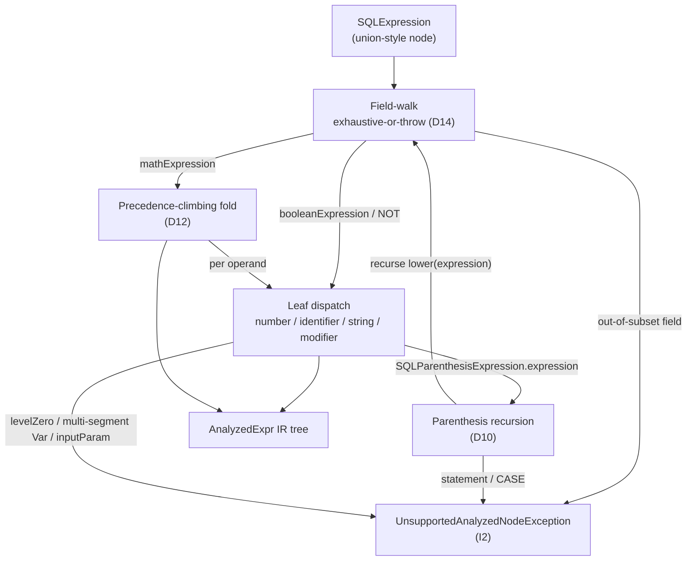

<!-- workflow-sha: 6b81c6b970b0c58300e4c053a5883c2482d3dd25 -->
# Track 3: Lowering pass

## Purpose / Big Picture
After this track lands, a covered `SQLExpression` parse tree can be converted to an
`AnalyzedExpr` IR tree by `AnalyzedExprLowerer` — and an out-of-subset shape throws
`UnsupportedAnalyzedNodeException` rather than silently mis-reading. Lowering produces a
complete tree or throws; never a partial one.

<!-- Reserved for Move 2 — ADDED/MODIFIED/REMOVED triad. Empty until Move 2 lands. -->

Track 3 adds the lowering pass that converts the covered `SQLExpression` AST subset to
`AnalyzedExpr`. It owns three non-obvious mechanisms — unpacked one at a time in the
diagram and Plan of Work below — that a naive field-by-field copy would get wrong. It
depends on Track 1 for the IR types.

Lowering is the bridge from the raw parse tree (AST) to the analyzed IR. It reads the
existing `SQL*` parse-node classes and produces `AnalyzedExpr` nodes; it modifies no AST
class. It is the heaviest S0 piece because of those three mechanisms, each pinned by
Track 4's round-trip parity matrix.

## Progress
- [ ] Review + decomposition
- [ ] Step implementation
- [ ] Track-level code review
- [ ] Track completion

## Surprises & Discoveries
<!-- Continuous-log. Empty at Phase 1. -->

## Decision Log
<!-- Full inline Decision Records this track owns (four-bullet form). One block per decision: -->

#### D10: `SQLParenthesisExpression` — recurse on `expression`, throw on `statement`/CASE
- **Alternatives considered**: a dedicated `Paren` IR variant (the IR tree's nesting
  already encodes grouping — a paren node would be redundant and S3+ optimizer passes would
  only have to strip it); throwing on all parenthesized expressions (the original
  re-validation wording — but it makes I1 unsatisfiable on `(a + b) * c`, the most common
  precedence-override input; this was the blocker that surfaced the decision).
- **Rationale**: a parenthesized arithmetic expression like `(a + b) * c` is in the covered
  subset. `SQLParenthesisExpression` carries two mutually-exclusive payloads (PSI-confirmed
  fields `expression: SQLExpression` and `statement: SQLStatement`): `expression` is pure
  grouping (its `execute` delegates straight to `expression.execute(...)`) and `statement`
  is a subquery. The lowerer lowers the grouping form by recursing — `lower(expression)` —
  because the grouping wrapper is transparent at evaluate time, so recursing reproduces the
  AST exactly, and the IR tree's nesting already expresses the grouping. It throws only when
  `statement != null` or for a `CaseExpression` (CASE WHEN), both out of S0 scope.
- **Risks/Caveats**: the two payloads are mutually exclusive; the lowerer checks
  `statement != null` first and throws, otherwise recurses into `expression`. Getting that
  order wrong would mis-handle a subquery as grouping.
- **Implemented in**: this track (step references added during execution)
<!-- **Full design**: design.md §"Parenthesis: recurse on grouping, throw on subquery" -->

#### D12: Precedence fold — lowerer builds the nested `BinaryOp` tree by a structural precedence-climbing fold; value semantics come from shared `NumericOps`
- **Alternatives considered**: a generic shared fold parameterized by a combiner lambda
  (`apply` for AST eval, `new BinaryOp` for lowering) — rejected because a shared lambda
  makes one call site see two implementations, which the JIT will not inline, unlike the
  single-implementation call sites the codebase favors. A flat `childExpressions`-mirror
  IR node that shares the fold at evaluate time — rejected because it defeats the
  nested-tree IR the S3+ optimizer rewrites need.
- **Rationale**: `SQLMathExpression` stores arithmetic as a flat n-ary list
  (`childExpressions` + `operators`) at one nesting level and resolves precedence at
  evaluate time, not parse time (PSI-confirmed: the grammar rule `MathExpression()` collects
  all operators of mixed precedence into one flat list, then `unwrapIfNeeded()` collapses a
  single-child node). The AST resolves precedence by a precedence-climbing reduction
  (`calculateWithOpPriority` → `iterateOnPriorities`, keyed on `Operator.getPriority()` with
  `<=` left-associative reduction). The lowerer reproduces that
  precedence-and-associativity nesting *structurally* to build a correctly-nested `BinaryOp`
  tree; the AST's own fold is left untouched. The fold is purely structural — it determines
  nesting only — so all *value* semantics (null sentinel, numeric promotion, `Date + Long`,
  `String` concat) come from the shared `NumericOps` (D5-R) at evaluate time, never from
  this fold. The duplicated logic is therefore a textbook precedence-climbing reduction
  (low risk), and the genuine drift surface, promotion, stays single-homed in `NumericOps`.
- **Risks/Caveats**: a naive left-to-right copy breaks parity. For `a + b * c` (`STAR`
  priority 10 binds tighter than `PLUS` priority 20), the AST computes `a + (b * c)`; a
  naive copy would build `(a + b) * c`, and for `a=1, b=2, c=3` the AST yields `7` while the
  naive tree yields `9` — I1 fails. Left-associativity must also match the AST's `<=`
  reduction: `a - b - c` is `(a - b) - c`, not `a - (b - c)`, which differ in value. Both
  are pinned by Track 4's matrix. If the lowerer ever reached for a value computation in the
  fold, that would be a second promotion engine and a drift bug.
- **Implemented in**: this track (step references added during execution)
<!-- **Full design**: design.md §"Precedence fold: flat AST list to nested BinaryOp" -->

#### D14: Lowerer field-walk is exhaustive-or-throw; the `value` field is flagged for Phase-A PSI verification
- **Alternatives considered**: enumerate-and-assume-complete (unsound — the inherited
  `SimpleNode.value` field is a counterexample the original inventory missed); handle
  `value` speculatively now (premature — verify reachability first).
- **Rationale**: `SQLExpression` is union-style — one class with a fixed field bag, exactly
  one field non-null per parsed expression (PSI-confirmed field set: `singleQuotes`,
  `doubleQuotes`, `isNull`, `rid`, `mathExpression`, `arrayConcatExpression`, `json`,
  `booleanExpression`, `booleanValue`, `literalValue`). The S0 subset covers only
  `mathExpression`, `booleanExpression`, `literalValue`, `booleanValue`, and `isNull`; the
  walk dispatches on those recognized in-subset fields and throws
  `UnsupportedAnalyzedNodeException` on **anything else** as the default — so `rid`,
  `arrayConcatExpression`, and `json` throw, and so does any field a future parser change
  adds. Defaulting to throw-on-unknown makes I2 (a successful `lower` means full coverage)
  robust regardless of which fields the parser grows. The inherited `SimpleNode.value` field
  and the "old executor" fallback chain in `SQLExpression.execute` (commented "only for old
  executor — manually replaced params") were missing from the inventory; asserting
  field-walk completeness over an incomplete inventory would be unsound.
- **Risks/Caveats**: whether `SimpleNode.value` is ever non-null on the modern parser path
  is a **Phase-A PSI verification note** — if dead on the modern path, the walk may ignore
  it; if reachable, the throw-default already makes lowering throw rather than mis-read, so
  the gap degrades to a throw, never to a wrong value.
- **Implemented in**: this track (step references added during execution) + a Phase-A
  verification note.
<!-- **Full design**: design.md §"Field-walk: exhaustive-or-throw over the union AST" -->

#### D18: `SQLBaseIdentifier.levelZero` form is out of the S0 subset and throws; `FuncCall` comes only from method-call modifiers
- **Alternatives considered**: lower `any()`/`all()` to `FuncCall` and special-case them in
  the evaluator (rejected — pulls ANY/ALL property-iteration semantics into a no-consumer
  substrate, out of S0 scope); rely silently on the D14 throw-default without stating the
  boundary (rejected — unverifiable from the spec; a reviewer could not confirm it).
- **Rationale**: `SQLBaseIdentifier` carries exactly one of `levelZero` (a
  `SQLLevelZeroIdentifier`) or `suffix` (a `SQLSuffixIdentifier`) non-null (PSI-confirmed).
  S0 lowers `FuncCall` only from a method-call modifier on a suffix identifier
  (`SQLModifier.methodCall`, e.g. `name.asInteger()`). The `levelZero` form is the other
  branch: a `SQLLevelZeroIdentifier` carries one of three payloads — a top-level
  `functionCall` (including the iteration functions `any()`/`all()`), the `self` reference
  (`@this`), or an inline `collection` (`[..]`). None of these is in the S0 subset. Because
  `Var`'s `identifierToPath` mapper handles only the single-segment `suffix` column shape, a
  `levelZero` identifier matches no recognized field and so hits the field-walk's
  exhaustive-or-throw default (D14) and throws. `any()`/`all()` must throw specifically
  because they carry property-iteration semantics (`SQLBinaryCondition`'s `evaluateAny` /
  `evaluateAllFunction` branches, PSI-confirmed present) that the IR comparison evaluator —
  which replicates only the AST's per-row comparison path, not property-iteration — does not
  reproduce. If `any()`/`all()`
  lowered to `FuncCall`, `BinaryOp(EQ, FuncCall(any), …)` would reach the comparison
  evaluator and be mis-evaluated — a silent parity hole. Stating the boundary explicitly
  closes it in the spec and preserves I1/I2 by construction.
- **Risks/Caveats**: the boundary is symmetric with D6-R on the in-subset side — the only
  single-`SQLBaseIdentifier` shapes S0 lowers are a single-segment `suffix` column → `Var`
  (D6-R) and a `suffix` carrying a method-call modifier → `FuncCall`; every `levelZero`
  payload is excluded.
- **Implemented in**: this track (step references added during execution)
<!-- **Full design**: design.md §"Field-walk: exhaustive-or-throw over the union AST" -->

#### D6-R: S0 lowers single-segment `Var` only; multi-segment paths throw, deferred to S1+
- **Alternatives considered**: re-implement the runtime link-chain traversal in the S0 IR
  evaluator (faithful, but pulls link materialization, the `in_`/`out_` carve-out, and the
  nested-links-only restriction into a no-consumer substrate, and is blocked on D6's still-
  open exact-suffix-chain-shape Phase-A item); delegate `getCollate` to the originating
  parse node (violates D6 — `Var` is a lexical path holding no parse-node reference).
- **Rationale**: this is **one logical decision carried in two tracks** — Track 3 (the
  lowering throw, recorded here) and Track 4 (the single-property collate resolution,
  recorded there). It narrows D6: the lowerer produces a `Var` only for a single-segment
  column reference (`path.size() == 1`). A multi-segment path such as `p.name` throws
  `UnsupportedAnalyzedNodeException` and is deferred to S1+. Collation is non-syntactic (a
  per-property schema attribute), so the lowerer cannot carve out collated comparisons *by
  collation*; but path length **is** syntactic, so throwing on a multi-segment `Var` is a
  clean lowering throw that keeps round-trip parity (I1) by construction — the IR only
  handles operand shapes it faithfully reproduces. The AST's multi-segment collate is a
  runtime link traversal (executing the path prefix link-by-link, then resolving the
  terminal property's collate on the terminal record's schema), which a substrate slice need
  not reproduce. S0 ships behind no flag with no consumer, so deferring multi-segment paths
  costs nothing live.
- **Risks/Caveats**: the exact single-segment `suffix`-chain shape `identifierToPath`
  flattens is a Phase-A lowering-design detail; the multi-segment suffix shape stays a
  deferred S1+ detail. The sibling Track 4 records the same decision as the comparison-
  evaluator constraint (collate fetch pinned to single-property resolution) — keep both
  faithful to the same design seed.
- **Implemented in**: this track (the lowering throw; step references added during
  execution). Also carried in Track 4 (the collate-resolution constraint).
<!-- **Full design**: design.md §"Field-walk" and §"Comparison: replicate the AST sequence" -->

## Outcomes & Retrospective
<!-- Continuous-log. Empty at Phase 1. -->

## Context and Orientation
`AnalyzedExprLowerer` is a new class in `core/.../query/analyzed/` (greenfield package,
PSI-confirmed absent on develop). It reads but does not modify these existing AST classes
(all PSI-confirmed present in `core/.../sql/parser/`): `SQLExpression`, `SQLMathExpression`
/ `SQLBaseExpression`, `SQLBaseIdentifier` (with `SQLLevelZeroIdentifier` /
`SQLSuffixIdentifier`), `SQLParenthesisExpression`, `SQLNotBlock`, `SQLBooleanExpression`,
and `SQLNumber` / `SQLModifier`.

The AST is **union-style**, not a class hierarchy the lowerer can dispatch on. `SQLExpression`
holds a fixed field bag with exactly one field non-null per parsed expression (PSI-confirmed
fields: `singleQuotes`, `doubleQuotes`, `isNull`, `rid`, `mathExpression`,
`arrayConcatExpression`, `json`, `booleanExpression`, `booleanValue`, `literalValue`). The
arithmetic node `SQLMathExpression` is a **flat n-ary list** (`childExpressions:
List<SQLMathExpression>`, `operators: List<Operator>`), not a binary tree — it resolves
precedence at evaluate time. These two shapes drive the field-walk (D14) and the precedence
fold (D12).

This track depends on Track 1 for the IR types (`AnalyzedExpr` and its five variants, the
operator enums, `UnsupportedAnalyzedNodeException`). It does not depend on Track 2
(`NumericOps`) or Track 4 — lowering only builds the tree's *structure*; arithmetic value
semantics are the evaluator's job. The three mechanisms it owns and how they connect:

## Plan of Work
Lowering is one new class plus a unit test. A natural build order, mechanism by mechanism:

1. **Top-level field walk over `SQLExpression` (D14).** Dispatch on the recognized
   in-subset fields (`mathExpression`, `booleanExpression`, `literalValue`, `booleanValue`,
   `isNull`); throw `UnsupportedAnalyzedNodeException(node.getClass())` on everything else
   as the default (so `rid`, `arrayConcatExpression`, `json`, and any future field throw).
   Record the Phase-A PSI note: confirm whether `SimpleNode.value` is ever non-null on the
   modern parser path.
2. **Leaf descent into `SQLBaseExpression`.** Once the walk reaches `mathExpression`,
   descend into the leaf shapes (PSI-confirmed fields `number`, `identifier`, `inputParam`,
   `string`, `modifier`):
   - `number` (`SQLNumber`) → `Const` (a negative literal lowers to a negative `Const`; the
     `sign` flag is already folded in).
   - `identifier` (`SQLBaseIdentifier`) with no modifier → `Var`, **single-segment only**
     (D6-R); a multi-segment suffix chain throws. With a method-call modifier → `FuncCall`.
   - `string` / character literal, optionally with a modifier → `Const`, or `FuncCall` for
     a method call.
   - `inputParam` (a bind parameter) → throw (S0 does not lower bind parameters; their
     representation is settled in a later slice and no S0 artifact depends on it).
   - A `levelZero` identifier (top-level function call incl. `any()`/`all()`, `@this`,
     inline collection) → throw (D18).
3. **Parenthesis recursion (D10).** For `SQLParenthesisExpression`, check `statement != null`
   first and throw (subquery); otherwise recurse `lower(expression)`. No `Paren` IR variant.
4. **Precedence-climbing fold (D12).** Convert the flat `SQLMathExpression`
   (`childExpressions` + `operators`) into a nested `BinaryOp` tree by a structural
   precedence-climbing reduction keyed on `Operator.getPriority()` with `<=`
   left-associative reduction, matching the AST's `iterateOnPriorities`. The fold determines
   nesting only — no value computation.
5. **Boolean `NOT`.** Lower `SQLNotBlock(negate=true, sub)` → `UnaryOp(NOT, lower(sub))`;
   `negate=false` is a pass-through to `lower(sub)`.
6. Add the lowering unit test (see Validation and Acceptance).

Invariants to preserve: I2 (no silent fallback — every path either returns a complete tree
or throws); the precedence fold reproduces *only* nesting (D12); the field-walk's default is
throw, not skip (D14).

## Concrete Steps
<!-- Phase A placeholder — decomposition writes the numbered roster here. -->

## Episodes
<!-- Continuous-log. Empty at Phase 1. -->

## Validation and Acceptance
- **Coverage cases.** Each in-subset shape lowers to the expected IR tree: arithmetic
  (single and mixed-precedence), comparison, parenthesized grouping, single-segment `Var`,
  `Const`, method-call `FuncCall`, and `UnaryOp(NOT)`.
- **Throw cases (I2).** Each out-of-subset shape throws `UnsupportedAnalyzedNodeException`
  rather than returning a partial tree: out-of-subset `SQLExpression` fields (`rid`,
  `arrayConcatExpression`, `json`), a subquery `SQLParenthesisExpression.statement`, a
  `CaseExpression`, a `levelZero` identifier (incl. `any()`/`all()`, `@this`, inline
  collection), a multi-segment `Var` (D6-R), and a bind parameter (`inputParam`).
- **Precedence-fold structure.** This track's own test asserts the produced IR-tree shape
  and the throw behavior. The *value* assertion (round-trip parity against the AST, which
  ultimately backs D10/D12) lives in Track 4's round-trip matrix.

<!-- Phase A placeholder for per-step EARS/Gherkin lines. -->

<!-- Reserved for Move 3 — EARS or Gherkin acceptance lines. Empty until Move 3 lands. -->

## Idempotence and Recovery
<!-- Phase A placeholder. -->

## Artifacts and Notes
<!-- Continuous-log (rare). Often empty. -->

## Interfaces and Dependencies
**In scope:**
- New `AnalyzedExprLowerer` in `core/.../query/analyzed/` — the lowering pass plus the
  `identifierToPath` mapper (single-segment only in S0).
- A lowering unit test (coverage cases + throw cases).

**Reads but does not modify (existing AST, `core/.../sql/parser/`):** `SQLExpression`,
`SQLMathExpression` / `SQLBaseExpression`, `SQLBaseIdentifier` /`SQLLevelZeroIdentifier` /
`SQLSuffixIdentifier`, `SQLParenthesisExpression`, `SQLNotBlock`, `SQLBooleanExpression`,
`SQLNumber`, `SQLModifier`.

**Out of scope:** the IR types themselves (Track 1); `NumericOps` (Track 2 — lowering does
no arithmetic); the evaluator and the round-trip parity matrix (Track 4); bind-parameter
lowering, multi-segment `Var`, `levelZero` shapes, subqueries, and CASE (all throw in S0).

**Relevant shapes (PSI-confirmed on develop):**
- `SQLExpression` fields: `singleQuotes`, `doubleQuotes`, `isNull`, `rid`,
  `mathExpression`, `arrayConcatExpression`, `json`, `booleanExpression`, `booleanValue`,
  `literalValue`.
- `SQLBaseExpression` fields: `number`, `identifier`, `inputParam`, `string`, `modifier`.
- `SQLParenthesisExpression` fields: `expression` (grouping), `statement` (subquery).
- `SQLNotBlock` fields: `sub`, `negate`.
- `SQLMathExpression`: `childExpressions: List<SQLMathExpression>`, `operators:
  List<Operator>`; precedence resolved at evaluate time.

**Inter-track dependencies:** Track 3 depends on **Track 1** (IR types). Track 4 depends on
Track 3 (lowering produces the trees the round-trip suite evaluates).

**Sizing justification (argumentation gate).** This track is ~4 files, under the merge
floor — the file-count threshold (~12 in-scope files) below which tracks are normally folded
together. D13 keeps lowering separate from Track 4's evaluator anyway, because tree-building
and evaluation are distinct review surfaces. The stacked-diff series then lands each as an
independently reviewable PR. Lowering is also the
heaviest S0 piece — it owns the field walk (D14), parenthesis recursion (D10), and the
precedence fold (D12) — so it warrants its own review surface even at ~4 files.

## Invariants & Constraints
<!-- Per-track testable constraints and invariants; each a property backed by a test. -->
- **I1 — Round-trip parity.** Lower-then-evaluate yields the same value as evaluating the
  AST directly. Owned and stated as a track invariant in Track 4 (the round-trip matrix);
  cited here because the precedence fold (D12) exists to preserve it.
- **I2 — No silent fallback.** Lowering an unsupported AST shape throws
  `UnsupportedAnalyzedNodeException`; it never returns a placeholder or partial tree. A
  successful `lower(...)` return means full IR coverage of the input — the contract S1+
  consumers rely on. Verified by the lowering throw-case tests.
- **Left-associative reduction matches the AST's `<=` reduction.** `a - b - c` lowers to
  `(a - b) - c`, not `a - (b - c)` (D12). The two differ in value, so this is ultimately
  backed by Track 4's round-trip parity matrix; this track's lowering test asserts the
  produced tree shape.
