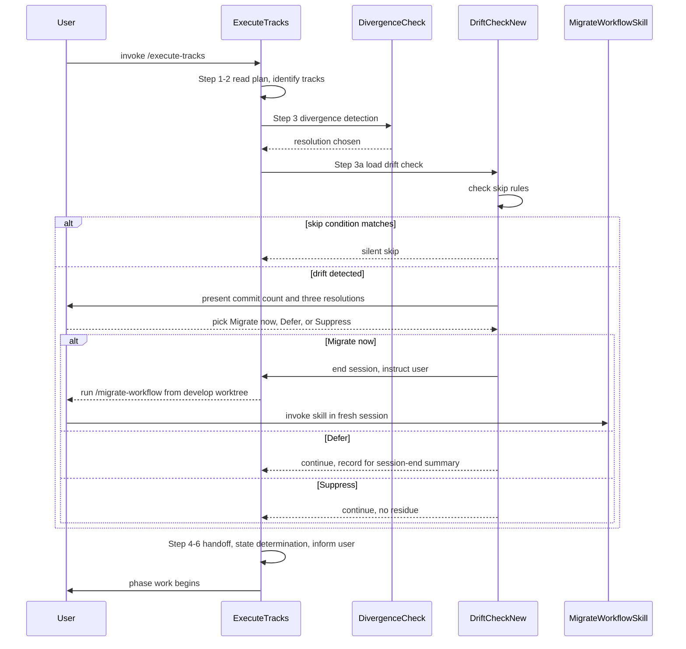

# Workflow drift integration — design

## Overview

YouTrackDB feature branches carry per-branch `_workflow/**` artifacts whose required shape is dictated by current `develop`: section names, mandatory artifacts, step-file schema. Workflow-format changes land on `develop` while branches run, and the branch's artifacts silently drift. The mismatch surfaces as confused reviewers in Phase C, missing required sections during track completion, or auto-resume tripping on a schema field the branch never gained.

This design adds a turn-1 detection gate to `/execute-tracks` startup. The gate runs one `git log` against `.claude/workflow/**` and `.claude/skills/**` between the branch's fork point and current `develop` HEAD. If the diff is empty, the gate skips silently and startup continues. If non-empty, the user picks one of three resolutions (migrate now, defer, or suppress) before any phase work begins.

The enabling primitive is a new file `.claude/workflow/workflow-drift-check.md`, modeled on `branch-divergence-check.md`: same detection-then-resolutions shape, same "no silent default" contract. The migration itself stays in the existing `/migrate-workflow` skill; the gate detects, the skill migrates. Touch surface is four files: the new gate, `workflow.md` (Step 3a, session-end residue, on-demand list), `conventions.md` (glossary plus §1.2 pointer), and the skill's preamble (one-line cross-reference). No Java code, no automated tests.

The intended reader is a contributor running `/execute-tracks` on a long-lived feature branch and the workflow maintainer who keeps the gate in sync with future format changes. This design assumes familiarity with the existing Branch Divergence Check and the `/migrate-workflow` skill.

The rest of this document covers the startup-protocol flow with Step 3a in place (§ Startup protocol with drift gate), the three-resolution gate semantics (§ Three-resolution gate), the skip conditions (§ Skip conditions), and the session-end residue contract for the Defer choice (§ Session-end residue).

## Startup protocol with drift gate

**TL;DR.** Step 3a runs between the Branch Divergence Check (Step 3) and the handoff scan (Step 4). Empty diff or any skip condition short-circuits to Step 4. Non-empty diff with no skip condition presents the three-resolution gate before Step 4.



The detection command runs once at startup. It does not fetch from the remote: the Branch Divergence Check already ran `git fetch` (or skipped fetch with a documented reason), so the local `develop` ref is the post-fetch tip. The pathspecs are `.claude/workflow .claude/skills`, both passed to `git log` after the `--` separator.

Position rationale: Step 3a runs after divergence so detection uses the post-fetch tip, and before the handoff scan because a migration would change the on-disk shape of `_workflow/**`. Steps 4 and 5 both read those files, so running drift first means the rest of startup reads consistent files after any user-driven migration.

### Edge cases / Gotchas

- The branch has no upstream. `git fetch` was skipped in Step 3; the drift check runs against the local `develop` ref. The session-end summary names this fact the same way the divergence check does.
- The branch is ahead of `develop` on `.claude/workflow/**` (workflow changes authored on the branch itself, not yet on `develop`). The detection range `$FORK..develop` only looks at commits reachable from `develop` but not from the fork point; the branch's own commits are correctly invisible.
- The fork point equals current `develop` HEAD. The diff is empty and the gate skips silently. No special case.
- Multiple `_workflow/` directories under `docs/adr/` on the branch (two plan dirs share a branch). The gate fires once regardless; the skill's existing "pick one" prompt handles which subtree to migrate.

### References

- D-records: D1 (dedicated gate file), D2 (detection only), D3 (skill unchanged), D4 (gate stays dumb), D5 (three resolutions kept distinct).
- Invariants: detection is a single `git log` with no remote fetch; the gate runs in turn 1 before any phase work or handoff resolution; per-commit replay logic stays in the skill.

## Three-resolution gate

**TL;DR.** When drift is detected, the gate presents three options and forces an explicit choice: Migrate now (end session, run the skill in a fresh invocation), Defer (continue this session, surface in session-end summary), or Suppress (continue, no session-end residue). No silent default.

The gate prints the commit count and the first ten subject lines (oldest first) so the user can decide whether the drift looks routine or breaking. Approximate prompt format:

```
Workflow drift detected: N commits on develop touch .claude/workflow/** or
.claude/skills/** since fork point <short-FORK>.

First commits (oldest first):
  <short-sha-1>  <subject-1>
  <short-sha-2>  <subject-2>
  ...

Resolutions:
  [migrate]   end this session; run /migrate-workflow <branch> from a develop worktree
  [defer]     continue this session; deferred drift will appear in the session-end summary
  [suppress]  continue this session; no session-end reminder

Pick one (no default).
```

The Migrate now branch deliberately does not run the skill inline. The skill assumes a fresh session and runs its own context-check loop with per-commit handoff semantics; mixing two long-running protocols in one session risks a mid-migration context warning that triggers the wrong handoff path. Ending the current session and asking the user to re-invoke is the cleaner boundary.

The Defer and Suppress paths both continue startup at Step 4. They differ in the session-end residue contract; see § Session-end residue.

### Edge cases / Gotchas

- The user provides a malformed answer ("yes", "ok"). The gate re-prompts using the same shape as the Branch Divergence Check.
- The user picks Migrate now but is not in a develop worktree. The instruction names the `cd ../develop && /migrate-workflow <branch>` pattern explicitly so the user does not invoke the skill in-place.
- The user picks Defer mid-session and a non-fast-forward push later triggers the divergence gate. The two gates are independent; the divergence resolution does not change the drift state.

### References

- D-records: D2 (detection only), D5 (three resolutions kept distinct).

## Skip conditions

**TL;DR.** The gate skips silently in three cases, all derivable from cheap on-disk checks before the detection command runs: no `_workflow/` subtree under `docs/adr/`, every track marked `[x]` or `[~]` with Phase 4 already in flight or done, and an empty `git log` diff against the two pathspecs.

Order matters for cheap fail-fast. Check 1 (no `_workflow/`) is the cheapest: a single `ls -d docs/adr/*/_workflow/ 2>/dev/null`. Check 2 (plan complete plus Phase 4 active) requires reading the plan file's `## Final Artifacts` marker. Check 3 (empty diff) is the `git log` itself.

The first match returns silent skip; the gate emits no prose and startup continues to Step 4.

Skip-condition rationale per case:

- **No `_workflow/` subtree.** The branch has nothing to migrate. Matches the skill's zero-match halt path; running detection would be wasted work even if commits exist on `develop`.
- **Plan complete plus Phase 4 active.** Migrating right before the Phase 4 cleanup commit is wasted work: the `_workflow/` subtree is about to be removed regardless. The check fires when every checklist entry is `[x]` or `[~]` and the `## Final Artifacts` checklist entry is `[>]` or `[x]`. Pre-`[>]` (Phase 4 not yet started) does not skip; tracks complete but Phase 4 not begun is still a window where the user may want to migrate before producing the final artifacts.
- **Empty diff.** `git log --oneline FORK..develop -- .claude/workflow .claude/skills` returns nothing. Either the branch was forked from the current `develop` tip, or `develop` has moved forward only on code paths the gate does not watch.

### Edge cases / Gotchas

- Plan complete but Phase 4 is `[ ]` (not yet started). The gate does not skip; drift between the plan's completion and Phase 4 production is exactly the window where format drift bites the Phase 4 final-artifact rules.
- `develop` ref does not exist (bare repository, detached checkout, or develop branch missing locally). The detection command short-circuits via `git rev-parse --verify refs/heads/develop || exit`; the gate emits a one-line note and skips.

### References

- D-records: D4 (gate stays dumb, no commit classification before skip check).
- Invariants: skip rules are derivable from cheap on-disk reads before the detection command runs.

## Session-end residue

**TL;DR.** The Defer resolution records a deferred-drift marker in the session's transient state; the session-end protocol reads the marker and appends a line to the summary alongside the unpushed-commit report. Suppress and Migrate now do not write the marker. The mechanism is in-conversation state, not an on-disk sentinel.

The hook lives in `workflow.md` § What to do before ending a session, as one appended sentence stating that the agent must include the deferred drift count and the `cd ../develop && /migrate-workflow <branch>` instruction in the session-end summary when the gate was deferred.

The in-conversation state choice is deliberate. The session-end summary runs in the same `/execute-tracks` invocation as the gate. The agent retains the deferred-drift count from the gate's prompt round and recites it verbatim at session end. An on-disk sentinel would survive across `/execute-tracks` invocations and double-report against the next session's gate re-prompt.

The Suppress resolution exists as a distinct option so the user can stop the agent from mentioning drift for the rest of the session while keeping the session running. The functional difference from Defer is one line of session-end prose; the semantic difference is "I have evaluated and chosen to ignore for now" versus "remind me at session end".

### Edge cases / Gotchas

- The session ends mid-phase due to a context warning before the session-end summary runs. The deferred-drift marker is in-conversation state, so it is discarded; the next `/execute-tracks` invocation re-runs the gate and re-prompts.
- The session ends via ESCALATE to inline replanning. The same rule applies; the next session's startup re-runs the gate.
- The user picks Suppress, then a later turn asks "did you check for workflow drift?". The agent answers from conversation context; Suppress muted the session-end recital, not the conversation history.

### References

- D-records: D5 (three resolutions kept distinct, Defer and Suppress differ on session-end residue).
