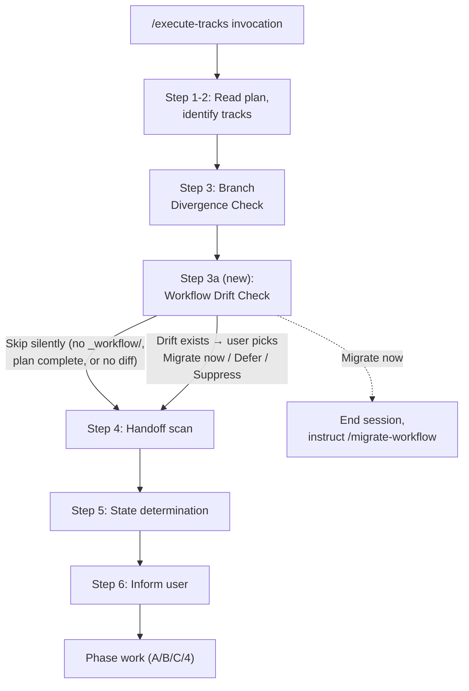

# Workflow Drift Check — Integrate `migrate-workflow` into `/execute-tracks` Startup

## Design Document
[design.md](design.md)

## High-level plan

### Goals

- Detect format drift between a branch's `_workflow/**` artifacts and current `develop`'s workflow shape at every `/execute-tracks` startup, without requiring the user to remember to invoke `/migrate-workflow`.
- Force a turn-1 explicit decision when drift exists: migrate now, defer, or suppress — matching the Branch Divergence Check's three-resolution pattern (no silent default).
- Keep the existing `migrate-workflow` skill as the authoritative migration entry point; the new gate handles detection and gating only.

### Constraints

- The new check must run **after** the Branch Divergence Check (so detection is against the post-fetch `develop` tip) and **before** the handoff scan (since a migration would change the on-disk shape of `_workflow/`, and the handoff scan plus state-determination read those files).
- The gate runs inside the migration branch's worktree. The `migrate-workflow` skill assumes invocation from a `develop` worktree (Option A in YTDB-936); the gate hands off via instruction text, it does not run the skill inline.
- Docs-only change. No Java/Kotlin code touched. No automated tests added.
- The gate must skip silently in three cases: no `_workflow/` subtree under `docs/adr/`, all tracks complete with Phase 4 already started, and an empty `git log` diff against the two pathspecs.

### Architecture Notes

#### Component Map

- **`workflow-drift-check.md`** (new) — owns the detection bash, the three-resolution gate, the skip conditions, and the after-the-choice handoff to the rest of the startup protocol. Mirrors `branch-divergence-check.md` in shape.
- **`workflow.md`** — gains Step 3a in § Startup Protocol that loads and follows the new file; gains a one-line addition in § What to do before ending a session naming deferred drift as a residue to surface; gains an on-demand reference entry in § Conventions.
- **`conventions.md`** — gains a glossary entry for "Workflow drift" in §1.1 and a one-line pointer from §1.2 to the new gate.
- **`migrate-workflow` SKILL.md** — gains a one-line cross-reference in its preamble noting that auto-detection now runs in `/execute-tracks` startup; manual invocation stays as the migration entry point. No logic change.

#### D1: Dedicated gate file `workflow-drift-check.md`

- **Alternatives considered**: inline the detection bash and three-resolution prose directly in `workflow.md` § Startup Protocol Step 3a; fold it into `branch-divergence-check.md` as a sub-section.
- **Rationale**: branch divergence already lives in its own file. Mirroring that pattern keeps `workflow.md`'s startup section terse (one paragraph + load instruction, same shape as Step 3) and gives the gate a dedicated home for detection, resolutions, skip rules, and after-the-choice prose. Folding into `branch-divergence-check.md` would conflate two turn-1 checks with different re-entry semantics.
- **Risks/Caveats**: one more on-demand reference file to maintain. Listed in `workflow.md` § Conventions on-demand list.
- **Implemented in**: Track 1

#### D2: Detection only; migration runs in a fresh `/migrate-workflow` invocation

- **Alternatives considered**: inline migration ("Migrate now" runs the skill in-process inside the current `/execute-tracks` session); leave detection out entirely and rely on user discipline.
- **Rationale**: the skill assumes a fresh session and runs its own context-check loop with per-commit handoff semantics. Running it inside an already-active `/execute-tracks` would mix two long-running protocols and risk a mid-migration context warning that triggers the wrong handoff path. Ending the current session and asking the user to re-invoke `/migrate-workflow` is the cleaner boundary and matches how the skill is already documented to run.
- **Risks/Caveats**: one extra user step ("end session, run skill, re-invoke `/execute-tracks`"). Acceptable trade-off for protocol cleanliness.
- **Implemented in**: Track 1

#### D3: Skill stays unchanged (Option A from YTDB-936)

- **Alternatives considered**: Option B from the issue — generalize the skill to accept "current worktree is the migration target" mode and resolve `develop` via git refs alone, removing the worktree-resolution step.
- **Rationale**: smallest viable change. The cross-reference added to the skill is one line; behavior is unchanged. The two-worktree dance is a real but minor friction; if user feedback says it bites, generalization can come as a follow-up.
- **Risks/Caveats**: users still have to `cd ../develop && /migrate-workflow <branch>` from a develop worktree. Documented in the "Migrate now" resolution prose.
- **Implemented in**: Track 1

#### D4: Gate stays dumb; classification belongs in the skill

- **Alternatives considered**: pre-classify commits as `format` / `noop` / `rename` / `skill` inside the gate (reusing the skill's classifier logic) and only fire on commit ranges that contain at least one `format` commit.
- **Rationale**: classification belongs in the skill's per-commit replay step. Duplicating it in the gate inflates the cheap-detection path (the gate runs every session, the classifier requires reading each commit diff) and risks divergence between gate-classification and skill-classification as the rules evolve.
- **Risks/Caveats**: occasional noisy prompts on commit ranges that turn out to be all `noop` after the user runs the skill. Tolerable since the prompt is one decision per session; revisit only if the noise becomes habitual.
- **Implemented in**: Track 1

#### D5: Three resolutions kept distinct (Migrate / Defer / Suppress)

- **Alternatives considered**: collapse Defer and Suppress into a single "continue" option, since both keep the session running and the gate only fires once per `/execute-tracks` invocation (no re-entry).
- **Rationale**: Defer and Suppress differ on the session-end residue. Defer surfaces the deferred drift count in the session-end summary so the user is reminded to act before the next session; Suppress drops the residue so the user is not re-reminded inside the same `/execute-tracks` run. The semantic difference is small but real, and the issue specifies all three. Keeping them distinct matches the issue exactly and leaves a re-entry hook open for future iterations.
- **Risks/Caveats**: minor — three options is a slightly heavier choice for the user than two. Mitigated by clear one-line descriptions in the gate prose.
- **Implemented in**: Track 1

#### Invariants

- The detection command is a single `git log --oneline FORK..develop -- .claude/workflow .claude/skills`. No `git fetch`; the Branch Divergence Check already fetched (or skipped fetch with documented reason).
- The gate runs in turn 1 of `/execute-tracks`, before any phase work, handoff resolution, or state determination.
- The skill is the only place per-commit replay logic lives; the gate never duplicates classification or edit application.

#### Integration Points

- `workflow.md` § Startup Protocol — new Step 3a (drift check) between Step 3 (divergence) and Step 4 (handoff scan).
- `workflow.md` § What to do before ending a session — appended sentence about reporting deferred drift in the session-end summary.
- `workflow.md` § Conventions — `workflow-drift-check.md` added to the on-demand reference list.
- `conventions.md` §1.1 Glossary — new entry "Workflow drift".
- `conventions.md` §1.2 Plan File Structure — one-line pointer noting drift may shift the on-disk shape of `_workflow/**` between sessions.
- `.claude/skills/migrate-workflow/SKILL.md` — one-line preamble note that auto-detection runs in `/execute-tracks` startup.

#### Non-Goals

- Code-side migration. Only `.claude/workflow/**` and `.claude/skills/**` drift is in scope.
- Auto-applying migrations without user consent. Detection is automatic; migration stays opt-in per session.
- Persistent "ignore for this branch" sentinel (rejected via the issue's Open Question 1).
- Drift detection inside `/create-plan` startup (rejected via Open Question 2).
- Pre-classifying commits inside the gate (rejected via Open Question 3).
- Generalizing the `migrate-workflow` skill to accept "current worktree is the migration target" mode (Option B from the issue).
- Detecting non-workflow drift (code, dependencies, build config).

## Checklist

- [ ] Track 1: Wire workflow-drift detection gate into `/execute-tracks` startup
  > Create the new `workflow-drift-check.md` gate file mirroring the branch-divergence pattern (detection / three-resolution / after-the-choice / skip rules). Wire it into `workflow.md` § Startup Protocol as Step 3a, append the session-end residue clause for deferred drift, add the on-demand reference list entry, add the conventions §1.1 glossary entry plus §1.2 pointer, and add a one-line cross-reference in the `migrate-workflow` skill preamble.
  > **Scope:** ~3-4 steps covering new gate file, workflow.md wiring (Step 3a + session-end residue + on-demand list), conventions updates (glossary + §1.2 pointer), and skill cross-reference.

## Plan Review
- [ ] Plan review (consistency + structural) — autonomous; runs as the first phase of `/execute-tracks`

## Final Artifacts
- [ ] Phase 4: Final artifacts (`design-final.md`, `adr.md`)
