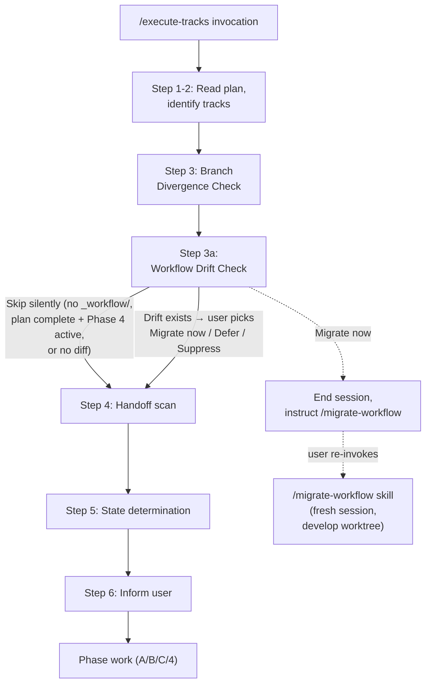

# Workflow drift integration — Architecture Decision Record

## Summary

YouTrackDB feature branches carry per-branch `_workflow/**` artifacts whose required shape is dictated by current `develop`. Workflow-format commits land on `develop` while branches run, and the branch's artifacts silently drift; the mismatch surfaces downstream as confused reviewers, missing required sections at track completion, or auto-resume tripping on a schema field the branch never gained. The fix adds a turn-1 detection gate to `/execute-tracks` startup at `.claude/workflow/workflow-drift-check.md`, modeled on `branch-divergence-check.md`. The gate runs one `git fetch origin develop` followed by one `git log "$FORK..develop" -- .claude/workflow .claude/skills`; if the diff is non-empty and no skip condition matches, the user picks Migrate now, Defer, or Suppress before any phase work begins. The migration itself stays in the existing `/migrate-workflow` skill — the gate detects, the skill replays. Touch surface is four files: the new gate, `workflow.md` (Step 3a, session-end residue, on-demand list), `conventions.md` (glossary plus §1.2 pointer), and the `migrate-workflow` skill preamble.

## Goals

- Detect format drift between a branch's `_workflow/**` artifacts and current `develop`'s workflow shape at every `/execute-tracks` startup, without requiring the user to remember to invoke `/migrate-workflow`. **Met as planned.**
- Force a turn-1 explicit decision when drift exists: migrate now, defer, or suppress — matching the Branch Divergence Check's three-resolution pattern (no silent default). **Met as planned.**
- Keep the existing `/migrate-workflow` skill as the authoritative migration entry point; the new gate handles detection and gating only. **Met as planned.**

## Constraints

- The new check runs after the Branch Divergence Check (so detection is against the post-fetch `develop` tip) and before the handoff scan (since a migration would change the on-disk shape of `_workflow/`). Honored at workflow.md Step 3a position.
- The gate runs inside the migration branch's worktree. The `/migrate-workflow` skill assumes invocation from a `develop` worktree (Option A from the issue); the gate hands off via instruction text rather than running the skill inline. Honored.
- Docs-only change. No Java/Kotlin code touched. No automated tests added. Honored.
- The gate must skip silently in three cases: no `_workflow/` subtree under `docs/adr/`, all tracks complete with Phase 4 already started, and an empty `git log` diff against the two pathspecs. Honored at workflow-drift-check.md § Skip conditions.
- Refinement during execution: the Branch Divergence Check's `git fetch` targets the branch's upstream (typically `origin/<branch>`), not `develop`. The gate therefore performs its own `git fetch origin develop` before the `git log` rather than relying on Step 3's fetch. The original design draft had assumed the divergence-check fetch was enough; the implementation corrects this.

## Architecture Notes

### Component Map

- **`workflow-drift-check.md`** — owns turn-1 detection (`git log --reverse --oneline "$FORK..develop" -- .claude/workflow .claude/skills | head -10`), the three skip conditions in fail-fast order, the three-resolution prompt with no silent default, and the after-the-choice handoff back to the rest of the Startup Protocol.
- **`workflow.md`** — Step 3a in § Startup Protocol loads the gate; § What to do before ending a session reads the deferred-drift TaskCreate todo title verbatim into the session-end summary; § Conventions lists the gate in the on-demand reference table.
- **`conventions.md`** — §1.1 carries the "Workflow drift" glossary row naming both the detection trigger (the gate) and the migration owner (the skill); §1.2 carries a paragraph noting that drift may shift the on-disk shape of `_workflow/**` between sessions.
- **`.claude/skills/migrate-workflow/SKILL.md`** — one-line preamble cross-reference to the auto-detection gate; existing per-commit replay logic unchanged.

### Decision Records

**D1: Dedicated gate file `workflow-drift-check.md`.** Branch divergence already lives in its own file. Mirroring that pattern keeps `workflow.md`'s startup section terse (one paragraph plus load instruction, same shape as Step 3) and gives the gate a dedicated home for detection, resolutions, skip rules, and after-the-choice prose. Alternatives considered: inline the bash and three-resolution prose directly in `workflow.md` § Startup Protocol Step 3a; fold the gate into `branch-divergence-check.md` as a sub-section. Outcome: implemented as planned at `.claude/workflow/workflow-drift-check.md`.

**D2: Detection only; migration runs in a fresh `/migrate-workflow` invocation.** The skill assumes a fresh session and runs its own context-check loop with per-commit handoff semantics. Running it inside an already-active `/execute-tracks` would mix two long-running protocols and risk a mid-migration context warning triggering the wrong handoff path. Alternatives considered: inline migration ("Migrate now" runs the skill in-process inside the current `/execute-tracks` session). Outcome: implemented as planned. The Migrate-now path is the only Startup-Protocol-side early exit and stops before reaching `workflow.md § What to do before ending a session`; no episodes commit, no unpushed-commit summary fires, and self-improvement reflection has nothing to record.

**D3: Skill stays unchanged (Option A from the issue).** Smallest viable change. The cross-reference added to the skill is one line; behavior is unchanged. Alternatives considered: Option B — generalize the skill to accept "current worktree is the migration target" mode and resolve `develop` via git refs alone, removing the worktree-resolution step. Outcome: implemented as planned. Users still have to switch to a `develop` worktree to run the skill; the one-line preamble cross-reference at `SKILL.md` line 8 names the auto-detection entry point without altering the existing instruction flow.

**D4: Gate stays dumb; classification belongs in the skill.** Classification belongs in the skill's per-commit replay step. Duplicating it in the gate inflates the cheap-detection path (the gate runs every session, the classifier requires reading each commit diff) and risks divergence between gate-classification and skill-classification as the rules evolve. Alternatives considered: pre-classify commits as `format` / `noop` / `rename` / `skill` inside the gate (reusing the skill's classifier logic) and only fire on commit ranges that contain at least one `format` commit. Outcome: implemented as planned. The gate's three skip conditions are derivable from cheap on-disk reads before the `git log` runs; commit classification happens only inside the skill.

**D5: Three resolutions kept distinct (Migrate / Defer / Suppress).** Defer and Suppress differ on session-end residue. Defer surfaces the deferred-drift count in the session-end summary so the user is reminded before the next session; Suppress drops the residue so the user is not re-reminded inside the same `/execute-tracks` run. Alternatives considered: collapse Defer and Suppress into a single "continue" option, since both keep the session running and the gate only fires once per `/execute-tracks` invocation (no re-entry). Outcome: implemented as planned. During execution the Defer marker state-shape was refined from "in-conversation memory" (the planning surface had left this underspecified) to a TaskCreate todo with the exact title shape `Deferred workflow drift: <count> commits since <short-fork-SHA>`, with in-conversation memory as the documented fallback. The session-end summary reads the todo title verbatim.

### Invariants & Contracts

- Detection is one `git fetch origin develop` followed by one `git log --reverse --oneline "$FORK..develop" -- .claude/workflow .claude/skills | head -10`. No other fetches; the pathspec set does not change.
- The gate runs in turn 1 of `/execute-tracks`, after the Branch Divergence Check and before the handoff scan.
- Per-commit replay logic stays in the `/migrate-workflow` skill. The gate never classifies commits or applies edits.
- Skip rules are derivable from cheap on-disk reads (`ls -d`, plan-file marker read) before the detection command runs.
- The Migrate-now resolution ends the session before reaching `workflow.md § What to do before ending a session`; no episodes commit, no unpushed-commit summary fires, no self-improvement reflection runs.
- The drift-gate is startup-only. An in-session non-fast-forward push that re-routes to the Branch Divergence Check does not re-fire this gate. Mid-session re-entry only happens via the Remote-authoritative reset path; see Key Discoveries below for the current contract gap.

### Integration Points

- `workflow.md` § Startup Protocol — Step 3a between Step 3 (divergence) and Step 4 (handoff scan).
- `workflow.md` § What to do before ending a session — appended paragraph reading the TaskCreate todo title verbatim into the session-end summary on the Defer path, followed by the `cd ../develop` plus `/migrate-workflow <branch>` instruction.
- `workflow.md` § Conventions — on-demand reference list entry for `workflow-drift-check.md`.
- `conventions.md` §1.1 Glossary — "Workflow drift" row.
- `conventions.md` §1.2 Plan File Structure — pointer paragraph naming the gate as the resolution mechanism and noting that drift may shift the on-disk shape of `_workflow/**` between sessions.
- `.claude/skills/migrate-workflow/SKILL.md` — one-line preamble cross-reference to the gate.

### Non-Goals

- Code-side migration. Only `.claude/workflow/**` and `.claude/skills/**` drift is in scope.
- Auto-applying migrations without user consent. Detection is automatic; migration stays opt-in per session.
- Persistent "ignore for this branch" sentinel (rejected via Open Question 1 in the issue).
- Drift detection inside `/create-plan` startup (rejected via Open Question 2).
- Pre-classifying commits inside the gate (rejected via Open Question 3).
- Generalizing the `/migrate-workflow` skill to accept "current worktree is the migration target" mode (Option B from the issue).
- Detecting non-workflow drift (code, dependencies, build config).

## Key Discoveries

- **Triple-quoted Kotlin string literals inside `steroid_execute_code` preserve host-script indentation.** Writing a fresh markdown file via `val content = """..."""` produces 4-space leading whitespace on every line and renders the body as one code block on read-back. The mitigation is `buildString { appendLine(...) }`, which decouples the file content from the host script's indentation. The hazard applies to any future docs work that uses `VfsUtil.saveText` through `steroid_execute_code` to author a brand-new markdown file. Captured during creation of `.claude/workflow/workflow-drift-check.md`.

- **`steroid_execute_code`-routed commits bypass the project's `prepare-commit-msg` hook in `.githooks/`.** Commits made via JGit or the IntelliJ VCS API skip the hook that auto-prepends the YTDB issue prefix, so per-commit subjects in the draft PR show the gap even though the squash-merge PR title still carries the prefix. Implementer-side mitigations: route commits through shell `git commit` (the hook then fires) or pre-format the subject with the YTDB prefix. Observed at commit `41fe0b32c1`, where the subject landed as `Document workflow drift in conventions glossary` instead of the expected `YTDB-936: …` prefix; the following commit switched back to shell `git` and the hook prepended the prefix correctly.

- **The `RESULT.COMMIT` SHA returned by an implementer can hallucinate past the first ~10 characters.** A 40-character SHA returned by the implementer matched only in its first 10 characters; the tail diverged from the actual git object. The defensive orchestrator-side check using the full SHA caught it via `git fetch && git merge-base --is-ancestor` returning `fatal: bad object`; re-resolving with `git rev-parse <short-prefix>` produced the correct full SHA. Future orchestrators should always re-resolve `RESULT.COMMIT` via `git rev-parse` before downstream use rather than trusting the implementer's verbatim string. Observed at commit `531e283340…` (the full SHA the implementer returned ended `…9e87ed00f4ca0bab1c30b8acd6e22c`; the real object is `531e283340b2124bbf4073b7c1378a46eefcdf74`).

- **The `branch-divergence-check.md` fetches the branch's upstream, not `develop`.** The original design draft assumed Step 3's `git fetch` covered `develop` too. It does not — `git fetch` (no argument) targets the upstream's remote, which for a feature branch is typically `origin/<branch>`. The drift gate therefore performs its own `git fetch origin develop` before the `git log`, tolerating fetch failure silently for offline / no-remote cases. This contract gap was caught during implementation, not planning, and now lives in the gate file's preamble.

- **The Remote-authoritative re-entry contract between the divergence gate and the drift gate is one-sided.** A `git reset --hard origin/<branch>` from the Branch Divergence Check's Remote-authoritative resolution shifts the fork point, which invalidates any drift assessment cached for the session. The drift gate's `## After the choice` section documents the contract as one-sided: the divergence gate currently routes post-reset only to `workflow.md` § Startup Protocol step 3, not back into the drift gate (step 3a). Until that symmetry lands via a follow-up edit to `branch-divergence-check.md`, orchestrators resolving Remote-authoritative within a session should treat the post-reset drift state as unverified and re-invoke `/execute-tracks` in a fresh session. The symmetric-edit follow-up is captured as a separate workflow-machinery improvement and is out of scope for this work.

- **Malformed-answer iteration caps on three-resolution gates are not yet workflow-wide.** Both the Branch Divergence Check and the new drift gate re-prompt on malformed answers (`yes`, `ok`), but neither defines a maximum re-prompt count. Whether the workflow should add a global cap (auto-default selection or fail-out) for both gates uniformly is captured as a separate workflow-machinery question and is out of scope here.
