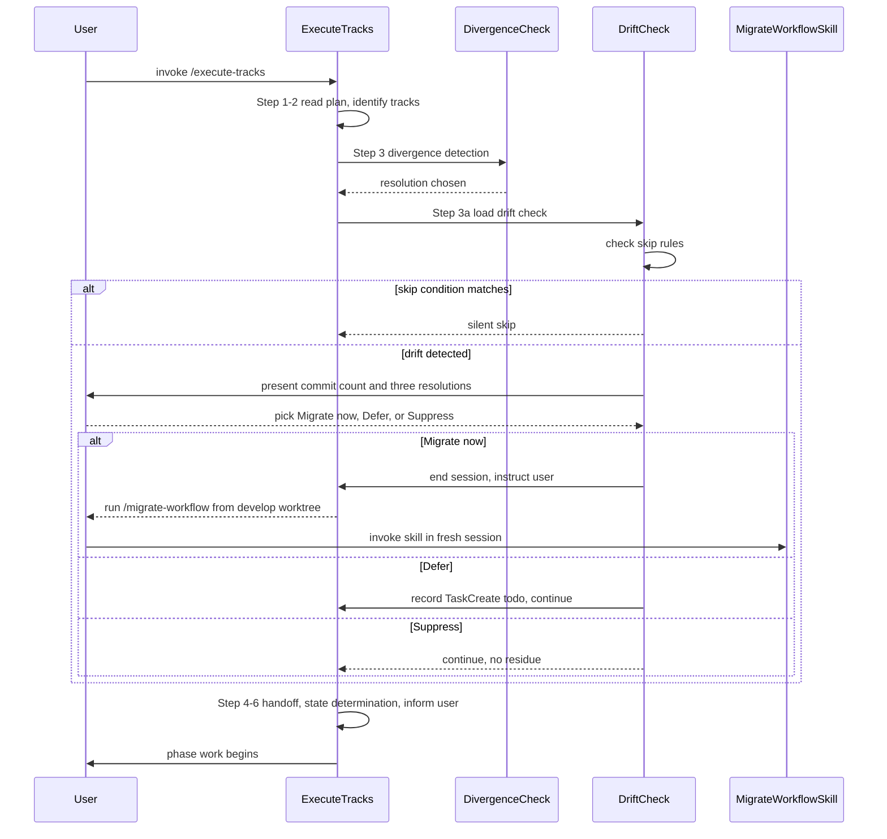

# Workflow drift integration — final design

## Overview

YouTrackDB feature branches carry per-branch `_workflow/**` artifacts whose required shape is dictated by current `develop`: section names, mandatory artifacts, step-file schema. Workflow-format changes land on `develop` while branches run, and the branch's artifacts silently drift. The mismatch surfaces as confused reviewers in Phase C, missing required sections during track completion, or auto-resume tripping on a schema field the branch never gained.

This design adds a turn-1 detection gate to `/execute-tracks` startup. The gate fetches `origin develop` and runs one `git log` against `.claude/workflow/**` and `.claude/skills/**` between the branch's fork point and current `develop` HEAD. If the diff is empty, the gate skips silently and startup continues. If non-empty, the user picks one of three resolutions (migrate now, defer, or suppress) before any phase work begins.

The enabling primitive is the new file `.claude/workflow/workflow-drift-check.md`, modeled on `branch-divergence-check.md`: same detection-then-resolutions shape, same "no silent default" contract. The migration itself stays in the existing `/migrate-workflow` skill; the gate detects, the skill replays. Touch surface is four files: the new gate, `workflow.md` (Step 3a, session-end residue, on-demand list), `conventions.md` (glossary plus §1.2 pointer), and the skill's preamble (one-line cross-reference). No Java code, no automated tests.

The final implementation matched the approved plan: all five design decisions (dedicated gate file, detection-only scope, skill unchanged, gate stays dumb, three resolutions kept distinct) landed as written, and the four-file touch surface above is identical to the planned surface. Three small refinements emerged during execution and live in the prose below: (1) the detection bash adds an explicit `git fetch origin develop` because the Branch Divergence Check's fetch targets the branch's upstream rather than `develop`; (2) the Defer marker is recorded as a TaskCreate todo with a specific title shape, with in-conversation memory as fallback (the original draft had left the state-shape underspecified); (3) the gate's `## After the choice` section documents the Remote-authoritative re-entry contract as one-sided pending a symmetric edit to `branch-divergence-check.md`, an integration gap the planning surface had not surfaced.

The intended reader is a contributor running `/execute-tracks` on a long-lived feature branch and the workflow maintainer who keeps the gate in sync with future format changes. This design assumes familiarity with the existing Branch Divergence Check, the `/migrate-workflow` skill, and the D-record / Invariant convention used in the References footers (each References block names the design decisions and invariants the section relates to).

The rest of this document covers the startup-protocol flow with Step 3a in place (§ Startup protocol with drift gate), the three-resolution gate semantics (§ Three-resolution gate), the skip conditions (§ Skip conditions), and the session-end residue contract for the Defer choice (§ Session-end residue).

## Startup protocol with drift gate

**TL;DR.** Step 3a runs between the Branch Divergence Check (Step 3) and the handoff scan (Step 4). Empty diff or any skip condition short-circuits to Step 4. Non-empty diff with no skip condition presents the three-resolution gate before Step 4.



The detection command runs once at startup. The Branch Divergence Check's `git fetch` targets the branch's upstream (typically `origin/<branch>`), not `develop`, so the gate fetches `origin develop` itself before the `git log`. The fetch tolerates failure silently for offline or no-remote cases, mirroring the divergence check's offline-tolerance pattern. The pathspecs are `.claude/workflow .claude/skills`, both passed to `git log` after the `--` separator.

Position rationale: Step 3a runs after divergence so detection uses the post-fetch tip, and before the handoff scan because a migration would change the on-disk shape of `_workflow/**`. Steps 4 and 5 both read those files, so running drift first means the rest of startup reads consistent files after any user-driven migration.

### Edge cases / Gotchas

- The branch has no upstream. `git fetch` was skipped in Step 3; the drift check's own `git fetch origin develop` runs independently. The session-end summary names this fact the same way the divergence check does.
- The branch is ahead of `develop` on `.claude/workflow/**` (workflow changes authored on the branch itself, not yet on `develop`). The detection range `$FORK..develop` only looks at commits reachable from `develop` but not from the fork point; the branch's own commits are correctly invisible.
- The fork point equals current `develop` HEAD. The diff is empty and the gate skips silently. No special case.
- Multiple `_workflow/` directories under `docs/adr/` on the branch (two plan dirs share a branch). The gate fires once regardless; the skill's existing "pick one" prompt handles which subtree to migrate.
- The `develop` ref is missing locally (bare repository, detached checkout, or develop branch absent). The detection bash short-circuits via `git rev-parse --verify refs/heads/develop || exit` before any other work runs.
- The fork point is empty (`git merge-base develop HEAD` returns nothing because HEAD and `develop` share no common ancestor). The detection bash guards this case with `test -n "$FORK" || exit` and the gate skips silently — drift detection against a non-shared history is meaningless.

### References

- D-records: D1 (dedicated gate file), D2 (detection only), D3 (skill unchanged), D4 (gate stays dumb), D5 (three resolutions kept distinct).
- Invariants: detection is one `git fetch origin develop` followed by one `git log` against the two pathspecs; the gate runs in turn 1 before any phase work or handoff resolution; per-commit replay logic stays in the skill.

## Three-resolution gate

**TL;DR.** When drift surfaces, startup forces an explicit pick: Migrate now (end session, run the skill in a fresh invocation), Defer (continue this session, surface in session-end summary), or Suppress (continue, no session-end residue). No silent default.

The gate prints the commit count, the short fork SHA, and the first ten subject lines (oldest first via `--reverse … | head -10`) so the user can decide whether the drift looks routine or breaking. Approximate prompt format:

```
Workflow drift detected: N commits on develop touch .claude/workflow/** or
.claude/skills/** since fork point <short-FORK>.

First commits (oldest first):
  <short-sha-1>  <subject-1>
  <short-sha-2>  <subject-2>
  ...

Resolutions:
  [migrate]   end this session; run /migrate-workflow <branch> from a develop worktree
  [defer]     continue this session; deferred drift will appear in the session-end summary
  [suppress]  continue this session; no session-end reminder

Pick one (no default).
```

Malformed answers (`yes`, `ok`) trigger a re-prompt using the same shape — same contract as the Branch Divergence Check.

The Migrate-now branch deliberately does not run the skill inline. The skill assumes a fresh session and runs its own context-check loop with per-commit handoff semantics; mixing two long-running protocols in one session risks a mid-migration context warning that triggers the wrong handoff path. Ending the current session and asking the user to re-invoke is the cleaner boundary. Migrate-now is the only Startup-Protocol-side early exit: it ends the session before reaching `workflow.md § What to do before ending a session`, so there are no episodes to commit, no unpushed-commit residue beyond what the Branch Divergence Check may have produced, and self-improvement reflection has nothing to record.

The Defer and Suppress paths both continue startup at Step 4. They differ in the session-end residue contract; see § Session-end residue.

### Edge cases / Gotchas

- The user picks Migrate now but is not in a `develop` worktree. The instruction tells the user to switch to a `develop` worktree (e.g., `cd ../develop`) and run `/migrate-workflow <branch>` there. The `../develop` path is a convention; users with a different layout substitute their own develop-worktree path.
- The user picks Defer mid-session and a non-fast-forward push later triggers the divergence gate. The two gates are independent; the divergence resolution does not change the drift state.
- A `git reset --hard origin/<branch>` from the divergence gate's Remote-authoritative resolution shifts the fork point. The drift gate's `## After the choice` section documents the re-entry contract as one-sided pending a symmetric edit to `branch-divergence-check.md` — until that gap closes, an orchestrator resolving Remote-authoritative within a session should treat the post-reset drift state as unverified and re-invoke `/execute-tracks` in a fresh session.
- An in-session non-fast-forward push that re-routes to the Branch Divergence Check (per `commit-conventions.md` § Push failure handling) does not re-fire this gate. The drift gate is startup-only; mid-session re-entry only happens via the Remote-authoritative reset path above.

### References

- D-records: D2 (detection only), D5 (three resolutions kept distinct).

## Skip conditions

**TL;DR.** The gate skips silently in three cases, all derivable from cheap on-disk checks before the detection command runs: no `_workflow/` subtree under `docs/adr/`, every track marked `[x]` or `[~]` with Phase 4 already in flight or done, and an empty `git log` diff against the two pathspecs.

Order matters for cheap fail-fast. Check 1 (no `_workflow/`) is the cheapest: a single `ls -d docs/adr/*/_workflow/ 2>/dev/null`. Check 2 (plan complete plus Phase 4 active) requires reading the plan file's `## Final Artifacts` marker. Check 3 (empty diff) is the `git log` itself.

The first match returns silent skip; the gate emits no prose and startup continues to Step 4.

Skip-condition rationale per case:

- **No `_workflow/` subtree.** The branch has nothing to migrate. Matches the skill's zero-match halt path; running detection would be wasted work even if commits exist on `develop`.
- **Plan complete plus Phase 4 active.** Migrating right before the Phase 4 cleanup commit is wasted work: the `_workflow/` subtree is about to be removed regardless. The check fires when every checklist entry is `[x]` or `[~]` **and** the `## Final Artifacts` checklist entry is `[>]` or `[x]`. Pre-`[>]` (Phase 4 not yet started) does not skip; tracks complete but Phase 4 not begun is still a window where the user may want to migrate before producing the final artifacts.
- **Empty diff.** `git log --reverse --oneline "$FORK..develop" -- .claude/workflow .claude/skills` returns nothing. Either the branch was forked from the current `develop` tip, or `develop` has moved forward only on code paths the gate does not watch.

### Edge cases / Gotchas

- Plan complete but Phase 4 is `[ ]` (not yet started). The gate does not skip; drift between the plan's completion and Phase 4 production is exactly the window where format drift bites the Phase 4 final-artifact rules.
- The plan file is missing or unreadable in the `_workflow/` subtree identified by check 1. Check 2 falls through to check 3 rather than halting — the empty-diff check still produces a useful answer.

### References

- D-records: D4 (gate stays dumb, no commit classification before skip check).
- Invariants: skip rules are derivable from cheap on-disk reads before the detection command runs.

## Session-end residue

**TL;DR.** The Defer resolution records the deferred-drift count in a TaskCreate todo (with in-conversation memory as fallback); the end-of-turn protocol reads the todo title and appends a line to the wrap-up summary alongside the unpushed-commit report. Suppress and Migrate now do not write the marker. The mechanism stays in-session — no on-disk sentinel survives across `/execute-tracks` invocations.

The hook lives in `workflow.md` § What to do before ending a session, as one appended paragraph stating that the agent must read the TaskCreate todo title verbatim and append it to the session-end summary, followed by the same `cd ../develop` plus `/migrate-workflow <branch>` instruction shown in the prompt.

The TaskCreate todo title shape is `Deferred workflow drift: <count> commits since <short-fork-SHA>`, where `<count>` is the full commit range total and `<short-fork-SHA>` is the seven-character abbreviation of `$FORK`. Subject lines are omitted from the todo — the user re-runs the detection bash for full context. If TaskCreate is unavailable, the same two fields stay in in-context memory and the recital uses the same line shape; the todo is preferred because in-context memory is unreliable across long sessions.

The in-session-only choice is deliberate. The session-end summary runs in the same `/execute-tracks` invocation as the gate, so the agent retains the deferred-drift count from the gate's prompt round and recites it verbatim at session end. An on-disk sentinel would survive across `/execute-tracks` invocations and double-report against the next session's gate re-prompt.

The Suppress resolution exists as a distinct option so the user can stop the agent from mentioning drift for the rest of the session while keeping the session running. The functional difference from Defer is one line of session-end prose; the semantic difference is "I have evaluated and chosen to ignore for now" versus "remind me at session end".

### Edge cases / Gotchas

- The session ends mid-phase due to a context warning before the session-end summary runs. The TaskCreate todo and the in-conversation marker both go away with the session, so the next `/execute-tracks` invocation re-runs the gate and re-prompts.
- The session ends via ESCALATE to inline replanning. The same rule applies; the next session's startup re-runs the gate.
- The user picks Suppress, then a later turn asks "did you check for workflow drift?". The agent answers from conversation context; Suppress muted the session-end recital, not the conversation history.

### References

- D-records: D5 (three resolutions kept distinct, Defer and Suppress differ on session-end residue).
