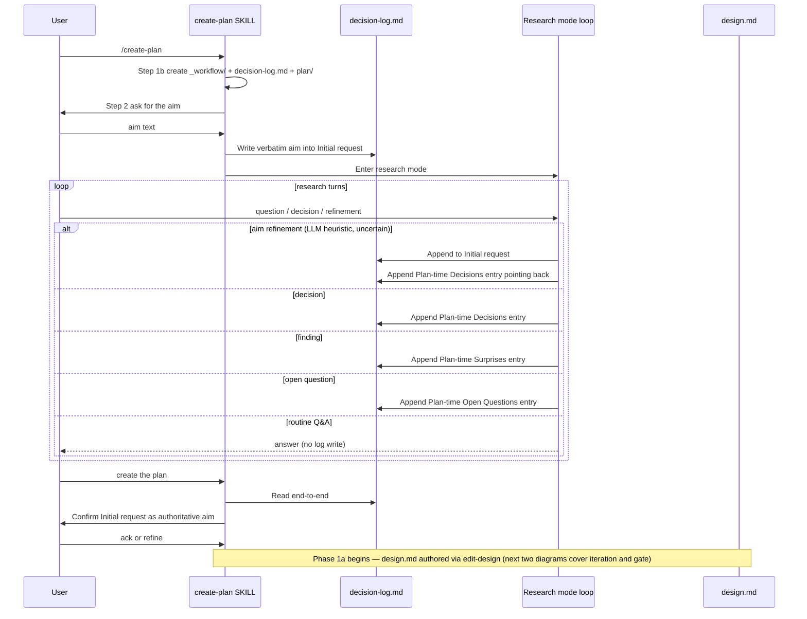

<!-- workflow-sha: 676179cb82295cf15977823a415d5f5476e42526 -->
# Phase 0/1 Decision Log + Design Philosophy — Design

## Overview

Today, `.claude/workflow/` carries a coherent body of conventions but never names the design philosophy those conventions encode. Phase 0 (research) accumulates user-agent conversation that evaporates into chat context. The single-shot summary at `create-plan` Step 4 is the only thing Phase 1 sees, so research drift across `/compact` or partial pauses at the context-warning threshold silently lose information. Phase 1 design iteration captures mechanics in `design-mutations.md` but no rationale; design review fires once per mutation via `edit-design`'s cold-read sub-agent and never against the dimensions the design needs most — reference-accuracy against the codebase, devil's-advocate counter-arguments, optional domain checks (crash-safety / concurrency / performance for content; workflow-changes for design touching `.claude/workflow/**` or `.claude/skills/**`). And Phase 1 itself authors `design.md` last, after Architecture Notes and the track checklist, so the design back-fills decisions the plan already crystallized around.

This design closes those gaps with one philosophy artifact pair, one durable rationale file, a Phase 1 split into 1a/1b, and a richer per-batch review fan-out:

- A lean `### Design philosophy` subsection inside `.claude/workflow/conventions.md` naming seven principles in one sentence each, plus a new load-on-demand `.claude/workflow/design-philosophy.md` carrying the paragraph-length explanations, the workflow-mapping table, the six failure modes, and the external citations (YTDB-842).
- A new `_workflow/decision-log.md` durable file carrying the verbatim user aim, Phase 0 decisions / findings / open questions, Phase 1a / 1b rationale entries, gate-verdict entries (PASS / accepted-open-risks), the Phase 1a → 1b transition signal, and ESCALATE entries from 1b back to 1a (YTDB-965 plus the Phase 1 extension).
- A Phase 1 split into Phase 1a (design-first authoring under per-batch review fan-out) and Phase 1b (plan derivation in a fresh session), with the ESCALATE back-edge from 1b to 1a when plan derivation hits a fundamental contradiction (YTDB-975).
- A per-batch review fan-out integrated into `edit-design` Step 4 (fan-out fires once at batch end; mechanical checks stay per-mutation): cold-read (existing) plus two new mandatory reviewers (feasibility-review for PSI-backed reference accuracy; adversarial-design-review for devil's-advocate counter-arguments) plus optional content-triggered domain reviewers (crash-safety / concurrency / performance for storage / locking / hot-path content; workflow-changes for content touching `.claude/workflow/**` or `.claude/skills/**`). Workflow-changes triggers four sibling reviewers mirroring the existing code-side `.claude/agents/review-workflow-*` set at design-doc scope: consistency, context-budget, instruction-completeness, prompt-design. A batch is a contiguous sequence of user-driven `edit-design` mutations applied without an intervening fan-out: `phase1-creation` is a batch-of-1, a single mid-conversation request is a batch-of-1, an "apply batch" from a user-review checkpoint is a batch-of-K coordinated mutations across K sections. Each mutation in the batch runs per-mutation mechanical checks (Step 3, cheap Bash script); after the last mutation lands, Step 4 fan-out fires once over the cumulative diff. Reviewers write raw certificate-shape output to per-reviewer files under `_workflow/design-reviews/cycle-N-iter-M/`. An aggregator sub-agent consolidates them and returns a structured findings object to the orchestrator. Decision-shaped findings batch at user checkpoints between autonomous mechanical-fix chains (the autonomous chain still fans out per fix; its convergence signal is fan-out PASS, bounded by `iteration_budget=3`).

These changes ship together because they share the same workflow files (`planning.md`, `research.md`, `create-plan/SKILL.md`, `workflow.md`, `implementation-review.md`, `edit-design/SKILL.md`, the new `_workflow/` directory layout in `conventions.md` §1.2, and a new sub-section in `conventions.md §1.4` defining the sub-agent prompt-by-reference spawn protocol all spawns use). The intellectual coupling is real: Principle 7 (Lean documents, load on demand) justifies the philosophy split's two-file shape AND motivates the prompt-by-reference protocol; YTDB-975 explicitly depends on YTDB-842 so its philosophy citations resolve; the decision-log shape depends on the Phase 1a / 1b split being known; the per-batch review fan-out depends on the aggregator wiring + prompt-by-reference protocol landing in the same PR. Splitting into separate PRs would re-do `conventions.md`, `planning.md`, `research.md`, `create-plan/SKILL.md`, and `edit-design/SKILL.md` edits two or three times.

Phase 1a exits on a user signal recorded as a Plan-time Decisions entry; Phase 1b auto-resumes by reading that entry from `decision-log.md`. ESCALATE from Phase 1b is a Plan-time Decisions entry too. The new artifact set is: `decision-log.md` (knowledge: rationale, gate verdicts, transition signals), `design-mutations.md` (mechanics, unchanged), and `_workflow/design-reviews/cycle-N-iter-M/` (raw reviewer output, per-reviewer file). No separate `feasibility-review.md`; gate verdicts live in `decision-log.md` per the one-concern-per-file rule. The orchestrator never loads reviewer prompt bodies into its context; sub-agents read their prompts on entry per the new spawn protocol (savings ~10-20x in orchestrator context per fan-out, depending on which optional domain triggers fire; per-batch firing adds a further K-fold cut at user checkpoints because the cumulative diff of K coordinated mutations is reviewed as one fan-out, not K).

No `design-mechanics.md` companion — this is a small design under the length trigger; the single-file default applies.

The rest of this document is structured as: Core Concepts → Class Design → Workflow → the following topic sections, in order (design philosophy with lean subsection plus detailed-doc split, decision-log file shape, initial-request write contract, write triggers, Phase 0 → Phase 1a transition mechanics, design review fan-out, design-doc review directory shape, Phase 1a design-iteration rationale, Phase 1b plan derivation and ESCALATE back-edge, cross-reference tier mapping).

## Core Concepts

This design introduces fourteen load-bearing ideas. Each is named and used without re-definition in the sections that follow.

**Design philosophy.** A lean `### Design philosophy` subsection inside `.claude/workflow/conventions.md` (always-loaded) naming seven principles in one sentence each, plus a new load-on-demand `.claude/workflow/design-philosophy.md` carrying paragraph-length explanations, the workflow-mapping table, the six failure modes, and the external citations. The lean subsection points at the detailed doc (two-step). Names what the conventions already do so future "optimizations" pay a visible cost. Replaces the unnamed status quo. → §"Design philosophy".

**decision-log.md.** A new `docs/adr/<dir-name>/_workflow/decision-log.md` file capturing the verbatim user aim, continuous-log entries for decisions / findings / open questions across Phase 0 (research), Phase 1a (design iteration), and Phase 1b (plan derivation), gate-verdict entries (per-batch aggregator's PASS / NEEDS REVISION summary plus accepted-open-risks blocks), the Phase 1a → 1b transition signal, and ESCALATE entries from Phase 1b. Replaces single-shot Phase 0 → Phase 1 summarization AND absorbs the role the discarded `feasibility-review.md` was going to play. → §"Decision-log file shape".

**Initial request anchor.** A one-shot `## Initial request` section at the top of `decision-log.md` carrying the user's verbatim aim from `create-plan` Step 2. Plan-at-start (no timestamp / ctx field), distinguishing it from continuous-log entries that follow. Phase 1 reads this as the authoritative aim, replacing any "ask the user for the aim again" step. → §"Initial-request write contract".

**Write triggers.** Three events that cause the research agent to append to the log without asking permission: a **decision** (user picks or confirms a choice), a **finding** (PSI-backed reference-accuracy result, paper or library detail that constrains design), an **open question** (item the user defers to planning). Routine Q&A turns where no commitment was made produce no entry. → §"Write triggers".

**Aim-refinement double-write.** When the user refines or expands the aim during early research turns, the agent applies an LLM heuristic with safety net: judge whether the turn refines the goal or explores within it; when in doubt, append to `## Initial request` AND drop a Plan-time Decisions entry pointing back. The cost of a double-write is one extra line; the cost of a misclassification is a lost framing. → §"Initial-request write contract".

**Phase 1a design-iteration rationale entry.** When the user articulates a *why* alongside a `design.md` mutation in Phase 1a, `edit-design` Step 7 appends a Plan-time Decisions entry to `decision-log.md` carrying the rationale and the alternatives rejected. The mechanical record stays in `design-mutations.md` (unchanged). One file per concern. → §"Phase 1a design-iteration rationale".

**Per-batch design review fan-out.** Integrated into `edit-design` Step 4 with batch-end timing. A batch is a contiguous sequence of user-driven `edit-design` mutations applied without an intervening fan-out: `phase1-creation` is a batch-of-1, a single mid-conversation request is a batch-of-1, an "apply batch" from a user-review checkpoint is a batch-of-K coordinated mutations across K sections. Each mutation in the batch runs per-mutation mechanical checks; after the last mutation lands, Step 4 fires one fan-out over the cumulative diff: cold-read (existing) + feasibility-review (new, PSI-backed reference accuracy, finding ID prefix FD) + adversarial-design-review (new, devil's-advocate counter-arguments, finding ID prefix AD) + content-triggered domain reviewers (crash-safety / concurrency / performance / workflow-changes). Each reviewer writes its certificate-shape output to a per-reviewer file under `_workflow/design-reviews/cycle-N-iter-M/`. An aggregator sub-agent consolidates outputs and returns a structured findings object to the orchestrator. Mechanical findings drive autonomous chained mutations within `edit-design`'s `iteration_budget` (each chained fix is its own single-mutation batch, re-firing the fan-out at the next iter-M); decision-shaped findings queue for the next user-review checkpoint. Replaces a per-mutation fan-out shape that would have spawned K-fold reviewers per checkpoint round. → §"Design review fan-out".

**Design-doc-scoped reviewer prompts.** Six new prompts under `.claude/workflow/prompts/`: `feasibility-review.md` (FD), `adversarial-design-review.md` (AD), `crash-safety-design.md` (CS), `concurrency-design.md` (CC), `performance-design.md` (PF), and a four-sibling set for workflow-changes (`workflow-consistency-design.md`, `workflow-context-budget-design.md`, `workflow-instruction-completeness-design.md`, `workflow-prompt-design-design.md`, finding ID prefixes WCC / WCB / WCI / WCP). Crash-safety / concurrency / performance design prompts are scoped to design prose, not the code-diff inputs of `.claude/agents/review-crash-safety.md` and siblings. Workflow-changes design prompts are scoped siblings of the existing `.claude/agents/review-workflow-*` set, citing the code-side files for the dimensional taxonomy. → §"Design review fan-out".

**Aggregator sub-agent.** A sub-agent that runs once per batch at the end of every `edit-design` Step 4 fan-out (not per mutation). Reads each per-reviewer file under the current `cycle-N-iter-M/` directory, classifies findings by severity and decision-shape, dedupes cross-reviewer overlap, and returns a small structured object to the orchestrator (~50 lines vs the ~1000+ lines of raw reviewer prose). Writes a one-line summary entry to `decision-log.md` (gate-verdict shape) and an optional `cycle-N-iter-M/summary.md` for human-readable audit. Appends a batch fan-out entry to `design-mutations.md` referencing the constituent mutation numbers. → §"Design review fan-out".

**User-review checkpoint.** A user-driven pause between autonomous mechanical-fix chains. Surfaces queued decision-shaped findings, recent autonomous mutations for optional revert, and an open slot for fresh user observations. User signals "apply batch" → orchestrator applies the coordinated set of `edit-design` mutations sequentially (mechanical checks per mutation, no fan-out per mutation), then runs the Step 4 fan-out once over the cumulative diff at batch end. The gate stays autonomous within an iteration; user interaction happens at iteration boundaries only. → §"Design review fan-out".

**Sub-agent prompt-by-reference spawn protocol.** A new `conventions.md §1.4` sub-section: every sub-agent spawn passes the prompt file as a path reference plus a small inputs block; the sub-agent reads the prompt on entry. Applies to all spawns in the workflow: design-doc reviewers, plan / track reviewers, code reviewers, the aggregator, and a future wrapped-`edit-design` sub-agent. Saves ~10-20x orchestrator context per fan-out; per-batch firing collapses K-fold cost (K coordinated mutations per checkpoint round) into a single fan-out. → §"Design review fan-out".

**Phase 1b plan derivation.** A separate session that auto-resumes from validated `design.md` and writes the strategic plan: Architecture Notes, Decision Records (seeded from `decision-log.md ## Plan-time Decisions`), the track checklist, and per-track `plan/track-N.md` files. Detects the resume condition by scanning `decision-log.md ## Plan-time Decisions` for the most recent entry tagged `(Phase 1a → 1b)` and verifying that `implementation-plan.md` does not yet exist. → §"Phase 1b plan derivation and ESCALATE back-edge".

**ESCALATE back-edge.** When Phase 1b hits a fundamental contradiction (missing primitive in the design, circular track dependency, step that cannot fit ~5–7 steps without splitting a design-level construct), the planner writes a `(Phase 1b ESCALATE)`-tagged entry to `decision-log.md ## Plan-time Decisions`, prints an explicit user-facing message, and ends the session. The user re-invokes `/create-plan`; the agent loads the ESCALATE note, applies an `edit-design` mutation in Phase 1a, signals "ready for Phase 1b" again, then 1b auto-resumes. → §"Phase 1b plan derivation and ESCALATE back-edge".

**Cross-reference tier mapping.** The set of one-line links from five workflow files (`planning.md`, `design-document-rules.md`, `conventions-execution.md`, `mid-phase-handoff.md`, `research.md`) to the new `conventions.md § Design philosophy`. The links anchor the rules near their motivating principle without duplicating the principle text; a future rename of the subsection cascades through these five sites in one commit (same lockstep-rename precedent as YTDB-836's house-style sections). → §"Cross-reference tier mapping".

## Class Design

The design touches no Java classes; the "classes" here are workflow artifacts (files / directories) and the SKILLs that read or write them. The diagram below shows the new artifacts plus the existing files this PR modifies, with arrows for reads (`..>`) and writes.

```mermaid
classDiagram
    class conventions_md {
        +Lean Design philosophy subsection (names + one-sentence summaries)
        +Section 1.2 dir layout entries for decision-log.md and design-reviews/
        +Section 1.4 sub-agent prompt-by-reference spawn protocol
    }
    class design_philosophy_md {
        +Per-principle paragraph explanations
        +Workflow-mapping table (supplementary)
        +Six failure modes
        +External citations
    }
    class decision_log_md {
        +Initial request (one-shot)
        +Plan-time Decisions (append-only; includes gate-verdict entries, Phase 1a to 1b transition, Phase 1b ESCALATE)
        +Plan-time Surprises (append-only)
        +Plan-time Open Questions (append-only)
    }
    class design_mutations_md {
        +Mutation N entries (mechanics only)
        +Periodic whole-doc counter source
        +Working-mode counter source
    }
    class design_reviews_dir {
        +Per-cycle, per-iter directories
        +Per-reviewer files written by reviewer sub-agents
        +Optional per-reviewer-inputs.md for large inputs
        +Optional per-cycle-iter summary.md from aggregator
    }
    class feasibility_review_prompt_md {
        +Phase 1a mandatory prompt
        +PSI-verified reference-accuracy checks against design.md
        +Certificate-shape output per Principle 6
        +Finding ID prefix FD
    }
    class adversarial_design_review_prompt_md {
        +Phase 1a mandatory prompt
        +Devil's-advocate pass against design content
        +Distinct from track-level prompts/adversarial-review.md
        +Finding ID prefix AD
    }
    class crash_safety_design_prompt_md {
        +Design-doc-scoped variant of .claude/agents/review-crash-safety.md
        +Content-triggered (WAL, persistence, recovery, atomic, fsync, crash, durability)
        +Finding ID prefix CS
    }
    class concurrency_design_prompt_md {
        +Design-doc-scoped variant of .claude/agents/review-bugs-concurrency.md
        +Content-triggered (locks, atomics, barriers, synchronized, lock-free, volatile)
        +Finding ID prefix CC
    }
    class performance_design_prompt_md {
        +Design-doc-scoped variant of .claude/agents/review-performance.md
        +Content-triggered (hot-path, allocation, I/O, direct-memory, cache, latency)
        +Finding ID prefix PF
    }
    class workflow_changes_design_prompts {
        +Four sibling prompts mirroring code-side review-workflow-* set
        +Content-triggered (.claude/workflow/, .claude/skills/, .claude/agents/, prompts/, SKILL.md, phase/track/sub-agent)
        +consistency (WCC), context-budget (WCB), instruction-completeness (WCI), prompt-design (WCP)
    }
    class aggregator_subagent_prompt_md {
        +Runs once per batch, not per mutation
        +Reads per-reviewer files under cycle-N-iter-M/
        +Classifies by severity and decision-shape
        +Returns structured findings object to orchestrator
        +Writes one-line summary entry to decision-log.md
        +Appends batch fan-out entry to design-mutations.md referencing constituent mutation numbers
    }
    class create_plan_skill {
        +Phase 0: Step 1b creates decision-log.md; Steps 2-3 write triggers
        +Phase 0 to 1a: Step 4 reads decision-log.md and confirms aim
        +Phase 1a: per-batch review fan-out via edit-design; user-checkpoint loop until user signals 1a to 1b transition
        +Phase 1b (fresh session): auto-resumes by reading decision-log.md for Phase 1a to 1b entry; derives Architecture Notes + tracks + plan files
        +Phase 1b ESCALATE: writes ESCALATE entry to decision-log.md, ends session
    }
    class edit_design_skill {
        +Step 4 expanded: per-batch reviewer fan-out at end of batch (cold-read + feasibility + adversarial + triggered domains)
        +Step 4 sub-step: aggregator sub-agent consolidates findings (runs once per batch)
        +Step 6 iterate on mechanical findings within iteration_budget (per-fix fan-out in the autonomous chain stays unchanged)
        +Step 7 appends design-mutations.md entry per mutation; in-batch mutations carry cold-read DEFERRED and batch fan-out lands as a separate entry
        +Step 7 appends decision-log.md entry on articulated rationale (Phase 1a only)
        +All sub-agent spawns use prompt-by-reference protocol
    }
    class research_md {
        +Write triggers section (new)
        +Transition to Phase 1 updated for 1a / 1b split
        +Cross-ref to philosophy subsection
    }
    class planning_md {
        +Goal and Design Document re-framed for Phase 1a / 1b roles
        +Phase-overview diagram updated
        +Cross-ref to philosophy subsection
    }
    class mid_phase_handoff_md {
        +Phase 0 handoff keeps in-flight body
        +Open questions section points at decision-log.md
        +Phase 1a handoff shape added
        +Cross-ref to philosophy subsection
    }
    class implementation_review_md {
        +Phase 2 narrowed to plan-internal + plan-vs-design alignment
        +Design-side consistency folds into Phase 1a per-batch fan-out
    }
    class workflow_md {
        +Phases listed with 1a and 1b sub-phases
        +Session-boundary contract for 1a to 1b
    }
    class conventions_execution_md {
        +Cross-ref to philosophy subsection
        +Cross-ref to conventions.md 1.4 spawn protocol
    }
    class design_document_rules_md {
        +Cross-ref to philosophy subsection
    }

    conventions_md ..> design_philosophy_md : detailed-doc ref
    create_plan_skill ..> decision_log_md : writes (Phase 0)
    edit_design_skill ..> decision_log_md : writes (Phase 1a rationale + gate verdicts)
    edit_design_skill ..> design_mutations_md : writes (mechanics)
    edit_design_skill ..> design_reviews_dir : spawns reviewers that write per-reviewer files
    edit_design_skill ..> aggregator_subagent_prompt_md : spawns aggregator
    aggregator_subagent_prompt_md ..> design_reviews_dir : reads per-reviewer files
    aggregator_subagent_prompt_md ..> decision_log_md : writes gate-verdict summary entry
    edit_design_skill ..> feasibility_review_prompt_md : spawns (every batch end, prompt-by-reference)
    edit_design_skill ..> adversarial_design_review_prompt_md : spawns (every batch end, prompt-by-reference)
    edit_design_skill ..> crash_safety_design_prompt_md : spawns when content-triggered
    edit_design_skill ..> concurrency_design_prompt_md : spawns when content-triggered
    edit_design_skill ..> performance_design_prompt_md : spawns when content-triggered
    edit_design_skill ..> workflow_changes_design_prompts : spawns when content-triggered (four siblings in parallel)
    create_plan_skill ..> decision_log_md : reads (Phase 1b auto-resume signal)
    create_plan_skill ..> research_md : reads
    create_plan_skill ..> planning_md : reads (Phase 1b)
    research_md ..> conventions_md : philosophy ref
    planning_md ..> conventions_md : philosophy ref
    mid_phase_handoff_md ..> conventions_md : philosophy ref
    implementation_review_md ..> decision_log_md : reads (Phase 2)
    workflow_md ..> create_plan_skill : phase listing
    conventions_execution_md ..> conventions_md : philosophy ref + spawn-protocol ref
    design_document_rules_md ..> conventions_md : philosophy ref
```



Three durable artifacts own three complementary roles: knowledge (`decision_log_md`: rationale, alternatives, open questions, gate verdicts, transition signals, ESCALATE entries), mechanics (`design_mutations_md`: mutation kind, mechanical-check verdict, counter state, unchanged from today), and reviewer raw output (`design_reviews_dir`: per-cycle, per-iter directories containing one file per spawned reviewer plus an optional aggregator summary). One always-loaded surface (the lean `### Design philosophy` subsection inside `conventions_md`) plus one new always-loaded sub-section (`§1.4` spawn protocol) names the principles and protocols every session relies on; one new load-on-demand artifact (`design_philosophy_md`) carries the paragraph-length explanations, the workflow-mapping table, the failure modes, and the external citations.

Eight new prompt files at `.claude/workflow/prompts/` define the per-batch fan-out's sub-agent behavior: two mandatory (`feasibility_review_prompt_md`, `adversarial_design_review_prompt_md`), three content-triggered domain (`crash_safety_design_prompt_md`, `concurrency_design_prompt_md`, `performance_design_prompt_md`), four sibling workflow-changes prompts (workflow-consistency-design / workflow-context-budget-design / workflow-instruction-completeness-design / workflow-prompt-design-design — collapsed into one node in the diagram for readability), and one aggregator (`aggregator_subagent_prompt_md`). All produce certificate-shape output per Principle 6; all spawn via the prompt-by-reference protocol so their bodies never load into the orchestrator. The workflow-changes set cites the existing code-side `.claude/agents/review-workflow-*` files as the source of the dimensional taxonomy; the design-doc prompts adapt criteria for prose-input rather than code-diff input.

Two SKILLs (`create_plan_skill`, `edit_design_skill`) own the writes. `create_plan_skill` writes to `decision_log_md` across Phase 0 and reads it for the Phase 1b auto-resume signal; `edit_design_skill` spawns the per-batch fan-out, writes to `design_mutations_md` on every invocation, writes Phase 1a rationale entries to `decision_log_md`, and (via the aggregator) writes per-batch gate-verdict summary entries to `decision_log_md`. Five workflow documents (`research_md`, `planning_md`, `mid_phase_handoff_md`, `implementation_review_md`, `workflow_md`) wire the new artifacts into existing phase boundaries on their read or coordination side. Five documents (`planning_md`, `design_document_rules_md`, `conventions_execution_md`, `mid_phase_handoff_md`, `research_md`) point at the lean `conventions_md § Design philosophy` subsection (two-step); the lean subsection itself points at `design_philosophy_md` so the deeper material stays load-on-demand. One additional document (`conventions_execution_md`) gains a one-line cross-reference to the new `conventions_md §1.4` spawn protocol.

## Workflow

Three runtime flows matter: the Phase 0 → Phase 1a transition (when the agent leaves research mode and starts authoring `design.md`), the Phase 1a per-batch design review fan-out (the agreed YTDB-965 extension to `edit-design`), and the Phase 1a → Phase 1b transition (user-driven) with the optional ESCALATE back-edge from Phase 1b (the YTDB-975 reorder).

### Phase 0 → Phase 1a transition



The log is the durable artifact across `/clear`, `/compact`, and any Phase 0 pause: a future session re-entering `/create-plan` reads the verbatim `## Initial request` plus every prior decision without re-deriving them from chat memory. The mid-phase-handoff file for Phase 0 keeps its research-shaped body for the in-flight tier (What I was investigating, Already ruled out, Most promising lead, Raw notes / partial findings, Resume notes); its `## Open questions` section becomes a pointer to `decision-log.md ## Plan-time Open Questions` so the same item never lives in two places. The two files own complementary tiers: durable commitments in the log, in-flight investigation state in the handoff.

### Phase 1a per-batch fan-out (with rationale capture)

```mermaid
sequenceDiagram
    participant User
    participant Orch as Orchestrator (create-plan)
    participant ED as edit-design SKILL
    participant Design as design.md
    participant Mut as design-mutations.md
    participant Reviewers as Reviewer sub-agents
    participant ReviewsDir as design-reviews/cycle-N-iter-M/
    participant Agg as Aggregator sub-agent
    participant Log as decision-log.md

    User->>Orch: batch (one or more user-driven mutations — apply batch, phase1-creation, mid-conversation request)
    loop for each mutation in the batch
        Orch->>ED: request mutation
        ED->>Design: Step 1 apply edit (Edit/Write)
        ED->>ED: Step 3 mechanical checks (Bash script)
        ED->>Mut: Step 7 append per-mutation entry (cold-read=DEFERRED for in-batch)
        alt user articulated a why
            ED->>Log: Step 7 append Plan-time Decisions entry (rationale + alternatives) for THIS mutation
        end
        ED-->>Orch: return diff
    end
    Note over Orch: after the last mutation in the batch — fire Step 4 fan-out once over the cumulative diff
    par cold-read (existing)
        Orch->>Reviewers: spawn cold-read (prompt-by-reference)
    and feasibility-review
        Orch->>Reviewers: spawn feasibility-review (FD)
    and adversarial-design-review
        Orch->>Reviewers: spawn adversarial-design-review (AD)
    and content-triggered domain reviewers
        Orch->>Reviewers: spawn crash-safety / concurrency / performance / workflow-changes-* siblings when triggered
    end
    Reviewers->>ReviewsDir: each writes raw certificate-shape output to its file
    Orch->>Agg: spawn aggregator (prompt-by-reference)
    Agg->>ReviewsDir: read per-reviewer files
    Agg->>Log: write one-line gate-verdict summary entry (Plan-time Decisions, batch-end)
    Agg->>Mut: append batch fan-out entry (cycle-N-iter-1) referencing constituent mutation numbers
    Agg-->>Orch: return structured findings object
    Orch->>ED: Step 6 iterate on mechanical findings within iteration_budget
    alt iteration_budget remaining + new mechanical findings
        ED->>Design: autonomous mechanical-fix mutation (its own single-mutation batch)
        Note over ED,Design: per-fix re-fan-out at next iter-M; chain bounded by iteration_budget
    else iteration_budget exhausted OR decision-shaped findings outstanding OR PASS
        alt decision-shaped findings queued OR user wants to add observations
            Orch->>User: User-review checkpoint (queued findings + recent autonomous mutations for optional revert + slot for fresh observations)
            User->>Orch: decisions + observations + optional reverts (next batch)
            Orch->>ED: loop back — apply next batch sequentially (mechanical per mutation; ONE fan-out at batch end)
        else PASS clean (no decision-shaped findings)
            Orch-->>User: present cumulative diff + log entries; await next user input
        end
    end
```

Two log files never duplicate content. `design-mutations.md` carries operational state (mutation kind, mechanical-check verdict, iteration count, working-mode counter) consumed by `edit-design`'s own machinery. `decision-log.md` carries knowledge (the user's *why*, gate-verdict summaries, accepted-open-risks, transition signals, ESCALATE entries) consumed by Phase 2 cross-reference and Phase 4 ADR aggregation.

Reviewer raw output is the third tier: per-reviewer files in `_workflow/design-reviews/cycle-N-iter-M/` give Phase 4 ADR aggregation and any future audit query the full certificate trace. The aggregator's structured object is what the orchestrator acts on; the orchestrator never reads raw reviewer prose.

The fan-out fires once per `edit-design` batch — after the last mutation in the batch lands, over the cumulative diff. A batch is a contiguous sequence of user-driven mutations applied without an intervening fan-out: `phase1-creation` is a batch-of-1, a single mid-conversation request is a batch-of-1, an "apply batch" from a user-review checkpoint is a batch-of-K coordinated mutations across K sections. Within the batch each mutation runs Step 3 mechanical checks (cheap, per-mutation; catches shape issues immediately) and Step 7 appends its own `design-mutations.md` entry with `cold-read=DEFERRED`. After the last mutation lands, the orchestrator fires the parallel fan-out; the aggregator appends a batch fan-out entry to `design-mutations.md` referencing the constituent mutation numbers and writes a one-line gate-verdict entry to `decision-log.md`. The autonomous mechanical-fix chain that follows is bounded by `edit-design`'s `iteration_budget` (default 3); each autonomous fix is its own single-mutation batch and re-triggers the fan-out at the next iter-M. The chain converges when reviewers return PASS or the budget is exhausted. Decision-shaped findings always pause the chain and surface at the next user-review checkpoint.

### Phase 1a → Phase 1b transition (with ESCALATE)

```mermaid
sequenceDiagram
    participant User
    participant CP as create-plan SKILL (orchestrator)
    participant Design as design.md
    participant Log as decision-log.md
    participant Plan as implementation-plan.md

    Note over User,CP: Phase 1a: per-batch fan-out has iterated to a state the user is satisfied with (prior diagram)

    User->>CP: signal "ready for Phase 1b" (any phrasing conveying intent)
    CP->>Log: append Plan-time Decisions entry tagged (Phase 1a → 1b) with user's intent line
    CP->>User: Phase 1a complete; end session; re-invoke /create-plan for Phase 1b
    Note over User,CP: ----- session ends; fresh session below -----

    User->>CP: /create-plan (re-invoked)
    CP->>Log: scan Plan-time Decisions for most recent (Phase 1a → 1b) entry
    alt entry found AND implementation-plan.md does not yet exist
        Note over CP,Plan: Phase 1b auto-resume
        CP->>Design: Read validated design.md
        CP->>Log: Read decision-log.md end-to-end (Decisions + Surprises + Open Questions)
        alt derivation succeeds
            CP->>Plan: Write Architecture Notes + Decision Records + track checklist + plan/track-N.md files
            CP->>User: Phase 1b complete; plan ready
        else fundamental contradiction
            CP->>Log: Append Plan-time Decisions entry tagged (Phase 1b ESCALATE) with contradiction details
            CP->>User: ESCALATE message; end session; re-invoke /create-plan to re-enter Phase 1a
        end
    else most recent entry is (Phase 1b ESCALATE)
        Note over CP,Design: Phase 1a re-entry with ESCALATE note
        CP->>User: surface ESCALATE note; enter Phase 1a; user issues edit-design batch addressing the contradiction; per-batch fan-out runs as usual
    else neither found
        CP->>User: ask the user explicitly which phase to enter
    end
```

The transition is decision-log-driven. There is no separate audit file: the Plan-time Decisions stream carries every phase-transition event the workflow needs to detect. Phase 1a → 1b is a user-driven transition (logged at user signal); Phase 1b ESCALATE is a planner-driven transition (logged when the planner hits a fundamental contradiction).

Phase 1b reads `decision-log.md` end-to-end at session start. The same read serves two purposes: scanning for the auto-resume signal and seeding Decision Records / Architecture Notes from the rationale entries. Phase 2's cross-reference also reads the same file; Phase 4's ADR aggregation reads it end-to-end.

## Design philosophy

**TL;DR.** Two artifacts share the load. A lean subsection sits in always-loaded `conventions.md`, names the seven principles in one sentence each, then points outward; a new load-on-demand file under `.claude/workflow/` carries the longer-form per-principle explanations, the workflow-mapping table, the six failure modes, and the external citations. The lean shape is the orientation moment; the detailed file is the deepening surface. Five workflow files cross-reference the lean subsection (two-step).

### Lean subsection in conventions.md

Seven principles, one sentence each, then a single pointer line to the detailed file. No table, no failure modes, no citations live here; every always-loaded byte reaches every session, so the compact shape itself enforces the principle.

The seven principles, each named and summarized in one sentence:

1. **Working memory and the Dumb Zone.** Context windows are not uniformly usable and attention quality degrades as the window fills, so the workflow keeps the usable prefix small and routes long-form material to load-on-demand surfaces.
2. **Strategy versus tactics.** Strategy is open-ended planning over latent knowledge and tactics are local action sequences; mixing them in one context degrades both, so the workflow separates Phase 1 (strategic) from Phase A/B (tactical) and decomposes step-level detail just-in-time.
3. **Knowledge overhang.** Models have latent knowledge they can reach only via scaffolding (TL;DR, plan files, explicit episodes), so the workflow forces articulation rather than letting direct tactical sampling reach a narrow band of that knowledge.
4. **Episodic memory replaces lossy compaction.** `/compact`, sliding-window summarization, and message-passing handoffs all drop information non-deterministically, so the workflow uses durable files plus bounded compressible episodes instead.
5. **Expressivity and inductive bias.** A harness's reachable behavior depends on interface design AND on how in-distribution that interface is for the model, so the workflow chooses Markdown files and standard CLI tools over bespoke DSLs for durable state.
6. **Semi-formal reasoning for reviewers.** Review sub-agents construct explicit premises, trace structural paths, and derive findings as conclusions, producing a certificate that the reviewer cannot skip cases or assert unsupported claims.
7. **Lean documents, load on demand.** Every always-loaded byte pushes content into the Dumb Zone, so the workflow separates always-loaded surface (`CLAUDE.md`, `conventions.md`) from load-on-demand surface (phase-specific docs, sub-skills) and aggressively defers loading whenever feasible.

Closing pointer line:

> *See `.claude/workflow/design-philosophy.md` for the workflow-mapping table, failure modes, and external citations.*

### Detailed doc at .claude/workflow/design-philosophy.md

A new load-on-demand workflow document carrying paragraph-length explanations of each principle, the seven-row workflow-mapping table (supplementary; drift-prone, so the table lives here only), the six failure modes the workflow prevents, and the four external citations. Loaded by reviewers grounding a rule, planners weighing approaches, and new collaborators orienting on the workflow; not by every session.

Internal structure:

1. **Per-principle paragraphs.** One paragraph per principle (seven total), each expanding the one-sentence summary from the lean subsection into a paragraph that names the failure mode the principle prevents, the workflow mechanism that enforces it, and any external citation that motivates it (Slate, Karpathy, OpenAI cookbook, Ugare & Chandra inline where relevant). The principle name in each paragraph heading matches the lean subsection's principle name byte-for-byte so a future rename cascades cleanly. The seven-principle count is deliberate: each principle anchors a distinct workflow review check or design constraint, and pairs that look similar (P1 failure-mode and P7 mechanism; P3 latent-knowledge-via-scaffolding and P4 durable-files-over-lossy-compaction) actually anchor different rules in different files. Collapsing pairs would lose load-bearing distinctions even where the underlying concept overlaps.
2. **Workflow-mapping table.** Seven rows, one per principle, naming the mechanism that enforces the principle plus the file reference(s) that implement it. The table is supplementary and drift-prone; its single home is this doc, and reviewers consult it when grounding a specific rule, not at every session start.
3. **Failure modes.** Six one-liners naming the failure modes the workflow prevents (naive compaction, overdecomposition, blind N-step execution, message-passing handoff drift, confident-without-evidence review, always-loaded context bloat).
4. **External citations.** Four references: Slate (five compounding pressures, thread weaving, working-memory framing); Karpathy's LLM-OS framing; the OpenAI PLANS.md cookbook (12-section ExecPlan template); Ugare & Chandra 2026 (semi-formal reasoning as certificate-shaped review).

### Edge cases / Gotchas

- The lean subsection lands before the existing `### Recipes` subsection in `conventions.md`. If `### Recipes` is missing on some future revision, place near the file end so the section-order is not disrupted.
- YTDB-842's source body cites `_workflow/tracks/track-N.md` (the pre-rename path); the implementation uses `_workflow/plan/track-N.md` (post-rename). Track 1 fixes the stale citation when writing the lean subsection and the detailed doc.
- The lean subsection and the detailed doc move in lockstep: a renamed principle name in either file requires the corresponding heading update in the other, and a new principle added to one must be added to the other. Track 1 lands both files in the same commit to keep day-1 alignment.
- Before any future rename of a principle, run `grep -rn '<principle name>' .claude/ CLAUDE.md` to enumerate every site (the two principle definitions plus the five cross-reference back-pointers) and update them in one commit. Same mechanical-enforcement precedent as the YTDB-836 house-style section names cited at `conventions.md §1.5`.

### References

- `.claude/workflow/design-philosophy.md` — the new load-on-demand detailed doc (written by this PR).
- `.claude/workflow/conventions.md § Design philosophy` — the new lean subsection that points at the detailed doc.
- D-records: emerge during plan authoring after this design freezes.
- External: Slate (https://randomlabs.ai/blog/slate); Ugare & Chandra 2026 (https://arxiv.org/abs/2603.01896); OpenAI PLANS.md cookbook (https://developers.openai.com/cookbook/articles/codex_exec_plans).

## Decision-log file shape

**TL;DR.** `docs/adr/<dir-name>/_workflow/decision-log.md` is a single Markdown file with one plan-at-start section (`## Initial request`) and three continuous-log sections (`## Plan-time Decisions`, `## Plan-time Surprises`, `## Plan-time Open Questions`). Created in `create-plan` Step 1b, written throughout Phases 0, 1a, and 1b, removed by the Phase 4 cleanup commit. The file is not workflow-SHA-stamped (it carries no on-disk migrations). Per-entry bodies under `## Plan-time Decisions` annotate `(Phase 1a)` or `(Phase 1b)` when the sub-phase distinction matters for ADR aggregation; Phase 0 entries carry no annotation since Phase 0 is the only research sub-phase.

The decision-log lives in a separate file rather than as a section inside `implementation-plan.md` for three reasons. First, writes begin at `create-plan` Step 2 (right after the user provides the aim) before any plan content exists; a separate file gives Phase 0 writes a clean target without coupling to the plan's eventual shape. Second, cross-references from `mid-phase-handoff.md`, `research.md`, and `planning.md` point at a single file path rather than at multiple sections of a larger file. Single-file pointers survive section moves and renames cleanly. Third, the file has a coherent identity (the conversation that led to the plan) distinct from the plan itself (the conclusion of that conversation), and the file name signals that identity to anyone scanning `_workflow/`.

File template:

```markdown
# Decision Log — <Feature Name>

> Anchor (initial user request) plus continuous-log capture of Phase 0
> (research), Phase 1a (design iteration), and Phase 1b (plan derivation)
> decisions, discoveries, and open questions. Entries are durable across
> `/clear`, `/compact`, and every phase boundary. Phase 1a reads `## Initial
> request` at the gate-PASS handshake; Phase 1b reads the file end-to-end
> to seed Decision Records and Architecture Notes; Phase 4 aggregates it
> into the durable ADR.

## Initial request
<!-- First write by `create-plan` Step 2, immediately after the user
provides the aim. Plan-at-start section. The first paragraph carries
the verbatim aim with no timestamp or ctx field; the bare-paragraph
discriminator distinguishes the anchor from continuous-log entries.
Subsequent refinement appends (via the LLM-heuristic-with-double-write
rule, or via the Step 4 transition confirmation) carry the standard
`<ISO> [ctx=<level>]` prefix as an ordering discriminator. Format:

**User's words:** <verbatim from the user's first message after the
Step 2 prompt; quoted exactly>

<ISO timestamp> [ctx=<level>] <refinement paragraph; only on appends after Step 2>
-->

## Plan-time Decisions
<!-- Continuous-log. One entry per decision made during Phase 0
research, Phase 1a design iteration, or Phase 1b plan derivation.
Format:
- <ISO timestamp> [ctx=<level>] <one-line decision> [annotation: (Phase 1a) | (Phase 1b) | (Phase 1a gate-verdict) | (Phase 1a accepted-open-risks) | (Phase 1a → 1b) | (Phase 1b ESCALATE) when relevant]
  - **Why:** <rationale in one sentence>
  - **Alternatives rejected:** <X (reason); Y (reason)>
-->

## Plan-time Surprises
<!-- Continuous-log. Code-research and external-research findings that
shape the plan. Format:
- <ISO timestamp> [ctx=<level>] <one-line finding>
  - **Source:** <PSI find-usages of Foo#bar | paper title | library docs URL>
  - **Implication:** <how this affects the plan>
-->

## Plan-time Open Questions
<!-- Continuous-log. Items flagged during research but not yet
resolved. Carried into Phase 1 as Decision Records to write or as
Architecture Notes to fill. Format:
- <ISO timestamp> [ctx=<level>] <one-line question>
  - **Blocking:** <what plan element this blocks>
-->
```

Lifecycle:

- **Created.** `create-plan` Step 1b (idempotent — safe to re-run on resume); created alongside the `_workflow/plan/` directory.
- **Written by.** `create-plan` Steps 2 / 3 (Phase 0 research); `edit-design` Step 7 (Phase 1a rationale capture); `create-plan` Phase 1b plan-derivation writes when the planner articulates rationale during plan authoring; the aggregator sub-agent writes per-batch gate-verdict summary entries during Phase 1a; `create-plan` writes the `(Phase 1a → 1b)` transition entry at user signal and the `(Phase 1b ESCALATE)` entry when plan derivation hits a fundamental contradiction.
- **Read by.** `create-plan` Step 4 (Phase 0 → Phase 1a aim-confirmation handshake); `create-plan` Phase 1b session start (full end-to-end read, seeds Decision Records and Architecture Notes); `implementation-review.md` (Phase 2 optional cross-reference); `prompts/create-final-design.md` (Phase 4 ADR aggregation).
- **Removed.** Phase 4 cleanup commit, alongside the rest of `_workflow/**`.

The `[ctx=<level>]` field follows the D12 canonical statusline-read-then-write order: read `/tmp/claude-code-context-usage-$PPID.txt` immediately before each write; parse the `level=` value (one of `safe` / `info` / `warning` / `critical`); use `unknown` if the file is missing or the parse fails (do not skip the write). The rule is inlined here so the per-entry write is self-recoverable without leaving the file; the canonical source lives at `.claude/workflow/episode-format-reference.md § Step header`.

### Edge cases / Gotchas

- File creation in Step 1b is idempotent; a resume that re-runs Step 1b must not overwrite existing content. The implementation tests for file existence before writing the seeded template.
- A research turn that consumes context past `warning` (≥30%) triggers `mid-phase-handoff.md`'s Phase 0 path; the handoff retains its research-shaped in-flight body (What I was investigating, Already ruled out, Most promising lead, Raw notes, Resume notes) and points its `## Open questions` section at `decision-log.md ## Plan-time Open Questions` to avoid duplicating the same item. The two files own complementary tiers: durable commitments in the log, in-flight investigation state in the handoff.
- Phase 4 ADR aggregation reads `decision-log.md` end-to-end through `prompts/create-final-design.md`: Plan-time Decisions entries seed the ADR's key-decisions section; Plan-time Surprises entries seed the ADR's narrative summary; Plan-time Open Questions that landed in plan elements (DRs, invariants, non-goals) are not re-aggregated. Without this read, the design's stated benefit (rationale survives `/compact` into the final ADR) does not land.
- The file deliberately has no workflow-SHA stamp on line 1 — its append-only contract makes it replay-immune by construction, same rationale as `design-mutations.md`'s exclusion in `conventions.md § 1.6(f)`.
- The `(Phase 1a)` / `(Phase 1b)` body annotation is informational, not structural; Phase 4 ADR aggregation reads both annotations but does not partition the ADR by sub-phase. Entries without an annotation are treated as Phase 0 by default.
- **Gate-verdict and ESCALATE entries are read by Phase 1b auto-resume detection** (most-recent walk of `## Plan-time Decisions`); they are NOT aggregated into Phase 4 ADR content as decisions in their own right — only the underlying user-articulated rationale entries become ADR decisions. The aggregator's gate-verdict entries and the planner's ESCALATE entries serve audit + transition-detection purposes; Phase 4 reads them for audit but does not promote them to the ADR's key-decisions section.

### References

- D12 canonical: `.claude/workflow/episode-format-reference.md § Step header`; ADR at `docs/adr/ytdb-817-new-track-format/adr.md § D12`.
- `.claude/workflow/conventions.md § 1.2` directory layout entry (added in this PR).

## Initial-request write contract

**TL;DR.** `create-plan` Step 2 writes the user's verbatim aim into `## Initial request` immediately after the user provides it, before entering research mode. Refinements during early research turns apply an LLM-heuristic-with-double-write rule: the agent judges per turn whether the message refines the goal or explores within it; when in doubt, append to `## Initial request` AND drop a Plan-time Decisions entry pointing back.

The first write is **one-shot at Step 2**. The user's first message after the Step 2 prompt lands in `## Initial request` as-is, quoted exactly. No timestamp or `[ctx=<level>]` field is attached on this first paragraph; the bare-paragraph discriminator distinguishes the anchor from continuous-log entries that follow.

Subsequent refinement appends (via the double-write rule below, or via the Step 4 transition confirmation described in §"Phase 0 → Phase 1a transition") carry the standard `<ISO timestamp> [ctx=<level>]` prefix as an ordering discriminator. Phase 1's read of §Initial request treats the bare first paragraph as the original aim and timestamped paragraphs as ordered refinements; on contradictions, the latest paragraph wins. When the double-write fires, the Plan-time Decisions entry pointing back carries the same timestamp as the refinement append, so both files share an ordering anchor.

The **double-write rule** fires when the agent's per-turn judgment returns "uncertain" between refinement and exploration. Concretely, the heuristic asks: does this turn (a) revise what we are building, or (b) explore *how* within the existing aim? On (a), append to `## Initial request` only. On (b), append a Plan-time Decisions entry only. On uncertain, append to both — the `## Initial request` carries the refinement and a Plan-time Decisions entry references it ("See §Initial request, refinement at <ISO>"). The cost of a double-write is one extra line; the cost of a single misclassification is a lost framing.

The boundary is qualitative. Once research moves into alternatives ("should we use approach A or B?"), refinements stop landing in `## Initial request` and start landing in `## Plan-time Decisions` only. The agent's running judgment is the gate; there is no turn-count cap, no explicit lock signal, no first-DR boundary.

### Edge cases / Gotchas

- A user who repeatedly restates the aim with cumulative refinements lands multiple paragraphs under `## Initial request`. The section grows; this is expected and not a structural problem (the section is plan-at-start, not bounded).
- A user who *contradicts* an earlier refinement ("ignore what I said earlier — actually X") still appends; the timestamped append establishes its position in the order, and Phase 1 reads the latest paragraph as authoritative. The agent does not redact prior content. A Plan-time Decisions entry records the contradiction explicitly so the supersession is visible in both files.
- A pause that fires before the user has provided the aim (very early Phase 0) leaves `## Initial request` empty; the handoff path tolerates the absence and the resume prompts for the aim before continuing.

### References

- §"Decision-log file shape" — one-shot versus continuous-log section taxonomy.
- §"Write triggers" — the three Phase 0 triggers that follow the one-shot Initial-request write.

## Write triggers

**TL;DR.** Three events trigger an append to `decision-log.md` during research mode with no user confirmation: a **decision** (user picks or confirms a choice), a **finding** (PSI-backed reference-accuracy result, external paper, library quirk, unexpected coupling), an **open question** (item the user defers to planning). Routine Q&A turns where no commitment was made produce no entry.

Each entry follows the per-section format defined in §"Decision-log file shape", lands the ISO timestamp + `[ctx=<level>]` field, and includes the structured sub-bullets:

- Decision: `**Why:**` + `**Alternatives rejected:**`.
- Finding: `**Source:**` + `**Implication:**`.
- Open question: `**Blocking:**`.

In Phase 1a, the `edit-design` skill adds a fourth trigger: a design-iteration mutation that carries an articulated *why*. See §"Phase 1a design-iteration rationale" for the integration point.

The agent's judgment about whether a turn produces an entry is per-turn and immediate; no batching, no end-of-conversation sweep. A turn that produces multiple events (a decision plus a finding, for example) produces multiple entries.

### Edge cases / Gotchas

- A finding that surfaces during routine Q&A — e.g., a user asks "what does method Foo do?" and the agent's PSI search uncovers an unexpected coupling — lands as a finding entry even though the conversation looked like Q&A. The criterion is the *content*, not the shape of the turn.
- A user who says "let's hold this question for now" without naming the topic still gets an open-question entry; the topic is the current conversation focus.
- An internet research result that came back inconclusive does not produce a finding entry (no implication to record). It may produce an open-question entry if the user defers it.

### References

- §"Initial-request write contract" — the aim-refinement double-write rule.
- §"Phase 1a design-iteration rationale" — the Phase 1a trigger added on top of these three.

## Phase 0 → Phase 1a transition

**TL;DR.** `create-plan` Step 4 fires when the user says "create the plan" at the end of research mode. The agent reads `decision-log.md ## Initial request`, surfaces the current aim for ack-or-refine, and on ack the session moves into design authoring via `edit-design`. The log-to-plan mapping runs in the next sub-phase; Step 4 itself is purely the aim-confirmation handshake.

The transition replaces today's single-shot summarization ("summarize the key research findings and decisions from the conversation, and proceed to planning") with two structured steps. The aim-confirmation handshake runs here (Phase 0 → 1a); a separate full-doc read at Phase 1b session start covers the log-to-plan mapping. The agent does not need to remember the conversation: the log carries every commitment.

The handshake itself works as follows. The agent surfaces the current state of §Initial request for the user to confirm: *"Confirming the aim before planning: <verbatim §Initial request content>. OK as-is, or refinements needed?"* The user acks or refines; refinement turns at this confirmation point are LLM-heuristic-free (the user is explicitly editing the aim, so the agent treats the response as a refinement append by default, with timestamp). This confirmation catches in-Phase-0 misclassifications of refinement-vs-exploration that may have routed content to the wrong place during research. The Phase 0 double-write rule's asymmetric safety net protects against one classification error only (refinement misread as exploration); the explicit Step 4 confirmation closes the gap on the reverse error.

After the ack, the session enters Phase 1a: `design.md` authoring via `edit-design`. The first `edit-design` invocation is `phase1-creation` (a batch-of-1); it triggers the per-batch review fan-out like any other batch (see §"Design review fan-out"). The decision-log is left in place; Phase 1a continues to append rationale entries via `edit-design` Step 7 and per-batch gate-verdict summaries via the aggregator (see §"Phase 1a design-iteration rationale"); Phase 1b later reads the file end-to-end to seed plan content and detect the auto-resume signal (see §"Phase 1b plan derivation and ESCALATE back-edge").

### Edge cases / Gotchas

- A long Phase 0 with many decisions produces a long log; Phase 1a's aim-confirmation read still skims it cheaply because only §Initial request needs verbatim presentation, and Phase 1b's later end-to-end read happens in fresh session context.
- Plan-time Open Questions that can't be resolved without further research route back to research mode at Phase 0 → 1a; the agent reverses out of Phase 1a, asks the question, then re-enters the handshake once the log has the answer. Phase 1b open-question handling differs; see §"Phase 1b plan derivation and ESCALATE back-edge".
- A Phase 0 pause writes a `handoff-research.md` carrying the in-flight tier (What I was investigating, Already ruled out, Most promising lead, Raw notes, Resume notes); its `## Open questions` section points at `decision-log.md ## Plan-time Open Questions` rather than duplicating items. On resume, the resume protocol presents the in-flight body plus the latest decision-log entries for orientation.

### References

- §"Decision-log file shape" — per-section format the read consumes.
- §"Write triggers" — what landed in each section during Phase 0.
- §"Design review fan-out" — what runs at the end of every batch against `design.md`, starting with the `phase1-creation` batch.
- §"Phase 1b plan derivation and ESCALATE back-edge" — where the log-to-plan mapping runs.

## Design review fan-out

**TL;DR.** Every `edit-design` batch against `design.md` triggers a review fan-out at Step 4 after the last mutation in the batch lands. A batch is a contiguous sequence of user-driven `edit-design` mutations applied without an intervening fan-out: `phase1-creation` is a batch-of-1, a single mid-conversation request is a batch-of-1, an "apply batch" from a user-review checkpoint is a batch-of-K coordinated mutations across K sections. The fan-out spawns cold-read (existing) plus feasibility-review (new, PSI-backed reference accuracy, finding ID FD) plus adversarial-design-review (new, devil's-advocate counter-arguments, finding ID AD) plus optional content-triggered domain reviewers (crash-safety / concurrency / performance / workflow-changes — the last triggers four sibling reviewers mirroring `.claude/agents/review-workflow-*` at design-doc scope). Reviewers run in parallel over the cumulative batch diff; each writes its certificate-shape output to `_workflow/design-reviews/cycle-N-iter-M/<reviewer>.md`. An aggregator sub-agent consolidates outputs and returns a structured findings object to the orchestrator. Mechanical findings drive autonomous chained mutations within `edit-design`'s `iteration_budget` (default 3; each autonomous fix is its own single-mutation batch and re-fires the fan-out at the next iter-M). Decision-shaped findings escape upward into the user-checkpoint batch queue. All spawns use the prompt-by-reference protocol from `conventions.md §1.4` so the orchestrator never loads reviewer prompt bodies into its context.

The fan-out is the structural answer to the Phase 1 review gap: today `design.md` is reviewed only by `edit-design`'s single cold-read sub-agent (comprehension only) and the mechanical-check script (structural shape only). Reference accuracy against the codebase, adversarial counter-arguments, domain-specific concerns (storage durability, concurrency races, hot-path cost, workflow-changes consistency-budget-completeness-prompt-design) — none are checked. Adding these as parallel reviewer slots at the end of every batch catches feasibility, adversarial, and domain-specific issues at the time the user-articulated batch lands, not after the plan is already committed. Per-batch (rather than per-mutation) timing collapses what would otherwise be a K-fold cost at user checkpoints (K = number of coordinated mutations) into a single fan-out, while still firing per-mutation in the autonomous mechanical-fix chain where each fix's fan-out is the convergence signal.

### Integration into edit-design Step 4

`edit-design/SKILL.md` Step 4 today spawns one cold-read sub-agent per mutation. After this PR, Step 4 becomes a per-batch parallel fan-out owned by the orchestrator. Within a batch:

1. For each mutation in the batch, `edit-design` runs Steps 1–3 (apply edit; cold-read scope is computed but cold-read does not spawn yet) and Step 7 (append the per-mutation entry to `design-mutations.md` with `cold-read=DEFERRED`; append the optional Plan-time Decisions rationale entry on articulated *why*). The mutation returns to the orchestrator.
2. The orchestrator collects mutations until the batch ends (user signals "that's the batch", `phase1-creation` completes, the single mid-conversation request returns, or the autonomous mechanical-fix chain produces its one fix). The cumulative diff is the batch diff.
3. After the last mutation lands, the orchestrator fires the parallel fan-out: spawn the mandatory set (cold-read + feasibility-review + adversarial-design-review), scan the cumulative batch diff for content triggers (see § Domain-triggered reviewers below) and spawn each triggered reviewer, wait for all reviewers to complete (writes to `_workflow/design-reviews/cycle-N-iter-M/<reviewer>.md`).
4. Spawn the aggregator sub-agent. The aggregator reads all per-reviewer files, classifies findings by severity and decision-shape, dedupes cross-reviewer overlap, writes a one-line gate-verdict summary entry to `decision-log.md`, appends a batch fan-out entry to `design-mutations.md` referencing the constituent mutation numbers (so the per-mutation log entries' `cold-read=DEFERRED` resolves to the batch verdict), and returns a structured findings object to the orchestrator.
5. The orchestrator merges the aggregator's findings with the cumulative mechanical-check findings (Step 5). Step 6 iterates on mechanical findings within `iteration_budget` (default 3); each autonomous mechanical fix is its own single-mutation batch and re-fires the fan-out at the next iter-M. Decision-shaped findings escape upward to surface at the next user-review checkpoint.

`edit-design`'s existing mechanical-check script (Step 3), cold-read prompt (`prompts/design-review.md`), iteration budget, and review-log append (Step 7) are unchanged in shape — per-mutation mechanical checks still fire (Step 3) and per-mutation log entries still land (Step 7). The fan-out shifts from per-mutation to per-batch and moves under the orchestrator's control; only Step 4's trigger timing changes.

### Mandatory reviewer slots

Two new slots fire at the end of every batch alongside the existing cold-read:

- **feasibility-review** (`.claude/workflow/prompts/feasibility-review.md`). Reads `design.md` and verifies reference-accuracy against the codebase via PSI find-usages / find-implementations / call-hierarchy (mcp-steroid required when reachable; grep fallback carries the explicit caveat per `conventions.md §1.4`). Each claim in `design.md` becomes a premise; the reviewer traverses via PSI; the conclusion is a finding when premise and traversal disagree. Finding ID prefix `FD`. Certificate-shape output: Part 1 (Certificates) names every premise + traversal mechanism + verdict; Part 2 (Findings) emits one finding per disagreeing certificate entry.
- **adversarial-design-review** (`.claude/workflow/prompts/adversarial-design-review.md`). Devil's-advocate pass on `design.md` scoped to design content: hidden assumptions, missing failure modes, under-specified edges, sections where the author convinced themselves but a fresh reader cannot, alternatives not even listed. Targets explicitly distinct from the track-level `prompts/adversarial-review.md`, which is scoped to Phase A track structure (Decision Records / Invariants / Integration Points / Non-Goals). Finding ID prefix `AD`. Same certificate-shape output as feasibility-review (premise = the assumption or alternative; traversal = construct a concrete counter-scenario; conclusion = finding when the design fails the challenge).

The existing cold-read continues to cover comprehension and house-style compliance — its narrow scope is unchanged.

### Domain-triggered reviewers

At Step 4 trigger time (end of batch), the orchestrator scans the cumulative batch diff (and the changed sections' full bodies for `bounded` scope mutations, or the whole design for `whole-doc` scope) for content keywords. Each match adds the corresponding reviewer to the parallel fan-out:

| Domain | Content triggers | Prompt file | Finding ID prefix |
|---|---|---|---|
| crash-safety | WAL, persistence, recovery, atomic, fsync, crash, durability | `prompts/crash-safety-design.md` | `CS` |
| concurrency | locks, atomics, barriers, synchronized, lock-free, volatile, happens-before, race | `prompts/concurrency-design.md` | `CC` |
| performance | hot-path, allocation, I/O, direct-memory, cache, on-heap, off-heap, throughput, latency | `prompts/performance-design.md` | `PF` |
| workflow-changes | `.claude/workflow/`, `.claude/skills/`, `.claude/agents/`, `prompts/`, `SKILL.md`, phase, track, step, sub-agent, orchestrator, slash-command name | four sibling prompts (see below) | `WCC`, `WCB`, `WCI`, `WCP` |

The first three are design-doc-scoped variants of `.claude/agents/review-crash-safety.md`, `.claude/agents/review-bugs-concurrency.md`, `.claude/agents/review-performance.md` respectively. The existing code-side agents are scoped to code-diff inputs and are not reused directly; the new design-doc files cite the code-side agents as the dimensional source and adapt input expectations for prose review.

The workflow-changes domain expands to four sibling prompts in parallel, mirroring four of the six code-side `.claude/agents/review-workflow-*` agents:

| Workflow-changes sibling | Code-side source | Adaptation |
|---|---|---|
| `prompts/workflow-consistency-design.md` | `review-workflow-consistency.md` | Cross-file references in the design's proposal: `**Full design**` refs, Class Design node-to-prose alignment, Mermaid vs surrounding prose, glossary terms used consistently with `conventions.md §1.1` |
| `prompts/workflow-context-budget-design.md` | `review-workflow-context-budget.md` | Does the design propose adding always-loaded surface? New sub-agents that bloat orchestrator context? Inlined recipes that should be pointers? Same three-axis taxonomy at design-time |
| `prompts/workflow-instruction-completeness-design.md` | `review-workflow-instruction-completeness.md` | Every conditional has its complement; every gate has a resume path; every phase output feeds the next phase's input; every error has recovery semantics — applied to design prose specifying mechanisms |
| `prompts/workflow-prompt-design-design.md` | `review-workflow-prompt-design.md` | New sub-agent prompts the design proposes: do they have discriminable triggers, deterministic decision rules, clean parameter passing, certificate-shape outputs? |

Hook-safety (code-side `review-workflow-hook-safety.md`) and writing-style (code-side `review-workflow-writing-style.md`) do not have design-doc-scoped siblings: hook content does not appear in design prose, and house-style for design.md is already covered by the existing cold-read.

Domain reviewers stay separate (not collapsed into one mega-prompt) for the same reasons their code-side analogs are separate: each prompt has substantial dimensional detail (severity thresholds, per-axis criteria); folding loses specialization and per-axis severity signals; the prompt-by-reference protocol makes spawn count cost-neutral to the orchestrator; the dimensions evolve independently. The four workflow-changes siblings mirror their code-side counterparts at the dimensional taxonomy level so a future tightening of the code-side criteria propagates automatically when the design-side prompts cite the source.

### Aggregator sub-agent

A new sub-agent at `.claude/workflow/prompts/aggregator.md` runs once per batch at the end of every Step 4 fan-out:

1. Read each per-reviewer file under the current `cycle-N-iter-M/` directory.
2. Parse each reviewer's certificate-shape output into a structured (finding-id, severity, source-reviewer, summary, file-line-citation, suggested-fix, decision-shaped-flag) tuple.
3. Dedupe cross-reviewer overlap: if reviewer A and reviewer B both flagged the same site with the same shape rule, drop the second.
4. Apply the decision-shaped triage (see § Decision-shaped finding criterion below) to set the `decision_shaped: bool` flag per finding.
5. Write a one-line gate-verdict summary entry to `decision-log.md ## Plan-time Decisions` tagged `(Phase 1a gate-verdict)`. The entry summarizes: aggregate verdict (PASS / NEEDS REVISION), per-reviewer verdict counts, finding count by severity, the constituent mutation numbers covered by this batch, and a path reference to the iter-M directory. Optionally write a human-readable `cycle-N-iter-M/summary.md` mirroring the structured object for audit.
6. Append a batch fan-out entry to `design-mutations.md` (header form `## Batch fan-out N — <ISO> — cycle-N-iter-M`) listing the constituent mutation numbers and carrying the cold-read verdict that the in-batch per-mutation entries have as `DEFERRED`.
7. Return the structured findings object to the orchestrator.

The aggregator's prompt is small (~80 lines): the dimensional taxonomy is owned by the individual reviewer prompts; the aggregator's job is mechanical consolidation. Its prompt also spawns via the prompt-by-reference protocol.

### Cycle and iteration semantics

A **cycle** spans a user-driven batch through its autonomous follow-up chain to the next pause (PASS, decision-shaped findings outstanding, or `iteration_budget` exhausted):

- `cycle-1` starts when the user issues the first batch (typically `phase1-creation`, a batch-of-1).
- `iter-1` is the fan-out at the end of the user's batch (after the last mutation in the batch lands).
- `iter-2` is the fan-out at the end of the first autonomous mechanical fix (a single-mutation batch), if any.
- `iter-M` increments per autonomous mutation in the same convergence chain.
- `cycle-N+1` starts at the next user-driven batch (after a checkpoint, after a clean PASS, or after the user signals "ready for Phase 1b" exits the loop).

The default `iteration_budget` for autonomous chaining is 3 (matching today's `edit-design` default). When the budget is exhausted with mechanical findings still open, the next user-review checkpoint surfaces the remaining findings; the user can opt to record an `accepted-open-risks` Plan-time Decisions entry (per the max-iters halt path below) or refine the design manually before the next batch.

### Decision-shaped finding criterion

A reviewer's proposed fix is **mechanical** when surrounding context makes the resolution clear, and **decision-shaped** when the resolution requires picking between alternatives or defining a new primitive. Three concrete shapes are decision-shaped:

- **Alternative-A-or-B finding.** Design chose approach A but the codebase has infrastructure for approach B (or another viable alternative) that the design didn't list. Resolution requires the user to either accept the existing choice with strengthened rationale, switch to the alternative, or list both.
- **Missing-mechanism finding.** Design assumes a primitive that no code or convention provides. Resolution requires the user to define the new primitive or revise the section to use an existing one.
- **Under-specified-gap finding.** Design names a step but doesn't say what happens when a condition arises. Triage: if the condition has a clear default behavior from surrounding context (the rest of the section names a default; a referenced existing mechanism handles the case; a `conventions.md` rule covers it), apply the default autonomously. Otherwise, surface to the user.

The aggregator applies the criterion when classifying findings. The orchestrator (`create-plan`) is the user-vs-autonomous router: mechanical findings route to autonomous `edit-design` invocations; decision-shaped findings queue for the next user-review checkpoint.

### User-review checkpoint

Between iterations (or after an autonomous chain converges with decision-shaped findings outstanding), the orchestrator surfaces a user-review checkpoint:

> Queued decision-shaped findings (N):
> - FD3 (alternative-A-or-B): § "X" assumes single-pass scan; existing `Foo` infrastructure supports two-pass. Suggestion: list both, pick one with rationale.
> - AD2 (missing-mechanism): § "Y" references "session-boundary lock" but no such primitive exists. Suggestion: define the new primitive or restructure to use an existing locking mechanism.
> - ...
>
> Recent autonomous mutations (you may revert any):
> - M14 (section-add): added § "Z" addressing CS1 (crash-safety: WAL replay gap).
> - M15 (content-edit): updated § "X" overview to cite Foo per CC3.
>
> Add your own observations here, or signal "apply batch" to proceed.

User responds with decisions, observations, and optional reverts. The orchestrator builds a coordinated set of `edit-design` mutations: observations and decisions group by target section so two observations on `§ A` fold into one mutation rather than two. The orchestrator applies the K coordinated mutations sequentially — each mutation runs Step 3 mechanical checks per mutation (cheap, catches shape issues immediately before subsequent mutations build on bad ground), Step 7 appends a per-mutation `design-mutations.md` entry with `cold-read=DEFERRED`, and any articulated rationale lands as its own Plan-time Decisions entry. After the last mutation in the batch lands, the orchestrator fires a single Step 4 fan-out over the cumulative diff (`cycle-N+1-iter-1`). The autonomous mechanical-fix chain that follows iterates per fix (each fix is its own single-mutation batch with its own end-of-batch fan-out at the next iter-M), bounded by `iteration_budget`.

User signals "ready for Phase 1b" instead of "apply batch" to exit Phase 1a. The orchestrator writes a Plan-time Decisions entry tagged `(Phase 1a → 1b)` and ends the session.

### Max-iters halt and `accepted-open-risks`

When the autonomous chain exhausts `iteration_budget` with mechanical findings still open (a rare case — most mechanical findings clear within 1-2 iterations), the next user-review checkpoint surfaces them alongside the decision-shaped queue. The user can:

- **Refine manually** — issue an `edit-design` mutation directly to address the persistent findings, then continue.
- **Accept open risks** — record a Plan-time Decisions entry tagged `(Phase 1a accepted-open-risks)` listing the unresolved findings with the user's rationale per finding. The next batch proceeds; the unresolved findings carry forward to Phase 4 ADR aggregation as known risks.

Both paths leave a durable audit trail in `decision-log.md`. There is no automatic ESCALATE from Phase 1a — the user is the gate when autonomous fixes don't converge.

### Spawn protocol

Every reviewer spawn (including the aggregator) uses the prompt-by-reference protocol defined in `conventions.md §1.4.X` (added by this PR). The orchestrator's spawn body references the prompt file path plus a small inputs block; the sub-agent reads the prompt on entry. Per-reviewer inputs land inline for small cases or in `cycle-N-iter-M/<reviewer>-inputs.md` for large cases (cumulative findings to re-verify, multi-page context). The orchestrator never carries reviewer prompt bodies in its context — savings estimated at ~10x per fan-out with mandatory-only spawns, ~20x when domain triggers fire. Per-batch firing adds a further K-fold cut at user checkpoints: a K=3 batch with workflow-changes triggers would have spawned ~24 reviewer sub-agents under per-mutation timing (3 mutations × ~8 reviewers each); per-batch collapses that to ~8 spawns for the same review coverage, because the cumulative diff is the natural unit of review when the user has articulated the batch as one coherent set of intent.

### Edge cases / Gotchas

- **PSI unavailable.** When mcp-steroid is `NOT reachable`, feasibility-review falls back to grep and records the caveat on every affected verdict line. Adversarial-design-review is unaffected (its traversal is structural / counter-scenario construction, not codebase reference-accuracy). The aggregator notes the grep-fallback caveat in the gate-verdict summary entry.
- **`iteration_budget` exhaustion mid-chain.** The chain converges at the budget; remaining findings queue for the next user-review checkpoint. The next user-driven mutation opens a fresh `cycle-N+1` with a fresh budget.
- **Domain-trigger false positive.** Brief incidental mention of a trigger keyword (e.g., a passing reference to "WAL" in a non-crash-safety context) fires the corresponding reviewer. The reviewer either returns PASS (cost = one extra spawn) or surfaces a finding the user can drop with a one-line override in the next checkpoint. The auto-detection rule favors over-inclusion: false positive costs one spawn; false negative costs the discipline the trigger was meant to enforce.
- **Single reviewer disagreement.** The aggregator's PASS verdict requires every spawned reviewer to PASS (mandatory + triggered). One PASS + one NEEDS REVISION still routes findings to the orchestrator; the next iteration's fan-out re-runs the failing reviewer.
- **Mid-fan-out context pressure.** When the orchestrator's context approaches `warning` mid-iteration, the standard `mid-phase-handoff.md` protocol writes a `handoff-phase1a-fanout.md` capturing the current cycle / iter and the reviewers already spawned. Resume reads the in-flight per-reviewer files and continues without re-spawning already-completed reviewers. The aggregator can run incrementally if some reviewers finish before others (its read of `cycle-N-iter-M/*.md` picks up whatever's on disk).
- **`design-review.md` cold-read remains separate.** The fan-out adds reviewers; it does not replace the existing cold-read sub-agent. Cold-read still runs (now per batch alongside the new mandatory and triggered reviewers, not per mutation); the aggregator consolidates all of them.
- **Phase 1b ESCALATE re-enters via Phase 1a.** When Phase 1b's ESCALATE back-edge fires, the next `/create-plan` invocation reads the ESCALATE Plan-time Decisions entry and routes the session into Phase 1a. The user works through an `edit-design` batch addressing the contradiction (typically a batch-of-1); the fan-out runs as on any other batch; subsequent user-checkpoint surfaces let the user signal "ready for Phase 1b" again when satisfied.

### References

- YTDB-975 — umbrella issue and acceptance criteria for the Phase 1 split.
- YTDB-965 — decision-log file.
- Parent epic YTDB-813.
- `.claude/workflow/prompts/feasibility-review.md` — feasibility prompt written by this PR.
- `.claude/workflow/prompts/adversarial-design-review.md` — adversarial-design prompt written by this PR.
- `.claude/workflow/prompts/crash-safety-design.md`, `concurrency-design.md`, `performance-design.md` — design-doc-scoped domain prompts written by this PR.
- `.claude/workflow/prompts/workflow-{consistency,context-budget,instruction-completeness,prompt-design}-design.md` — four workflow-changes design-doc-scoped prompts written by this PR.
- `.claude/workflow/prompts/aggregator.md` — aggregator prompt written by this PR.
- `.claude/agents/review-{crash-safety,bugs-concurrency,performance,workflow-consistency,workflow-context-budget,workflow-instruction-completeness,workflow-prompt-design}.md` — code-side sources cited by the design-doc-scoped prompts for dimensional taxonomy.
- `.claude/workflow/prompts/adversarial-review.md` — existing Phase A track-level adversarial prompt; left unchanged.
- `.claude/workflow/prompts/design-review.md` — existing cold-read sub-agent (now per batch); runs in parallel with the new reviewers.
- `.claude/workflow/review-iteration.md` — iteration protocol; finding-ID prefixes added by this PR (FD, AD, CS, CC, PF, WCC, WCB, WCI, WCP).
- `.claude/workflow/conventions.md §1.4.X` — sub-agent prompt-by-reference spawn protocol added by this PR.
- `.claude/workflow/workflow.md § Session Boundary Rules` — the contract Phase 1a / 1b mirrors.
- §"Design-doc review directory shape" — directory layout for per-reviewer files.
- §"Phase 1b plan derivation and ESCALATE back-edge" — what runs after Phase 1a exits.

## Design-doc review directory shape

**TL;DR.** Per-reviewer raw output lives at `docs/adr/<dir-name>/_workflow/design-reviews/cycle-N-iter-M/<reviewer>.md`. Each `cycle-N/` is a user-driven mutation chain; each `iter-M/` inside is one fan-out (initial user mutation or one autonomous mechanical-fix re-trigger). Reviewer file names use the reviewer's short name (`feasibility.md`, `adversarial.md`, `cold-read.md`, `crash-safety.md`, `concurrency.md`, `performance.md`, `workflow-consistency.md`, `workflow-context-budget.md`, `workflow-instruction-completeness.md`, `workflow-prompt-design.md`). Optional `summary.md` per iter-M is the aggregator's human-readable consolidation; optional `<reviewer>-inputs.md` carries large inputs the orchestrator wrote for the spawn.

Directory shape during an active Phase 1a session:

```
docs/adr/<dir-name>/_workflow/design-reviews/
  cycle-1-iter-1/                 <- phase1-creation triggered the first fan-out
    cold-read.md
    feasibility.md
    adversarial.md
    workflow-consistency.md       <- this design triggers workflow-changes; four siblings fire
    workflow-context-budget.md
    workflow-instruction-completeness.md
    workflow-prompt-design.md
    summary.md                    <- aggregator output, optional
  cycle-1-iter-2/                 <- autonomous mechanical fix re-triggered the fan-out
    cold-read.md
    feasibility.md
    ...
  cycle-2-iter-1/                 <- next user-driven mutation; new cycle
    ...
```

The directory is excluded from `conventions.md §1.6` stamping (append-only-by-iteration; each `cycle-N-iter-M/<reviewer>.md` file is written once and never re-edited; replay-immune by construction). `conventions.md §1.6(f)` enumerates the exclusion alongside `design-mutations.md` and the Phase 4 final artifacts.

Lifecycle:

- **Created.** Lazily, by the orchestrator at the start of each fan-out. The orchestrator creates `cycle-N-iter-M/` and spawns reviewer sub-agents pointing at the per-reviewer output paths. Idempotent — safe to re-run on resume.
- **Written by.** Each reviewer sub-agent writes its own file. The aggregator sub-agent reads all files in the current iter-M and writes the optional `summary.md`.
- **Read by.** The aggregator (within the same fan-out); Phase 4 ADR aggregation (end-to-end walk for audit purposes); future audit queries.
- **Removed.** Phase 4 cleanup commit, alongside the rest of `_workflow/**`.

The reviewers themselves do not need to know the cycle / iter numbering — they receive their output path from the orchestrator's spawn inputs and write there. Cycle / iter numbering is the orchestrator's bookkeeping; it increments based on whether the next mutation is user-driven (cycle++) or autonomous-mechanical-fix (iter++).

### Forward extension to other review surfaces

The kind-scoped directory pattern carries over to other phases as those adopt the per-reviewer-file approach:

- `_workflow/plan-reviews/iter-N/<reviewer>.md` for Phase 2 implementation-review (one-shot iter sequence)
- `_workflow/track-reviews/track-N-iter-M/<reviewer>.md` for Phase A track structural review
- `_workflow/code-reviews/track-N-iter-M/<reviewer>.md` for Phase C track-level code review

These are out of scope for this PR (the migration of those phases to the per-reviewer-file pattern is a separate plan), but the directory naming convention is established here so future plans don't reinvent it.

### Edge cases / Gotchas

- **Partial fan-out on session pause.** When the orchestrator's context fills mid-fan-out and the handoff fires, some `cycle-N-iter-M/<reviewer>.md` files exist and others don't. Resume reads what's on disk; missing reviewer files trigger re-spawn for just those reviewers; the aggregator runs on whatever's complete.
- **Reviewer file naming collisions.** Each reviewer short-name is unique across the canonical set; if a future reviewer overlaps with an existing name, the new reviewer takes a disambiguated name. The current set has no collisions.
- **Empty `cycle-N-iter-M/` directory.** A fan-out that spawns no triggered reviewers (only mandatory: cold-read + feasibility + adversarial) and where all three return PASS still has the three reviewer files; the directory is never empty if Step 4 completed.

### References

- §"Design review fan-out" — what writes to the directory.
- `conventions.md §1.6(f)` — stamp exclusions (updated by this PR to include `design-reviews/**`).

## Phase 1a design-iteration rationale

**TL;DR.** When the user articulates a *why* alongside a `design.md` mutation in Phase 1a, `edit-design` Step 7 appends a Plan-time Decisions entry to `decision-log.md` carrying the rationale and alternatives rejected. The mechanical record stays in `design-mutations.md` (unchanged). Each file owns one concern: mechanics versus knowledge. Per-entry bodies under `## Plan-time Decisions` annotate `(Phase 1a)` when the rationale came from design iteration via `edit-design`, distinguishing them from `(Phase 1b)` entries the planner appends during plan derivation in the Phase 1b session.

The two-file split has a real cost: every Phase 1a rationale entry duplicates a timestamp with its sibling `design-mutations.md` entry, and Phase 4 aggregation walks both streams. The split is justified because the readers differ. `design-mutations.md`'s sync auto-suggestion and periodic whole-doc counter scan that file for mechanics state alone; `decision-log.md`'s Phase 4 ADR aggregation walks rationale alone. Mixing the two concerns in one file would force every reader to filter for its half. Separation pays for itself by keeping each reader's scan over a homogeneous file.

The integration point is `edit-design/SKILL.md` Step 7 (review log append), which fires per mutation immediately after Step 3 mechanical checks complete. For an in-batch user mutation Step 7 lands ahead of the batch's Step 4 fan-out; for an autonomous mechanical-fix mutation Step 7 lands inside the same single-mutation batch as its own fan-out at the next iter-M. Rationale capture is independent of fan-out timing: whether the mutation later triggers an autonomous chained fix or PASSes cleanly on the first iter doesn't affect whether the user articulated a *why* worth capturing in `decision-log.md`. After appending the per-mutation entry to `design-mutations.md` (with `cold-read=DEFERRED` for in-batch mutations until the batch fan-out resolves the field), the skill checks whether the user's mutation request carried an articulated *why*: a user message naming the rationale, or an explicit phrase like "because", "in order to", "to avoid", "to satisfy constraint X". When it did, the skill also appends a Plan-time Decisions entry to `decision-log.md` using the standard write-trigger format (ISO timestamp + `[ctx=<level>]` + decision line + `**Why:**` + `**Alternatives rejected:**`) plus the `(Phase 1a)` body annotation per §"Decision-log file shape".

Mechanical-only mutations (typo fixes, formatting cleanups, a section rename with no design implication) produce no Plan-time Decisions entry. The mutation entry in `design-mutations.md` is sufficient.

The skill does not infer rationale from diff content. A diff that visually expresses a decision but was applied silently does not produce a Plan-time Decisions entry; rationale must be articulated to be captured. The cost of this rule is that some implicit decisions go uncaptured; the benefit is that the log carries only knowledge the user actually surfaced.

### Edge cases / Gotchas

- The articulated-only rule has a deliberate trade-off: implicit rationale (the user signals intent through the mutation itself — `rename §X to §Y` with the unstated assumption that §Y is clearer) is not captured. Phase 4 aggregation reads only articulated rationale. Decisions that shaped the design but never landed in chat as a *because* / *in order to* / *to avoid* phrase are reconstructed at ADR-write time from the diff itself, not from `decision-log.md`. The cost is that some implicit decisions go uncaptured; the benefit is that the log carries only knowledge the user actually surfaced.
- `design-mutations.md`'s sync auto-suggestion (5 mechanics-edits → propose sync) is unaffected. The working-mode counter and periodic whole-doc counter both keep reading `design-mutations.md` as today.
- A user revising a prior rationale ("actually, the reason is Y, not X") appends a new Plan-time Decisions entry referencing the earlier one. The prior entry stays as-is; the continuous-log append-only contract holds across rationale revisions.
- A mutation kind of `mechanics-edit` may carry a rationale entry too; the trigger is "user articulated a *why*", not the mutation kind. Mechanics edits often carry the deepest rationale (the user is wrestling with how a mechanism actually works).
- `phase4-creation` mutations do not append to `decision-log.md` — Phase 4 produces durable artifacts (`design-final.md`, `adr.md`) and its rationale lands in `adr.md` directly. `decision-log.md` is a Phase 0/1 working file removed by the Phase 4 cleanup commit.

### References

- §"Decision-log file shape" — the per-section format the rationale entry follows.
- `.claude/skills/edit-design/SKILL.md § Step 7` — integration point modified by this PR.
- `.claude/workflow/design-document-rules.md § Review log` — the `design-mutations.md` format (unchanged).

## Phase 1b plan derivation and ESCALATE back-edge

**TL;DR.** A separate `/create-plan` session auto-resumes from a validated `design.md` and writes the strategic document: Architecture Notes, Decision Records (seeded from `decision-log.md ## Plan-time Decisions`), the track checklist, and one `plan/track-N.md` per declared track. The resume detector scans `decision-log.md ## Plan-time Decisions` for the most recent entry tagged `(Phase 1a → 1b)` (signaled by the user during Phase 1a) and verifies that `implementation-plan.md` does not yet exist. When the session hits a fundamental contradiction (missing primitive in the design, circular track dependency, step that cannot fit under ~5–7 steps without splitting a design-level construct), the agent writes a `(Phase 1b ESCALATE)`-tagged entry to `decision-log.md`, prints an explicit user-facing message, and ends the session.

The split into a separate session is the structural answer to working-memory pressure that Phase 1a design iteration accumulates. By the time `edit-design` has run many mutations plus the per-batch fan-out has run its reviewers many times, the session's context carries design-iteration reasoning that would bias plan derivation. A fresh Phase 1b session forces the planner to re-derive plan structure from the durable artifacts (`design.md`, `decision-log.md`) rather than from chat-buffer memory. This mirrors the A/B/C session-boundary contract: durable files cross; chat context does not.

### Auto-resume detection

`/create-plan` startup scans `decision-log.md ## Plan-time Decisions` from most recent entry backward. The first encountered entry's tag determines the routing:

- `(Phase 1a → 1b)` + `implementation-plan.md` absent → **Phase 1b auto-resume**. Read `design.md`, read `decision-log.md` end-to-end, derive plan content.
- `(Phase 1b ESCALATE)` → **Phase 1a re-entry**. Surface the ESCALATE note; enter Phase 1a; user issues an `edit-design` mutation addressing the contradiction.
- No matching entry → **fresh start**. Run Phase 0 (research) → Phase 1a → Phase 1b as usual.
- `(Phase 1a → 1b)` + `implementation-plan.md` already exists → **resume Phase 1b mid-derivation** (the session was paused mid-derivation; pick up from where the partial plan content left off). Resume detection reads the plan file to identify the last written track and continues from there.
- Malformed log → ask the user explicitly which phase to enter.

The detector walks `## Plan-time Decisions` rather than a separate audit file because every phase-transition event the workflow needs to detect lives there: Phase 1a → 1b transition, Phase 1b ESCALATE, Phase 1a accepted-open-risks, per-batch gate-verdict summaries. One file owns the workflow's transition log; one read at session start serves both auto-resume detection and rationale-seeding.

### Plan-derivation mapping from decision-log.md

After Phase 1b auto-resumes, the planner reads `decision-log.md` end-to-end and maps entries to plan content:

- A `## Plan-time Decisions` entry's `**Why:**` becomes the DR's rationale bullet; `**Alternatives rejected:**` becomes the DR's alternatives bullet. The one-line decision text becomes the DR title. Phase 1b entries that the planner appends during plan derivation (with the `(Phase 1b)` annotation) seed late-arriving DRs.
- A `## Plan-time Surprises` entry's `**Implication:**` becomes Component Map intent, Architecture Notes content, or Integration Points content depending on what it constrains. `**Source:**` survives as evidence.
- A `## Plan-time Open Questions` entry resolves one of three ways: written as a DR / invariant / non-goal in the plan; folded into an existing DR's risks; surfaced to the user with the question text. The planner does not silently elide unresolved questions.
- `(Phase 1a gate-verdict)` and `(Phase 1a accepted-open-risks)` entries are read but not re-aggregated into the plan; Phase 4 ADR aggregation handles them.
- `(Phase 1a → 1b)` is the transition signal only; not aggregated.
- `(Phase 1b ESCALATE)` entries from prior round trips inform plan derivation but are not aggregated as DRs themselves.

### ESCALATE shape

The ESCALATE entry is a Plan-time Decisions entry with structured sub-bullets:

```markdown
- <ISO timestamp> [ctx=<level>] (Phase 1b ESCALATE) Cannot derive a coherent plan from current design.md
  - **Reason:** <concrete description of the contradiction>
  - **Site:** design.md §"<section name>"
  - **Suggested design change:** <one sentence; the planner's best read>
```

After writing the entry, the planner prints the user-facing message:

> Phase 1b cannot derive a coherent plan from this design — <reason>. End this session; re-invoke `/create-plan` to re-enter Phase 1a, apply an `edit-design` mutation addressing the contradiction, signal "ready for Phase 1b" when the design is updated, and Phase 1b will auto-resume.

The session ends; no partial plan files land on disk. On the next `/create-plan` invocation, the auto-resume detector sees the `(Phase 1b ESCALATE)` entry as most recent, surfaces the ESCALATE note, and routes the session into Phase 1a. The user issues the addressing mutation, the fan-out runs as on any other mutation, and when the user signals "ready for Phase 1b" again, a fresh Phase 1b session auto-resumes. Multiple ESCALATE round trips are allowed; each leaves an audit trail in `decision-log.md`.

### Edge cases / Gotchas

- **What counts as "fundamental contradiction".** Three concrete shapes: (1) a referenced primitive the design assumes exists but no code or convention provides; (2) a circular dependency between two proposed tracks where neither can run before the other; (3) a track whose work cannot fit under ~5–7 steps without splitting a design-level construct the design treats as a single concept. Non-fundamental issues (a track that needs to split into two siblings; a section that needs an additional Architecture Notes paragraph) are solved inline during Phase 1b without ESCALATE.
- **Partial plan files on ESCALATE.** The planner does not write half a plan and bail. ESCALATE detection happens before any `implementation-plan.md` content lands. If the contradiction surfaces after some `plan/track-N.md` files have been written, the planner deletes them as part of the ESCALATE write so the worktree is clean for the Phase 1a re-entry.
- **User-driven ESCALATE.** The user can request "rethink the design" or "go back to Phase 1a" at any point during Phase 1b; the planner treats this as an ESCALATE signal, captures the user's stated reason in the entry, and ends the session.
- **Auto-resume false negative.** If the most recent `## Plan-time Decisions` entry is malformed or its tag is unrecognized, the detector falls back to asking the user explicitly: *"`decision-log.md` cannot be parsed; should I treat this as Phase 1a or Phase 1b?"* The user picks; the session continues accordingly.
- **Phase 1b on a pre-YTDB-975 design.** A design authored before YTDB-975 lands (an in-flight branch without the per-batch fan-out) has no `(Phase 1a → 1b)` entry. The auto-resume detector treats this as the pre-YTDB-975 path: Phase 1b runs without a fan-out-validated design, and Phase 2 review covers the gap. New branches authored after YTDB-975 always carry the transition entry.

### References

- YTDB-975 — acceptance criteria for the Phase 1 split and ESCALATE back-edge.
- §"Design review fan-out" — what runs during Phase 1a before the user signals transition.
- §"Decision-log file shape" — the file Phase 1b reads end-to-end.
- `.claude/workflow/workflow.md § Session Boundary Rules` — the A/B/C contract Phase 1a → 1b mirrors.

## Cross-reference tier mapping

**TL;DR.** Five workflow files carry a one-line link to `conventions.md § Design philosophy`. The links anchor the rules near their motivating principle without duplicating the principle text. A future rename of the subsection cascades through these five sites in one commit (same lockstep-rename precedent as YTDB-836's house-style sections).

| Source file | Section to link from | Reason |
|---|---|---|
| `planning.md` | Strategy versus tactics section header | The Phase 1a (design strategic) + Phase 1b (plan strategic) / Phase A (tactical) split implements Principle 2. |
| `design-document-rules.md` | TL;DR / BLUF section header | The TL;DR forcing function implements Principle 3 (Knowledge overhang). |
| `conventions-execution.md` | Step-aware tactical tier section | Just-in-time step decomposition implements Principle 2 (Strategy versus tactics). |
| `mid-phase-handoff.md` | File header (top-of-file blockquote) | The mid-phase handoff mechanism is the operational answer to Principle 4 (Episodic memory). |
| `research.md` | Write-trigger section header (new in this PR) | The new write triggers implement Principles 3 and 4 (Knowledge overhang + Episodic memory). |

The link format follows house-style cross-references already in use across the workflow: a single sentence in italic blockquote or a "See:" reference at the section header. The link target is the H3 (`### Design philosophy`) under conventions.md, not an H2. The lean subsection itself then points at `.claude/workflow/design-philosophy.md`, giving the reader the orientation moment (the named principle) before the deeper material loads on demand. The two-step preserves the principle name as the anchor while keeping the longer explanations, the workflow-mapping table, the failure modes, and the external citations off the always-loaded surface.

A separate one-site cross-reference set anchors the new spawn protocol at `conventions.md §1.4.X`. `conventions-execution.md` carries a one-line link to the protocol so a reader entering execution-phase rules sees the spawn rule near the rules that depend on it. This set is intentionally smaller than the philosophy mapping (one site vs five) because the spawn protocol applies symmetrically across all phases — readers entering any specific phase find it via the always-loaded conventions.md without needing per-phase cross-refs.

### Edge cases / Gotchas

- If a future commit renames `### Design philosophy` to anything else, the rename cascades through the five cross-reference sites, the detailed doc's filename, and the lean subsection's pointer line in the same commit. Track 1 writes the lean subsection, the detailed doc, and the cross-references atomically to keep them consistent on day 1.
- YTDB-842's acceptance criteria list four cross-references; this PR adds a fifth (`research.md`) because we're touching that file anyway for the write triggers, and the fit is natural (the research-log mechanism implements Principles 3 and 4).
- YTDB-975 touches additional workflow files (`planning.md` § Goal + § Design Document; `workflow.md` § Phases; `implementation-review.md` Phase 2 narrowing; `create-plan/SKILL.md` Steps 1b / 2 / 3 / 4) but does not add a sixth philosophy cross-reference. The five-site table stays at five; YTDB-975's edits target operational sections (gate mechanics, session-boundary contract, narrowed review scope) rather than principle anchors. A Phase 1a / 1b note could be added to the existing `planning.md` row's Reason text without changing the row count.
- Anchor resolution depends on the subsection's heading slug. GitHub's slug generator lowercases and hyphenates; the link uses the canonical slug.

### References

- `.claude/workflow/conventions.md § Design philosophy` — the lean target the five files link to (two-step); written by this PR.
- `.claude/workflow/design-philosophy.md` — the load-on-demand detailed doc the lean subsection points at; written by this PR.
- §"Design philosophy" — the subsection's content this PR adds.
