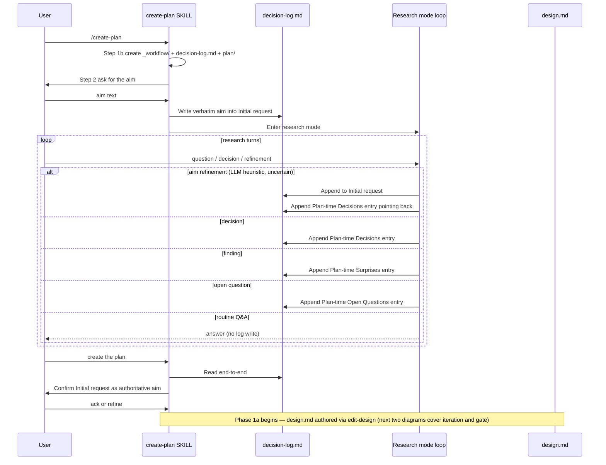
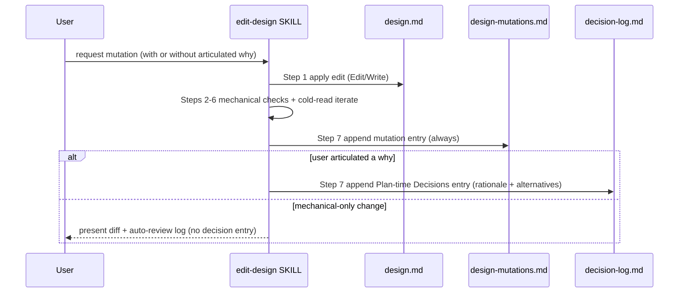

<!-- workflow-sha: 676179cb82295cf15977823a415d5f5476e42526 -->
# Phase 0/1 Decision Log + Design Philosophy — Design

## Overview

Today, `.claude/workflow/` carries a coherent body of conventions but never names the design philosophy those conventions encode. Phase 0 (research) accumulates user-agent conversation that evaporates into chat context. The single-shot summary at `create-plan` Step 4 is the only thing Phase 1 sees, so research drift across `/compact` or partial pauses at the context-warning threshold silently lose information. Phase 1 design iteration captures mechanics in `design-mutations.md` but no rationale: a user who articulates "we changed section X from approach A to B because of constraint C" leaves that *why* in chat context until it lands in a final Decision Record at plan-write time. And Phase 1 itself authors `design.md` last, after Architecture Notes and the track checklist, so the design back-fills decisions the plan already crystallized around, with no design-side gate to catch mismatches before the plan locks them in.

This design adds two artifacts plus one Phase 1 reorder that close those gaps in one PR:

- A lean `### Design philosophy` subsection inside `.claude/workflow/conventions.md` naming seven principles in one sentence each, plus a new load-on-demand `.claude/workflow/design-philosophy.md` carrying the paragraph-length explanations, the workflow-mapping table, the six failure modes, and the external citations (YTDB-842).
- A new `_workflow/decision-log.md` durable file carrying the verbatim user aim, Phase 0 decisions / findings / open questions, and Phase 1a / 1b design-iteration and plan-derivation rationale entries appended whenever the user articulates a *why* (YTDB-965 plus the agreed Phase 1 extension).
- A Phase 1 split into Phase 1a (design-first authoring + feasibility-review gate over `design.md`) and Phase 1b (plan derivation in a fresh session), with an ESCALATE back-edge from 1b to 1a when plan derivation hits a fundamental contradiction. A new `_workflow/feasibility-review.md` durable file records each gate cycle's sub-agent verdicts and the user's `accepted-open-risks` block (YTDB-975).

These three changes ship together rather than as sequential PRs because they overlap heavily on the same workflow files (`planning.md`, `research.md`, `create-plan/SKILL.md`, `workflow.md`, `implementation-review.md`, and the new `_workflow/` artifacts registered in `conventions.md` §1.2 + §1.6). Bundling means one rebase surface, one design.md, one ADR. The intellectual coupling is also real: Principle 7 (Lean documents, load on demand) justifies the philosophy split's two-file shape and informs the new artifacts' "remove at Phase 4 cleanup" lifecycle; YTDB-975 explicitly depends on YTDB-842 landing first so its philosophy-mapping section can cite canonical principle names; the decision-log structure must know whether Phase 1 is one phase or two before its `## Plan-time *` section names freeze. Splitting into separate PRs would re-do `conventions.md`, `planning.md`, `research.md`, and `create-plan/SKILL.md` edits two or three times.

The enabling primitives are: (1) a continuous-log file `decision-log.md` with a one-shot `## Initial request` anchor plus three append-only sections (`## Plan-time Decisions`, `## Plan-time Surprises`, `## Plan-time Open Questions`), each entry carrying an ISO timestamp, the D12 `[ctx=<level>]` field, and (when relevant) a `(Phase 1a)` / `(Phase 1b)` body annotation; (2) a per-cycle feasibility-review log `feasibility-review.md` with per-cycle entries for sub-agent verdicts, `accepted-open-risks` blocks, and the gate-PASS line that Phase 1b reads as its auto-resume signal; (3) an explicit session boundary between Phase 1a and Phase 1b that mirrors the existing A/B/C boundary contract in `workflow.md § Session Boundary Rules`. `design-mutations.md` stays as today; operational state (mutation kind, mechanical-check verdict, counter state) lives there; rationale lives in `decision-log.md`; feasibility verdicts live in `feasibility-review.md`; each file owns one concern.

Restructured to fit: `create-plan/SKILL.md` Steps 1b / 2 / 3 / 4 (Phase 0 writes plus the new Phase 1a / 1b sub-step ordering); `research.md` § Transition to Phase 1 updated to say Phase 1a follows research and 1b runs in a fresh session; `planning.md` § Goal + § Design Document re-framed (design is the primary 1a artifact; plan is derived in 1b); `mid-phase-handoff.md` Phase 0 handoff keeps the in-flight body and points `## Open questions` at the log, plus a new Phase 1a handoff shape; `implementation-review.md` Phase 2 narrowed (design-side consistency folds into 1a; Phase 2 keeps plan-internal structural + plan-vs-design alignment only); `workflow.md` § Phases lists 1a and 1b with the session-boundary contract; `edit-design/SKILL.md` Step 7 appends a rationale entry on every design-mutation whose request carried an articulated *why*; `prompts/create-final-design.md` Phase 4 ADR aggregation walks the log end-to-end to seed key decisions and the narrative summary; `conventions.md` §1.2 directory layout lists both new files (`decision-log.md` and `feasibility-review.md`); `conventions.md` §1.6 stamped-artifact enumeration plus the Phase 1 walk include `feasibility-review.md` (and `workflow-drift-check.md`'s byte-copied walk follows). Five workflow files carry a one-line cross-reference to the new philosophy subsection. A new `.claude/agents/feasibility-review.md` agent definition scoped to `design.md` joins the existing `.claude/agents/` set; the existing `prompts/adversarial-review.md` is reused as the second sub-agent in the gate.

No `design-mechanics.md` companion — this is a small design under the length trigger; the single-file default applies.

The rest of this document is structured as: Core Concepts (ten new terms) → Class Design (artifact-relationship diagram in `classDiagram` form) → Workflow (three runtime flows: Phase 0 → Phase 1a transition, Phase 1a design-iteration rationale capture, Phase 1a gate → Phase 1b derivation with ESCALATE) → nine topic sections (design philosophy with lean subsection plus detailed-doc split, decision-log file shape, initial-request write contract, write triggers, Phase 0 → Phase 1a transition mechanics, Phase 1a feasibility-review gate, Phase 1a design-iteration rationale, Phase 1b plan derivation and ESCALATE back-edge, cross-reference tier mapping).

## Core Concepts

This design introduces ten load-bearing ideas. Each is named and used without re-definition in the sections that follow.

**Design philosophy.** A lean `### Design philosophy` subsection inside `.claude/workflow/conventions.md` (always-loaded) naming seven principles in one sentence each, plus a new load-on-demand `.claude/workflow/design-philosophy.md` carrying paragraph-length explanations, the workflow-mapping table, the six failure modes, and the external citations. The lean subsection points at the detailed doc (two-step). Names what the conventions already do so future "optimizations" pay a visible cost. Replaces the unnamed status quo. → §"Design philosophy".

**decision-log.md.** A new `docs/adr/<dir-name>/_workflow/decision-log.md` file capturing the verbatim user aim plus continuous-log entries for decisions, findings, and open questions across Phase 0 (research), Phase 1a (design iteration), and Phase 1b (plan derivation). Replaces single-shot Phase 0 → Phase 1 summarization. → §"Decision-log file shape".

**Initial request anchor.** A one-shot `## Initial request` section at the top of `decision-log.md` carrying the user's verbatim aim from `create-plan` Step 2. Plan-at-start (no timestamp / ctx field), distinguishing it from continuous-log entries that follow. Phase 1 reads this as the authoritative aim, replacing any "ask the user for the aim again" step. → §"Initial-request write contract".

**Write triggers.** Three events that cause the research agent to append to the log without asking permission: a **decision** (user picks or confirms a choice), a **finding** (PSI-backed reference-accuracy result, paper or library detail that constrains design), an **open question** (item the user defers to planning). Routine Q&A turns where no commitment was made produce no entry. → §"Write triggers".

**Aim-refinement double-write.** When the user refines or expands the aim during early research turns, the agent applies an LLM heuristic with safety net: judge whether the turn refines the goal or explores within it; when in doubt, append to `## Initial request` AND drop a Plan-time Decisions entry pointing back. The cost of a double-write is one extra line; the cost of a misclassification is a lost framing. → §"Initial-request write contract".

**Phase 1a design-iteration rationale entry.** When the user articulates a *why* alongside a `design.md` mutation in Phase 1a, `edit-design` Step 7 appends a Plan-time Decisions entry to `decision-log.md` carrying the rationale and the alternatives rejected. The mechanical record stays in `design-mutations.md` (unchanged). One file per concern. → §"Phase 1a design-iteration rationale".

**Phase 1a feasibility-review gate.** A gate that runs after `design.md` is authored but before plan derivation, executing sub-agents against the design alone: a feasibility-review agent (does the design fit real code, PSI-verified), an adversarial-review pass, and optional domain-shaped reviews (crash safety, concurrency, performance) when the design's content triggers them. Verdict is PASS if every sub-agent returns PASS or the user records an `accepted-open-risks` block in `feasibility-review.md`. Session ends on PASS so Phase 1b runs in a fresh context. → §"Phase 1a feasibility-review gate".

**Phase 1b plan derivation.** A separate session that auto-resumes from validated `design.md` and writes the strategic plan: Architecture Notes, Decision Records (seeded from `decision-log.md ## Plan-time Decisions`), the track checklist, and per-track `plan/track-N.md` files. Detects the resume condition by checking that `design.md` exists, the latest cycle in `feasibility-review.md` records gate PASS, and `implementation-plan.md` does not yet exist. → §"Phase 1b plan derivation and ESCALATE back-edge".

**ESCALATE back-edge.** When Phase 1b hits a fundamental contradiction (missing primitive in the design, circular track dependency, step that cannot fit ~5–7 steps without splitting a design-level construct), the planner writes an ESCALATE entry to `feasibility-review.md`, prints an explicit user-facing message, and ends the session. The user re-invokes `/create-plan`; the agent loads the ESCALATE note, applies an `edit-design` mutation in Phase 1a, re-runs the gate, then 1b auto-resumes. → §"Phase 1b plan derivation and ESCALATE back-edge".

**Cross-reference tier mapping.** The set of one-line links from five workflow files (`planning.md`, `design-document-rules.md`, `conventions-execution.md`, `mid-phase-handoff.md`, `research.md`) to the new `conventions.md § Design philosophy`. The links anchor the rules near their motivating principle without duplicating the principle text; a future rename of the subsection cascades through these five sites in one commit (same lockstep-rename precedent as YTDB-836's house-style sections). → §"Cross-reference tier mapping".

## Class Design

The design touches no Java classes; the "classes" here are workflow artifacts (files) and the SKILLs that read or write them. The diagram below shows the new artifacts plus the existing files this PR modifies, with arrows for reads (`..>`) and writes.

```mermaid
classDiagram
    class conventions_md {
        +Lean Design philosophy subsection (names + one-sentence summaries)
        +Section 1.2 dir layout entries for decision-log.md and feasibility-review.md
        +Section 1.6 stamps + Phase 1 walk include feasibility-review.md
    }
    class design_philosophy_md {
        +Per-principle paragraph explanations
        +Workflow-mapping table (supplementary)
        +Six failure modes
        +External citations
    }
    class decision_log_md {
        +Initial request (one-shot)
        +Plan-time Decisions (append-only)
        +Plan-time Surprises (append-only)
        +Plan-time Open Questions (append-only)
    }
    class design_mutations_md {
        +Mutation N entries (mechanics only)
        +Periodic whole-doc counter source
        +Working-mode counter source
    }
    class feasibility_review_md {
        +Per-gate-cycle entries (Phase 1a)
        +Sub-agent verdicts (feasibility + adversarial + optional domain)
        +Accepted-open-risks block (user-recorded)
        +Gate verdict line (PASS / NEEDS REVISION / ESCALATE)
    }
    class feasibility_review_agent_md {
        +New Phase 1a sub-agent under .claude/agents/
        +PSI-verified reference-accuracy checks against design.md
        +Returns PASS / NEEDS REVISION verdict + findings
    }
    class create_plan_skill {
        +Phase 0: Step 1b creates decision-log.md; Steps 2-3 write triggers
        +Phase 0 to 1a: Step 4 reads decision-log.md and confirms aim
        +Phase 1a: authors design.md first; invokes feasibility gate; writes feasibility-review.md
        +Phase 1b (fresh session): auto-resumes from gate PASS; derives Architecture Notes + tracks + plan files
        +Phase 1b ESCALATE: writes ESCALATE entry to feasibility-review.md, ends session
    }
    class edit_design_skill {
        +Step 7 appends design-mutations.md entry (always)
        +Step 7 appends decision-log.md entry on articulated rationale (Phase 1a only)
    }
    class research_md {
        +Write triggers section (new)
        +Transition to Phase 1 updated for 1a / 1b split
        +Cross-ref to philosophy subsection
    }
    class planning_md {
        +Goal and Design Document re-framed for Phase 1a / 1b roles
        +Phase-overview diagram updated
        +Cross-ref to philosophy subsection
    }
    class mid_phase_handoff_md {
        +Phase 0 handoff keeps in-flight body
        +Open questions section points at decision-log.md
        +Phase 1a handoff shape added
        +Cross-ref to philosophy subsection
    }
    class implementation_review_md {
        +Phase 2 narrowed to plan-internal + plan-vs-design alignment
        +Design-side consistency folds into Phase 1a
    }
    class workflow_md {
        +Phases listed with 1a and 1b sub-phases
        +Session-boundary contract for 1a to 1b
    }
    class conventions_execution_md {
        +Cross-ref to philosophy subsection
    }
    class design_document_rules_md {
        +Cross-ref to philosophy subsection
    }

    conventions_md ..> design_philosophy_md : detailed-doc ref
    create_plan_skill ..> decision_log_md : writes (Phase 0)
    edit_design_skill ..> decision_log_md : writes (Phase 1a rationale)
    edit_design_skill ..> design_mutations_md : writes (mechanics)
    create_plan_skill ..> feasibility_review_agent_md : invokes (Phase 1a gate)
    feasibility_review_agent_md ..> feasibility_review_md : writes verdict + findings
    create_plan_skill ..> feasibility_review_md : writes Phase 1a + reads Phase 1b auto-resume
    create_plan_skill ..> research_md : reads
    create_plan_skill ..> planning_md : reads (Phase 1b)
    research_md ..> conventions_md : philosophy ref
    planning_md ..> conventions_md : philosophy ref
    mid_phase_handoff_md ..> conventions_md : philosophy ref
    implementation_review_md ..> decision_log_md : reads (Phase 2)
    workflow_md ..> create_plan_skill : phase listing
    conventions_execution_md ..> conventions_md : philosophy ref
    design_document_rules_md ..> conventions_md : philosophy ref
```



Three file artifacts (`decision_log_md`, `design_mutations_md`, `feasibility_review_md`) own three complementary roles: knowledge (rationale, alternatives, open questions), mechanics (mutation kind, mechanical-check verdict, counter state), and feasibility verdicts (per-cycle sub-agent results, the user's `accepted-open-risks` block, the gate-PASS line that Phase 1b reads as its auto-resume signal). One new always-loaded surface (the lean `### Design philosophy` subsection inside `conventions_md`) names the principles; one new load-on-demand artifact (`design_philosophy_md`) carries the paragraph-length explanations, the workflow-mapping table, the failure modes, and the external citations. One new agent definition (`feasibility_review_agent_md`) under `.claude/agents/` runs in Phase 1a alongside the existing `prompts/adversarial-review.md`. Two SKILLs (`create_plan_skill`, `edit_design_skill`) write to `decision_log_md` in their owning sub-phase; `create_plan_skill` also writes to and reads from `feasibility_review_md` across the Phase 1a / 1b boundary; `edit_design_skill` additionally writes to `design_mutations_md` on every invocation. Five workflow documents (`research_md`, `planning_md`, `mid_phase_handoff_md`, `implementation_review_md`, `workflow_md`) wire the new artifacts into existing phase boundaries on their read or coordination side. Five documents (`planning_md`, `design_document_rules_md`, `conventions_execution_md`, `mid_phase_handoff_md`, `research_md`) point at the lean `conventions_md § Design philosophy` subsection (two-step); the lean subsection itself points at `design_philosophy_md` so the deeper material stays load-on-demand.

## Workflow

Three runtime flows matter: the Phase 0 → Phase 1a transition (when the agent leaves research mode and starts authoring `design.md`), the Phase 1a design-iteration rationale capture (the agreed YTDB-965 extension to `edit-design`), and the Phase 1a gate → Phase 1b plan derivation handshake with the optional ESCALATE back-edge (the YTDB-975 reorder).

### Phase 0 → Phase 1a transition



The log is the durable artifact across `/clear`, `/compact`, and any Phase 0 pause: a future session re-entering `/create-plan` reads the verbatim `## Initial request` plus every prior decision without re-deriving them from chat memory. The mid-phase-handoff file for Phase 0 keeps its research-shaped body for the in-flight tier (What I was investigating, Already ruled out, Most promising lead, Raw notes / partial findings, Resume notes); its `## Open questions` section becomes a pointer to `decision-log.md ## Plan-time Open Questions` so the same item never lives in two places. The two files own complementary tiers: durable commitments in the log, in-flight investigation state in the handoff.

### Phase 1a design-iteration rationale capture



The two log files never duplicate content. `design-mutations.md` carries operational state (mutation kind, mechanical-check verdict, iteration count, working-mode counter) consumed by `edit-design`'s own machinery — the periodic whole-doc counter and the working-mode sync auto-suggestion both keep reading `design-mutations.md` as today. `decision-log.md` carries knowledge (the *why*, the alternatives, the constraint) consumed by Phase 2 cross-reference and by Phase 4 aggregation into the durable ADR.

### Phase 1a gate → Phase 1b derivation (with ESCALATE)

```mermaid
sequenceDiagram
    participant User
    participant CP as create-plan SKILL
    participant Design as design.md
    participant FR as feasibility-review.md
    participant Sub as Phase 1a sub-agents
    participant Plan as implementation-plan.md
    participant Log as decision-log.md

    Note over User,CP: Phase 1a in progress: design.md authored via edit-design (prior diagrams)
    User->>CP: design looks ready / run the gate
    CP->>User: Recommend optional domain sub-agents from design content
    User->>CP: confirm / override
    loop per sub-agent (feasibility + adversarial + optional domain)
        CP->>Sub: invoke against design.md
        Sub-->>FR: write verdict + findings (per cycle)
    end
    alt all PASS or user accepts open risks
        opt user accepts open risks
            CP->>FR: write accepted-open-risks block
        end
        CP->>FR: write gate verdict PASS
        CP->>User: Phase 1a complete; end session; re-invoke /create-plan for Phase 1b
    else iterate
        CP->>Design: edit-design mutation
        CP->>CP: re-run gate
    end

    Note over User,Plan: Fresh /create-plan session: Phase 1b auto-resumes
    User->>CP: /create-plan (re-invoked after gate PASS)
    CP->>FR: Read latest cycle's gate verdict
    CP->>Design: Read validated design.md
    CP->>Log: Read decision-log.md (Decisions + Surprises + Open Questions)
    alt derivation succeeds
        CP->>Plan: Write Architecture Notes + Decision Records + track checklist + plan/track-N.md files
        CP->>User: Phase 1b complete; plan ready
    else fundamental contradiction
        CP->>FR: Append ESCALATE entry naming the contradiction
        CP->>User: ESCALATE message; end session; re-invoke /create-plan for Phase 1a
    end
```

The gate is the Phase 1a → Phase 1b handshake. Sub-agents run against `design.md` alone (no plan exists yet); each writes its verdict + findings to `feasibility-review.md` as a per-cycle entry. Gate PASS fires when every sub-agent PASSes or when the user records an `accepted-open-risks` block, and ends the session so Phase 1b starts in fresh context. Phase 1b reads `feasibility-review.md` for the gate verdict, `design.md` for the validated structure, and `decision-log.md` for the rationale to seed Decision Records; it writes Architecture Notes, the track checklist, and one `plan/track-N.md` per planned track. ESCALATE is the alternative exit: a fundamental contradiction (missing primitive, circular track dependency, unsplittable >7-step track) writes an ESCALATE entry to `feasibility-review.md`, prints an explicit user-facing message, and ends the session. The next `/create-plan` invocation loads the ESCALATE note, re-enters Phase 1a via an `edit-design` mutation, re-runs the gate, then Phase 1b auto-resumes.

## Design philosophy

**TL;DR.** Two artifacts share the load. A lean subsection sits in always-loaded `conventions.md`, names the seven principles in one sentence each, then points outward; a new load-on-demand file under `.claude/workflow/` carries the longer-form per-principle explanations, the workflow-mapping table, the six failure modes, and the external citations. The lean shape is the orientation moment; the detailed file is the deepening surface. Five workflow files cross-reference the lean subsection (two-step).

### Lean subsection in conventions.md

Seven principles, one sentence each, then a single pointer line to the detailed file. No table, no failure modes, no citations live here; every always-loaded byte reaches every session, so the compact shape itself enforces the principle.

The seven principles, each named and summarized in one sentence:

1. **Working memory and the Dumb Zone.** Context windows are not uniformly usable and attention quality degrades as the window fills, so the workflow keeps the usable prefix small and routes long-form material to load-on-demand surfaces.
2. **Strategy versus tactics.** Strategy is open-ended planning over latent knowledge and tactics are local action sequences; mixing them in one context degrades both, so the workflow separates Phase 1 (strategic) from Phase A/B (tactical) and decomposes step-level detail just-in-time.
3. **Knowledge overhang.** Models have latent knowledge they can reach only via scaffolding (TL;DR, plan files, explicit episodes), so the workflow forces articulation rather than letting direct tactical sampling reach a narrow band of that knowledge.
4. **Episodic memory replaces lossy compaction.** `/compact`, sliding-window summarization, and message-passing handoffs all drop information non-deterministically, so the workflow uses durable files plus bounded compressible episodes instead.
5. **Expressivity and inductive bias.** A harness's reachable behavior depends on interface design AND on how in-distribution that interface is for the model, so the workflow chooses Markdown files and standard CLI tools over bespoke DSLs for durable state.
6. **Semi-formal reasoning for reviewers.** Review sub-agents construct explicit premises, trace structural paths, and derive findings as conclusions, producing a certificate that the reviewer cannot skip cases or assert unsupported claims.
7. **Lean documents, load on demand.** Every always-loaded byte pushes content into the Dumb Zone, so the workflow separates always-loaded surface (`CLAUDE.md`, `conventions.md`) from load-on-demand surface (phase-specific docs, sub-skills) and aggressively defers loading whenever feasible.

Closing pointer line:

> *See `.claude/workflow/design-philosophy.md` for the workflow-mapping table, failure modes, and external citations.*

### Detailed doc at .claude/workflow/design-philosophy.md

A new load-on-demand workflow document carrying paragraph-length explanations of each principle, the seven-row workflow-mapping table (supplementary; drift-prone, so the table lives here only), the six failure modes the workflow prevents, and the four external citations. Loaded by reviewers grounding a rule, planners weighing approaches, and new collaborators orienting on the workflow; not by every session.

Internal structure:

1. **Per-principle paragraphs.** One paragraph per principle (seven total), each expanding the one-sentence summary from the lean subsection into a paragraph that names the failure mode the principle prevents, the workflow mechanism that enforces it, and any external citation that motivates it (Slate, Karpathy, OpenAI cookbook, Ugare & Chandra inline where relevant). The principle name in each paragraph heading matches the lean subsection's principle name byte-for-byte so a future rename cascades cleanly. The seven-principle count is deliberate: each principle anchors a distinct workflow review check or design constraint, and pairs that look similar (P1 failure-mode and P7 mechanism; P3 latent-knowledge-via-scaffolding and P4 durable-files-over-lossy-compaction) actually anchor different rules in different files. Collapsing pairs would lose load-bearing distinctions even where the underlying concept overlaps.
2. **Workflow-mapping table.** Seven rows, one per principle, naming the mechanism that enforces the principle plus the file reference(s) that implement it. The table is supplementary and drift-prone; its single home is this doc, and reviewers consult it when grounding a specific rule, not at every session start.
3. **Failure modes.** Six one-liners naming the failure modes the workflow prevents (naive compaction, overdecomposition, blind N-step execution, message-passing handoff drift, confident-without-evidence review, always-loaded context bloat).
4. **External citations.** Four references: Slate (five compounding pressures, thread weaving, working-memory framing); Karpathy's LLM-OS framing; the OpenAI PLANS.md cookbook (12-section ExecPlan template); Ugare & Chandra 2026 (semi-formal reasoning as certificate-shaped review).

### Edge cases / Gotchas

- The lean subsection lands before the existing `### Recipes` subsection in `conventions.md`. If `### Recipes` is missing on some future revision, place near the file end so the section-order is not disrupted.
- YTDB-842's source body cites `_workflow/tracks/track-N.md` (the pre-rename path); the implementation uses `_workflow/plan/track-N.md` (post-rename). Track 1 fixes the stale citation when writing the lean subsection and the detailed doc.
- The lean subsection and the detailed doc move in lockstep: a renamed principle name in either file requires the corresponding heading update in the other, and a new principle added to one must be added to the other. Track 1 lands both files in the same commit to keep day-1 alignment.
- Before any future rename of a principle, run `grep -rn '<principle name>' .claude/ CLAUDE.md` to enumerate every site (the two principle definitions plus the five cross-reference back-pointers) and update them in one commit. Same mechanical-enforcement precedent as the YTDB-836 house-style section names cited at `conventions.md §1.5`.

### References

- `.claude/workflow/design-philosophy.md` — the new load-on-demand detailed doc (written by this PR).
- `.claude/workflow/conventions.md § Design philosophy` — the new lean subsection that points at the detailed doc.
- D-records: emerge during plan authoring after this design freezes.
- External: Slate (https://randomlabs.ai/blog/slate); Ugare & Chandra 2026 (https://arxiv.org/abs/2603.01896); OpenAI PLANS.md cookbook (https://developers.openai.com/cookbook/articles/codex_exec_plans).

## Decision-log file shape

**TL;DR.** `docs/adr/<dir-name>/_workflow/decision-log.md` is a single Markdown file with one plan-at-start section (`## Initial request`) and three continuous-log sections (`## Plan-time Decisions`, `## Plan-time Surprises`, `## Plan-time Open Questions`). Created in `create-plan` Step 1b, written throughout Phases 0, 1a, and 1b, removed by the Phase 4 cleanup commit. The file is not workflow-SHA-stamped (it carries no on-disk migrations). Per-entry bodies under `## Plan-time Decisions` annotate `(Phase 1a)` or `(Phase 1b)` when the sub-phase distinction matters for ADR aggregation; Phase 0 entries carry no annotation since Phase 0 is the only research sub-phase.

The decision-log lives in a separate file rather than as a section inside `implementation-plan.md` for three reasons. First, writes begin at `create-plan` Step 2 (right after the user provides the aim) before any plan content exists; a separate file gives Phase 0 writes a clean target without coupling to the plan's eventual shape. Second, cross-references from `mid-phase-handoff.md`, `research.md`, and `planning.md` point at a single file path rather than at multiple sections of a larger file. Single-file pointers survive section moves and renames cleanly. Third, the file has a coherent identity (the conversation that led to the plan) distinct from the plan itself (the conclusion of that conversation), and the file name signals that identity to anyone scanning `_workflow/`.

File template:

```markdown
# Decision Log — <Feature Name>

> Anchor (initial user request) plus continuous-log capture of Phase 0
> (research), Phase 1a (design iteration), and Phase 1b (plan derivation)
> decisions, discoveries, and open questions. Entries are durable across
> `/clear`, `/compact`, and every phase boundary. Phase 1a reads `## Initial
> request` at the gate-PASS handshake; Phase 1b reads the file end-to-end
> to seed Decision Records and Architecture Notes; Phase 4 aggregates it
> into the durable ADR.

## Initial request
<!-- First write by `create-plan` Step 2, immediately after the user
provides the aim. Plan-at-start section. The first paragraph carries
the verbatim aim with no timestamp or ctx field; the bare-paragraph
discriminator distinguishes the anchor from continuous-log entries.
Subsequent refinement appends (via the LLM-heuristic-with-double-write
rule, or via the Step 4 transition confirmation) carry the standard
`<ISO> [ctx=<level>]` prefix as an ordering discriminator. Format:

**User's words:** <verbatim from the user's first message after the
Step 2 prompt; quoted exactly>

<ISO timestamp> [ctx=<level>] <refinement paragraph; only on appends after Step 2>
-->

## Plan-time Decisions
<!-- Continuous-log. One entry per decision made during Phase 0
research, Phase 1a design iteration, or Phase 1b plan derivation.
Format:
- <ISO timestamp> [ctx=<level>] <one-line decision> [(Phase 1a) or (Phase 1b) annotation when relevant]
  - **Why:** <rationale in one sentence>
  - **Alternatives rejected:** <X (reason); Y (reason)>
-->

## Plan-time Surprises
<!-- Continuous-log. Code-research and external-research findings that
shape the plan. Format:
- <ISO timestamp> [ctx=<level>] <one-line finding>
  - **Source:** <PSI find-usages of Foo#bar | paper title | library docs URL>
  - **Implication:** <how this affects the plan>
-->

## Plan-time Open Questions
<!-- Continuous-log. Items flagged during research but not yet
resolved. Carried into Phase 1 as Decision Records to write or as
Architecture Notes to fill. Format:
- <ISO timestamp> [ctx=<level>] <one-line question>
  - **Blocking:** <what plan element this blocks>
-->
```

Lifecycle:

- **Created.** `create-plan` Step 1b (idempotent — safe to re-run on resume); created alongside the `_workflow/plan/` directory.
- **Written by.** `create-plan` Steps 2 / 3 (Phase 0 research); `edit-design` Step 7 (Phase 1a rationale capture); `create-plan` Phase 1b plan-derivation writes when the planner articulates rationale during plan authoring.
- **Read by.** `create-plan` Step 4 (Phase 0 → Phase 1a aim-confirmation handshake); `create-plan` Phase 1b session start (full end-to-end read, seeds Decision Records and Architecture Notes); `implementation-review.md` (Phase 2 optional cross-reference); `prompts/create-final-design.md` (Phase 4 ADR aggregation).
- **Removed.** Phase 4 cleanup commit, alongside the rest of `_workflow/**`.

The `[ctx=<level>]` field follows the D12 canonical statusline-read-then-write order: read `/tmp/claude-code-context-usage-$PPID.txt` immediately before each write; parse the `level=` value (one of `safe` / `info` / `warning` / `critical`); use `unknown` if the file is missing or the parse fails (do not skip the write). The rule is inlined here so the per-entry write is self-recoverable without leaving the file; the canonical source lives at `.claude/workflow/episode-format-reference.md § Step header`.

### Edge cases / Gotchas

- File creation in Step 1b is idempotent; a resume that re-runs Step 1b must not overwrite existing content. The implementation tests for file existence before writing the seeded template.
- A research turn that consumes context past `warning` (≥30%) triggers `mid-phase-handoff.md`'s Phase 0 path; the handoff retains its research-shaped in-flight body (What I was investigating, Already ruled out, Most promising lead, Raw notes, Resume notes) and points its `## Open questions` section at `decision-log.md ## Plan-time Open Questions` to avoid duplicating the same item. The two files own complementary tiers: durable commitments in the log, in-flight investigation state in the handoff.
- Phase 4 ADR aggregation reads `decision-log.md` end-to-end through `prompts/create-final-design.md`: Plan-time Decisions entries seed the ADR's key-decisions section; Plan-time Surprises entries seed the ADR's narrative summary; Plan-time Open Questions that landed in plan elements (DRs, invariants, non-goals) are not re-aggregated. Without this read, the design's stated benefit (rationale survives `/compact` into the final ADR) does not land.
- The file deliberately has no workflow-SHA stamp on line 1 — its append-only contract makes it replay-immune by construction, same rationale as `design-mutations.md`'s exclusion in `conventions.md § 1.6(f)`.
- The `(Phase 1a)` / `(Phase 1b)` body annotation is informational, not structural; Phase 4 ADR aggregation reads both annotations but does not partition the ADR by sub-phase. Entries without an annotation are treated as Phase 0 by default.

### References

- D12 canonical: `.claude/workflow/episode-format-reference.md § Step header`; ADR at `docs/adr/ytdb-817-new-track-format/adr.md § D12`.
- `.claude/workflow/conventions.md § 1.2` directory layout entry (added in this PR).

## Initial-request write contract

**TL;DR.** `create-plan` Step 2 writes the user's verbatim aim into `## Initial request` immediately after the user provides it, before entering research mode. Refinements during early research turns apply an LLM-heuristic-with-double-write rule: the agent judges per turn whether the message refines the goal or explores within it; when in doubt, append to `## Initial request` AND drop a Plan-time Decisions entry pointing back.

The first write is **one-shot at Step 2**. The user's first message after the Step 2 prompt lands in `## Initial request` as-is, quoted exactly. No timestamp or `[ctx=<level>]` field is attached on this first paragraph; the bare-paragraph discriminator distinguishes the anchor from continuous-log entries that follow.

Subsequent refinement appends (via the double-write rule below, or via the Step 4 transition confirmation described in §"Phase 0 → Phase 1a transition") carry the standard `<ISO timestamp> [ctx=<level>]` prefix as an ordering discriminator. Phase 1's read of §Initial request treats the bare first paragraph as the original aim and timestamped paragraphs as ordered refinements; on contradictions, the latest paragraph wins. When the double-write fires, the Plan-time Decisions entry pointing back carries the same timestamp as the refinement append, so both files share an ordering anchor.

The **double-write rule** fires when the agent's per-turn judgment returns "uncertain" between refinement and exploration. Concretely, the heuristic asks: does this turn (a) revise what we are building, or (b) explore *how* within the existing aim? On (a), append to `## Initial request` only. On (b), append a Plan-time Decisions entry only. On uncertain, append to both — the `## Initial request` carries the refinement and a Plan-time Decisions entry references it ("See §Initial request, refinement at <ISO>"). The cost of a double-write is one extra line; the cost of a single misclassification is a lost framing.

The boundary is qualitative. Once research moves into alternatives ("should we use approach A or B?"), refinements stop landing in `## Initial request` and start landing in `## Plan-time Decisions` only. The agent's running judgment is the gate; there is no turn-count cap, no explicit lock signal, no first-DR boundary.

### Edge cases / Gotchas

- A user who repeatedly restates the aim with cumulative refinements lands multiple paragraphs under `## Initial request`. The section grows; this is expected and not a structural problem (the section is plan-at-start, not bounded).
- A user who *contradicts* an earlier refinement ("ignore what I said earlier — actually X") still appends; the timestamped append establishes its position in the order, and Phase 1 reads the latest paragraph as authoritative. The agent does not redact prior content. A Plan-time Decisions entry records the contradiction explicitly so the supersession is visible in both files.
- A pause that fires before the user has provided the aim (very early Phase 0) leaves `## Initial request` empty; the handoff path tolerates the absence and the resume prompts for the aim before continuing.

### References

- §"Decision-log file shape" — one-shot versus continuous-log section taxonomy.
- §"Write triggers" — the three Phase 0 triggers that follow the one-shot Initial-request write.

## Write triggers

**TL;DR.** Three events trigger an append to `decision-log.md` during research mode with no user confirmation: a **decision** (user picks or confirms a choice), a **finding** (PSI-backed reference-accuracy result, external paper, library quirk, unexpected coupling), an **open question** (item the user defers to planning). Routine Q&A turns where no commitment was made produce no entry.

Each entry follows the per-section format defined in §"Decision-log file shape", lands the ISO timestamp + `[ctx=<level>]` field, and includes the structured sub-bullets:

- Decision: `**Why:**` + `**Alternatives rejected:**`.
- Finding: `**Source:**` + `**Implication:**`.
- Open question: `**Blocking:**`.

In Phase 1a, the `edit-design` skill adds a fourth trigger: a design-iteration mutation that carries an articulated *why*. See §"Phase 1a design-iteration rationale" for the integration point.

The agent's judgment about whether a turn produces an entry is per-turn and immediate; no batching, no end-of-conversation sweep. A turn that produces multiple events (a decision plus a finding, for example) produces multiple entries.

### Edge cases / Gotchas

- A finding that surfaces during routine Q&A — e.g., a user asks "what does method Foo do?" and the agent's PSI search uncovers an unexpected coupling — lands as a finding entry even though the conversation looked like Q&A. The criterion is the *content*, not the shape of the turn.
- A user who says "let's hold this question for now" without naming the topic still gets an open-question entry; the topic is the current conversation focus.
- An internet research result that came back inconclusive does not produce a finding entry (no implication to record). It may produce an open-question entry if the user defers it.

### References

- §"Initial-request write contract" — the aim-refinement double-write rule.
- §"Phase 1a design-iteration rationale" — the Phase 1a trigger added on top of these three.

## Phase 0 → Phase 1a transition

**TL;DR.** `create-plan` Step 4 fires when the user says "create the plan" at the end of research mode. The agent reads `decision-log.md ## Initial request`, surfaces the current aim for ack-or-refine, and on ack the session moves into design authoring via `edit-design`. The log-to-plan mapping runs in the next sub-phase; Step 4 itself is purely the aim-confirmation handshake.

The transition replaces today's single-shot summarization ("summarize the key research findings and decisions from the conversation, and proceed to planning") with two structured steps. The aim-confirmation handshake runs here (Phase 0 → 1a); a separate full-doc read at Phase 1b session start covers the log-to-plan mapping. The agent does not need to remember the conversation: the log carries every commitment.

The handshake itself works as follows. The agent surfaces the current state of §Initial request for the user to confirm: *"Confirming the aim before planning: <verbatim §Initial request content>. OK as-is, or refinements needed?"* The user acks or refines; refinement turns at this confirmation point are LLM-heuristic-free (the user is explicitly editing the aim, so the agent treats the response as a refinement append by default, with timestamp). This confirmation catches in-Phase-0 misclassifications of refinement-vs-exploration that may have routed content to the wrong place during research. The Phase 0 double-write rule's asymmetric safety net protects against one classification error only (refinement misread as exploration); the explicit Step 4 confirmation closes the gap on the reverse error.

After the ack, the session enters Phase 1a: `design.md` authoring via `edit-design`. The decision-log is left in place; Phase 1a continues to append rationale entries via `edit-design` Step 7 (see §"Phase 1a design-iteration rationale"), and Phase 1b later reads the file end-to-end to seed plan content (see §"Phase 1b plan derivation and ESCALATE back-edge").

### Edge cases / Gotchas

- A long Phase 0 with many decisions produces a long log; Phase 1a's aim-confirmation read still skims it cheaply because only §Initial request needs verbatim presentation, and Phase 1b's later end-to-end read happens in fresh session context.
- Plan-time Open Questions that can't be resolved without further research route back to research mode at Phase 0 → 1a; the agent reverses out of Phase 1a, asks the question, then re-enters the handshake once the log has the answer. Phase 1b open-question handling differs; see §"Phase 1b plan derivation and ESCALATE back-edge".
- A Phase 0 pause writes a `handoff-research.md` carrying the in-flight tier (What I was investigating, Already ruled out, Most promising lead, Raw notes, Resume notes); its `## Open questions` section points at `decision-log.md ## Plan-time Open Questions` rather than duplicating items. On resume, the resume protocol presents the in-flight body plus the latest decision-log entries for orientation.

### References

- §"Decision-log file shape" — per-section format the read consumes.
- §"Write triggers" — what landed in each section during Phase 0.
- §"Phase 1a feasibility-review gate" — what happens after `design.md` is authored.
- §"Phase 1b plan derivation and ESCALATE back-edge" — where the log-to-plan mapping runs.

## Phase 1a feasibility-review gate

**TL;DR.** After `design.md` is authored via `edit-design`, a sub-agent review fires against the design alone before plan derivation begins. Three slots invoke per cycle: a new agent at `.claude/agents/feasibility-review.md` (PSI-verified reference-accuracy checks against `design.md`), the existing `prompts/adversarial-review.md` (devil's-advocate edge-case pass), and zero or more domain-shaped reviewers (crash-safety, concurrency, performance) when the design's content triggers a recommendation the user confirms. Each cycle's verdicts and findings append to `_workflow/feasibility-review.md`. PASS fires when every sub-agent returns PASS or the user records an `accepted-open-risks` block; on PASS, the session ends so a fresh `/create-plan` invocation handles plan derivation in clean context.

The gate is the structural answer to the Phase 1 ordering gap: today `design.md` lands last and back-fills decisions the plan already crystallized around, so design-side flaws surface only after Phase 2 review. Moving design ahead of plan derivation and inserting a design-only review layer in between catches feasibility, adversarial, and domain-specific issues before plan structure is committed.

The three sub-agent slots map to distinct review dimensions:

- **Feasibility-review** (new agent at `.claude/agents/feasibility-review.md`). Reads `design.md` against the real codebase via PSI find-usages, find-implementations, and call-hierarchy queries. Flags claims that don't fit current code: a referenced method that doesn't exist, a proposed interface contract that contradicts an existing implementation, a "no production callers" claim that the audit actually refutes. PSI-reachability is mandatory; the agent falls back to grep only when mcp-steroid is `NOT reachable` and records the caveat in its verdict.
- **Adversarial-review** (existing `prompts/adversarial-review.md`). Devil's-advocate pass on the design: under-specified edges, hidden assumptions, missing failure modes, sections where the author convinced themselves but a fresh reader would not.
- **Domain-shaped reviewers** (optional). At gate-trigger time, the agent inspects `design.md` for content triggers (WAL / persistence / recovery language activates crash-safety review; locks / atomics / barriers / volatile / synchronized activates concurrency review; hot-path / allocation / I/O / direct-memory / cache language activates performance review). The agent surfaces a recommendation ("crash-safety reviewer recommended because design mentions WAL replay at §Recovery"); the user confirms, overrides, or adds.

Each cycle's per-sub-agent verdicts append to `feasibility-review.md` as a structured entry. File shape:

```markdown
# Feasibility Review — <Feature Name>

<!-- Append-only log of every Phase 1a gate cycle. Each cycle's sub-agent
verdicts and findings land here; Phase 1b reads the latest cycle's gate
verdict as its auto-resume signal. Removed by the Phase 4 cleanup commit
alongside the rest of _workflow/**. -->

## Cycle 1 — <ISO date>

**Sub-agents invoked**: feasibility-review, adversarial-review[, domain-1[, domain-2]]

**feasibility-review** (PSI-backed | grep-fallback): <PASS | NEEDS REVISION>
- <finding> — file:line citation
- ...

**adversarial-review**: <PASS | NEEDS REVISION>
- <finding>
- ...

**<domain-name>-review** (when invoked): <PASS | NEEDS REVISION>
- <finding>
- ...

**Accepted open risks** (when the user accepts findings rather than iterating):
- <risk> — **Why accepted**: <user-stated rationale>

**Gate verdict**: PASS | NEEDS REVISION | ESCALATE
```

Gate PASS ends the session with a user-facing message: *"Phase 1a complete. End this session and re-invoke `/create-plan` to enter Phase 1b (plan derivation)."* The session-end mirrors the A/B/C session-boundary contract in `workflow.md § Session Boundary Rules`: durable state (`design.md`, the `feasibility-review.md` verdict) crosses the boundary; chat-buffer state does not.

Iteration on findings runs the standard `edit-design` mutation cycle plus a re-invocation of the gate. The cycle count is bounded by user patience, not by a hard limit; the `accepted-open-risks` block exists precisely for the case where iteration yields diminishing returns and the user wants to move on.

### Edge cases / Gotchas

- **PSI unavailable.** When mcp-steroid is `NOT reachable`, the feasibility-review agent's reference-accuracy claims fall back to grep and the cycle entry records the caveat ("feasibility-review: PASS (grep-fallback, reference-accuracy not PSI-verified)"). Gate PASS is still allowed in this state, but the open-risk implication should be noted explicitly so Phase 4 ADR aggregation can surface it.
- **Multi-sub-agent disagreement.** Each sub-agent returns its own verdict independently. PASS requires every sub-agent to PASS, OR the user to record an `accepted-open-risks` block citing the disagreeing sub-agent's finding. The gate does not auto-resolve disagreements.
- **Domain-trigger drift.** A design that didn't mention crash-safety on cycle 1 may add a §"Recovery" section by cycle 3; the domain-recommendation step re-runs each cycle, so a new domain reviewer can join mid-iteration. The opposite case (a removed trigger no longer warranting a domain reviewer) drops the reviewer for subsequent cycles; prior cycles' entries stay on disk as the audit trail.
- **Mid-gate pause.** If context fills past `warning` mid-iteration, the standard `mid-phase-handoff.md` protocol writes a `handoff-phase1a-gate.md` capturing the current cycle's partial findings and the next sub-agent to run. Resume reads the partial cycle entry from `feasibility-review.md` and continues without re-running already-PASSed sub-agents.

### References

- YTDB-975 — umbrella issue and acceptance criteria.
- Parent epic YTDB-813.
- `.claude/workflow/prompts/adversarial-review.md` — the reusable existing sub-agent.
- `.claude/agents/feasibility-review.md` — the new agent definition added by this PR.
- `.claude/workflow/workflow.md § Session Boundary Rules` — the contract Phase 1a / 1b mirrors.
- §"Phase 1b plan derivation and ESCALATE back-edge" — what runs after gate PASS.

## Phase 1a design-iteration rationale

**TL;DR.** When the user articulates a *why* alongside a `design.md` mutation in Phase 1a, `edit-design` Step 7 appends a Plan-time Decisions entry to `decision-log.md` carrying the rationale and alternatives rejected. The mechanical record stays in `design-mutations.md` (unchanged). Each file owns one concern: mechanics versus knowledge. Per-entry bodies under `## Plan-time Decisions` annotate `(Phase 1a)` when the rationale came from design iteration via `edit-design`, distinguishing them from `(Phase 1b)` entries the planner appends during plan derivation in the Phase 1b session.

The two-file split has a real cost: every Phase 1a rationale entry duplicates a timestamp with its sibling `design-mutations.md` entry, and Phase 4 aggregation walks both streams. The split is justified because the readers differ. `design-mutations.md`'s sync auto-suggestion and periodic whole-doc counter scan that file for mechanics state alone; `decision-log.md`'s Phase 4 ADR aggregation walks rationale alone. Mixing the two concerns in one file would force every reader to filter for its half. Separation pays for itself by keeping each reader's scan over a homogeneous file.

The integration point is `edit-design/SKILL.md` Step 7 (review log append), which fires only inside Phase 1a (the design-authoring sub-phase). After appending the per-mutation entry to `design-mutations.md`, the skill checks whether the user's mutation request carried an articulated *why* — a user message naming the rationale, or an explicit phrase like "because", "in order to", "to avoid", "to satisfy constraint X". When it did, the skill also appends a Plan-time Decisions entry to `decision-log.md` using the standard write-trigger format (ISO timestamp + `[ctx=<level>]` + decision line + `**Why:**` + `**Alternatives rejected:**`) plus the `(Phase 1a)` body annotation per §"Decision-log file shape".

Mechanical-only mutations (typo fixes, formatting cleanups, a section rename with no design implication) produce no Plan-time Decisions entry. The mutation entry in `design-mutations.md` is sufficient.

The skill does not infer rationale from diff content. A diff that visually expresses a decision but was applied silently does not produce a Plan-time Decisions entry; rationale must be articulated to be captured. The cost of this rule is that some implicit decisions go uncaptured; the benefit is that the log carries only knowledge the user actually surfaced.

### Edge cases / Gotchas

- The articulated-only rule has a deliberate trade-off: implicit rationale (the user signals intent through the mutation itself — `rename §X to §Y` with the unstated assumption that §Y is clearer) is not captured. Phase 4 aggregation reads only articulated rationale. Decisions that shaped the design but never landed in chat as a *because* / *in order to* / *to avoid* phrase are reconstructed at ADR-write time from the diff itself, not from `decision-log.md`. The cost is that some implicit decisions go uncaptured; the benefit is that the log carries only knowledge the user actually surfaced.
- `design-mutations.md`'s sync auto-suggestion (5 mechanics-edits → propose sync) is unaffected. The working-mode counter and periodic whole-doc counter both keep reading `design-mutations.md` as today.
- A user revising a prior rationale ("actually, the reason is Y, not X") appends a new Plan-time Decisions entry referencing the earlier one. The prior entry stays as-is; the continuous-log append-only contract holds across rationale revisions.
- A mutation kind of `mechanics-edit` may carry a rationale entry too; the trigger is "user articulated a *why*", not the mutation kind. Mechanics edits often carry the deepest rationale (the user is wrestling with how a mechanism actually works).
- `phase4-creation` mutations do not append to `decision-log.md` — Phase 4 produces durable artifacts (`design-final.md`, `adr.md`) and its rationale lands in `adr.md` directly. `decision-log.md` is a Phase 0/1 working file removed by the Phase 4 cleanup commit.

### References

- §"Decision-log file shape" — the per-section format the rationale entry follows.
- `.claude/skills/edit-design/SKILL.md § Step 7` — integration point modified by this PR.
- `.claude/workflow/design-document-rules.md § Review log` — the `design-mutations.md` format (unchanged).

## Phase 1b plan derivation and ESCALATE back-edge

**TL;DR.** A separate `/create-plan` session auto-resumes from a validated `design.md` and writes the strategic document: Architecture Notes, Decision Records (seeded from the durable log's decisions section), the track checklist, and one `plan/track-N.md` per declared track. The resume detector checks that `design.md` exists, the latest cycle in `feasibility-review.md` records gate PASS, and `implementation-plan.md` does not yet exist. When the session hits a fundamental contradiction (missing primitive in the design, circular track dependency, step that cannot fit under ~5–7 steps without splitting a design-level construct), the agent writes a return-to-design entry in `feasibility-review.md`, prints an explicit user-facing message, and ends the session.

The split into a separate session is the structural answer to working-memory pressure that Phase 1a design iteration accumulates. By the time `edit-design` has run several cycles plus the gate has run its sub-agents, the session's context carries design-iteration reasoning that would bias plan derivation. A fresh Phase 1b session forces the planner to re-derive plan structure from the durable artifact (`design.md`) rather than from chat-buffer memory. This mirrors the A/B/C session-boundary contract: durable files cross; chat context does not.

The plan-derivation mapping from `decision-log.md` runs at Phase 1b session start, after the auto-resume signal is detected:

- A `## Plan-time Decisions` entry's `**Why:**` becomes the DR's rationale bullet; `**Alternatives rejected:**` becomes the DR's alternatives bullet. The one-line decision text becomes the DR title. Phase 1b entries that the planner appends during plan derivation (with the `(Phase 1b)` annotation) seed late-arriving DRs.
- A `## Plan-time Surprises` entry's `**Implication:**` becomes Component Map intent, Architecture Notes content, or Integration Points content depending on what it constrains. `**Source:**` survives as evidence in the relevant section.
- A `## Plan-time Open Questions` entry is resolved one of three ways: written as a DR / invariant / non-goal in the plan; folded into an existing DR's risks; or surfaced to the user with the question text. The planner does not silently elide unresolved questions.

ESCALATE is the alternative exit from Phase 1b. The trigger is a fundamental contradiction: a referenced primitive in the design that no plan structure can express, a circular dependency between proposed tracks that no reordering resolves, or a track that cannot fit under ~5–7 steps without splitting a design-level construct the design treats as atomic. The planner writes an ESCALATE entry to `feasibility-review.md`:

```markdown
## Cycle N — <ISO date> — ESCALATE from Phase 1b

**Reason**: <concrete description of the contradiction>
**Site**: design.md §"<section name>"
**Suggested design change**: <one sentence; the planner's best read>
```

Then prints to the user: *"Phase 1b cannot derive a coherent plan from this design — <reason>. End this session; re-invoke `/create-plan` to re-enter Phase 1a, apply an `edit-design` mutation addressing the contradiction, re-run the gate, and Phase 1b will auto-resume."* The session ends; no partial plan files land on disk.

On the next `/create-plan` invocation, the auto-resume detector sees the latest cycle's verdict is ESCALATE (not PASS), reads the ESCALATE entry, and routes the session into Phase 1a with the ESCALATE note as the starting input. The user works through an `edit-design` mutation in Phase 1a, the gate re-runs, and on the new PASS the session ends again so a fresh Phase 1b can auto-resume. Multiple ESCALATE round trips are allowed; each leaves an audit trail in `feasibility-review.md`.

### Edge cases / Gotchas

- **What counts as "fundamental contradiction".** Three concrete shapes: (1) a referenced primitive the design assumes exists but no code or convention provides; (2) a circular dependency between two proposed tracks where neither can run before the other; (3) a track whose work cannot fit under ~5–7 steps without splitting a design-level construct the design treats as a single concept. Non-fundamental issues (a track that needs to split into two siblings; a section that needs an additional Architecture Notes paragraph) are solved inline during Phase 1b without ESCALATE.
- **Partial plan files on ESCALATE.** The planner does not write half a plan and bail. ESCALATE detection happens before any `implementation-plan.md` content lands. If the contradiction surfaces after some `plan/track-N.md` files have been written, the planner deletes them as part of the ESCALATE write so the worktree is clean for the Phase 1a re-entry.
- **User-driven ESCALATE.** The user can request "rethink the design" or "go back to Phase 1a" at any point during Phase 1b; the planner treats this as an ESCALATE signal, captures the user's stated reason in the entry, and ends the session.
- **Auto-resume false negative.** If `feasibility-review.md` is missing or the latest cycle's verdict is malformed, the auto-resume detector falls back to asking the user explicitly: *"`feasibility-review.md` cannot be parsed; should I treat this as Phase 1a or Phase 1b?"* The user picks; the session continues accordingly.
- **Phase 1b on a pre-YTDB-975 design.** A design authored before YTDB-975 lands (an in-flight branch without the gate machinery) has no `feasibility-review.md`. The auto-resume detector treats this as the pre-YTDB-975 path: Phase 1b runs without a gate-verified design, and a Phase 2 review covers the gap. New branches authored after YTDB-975 always carry the gate artifact.

### References

- YTDB-975 — acceptance criteria for the Phase 1 split and ESCALATE back-edge.
- `.claude/workflow/review-iteration.md` — the ESCALATE convention this section adapts.
- `.claude/workflow/workflow.md § Session Boundary Rules` — the A/B/C contract Phase 1a → 1b mirrors.
- §"Phase 1a feasibility-review gate" — what produces the gate-PASS signal Phase 1b reads.
- §"Decision-log file shape" — the file Phase 1b reads end-to-end to seed plan content.

## Cross-reference tier mapping

**TL;DR.** Five workflow files carry a one-line link to `conventions.md § Design philosophy`. The links anchor the rules near their motivating principle without duplicating the principle text. A future rename of the subsection cascades through these five sites in one commit (same lockstep-rename precedent as YTDB-836's house-style sections).

| Source file | Section to link from | Reason |
|---|---|---|
| `planning.md` | Strategy versus tactics section header | The Phase 1a (design strategic) + Phase 1b (plan strategic) / Phase A (tactical) split implements Principle 2. |
| `design-document-rules.md` | TL;DR / BLUF section header | The TL;DR forcing function implements Principle 3 (Knowledge overhang). |
| `conventions-execution.md` | Step-aware tactical tier section | Just-in-time step decomposition implements Principle 2 (Strategy versus tactics). |
| `mid-phase-handoff.md` | File header (top-of-file blockquote) | The mid-phase handoff mechanism is the operational answer to Principle 4 (Episodic memory). |
| `research.md` | Write-trigger section header (new in this PR) | The new write triggers implement Principles 3 and 4 (Knowledge overhang + Episodic memory). |

The link format follows house-style cross-references already in use across the workflow: a single sentence in italic blockquote or a "See:" reference at the section header. The link target is the H3 (`### Design philosophy`) under conventions.md, not an H2. The lean subsection itself then points at `.claude/workflow/design-philosophy.md`, giving the reader the orientation moment (the named principle) before the deeper material loads on demand. The two-step preserves the principle name as the anchor while keeping the longer explanations, the workflow-mapping table, the failure modes, and the external citations off the always-loaded surface.

### Edge cases / Gotchas

- If a future commit renames `### Design philosophy` to anything else, the rename cascades through the five cross-reference sites, the detailed doc's filename, and the lean subsection's pointer line in the same commit. Track 1 writes the lean subsection, the detailed doc, and the cross-references atomically to keep them consistent on day 1.
- YTDB-842's acceptance criteria list four cross-references; this PR adds a fifth (`research.md`) because we're touching that file anyway for the write triggers, and the fit is natural (the research-log mechanism implements Principles 3 and 4).
- YTDB-975 touches additional workflow files (`planning.md` § Goal + § Design Document; `workflow.md` § Phases; `implementation-review.md` Phase 2 narrowing; `create-plan/SKILL.md` Steps 1b / 2 / 3 / 4) but does not add a sixth philosophy cross-reference. The five-site table stays at five; YTDB-975's edits target operational sections (gate mechanics, session-boundary contract, narrowed review scope) rather than principle anchors. A Phase 1a / 1b note could be added to the existing `planning.md` row's Reason text without changing the row count.
- Anchor resolution depends on the subsection's heading slug. GitHub's slug generator lowercases and hyphenates; the link uses the canonical slug.

### References

- `.claude/workflow/conventions.md § Design philosophy` — the lean target the five files link to (two-step); written by this PR.
- `.claude/workflow/design-philosophy.md` — the load-on-demand detailed doc the lean subsection points at; written by this PR.
- §"Design philosophy" — the subsection's content this PR adds.
