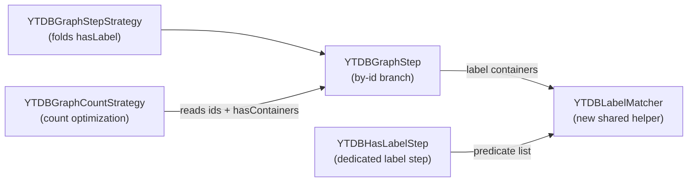

<!-- workflow-sha: e9377f7f133f5cd6ec3028936f28be2819e4ae96 -->
# Polymorphic `hasLabel` on by-id traversals

## Design Document
[design.md](design.md)

## High-level plan

### Goals

Make Gremlin `hasLabel` honor polymorphism on the by-id path, so
`g.V(childId).hasLabel("Parent")` matches a `Child` exactly as the class-scan form
`g.V().hasLabel("Parent")` already does. The fix covers vertices, edges, and
multi-argument `hasLabel`. It also corrects a second defect on the same
`V(id).hasLabel(...)` path: `g.V(id).hasLabel(X).count()` must count only the pinned
ids, not the whole class.

### Constraints

- Non-polymorphic queries keep exact label matching — only the polymorphic path
  changes.
- The class-scan branch of `YTDBGraphStep` is unchanged; its polymorphism already
  comes from the SQL `FROM <type>` extent.
- Both fixes land in one track, and the count guard (Bug 2) never lands in a commit
  earlier than the polymorphic matcher (Bug 1); a guard-first order would regress a
  polymorphic by-id count to 0. See design.md §"Bug 2 — count id-drop on `V(id).hasLabel(X).count()`".
- The Gremlin scenario tests run only through the `YTDBProcessTest` suite, which sets
  up the graph provider; a direct `-Dtest` surefire run on the scenario class fails.

### Architecture Notes

#### Component Map

- **`YTDBLabelMatcher`** (new) — static helper holding the polymorphic label-match
  logic: resolve the schema class once, test each predicate against the concrete
  class name and, when polymorphic, every superclass name; fall back to a string
  test for non-YouTrackDB elements. The single owner both label paths call.
- **`YTDBGraphStep`** — the by-id branch of `elements()` partitions its
  `HasContainer`s into label (by the `T.label` key) and non-label, routes labels
  through `YTDBLabelMatcher` (AND across containers) and keeps non-label on
  `HasContainer.testAll`. Class-scan branch untouched.
- **`YTDBHasLabelStep`** — `filter()` delegates its predicate list to
  `YTDBLabelMatcher` instead of inlining the concrete-plus-superclass walk.
- **`YTDBGraphCountStrategy`** — the label-filter branch of `apply()` gains the
  `getIds().length == 0` guard its empty-containers sibling already has, so an
  id-bearing count falls through to normal by-id execution.

#### D1: Shared label-matcher helper instead of duplicating the logic

- **Alternatives considered**: inline the concrete-plus-superclass walk a second time
  in the by-id branch; extract a shared static helper both paths call (chosen).
- **Rationale**: the root cause is two independent label matchers that drifted — the
  by-id branch never gained the polymorphism `YTDBHasLabelStep` already had.
  Consolidating the logic in one helper removes the chance to drift again.
- **Risks/Caveats**: a third call site would also have to route through the helper;
  the helper is the canonical owner, so any future label test must use it.
- **Implemented in**: Track 1
- **Full design**: design.md §"Class Design"

#### D2: Helper is a predicate-list static utility, package-neutral

- **Alternatives considered**: a static method on `YTDBHasLabelStep`; a single-predicate
  signature called per predicate; a stateless `YTDBLabelMatcher` utility taking the
  predicate list (chosen).
- **Rationale**: the list signature preserves `YTDBHasLabelStep`'s single
  superclass walk per element (OR over predicates), and a standalone utility keeps
  the by-id step (`...step.sideeffect`) and the label step (`...step.filter`) from
  depending on each other. The by-id branch passes each label container's predicate
  as a one-element list and ANDs the results.
- **Risks/Caveats**: per-container calls in the by-id branch walk superclasses once
  per label container; multiple `hasLabel` containers on one step are rare, so the
  cost is bounded.
- **Implemented in**: Track 1
- **Full design**: design.md §"Class Design"

#### D3: Fix the count id-drop with an id guard, not an id-aware count step

- **Alternatives considered**: make `YTDBClassCountStep` count an id set; add the
  `getIds().length == 0` guard so the optimization is skipped when ids are present
  (chosen).
- **Rationale**: with Bug 1 fixed, the normal by-id execution path already counts
  correctly, so skipping the optimization is the minimal correct change.
  `YTDBClassCountStep` counts classes and cannot count an id set without new code.
- **Risks/Caveats**: an id-bearing count trades a class count for a
  fetch-filter-count over the named ids; the id set is bounded by the query, so the
  cost is proportional to the ids named. Fix-order constraint: the guard must not
  land before the Bug 1 matcher (see Constraints).
- **Implemented in**: Track 1
- **Full design**: design.md §"Bug 2 — count id-drop on `V(id).hasLabel(X).count()`"

#### Invariants

- The by-id branch and `YTDBHasLabelStep` produce identical label-match results for
  the same element, label predicate, and polymorphic flag (tested via the by-id and
  has-id scenario methods).
- Non-polymorphic by-id queries match only the concrete label (tested via the
  non-polymorphic methods).
- `g.V(id).hasLabel(X).count()` equals `g.V(id).hasLabel(X).toList().size()` on
  multi-vertex data (tested via the count-honors-id method; `checkSize` asserts both).

#### Integration Points

- `YTDBGraphStep.elements()` by-id branch calls `YTDBLabelMatcher.matches(...)` for
  label containers.
- `YTDBHasLabelStep.filter()` delegates to `YTDBLabelMatcher.matches(...)`.
- `YTDBGraphCountStrategy.apply()` label-filter branch adds the `getIds().length == 0`
  condition.

#### Non-Goals

- Optimizing non-polymorphic class-scan queries (the existing TODO about propagating
  a non-polymorphic flag to the query engine in `YTDBGraphStep.elements()`).
- Any change to the class-scan branch's behavior.
- Making `YTDBClassCountStep` id-aware.

## Checklist
- [x] Track 1: Polymorphic by-id `hasLabel` and count id-drop fix
  > Introduce the shared `YTDBLabelMatcher`, route both the by-id branch of
  > `YTDBGraphStep` and `YTDBHasLabelStep` through it so by-id `hasLabel` honors
  > polymorphism for vertices, edges, and multi-argument labels, and add the
  > `getIds().length == 0` guard to `YTDBGraphCountStrategy` so an id-bearing count
  > stops dropping the id. Extend `YTDBHasLabelProcessTest` with the count-honors-id,
  > edge by-id, and multi-argument by-id scenarios alongside the four existing (uncommitted, working-tree) methods.
  >
  > **Track episode:**
  > Fixed YTDB-1159: the by-id Gremlin path now honors polymorphism and the id
  > filter exactly as the class-scan path does. Added `YTDBLabelMatcher` (the
  > polymorphism-aware label test lifted from `YTDBHasLabelStep.filter`), routed
  > both `YTDBHasLabelStep` and the by-id branch of `YTDBGraphStep.elements`
  > through it, and added the `getIds().length == 0` guard to
  > `YTDBGraphCountStrategy`'s label-filter rewrite so an id-bearing count stops
  > dropping the id. The by-id branch partitions `hasContainers` on the `T.label`
  > accessor key: non-label containers run through `HasContainer.testAll`, each
  > label container ANDs through the matcher with the step's polymorphic flag.
  > Implemented in one MEDIUM-risk commit (`fa590ca9bc`), then hardened in Phase C
  > — track-level review (six dimensions, no blockers) surfaced test-coverage gaps
  > on the new by-id partition logic, fixed in `Review fix:` commit `860380ce3a`
  > (six new/extended tests: label+property AND, chained `hasLabel`
  > AND-across-containers, multi-pinned-id count, unrelated-sibling exclusion,
  > edge-path count/toList agreement; plus a clarifying comment). All dimensions
  > PASS at gate-check, iteration 1/3. No cross-track impact — single
  > self-contained track. Accepted-as-is suggestions (style, per-element
  > allocation mirroring the class-scan path, minor test-structure) are recorded
  > in the track file's Outcomes & Retrospective.
  >
  > **Track file:** `plan/track-1.md` (1 step, 0 failed)

## Plan Review
- [x] Plan review (consistency + structural) — passed at iteration 1

**Auto-fixed (mechanical)**: CR1 — corrected "committed" to "existing (uncommitted, working-tree)" for the four by-id / has-id test methods in the plan and `track-1.md`. The `design.md` occurrences of the same wording are recorded and deferred to the Phase 4 `design-final.md` reconciliation (design frozen after Phase 1).

**Escalated (design decisions)**: none.

## Final Artifacts
- [ ] Phase 4: Final artifacts (`design-final.md`, `adr.md`)
