# YouTrackDB AI Agent — Self-Hosted Specification

## 1. Overview

A self-hosted AI coding agent for the YouTrackDB project that:

1. Developer opens a new chat session — a Hetzner CPX42 server spins up automatically
2. Developer describes the task in natural language (free-form, no issue key required)
3. Agent works interactively: explores code, makes changes, runs tests — developer steers via chat
4. When the work is done, the developer says "create PR". The agent creates a branch, commits, and opens a PR on `JetBrains/youtrackdb` targeting `develop`
5. The session sleeps (server destroyed, disk snapshotted). Cost drops to near zero
6. When a reviewer comments on the PR, the session wakes, the agent addresses feedback, and sleeps again
7. On PR merge or rejection the session is terminated and all resources are cleaned up

### System Overview

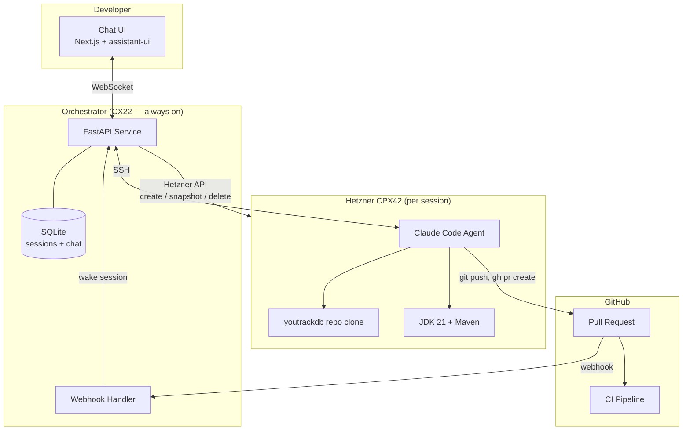

---

## 2. Target Project Profile

| Property | Value |
|---|---|
| Repository | `JetBrains/youtrackdb` (GitHub) |
| Primary branch | `develop` |
| Language | Java 21 |
| Build tool | Maven Wrapper (`./mvnw`) |
| Test frameworks | JUnit 4, TestNG, Testcontainers |
| Repo size (excl .git) | ~1.3 GB |
| CI | GitHub Actions (matrix: JDK 21+25, Linux/Windows) |
| Commit format | `YTDB-NNN: imperative summary` |
| PR rules | No merge commits, must target `develop`, PR template required |
| Coverage gate | 85% line+branch on new/changed code |
| Mutation testing | PIT, 85% threshold on changed classes |
| CLAUDE.md | Present — full project guide for Claude Code |

---

## 3. Infrastructure

### 3.1 Hetzner CPX42 Agent Server (per session)

| Property | Value |
|---|---|
| Server type | CPX42 (8 vCPU AMD, 16 GB RAM, 240 GB NVMe) |
| Hourly cost | ~€0.0504/h |
| OS | Ubuntu 24.04 |
| Purpose | Run Claude Code agent + build/test YouTrackDB |

**Why CPX42**: YouTrackDB tests use `-Xms4096m -Xmx4096m` for the JVM heap alone,
plus Maven itself needs 1 GB (`-Xmx1024m`). With Claude Code overhead, 16 GB is the
safe minimum. 8 vCPUs enable parallel Maven module compilation.

### 3.2 Orchestrator Server (always-on)

| Property | Value |
|---|---|
| Server type | CX22 (2 vCPU, 4 GB RAM) or equivalent |
| Monthly cost | ~€4/month |
| Purpose | Webhook receiver, session state, chat proxy |
| Software | Python 3.12+, FastAPI, SQLite, Caddy (TLS) |

### 3.3 Networking

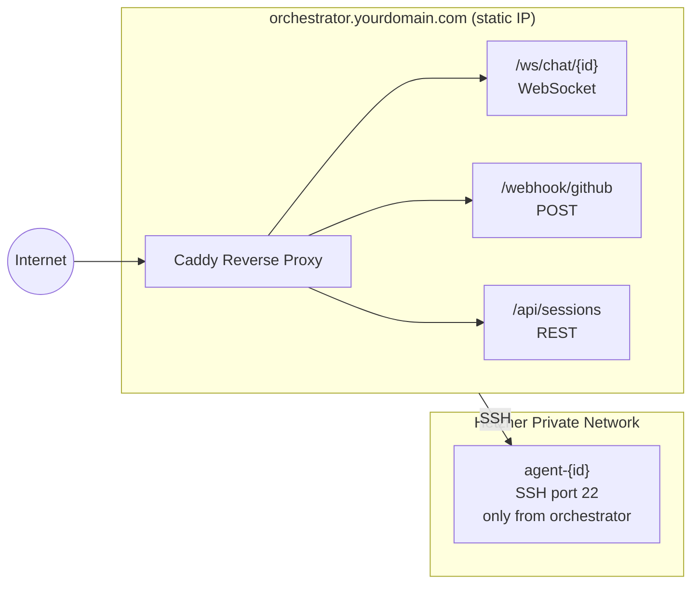

---

## 4. Session Lifecycle

### 4.1 Sequence Diagram — Full Lifecycle

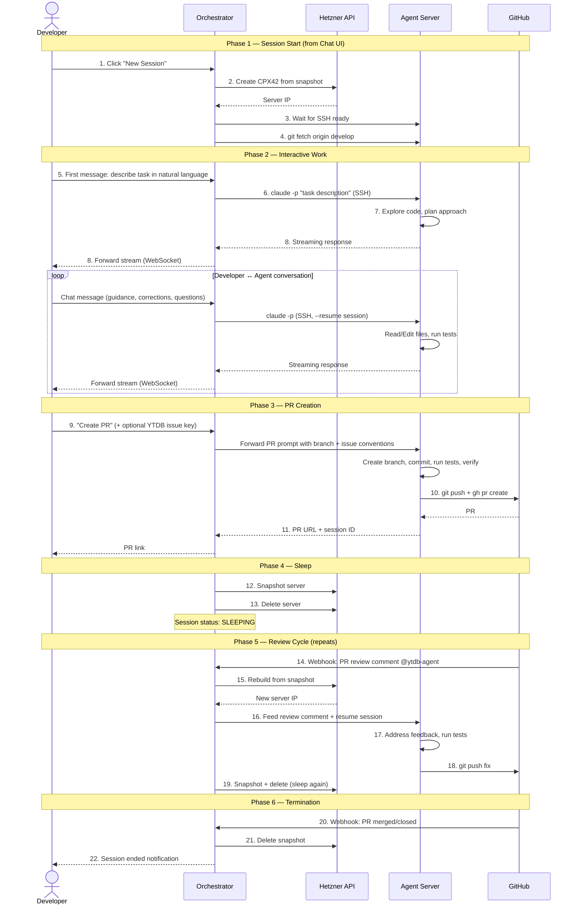

### 4.2 Session Start — Chat-First Flow

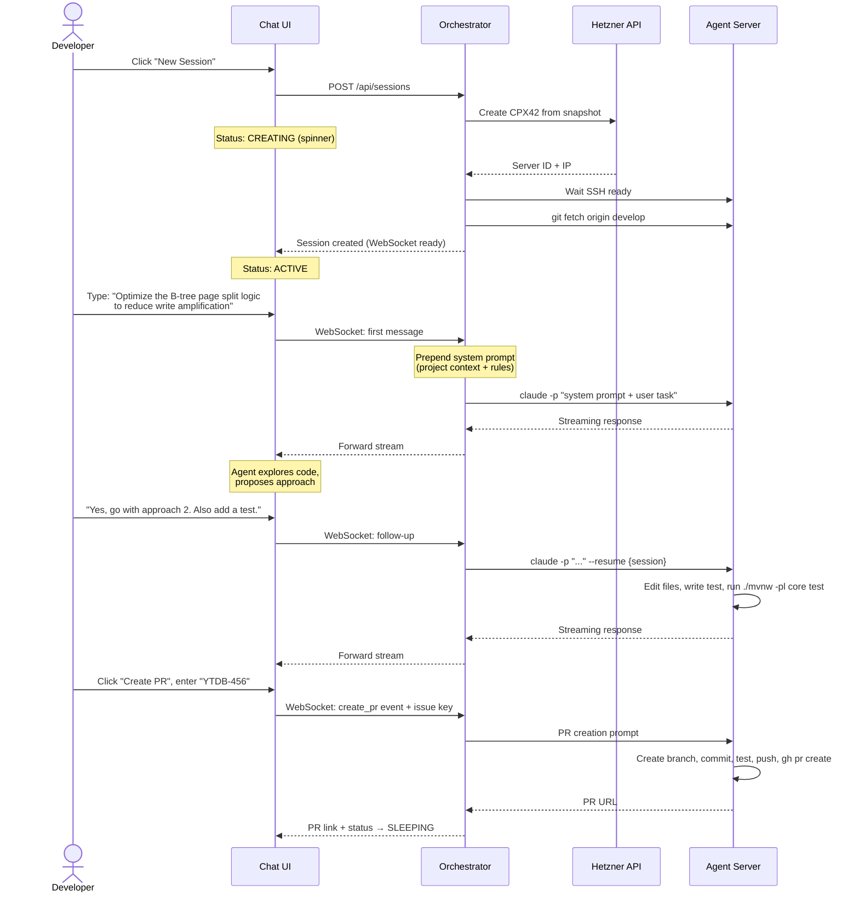

### 4.3 State Machine


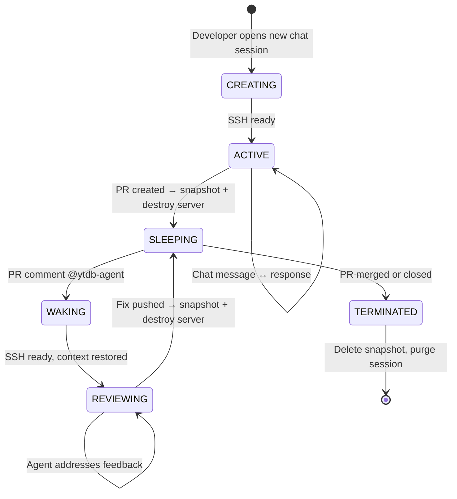

### 4.4 Sleep / Wake Detail

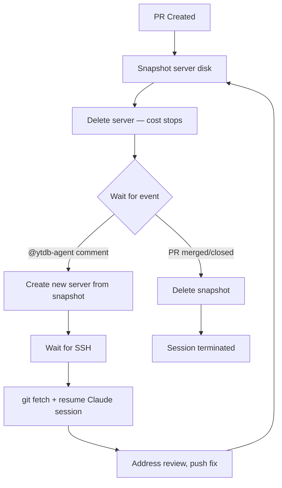

---

## 5. Components

### 5.1 Hetzner Agent Snapshot

Pre-built snapshot containing everything YouTrackDB needs:

```
Ubuntu 24.04
├── JDK 21 (temurin)               — primary build JDK
├── JDK 25 (temurin)               — for CI matrix parity
├── Node.js 22 LTS                 — for Claude Code
├── Claude Code (npm -g)            — @anthropic-ai/claude-code
├── gh CLI                          — GitHub CLI for PR operations
├── git + git-lfs
├── Docker                          — for docker-tests module
│
├── /workspace/youtrackdb/          — git clone of JetBrains/youtrackdb
│     ├── .claude/                  — project CLAUDE.md + settings
│     └── (full repo)
│
├── /root/.m2/repository/           — pre-warmed Maven cache
├── /root/.ssh/                     — deploy key (push access)
├── /root/.gitconfig                — user.name="ytdb-agent"
└── /root/.config/gh/               — gh auth token (repo + PR scope)
```

**Snapshot build script** (`build-snapshot.sh`):

```bash
#!/bin/bash
set -euo pipefail

# Create server
hcloud server create \
  --name ytdb-agent-template \
  --type cpx42 \
  --image ubuntu-24.04 \
  --ssh-key ytdb-agent-key \
  --location fsn1

IP=$(hcloud server ip ytdb-agent-template)

# Wait for SSH
until ssh -o ConnectTimeout=5 root@$IP true 2>/dev/null; do sleep 2; done

# Provision
scp provision-agent.sh root@$IP:/tmp/
ssh root@$IP "bash /tmp/provision-agent.sh"

# Snapshot
hcloud server create-image \
  --type snapshot \
  --description "ytdb-agent-$(date +%Y%m%d)" \
  ytdb-agent-template

# Cleanup
hcloud server delete ytdb-agent-template
```

### 5.2 Orchestrator Service

**Tech stack**: Python 3.12, FastAPI, hcloud SDK, asyncssh, SQLite

#### Database schema (SQLite)

```sql
CREATE TABLE sessions (
  id              TEXT PRIMARY KEY,          -- uuid
  status          TEXT NOT NULL,             -- creating|active|sleeping|waking|reviewing|terminated
  title           TEXT,                      -- short label, set from first message or by developer
  server_id       INTEGER,                  -- Hetzner server ID (null when sleeping)
  server_ip       TEXT,                      -- server IPv4 (null when sleeping)
  snapshot_id     INTEGER,                   -- Hetzner snapshot ID (null when active)
  claude_session  TEXT,                      -- Claude Code --resume session ID
  pr_number       INTEGER,                  -- GitHub PR number (null until PR created)
  branch_name     TEXT,                      -- git branch name (null until PR creation)
  ytdb_issue      TEXT,                      -- YTDB-NNN issue key (optional, set at PR time)
  created_at      TEXT NOT NULL,
  updated_at      TEXT NOT NULL
);

CREATE TABLE chat_history (
  id              INTEGER PRIMARY KEY AUTOINCREMENT,
  session_id      TEXT NOT NULL REFERENCES sessions(id),
  role            TEXT NOT NULL,             -- user|agent|system
  content         TEXT NOT NULL,
  timestamp       TEXT NOT NULL
);

CREATE INDEX idx_sessions_pr ON sessions(pr_number);
CREATE INDEX idx_sessions_status ON sessions(status);
```

#### API endpoints

| Method | Path | Purpose |
|---|---|---|
| `POST` | `/api/sessions` | Create new chat session (spins up CPX42, no issue key needed) |
| `GET` | `/api/sessions` | List all sessions |
| `GET` | `/api/sessions/{id}` | Get session details |
| `DELETE` | `/api/sessions/{id}` | Force-terminate session |
| `WebSocket` | `/ws/chat/{id}` | Bidirectional chat with agent |
| `POST` | `/webhook/github` | GitHub webhook receiver |

#### Core orchestrator logic (pseudocode)

```python
# === Session creation ===
# No YTDB issue required — developer just opens a session and starts chatting.
# The issue key and branch name are resolved later at PR creation time.

async def create_session() -> Session:
    session_id = str(uuid4())[:8]

    server = hetzner.servers.create(
        name=f"ytdb-agent-{session_id}",
        server_type=ServerType(name="cpx42"),
        image=Image(id=CURRENT_SNAPSHOT_ID),
        ssh_keys=[hetzner.ssh_keys.get_by_name("ytdb-agent-key")],
        location=Location(name="fsn1"),
    )

    await wait_for_ssh(server.server.public_net.ipv4.ip)

    # Start on detached HEAD from latest develop — no branch yet.
    # Branch is created at PR time once the task and issue key are known.
    await ssh_exec(server.server.public_net.ipv4.ip, """
        cd /workspace/youtrackdb
        git fetch origin develop
        git checkout origin/develop
    """)

    session = Session(
        id=session_id, status="active",
        server_id=server.server.id,
        server_ip=server.server.public_net.ipv4.ip,
        branch_name=None,   # set at PR creation
        ytdb_issue=None,     # set at PR creation (or by developer during chat)
    )
    db.save(session)
    return session


# === Chat relay (WebSocket <-> SSH) ===

async def handle_chat(ws: WebSocket, session: Session):
    while True:
        user_msg = await ws.receive_text()
        db.save_chat(session.id, "user", user_msg)

        resume = f"--resume {session.claude_session}" if session.claude_session else ""

        async with asyncssh.connect(session.server_ip) as conn:
            process = await conn.create_process(
                f"cd /workspace/youtrackdb && "
                f"ANTHROPIC_API_KEY=$ANTHROPIC_API_KEY "
                f"claude -p {shlex.quote(user_msg)} "
                f"{resume} "
                f"--output-format stream-json "
                f"--allowedTools 'Read,Edit,Write,Bash,Glob,Grep'",
            )

            full_response = ""
            async for line in process.stdout:
                data = json.loads(line)
                await ws.send_json(data)
                if data.get("type") == "result":
                    full_response = data.get("result", "")
                    session.claude_session = data.get("session_id")

        db.save_chat(session.id, "agent", full_response)
        db.update_session(session)


# === Sleep / Wake ===

async def sleep_session(session: Session):
    server = hetzner.servers.get_by_id(session.server_id)

    image_response = hetzner.servers.create_image(
        server, description=f"ytdb-session-{session.id}", type="snapshot",
    )
    await wait_for_image(image_response)
    server.delete()

    session.status = "sleeping"
    session.snapshot_id = image_response.image.id
    session.server_id = None
    session.server_ip = None
    db.update_session(session)


async def wake_session(session: Session):
    session.status = "waking"
    db.update_session(session)

    server = hetzner.servers.create(
        name=f"ytdb-agent-{session.id}",
        server_type=ServerType(name="cpx42"),
        image=Image(id=session.snapshot_id),
        ssh_keys=[hetzner.ssh_keys.get_by_name("ytdb-agent-key")],
        location=Location(name="fsn1"),
    )

    await wait_for_ssh(server.server.public_net.ipv4.ip)
    await ssh_exec(server.server.public_net.ipv4.ip,
                   "cd /workspace/youtrackdb && git fetch origin")

    session.status = "reviewing"
    session.server_id = server.server.id
    session.server_ip = server.server.public_net.ipv4.ip
    db.update_session(session)


# === GitHub webhook handler ===

async def handle_github_webhook(payload: dict):
    action = payload.get("action")

    # PR review comment with @ytdb-agent mention
    if is_pr_comment(payload) and "@ytdb-agent" in get_comment_body(payload):
        pr_number = get_pr_number(payload)
        session = db.find_session_by_pr(pr_number)
        if not session:
            return

        if session.status == "sleeping":
            await wake_session(session)

        comment = get_comment_body(payload).replace("@ytdb-agent", "").strip()
        prompt = build_review_prompt(comment, get_file_context(payload), pr_number)
        response = await send_to_agent(session, prompt)
        await gh_post_comment(pr_number, response)
        await sleep_session(session)

    # PR merged or closed
    elif is_pr_closed(payload):
        pr_number = payload["pull_request"]["number"]
        session = db.find_session_by_pr(pr_number)
        if not session:
            return

        if session.server_id:
            hetzner.servers.get_by_id(session.server_id).delete()
        if session.snapshot_id:
            hetzner.images.get_by_id(session.snapshot_id).delete()

        session.status = "terminated"
        db.update_session(session)
```

### 5.3 Chat UI — Next.js + assistant-ui

The frontend is a Next.js app using [assistant-ui](https://github.com/assistant-ui/assistant-ui)
(8.5k stars, actively maintained, YC-backed) — a React component library purpose-built
for AI chat interfaces. It provides streaming, markdown rendering, code blocks with
syntax highlighting, and composable Radix-style primitives out of the box.

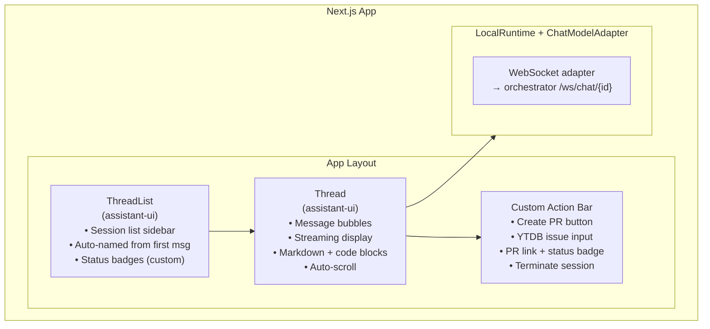

#### Tech stack

| Layer | Choice |
|---|---|
| Framework | Next.js 15 (App Router) |
| Chat components | `@assistant-ui/react` |
| Styling | Tailwind CSS (assistant-ui default) |
| Markdown | `@assistant-ui/react-markdown` (built-in code highlighting) |
| State | assistant-ui `LocalRuntime` (manages chat state internally) |
| Transport | WebSocket to orchestrator, bridged via `ChatModelAdapter` |

#### Scaffold

```bash
npx assistant-ui@latest create ytdb-agent-ui
cd ytdb-agent-ui
npm install
```

#### Core integration — ChatModelAdapter (WebSocket)

The `ChatModelAdapter` is the single integration point between assistant-ui and
the orchestrator. It translates chat messages into WebSocket calls and streams
responses back:

```tsx
// lib/ytdb-adapter.ts
import type { ChatModelAdapter } from "@assistant-ui/react";

export function createYtdbAdapter(sessionId: string): ChatModelAdapter {
  return {
    async *run({ messages, abortSignal }) {
      const ws = new WebSocket(
        `${process.env.NEXT_PUBLIC_ORCHESTRATOR_WS}/ws/chat/${sessionId}`
      );

      // Send the latest user message
      const lastMessage = messages[messages.length - 1];
      const userText = lastMessage.content
        .filter((p) => p.type === "text")
        .map((p) => p.text)
        .join("\n");

      ws.onopen = () => ws.send(JSON.stringify({ text: userText }));

      // Stream response chunks back to assistant-ui
      let text = "";
      const chunks = new ReadableStream({
        start(controller) {
          ws.onmessage = (event) => {
            const data = JSON.parse(event.data);
            if (data.type === "content_block_delta") {
              text += data.delta?.text || "";
              controller.enqueue(text);
            }
            if (data.type === "result") {
              controller.close();
            }
          };
          ws.onerror = () => controller.close();
          abortSignal.addEventListener("abort", () => {
            ws.close();
            controller.close();
          });
        },
      });

      const reader = chunks.getReader();
      while (true) {
        const { done, value } = await reader.read();
        if (done) break;
        yield { content: [{ type: "text" as const, text: value }] };
      }
    },
  };
}
```

#### Runtime provider

```tsx
// app/session/[id]/runtime-provider.tsx
"use client";

import { AssistantRuntimeProvider, useLocalRuntime } from "@assistant-ui/react";
import { createYtdbAdapter } from "@/lib/ytdb-adapter";

export function SessionRuntimeProvider({
  sessionId,
  children,
}: {
  sessionId: string;
  children: React.ReactNode;
}) {
  const adapter = createYtdbAdapter(sessionId);
  const runtime = useLocalRuntime(adapter);

  return (
    <AssistantRuntimeProvider runtime={runtime}>
      {children}
    </AssistantRuntimeProvider>
  );
}
```

#### Page layout with ThreadList + Thread + custom actions

```tsx
// app/session/[id]/page.tsx
import { Thread } from "@assistant-ui/react";
import { ThreadList } from "@assistant-ui/react";
import { SessionRuntimeProvider } from "./runtime-provider";
import { CreatePrButton } from "@/components/create-pr-button";
import { SessionStatusBadge } from "@/components/session-status-badge";

export default function SessionPage({ params }: { params: { id: string } }) {
  return (
    <SessionRuntimeProvider sessionId={params.id}>
      <div className="flex h-screen">
        {/* Sidebar — session list with status badges */}
        <div className="w-72 border-r">
          <NewSessionButton />
          <ThreadList />
        </div>

        {/* Main chat area */}
        <div className="flex-1 flex flex-col">
          <div className="border-b p-3 flex items-center gap-3">
            <SessionStatusBadge sessionId={params.id} />
            <CreatePrButton sessionId={params.id} />
          </div>
          <Thread />
        </div>
      </div>
    </SessionRuntimeProvider>
  );
}
```

#### What assistant-ui provides for free

| Feature | Component | Notes |
|---|---|---|
| Message bubbles | `Thread` | User/assistant styling, avatars |
| Streaming display | `Thread` | Token-by-token rendering, auto-scroll |
| Markdown rendering | `@assistant-ui/react-markdown` | GFM, tables, lists |
| Code blocks | Built-in | Syntax highlighting, copy button |
| Message input | `Composer` (inside `Thread`) | Multi-line, send on Enter |
| Typing indicator | `Thread` | Shows while agent is responding |
| Conversation list | `ThreadList` | Sidebar or dropdown layout |
| Copy message | `ActionBarPrimitive.Copy` | One-click copy |
| Cancel generation | `Composer.Cancel` | Stops in-flight response |

#### Custom components to build (~2-3 hours)

| Component | Purpose |
|---|---|
| `<NewSessionButton>` | POST `/api/sessions`, navigate to new session page |
| `<SessionStatusBadge>` | Polls session status, shows ACTIVE / SLEEPING / REVIEWING / etc. |
| `<CreatePrButton>` | Opens modal with optional YTDB issue input, sends `create_pr` event |
| `<PrLink>` | Shows GitHub PR link + CI status after PR creation |

**Flow**:
1. Developer clicks **"New Session"** — orchestrator spins up CPX42, redirects to session page
2. `Thread` component renders empty chat; developer types task in natural language
3. `ChatModelAdapter` sends message via WebSocket; agent streams response back
4. assistant-ui renders markdown + code blocks in real time
5. Developer clicks **"Create PR"** — modal asks for optional YTDB issue key
6. Agent creates branch, commits, tests, opens PR — PR link appears in header
7. Session status badge updates to SLEEPING; session stays in `ThreadList` sidebar
8. When reviewer comments, status flips to REVIEWING — developer can watch in sidebar

---

## 6. YouTrackDB-Specific Agent Configuration

### 6.1 Agent system prompt (injected at session start)

The agent inherits the full `CLAUDE.md` from the repository. Additionally,
the orchestrator prepends a session context prompt on the **first message**:

```
You are working on the YouTrackDB project (JetBrains/youtrackdb).
You are on a detached HEAD at the latest origin/develop.

The developer will describe a task in this chat. Work interactively:
explore code, propose approaches, implement changes, run tests.

Rules:
- Target branch for PRs is "develop"
- Run ./mvnw -pl {affected_modules} test before committing
- If tests use >12GB heap, warn the operator
- Use the PR template: include Motivation section
- Never force push without --force-with-lease
- Coverage target: 85% on new/changed code
- Mutation testing: 85% on changed classes

When the developer asks to create a PR:
- They will provide a YTDB issue key (e.g. YTDB-456), or ask you to create
  the PR without one (in which case use a descriptive branch name)
- Create a branch named: ytdb-{issue_number}-{short-description}
  (or agent/{session_id}/{short-description} if no issue key)
- All commits must be prefixed with the issue key if provided: "YTDB-456: ..."
- Push the branch and open the PR via gh CLI
```

### 6.2 Tool permissions

```
Allowed (auto-approve):
  Read, Edit, Write, Glob, Grep

Allowed (with streaming output to chat):
  Bash — restricted to:
    - ./mvnw *
    - git *
    - gh pr create / gh pr view / gh pr comment
    - docker * (for docker-tests)
    - java * (for running specific classes)

Denied:
  - rm -rf /
  - Any network access outside github.com and maven repos
  - Modifying .github/workflows/
  - Modifying CLAUDE.md
```

### 6.3 PR creation flow

When the developer says "create PR", the orchestrator:

1. Prompts for a YTDB issue key if one hasn't been mentioned in the conversation
   (the Chat UI shows an optional input field; developer can skip it)
2. Sends the following to the agent:

```
The developer wants to create a PR.
{if ytdb_issue}
YTDB Issue: {ytdb_issue}
Branch name: ytdb-{issue_number}-{slug_from_chat_title}
Commit prefix: "{ytdb_issue}: "
{else}
No issue key provided.
Branch name: agent/{session_id}/{slug_from_chat_title}
Commit prefix: none required
{endif}

Steps:
1. Create and checkout the branch from current HEAD
2. Stage and commit all changes (split into logical commits if appropriate)
3. Run tests: ./mvnw -pl {affected_modules} test
4. If tests pass, push the branch to origin
5. Use "gh pr create" targeting "develop"
6. PR title: "{ytdb_issue}: <imperative summary>" (or just summary if no issue)
7. PR body must follow the template:
   #### PR Title:
   <title>

   #### Motivation:
   <explain WHY — problem, context, trade-offs>
8. Verify: no merge commits in branch
9. Return the PR URL
```

3. Saves the PR number and branch name to the session
4. Transitions to SLEEPING state (snapshot + destroy)

### 6.4 Review response prompt template

When a reviewer comments, the orchestrator builds this prompt:

```
A reviewer left feedback on PR #{pr_number}.

Comment by @{reviewer}:
> {comment_body}

{if file_context}
On file: {path}, line {line}
Relevant diff context:
  {diff_hunk}
{endif}

Instructions:
1. Read the reviewer's feedback carefully
2. If code changes are needed, make them and run tests
3. Commit with message:
   {if ytdb_issue}"{ytdb_issue}: Address review feedback — {brief summary}"
   {else}"Address review feedback — {brief summary}"{endif}
4. Push to the branch
5. Reply with a summary of what you changed and why
```

---

## 7. Request/Response Flow Details

### 7.1 Chat message flow

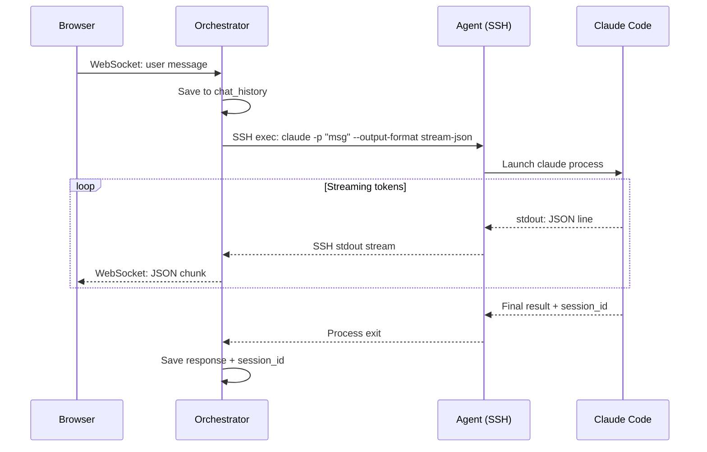

### 7.2 Webhook → review cycle

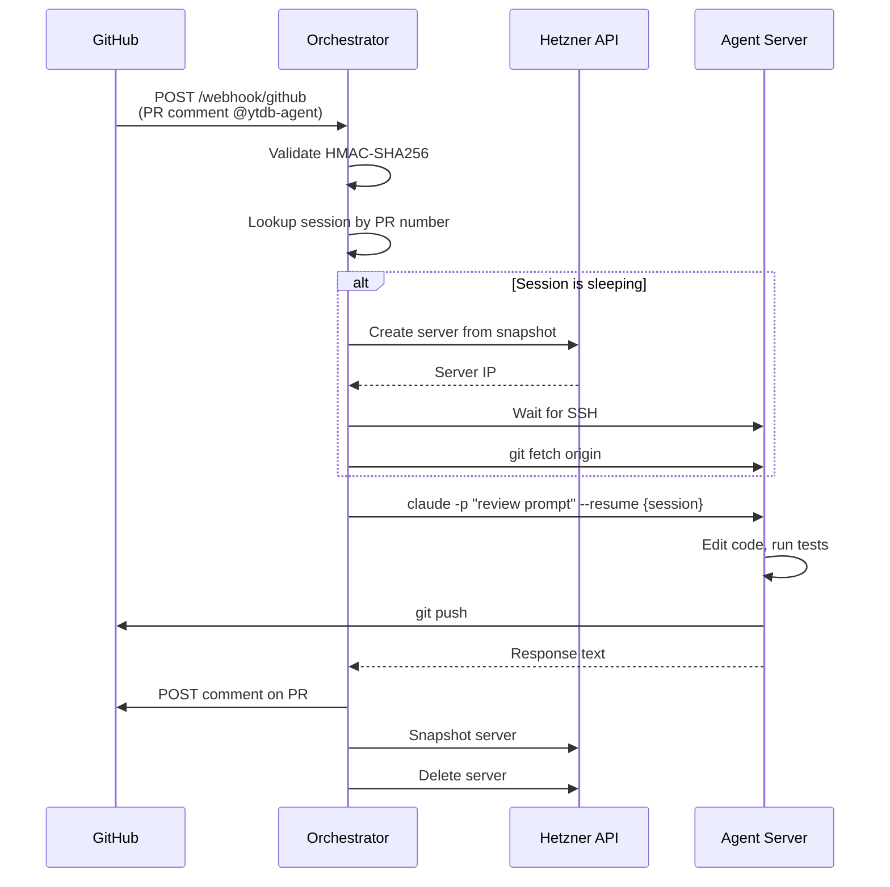

---

## 8. Cost Analysis

### 8.1 Per-session Hetzner cost (CPX42)

| Phase | Duration | Server running? | Cost |
|---|---|---|---|
| Interactive chat | ~30 min (typical) | Yes | €0.025 |
| Sleeping (PR review) | Hours to days | No (snapshot only) | ~€0.001/day |
| Wake for review comment | ~10 min | Yes | €0.008 |
| Repeat wake cycles (×3 avg) | ~30 min total | Yes | €0.025 |
| **Total per PR lifecycle** | | | **~€0.06** |

Snapshot storage: €0.0108/GB/month. A 240 GB snapshot ≈ €2.60/month if kept.
In practice, snapshots are deleted on PR merge, so typical storage cost is negligible.

### 8.2 Anthropic API cost (per session)

| Model | Input | Output | Typical session |
|---|---|---|---|
| Claude Sonnet 4.6 (recommended) | $3/MTok | $15/MTok | $2–8 |
| Claude Opus 4.6 | $5/MTok | $25/MTok | $5–20 |

For YouTrackDB with its 1.3 GB codebase and large CLAUDE.md, expect sessions on
the higher end. Use `--max-turns` to cap runaway sessions.

### 8.3 Monthly estimate (moderate usage)

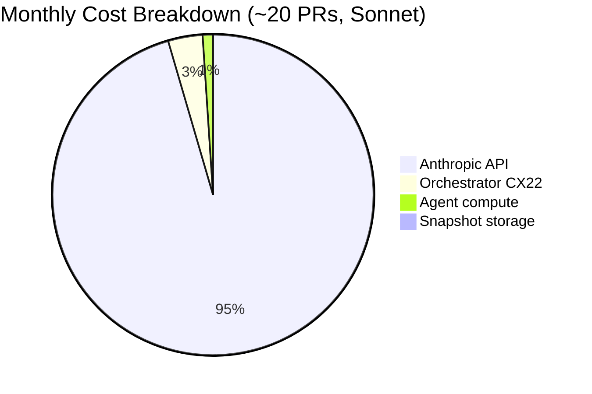

| Item | Quantity | Cost |
|---|---|---|
| Orchestrator (CX22) | 1 × 24/7 | €4/month |
| Agent sessions | ~20 PRs/month | ~€1.20/month |
| Snapshots (transient) | ~5 active at any time | ~€1/month |
| Anthropic API (Sonnet) | ~20 sessions | ~$60–160/month |
| **Total** | | **~$70–170/month** |

---

## 9. Security Considerations

### 9.1 Secrets management

| Secret | Stored on | Scope |
|---|---|---|
| `ANTHROPIC_API_KEY` | Orchestrator env only | Injected via SSH env per command |
| GitHub deploy key | Agent snapshot `/root/.ssh/` | Push access to `youtrackdb` only |
| `gh` auth token | Agent snapshot | Scoped: `repo`, `read:org` |
| Hetzner API token | Orchestrator env | Full cloud access — protect carefully |
| GitHub webhook secret | Orchestrator env | HMAC validation of webhooks |

### 9.2 Network isolation

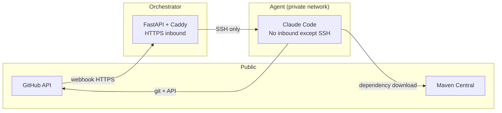

### 9.3 Guardrails

- `--max-turns 30` default to prevent runaway sessions
- Session auto-terminate after 2 hours of continuous activity
- Snapshot auto-cleanup: delete snapshots older than 14 days
- Concurrent server cap: configurable limit (default 3) to control Anthropic API spend
- All webhook payloads validated with HMAC-SHA256

**Parallel sessions**: The architecture is inherently parallel. Each session is an
independent server + snapshot + SQLite row. Multiple sessions can be ACTIVE simultaneously
(different tasks / different PRs), and the `ThreadList` sidebar lets the developer switch
between them. The concurrent server cap is purely a cost guardrail, not a design limitation.

---

## 10. Implementation Plan

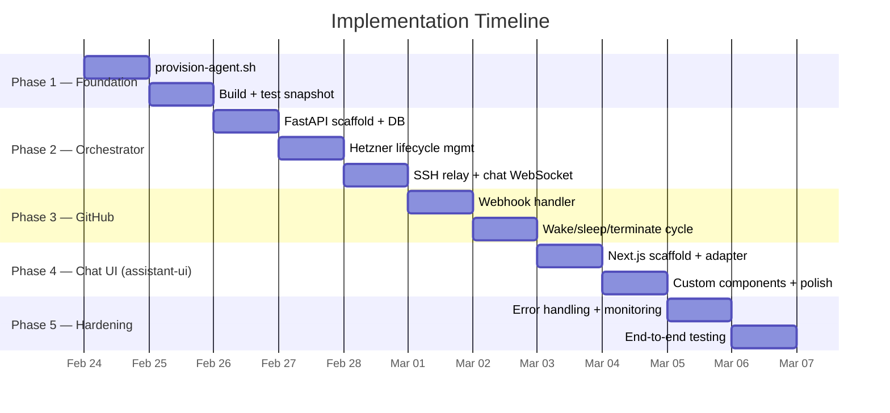

### Phase details

| Phase | Tasks | Effort |
|---|---|---|
| **1 — Foundation** | `provision-agent.sh`, build snapshot, verify Claude Code + `./mvnw` on CPX42 | 1–2 days |
| **2 — Orchestrator** | FastAPI scaffold, SQLite schema, Hetzner create/snapshot/delete, SSH exec, WebSocket chat relay, state machine | 2–3 days |
| **3 — GitHub** | Webhook receiver + HMAC, `@ytdb-agent` mention parsing, wake→prompt→push→sleep cycle, PR close handler | 1–2 days |
| **4 — Chat UI** | Next.js + assistant-ui scaffold, `ChatModelAdapter` WebSocket bridge, `ThreadList` integration, custom components (NewSession, CreatePR, StatusBadge, PrLink) | 1.5–2 days |
| **5 — Hardening** | Timeouts, stale snapshot cleanup, error recovery, logging, rate limits, e2e test | 1–2 days |
| **Total** | | **7–11 days** |

---

## 11. Future Enhancements (not in v1)

- **Live terminal view**: Stream raw terminal output alongside chat
- **Multi-model routing**: Use Haiku for simple questions, Opus for architecture decisions
- **Cost dashboard**: Real-time Anthropic API + Hetzner spend tracking
- **Integration test trigger**: Auto-run `./mvnw verify -P ci-integration-tests` before PR creation
- **Reviewer approval routing**: Forward CI failures to chat for interactive debugging
- **Snapshot warming**: Nightly cron to rebuild snapshot with latest `develop` + Maven cache
