# CI/CD Pipeline Diagram

```mermaid
flowchart TB
    subgraph triggers["Triggers"]
        push_develop["Push to develop"]
        pr_develop["PR to develop"]
        schedule["Daily Schedule<br/>(2:00 AM UTC)"]
        push_main["Push to main"]
        manual["Manual Dispatch"]
    end

    subgraph pr_checks["PR Validation Workflows"]
        direction TB
        block_merge["block-merge-commits.yml<br/>Reject merge commits"]
        check_prefix["check-commit-prefix.yml<br/>Verify YTDB-* prefix in commits"]
        pr_title["pr-title-prefix.yml<br/>Auto-add YTDB-* prefix to PR title"]
    end

    subgraph maven_pipeline["maven-pipeline.yml<br/>(develop branch)"]
        direction TB
        mp_test_linux["Linux Test Matrix<br/>JDK 21, 25<br/>temurin, oracle<br/>x86, arm<br/><i>Self-hosted Hetzner Runners</i>"]
        mp_test_windows["Windows Test Matrix<br/>JDK 21, 25<br/>temurin, oracle<br/><i>GitHub-hosted Runners</i>"]
        mp_coverage_gate["Coverage Gate<br/>coverage-gate.py (line + branch)<br/>85% Claude / 70% default<br/>PR comment"]
        mp_mutation["Mutation Testing<br/>PIT (unit tests only)<br/>85% kill rate<br/>PR comment"]
        mp_ci_status["CI Status Gate<br/>Single required check<br/>for branch protection"]
        mp_deploy["Deploy Maven Artifacts"]
        mp_annotate["Annotate Versions"]
        mp_notify["Zulip Notifications"]
        mp_test_linux --> mp_coverage_gate
        mp_test_linux --> mp_mutation
        mp_test_linux --> mp_deploy
        mp_test_windows --> mp_deploy
        mp_test_linux --> mp_ci_status
        mp_test_windows --> mp_ci_status
        mp_coverage_gate --> mp_ci_status
        mp_mutation --> mp_ci_status
        mp_deploy --> mp_annotate
        mp_deploy --> mp_notify
    end

    subgraph integration_pipeline["maven-integration-tests-pipeline.yml"]
        direction TB
        it_check["Check for Changes<br/>(Skip if already tested)"]
        it_test_linux["Linux Test Matrix<br/>JDK 21, 25<br/>temurin, oracle<br/>x86, arm<br/><i>Self-hosted Hetzner Runners</i>"]
        it_test_windows["Windows Test Matrix<br/>JDK 21, 25<br/>temurin, oracle<br/><i>GitHub-hosted Runners</i>"]
        it_merge["Merge develop → main<br/>(fast-forward only)<br/><i>skipped on manual dispatch</i>"]
        it_notify["Zulip Notifications<br/><i>skipped on manual dispatch</i>"]
        it_check --> it_test_linux
        it_check --> it_test_windows
        it_test_linux -->|" schedule only "| it_merge
        it_test_windows -->|" schedule only "| it_merge
        it_merge --> it_notify
    end

    subgraph main_pipeline["maven-main-deploy-pipeline.yml<br/>(main branch)"]
        direction TB
        main_deploy["Deploy Maven Artifacts"]
        main_annotate["Annotate Versions"]
        main_docker["Deploy Docker Images<br/>ubuntu-latest, ubuntu-24.04-arm"]
        main_notify["Zulip Notifications"]
        main_deploy --> main_annotate
        main_deploy --> main_notify
        main_docker --> main_notify
    end

    subgraph infrastructure["Shared Infrastructure"]
        direction TB
        maven_mirror["Maven Mirror<br/>maven.youtrackdb.io<br/>Reposilite + Caddy (Hetzner)"]
    end

    subgraph artifacts["Deployed Artifacts"]
        direction TB
        maven_dev["Maven Central<br/>X.Y.Z-dev-SNAPSHOT<br/>X.Y.Z-TIMESTAMP-SHA-dev-SNAPSHOT"]
        maven_release["Maven Central<br/>X.Y.Z-SNAPSHOT<br/>X.Y.Z-TIMESTAMP-SHA-SNAPSHOT"]
        docker["Docker Hub<br/>youtrackdb/youtrackdb-console<br/>youtrackdb/youtrackdb-server"]
    end

%% PR validation triggers
    pr_develop --> pr_checks
%% Main pipeline triggers
    push_develop --> maven_pipeline
    pr_develop --> maven_pipeline
    manual --> maven_pipeline
    manual --> integration_pipeline
    manual --> main_pipeline
    schedule --> integration_pipeline
    push_main --> main_pipeline
%% Pipelines use Maven mirror for dependency resolution
    mp_test_linux -.->|" dependencies "| maven_mirror
    mp_test_windows -.->|" dependencies "| maven_mirror
    it_test_linux -.->|" dependencies "| maven_mirror
    it_test_windows -.->|" dependencies "| maven_mirror
%% Pipeline to artifacts
    mp_deploy --> maven_dev
    main_deploy --> maven_release
    main_docker --> docker
%% Integration triggers main
    it_merge -->|" triggers "| push_main
%% Styling
    classDef trigger fill: #fff, stroke: #1565c0, stroke-width: 2px
    classDef pipeline fill: #fff3e0, stroke: #e65100
    classDef artifact fill: #fff, stroke: #2e7d32, stroke-width: 2px
    classDef validation fill: #e3f2fd, stroke: #1565c0
    classDef infra fill: #e8f5e9, stroke: #2e7d32, stroke-width: 2px
    class push_develop trigger
    class pr_develop trigger
    class schedule trigger
    class push_main trigger
    class manual trigger
    class maven_pipeline pipeline
    class integration_pipeline pipeline
    class main_pipeline pipeline
    class pr_checks validation
    class maven_dev artifact
    class maven_release artifact
    class docker artifact
    class maven_mirror infra
```

## Workflow Descriptions

### PR Validation Workflows

These workflows run on pull requests to ensure code quality and consistency:

#### block-merge-commits.yml

Rejects PRs that contain merge commits to enforce a linear commit history. Runs on PR open,
synchronize, and reopen events. If merge commits are detected, the check fails and prompts the
developer to rebase their branch.

#### check-commit-prefix.yml

Verifies that all commits in a PR contain the issue prefix from the PR title (e.g., `YTDB-123`).
This ensures traceability between commits and issues. Skips merge commits and provides instructions
for fixing commit messages if the check fails.

#### pr-title-prefix.yml

Automatically adds the issue prefix to the PR title based on the branch name. If the branch is named
`ytdb-123-feature-name` or `YTDB/123/feature`, the workflow extracts `YTDB-123` and prepends it to
the PR title if not already present.

### maven-pipeline.yml (Develop Branch)

This is the primary CI pipeline triggered on every push or pull request to the `develop` branch. It
uses a concurrency group (`cancel-in-progress: true`) to cancel redundant in-progress builds when
new commits arrive on the same PR or branch.

#### JOB 1-2: Test Matrix

Runs the full test matrix across multiple JDK versions (21, 25), distributions (temurin, oracle),
and platforms (self-hosted Linux x86/arm on Hetzner, GitHub-hosted Windows):

- **Linux (self-hosted)**: Unit tests (`package`) followed by integration tests (`verify` with
  Ekstazi for incremental test selection). Coverage data collected via JaCoCo on x86/JDK 21/temurin
  only.
- **Windows (GitHub-hosted)**: Unit tests only (`package`).

#### JOB 3: Coverage Gate (PRs only)

Enforces line and branch coverage thresholds on new/changed code using a unified script
(`.github/scripts/coverage-gate.py`) that:

- Parses `git diff` to identify changed lines in Java files.
- Reads JaCoCo XML reports (unit + integration tests) for line-level coverage data (`mi`/`ci` for
  instructions, `mb`/`cb` for branches).
- Merges coverage from multiple reports (takes max of covered values per line).
- Enforces both line and branch coverage against the threshold.
- Posts a PR comment with per-file tables of uncovered lines and uncovered branch lines, updating
  the same comment on each push.
- **Threshold**: 85% if any commit is co-authored with Claude Code, 70% otherwise. Detected by
  scanning commit messages for `Co-Authored-By:.*Claude`.

See [Test Quality Requirements](test-quality-requirements.md) for details.

#### JOB 4: Mutation Testing (PRs only)

Runs PIT mutation testing on new/changed production classes only:

- Detects changed modules and classes via `git diff` against the base branch.
- Compiles test classes for affected modules.
- Runs PIT's `mutationCoverage` goal with an 85% mutation kill rate threshold.
- Uses unit tests only; integration tests (`*IT`, `*IntegrationTest`) are excluded via the `mutation-testing` Maven profile.
- Posts a PR comment with per-class mutation kill rates, survived mutation lines, and detailed mutation descriptions (same pattern as the coverage gate comment).

See [Test Quality Requirements](test-quality-requirements.md) for details.

#### JOB 5: Deploy (push only)

On successful push (not PRs), deploys Maven artifacts with the `-dev-SNAPSHOT` suffix to Maven
Central. Each deployment is annotated with the exact version for traceability.

#### JOB 6: CI Status Gate

Consolidates results from all required jobs (test-linux, test-windows, coverage-gate,
mutation-testing) into a single required status check for branch protection. This job always runs
and reports success only when:

- All test and analysis jobs pass when a build is required.
- The build is correctly skipped when no build-relevant changes are detected.
- PR-only jobs (coverage-gate, mutation-testing) are allowed to be skipped on non-PR events.

Configure this as the single required status check in GitHub branch protection rules.

#### Notifications

Zulip notifications are sent on build failure and when a previously failing build is fixed (push to
main branches only).

### maven-integration-tests-pipeline.yml (Nightly / Manual)

This pipeline runs on a daily schedule (2:00 AM UTC) to execute comprehensive integration tests. It
first checks if there are new changes since the last successful run to avoid redundant testing.

**Infrastructure**:

| Platform | Runners | JDK Distributions | Maven Goal | Tests |
|----------|---------|-------------------|------------|-------|
| Linux (Hetzner) | Self-hosted on-demand | temurin, oracle | `verify` | Unit + Integration |
| Windows (GitHub) | GitHub-hosted | temurin, oracle | `package` | Unit only (disk limits) |

**Self-hosted Runners**:
- Managed by external [TestFlows GitHub Hetzner Runners](https://github.com/testflows/testflows-github-hetzner-runners) service
- Runners created on-demand when jobs queue (~1-2 min startup)
- Zero cost when no jobs running (no idle servers)
- Uses base Ubuntu images with setup scripts (Docker, Git, Node.js, firewall, Maven cache)
- APT, Maven, and npm caches persisted via Hetzner volume mounts (`volume-cache` label)
- See [TestFlows Runner Setup](testflows-runner-setup.md) for deployment details

**Job Flow**:
1. `check-changes` - Skip if current commit was already tested successfully
2. `test-linux` - Run full integration tests on self-hosted runners (8 jobs) with volume-mounted
   Maven cache
3. `test-windows` - Run unit tests only on GitHub-hosted runners (4 jobs)
4. `merge-to-main` - Fast-forward merge develop into main (schedule only, requires both Linux and
   Windows tests to pass)

Upon successful completion of all tests, it automatically merges `develop` into `main`
using fast-forward only, ensuring `main` always contains fully tested code.

**Manual Dispatch Mode**: When triggered manually via `workflow_dispatch`, the pipeline runs only the
tests without merging to `main` or sending Zulip notifications. This is useful for
validating changes before the nightly run or debugging test failures.

**Note**: Windows tests use `package` goal (unit tests only) instead of `verify` due to disk space
limitations on GitHub-hosted runners. Full integration tests run on Linux/Hetzner only.

### maven-main-deploy-pipeline.yml (Main Branch)

Triggered by pushes to `main` (typically from the integration tests pipeline merge), this pipeline
handles production-ready deployments. It deploys Maven artifacts without the `-dev` prefix to Maven
Central and builds/publishes Docker images for both `console` and `server` components to Docker Hub.
This ensures that `main` branch artifacts are always the stable, fully tested versions.

## Maven Mirror

All CI pipelines resolve Maven dependencies through a self-hosted Reposilite instance at
`maven.youtrackdb.io`, which proxies and caches artifacts from Maven Central. This avoids rate
limiting from Maven Central during parallel CI builds and improves dependency resolution speed.

- Runs on a Hetzner `cax11` ARM64 instance with a floating IP for stable DNS
- Caddy provides automatic TLS via Let's Encrypt
- Access requires authentication (`MAVEN_MIRROR_USERNAME` / `MAVEN_MIRROR_PASSWORD` GitHub secrets)
- Built from a Packer snapshot; see [maven-mirror setup](../.github/workflows/maven-mirror/maven-mirror-setup.md) for setup details

## TestFlows Runner Setup

Self-hosted runners for integration tests are managed by TestFlows GitHub Hetzner Runners, an
external orchestrator running on a dedicated small Hetzner server.

For complete setup and configuration instructions, see [TestFlows Runner Setup](testflows-runner-setup.md).

## Workflow Summary

| Workflow                                 | Trigger                      | Purpose                                                          | Infrastructure                                      | Artifacts                                                       |
|------------------------------------------|------------------------------|------------------------------------------------------------------|-----------------------------------------------------|-----------------------------------------------------------------|
| **block-merge-commits.yml**              | PR to any branch             | Reject merge commits in PRs                                      | GitHub-hosted runners                               | N/A                                                             |
| **check-commit-prefix.yml**              | PR to `develop`              | Verify commits have issue prefix                                 | GitHub-hosted runners                               | N/A                                                             |
| **pr-title-prefix.yml**                  | PR to `develop`              | Auto-add issue prefix to PR title                                | GitHub-hosted runners                               | N/A                                                             |
| **maven-pipeline.yml**                   | Push/PR to `develop`, Manual | Tests, coverage gate, mutation testing, deploy                   | Self-hosted (Linux) + GitHub-hosted (Windows)       | `X.Y.Z-dev-SNAPSHOT`, `X.Y.Z-TIMESTAMP-SHA-dev-SNAPSHOT`       |
| **maven-integration-tests-pipeline.yml** | Daily schedule (2 AM UTC)    | Run integration tests, merge to main                             | Self-hosted (Hetzner/Linux) + GitHub-hosted (Windows) | N/A (triggers main pipeline)                                    |
| **maven-integration-tests-pipeline.yml** | Manual dispatch              | Run integration tests only (no merge/notify)                     | Self-hosted (Hetzner/Linux) + GitHub-hosted (Windows) | N/A                                                             |
| **maven-main-deploy-pipeline.yml**       | Push to `main`, Manual       | Deploy release artifacts & Docker                                | GitHub-hosted runners                               | `X.Y.Z-SNAPSHOT`, `X.Y.Z-TIMESTAMP-SHA-SNAPSHOT`, Docker images |

## PR Quality Gates

Every pull request must pass all of the following before merging:

| Gate | Tool | Threshold | Scope |
|---|---|---|---|
| Line coverage | coverage-gate.py | 70% or 85% | New/changed lines |
| Branch coverage | coverage-gate.py | 70% or 85% | New/changed lines |
| Mutation score | PIT | 85% | New/changed production classes |
| Commit format | check-commit-prefix.yml | YTDB-* prefix | All commits |
| History | block-merge-commits.yml | No merge commits | All commits |

## Version Format

- **Timestamp format**: `YYYYMMDD.HHMMSS` (UTC) - enables chronological sorting
- **Example versions**:
    - develop: `0.5.0-20260123.143052-abc1234-dev-SNAPSHOT`
    - main: `0.5.0-20260123.143052-abc1234-SNAPSHOT`
