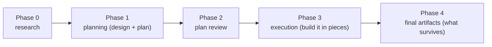

# Chapter 1 — The workflow at a glance

This project runs every non-trivial code change through a fixed sequence of steps: you research the problem, design and plan the change, get the plan checked, build it track by track, and write down what survives the merge. This chapter teaches that sequence and the one rule that holds it together: each step runs in its own session, with the context from the previous step cleared. You start here because nothing comes before it. By the end you will know the shape of a run and why it is shaped that way, which is what every later chapter builds on.

## The problem the workflow solves

Picture the same change handled two ways. In the first, an engineer reads a feature request, opens the files they think are involved, starts editing, and discovers halfway through that the design they assumed does not hold. They patch around it, the diff grows, and the reviewer who picks it up cannot tell which parts were planned and which were improvised. In the second, the engineer first writes down what they learned about the code, settles the design before touching it, breaks the work into reviewable pieces, and has each piece checked as it lands. The two reach the same feature; only the second leaves a record of why each decision was made and stays reviewable the whole way through.

The workflow is the machinery that makes the second way the default. It is a set of prose procedures in the YouTrackDB repository under `.claude/workflow/`, driven by a handful of skills, that take a change from the first request to a merged result. It exists because large changes made without a recorded design and a reviewed plan are slow to review and hard to trust. The procedures front-load the thinking, in the order research, then design, then plan, so that by the time code is written the hard questions are already answered and on the record.

A second pressure shapes the workflow as much as the first: an agent's attention is finite. The more unrelated material an agent is holding, the worse its judgment gets. A session that has just argued through a design and then starts writing code carries the design argument into the implementation, where it does not belong. The workflow's answer to both pressures is the same structure, which the rest of this chapter unpacks.

## A change moves through five phases

A change moves through five phases, numbered 0 through 4. Each phase has a job, and each finishes before the next begins.

*Phase 0, research.* Before planning anything, you explore the code and the problem and write down what you find. This is interactive: you answer questions, read the relevant classes, and record decisions as you reach them. The point is that the plan rests on a recorded pass through the code, not on a first guess.

*Phase 1, planning.* You turn the research into a design and then into a plan. For a change large enough to need one, the design is authored and reviewed first, then frozen; only after it is frozen is the plan derived from it. The plan names the pieces of work and the order they must land in.

*Phase 2, plan review.* Before any code is written, the plan is checked — against the design, against the actual code, and against itself for internal consistency. A plan that passes this gate is one you can build from without surprises.

*Phase 3, execution.* The work is built one piece at a time. Each piece is reviewed and broken into steps, each step is implemented, tested, and committed, then the finished piece is reviewed again. This is where the code is written, and it is the largest phase.

*Phase 4, final artifacts.* When all the work has landed, you write down what survives the merge: the durable design record and decision record for a large change, or a short summary for a small one. The working notes that tracked progress during the run are removed in the same pass.

**Figure 1.1 — The five phases a change moves through, in order.**

The phases run in order, and the line above is the happy path. A failed gate can send a change back to an earlier phase, and the full set of transitions, including those back-edges, is its own diagram later in the book. For now the linear shape is the model to carry: research, plan, review the plan, execute, close out.

## Two skills drive the phases

You do not invoke the phases by number. You run one of two skills, and each skill drives a contiguous run of phases.

The first skill, `/create-plan`, drives Phases 0 and 1. You run it when you start a change. It opens the research phase, helps you explore and record findings, and then, once you ask it to, turns those findings into a design and a plan. Its own description names the job: research the codebase and create an implementation plan with a design document and a decomposition of the work. Research and design authoring happen in the same session; the design freeze and the plan derivation happen across a session boundary, for a reason the next section explains.

The second skill, `/execute-tracks`, drives Phases 2, 3, and 4. You run it after the plan exists. On its first invocation it runs the plan review (Phase 2) automatically, then it builds the work piece by piece (Phase 3), and finally it produces the closing artifacts (Phase 4). You run `/execute-tracks` once per piece of work, re-running it each time the previous run finishes.

So the two entry points partition the five phases cleanly: `/create-plan` for everything up to and including the plan, `/execute-tracks` for everything from the plan review onward. Later chapters name the agent that drives each phase by its role — the *planner* in Phases 0 and 1, the *orchestrator* in Phases 2 through 4, and the *implementer* it hands code work to — so where this chapter says "the agent", read it as whichever of those is at the wheel.

## One session per phase

The rule that holds the whole structure together is that each phase runs in its own session, and the session is cleared at every phase boundary.

A session is one invocation of a skill. When a phase finishes, the session ends; you clear it and re-run the skill to start the next phase with a clean slate. This is not a formality. It is how the workflow keeps the context of one phase from bleeding into the next. The argument that settled a design must not color the plan derived from it, so the design freeze and the plan derivation sit on opposite sides of a session boundary. The reviewing of code must not be biased by the context of having just written that code, so review and implementation sit in separate sessions. Phase boundaries are mandatory session boundaries for this reason.

This raises an obvious question, and the workflow has an answer for it. If the session is cleared between phases, how does the next session know where the last one left off? The work writes its state to disk as it goes: a running ledger of which phase finished, plus per-piece progress notes. The next session reads that state at startup and resumes itself. You do not hand-carry context across the boundary; the on-disk record does. The mechanism that makes this reliable is a later chapter's subject.

## What to read next

You now have the shape of a run: five phases in order, two skills that drive them, and one session per phase so context never carries across a boundary. What you do not yet have is the feel of an actual change moving through that shape. [Chapter 2](02-minimal-change-end-to-end.md) supplies it. It walks one small change from the first request to the merge, through a short plan, the implement-test-commit loop, a review, and the close-out, at low altitude and without opening any phase in depth. Once you have a whole run in your head, the later chapters that open each phase will have somewhere to attach.

If all you need right now is to ship one small change, the short route is [Chapter 2](02-minimal-change-end-to-end.md) and then [Chapter 3](03-tiers-and-the-tier-gate.md), which teaches the tier gate that decides how much of the rest applies to your change. Come back for the deeper machinery when a change is large enough to need it.

## Further reading

- `.claude/workflow/workflow.md`: the execution workflow's overview and its terminology section, which give the five-phase shape and the one-session-per-phase rule.
- `.claude/workflow/conventions.md` (§1.1 Glossary): the closed definitions of *session*, *change tier*, *track*, *step*, and *episode* that the rest of the book builds on.
- `.claude/skills/create-plan/SKILL.md` and `.claude/skills/execute-tracks/SKILL.md`: the two entry-point skills. `/create-plan` drives Phases 0 and 1, `/execute-tracks` drives Phases 2 through 4.
