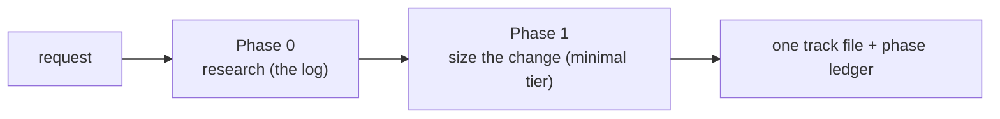
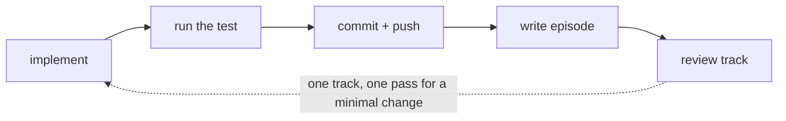

# Chapter 2 — A minimal change from start to finish

This chapter runs one small change all the way through the workflow, at low altitude, so the five phases stop being a list and become a shape you can hold in your head. You will not learn the internals of any phase here. You will learn what happens, in what order, from "I have a change to make" to "it is merged".

[Chapter 1](01-workflow-at-a-glance.md) gave you the map: a change moves through five phases (research, planning, plan review, execution, and final artifacts), and each phase runs in its own session so context never bleeds across a boundary. That map is abstract until you have walked it once. So before any phase is opened in depth, watch a single change travel the whole distance. The deep dives in later chapters will then have somewhere to attach.

## The change we will follow

Take a concrete, deliberately small change. A configuration default is wrong: the WAL segment size ships at a value that no longer matches how the engine is tuned, and the fix is to change one default and adjust the test that pins it. There is no new behavior to design, no API to shape, no second component to touch. It is the kind of change you would normally open an editor for, fix in two minutes, and push.

The workflow still applies. What it does with a change this small is shed almost all of its machinery and run a stripped path. The reason it sheds, a gate that sizes a change and decides how much workflow it earns, is [Chapter 3](03-tiers-and-the-tier-gate.md)'s subject. For now, take it on faith: because this change is tiny, with no design question and a single thread of work, it takes the lightest of the three tiers. The book calls that tier *`minimal`*. The rest of this chapter is what a `minimal` run looks like end to end.

## Phase 0 and Phase 1: research, then a short plan

You start the planning skill, `/create-plan`, and the first thing it does is not write anything. It researches. Phase 0 is an interactive pass where you and the agent establish what the change actually is: which file holds the default, what the current value is, why it is wrong, what the test pins, whether anything else reads that constant. The findings go into a *research log*, a durable record under the branch's workflow directory that every later phase can read. The log is the workflow's memory of why the change is shaped the way it is.

For our change the research is short. The default lives in one constant, one test asserts it, nothing else depends on the value. That is the whole picture, and it is recorded.

When you ask `/create-plan` to turn the research into a plan, it first sizes the change. It proposes a tier and waits for you to confirm it (`.claude/skills/create-plan/SKILL.md` Step 4 part 1). Our change has no design question and touches a single thread of work, so the proposal is `minimal`, and you confirm. The agent runs one adversarial pass over the research log as a gate (a quick read that looks for a hole in the reasoning before any code is planned), and then writes the plan.

Here is the first thing that surprises people. A `minimal` change has no separate plan document at all. Where a larger change produces a design, a plan, and a file per track, a `minimal` change produces exactly one file: a single self-contained *track* file describing the one thread of work (`.claude/skills/create-plan/SKILL.md` Step 4b, `minimal` branch). A track is the workflow's unit of executable work. A big change is decomposed into several tracks that run in dependency order; a `minimal` change is one track and nothing else. The branch's resume state (where the run is, what is done) lives in a separate append-only *phase ledger*, not in the plan, because there is no plan to hold it.

**Figure 2.1 — Phases 0 and 1 for a minimal change.** Research fills the log; planning sizes the change to the `minimal` tier and writes a single track file. No design document, no multi-track plan.

At the end of Phase 1 the skill opens a draft pull request for the branch (`.claude/skills/create-plan/SKILL.md` Step 5). It is a draft on purpose: CI does not run on draft PRs, and the draft is how teammates watch the change take shape. Every later commit gets pushed to it. You do not flip it to "ready for review" until the very end.

## Phase 2: a review of the plan, before any code

You clear the session and run the execution skill, `/execute-tracks`. It does not start implementing. The first thing it runs is a review of the plan itself (`.claude/workflow/workflow.md` § Terminology). The workflow checks the plan against the research and against the code before a single line is written, on the principle that a wrong plan caught here is cheap and a wrong plan caught after implementation is not.

For our one-line change this review is fast and almost always silent. The plan says "change this constant, fix this test", the research says the constant has one consumer, the code agrees, and there is nothing to escalate. The review passes, the session ends, and the run is ready to implement.

## Phase 3: implement, test, commit, review

You clear the session again and run `/execute-tracks` once more. Now it executes the one track. Even for a single track, execution has an inner shape worth naming, because it is the same shape every track follows at any size.

The agent makes the edit: it changes the default and updates the test that pins it. It runs the test to confirm the change does what the plan said. Then it commits, with a plain imperative message describing the change, and pushes to the draft PR (`.claude/workflow/commit-conventions.md` § Push every commit). Pushing every commit is deliberate: it keeps the draft PR in sync for teammates and means a lost laptop never costs you the work. That edit-test-commit rhythm is the heartbeat of the whole workflow, and you have just seen one beat of it.

Each unit of work also writes an *episode*, a short durable note of what was done and what was learned, into the track file. For our change the episode is one entry: the default moved, the test was updated, the test passed. The episode is what a fresh session reads to understand what already happened, since the session that did the work is gone by then.

After the work is implemented, the track is reviewed. The workflow runs a code review over the changes the track produced. For a change this small the review is light and turns up nothing, and the track is marked complete. Larger changes route a track through several specialized review agents at this point; that machinery is [Chapter 11](11-dimensional-review-agents.md)'s subject, and a `minimal` change barely touches it.

**Figure 2.2 — The execution beat for one track.** Implement, test, commit and push, record an episode, then review. Every track follows this shape; a minimal change runs it once.

## Phase 4: close it out and merge

You clear the session a last time and run `/execute-tracks`, which now finds every track complete and enters the closing phase. Phase 4 produces the durable artifacts that survive the merge and removes the scaffolding that does not.

For a `minimal` change there is little to produce. A larger change writes a design-final document and an architecture-decision record into a permanent `docs/adr/` directory; a `minimal` change earns none of that, because a small self-documenting PR is its own record (`.claude/workflow/workflow.md` § Final Artifacts). Instead, the workflow folds a two-line verdict summary into the PR description, then runs one cleanup commit that deletes the branch's entire workflow directory — the research log, the track file, the episode, all of it (`.claude/workflow/workflow.md` § Final Artifacts). What remains on the branch is the code change and the test, which is exactly what should land in the main branch when the PR is squash-merged.

The workflow stops there. It does not flip the PR to "ready for review" — you do that yourself, once you are satisfied. The run is over: a wrong default is now a right default, with a test that proves it, and a clean PR ready to merge.

## What you now have

You have watched a whole run. A request became a recorded research pass, then a sized plan, then a reviewed plan, then an implemented-and-tested track committed beat by beat to a draft PR, then a closed-out merge. You have met the words the rest of the book will define properly (research log, tier, track, episode, phase ledger, draft PR) by seeing the job each one does. None of them is yet defined in depth, and that is intentional.

The one thing this run took on faith is the decision that made it so light: why a one-line change sheds almost all the machinery while a durability rework keeps it. That decision is the *tier gate*, and it runs before any of the phases you just watched. [Chapter 3](03-tiers-and-the-tier-gate.md) opens it: the two questions the workflow asks about a change, and how their answers route it to the `full`, `lite`, or `minimal` tier — so that by the end of it you can place your own change in a tier and predict which of the later chapters apply to it.

## Further reading

- `.claude/workflow/workflow.md` — the session lifecycle, the five-phase terminology, and the per-tier final artifacts (§ Terminology: Phases 0/1/2/3/4 vs Phases A/B/C, § Final Artifacts (Phase 4)).
- `.claude/skills/create-plan/SKILL.md` — Phase 0 research and the Phase-1 tier classification and `minimal`-tier authoring (Step 4 parts 1–3, Step 4b, Step 5 for the draft PR).
- `.claude/skills/execute-tracks/SKILL.md` — how the per-phase execution sessions start, route, and end.
- `.claude/workflow/commit-conventions.md` — the commit-and-push rhythm (§ Push every commit).
