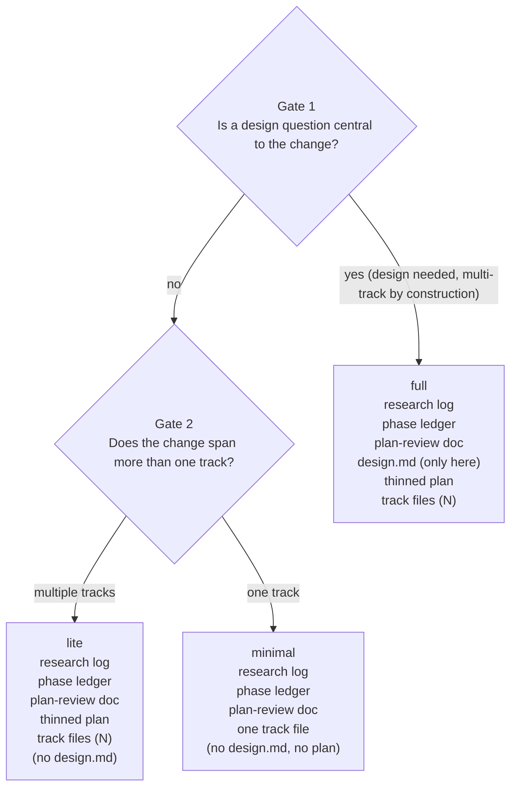

# Chapter 3 — Tiers and the tier gate

Two questions decide how much of the workflow your change runs: is a design question central to it, and does it span more than one track? Their answers route the change to one of three *tiers*, `minimal`, `lite`, or `full`, and the tier fixes which artifacts you produce and which later chapters apply to you. The change you followed in Chapter 2 ran at the `minimal` tier: no design document, no separate plan, one self-contained track file. This chapter explains why it was minimal, and how to place your own change.

In Chapter 2 you watched a one-line change go from request to merge without ever opening a design document or writing a multi-track plan. That was not an accident of size; it was a routing decision the workflow made at the very start, before any planning artifact was written. The same two questions would have routed a concurrency rework or a public-API change down a longer path. Once you can answer them for your own change, you know which of Chapters 4 through 16 you will actually run.

## The minimal run, revisited

Start from what you already saw. The Chapter 2 change had no architectural question to settle (the fix was obvious once located), and it touched a single, independently mergeable slice of the code. Because of those two facts, `/create-plan` proposed the `minimal` tier, and the run shed almost everything: no `design.md`, no `implementation-plan.md`, just one track file carrying the whole change, plus the bookkeeping every run keeps.

That shedding is the point of tiers. A one-line fix should not pay the ceremony a durability rework needs, and a durability rework should not be allowed to skip it. The workflow decides the ceremony level up front, from the research it just did, and records the decision so every later session honours it. The mechanism is the *tier gate*: two yes/no questions asked at the boundary between research (Phase 0) and planning (Phase 1), proposed by the agent and confirmed by you. The gate lives in `planning.md` (§Tier classification), and `/create-plan` asks it in Step 4, after research is rich enough to answer it.

## Gate 1: is there a design question?

The first question is whether the change needs a design document. A `design.md` is the long-form artifact — class diagrams, workflow diagrams, dedicated sections for the parts that are hard to get right. Authoring and reviewing one is real work, so the gate asks for it only when the change genuinely turns on a design decision.

"Genuinely" has a precise test. Gate 1 answers yes only when one of seven categories is *central to the change's purpose*, not merely brushed by one incidental edit. The seven, quoted verbatim from `risk-tagging.md` (§Gate 1 reuse), are `Concurrency`, `Crash-safety / Durability`, `Public API`, `Security`, `Architecture / cross-component coordination`, `Performance hot path`, and `Workflow machinery`. A mostly-mechanical change that happens to touch one risky line does not flip Gate 1 to yes; the category has to be what the change is *about*. A storage rework whose core problem is crash recovery is a yes. A rename that incidentally edits a concurrent class is a no.

This list is not invented for the gate. The same seven categories drive the per-step risk tagging you will meet in Chapter 9, where they are read at the level of one step rather than the whole change. One source of truth, read at two granularities: the gate reads it at the change level (is this category central to the whole change?), risk tagging reads it per step (does this step touch the category?). The agent proposes which categories it sees as central, and you confirm — this is a human gate on a decision that determines how much work the change will cost, so it never proceeds without your sign-off. You can also add or drop an adversarial review lens at this point, which is why the confirmed categories matter beyond the gate itself.

## Gate 2: how wide is the change?

The second question is about scope: does the change span more than one track? A *track* is one pull-request-sized unit of work — it builds on the tracks before it, stands alone as an independently reviewable and mergeable diff, and carries as much of the change as one reviewable diff holds (the sizing rule is in `planning.md` §Track descriptions). A change that fits in one such unit is single-track; a change that needs several stacked, dependency-ordered units is multi-track.

Gate 2 is an estimate at this stage, made before the work is decomposed into steps. That is deliberate: you are sketching the shape of the change, not committing to a task graph. If the estimate turns out wrong mid-execution, say a single track balloons past what one diff should hold, the workflow upgrades the tier in flight rather than forcing you to have guessed right. Chapter 14 covers that upgrade path; for now, treat Gate 2 as your best read of the change's width given what research uncovered.

The two gates are orthogonal, but they do not produce four tiers. A change with a central design question is multi-track by construction: a problem worth a design document is not a single-track stub. So the design-yes-single-track corner is unreachable, and the two yes/no axes collapse to three live tiers.

## Three tiers, and what each sheds

The three reachable tiers fall straight out of the two answers.

- **`minimal`**: no design question, single track. The lightest path: one self-contained track file is the whole change. This is the Chapter 2 run.
- **`lite`**: no design question, multiple tracks. No design document, but a thinned plan coordinates the several tracks.
- **`full`**: a central design question (so, multi-track). The heaviest path: a reviewed, frozen `design.md` seeds a thinned plan and the track files.

What separates them is which artifacts they produce. Three artifacts are universal — every tier writes them, because the machinery that resumes and reviews a run depends on them:

- the **research log** (`research-log.md`), the decision ledger Phase 0 fills, which you meet in Chapter 4;
- the **phase ledger** (`phase-ledger.md`), the append-only event log that records where a run is so a fresh session can resume it, which you meet in Chapter 7;
- the **plan-review document** (`plan-review.md`), the Phase 2 audit summary, which you meet in Chapter 8.

Two artifacts are tier-dependent, and they are what the lighter tiers shed. The **plan** (`implementation-plan.md`) appears in `lite` and `full` but not `minimal`: a one-track change has nothing to coordinate across tracks, so the plan would just mirror the single track file, and the phase ledger already holds the resume state a plan used to carry. The **design document** (`design.md`) appears only in `full`: it exists exactly when Gate 1 said the change needs one.

Table 3.1 is the authoritative per-tier artifact set, drawn from `conventions.md` (§Per-tier artifact set).

**Table 3.1 — what each tier produces.**

| Artifact | `minimal` | `lite` | `full` |
|---|---|---|---|
| Research log | yes | yes | yes |
| Phase ledger | yes | yes | yes |
| Plan-review document | yes | yes | yes |
| Plan (`implementation-plan.md`) | — | yes (thinned) | yes (thinned) |
| Track files | yes (one) | yes (N) | yes (N) |
| Design document (`design.md`) | — | — | yes |
| Phase 4 durable carrier | PR-description summary | `adr.md` | `design-final.md` + `adr.md` |

The last row is the artifact that survives the merge. The lighter the tier, the lighter what it leaves behind in `develop`: a `minimal` change folds its record into the pull-request description, `lite` writes a short `adr.md`, and `full` keeps both a `design-final.md` and an `adr.md`. Chapter 13 covers that closing step; the row is here so you can see the shedding runs end to end, not just at planning time.

The figure below shows the routing as one decision tree, with each tier's artifact set hanging off its leaf.

**Figure 3.1 — the tier gate: two questions route a change to a tier.**

One thing the table does not capture, and the figure does: `full` is reached by a single `yes` to Gate 1, while `lite` and `minimal` are split apart by Gate 2 only after Gate 1 says `no`. A design-needing change never reaches Gate 2, because it is multi-track by construction. The tree makes that asymmetry visible.

## Three vocabularies that do not collide

One caution before you carry the word "tier" into the later chapters. The workflow uses three small classification scales, and they share no terms on purpose, so they never get confused for one another.

The *change tier* (`full`, `lite`, `minimal`) is the one this chapter teaches: a change-level decision about ceremony, made once at planning time. A second scale is the per-step *risk tag* (`low`, `medium`, `high`), applied to each step during execution (Chapter 9) to decide whether that step gets its own dimensional review. (A third scale, a step-count axis that once picked the pre-execution review panel, was retired when the change tier took over that job; the Further reading points at where its history is recorded.) Two distinct word sets for two distinct live decisions. When a later chapter says "tier", it means the change tier from this gate, and nothing else.

## Where this leaves you

You can now place your own change. Ask the two questions: is one of the seven categories central to it, and does it span more than one track? The answers name your tier, and the tier names which of the remaining chapters you run. A `minimal` change skips the design and planning machinery entirely and goes almost straight to the implement-test-commit loop. A `full` change runs everything.

The two lighter tiers are defined by what they shed, and what they shed is the work of the `full` tier: the research-backed design and the derived plan. That work is the subject of Part III. Chapter 4 opens Phase 0 — the research log and the interactive exploration that fills it, the recorded pass that planning rests on instead of a first guess. Chapter 5 then opens Phase 1's design document, the artifact Gate 1 decides you need. The question this chapter sets up is the one those chapters answer: when a change does carry a central design question, how does the workflow turn it into a frozen design and a plan that survives review?

## Further reading

- `.claude/workflow/planning.md` (§Tier classification): the two gates, the collapse to three tiers, and the per-tier Phase-1 flow.
- `.claude/workflow/conventions.md` (§Per-tier artifact set, §1.1 glossary): the authoritative artifact table and the `Change tier` / `Phase ledger` definitions.
- `.claude/workflow/risk-tagging.md` (§Gate 1 reuse): the seven categories and the change-level-versus-per-step reading.
- `.claude/workflow/conventions-execution.md` (§2.4) and `.claude/workflow/track-review.md` (§Tier-driven review selection): the retired Simple / Moderate / Complex axis and its replacement by tier-driven selection.
- `.claude/skills/create-plan/SKILL.md` (Step 4): how `/create-plan` asks the gate and waits for your confirmation.
