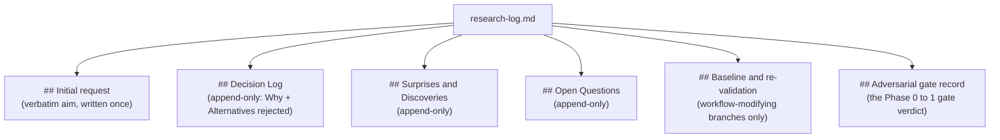
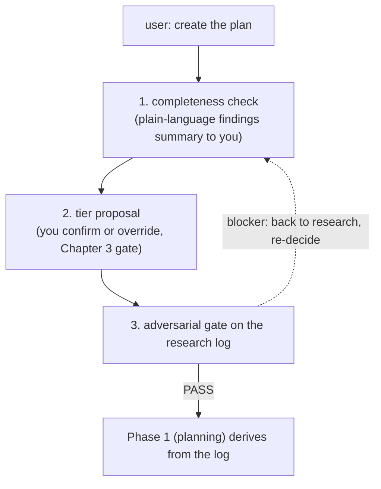

# Chapter 4 — Phase 0: research before you plan

Planning rests on a recorded research pass, not on a first guess. Before you write a single track or design line, you and the agent spend a phase exploring the change: reading the code it touches, weighing alternatives, settling the decisions a plan will rest on. That phase is Phase 0, and its one durable output is a file called the *research log*. This chapter teaches what goes into that log, how the conversation fills it, and why you never see it during the conversation that produces it.

You already have the shape of a run from [Chapter 1](01-workflow-at-a-glance.md): a change moves through research, planning, plan review, execution, and final artifacts, one phase per session. [Chapter 3](03-tiers-and-the-tier-gate.md) gave you the tiers (`full`, `lite`, `minimal`) and the gate that sorts a change into one of them. Phase 0 comes before that gate fires. The research log it writes is the same in every tier, because the tier is not chosen until research ends. So this is the one phase that runs identically whether your change is a one-line fix or a durability rework.

## You run `/create-plan` and the agent asks what you want

Phase 0 starts when you run `/create-plan`. The agent reads its workflow documents, then stops and asks you one thing: what is the aim of this change? It does not start exploring, does not propose an approach, does not write anything until you answer. This is deliberate. The aim you give is the anchor everything downstream verifies against, so the agent captures it before it forms any opinion of its own.

When you answer, the agent writes your words down verbatim, and that first write is the start of the research log. From there the session becomes a conversation you drive: you ask questions about the codebase, request that the agent trace a call chain or read a particular module, ask it to look up an external library or algorithm, and steer toward the parts of the system the change will touch. The agent answers, explores, and presents what it finds. It does not steer you toward planning. Research ends only when you explicitly ask for it to — "create the plan", "let's plan this", "proceed to planning". Until you say one of those, the agent stays in research mode.

The reason for the explicit hand-off is the same reason the agent waits for the aim before exploring: the boundary between research and planning is a decision you own, not one the agent guesses at. A premature jump to planning bakes in a half-formed understanding. Holding the line until you call it keeps the exploration as long as the change needs and no longer.

## The research log is the durable memory of that conversation

A conversation lives in context, and context does not survive a session boundary. The workflow runs one phase per session and clears between them ([Chapter 1](01-workflow-at-a-glance.md)), so anything that matters past the end of Phase 0 has to be written down. That is what the research log is for. It is a file on disk at `_workflow/research-log.md`, inside the plan directory the workflow creates for your change. It captures the verbatim aim plus the decisions, surprises, and open questions you and the agent settle, so the record survives a `/clear` and crosses the Phase 0 to Phase 1 boundary instead of evaporating with the conversation.

Call it what the workflow calls it: a *decision ledger*, not a plan and not a design. It records what was decided and why, in the order it was decided. The planning that follows reads this ledger and builds on it. The agent's memory of the conversation is not the source of truth for what was decided; the log is. That distinction is the whole point — it is the difference between a plan that rests on a written record and one that rests on whatever the agent happens to recall after the context is wiped.

The log has six sections, each with a defined job.

- `## Initial request` holds the verbatim aim, written once, at the moment you give it. It is a plan-at-start anchor, not an append log: a later session reads it instead of re-asking you what the change was for.
- `## Decision Log` is append-only. One entry per decision you and the agent settle, each carrying a `**Why:**` field and an `**Alternatives rejected:**` field. Those two fields are not decoration — a later gate challenges them directly, so a decision recorded without its rationale and its rejected alternatives is a decision that will not survive review.
- `## Surprises & Discoveries` is append-only. Codebase realities that contradicted an assumption, constraints you did not expect, anything the exploration turned up that the plan needs to account for.
- `## Open Questions` is append-only. Questions you could not resolve during research, carried forward so planning does not silently drop them.
- `## Baseline and re-validation` is filled **only** on a workflow-modifying branch — a change to the workflow machinery itself, which needs a rebase-drift anchor an ordinary change does not. On any other branch this section is omitted.
- `## Adversarial gate record` holds the verdict of the gate that runs at the end of Phase 0 (the next section). It is the gate's durable on-log record, distinct from the throwaway review files the gate also writes.

Each entry in the three continuous logs carries an ISO timestamp and a context-level tag, the same `[ctx=<level>]` convention episodes use elsewhere in the workflow, so a resumed session can read both what was decided and when. The log is append-only through Phase 0, and it keeps accepting appends into Phase 1: a load-bearing decision that surfaces while the design is being authored is appended here and re-triggers the adversarial gate, rather than being slipped quietly into the design.

**Figure 4.1 — The six sections of the research log.** One verbatim anchor, three append-only continuous logs, one branch-conditional section, and the gate's verdict carrier.

## The log is opaque to you during Phase 0

Here is the part that surprises new readers: you never see the research log during the research conversation. The agent maintains it silently. It does not narrate writing to it, does not name its sections, does not cite decision numbers, and does not quote the `**Why:**` or `**Alternatives rejected:**` fields back to you. The log is the agent's internal memory. Everything that reaches you reaches you as plain conversational prose.

So when the agent settles a decision with you, it acknowledges the decision in ordinary language and then, privately, appends a structured entry to the log. When it surfaces a finding, you get the finding, not a quote from the surprises section. The structure of the log stays out of the conversation entirely.

This is a recent and deliberate change to the workflow, made on the commit this book is pinned to. The reason is readability. A research conversation should read like a conversation — questions, findings, trade-offs in plain English. Splicing in section names, decision IDs, and bracketed rationale fields turns a discussion into a status dump and slows the reader who is trying to think about the change, not about the bookkeeping. The log is bookkeeping. It is load-bearing bookkeeping, because it is what carries decisions across a `/clear`, but it is the agent's bookkeeping, and the workflow keeps it where it belongs.

There is exactly one sanctioned moment where the log's contents get a structured recap, and even that recap is plain language rather than log quotes: the findings summary at the transition to Phase 1, which the next section describes. Surfacing a finding, a blocker, or a gate verdict to you is never a "recap of the log" in the sense the rule forbids — those stay permitted, because they are the substance of the work, not a readout of the agent's filing system.

## When you ask to plan, the log is gated before anything derives from it

When you say "create the plan", Phase 0 does not flow straight into writing artifacts. Three things happen at the Phase 0 to Phase 1 boundary, in order, before any plan or design line is authored.

First, the agent does a quiet completeness check of its own log against the conversation, appending anything that was settled but not yet written down. The user-facing output of this check is a plain-language summary of the findings — the one sanctioned structured recap mentioned above. It is a summary of what was learned and decided, not a tour of the log's sections.

Second, the agent proposes a tier. This is the tier gate from [Chapter 3](03-tiers-and-the-tier-gate.md), run against the now-complete log: does the change need a design document, and does it span multiple tracks? The proposal comes to you for confirmation, and you can override the tier or adjust the review lenses before it proceeds.

Third, and this is the part that makes Phase 0 more than note-taking, the workflow runs an *adversarial review* on the research log as a gate. A reviewer reads the log and attacks the decisions: are the `**Why:**` fields actually load-bearing, are the rejected alternatives genuinely worse, is anything assumed that the exploration never verified? Because the research log is the one artifact present in every tier, the gate runs on the log itself rather than on a tier-specific document. That is why the log carries its `**Why:**` and `**Alternatives rejected:**` fields in the structured form it does: those fields exist to be challenged here.

**Figure 4.2 — The Phase 0 to Phase 1 boundary.** The agent completes the log, proposes a tier, then gates the log adversarially before any artifact derives from it.

The gate is a gate, not advice. A blocker sends the decision back to research to be re-decided, and the gate loops — the reviewer re-runs after the log is revised, until no blocker remains. A weaker finding still gates: the log's rationale has to strengthen before the gate clears. There is no skip. The loop is bounded (three iterations by default), and if it exhausts with findings still open, the decision comes to you: accept the risk, revise, or abandon the change. The gate never spins forever on a contested decision, and it never lets a poorly-justified decision through unchallenged. Each pass writes its verdict into the log's `## Adversarial gate record` section, which is the durable record later phases read to confirm the gate cleared.

## What the log is to the phases after it

Once the gate clears, planning derives from the log, and the log's role narrows. It is read for decision content in exactly two places, when Phase 1 authors its artifacts (seeding them from the log) and when the Phase 2 plan review cross-checks against it, and it is never linked from the artifacts it seeds. Once a track absorbs one of the log's decisions as its own inline record, the track becomes the authority and the log becomes historical provenance. The log itself does not survive the merge: it is removed in the Phase 4 cleanup along with the rest of the working directory, so any audit trail that has to outlive the branch is folded into a durable artifact, not left in the log.

You finish Phase 0 with a research log that captures the aim, every settled decision and its rationale, the surprises the exploration turned up, the questions still open, and a cleared adversarial gate. That is the recorded research pass planning rests on. The next chapter picks up where the gate left off: in the `full` tier, Phase 1 authors a *design document* from this research before any plan exists, and a discipline called `edit-design` gates every change to it. The question [Chapter 5](05-phase-1-design-document.md) answers is how a design gets written, reviewed, and frozen — so the plan that follows derives from something fixed.

## Further reading

- `.claude/workflow/research.md` — Phase 0 in full: the research log's six sections and append cadence (§The research log), the interactive exploration loop (§How it works), the opacity rule and its rationale (§Rules, the *Keep the research log agent-internal* rule), and the Phase 1 transition (§Transition to Phase 1).
- `.claude/skills/create-plan/SKILL.md` — how Phase 0 runs inside `/create-plan`: the aim prompt and log seed (Step 2), research mode (Step 3), and the three-part tier-classify-and-gate transition (Step 4).
- `.claude/workflow/conventions.md` — the **Research log** glossary entry.
