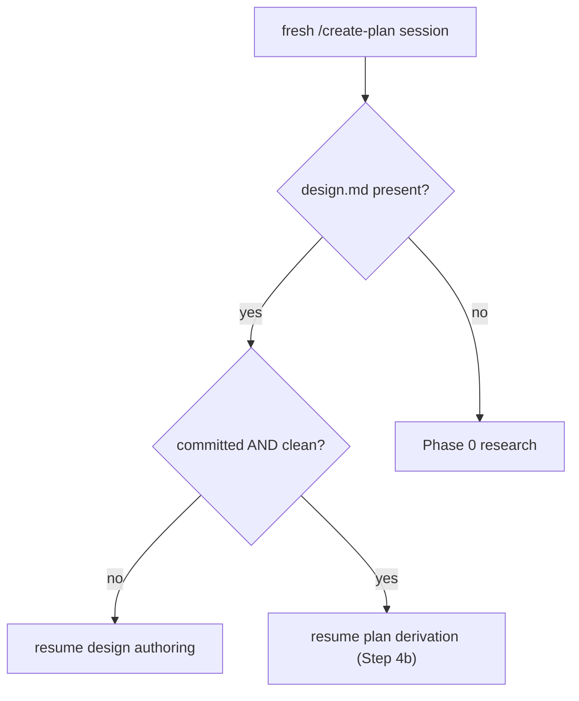
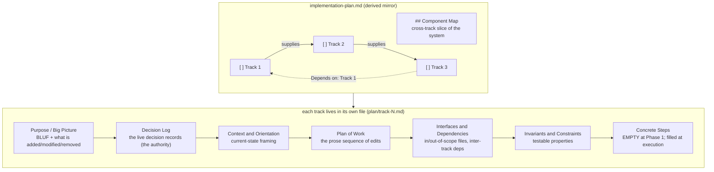

# Chapter 6 — Phase 1: from a frozen design to a plan and tracks

The plan is *derived* from the frozen design, not written from a blank page. You start a fresh `/create-plan` session, the workflow notices a committed design and no plan, and it turns the design into a list of dependency-ordered *tracks* with a thin cross-track summary on top. The plan that comes out holds no fact the tracks do not already own. This chapter teaches that derivation, the plan-and-track structure it produces, and why the plan mirrors the tracks instead of being authored directly.

Chapter 5 left you with a design document that is reviewed, committed, and frozen: a stable seed that no longer moves under you. That freeze is the precondition for everything here. A plan derived from a design that is still being edited would chase a moving target, so Phase 1 splits in two. The design is authored and reviewed in one session and frozen when its review passes; the plan derives from that frozen seed in a separate session. This chapter picks up at the freeze and follows the second session through to a plan, a set of track files, and the cold-read that checks them before they persist.

## A fresh session that resumes itself

When the design freezes, the session that wrote it ends. It does not roll straight into planning. You commit the frozen `design.md`, the session closes, and plan derivation waits for a new one.

You start that new session the same way you started the first: a fresh Claude Code session running `/create-plan`. Nothing in the command says "now derive the plan." Instead, the startup protocol checks what is already on disk and routes itself. It looks for two files under the branch's `_workflow/` directory: the design document and the implementation plan. When `design.md` is present and `implementation-plan.md` is not, the design seed exists but the plan has not been derived yet, so the protocol resumes directly into plan derivation. It skips the aim prompt and the Phase 0 research loop entirely, because the aim and the research are already captured in the frozen design and the conversation that produced it.

Presence alone is not the test. `edit-design` writes `design.md` to disk before its review has passed, so a session interrupted between the write and the review would leave an unreviewed file on disk that looks frozen but is not. The protocol guards against this by checking that the design is *committed and clean*, not merely present: at least one commit touches `design.md`, and `git status` reports no uncommitted changes to it. A committed, clean design is the on-disk proxy for "reviewed and frozen," because the workflow commits a design only after its review passes. A design that is on disk but uncommitted or dirty routes back to finish authoring instead, so an interruption mid-review never derives a plan from an unreviewed design.

**Figure 6.1 — How a fresh `/create-plan` session routes itself after the design freezes.** Presence of `design.md` alone is not enough; only a committed, clean design resumes plan derivation.

## Why the plan is derived, not written

The natural instinct is to open the plan file and write it. The workflow forbids that. The plan is a *derived mirror*: a cross-track summary that holds no fact the track files do not already own. The decisions, the invariants, the file boundaries, the rationale all live in the tracks. The plan carries only what a fresh execution session needs to pick up the next piece of work and judge how one piece affects another.

The reason is single-source-of-truth. A fact written in two places drifts: you fix it in one and forget the other, and a reader cannot tell which copy is current. The workflow puts the live truth in the track file and lets the plan reflect it. A track's *Decision Log* carries the full inline decision records the track realizes; in the `full` tier those records are seeded from the frozen design, but once a track absorbs a decision the track becomes the authority and the design is historical provenance. The plan never holds a decision record at all. It would only be a stale copy.

What the plan does carry is deliberately thin. It has a `## Checklist` that lists the tracks in order, each with a one-paragraph intro and a scope line, and a thin cross-track *Component Map* that shows the slice of the system the whole change touches. That is the cross-track view: enough for an execution session to see the shape of the work and assess how a change in one track ripples into another, without duplicating the per-track detail. Older versions of the workflow kept more in the plan. The goals, the constraints, and the full architecture notes moved out, into the track files, the research log, or the pull-request description.

## Tracks: the units the work splits into

A *track* is one pull request in a stacked series. It builds on the tracks before it, stands alone as an independently reviewable and mergeable unit, and carries as much of the change as one reviewable diff holds. Decomposing the change into tracks is the heart of Step 4b: you read the frozen design, build a mental model of the part of the codebase it touches, and cut the work into these stacked, reviewable pieces.

You size a track by its planned file footprint, not by how many steps it will take. The footprint is the count of distinct files the track changes, knowable at plan time from the files the track names. The rule is to *maximize first*: extend a track up to a soft ceiling of roughly twenty to twenty-five in-scope files, packing in self-contained units of work whether or not they are thematically related, and open a new track only when the next unit would breach the ceiling or break the track's independent mergeability. The reason to pack rather than split is cost. Each track pays a fixed tax at execution: a review-and-decomposition pass, an implementation pass, a code review, and the session boundaries between them. Fewer, fuller tracks pay that tax fewer times. A track that falls below roughly twelve files and could fold into a neighbor is a candidate to merge; a track over the ceiling is a candidate to split. Both bounds are soft, and a track that sits outside them passes planning as long as its track file records why.

Tracks are *dependency-ordered*. You order them so that an earlier track never depends on a later one, and you annotate each dependency with a `> **Depends on:** Track N` line in the plan. When the ceiling forces a cut, you prefer to cut along a dependency boundary, because that is the seam where the two pieces are already most separable. The result is a directed acyclic order: Track 1 supplies what Track 2 needs, Track 2 supplies what Track 3 needs, and the execution sessions later walk the tracks in that order, carrying forward what each one learned.

**Figure 6.2 — A plan lists tracks; each track lives in its own file. The plan is a thin mirror; the track files hold the load-bearing detail. The step roster is empty until execution.**

## What a track file holds, and what it leaves for later

The track files are created during Phase 1, alongside the plan. A track file is not a stub. Step 4b writes its narrative sections in full: a `## Purpose / Big Picture` that opens with a one-line summary and names what the track adds, modifies, and removes; a `## Context and Orientation` that frames the current state of the code the track will change; a `## Plan of Work` that gives the prose sequence of edits and the ordering constraints; and an `## Interfaces and Dependencies` that draws the in-scope and out-of-scope file boundaries and records which tracks supply prerequisites and which consume this track's output. It also fills the `## Decision Log` with the track's inline decision records and a combined `## Invariants & Constraints` section with the testable properties the track must preserve, each of which becomes a test assertion later.

One section stays empty: `## Concrete Steps`, the per-step roster. A *step* is the unit a track is broken into for implementation, the smallest piece that gets written, tested, and committed on its own. Step decomposition is *deferred to execution*. At Phase 1 the roster is blank, and the track instead carries a scope indicator, a single `> **Scope:** ~N files covering X, Y, Z` line, a rough sketch of the work rather than a tactical commitment. The reason to wait is context. The agent that decomposes a track into steps does it just before implementing that track, when it has the most codebase knowledge, including everything the earlier tracks turned up. A step roster written at plan time, before any code has been touched, would be a guess. So Phase 1 commits to the tracks and their dependencies, which are strategic and hard to change, and leaves the steps, which are tactical and cheap to adapt, for the session that will actually run them. What a step produces when it runs, and how the implement-test-commit loop drives it, is Chapter 10's subject.

## Before they persist: the cold-read

Step 4b does not commit the plan and track files the moment they are written. First it runs a *cold-read*: it spawns a reviewer that reads the track sections with no prior context and asks two questions. Can a fresh reader build a working mental model of the change from these sections alone? And does every load-bearing decision from the research log appear, absorbed, in the right track's Decision Log? In the `full` tier the cold-read also checks that each track's records stay faithful to the design seed they derive from. A blocker reopens derivation in the same session, and the loop runs a bounded number of times before escalating to you. Once the cold-read passes, the written plan and tracks are presented for your confirmation before they persist.

## The lighter tiers shed the plan

Everything above is the `full`-tier path: a frozen design, a separate derivation session, a multi-track plan, track files seeded from the design. Chapter 3 taught that the tier decides how much of this you run, and the two lighter tiers shed parts of it.

In the `lite` tier there is no design document, so there is no session boundary and no auto-resume into a second session. Step 4b runs in the same Phase 1 session that classified the tier, and the carriers seed from the research log directly instead of from a frozen design. You still get a derived-mirror plan and multiple track files; you just author them in one sitting. In the `minimal` tier there is no plan at all. A minimal change is single-track by definition, and a one-track plan would mirror a single track and add nothing, so the workflow drops the plan and writes one self-contained track file that carries the whole change. The resume state that the plan would have anchored lives instead in the phase ledger, which is present in every tier.

## What this chapter set up

You now have the second mental model of Phase 1. The first, from Chapter 5, was the frozen design. The second is the plan-and-track structure that derives from it: a plan that lists dependency-ordered tracks and mirrors them without owning any fact, and track files that hold the live decisions, the narrative, and a step roster left empty until execution. You also saw the routing that makes the second session resume itself, and the per-tier differences that drop the design, the second session, or the plan entirely.

That routing raised a question this chapter only gestured at. The startup protocol read what was on disk and decided which phase to resume; it could tell a frozen design from an unreviewed one and a derived plan from a missing one. How does the workflow know, across a session that was cleared or a machine that crashed, exactly where it is and what to do next? That is the phase machine and the ledger that records its state, and it is the subject of Chapter 7.

## Further reading

- `.claude/workflow/planning.md` — Phase 1 in full: the tier-adaptive flow and the design-first split (§Goal, §Tier classification), the plan file structure and what each artifact is (§Plan file structure), the derived-mirror disposition of the old architecture-notes parts (§Architecture Notes format), and the track sizing rule with the footprint bounds and dependency-cut preference (§Track descriptions).
- `.claude/skills/create-plan/SKILL.md` — how `/create-plan` runs Step 4b: the tier-aware resume check that routes a fresh session (Step 1c), the design-to-plan session boundary and auto-resume condition (Step 4a/4b preamble), and the derivation procedure with the track-section cold-read (Step 4b, items 1–9).
- `.claude/workflow/conventions.md` — the derived-mirror plan shape (§Plan file content), the 15-section track-file shape (§Track file content), the per-tier artifact set (§Per-tier artifact set), and the `Derived-mirror plan` glossary entry (§1.1).
- `.claude/workflow/conventions-execution.md` — the track-file section template and lifecycle, including the `## Concrete Steps` roster filled at Phase A rather than Phase 1 (§2.1).
- `.claude/workflow/plan-slim-rendering.md` — why the plan is passed to execution sub-agents as a thinned snapshot and how a completed track collapses, the downstream form of the same derived-mirror principle.
