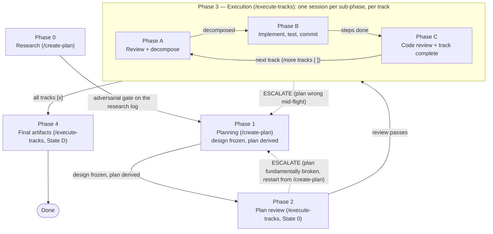

# Chapter 7 — Phases, sessions, and the phase ledger

Chapter 1 left you with a promise it did not keep: each phase runs in its own session, the session is cleared at every boundary, and the next session somehow resumes where the last one stopped by reading state off disk. Chapter 6 then filled in what that state looks like for a planned change — a plan that mirrors a set of dependency-ordered tracks, each track a file with its own progress notes. This chapter joins the two. It teaches the machine that drives a change from phase to phase across cleared sessions: the one-session-per-phase rule, the small append-only file that owns the resume state, and the startup routine that reads that file and puts the next session back to work. By the end you will know how the workflow resumes itself after a session boundary, and why the resume reads from two places, not one.

## A session is a single phase, then it ends

Run `/execute-tracks` once and watch what it does: it figures out which phase the change is in, runs exactly that one phase, and stops. It does not roll on into the next phase. When Phase A of a track finishes, with the track reviewed and broken into steps, the session ends, and it is on you to clear it and run `/execute-tracks` again to start Phase B. Each invocation is one phase of one track.

This is the rule Chapter 1 introduced, now stated as the workflow states it: each session handles exactly one phase, and phase boundaries are mandatory session boundaries. The reason is the one Chapter 1 gave. An agent's judgment degrades as it holds more unrelated material, so the workflow keeps the material of one phase out of the next. The argument that reviewed a plan must not sit in the context that implements it; the context that wrote a step's code must not bias the review of that code. Clearing the session at each boundary is how the workflow enforces that separation, and it is not optional.

One exception exists, and it is deliberate. The Track Pre-Flight gate, a short look-back-and-look-forward check before a track's reviews start, runs in the same session as the Phase A that follows it, because the gate's whole job is to set up that Phase A. Chapter 9 owns the gate; name it here only as the single place where two activities share a session. Everywhere else, one session is one phase.

## The resume problem

A cleared session knows nothing. It does not remember that Phase A of track 2 finished an hour ago, or that the plan review passed last week. So the first thing every session has to answer is: where did the change leave off? Get that wrong and the session re-runs work already done. It re-reviews a plan, re-decomposes a track, re-spawns sub-agents whose output is already on disk, or worse, it skips a phase that never ran.

The workflow's answer is that the change records its own progress to disk as it advances, and the next session reads that record at startup to place itself. Nothing is hand-carried across the boundary. The question this chapter answers is what that record is and how a fresh session reads it. The record has two parts, at two levels, and the rest of the chapter takes them one at a time: a branch-level ledger that owns which phase the change is in, and a per-track progress section that owns where within a track it is.

## The phase ledger owns the top-level state

The branch-level part is a file, ***`_workflow/phase-ledger.md`***, called the *phase ledger*. It is the resume backbone: the single place a fresh session looks to learn which phase the change is in and which track is active. It exists in every tier — even a `minimal` change, which has no plan at all, has a ledger.

The ledger is an append-only event log. One line goes in at each phase boundary, and lines are never rewritten or deleted. A line records a small fixed set of keys: the resume `phase`, the active `track`, the change `tier` and the risk `categories` that placed it there, the §1.7 staging mode (carried in a key named `s17`, the subject of Chapter 13), and any `paused` event. A line looks like this:

```text
[2026-06-16T14:52Z] [ctx=safe] phase=C track=2 tier=full categories="Concurrency,Crash-safety" s17=staged
```

Because the log only ever grows, a reader cannot just take the last line — an append might carry only the keys that changed. Instead the reader scans every line and keeps the most recent value seen for each key. This is the ***last-value-wins*** rule: the current state is the newest value of each key across the whole file, assembled key by key. The payoff is that a mid-flight change of phase or tier is recorded by appending one new line, never by editing an old one, so the file stays a clean, replayable history of how the change moved.

You do not write the ledger by hand. The agent appends to it through one subcommand of the startup script, `workflow-startup-precheck.sh --append-ledger`, which validates each value before it lands, so a stray newline or space cannot split a line and corrupt the last-value-wins scan. The append is the act of crossing a boundary: the agent records the new `phase` at the same moment it ends the session that finished the old one.

## Startup reads the ledger and routes

When you run `/execute-tracks`, before it does anything else it runs the startup script once and dispatches on what the script reports. The single agent that does this driving has a name: the *orchestrator*. It is the one agent that reads the phase ledger, runs the current phase, and hands every code-touching task to an *implementer* sub-agent; it never edits source files itself. The agent the earlier chapters called "the agent" through planning is, in execution, the orchestrator.

The relevant output here is the resume state the script computed from the ledger tail: a `phase`, one of `0`, `A`, `C`, `D`, or `Done`, and, when the phase is mid-track, a `substate` slug. (The script also reports branch divergence and workflow drift; those gates are Chapter 15's subject and are skipped here.) The script reads the ledger so the orchestrator does not have to re-derive state by hand, and the orchestrator then routes:

- `phase == "0"`: the ledger records no boundary past the Phase 0-to-1 gate, so plan review has not run. Run Phase 2.
- `phase == "A"`: the active track has no track file yet. Run the Track Pre-Flight gate, then Phase A, in one session.
- `phase == "C"`: a mid-track resume. The `substate` slug says exactly where (steps still pending, all steps done with review pending, review done with the track not yet closed), and the session resumes from that point.
- `phase == "D"`: every track is complete and Phase 4 has not finished. Run or resume the final-artifacts phase.
- `phase == "Done"`: Phase 4 is complete. Nothing to resume.

The state names skip a few letters, and the gap is worth a word. The script never reports a bare `phase == "B"`: a Phase B that is partway through its steps shows up as `phase == "C"` with a `steps-partial` sub-state, because the same routing table that resumes a finished Phase B also resumes a half-finished one. Both are inside the track's step-and-review span, distinguished by the sub-state, not by a separate top-level phase. Once the script hands back a state, the agent tells you what it decided and which track it is on, and proceeds without waiting for confirmation. You can override (reorder tracks, skip one, pick a different resume point), but the default is to trust the ledger and go.

## Two clocks: the numbered phases and the A/B/C sub-phases

You have now met two kinds of phase, and keeping them apart is the one place this chapter is easy to misread. The numbers and the letters count different things.

The **numbered phases 0 through 4** are the change's top-level life, the sequence Chapter 1 drew: research, planning, plan review, execution, final artifacts. They run once each, in order, for the whole change.

The **lettered sub-phases A, B, and C** live *inside* Phase 3, and they run once per track. Phase A reviews a track and breaks it into steps; Phase B implements those steps; Phase C reviews the resulting code and closes the track. A change with three tracks runs the A-B-C cycle three times, once for each track, all of it inside the single Phase 3. The cross-reference is exact in the source: `workflow.md` §Terminology pairs "the overall workflow has five phases" with "within Phase 3, each track goes through three sub-phases."

This is why the ledger carries both a `phase` and a `track`. The numbered phase alone cannot place a session inside Phase 3 — "we are in execution" does not say which track or which sub-phase. So during Phase 3 the ledger's `phase` key holds the *letter* (`A` or `C`), the `track` key names the active track, and the two together place the session: Phase A of track 2, Phase C of track 3. The numbers govern the change; the letters govern a track within it.



**Figure 7.1 — the phase state machine: gates advance, ESCALATE loops back.**

## The other clock: per-track progress

The ledger places the session at a phase and a track. It does not say where *within* a track that work stopped: which step of Phase B was the last to commit, whether the code review has run. That finer state lives one level down, in the active track file's `## Progress` section. This is the two-level resume: the ledger owns the top-level phase and the active track, and the track file's `## Progress` owns the within-track sub-state. The startup script reads both, the ledger for the phase and track and the track file for the sub-state, and the routing table above is where the two meet.

The split is a direct consequence of the append-only design. A boundary between phases is a rare, clean event, so it earns a ledger line. Progress within a phase, such as step 3 of 5 committed or the code review iteration on its second pass, changes often and belongs with the track it describes, in the track file Chapter 6 introduced. Keeping the high-frequency churn out of the ledger keeps the ledger short, and a short ledger is fast to scan and hard to corrupt. The two records answer two different questions, and a resuming session asks both.

## When a gate sends the change backward

The transitions so far all point forward: a passed gate advances the change to the next phase. The state machine in Figure 7.1 also carries a back-edge, drawn dashed, and it is the reason the change's life is a machine and not a straight line.

The back-edge is *ESCALATE*: a return to planning when the plan itself is wrong. It is reached two ways. During execution, implementing a track may reveal that the plan cannot be built as specified, or that it missed a dependency; the session stops and loops back to replan. The other entry is rarer: a plan review whose findings are so fundamental that incremental revision cannot fix the plan, which advises a restart from planning. (A Phase 2 finding that is a real design decision, not a mechanical fix, does *not* take this edge — that finding is settled with the user in the same review session, and the review still passes. Chapter 8 teaches that path.) The escalation is recorded in the ledger the same way every move is: a new line, a new `phase` value, last-value-wins folding it into the current state.

Naming this edge is all this chapter does with it. The machinery of looping back, how a mid-flight escalation is captured and how a session that runs low on context hands off to its successor mid-phase, is Chapter 14's subject. Carry only the shape from here: the phases advance through gates, and an ESCALATE returns the change to planning, with the ledger recording every move.

## What to read next

You now have the machine: one phase per session, a phase ledger that owns the top-level phase and active track as an append-only last-value-wins log, a per-track `## Progress` section that owns the within-track sub-state, and a startup routine that reads both and routes the session to the right phase. You also have the two clocks, the numbered phases 0 through 4 that run once for the change and the A/B/C sub-phases that run once per track inside Phase 3, plus the back-edge that lets an ESCALATE return a change to planning.

The first thing `/execute-tracks` ever runs is Phase 2, the plan review. Before a single line of the planned code is written, the plan is checked against the design, the code, and itself. Chapter 8 opens that gate: the two-step review, the classifier that fixes mechanical findings on its own and settles only the genuine design decisions with you in the same session, and how a plan earns the right to be built.

## Further reading

- `.claude/workflow/workflow.md` (§Overview, §Terminology: Phases 0/1/2/3/4 vs Phases A/B/C, §Session Lifecycle, §Startup Protocol (Auto-Resume)): the five-phase shape, the A/B/C sub-cycle inside Phase 3, the one-session-per-phase rule, and the startup dispatch that reads the ledger and routes on the resume state.
- `.claude/workflow/conventions.md` (§1.1 Glossary, *Phase ledger* entry): the ledger's definition — append-only, unstamped, last-value-wins, the key set it owns, written by the `--append-ledger` subcommand, authoritative for the resume phase while the track file's `## Progress` owns the within-track sub-state.
- `.claude/skills/execute-tracks/SKILL.md`: the entry-point skill whose startup runs the precheck script once at turn 1 and dispatches on its JSON over the resume state (State 0 / A / C / D / Done).
- `.claude/workflow/mid-phase-handoff.md`: the pause-and-resume protocol for a session that stops mid-phase; named here, opened in Chapter 14.
