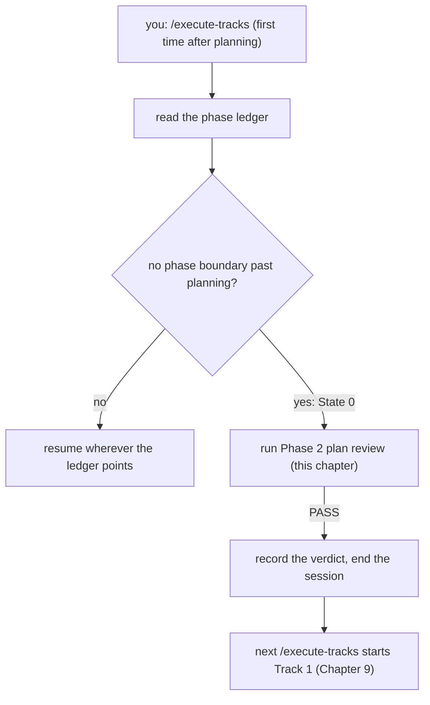
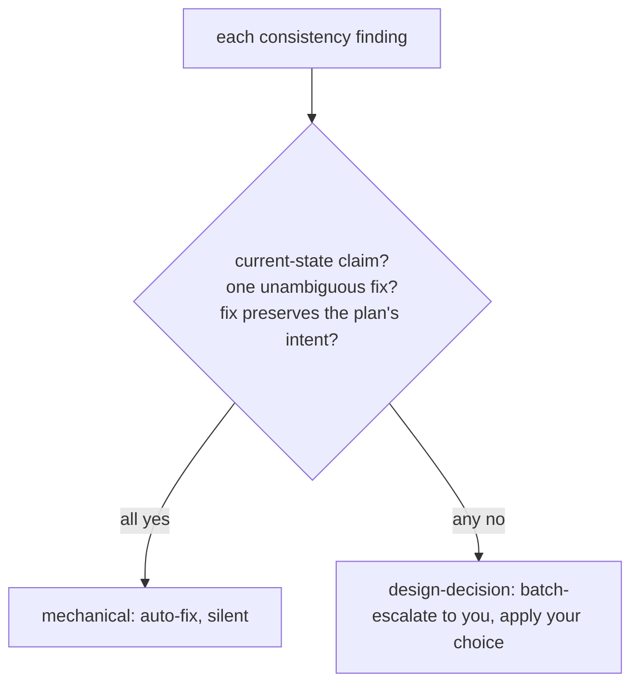
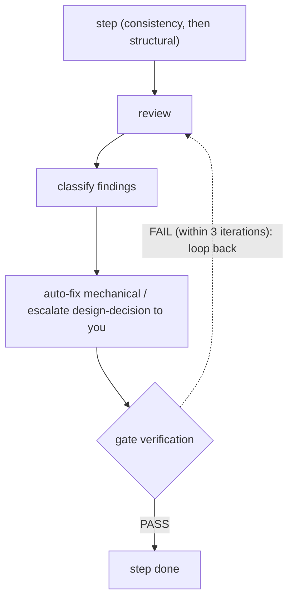

# Chapter 8 — Phase 2: reviewing the plan before any code

A plan is checked against three things, the design, the code, and itself, before a single line is written. That check is Phase 2, and the surprising part is that it runs by itself. You do not invoke it; you do not sit through it. The first time you run `/execute-tracks` after planning, the workflow notices the plan has never been reviewed, runs the whole review, fixes what it can fix on its own, asks you only about the handful of findings that are real design choices, records the verdict, and ends the session. This chapter teaches what that review looks at, how it decides what to ask you and what to fix silently, and how to re-run it by hand when a plan changes mid-flight.

You arrive here with two things from earlier chapters. Chapter 6 gave you the plan-and-track structure: a thin plan file that mirrors a set of dependency-ordered tracks, each track carrying its own decision records, scope indicator, and prose description, all derived from a frozen design. Chapter 7 gave you the phase ledger and the one-session-per-phase rule: the workflow records each phase boundary in an append-only ledger, and a fresh `/execute-tracks` session reads that ledger to work out where to resume. Phase 2 sits exactly between those two. The plan exists, it is derived and frozen-against, and nothing has executed yet. The ledger records that planning finished but says nothing past it. That gap is the signal that plan review has not run.

## You run `/execute-tracks`, and the review runs without you

Picture the moment after planning. You have a `full`-tier plan: a frozen `design.md`, an `implementation-plan.md` mirroring three tracks, and three track files under `plan/`. You type `/execute-tracks`, expecting it to start building Track 1. Instead, the session reads the phase ledger, sees that the ledger records no phase boundary past the Phase-0-to-Phase-1 gate, and concludes that plan review has not passed. So before it touches any track, it runs the review (the entire two-step pass), applies fixes, and stops. The next `/execute-tracks` will start Track 1.

The workflow has a name for this entry state. The startup protocol calls it *State 0*: the plan exists but plan review has not passed, which the ledger records as the absence of any `phase` boundary past planning. State 0 is the trigger that loads the review machinery and runs it. This is why the review is autonomous — it is not a separate command you remember to run, it is the first thing `/execute-tracks` does when it finds an unreviewed plan.

That autonomy is the whole design. The orchestrator runs the review, applies every fix it can apply without a judgment call, and brings you in only for findings that are genuine design decisions. Most plans pass with no question asked of you at all. The goal is to keep a wrong plan from ever reaching execution at the lowest cost to your attention, without making you sit through a review to get it.

**Figure 8.1 — How Phase 2 fires.** The ledger gap past planning is State 0; the first `/execute-tracks` after planning runs the review autonomously before any track executes.

## The first step reads code: does the plan match reality?

The review runs in two steps, and they ask different questions. The first step is the *consistency review*, and it is the only review in the whole workflow before execution that reads the actual codebase.

Here is what it is guarding against. During execution, an agent will read the plan and the design to guide what it builds. Every claim in those documents that is wrong about the code is a wrong assumption the execution agent will inherit. If a track says it will extend `IndexStatistics.getHistogram()` and no such method exists, the execution agent will go looking for a method that was never there. If a design diagram shows a call flow that the real code does not follow, the work built on that diagram drifts from reality. The consistency review reads the code and checks the documents against it, so those mismatches are caught now, while they cost an edit to a sentence, not later, when they cost a wrong implementation.

It compares along a few axes, and which ones run depends on your tier. In the `full` tier, with a design present, it checks the design against the code (do the class diagrams name real classes, do the sequence diagrams trace real call flows), the plan against the code (do the component map and the tracks reference constructs that exist), and the design against the plan (do the diagrams and the tracks tell the same story). In `lite` and `minimal`, where there is no design document, the design half simply drops away — there is nothing to compare it against. The review reduces to one mechanical test it applies everywhere: does `design.md` exist? If it does not, every step that would open, read, or cite a design file is skipped, and the review checks plan-and-track against code, or in `minimal` (which has no plan) just track against code. The tracks are checked in every tier, because the track is the live decision carrier no matter how small the change.

Because every claim it raises is a fact about the code, the consistency review verifies those facts the careful way when the tooling is available — through the IDE's symbol index rather than a text search, so a phantom-reference finding is not raised against a method that exists but was renamed, and a real mismatch hiding behind a polymorphic call is not missed. The source procedure builds a *verification certificate* for each claim: the document's claim, the search performed, what the code actually shows, and a verdict. A finding is only born from a certificate whose verdict did not match.

## Not every mismatch is yours to settle: the classifier

A consistency finding can be one of two very different things, and telling them apart is what makes the review autonomous.

Some findings have exactly one right answer. The plan named `getHistgram()` and the method is `getHistogram()`; the typo has one correct fix, applying it does not change what the plan is trying to do, and no human judgment is involved. The workflow calls this kind of finding *mechanical*, and the orchestrator applies the fix itself, silently, without asking you. A renamed class, an outdated method signature, a sequence-diagram participant whose name drifted, a phantom reference to drop — all mechanical, all auto-fixed.

Other findings are decisions rather than facts, so they are not the orchestrator's to fix. The review notices that Track 1 assumes something Track 3 contradicts; which track is right is a design call, and you have the context the orchestrator does not. The review finds an invariant the plan states but no track implements, and the fix could go two ways: add a track, or relax the invariant. The review finds a decision in the code that no decision record explains, where the rationale lives in your head and not in the document. The workflow calls these *design-decision* findings, and the orchestrator does not touch them. It batches all of them into a single message, presents each with its alternatives, and waits for you to choose. You answer once, the orchestrator applies your resolutions, and the review moves on.

The classifier is the rule that sorts every finding into one of those two bins. It does not live in the orchestrator; it lives in the review sub-agent's prompt, so the sub-agent tags each finding `mechanical` or `design-decision` as it writes it, and the orchestrator simply acts on the tag. Three conditions must all hold for `mechanical`: the claim is about *current* state, there is exactly one correct rendering, and the fix does not change what the plan is trying to achieve. A short list of triggers flips a finding to `design-decision`: a missing decision record, a contradiction between tracks, an unimplemented or violated invariant, an unreachable target, or simply more than one plausible fix. The default, when the sub-agent is unsure, is to escalate: over-asking costs you one round-trip, while silently rewriting a plan you did not approve is the worse failure.

**Figure 8.2 — The mechanical / design-decision classifier.** A finding is auto-fixed only when all three conditions hold; anything else is a design call the orchestrator escalates to you.

There is one screen the review applies before the classifier even sees a finding, and it matters enough to name. A plan describes work that does not exist yet — that is its whole job. A `[ ]` track that says it *will* create a class is not wrong because the class is absent today; that absence is the plan working as intended. So the consistency sub-agent first sorts every claim along an *intent axis*: a *current-state* claim says something about code that should already exist, and a mismatch there is a real finding; a *target-state* claim says something about code a pending track will build, and a mismatch there is expected and silenced. Only a target the current code cannot reach gets through, and that one comes out as a design decision for you. Without this screen the review would either auto-rewrite the plan back toward the code it is supposed to change, or flood you with non-issues. The screen runs on the consistency review only, because it is the only step that reads code.

## The second step reads the plan against itself

Once consistency passes, the *structural review* runs, and it reads no code at all. Its question is whether the plan is well-formed as a plan, not whether it matches reality. Are the tracks ordered so no track depends on one that comes after it? Is each track sized within the soft footprint bounds, or does an out-of-bounds track carry the written justification that lets it pass? Does every track have a description substantial enough to decompose into steps? Are the decision records traceable to the tracks that implement them? And is the plan free of *bloat*, which the review treats as a first-class structural defect rather than a stylistic nag?

Bloat earns its own attention because of where the cost lands. The plan checklist is loaded at the start of every single execution session for the rest of the plan's life. A decision record that ballooned to forty lines, an over-long component-map bullet, a superseded decision record left lying in the track's log: each one is re-read by every Phase A, B, and C session that follows. So the structural review enforces per-section budgets: a decision record back to its four-bullet form, an invariant to a paragraph, an integration point to a short bullet, with the long-form material moved into the track section that owns it. Every one of these bloat findings is `mechanical` by construction, because there is one right way to trim, so the orchestrator applies them all without asking. The findings that escalate from the structural review are the ones about structure that is a judgment call: track ordering that changes a contract, track sizing that needs a split, a contradiction between tracks.

One tier difference is worth keeping in your head from Chapter 3. The `minimal` tier has no plan file, only a one-track aggregator, so there is no plan-internal structure to validate. Under `minimal`, the structural review is dropped entirely, and Phase 2 is the consistency review alone, checking the single track against the code.

## Each step proves its own fixes landed

A review that applies fixes has to confirm the fixes worked and did not break something else. So each step does not end when the fixes are applied; it ends when a separate *gate verification* confirms them. After the consistency review's fixes land, a gate-verification sub-agent re-checks each finding: was the fix applied correctly, does the original mismatch still hold, and, the part that catches the subtle failure, did the fix shift the problem somewhere else? Fixing a class name in a diagram but not in the sentence beneath it is the classic case the gate exists to catch. The gate emits a plain `PASS` or `FAIL` plus any new findings the re-scan turned up. The structural review has its own gate, the same shape.

The two steps each run a small loop: review, apply fixes or escalate, gate-verify, and if the gate is not clean, go around again. The loop is bounded to three iterations. The bound exists so the loop has to terminate: after three apply-then-recheck rounds the workflow stops looping and escalates, rather than spinning on a plan that keeps surfacing findings. The source gives no derivation of three beyond that — it is the fixed cap at which the review gives up and hands the open findings back to you. If a substantial fix reshaped the plan (tracks reordered, scope changed), the orchestrator re-runs the full review instead of the lighter gate, to catch anything the reshaping cascaded into. If blockers survive three iterations, the orchestrator stops asking the review to converge and brings the open findings to you, recommending a return to planning. The gate never spins forever, and it never declares a step passed on fixes it has not re-checked.

**Figure 8.3 — One review step's loop.** Review, classify, fix or escalate, then a gate proves the fixes landed before the step is allowed to pass.

## The verdict goes in the ledger, not in a checkbox

When both steps pass, Phase 2 records that it passed, and where it records the verdict is the detail that connects this chapter back to Chapter 7. There is no checkbox in the plan that flips to "reviewed." Instead, the verdict splits two ways. The human-readable summary, which findings were auto-fixed, which were escalated and how you resolved them, and at which iteration the review converged, is written to a file called `plan-review.md` — a cold record you will rarely open during development. The machine-readable fact, the bare statement that plan review passed, is recorded in the phase ledger by appending a `phase=A` boundary.

That ledger boundary is the whole signal. The startup protocol detected State 0 by the *absence* of a phase boundary past planning; appending `phase=A` is what moves the plan off State 0. The next `/execute-tracks` reads `phase=A` and knows plan review is behind it, so it enters Phase A of Track 1 instead of re-running the review. The orchestrator commits `plan-review.md` and the ledger together as a single workflow-update commit, pushes, and ends the session — because the one-session-per-phase rule from Chapter 7 forbids rolling straight into execution.

`plan-review.md` exists in every tier, including `minimal`, so even a one-line change with no plan and no structural pass still has a home for its review fact. The two homes are deliberate: the verbose audit trail lives where it is cheap to keep and rare to read, while the terse "passed" signal lives in the ledger where the resume hot path can grep for it without parsing prose.

## Re-running the review by hand

Phase 2 runs itself the first time, but a plan does not always stay still. Sometimes execution surfaces something that forces the plan to change mid-flight — Chapter 14 covers that inline-replanning path in full. When the plan is revised, the `phase=A` boundary that meant "this plan passed review" no longer describes the plan on disk. The review has to run again against the new plan.

That is what `/review-plan` is for. It is a manual entry point to the exact same review — same consistency step, same structural step, same classifier, same gates. Running it re-validates the plan and re-records the verdict, appending the fresh result to `plan-review.md` and re-appending the `phase=A` ledger boundary. You reach for it after an inline replan has reshaped the plan, or any time you want to re-check the plan against current code without going through `/execute-tracks`. The one rule is not to double-run it: if `/execute-tracks` is already sitting in State 0 about to run the autonomous review, let that fire rather than launching `/review-plan` alongside it. The two share one orchestration; the skill adds nothing but the entry point.

You finish Phase 2 with a plan that has been proven consistent with the code and the design, sound in its own structure, and recorded as passed in the ledger. Every wrong assumption that a sentence could carry has been caught while it was still a sentence. What has *not* happened yet is any look at the code a track will actually write — the consistency review checked that the plan's claims about today's code are true, not that the work each track proposes is the right work, sized into the right steps, at the right risk. That is where execution begins. The next chapter opens Phase A: the first track enters its own pre-flight gate, gets reviewed for technique, risk, and adversarial weakness, and is decomposed into the steps that the implement-test-commit loop will build one at a time.

## Further reading

- `.claude/workflow/implementation-review.md` — Phase 2 in full: the State 0 trigger and on-demand load (§Overview, the loaded-on-demand banner), the tier-driven pass selection and design-presence guard (§Tier-driven pass selection), the two steps and their autonomous loops (§Step 1, §Step 2), the classifier (§Mechanical vs. design-decision classifier), and the audit trail split between `plan-review.md` and the ledger (§Audit trail).
- `.claude/workflow/structural-review.md` — the structural step's goal, the per-section bloat budgets and their fixes (§Bloat checks), and the three-iteration loop (§Review iteration).
- `.claude/workflow/prompts/consistency-review.md` — what the consistency review checks across its axes (§Review Criteria), the intent-axis pre-screen (§Intent-axis pre-screen), and the classification rules the sub-agent tags each finding with (§Classification rules).
- `.claude/workflow/prompts/structural-review.md` — the structural criteria (scope, ordering, descriptions, sizing, traceability, bloat) and its classification rules.
- `.claude/workflow/prompts/consistency-gate-verification.md` and `.claude/workflow/prompts/structural-gate-verification.md` — the gate-verification step that re-checks each fix and scans for fix-shifted regressions before a step is allowed to pass.
- `.claude/skills/review-plan/SKILL.md` — the manual re-run entry point and how it shares the autonomous orchestration.
