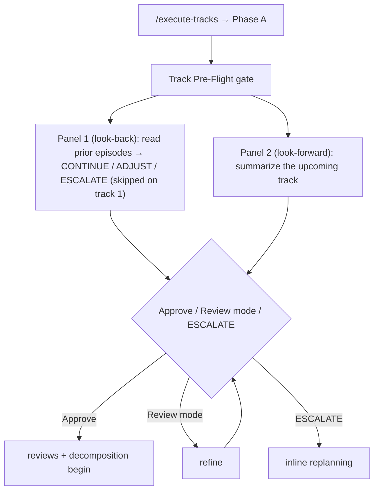

# Chapter 9 — Phase A: pre-flight, review, and decomposition into steps

A track does not go straight from the plan to code. Before anyone writes a line, the track passes a gate that asks the user whether the plan still holds, then runs a set of reviews against the codebase, and finally gets broken into a numbered list of concrete steps — each carrying a risk tag that decides how hard later phases will scrutinize it. That whole sequence is Phase A, the first of the three sub-phases every track runs through. This chapter teaches what Phase A checks, how it checks it, and what it produces: a track file whose steps are ready to implement.

You already have the phase machine from [Chapter 7](07-phases-sessions-phase-ledger.md): the numbered phases (0 through 4) run once each for the whole change, while Phase 3 (execution) repeats per track, and each track cycles through three lettered sub-phases A, B, and C. Phase A is the A. You also know from [Chapter 6](06-phase-1-plan-and-tracks.md) that a track arrives here already described: the plan derived a track file at Phase 1 with the track's purpose, its current-state orientation, its plan of work, and its interface boundaries already written. Phase A reads that description, validates it against the real code, and turns its rough scope sketch into implementable steps. It writes exactly one file, the track file, and it never touches source code.

## A track enters Phase A, and the first thing that happens is a question

You run `/execute-tracks`. The plan review has already passed ([Chapter 8](08-phase-2-plan-review.md)), so the workflow picks up the first track and enters Phase A. Before any reviewer reads anything, the orchestrator stops and runs a single gate called the *Track Pre-Flight*. The gate exists for one reason: everything downstream in this phase (the reviews, then the decomposition) reads the plan and the track file as authoritative. The Pre-Flight is the user's last chance to correct them before that reading happens. Catch a stale assumption here and you save a full review iteration; miss it and a reviewer spends its budget challenging a track that was already wrong.

The gate has two panels, and which ones it shows depends on where you are in the plan.

The first panel is a look-back. It runs only when an earlier track has already completed or been skipped, so it is skipped entirely on the very first track, because there is nothing behind it to look at. When it does run, the orchestrator reads the just-finished track's episode (its record of what actually happened) plus the episodes of every earlier track, and asks a pointed set of questions: did anything those tracks discovered contradict an assumption the upcoming tracks still rest on? Did the picture of which components touch which change shift? Were any decisions weakened by what was learned? Are there dependencies between tracks that the original plan did not see? The answer is one of three verdicts, `CONTINUE`, `ADJUST`, or `ESCALATE`, with a short rationale. `CONTINUE` means the plan still holds. `ADJUST` means a downstream track's description needs a tweak. `ESCALATE` means the accumulated discoveries changed the picture badly enough that the remaining plan needs reworking, which routes to the inline-replanning machinery [Chapter 14](14-mid-flight-changes.md) covers.

The second panel is a look-forward: a plain summary of the track about to be worked, built from the plan's checklist entry and the track file's own description. This is what you read to decide whether the upcoming track is still the right next move.



**Figure 9.1 — The Track Pre-Flight gate.** A backward-looking strategy check (skipped on the first track) and a forward-looking track summary, presented together for a single Approve / Review mode / ESCALATE decision.

## The gate is a conversation, not a yes/no prompt

The Pre-Flight does not just ask "proceed?". It presents the two panels and then offers three choices: **Approve**, **Review mode**, or **ESCALATE**. Approve accepts the plan as it stands and moves on. ESCALATE routes to inline replanning for a deep rework. The middle option, Review mode, is the one that makes the gate useful, and it is a shared mechanism the workflow reuses wherever a gate needs the user's judgment — the same loop runs at plan review and at track completion.

Review mode is a conversational refinement loop. You drop observations across as many chat turns as you want: a correction to the track's intro, a note that the implementer must not break a particular caller, a question about why an earlier track decided something, a request to skip a remaining track. The orchestrator quietly sorts each remark into a typed action behind the scenes, acknowledges it in one plain line, and accumulates it. It does not narrate the machinery at you: you never see the internal type labels in chat, only a brief "got it, I'll qualify that reference in both spots". When you signal you are done, *one* approval panel surfaces the full accumulated set so you can see everything that will happen before it happens, and only then does any edit land. That single end-of-conversation panel is the audit surface; it is why the loop accumulates silently and commits once, rather than applying each remark as it arrives.

Not every change is light enough for Review mode. The loop draws a line between *light* amendments and *deep* ones. Light amendments apply inline within the loop: fixing a track's title or intro, tweaking a scope sketch, reordering remaining tracks whose dependencies still hold, dropping a remaining track, or adding a forward-looking note for the implementer. Deep amendments route to inline replanning instead, because a single refinement round cannot do them: editing a Decision Record or a Constraint, adding a whole new track, changing how one track's scope bleeds into another, or anything you would call "fundamental rework". When you raise something deep, the orchestrator pauses and asks whether you mean to escalate, rather than silently folding a redesign into a batch of small edits.

When you finally Approve, the gate writes what the round produced: a strategy-refresh line recording the look-back verdict, any forward-looking notes folded into the track file as a `### Clarifications` block, and the light edits themselves, all committed together. The gate fires once per fresh entry into Phase A. If you resume a session where reviews have already run, the gate is skipped — re-firing it would invalidate the work those reviews did against the track file as it stood.

## Three reviews check the track against the real code

With the gate cleared, the orchestrator runs the track's reviews. These are *plan-level* reviews of the track as a unit — they read the track's description and the codebase it touches, and ask whether the plan is sound before a single step is decomposed. Keep them separate in your head from the dimensional code reviews of [Chapter 11](11-dimensional-review-agents.md): those read a *diff* of code that already exists, dimension by dimension. The Phase A reviews read a *plan* for code that does not exist yet. Same workflow, different target.

There are three of them, each a sub-agent spawned with its own prompt.

The *technical review* asks whether the track will actually work against the code as it is today. It verifies that every component the track names exists, that the relationships it assumes (this calls that, this extends that) are real, that the APIs it leans on have the shapes it expects, and that no existing caller breaks. Its discipline is strict: it may not assert that an API exists because the name sounds plausible. Every claim it makes must rest on a documented *evidence certificate* — a short record of what it searched for, where it found the code, and what the code actually does. A class named in the track file that does not resolve is a blocking finding, unless the track explicitly says it is creating that class. The certificate rule exists to catch a specific failure: an agent confirming "this interface probably has that method" without reading it, and a track built on the guess.

The *risk review* asks a different question. Not "will it work" but "what is the blast radius if a step here has a bug, and can each step be tested". It traces the critical paths the track touches (storage, the write-ahead log, transactions, indexes, the cache) and for each, records what breaks if the step is wrong and what safeguards already protect it. A risk that already sits behind WAL coverage and a lock is lower than the same risk bare. The review also checks that each future step can realistically hit the project's coverage bar, and flags any step that is hard to test in isolation.

The *adversarial review* is the devil's advocate. It argues against the track's decisions, builds concrete violation scenarios for the invariants the track claims to preserve, and hunts for the strongest case that the chosen approach is wrong, often by showing the codebase already has infrastructure for a rejected alternative. But it is deliberately *narrowed*. The track's underlying design decisions were already challenged once, by the adversarial gate that ran on the research log at the Phase 0 to Phase 1 boundary ([Chapter 4](04-phase-0-research.md)). So this pass does not re-litigate those. It challenges only the track's *realization*: is the track's file footprint and step decomposition sized right; do the outputs earlier tracks were supposed to hand this one actually exist as assumed; does any step's plan violate a stated invariant. On the first track of a plan, the "did earlier tracks deliver" challenge is dropped, because there are no earlier tracks, but the sizing and invariant challenges still run, because the foundational track most constrains everything built on it.

Which of the three run is decided by the change's tier, not by how big the track looks.

| Tier | Reviews run in Phase A |
|---|---|
| `minimal` | Technical only |
| `lite` / `full` | Technical (always) + Adversarial (narrowed) + Risk when the track warrants it |

**Table 9.1 — Tier selects the Phase A review panel.** A `minimal`-tier change is a single track that the research-log gate already vetted, so it runs the technical review alone. `lite` and `full` always add the narrowed adversarial pass, and add the risk review when the track touches a critical path, carries a performance constraint, or makes a major architectural decision.

Each review can run up to three iterations. A reviewer reports its findings; the orchestrator applies fixes to the plan or the track file; a gate-verification pass re-checks that the fixes resolved the findings without introducing new ones. Findings are cumulative across iterations, and a finding's severity (blocker, should-fix, or suggestion) tells the orchestrator how hard to push. If blockers survive three iterations, the orchestrator notes them and proceeds with caution, on the reasoning that implementation will surface a real problem concretely if one remains. Every review's outcome is recorded as a one-line entry in the track file, so a resumed session knows which reviews have already passed and does not re-run them.

## Decomposition turns scope into a numbered roster of steps

Once the reviews pass, the orchestrator decomposes the track into steps. A *step* is one atomic change that becomes one commit: a self-contained edit that is fully tested before it lands. The track file arrived with a rough *scope indicator*, a sketch like "~6 files covering X, Y, Z", and decomposition turns that sketch into a concrete numbered list. The sketch is a starting point, not a contract; the actual roster may have more steps, fewer steps, or cover the work differently, based on what the reviews revealed about the real code.

The whole roster is written at once, because a track is sized small enough (by its file footprint, not its step count) that the full set of steps fits in one pass. Two rules shape how the steps are drawn. A change that is genuinely risky stays in its own isolated step, sized by the change itself with no upper file cap, so that the later review of that step sees the whole risky change at once rather than split across commits. Everything else is *filled*: ordinary low-risk work is merged into larger steps, packing toward a soft target of around twelve edited files per step, because collapsing several tiny steps into one removes the cost of spinning up a fresh implementer for each. A step that stays well under the target without a good reason is a sign it should have absorbed more; a step that balloons past the target is a sign it should split.

The output is a thin roster under the track file's `## Concrete Steps` heading — one numbered line per step, each with a description, a checkbox, and a risk tag. The detailed record of how each step actually went is written later, by Phase B, into a separate section; the roster itself stays a clean list of intent.

```markdown
## Concrete Steps

1. Add StampedLock acquisition path for histogram updates — risk: high (concurrency)  [ ]
2. Extract HistogramHeader struct from BTreePage — risk: low (default: pure refactoring)  [ ]
3. Wire histogram counter through tx-finalization path — risk: medium (multi-file logic)  [ ]
```

**Figure 9.2 — A decomposed step roster.** Each step is one commit, carries a risk tag with its triggering reason, and starts unchecked. Phase B flips the checkbox to `[x]` as each step lands.

## The risk tag decides how hard each step gets reviewed

Every step on that roster carries a tag (`low`, `medium`, or `high`) assigned during decomposition. The tag is the single most consequential thing this phase produces, because it controls how much review attention a step earns later. A `high` step runs a full step-level review loop during implementation (Phase B); `medium` and `low` steps skip that loop and rely on their tests plus the track-level review at the end. The point is to spend scrutiny where tests struggle to reach (concurrency, durability, public API surface, security, load-bearing architecture, the performance hot path) and not to spend it on mechanical changes that tests already cover well.

The tag is computed from a fixed set of criteria. A step is `high` if it does anything in one of seven categories: it changes synchronization or shared mutable state (*concurrency*); it touches the write-ahead log, recovery, page-level operations, or on-disk format (*crash-safety / durability*); it changes a public API or a serialized form (*public API*); it touches authentication, input handling at a boundary, or query construction (*security*); it changes an interface between major modules or moves a load-bearing abstraction (*architecture / cross-component coordination*); it changes a read path, the query inner loop, or cache logic (*performance hot path*); or it edits a hook, a control-flow gate, or the always-loaded context surface of the workflow itself (*workflow machinery*). A step is `medium` if no high trigger fires but it still changes observable behavior across several files, touches test infrastructure, or alters error-handling or build configuration. Everything else is `low`: pure refactoring, new tests, documentation, an isolated one-line fix.

Two defaults steer the edges. When a step's category is genuinely unclear, the rule is "when in doubt, high": an extra review costs little, but a missed concurrency or durability bug ships. And a step that only adds tests is capped at `medium`, the same way a prose-only change to a workflow document is capped at `low` — a change that cannot break production behavior does not need the heavy review path.

The tag is not final the moment it is written. The decomposer may override the computed level with a written reason: upgrading when uncertain, or downgrading a step that technically touches a high-risk file but changes only a comment. The user can change any tag during the Pre-Flight gate's approval, which is the primary safety net against a misapplied criterion. And during implementation, if a step turns out more invasive than the plan suggested, the implementer can request an upgrade. But once a step is implemented, its tag locks: from that point the track-level review reads the locked tags and treats every `medium` and `high` step as a focal point. Downgrades are never allowed mid-implementation, because a step planned as risky cannot quietly relax its own review pressure.

These seven high categories do double duty. They are the same list the tier gate of [Chapter 3](03-tiers-and-the-tier-gate.md) reads at the change level: a category that is *central* to the whole change is what flips the gate toward needing a design document, while here the same category *touched by a step* is what flips that step to `high`. One vocabulary, read at two granularities.

## What Phase A hands forward

Phase A ends deliberately, with a hard session boundary. After the orchestrator writes the step roster, records the reviews, commits the track file, and tells you how many steps were decomposed and what the reviews found, it stops. You clear the session and re-run `/execute-tracks` to begin Phase B in fresh context. The boundary is not bureaucratic: Phase A is exploratory work, reading code and validating assumptions and arguing against decisions, and that reviewer mindset is the wrong context to carry into implementation, where it dilutes focus with stale exploration. The track file is the bridge. Everything implementation needs is written into it; nothing has to survive in the agent's memory across the clear.

A track leaves Phase A as a validated plan broken into a numbered roster of risk-tagged, commit-sized steps. The Pre-Flight confirmed the plan still held; the three reviews confirmed it works against the real code, that its blast radius is understood, and that its decisions survive a hostile read; the decomposition turned its scope sketch into steps; and the risk tags marked which of those steps will be scrutinized hardest. The next chapter picks up exactly there. [Chapter 10](10-phase-b-implement-test-commit.md) is Phase B — the implement-test-commit loop that takes each step on this roster, builds it, tests it, commits it, and writes the durable record of how it went. The question Chapter 9 set up and [Chapter 10](10-phase-b-implement-test-commit.md) answers is what actually happens to one of these steps once it is the implementer's turn.

## Further reading

- `.claude/workflow/track-review.md` — Phase A in full. The Track Pre-Flight gate's two panels and the light-vs-deep amendment boundary (§Track Pre-Flight), tier-driven review selection (§Tier-driven review selection), the three track-scoped reviews and the narrowed adversarial pass (§Track-scoped technical/risk/adversarial review), the step-decomposition sizing and fill rules (§Step Decomposition), and the mandatory session boundary (§Phase A Completion).
- `.claude/workflow/risk-tagging.md` — the per-step risk criteria: the seven HIGH categories (§HIGH-risk triggers), the MEDIUM and LOW bands, the tests-only and prose-only caps, the override rules and Phase B upgrade path, and risk locking.
- `.claude/workflow/prompts/technical-review.md`, `.claude/workflow/prompts/risk-review.md`, `.claude/workflow/prompts/adversarial-review.md` — the three Phase A review prompts: their criteria, the evidence-certificate discipline each enforces, and the finding-severity guides.
- `.claude/workflow/review-mode.md` — the conversational refinement loop the Pre-Flight gate uses: accumulate observations across turns, surface one approval panel, apply only on Approve (§What review mode does, §Flow, §Action types).
- `.claude/workflow/conventions-execution.md` — the track-file shape and the `## Concrete Steps` roster decomposition writes (§Track file content).
