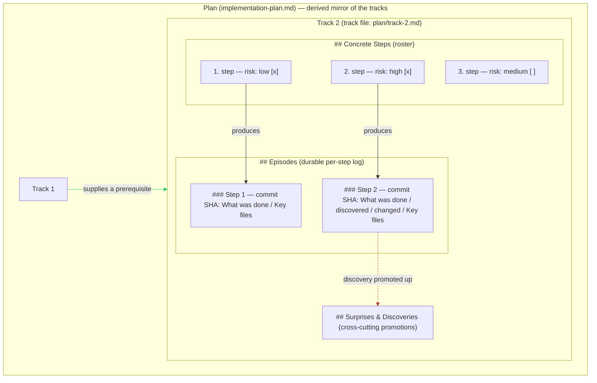

# Chapter 10 — Phase B: the implement-test-commit loop

Chapter 9 left a track in a clean, ready state: a validated plan broken into a numbered roster of steps, each one commit-sized and tagged `low`, `medium`, or `high`. The session ended on a hard boundary, and the whole roster was written into the track file so nothing had to survive in memory. This chapter is what happens when you clear that session, re-run `/execute-tracks`, and the workflow picks the first unchecked step off the roster and builds it. Phase B is the part of the workflow where source code finally changes. By the end you will hold two things. The first is the core working loop the whole workflow exists to protect: implement one step, test it, commit it, then do the next. The second is the *episode*, the small durable record each step leaves behind so a session that has never seen this step can still pick up where it left off.

## You are not the one writing the code

Here is the first surprise about Phase B. The session you are sitting in, the one that read the plan, that knows which track it is on, that will write the episode at the end, does not edit a single source file itself. It reads the next step off the roster, hands that step to a fresh sub-agent, and waits for a short structured message back. The sub-agent does the work: it opens the files, writes the change, runs the tests, and commits. We call the session that drives the loop the *orchestrator* and the sub-agent it spawns the *implementer*.

The split looks like extra ceremony until you watch one step run. Implementing a real change means reading several source files, running Maven a few times, fixing a compile error, re-running, watching a test fail, reading the stack trace, fixing it, re-running. Every one of those actions produces output, and all of it would land in the orchestrator's context. Across a track of a dozen steps the orchestrator's memory would fill with stale Maven logs and half-abandoned debugging trails long before the track finished — exactly the context pollution Chapter 7 said the one-session-per-phase rule exists to prevent, except now it would happen *inside* a single phase. Delegating the messy part to a sub-agent that is thrown away after each step keeps that traffic out of the orchestrator entirely. The orchestrator sees one clean structured return per step and nothing else.

So the implementer is spawned fresh for every step, does its three sub-steps, and returns. It is always spawned on the strongest model the workflow has, regardless of the step's risk tag, because the reliability of multi-step implementation work falls off sharply on weaker models — a step that completes cleanly on the strong model surfaces intermittent failures (a skipped sub-step, a malformed return, a wrong test invocation) on a weaker one even at `risk: low`. The risk tag changes how hard the *result* is reviewed, which we come to below; it does not change who does the work. The full implementer rulebook lives in `.claude/workflow/implementer-rules.md`; this chapter teaches the shape of the loop, not every rule in it.

## The implementer's three sub-steps

The implementer's job is narrow and always the same three moves, in order. First it reads the track file to find its step and confirm what the step is meant to do, reads the slim plan snapshot for strategic context, and then implements the change in code. Second it adds or updates the tests that cover the new behavior, runs the module's test suite, applies the formatter, and checks that coverage of the changed lines clears the project thresholds. Third, and only once the tests are green, it stages the exact paths it touched, commits with a plain imperative message, and pushes.

That ordering is not negotiable. The implementer does not commit a change whose tests have not run, and it does not start the commit while a Maven run is still in flight. Code and its tests land together in one commit, so every commit on the branch is a fully-tested unit. The push matters as much as the commit: the branch carries a draft pull request opened back in Phase 1, and pushing after every commit keeps that PR in sync with local state, which gives teammates a live view of progress and means a lost laptop never destroys work. `.claude/workflow/commit-conventions.md` is blunt about this — every commit, code or workflow-file, is pushed immediately.

When everything goes to plan the implementer ends by emitting a single structured block and exits. That block, which the workflow calls the `RESULT`, is the implementer's entire handoff. It names the outcome (`SUCCESS`), the commit SHA, the files it touched, a one-line test summary, and a *draft* of the episode: a few sentences on what it did, plus anything it discovered or had to change from the plan. The orchestrator parses only this block; everything else the implementer printed is ignored. The contract is strict in one direction: the implementer must emit a `RESULT` block before it exits *for any reason at all*, even if it ran out of room mid-task. A silent exit leaves the orchestrator with nothing to act on and is treated as a failure. Honest partial failure the orchestrator can recover from; silence it cannot.

That covers the happy path, where the implementer returns `SUCCESS`. A step can also come back saying it hit a decision the plan does not settle, that it turned out riskier than its tag, or that it simply could not be done. Those are the recovery paths, and they have their own machinery; Chapter 14 covers what happens when a step does not go cleanly. For now, assume `SUCCESS`.

## What the orchestrator does with a returned step

A returned `SUCCESS` is not the end of the step. The implementer's commit is on disk, but the orchestrator now runs its own sequence before it is allowed to touch the next step. Four things happen, in order, and they are the reason the loop is a loop and not just a string of commits.

The first is a review, but only for the steps that earned it. If the step was tagged `high`, the orchestrator runs a step-level review over just that step's diff: it spawns review sub-agents, collects their findings, and, if they found anything that must change, respawns the implementer to apply the fixes on top of the existing commit, then re-checks, up to a few iterations. For `medium` and `low` steps this whole stage is skipped; those steps lean on their tests and on the track-level review that comes at the very end. This is the risk tag from Chapter 9 finally doing its job: it decides, per step, whether scrutiny is spent here or deferred. The review mechanism itself is the subject of Chapter 11: which agents run, what the severities mean, how the iteration loop terminates. Here it is enough to know that a `high` step gets a focused review of its own diff before the loop moves on.

The second is the *cross-track impact check*. The orchestrator still has the whole plan in its context, so after each step it asks a quick question: did this step discover anything that weakens an assumption a later track is resting on? Did it change the architecture in a way that reaches across track boundaries? Did it invalidate the order the tracks were meant to run in? Most steps touch nothing outside their own track and the answer is no. When the answer is a small yes, the orchestrator records the affected track in the step's episode so a later track's review will see it. When it is a large yes, meaning the discovery genuinely breaks the plan, the orchestrator stops and escalates to you, which routes into the inline-replanning machinery Chapter 14 describes.

The third is a context check. The orchestrator reads its own context-window usage and records the level. If the session is running hot, this is the gate where it stops cleanly rather than starting another step in degraded context — Phase B is allowed to pause only here, at the boundary between steps, never mid-step. The next session resumes from the next unchecked step.

The fourth is the episode, and it is important enough to earn the rest of the chapter.

## The episode: a step's durable record

When a step is done, the orchestrator writes a short block into the track file describing how the step actually went. That block is the *episode*. It is the mechanism that lets the workflow survive its own session boundaries: the orchestrator that started this step will be cleared away, and the only thing carried forward is what is written to disk. The episode is the part of "what is written to disk" that explains the *why* behind a commit — what the step did, what it ran into, and what it means for the steps still to come.

An episode is built from the draft the implementer returned, merged with whatever the cross-track check turned up, and it has five fields. Two are always present. **What was done** is a factual summary of the change. **Key files** lists the files created or modified. The other three appear only when they have content. **What was discovered** records anything unexpected the implementer learned about the codebase, an API, or a behavior — this is the single most valuable field, because it is how the workflow adapts a plan written before the code was touched to what the code actually turned out to be. **What changed from the plan** records any deviation and names the future steps it affects. **Critical context** is a free-form field for an insight too important to lose and too broad to fit the others, used sparingly. A field with nothing to say is omitted entirely, never padded with "N/A". A step that ran exactly as planned and found nothing surprising writes only the two mandatory fields, and that is a complete episode:

```markdown
### Step 4 — commit abc1234, 2026-05-16T15:10Z [ctx=safe]
**What was done:** Extended `LeafPage` with a 16-byte histogram header.
Added serialization and deserialization in `LeafPageSerializer`.

**Key files:**
- `LeafPage.java` (modified)
- `LeafPageSerializer.java` (modified)
- `LeafPageHistogramTest.java` (new)
```

The header line carries three facts a later reader needs: the commit SHA the episode describes, the timestamp it was written, and `[ctx=<level>]`, the orchestrator's context-window level at write time. That last field is a small audit trail — it records, honestly, how loaded the session was when this step landed, so a reader debugging a thin episode later can see whether it was written under pressure.

Two rules guard the episode's value. It is **immutable once written**: if later work proves an episode wrong, you append a correction to a *later* step's episode rather than editing the original, so the record stays a true history and not a rewritten one. And its length is **proportional to impact**: a trivial rename gets one sentence; a step that uncovered a concurrency bug gets a full paragraph. The episode exists so that a reviewer, or the next session, can understand the whole step from the episode alone without reading the diff — so it carries exactly as much as that goal needs and no more.

The implementer drafts the episode, but the orchestrator is the one that writes it to the track file, a split that is easy to assume the other way around. The implementer never edits the track file or the plan — those belong to the orchestrator. This keeps a single writer in charge of the durable record, which is what lets the orchestrator merge the implementer's draft with its own cross-track observations into one coherent block. The episode write is itself committed and pushed as its own small workflow-file commit, so the track file on disk is clean before the next step's implementer is spawned.

## Where the episode lives, and what it connects to

The episode does not float free; it has a fixed home in the track file, and that home is worth seeing in relation to everything else the track file holds. A track file follows a fixed fifteen-section shape. (You may see an older "fourteen-section" figure in a couple of the source documents; the section set on disk is fifteen, defined authoritatively in `.claude/workflow/conventions-execution.md` §2.1, and the count is what matters here, not the label.) Two of those sections are the ones this chapter cares about. `## Concrete Steps` holds the roster Chapter 9 produced, one numbered line per step, with its risk tag and a status checkbox. `## Episodes` holds one block per *completed* step. They sit next to each other on purpose, so the plan for a step and the record of how it actually went are physically adjacent. When the orchestrator finishes a step it does two writes in one edit: it appends the episode block to `## Episodes`, and it flips the matching roster line's checkbox from `[ ]` to `[x]`. That checkbox flip is the primary on-disk marker that says "this step is done and its episode is written" — it is what a resuming session reads to know where the roster left off.

Sometimes a discovery in an episode matters beyond the one step that found it. When **What was discovered** mentions another track, or names a file outside this track's scope, or records a fact a future session will need, the orchestrator *promotes* a one-line summary of it up into the track's `## Surprises & Discoveries` log, with a back-reference pointing to the originating episode. The episode stays the full, canonical account; the promoted line is a short signal in a place a resume reader scans first. A similar promotion sends genuine execution-time decisions into the track's `## Decision Log`. These promotions are what make an episode a feedback path rather than a dead-end note: a thing learned deep inside one step's implementation can surface where the next track's review will see it.

Figure 10.1 lays out that whole structure: a plan that contains tracks, a track that contains a step roster and an episode log, a step that produces an episode, and the two cross-links that carry feedback.


**Figure 10.1 — the plan, track, step, and episode hierarchy.**

Read the figure as containment with two feedback edges. The plan contains the tracks; the highlighted track contains its `## Concrete Steps` roster and its `## Episodes` log side by side. Each completed step on the roster *produces* its episode block — the solid down-arrows. The green edge between tracks is a dependency: an earlier track supplies a prerequisite a later track consumes, which is why tracks run in order. The dashed red edge is the promotion path: a cross-cutting discovery inside an episode is lifted up into the track's `## Surprises & Discoveries` log so later work sees it without reading the full episode. The nesting is the data model; the two edges are how a step's local work reaches the rest of the plan.

## The loop, end to end

Put the pieces together and the per-step loop reads simply, even though each piece carries weight. The orchestrator takes the next unchecked step off the roster and spawns a fresh implementer for it. The implementer implements the change, tests it, commits it, pushes, and returns a `RESULT` with an episode draft. The orchestrator reviews the step if it was tagged `high`, checks whether the step's discoveries reach other tracks, checks its own context budget, finalizes the episode by merging the draft with what the cross-track check found, writes that episode and flips the roster checkbox, and commits the episode. Then, and only then, it takes the next unchecked step. There is a hard gate between steps: the next implementer is not spawned until the current step's episode is on disk. Batching is explicitly forbidden, whether that means running two implementers before writing either episode or saving up reviews to do later, because the whole adaptive value of the loop comes from each step's discoveries being recorded before the next step starts.

When the last step's checkbox flips to `[x]`, Phase B is done. The orchestrator marks the track's implementation complete, tells you how many steps landed and what the episodes discovered, and stops — Phase B does not roll straight into the track-level review, for the same context-hygiene reason every phase boundary exists. The implementation session has accumulated commits and debugging trails and workaround decisions, and that is precisely the wrong context to carry into a review that needs fresh eyes. You clear the session and re-run `/execute-tracks` once more. Everything the reviewer needs is in the episodes.

And that reviewer is where Chapter 11 goes. The steps in this chapter produced code, and a `high` step's review was waved at as "spawn some review agents and collect their findings" — but how a review actually fans out across dimensions, which agents it picks for a given diff, what a finding's severity means, and how the iteration loop knows when to stop are a mechanism in their own right. Chapter 11 opens that mechanism, the same one used both for the step-level review you saw here and for the track-level review that closes a track. The question this chapter set up is the one Chapter 11 answers: now that a step has produced changed code, how is that code actually reviewed?

## Further reading

- `.claude/workflow/step-implementation.md` — the Phase B orchestrator's happy path in full: the per-step orchestration loop and its sub-steps (§Per-Step Orchestration Loop), the implementer prompt template (§Implementer Prompt Template), the step completion gate (§Step Completion Gate), the cross-track impact check (§Cross-Track Impact Check), and episode finalisation (§Episode Production).
- `.claude/workflow/implementer-rules.md` — the implementer sub-agent rulebook: its three sub-steps (§"What the implementer does (sub-steps 1–3, expanded)"), the `INITIAL` / `WITH_GUIDANCE` / `FIX_REVIEW_FINDINGS` modes (§Inputs the orchestrator passes on each spawn), and the structured `RESULT` block it must always emit (§Return contract).
- `.claude/workflow/episode-format-reference.md` — the episode format: the five fields and which are mandatory (§Episode fields), the immutability and length rules (§Rules, §Episode length rule), the minimal example (§Minimal episode example), and the Surprises / Decision Log promotion rule (§Authoritative copies and back-references).
- `.claude/workflow/conventions-execution.md` — the fifteen-section track-file shape and where `## Concrete Steps` and `## Episodes` sit within it (§2.1 Track file content).
- `.claude/workflow/commit-conventions.md` — the commit-type prefixes and the push-every-commit rule (§Push every commit, §Commit type prefixes).
- `.claude/workflow/step-implementation-recovery.md` — the recovery paths a step takes when it does not return `SUCCESS`, and the resume logic for a session interrupted mid-step. Covered in Chapter 14.
