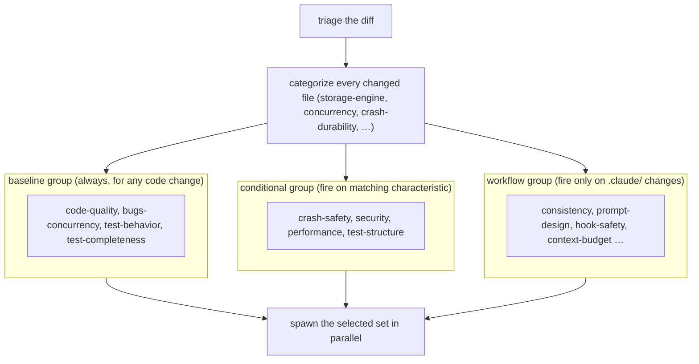
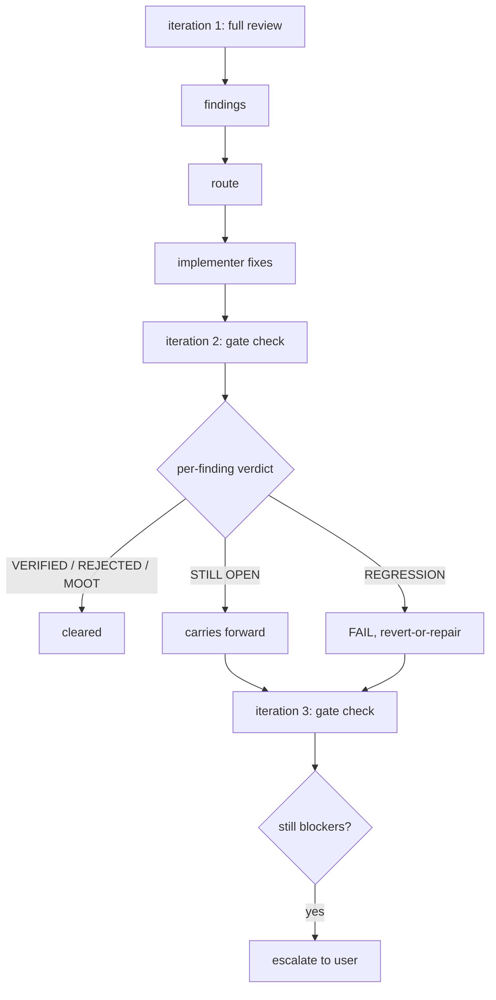

# Chapter 11 — Reviewing changed code: the dimensional review agents

A code review in this workflow is not one reviewer reading a diff top to bottom. It is a fan-out: the orchestrator picks a handful of specialist reviewers, each one responsible for a single *dimension* of quality, runs them all in parallel against the same diff, then folds their findings into one report. This chapter teaches that mechanism — how the dimensions are chosen for a given change, what each family of reviewers looks for, how findings are graded and de-duplicated, and how the fix-and-re-check loop terminates. It is the machine, taught once here, that runs at two scales: against a single step's diff in Phase B and against a whole track's diff in Phase C.

You arrive here with the implement-test-commit loop from Chapter 10 in your head. You saw that after the implementer commits a step, a `risk: high` step triggers a review before the episode is written; `medium` and `low` steps skip it and lean on the always-on track-level pass instead. Chapter 10 named that review and moved on. This chapter opens it up. Everything below applies identically whether the diff under review is one step or one track — Chapter 12 runs it at track scope and uses it to close a track, but the mechanism is the same, so we teach it once, in the neutral.

## One diff, several specialists

Start with a concrete change. A change adds a histogram to a B-tree leaf page in the storage engine, with a new test that exercises it. The diff touches a few files under `storage/` and `index/`, plus a test class. Which reviewers should read it?

A single generalist reviewer would have to hold every concern in mind at once: is the code readable, does it leak a buffer, does it survive a crash mid-write, is the test actually asserting anything, is the new loop quadratic. That reviewer dilutes. The workflow instead spawns one reviewer per concern. For this diff it spawns a *code quality* reviewer (conventions, readability, error handling), a *bugs and concurrency* reviewer (logic errors, race conditions, resource leaks), a *crash safety* reviewer (because the change touches durable storage), a *performance* reviewer (because it touches a data structure on a hot path), and the matching test reviewers that judge whether the new test verifies real behavior and covers the corner cases. Each reads the same diff through one lens and reports only what that lens catches. Nothing is held in one head; each concern gets a reviewer whose whole job is that concern.

That is the *dimensional review*: a code review decomposed into independent quality dimensions, one sub-agent per dimension, all run in parallel. The reviewers never edit code — they report findings, and a separate implementer applies the fixes (Chapters 10 and 12 own that hand-off). The two pieces this chapter has to make concrete are how the orchestrator decided to spawn *those* reviewers and not others, and what happens to the pile of findings they hand back.

## How the dimensions are chosen: triage on the diff

The reviewers are not all run on every change. Running a crash-safety reviewer on a one-line string-formatting fix wastes its budget and produces noise. So before any reviewer is spawned, the orchestrator does a *triage* pass over the diff: it categorizes each changed file, then maps the detected categories to the reviewers that have something to say about them.

Categorization reads signals in each file. A file under `storage/` or `wal/`, or one touching page read/write logic, is `storage-engine`. A file with `synchronized`, a `Lock`, an `Atomic*`, or a `volatile` is `concurrency`. A file under `server/` doing protocol or authentication work is `network-server`. WAL operations, crash simulation, or a Java `assert` in production code mark `crash-durability`. A file can carry several categories at once. A lock change inside storage code is both `storage-engine` and `concurrency`, and that is the point: the categories a file carries decide which reviewers see it. Files that match no category (a `.gitattributes`, say) take an `other` bucket that dispatches nothing.

The mapping from category to reviewer is *characteristic-based selection*: a reviewer fires when the diff carries a characteristic it cares about. The selection rule splits the reviewers into two groups. A small *baseline* group runs on essentially every code change, because the dimensions it covers are relevant to all of them. The rest are *conditional* — they fire only when a matching characteristic is present.

- **Baseline** (always, for any code change): code quality and bugs-and-concurrency on the production side, test-behavior and test-completeness on the test side. These four cover the dimensions every change has.
- **Crash safety** (`review-crash-safety`, plus its test counterpart `review-test-crash-safety`): fires on WAL, storage-engine, durability, atomic-operation, or crash-recovery characteristics.
- **Security** (`review-security`): fires on public API, authentication, user input, network, or serialization characteristics, or when a new dependency appears in `pom.xml`.
- **Performance** (`review-performance`, plus `review-test-concurrency`): fires on performance-sensitive paths, locks, contention, caching, large data structures, or algorithmic-complexity concerns.
- **Test structure** (`review-test-structure`): fires when tests are changed in ways that raise isolation, fixture, or lifecycle concerns.

The selection is a judgement call, not a rigid filter. The orchestrator reads the step or track description alongside the file list, and the standing rule when a reviewer's relevance is uncertain is to launch it: a reviewer that finds nothing costs a little time, but a reviewer that should have run and did not lets a real issue through. So the histogram-on-a-B-tree-page diff, reviewed at track scope, picks up the baseline four, crash safety and its test counterpart, and performance and its test-concurrency counterpart — seven reviewers fanned out at once. A track that merely refactors an internal utility class picks up the baseline four alone. The diff's shape sets the headcount.

That headcount is the track-scope reading, and it shifts at step scope. At a `risk: high` step the baseline group narrows: only the bugs-and-concurrency reviewer runs from it, because its findings (logic errors, races, leaks) get buried once the step's diff folds into the cumulative track diff. The other three baselines (code quality, test-behavior, and test-completeness) read the same off the cumulative diff, so they defer to the track pass rather than run twice. The conditional reviewers still fire on their characteristics. So the same histogram step reviewed in Phase B fans out bugs-and-concurrency plus crash safety, its test counterpart, and performance with test-concurrency: five at the step, the full seven only when the whole track is reviewed in Phase C.

**Figure 11.1 — Triage routes one diff to a selected set of dimensional reviewers.** The categories a file carries decide which conditional and workflow reviewers fire; the baseline group runs for any code change.

## A third family: reviewing the workflow itself

The two groups above review Java. But a change can edit the workflow machinery — the skills, agents, prompts, and rules under `.claude/`, the project `CLAUDE.md`, or the plan and design artifacts under `docs/adr/<dir>/`. (This book is itself written by following workflow machinery; the procedures it teaches are exactly the kind of files this family reviews.) Those files are markdown, shell, and JSON, not code, and they need their own reviewers. So there is a third family, the *workflow-review* group, that fires when the diff carries the `workflow-machinery` characteristic.

This family has six members, and what they check has no overlap with the code reviewers. A *consistency* reviewer hunts cross-file drift: a reference to a file or section that no longer exists, a threshold table in one file that disagrees with the prose citing it in another, a recipe path gone stale. A *prompt-design* reviewer reads a skill or agent file as the prompt to a language model that it is, and checks that its decision rules are deterministic, its description discriminable, its `$ARGUMENTS` handled. An *instruction-completeness* reviewer checks that every conditional has its complement, every gate has a resume path, every error has a recovery. A *hook-safety* reviewer checks shell hooks and scripts for `/tmp` collisions, idempotency, and secret hygiene. A *context-budget* reviewer guards how much of the always-loaded surface the change consumes. And a *writing-style* reviewer enforces the house style the book itself follows.

Two of the six, consistency and context-budget, launch on any workflow-machinery diff and decide internally whether the change actually touched their dimension, emitting an empty findings list when it did not. The other four fire on file-pattern triggers: prompt-design and instruction-completeness on `SKILL.md`, agent, and prompt files; hook-safety on `.sh` hooks, scripts, and `settings*.json`; writing-style on any `.claude/**/*.md` or ADR markdown. When a diff is workflow-only, the whole code-and-test side is skipped (there is no Java to read), so only this family runs. When a diff mixes Java and workflow files, both sides run, each scoped to its own files so neither wastes effort on the other's.

The full count is sixteen reviewers: five code, five test, six workflow. The triage step is what keeps that a manageable spawn rather than sixteen reviewers on every diff. The selection rules live in `.claude/workflow/review-agent-selection.md`, which the step-level and track-level review paths both consult, and they are mirrored verbatim into the standalone `/code-review` skill so the same diff selects the same reviewers whether the review runs inside the workflow or from the command line.

## Grading what comes back: the severities

Each reviewer hands back a list of findings, and not every finding is equal. The synthesis grades them onto one shared scale of three levels. A *blocker* must be fixed before the change can proceed. A *should-fix* ought to be fixed before merge. A *suggestion* is a recommended improvement the author can take or leave. (A fourth level, *skip*, exists only at track scope, where a reviewer can recommend abandoning the whole track; Chapter 12 covers that case.)

The reviewers do not all speak this scale natively. Most emit findings under `Critical / Recommended / Minor`, which map cleanly to blocker / should-fix / suggestion. But three of the older code reviewers carry their own vocabulary: bugs-and-concurrency grades `Critical / Likely Issues / Potential Concerns`, crash-safety grades `Critical / Concerning / Informational`, and security grades `Critical / High / Medium / Low`. The synthesis translates each onto the shared scale with a fixed table: `Likely Issues` and `Concerning` become should-fix, `Potential Concerns` and `Informational` become suggestion, security's `High` becomes a blocker. The translation is mechanical and the rule is one-directional: a reviewer's blocker is never quietly demoted. The only allowed move in the other direction is a *promotion* — raising a should-fix to a blocker when another reviewer's blocker on the same line argues the stakes are higher than either reviewer saw alone.

Every finding also carries an ID with a per-dimension prefix, and the prefix is how a finding stays addressable through the whole loop. Code quality emits `CQ1, CQ2, …`; bugs-and-concurrency emits `BC…`; crash-safety `CS`, security `SE`, performance `PF`; the test family runs `TB / TC / TS / TX / TY`; the workflow family runs `WC / WP / WI / WH / WB / WS`. The IDs are cumulative and do not reset between iterations, so when a finding survives a re-check it carries the same ID it was born with — into the fix commit and the gate-check verdict alike.

## Folding many lists into one: synthesis

Seven reviewers reading the same diff will flag the same line more than once. The histogram step's polling loop in its test might draw a bugs-and-concurrency finding ("fixed-sleep can mask a race"), a test-concurrency finding ("the timeout fires before the flush on slow CI; the suite hangs"), a performance finding ("the busy-loop wastes time"), a test-structure finding ("the long poll signals weak isolation"), and a code-quality finding ("prefer a latch over `Thread.sleep`") — five findings, one line. Handing the implementer five separate work items for one site would be wasteful and confusing.

*Finding synthesis* is the step that prevents that. It collapses findings that share a location into one bucket while keeping every contributing ID individually addressable inside it. Two findings merge when they share the same file, line range, and root issue; different lines never merge. The collapsed bucket takes the strictest severity among its members, so the five-way cluster above is a `blocker` because the CI-hang finding is; but each ID stays visible, so the implementer reads all five framings and decides at the code level whether they are one concern with one fix (here, await the flushed condition) or genuinely distinct edits at the same site.

Synthesis does one more thing the grading step could not: an *upgrade-only backstop*. It scans each finding's one-line rationale for an impact it names (a correctness bug, a crash, a CI hang, data loss) and upgrades any finding whose severity sits below what its own rationale implies. The classic miss it catches is a real CI-hang flagged as a mere `suggestion` because the reviewer framed it as a performance nit; the rationale says "the suite hangs," so the backstop raises it. The rule is upgrade-only by design: a missed upgrade ships a real bug, while a spurious upgrade just spends an implementer's time on a non-issue, the cheaper mistake. The output of synthesis is one ranked report — blockers, then should-fixes, then suggestions, each finding tagged with the dimensions that raised it, never a concatenation of seven reviewer transcripts.

## Fix, re-check, repeat: the iteration loop

A review is done only once its findings are resolved, not once they are listed. The findings route to an implementer, the implementer applies fixes and commits them, and then the same reviewers run again. That second pass is a *gate check*, not a fresh review: each reviewer is handed the specific findings it raised and asked, for each one, only whether the fix landed.

The loop is capped at three iterations. Iteration 1 is the full review just described: every selected reviewer reads the whole diff and reports. Iteration 2 is the first gate check: the reviewers verify their own findings against the fix commit and may flag a small number of regressions the fix introduced. If blockers remain, iteration 3 is a second gate check; if blockers still persist after that, the loop stops and escalates to the user rather than spinning forever.

A gate-check verdict is one of five words per finding. *VERIFIED* means the fix landed and addresses the issue. *REJECTED* means that on a second read the reviewer concludes the original finding was a false positive; this clears the finding just as VERIFIED does, and the verdict itself is the record of the recant. *MOOT* means the code the finding pointed at is gone (file deleted, approach changed); it also clears. *STILL OPEN* means the fix did not address the issue, so the finding carries forward into the next iteration under its original ID. *REGRESSION* means the fix actively broke working code; it forces the iteration to FAIL even if every other verdict is clean, and the implementer is told to revert-or-repair. An iteration passes only when every verdict is VERIFIED, REJECTED, or MOOT and no new blocker appeared.

**Figure 11.2 — The review iteration loop: one full review, then up to two gate checks, capped at three.**

The gate check is deliberately cheap. A full review re-read on every iteration would burn context fast: a Phase C session running eight reviewers plus a re-check fan-out can push the orchestrator past its context-warning threshold before iteration 2 even begins. So the gate-check reviewer is held to a tight output budget (a verdict line per finding, at most a few new findings, a one-line PASS/FAIL) and forbidden from re-surveying the whole diff or re-emitting its methodology and reviewer-notes sections. It already has the original finding text; all it owes is a verdict. The budget is asked of the reviewer, not enforced by the orchestrator: an over-budget report is accepted and the loop continues rather than retrying.

## What this chapter set up

You now have the review machine entire: triage categorizes a diff and selects the dimensions worth reviewing; baseline, conditional, and workflow families fan out one specialist per dimension; their findings are graded onto a three-level severity scale, given stable per-dimension IDs, and synthesized into one location-collapsed report with an upgrade-only severity backstop; and a capped iteration loop with cheap gate checks drives the findings to resolution or escalates. None of that was tied to a particular scope, because it is not — the identical mechanism runs against a single step's diff for a `risk: high` step in Phase B, and against the cumulative diff of a whole track in Phase C.

Chapter 10 showed you where the step-level run sits inside the implement-test-commit loop. The track-level run is the one that still owes you a chapter. Chapter 12 takes this machine to Phase C: it runs the dimensional review against the whole track's diff, wraps it in a conversational approval loop where you can steer which findings get fixed, delegates the fixes to a fresh implementer, and once the review passes writes the completion episode and closes the track. The question this chapter set up, and Chapter 12 answers, is how a reviewed track gets signed off and becomes done.

## Further reading

- `.claude/skills/code-review/SKILL.md` — the triage-and-dispatch procedure end to end: target resolution, the file-category table (§Step 5: Triage), the category-to-agent map for all sixteen reviewers (§5b), the edge cases for workflow-only and mixed diffs (§5d), the per-group prompt templates (§Step 6), and the severity translation and de-duplication recipe (§Step 7). The standalone `/code-review` command shares these agents with the in-workflow review.
- `.claude/workflow/review-agent-selection.md` — characteristic-based selection: the always-run baseline four (§Baseline agents), the conditional-agent characteristic table (§Conditional agents), which reviewers fire at a high step versus the full track pass (§Step-level vs track-level routing), and the six workflow-review agents with their file-pattern triggers (§Workflow-review agents, §Per-agent file-pattern triggers).
- `.claude/workflow/finding-synthesis-recipe.md` — the location-collapse that keeps every ID addressable (§`loc`-collapse without a body read), the worked five-way `Thread.sleep` example (§Worked example), the upgrade-only severity backstop (§Step 2), and the bucketing into in-scope / deferred / plan-correction (§Step 3).
- `.claude/workflow/review-iteration.md` — the iteration limits and escalation (§Limits), the per-dimension finding-ID prefix table (§Finding ID prefixes), the four severity levels (§Severity levels), and the iteration-then-gate-check flow (§Iteration flow).
- `.claude/workflow/prompts/dimensional-review-gate-check.md` — the gate-check contract: the five verdicts and when each applies, the PASS/FAIL rule, the strict ≤60-line output budget, and the sections forbidden at gate-check time.
- `.claude/workflow/code-review-protocol.md` — the two-tier framing: step-level review for `risk: high` steps versus the always-on track-level review, the baseline split between the two levels, and the single-step-track skip rule.
- `.claude/agents/review-*.md` — the sixteen dimensional review agents themselves (five code, five test, six workflow), each declaring the dimension it owns and the native severity scale it emits before synthesis translates it.
