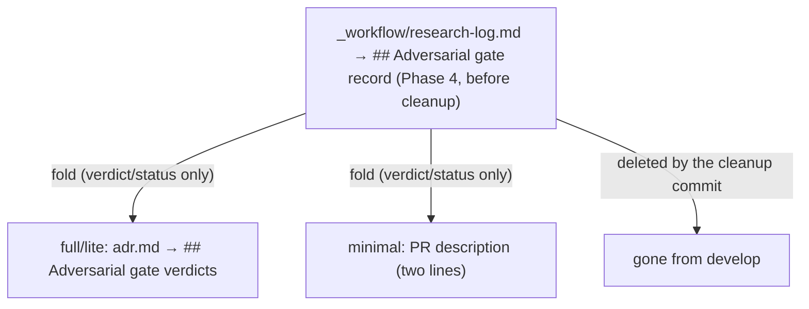
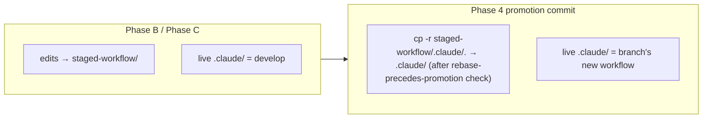

# Chapter 13 — Phase 4: final artifacts and merge

What survives the merge into `develop` is decided by your tier, and Phase 4 is where that decision is paid out. A `full` change leaves behind a `design-final.md` and an `adr.md`; a `lite` change leaves an `adr.md`; a `minimal` change leaves nothing under `docs/adr/` at all, only a two-line note in the pull-request description. This chapter walks the closing phase: the per-tier durable artifacts, the one read of the research log that captures its adversarial verdict before the log is deleted, the promotion and cleanup commits, and the staging that has kept a workflow-modifying branch off the live workflow until now.

In [Chapter 12](12-phase-c-track-review-completion.md) you watched the last track close: its dimensional review cleared, its completion episode landed in the track file, and the phase ledger advanced. Every track is now done. [Chapter 3](03-tiers-and-the-tier-gate.md) told you which carrier your tier would leave in `develop` (Table 3.1's last row named it) but deferred the closing step to here. This is that step. Phase 4 produces the carrier, folds in the evidence that the working files are about to lose, and then strips the scaffolding so the squash-merge carries only the durable record plus the implemented code.

## A fresh session opens at Phase 4

Phase 4 runs in its own session, like every other phase. You clear the previous session, start `/execute-tracks`, and the startup auto-resume reads the phase ledger, sees phase `D` recorded, and routes you into the final-artifacts work. The instructions live in `prompts/create-final-design.md`, run under the `final-designer` role.

The fresh session matters here for the same reason it mattered in every earlier phase: context bleed. The final artifacts are committed to `develop` and read by engineers who were not in the room, so their diagrams and decision records must match the code that actually shipped, not the plan that was guessed at Phase 1. A session carrying the full execution history would be tempted to transcribe the plan. A fresh session reads the implemented code first and writes from it.

That is the first rule of the phase. The artifacts reflect the *actual implementation*. The session reads the plan and the track episodes as a guide to where to look, then reads the real classes, interfaces, and call sites — through the IDE's symbol index where it is reachable, because a missed polymorphic call site or a stale signature would mislead every future reader of the committed artifact. The plan is the starting map; the code is the record of fact.

## The tier decides which artifacts you write

Before writing anything, the session confirms the tier — ledger first, the `tier` field in `phase-ledger.md`, last value wins. That one fact decides the entire shape of the phase, so it is read before any artifact is produced.

The split follows the boundary [Chapter 3](03-tiers-and-the-tier-gate.md) drew. Gate 2, the multi-track question, is the durable-ADR boundary: a multi-track change (`full` or `lite`) earns a committed entry under `docs/adr/<dir-name>/` for future archaeology, and a single-track `minimal` change documents itself the way any small pull request does. Three tiers, three artifact sets.

**Table 13.1 — what each tier produces in Phase 4.**

| Tier | Durable artifacts | Verdict fold lands in | `docs/adr/<dir>/` entry |
|---|---|---|---|
| `full` | `design-final.md` + `adr.md` | `adr.md` | yes |
| `lite` | `adr.md` only | `adr.md` | yes |
| `minimal` | none — a two-line PR-description summary | PR description | no |

The asymmetry between `full` and `lite` turns on one fact: a `design-final.md` is the as-built version of a `design.md`, and a `design.md` exists only in `full`. In `lite` and `minimal` there was never a design document to carry forward, so there is nothing to write a final design *from*. That is why `lite` produces only the `adr.md`, where the architecture decisions and the adversarial verdict live alone, and why `minimal` produces no `docs/adr/` entry at all.

The two `full` artifacts divide the work cleanly. The `design-final.md` answers "what does the system look like now": the class diagrams, the workflow diagrams, and the dedicated sections for the hard parts, all redrawn against the code that shipped. The `adr.md` answers "what did we decide and how did it turn out" — the decision records from the plan, each updated for its actual outcome, plus the discoveries that only surfaced during execution. One is a picture of the result; the other is the record of the choices that produced it.

### The final design is written through the mutation discipline

A `design-final.md` is not written with a plain `Write` call. It routes through the same `edit-design` mutation discipline that gated every change to the original `design.md` back in Phase 1 ([Chapter 5](05-phase-1-design-document.md)): apply the edit, run the mechanical checks, run a whole-document cold read through a review sub-agent, iterate if the read finds problems, then present the result. The final design is durable documentation, so it earns the same gate the original design did.

The cold read carries one extra check at Phase 4 that it did not carry at Phase 1: the artifact must stand on its own as committed documentation, with no leaked working-file identifiers. This is the *ephemeral-identifier rule*, and it shapes both artifacts. The working files name things the merged tree will never contain — `Track 3`, `Step 2 of Track 4`, review-finding IDs like `F55`, `_workflow/` paths. Those names are about to be deleted. A decision record that says "Implemented in: Track 3 Step 2" becomes a dangling reference the moment the cleanup commit runs, so the rule rewrites every such line into something that survives: a prose description, a file or class reference, or a commit SHA. The Key Discoveries section of the `adr.md` is the most frequent leak site, because it is synthesized from step episodes that are dense with track and step labels; each discovery is rewritten to stand alone, keeping the substance and a file reference but dropping the scaffolding numbers.

## The verdict fold: one last read before the log dies

The `adr.md` carries one section the plan never had: the folded adversarial verdict. Understanding it requires remembering what the research log was.

Back in Phase 0 ([Chapter 4](04-phase-0-research.md)), the research log accumulated the pre-code decision trail, and at the Phase 0 → 1 boundary an adversarial review ran on it as a gate — the design had to clear that review before any plan derived from it. The log recorded the outcome of that gate in its `## Adversarial gate record` section: which run passed, whether blockers were raised and resolved, how many iterations it took. That record is the evidence that the design was attacked before code was written and held up.

The research log does not survive the merge. Like every working file, it lives under `_workflow/` and is deleted in the Phase 4 cleanup. So before the cleanup runs, Phase 4 reads the gate record one last time and folds its verdict into the durable carrier. The fold copies the *verdict and status only*: the resolved outcome (passed, or blockers-resolved-then-passed) and the iteration count, from the latest dated heading in `research-log.md`'s `## Adversarial gate record` section. It never copies the decision content itself; the decisions already live in the decision records. This is the single sanctioned read of the research log at Phase 4, and it reads the verdict, not the reasoning.

The fold runs in every tier, because the log dies in every tier. Only its destination changes with the tier. In `full` and `lite` the verdict lands in the `## Adversarial gate verdicts` section of `adr.md`. In `minimal`, where there is no `adr.md`, it lands as a two-line block in the pull-request description, something like "Adversarial gate: passed (research-log Phase-0→1 gate, 2 iterations)", which the squash-merge carries into `develop`'s `git log`. The evidence base outlives the file that held it, in whatever durable home the tier provides.



**Figure 13.1 — the adversarial verdict folds out of the research log into the tier's durable carrier, then the log is deleted.**

The source files disagree on one detail, so name it once: the durable log on disk is `research-log.md`. Some workflow prose still calls it `research.md` in passing — that bare name is stale. When you go looking for the gate record to fold, you open `research-log.md`'s `## Adversarial gate record` section.

The `adr.md` closes with one more section, written last: a token-usage telemetry block, generated verbatim by a measurement script and pasted in unchanged. It is the only section with a fixed run-last ordering, because it snapshots the finished ADR. You do not hand-write its heading; the script's first output line *is* the heading.

## The commit shapes, per tier and modification class

With the artifacts on disk and the verdict folded, Phase 4 commits. How many commits depends on two facts: the tier, and whether the branch is workflow-modifying. The base shape is two commits, the final-artifacts commit then a cleanup commit, and the two variables bend it from there.

The **final-artifacts commit** stages only the top-level durable artifacts the tier produced: `design-final.md` plus `adr.md` in `full`, `adr.md` alone in `lite`. It stages nothing under `_workflow/`. Under `minimal` this commit does not exist at all — the verdict already went into the PR description, and there is no `docs/adr/` entry to commit, so the phase has nothing to add here.

The **cleanup commit** runs in every tier, `minimal` included. It is a single recursive removal:

```bash
git rm -r docs/adr/<dir-name>/_workflow/
git commit -m "Remove workflow scaffolding"
git push
```

That one command sweeps the entire scaffolding: the plan, the `design.md` if there was one, the research log, every track file, the per-track review files nested under `plan/track-N/reviews/`, and the design-mutations log. The recursion is deliberate — it catches the nested review directories without a glob that might also catch the `plan/track-N.md` files. After it lands, the only things left under `docs/adr/<dir-name>/` are the durable artifacts the tier produced, and the squash-merge folds the deletion into the branch's history so `develop` sees only the durable record plus the shipped code.

The two variables combine into four shapes:

- **`full`/`lite`, non-workflow-modifying**: two commits, final-artifacts then cleanup.
- **`full`/`lite`, workflow-modifying**: three commits, a promotion commit first, then final-artifacts, then cleanup.
- **`minimal`, non-workflow-modifying**: one commit, cleanup only. The fold went into the PR description; there is no final-artifacts commit.
- **`minimal`, workflow-modifying**: two commits, promotion then cleanup. The shed removes the `adr.md` and the final-artifacts commit, but not the promotion.

The promotion commit is the new piece, and it exists only on workflow-modifying branches. The next section explains why.

## Why a workflow-modifying branch promotes at the end

A branch that edits the workflow itself (anything under `.claude/workflow/`, `.claude/skills/`, `.claude/agents/`, or `.claude/scripts/`) has a problem the ordinary branch does not. The branch is *running* the workflow while *editing* it. If those edits landed on the live `.claude/` tree as they were made, the branch would be rewriting the rules out from under its own execution: a plan citation would resolve against a half-edited rule body, a reviewer would see an inconsistent procedure, and the drift gate at the next session start would flag the branch's own authoring as drift on itself.

The fix is *staging*, the convention in `conventions.md` §1.7. Throughout execution, every edit to a workflow path is written not to the live file but to a mirror under the plan's `_workflow/staged-workflow/.claude/` subtree. The live workflow files in the branch's checkout stay at `develop`'s state for the whole of Phase B and Phase C. Plan citations resolve against a stable surface, reviewers read one consistent rule body, and the drift gate has nothing of the branch's own to mistake for drift. The branch builds its new workflow off to the side while running the old one.

That arrangement has to end somewhere, and Phase 4 is where it ends. The **promotion commit** copies the staged subtree onto the live tree in one move (`cp -r` from `_workflow/staged-workflow/.claude/` over `.claude/`), then commits it just before the final-artifacts commit lands. From that point the branch's checkout carries the new workflow on its live paths, and the merge carries it into `develop`. The day-to-day discipline of staging (how each write is routed, the copy-then-edit-on-first-touch rule, what a reviewer reads) belongs with the drift material in [Chapter 15](15-drift-and-migration.md); here the only piece that matters is the endpoint. Staging defers the live edit, and promotion is the deferred edit finally applied.



**Figure 13.2 — staging keeps the live workflow at develop's state during execution; the Phase 4 promotion commit copies the staged edits onto the live tree.**

Two properties of the promotion guard the move. First, it is *additive only*: `cp -r` lays the staged files over the live tree, propagating additions and modifications but not deletions. A branch that needs to retire a live workflow file cannot route the deletion through staging; that deletion lands separately. Second, promotion fires only when there is something to promote — the guard checks for the `.claude/` subdirectory under `staged-workflow/`, so a non-workflow-modifying branch (which never created that subtree) skips the promotion commit silently and keeps the two-commit shape.

### Rebase precedes promotion

The promotion has one precondition that protects `develop`. Because `cp -r` overwrites live files, a branch that has fallen behind `develop` could silently clobber a workflow change that landed on `develop` after the branch took its staging copy. Imagine `develop` fixed a rule in a file your branch also staged; your stale staged copy does not have that fix, and the `cp -r` would overwrite the fixed live file with your fix-less version.

So before it copies anything, the promotion step runs a divergence sanity check. It fetches `origin/develop` and computes whether `origin/develop` carries any workflow commits the branch has not absorbed — the `branch-divergence-check.md` logic, scoped to the four workflow path prefixes. A non-empty result halts the step with a manual-reconciliation instruction: rebase the branch onto current `origin/develop`, then restart Phase 4. Rebasing brings the branch's base up to date, so the only workflow content left for the promotion to write is the branch's own staged authoring against that current base. This is the *rebase-precedes-promotion* rule (§1.7(f)), and it is the reason the promotion can overwrite the live tree without losing a `develop`-side change.

## Closing the phase, and the branch

After the last commit pushes, Phase 4 runs the end-of-session self-improvement reflection (the loop that files workflow-improvement issues, which [Chapter 16](16-house-style-self-improvement.md) covers) and then tells you the branch is ready. One thing it does *not* do: it never flips the draft pull request to "ready for review." That is your call. You read the artifacts, satisfy yourself the branch is done, and run `gh pr ready` by hand. The workflow stops at the edge of that decision deliberately.

The phase ledger records the final state. While Phase 4 is pending the tail reads phase `D`; once the last commit lands it reads `Done`. A fresh session that starts on this branch now reads `Done` and knows there is nothing left to run.

That closes the change. You have followed one all the way through: tier gate, research log, design, plan, tracks, steps, episodes, reviews, and now the durable artifacts that survive the merge. The remaining chapters step outside the happy path. The change you just followed went straight through; real changes do not always. [Chapter 14](14-mid-flight-changes.md) covers what happens when a plan turns out wrong mid-flight, a session runs low on context, or a step fails twice — the recovery paths the workflow folds back into the phases you now know. [Chapter 15](15-drift-and-migration.md) then takes up the question this chapter raised but deferred: a workflow-modifying branch stages its edits and promotes them at the end, but how does a long-lived branch stay current with a workflow that keeps changing under it while the branch runs? That is the drift-and-migration story, and the staging you met here is its first half.

## Further reading

- `.claude/workflow/prompts/create-final-design.md` (Steps 3–8): the per-tier artifact production, the ephemeral-identifier rule, the verdict fold, and the promotion, final-artifacts, and cleanup commits.
- `.claude/workflow/workflow.md` (§Final Artifacts): the per-tier durable-artifact table and the four per-tier-and-modification-class commit shapes.
- `.claude/workflow/conventions.md` (§1.7): the staging convention — the staged-subtree path layout, additive-only promotion, and the rebase-precedes-promotion rule (§1.7(f)).
- `.claude/workflow/branch-divergence-check.md`: the divergence logic the pre-promotion sanity check reuses, scoped to the workflow path prefixes.
- `.claude/workflow/research.md` (§Adversarial gate record): the verdict carrier the fold reads, and its gate-record cadence.
